# Admin API Architecture

<cite>
**Referenced Files in This Document**   
- [app.js](file://apps/admin-api/src/app.js)
- [config.js](file://apps/admin-api/src/config.js)
- [server.js](file://apps/admin-api/server.js)
- [routes/index.js](file://apps/admin-api/src/routes/index.js)
- [middleware/auth.js](file://apps/admin-api/src/middleware/auth.js)
- [middleware/error-handler.js](file://apps/admin-api/src/middleware/error-handler.js)
- [middleware/request-id.js](file://apps/admin-api/src/middleware/request-id.js)
- [middleware/security.js](file://apps/admin-api/src/middleware/security.js)
- [services/guild.service.js](file://apps/admin-api/src/services/guild.service.js)
- [lib/database.js](file://apps/admin-api/src/lib/database.js)
- [middleware/cache.js](file://apps/admin-api/src/middleware/cache.js)
- [routes/guilds.js](file://apps/admin-api/src/routes/guilds.js)
- [services/uploads.js](file://apps/admin-api/src/services/uploads.js)
</cite>

## Table of Contents
1. [Introduction](#introduction)
2. [Project Structure](#project-structure)
3. [Core Components](#core-components)
4. [Architecture Overview](#architecture-overview)
5. [Detailed Component Analysis](#detailed-component-analysis)
6. [Dependency Analysis](#dependency-analysis)
7. [Performance Considerations](#performance-considerations)
8. [Troubleshooting Guide](#troubleshooting-guide)
9. [Conclusion](#conclusion)

## Introduction
The Admin API backend service in the slimy-monorepo is an Express.js-based application that provides administrative functionality for managing guilds, users, and system settings. This document details the layered architecture of the service, focusing on the request flow through routes, middleware, services, and data access layers. The architecture emphasizes security, scalability, and maintainability through well-defined separation of concerns, comprehensive error handling, and integration with modern tools like Prisma ORM and Redis for database operations and session management.

## Project Structure
The Admin API follows a conventional Express.js application structure with clear separation of concerns. The core application logic resides in the `src` directory, which contains distinct folders for middleware, routes, services, and utilities. The middleware directory houses authentication, security, and request processing components. The routes directory contains endpoint definitions organized by functionality, with an aggregator in `routes/index.js`. The services directory implements business logic, while data access is managed through the `lib/database.js` module. Configuration is centralized in `config.js`, and the application entry point is `server.js` which initializes the database connections and starts the Express server.

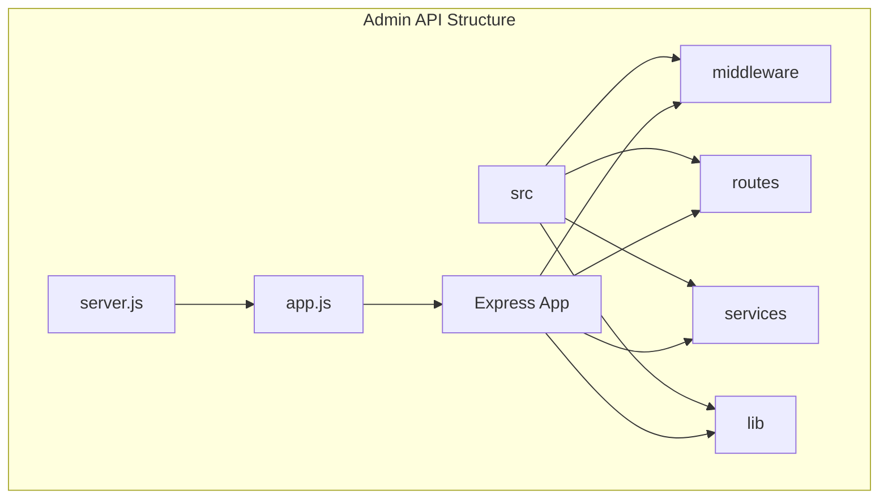

**Diagram sources**
- [src](file://apps/admin-api/src)
- [server.js](file://apps/admin-api/server.js)
- [app.js](file://apps/admin-api/src/app.js)

**Section sources**
- [src](file://apps/admin-api/src)
- [server.js](file://apps/admin-api/server.js)

## Core Components
The Admin API consists of several core components that work together to handle HTTP requests, authenticate users, process business logic, and interact with the database. The application follows a layered architecture where requests flow from routes through middleware to services and finally to data access components. Key components include the Express application instance, authentication middleware, routing system, service layer for business logic, and Prisma-based data access layer. The configuration system manages environment-specific settings, while comprehensive error handling ensures robust operation.

**Section sources**
- [app.js](file://apps/admin-api/src/app.js)
- [config.js](file://apps/admin-api/src/config.js)
- [server.js](file://apps/admin-api/server.js)

## Architecture Overview
The Admin API implements a layered architecture with a clear request flow: routes → middleware → services → data access. When a request arrives, it first passes through various middleware components that handle cross-cutting concerns like request ID generation, security headers, authentication, and input validation. Once the request is processed by middleware, it reaches the appropriate route handler, which delegates business logic to service layer components. These services interact with the data access layer to persist or retrieve data from the database. The response then flows back through the middleware chain before being sent to the client.

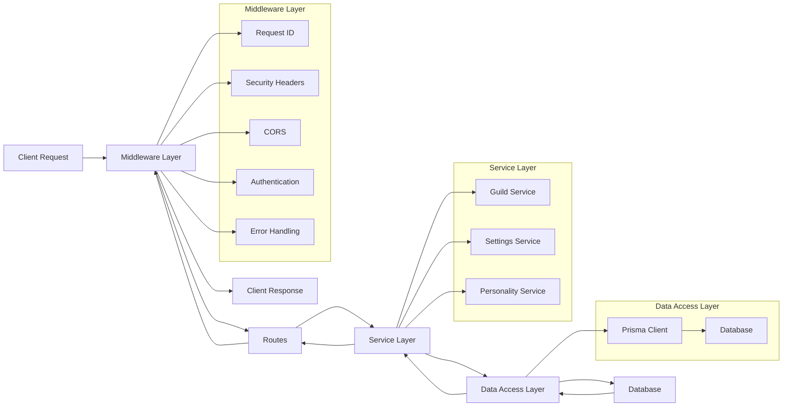

**Diagram sources**
- [app.js](file://apps/admin-api/src/app.js)
- [middleware](file://apps/admin-api/src/middleware)
- [routes](file://apps/admin-api/src/routes)
- [services](file://apps/admin-api/src/services)
- [lib/database.js](file://apps/admin-api/src/lib/database.js)

## Detailed Component Analysis

### Request Flow and Middleware Components
The Admin API employs a comprehensive middleware stack to handle various aspects of request processing. The request flow begins with infrastructure middleware that sets up request IDs, logging, and security headers, followed by authentication and authorization middleware that verifies user identity and permissions. After the business logic is processed by route handlers and services, error handling middleware catches and formats any exceptions before the response is sent to the client.

#### Request ID Generation
The request ID middleware generates a unique identifier for each incoming request, which is used for tracing and logging purposes throughout the request lifecycle. This helps in debugging and monitoring by allowing all log entries for a specific request to be correlated.

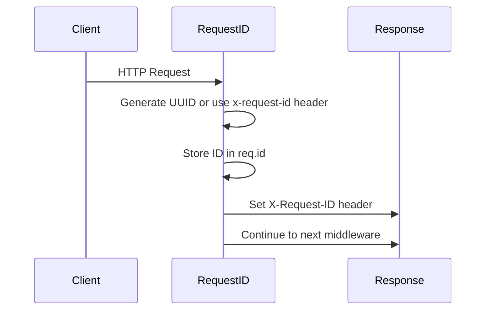

**Diagram sources**
- [middleware/request-id.js](file://apps/admin-api/src/middleware/request-id.js)

#### Authentication Middleware
The authentication system uses a flexible approach to verify user identity, supporting both JWT tokens and database-stored session tokens. The `readAuth` middleware attempts to authenticate users by checking cookies with various names and validating the token against either the JWT secret or the database session store.

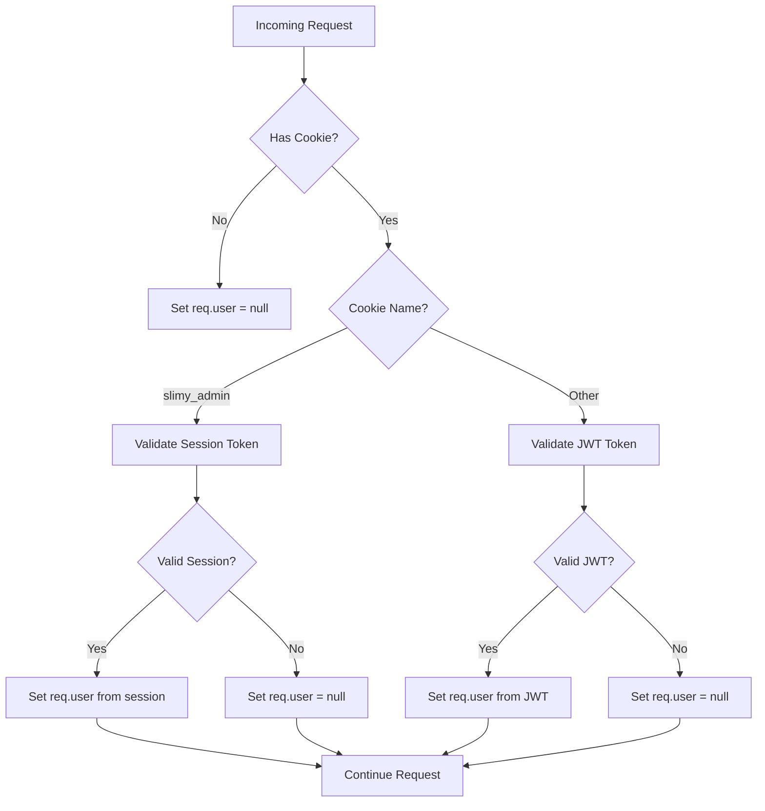

**Diagram sources**
- [middleware/auth.js](file://apps/admin-api/src/middleware/auth.js)

#### Security Middleware
The security middleware implements multiple layers of protection including CORS, helmet security headers, rate limiting, and input sanitization. This comprehensive approach helps protect against common web vulnerabilities such as XSS, CSRF, and DDoS attacks.

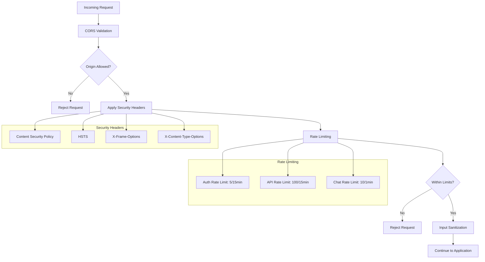

**Diagram sources**
- [middleware/security.js](file://apps/admin-api/src/middleware/security.js)

#### Error Handling
The error handling middleware provides a consistent way to handle both operational and unexpected errors. It logs error details with request context and returns standardized error responses to clients while preventing sensitive information from being exposed in production.

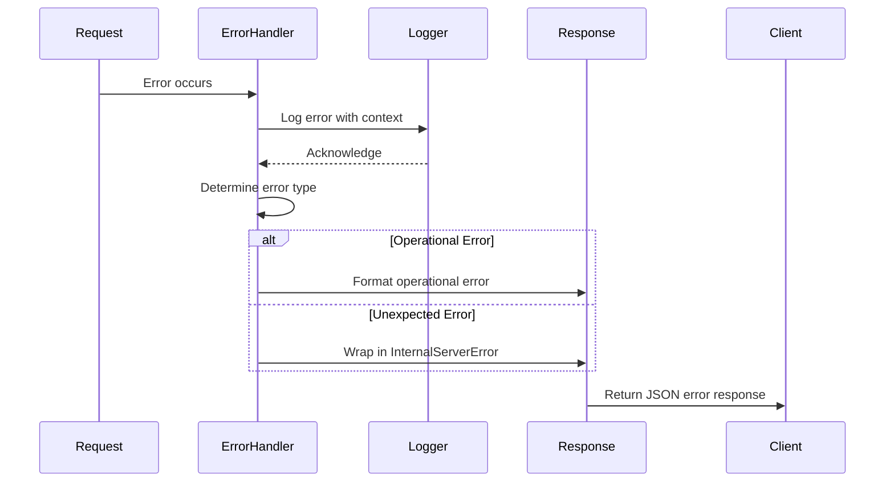

**Diagram sources**
- [middleware/error-handler.js](file://apps/admin-api/src/middleware/error-handler.js)

### Routing Structure
The routing system in the Admin API is organized around a central aggregator pattern, where individual route files are imported and mounted on the main router in `routes/index.js`. This approach allows for modular route organization while maintaining a single entry point for the application.

```mermaid
graph TD
A[app.js] --> B[Express Router]
B --> C[routes/index.js]
C --> D[authRoutes]
C --> E[guildRoutes]
C --> F[settingsRoutes]
C --> G[personalityRoutes]
C --> H[uploadsRoutes]
C --> I[diagRoutes]
C --> J[botRoutes]
C --> K[statsRoutes]
C --> L[chatRoutes]
C --> M[clubRoutes]
C --> N[usageRoutes]
subgraph "Route Handlers"
D --> D1[/api/auth]
E --> E1[/api/guilds]
F --> F1[/api/guilds]
G --> G1[/api/guilds]
H --> H1[/api/uploads]
I --> I1[/api/diag]
J --> J1[/api/bot]
K --> K1[/api/stats]
L --> L1[/api/chat]
M --> M1[/api/club]
N --> N1[/api/usage]
end
B --> O[Static File Serving]
O --> P[/api/uploads/files]
```

**Diagram sources**
- [routes/index.js](file://apps/admin-api/src/routes/index.js)
- [app.js](file://apps/admin-api/src/app.js)

### Service Layer Implementation
The service layer in the Admin API encapsulates business logic and provides a clean interface between route handlers and data access components. Services are responsible for implementing domain-specific functionality, validating inputs, and coordinating operations across multiple data entities.

#### Guild Service Implementation
The `guild.service.js` file provides a comprehensive implementation of guild management functionality, demonstrating the service layer pattern in action. The service class exposes methods for creating, reading, updating, and deleting guilds, as well as managing members and their roles.

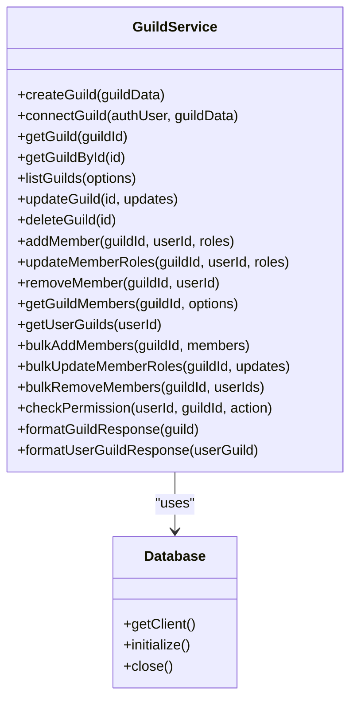

**Diagram sources**
- [services/guild.service.js](file://apps/admin-api/src/services/guild.service.js)
- [lib/database.js](file://apps/admin-api/src/lib/database.js)

The service layer follows several key principles:
- **Separation of Concerns**: Business logic is separated from route handling and data access
- **Error Handling**: Specific error types are thrown for different failure scenarios
- **Data Formatting**: Response data is formatted consistently before being returned
- **Validation**: Input parameters are validated before processing
- **Transaction Management**: Database operations are properly scoped and handled

The `connectGuild` method demonstrates the complexity that can be encapsulated within a service, handling user and guild upsert operations, establishing relationships, and managing database transactions - all while providing a simple interface to the route handlers.

### Data Access and Integration
The data access layer in the Admin API is built on Prisma ORM, which provides a type-safe interface for database operations. The `Database` class in `lib/database.js` serves as a singleton wrapper around the Prisma client, managing connection lifecycle and providing convenience methods for common operations.

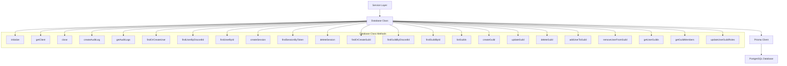

**Diagram sources**
- [lib/database.js](file://apps/admin-api/src/lib/database.js)

The integration with Redis is currently implemented as a mock cache, but the architecture supports real Redis caching through the `getCache` function in `lib/cache/redis.js`. This allows for future implementation of caching strategies to improve performance.

### Static File Serving and Security
The Admin API configures static file serving for uploaded files, with appropriate cache headers to optimize performance. The security configuration includes helmet middleware to set various HTTP security headers that protect against common web vulnerabilities.

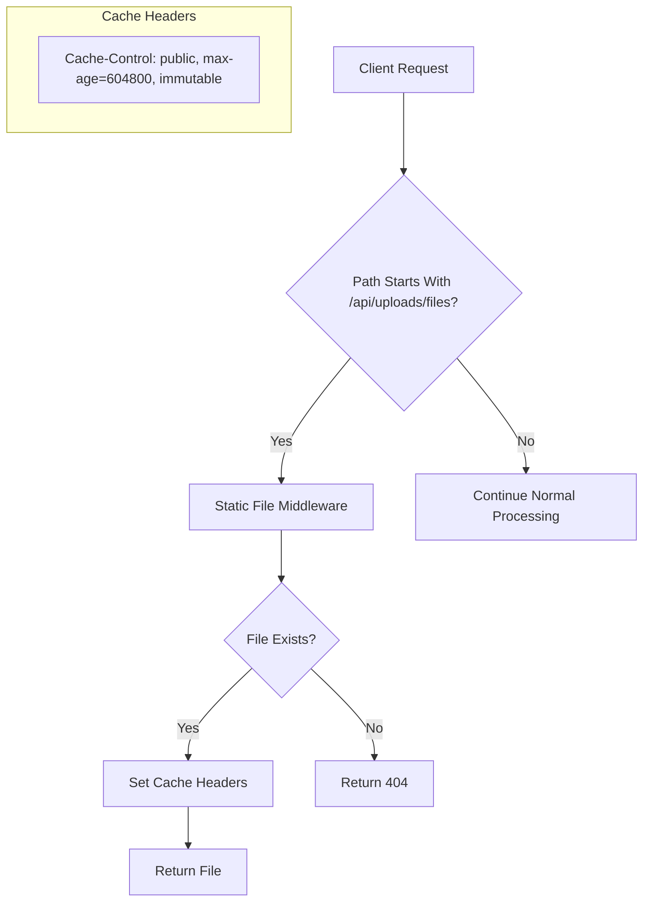

**Diagram sources**
- [app.js](file://apps/admin-api/src/app.js)
- [services/uploads.js](file://apps/admin-api/src/services/uploads.js)

## Dependency Analysis
The Admin API has a well-defined dependency structure with clear boundaries between components. The application depends on Express.js for HTTP handling, Prisma for database access, and various middleware packages for security and utility functions. The internal dependency graph shows a clean separation of concerns with higher-level components depending on lower-level ones, but not vice versa.

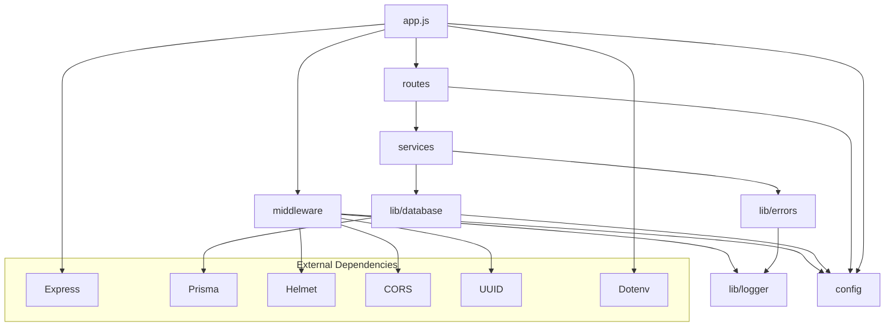

**Diagram sources**
- [package.json](file://apps/admin-api/package.json)
- [app.js](file://apps/admin-api/src/app.js)
- [lib/database.js](file://apps/admin-api/src/lib/database.js)

## Performance Considerations
The Admin API incorporates several performance optimizations to ensure responsive operation under load. These include request size limits, rate limiting, caching strategies, and efficient database query patterns.

### Request Processing Optimization
The application configures several limits to prevent abuse and ensure stable performance:
- Request body size limited to 1MB for JSON requests
- Upload file size limited to 6MB
- Rate limiting on authentication endpoints (5 attempts per 15 minutes)
- Rate limiting on API endpoints (100 requests per 15 minutes)
- Rate limiting on chat endpoints (10 requests per minute)

### Caching Strategy
The API implements a caching layer through the `APICache` class, which supports both simple caching and stale-while-revalidate patterns. This allows frequently accessed data to be served from cache while background processes can refresh the data without blocking requests.

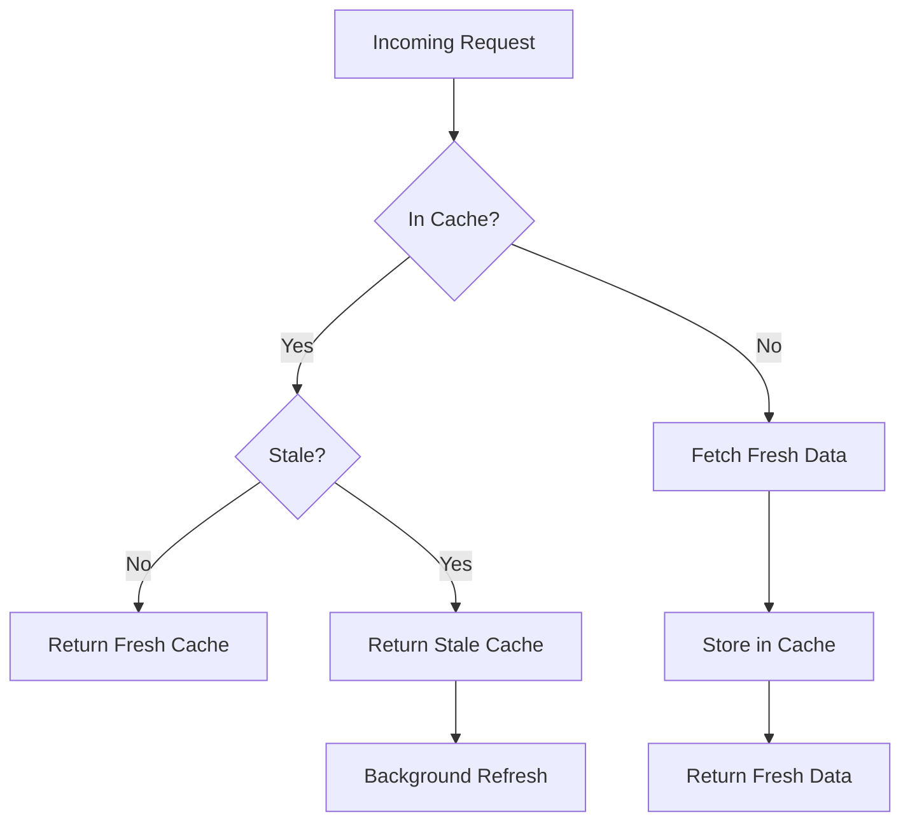

**Diagram sources**
- [middleware/cache.js](file://apps/admin-api/src/middleware/cache.js)

### Database Performance
The data access layer includes several performance optimizations:
- Query instrumentation to measure database operation duration
- Connection pooling through Prisma
- Efficient query patterns with proper indexing
- Batch operations for bulk updates

## Troubleshooting Guide
When troubleshooting issues with the Admin API, consider the following common scenarios and their solutions:

### Authentication Issues
- **Symptom**: Users cannot log in or are frequently logged out
- **Possible Causes**: 
  - JWT secret mismatch between services
  - Session expiration settings too aggressive
  - Cookie domain or secure flag misconfiguration
- **Diagnostic Steps**:
  - Check JWT_SECRET environment variable consistency
  - Verify cookie settings in config.js
  - Examine authentication logs for error patterns

### Database Connection Problems
- **Symptom**: Application fails to start or database operations timeout
- **Possible Causes**:
  - Incorrect database URL configuration
  - Database server unreachable
  - Connection limits exceeded
- **Diagnostic Steps**:
  - Verify DATABASE_URL environment variable
  - Check database server status and network connectivity
  - Review connection pool settings

### Performance Degradation
- **Symptom**: Slow response times or timeouts
- **Possible Causes**:
  - Unoptimized database queries
  - Missing indexes on frequently queried fields
  - Insufficient caching
- **Diagnostic Steps**:
  - Enable query logging to identify slow operations
  - Check database query execution plans
  - Monitor cache hit rates

**Section sources**
- [ERROR_HANDLING.md](file://apps/admin-api/ERROR_HANDLING.md)
- [MONITORING_README.md](file://apps/admin-api/MONITORING_README.md)

## Conclusion
The Admin API backend service in the slimy-monorepo demonstrates a well-architected Express.js application with a clear layered structure. The request flow from routes through middleware to services and data access components provides a maintainable and scalable foundation. Key strengths include comprehensive security measures, robust error handling, and a clean separation of concerns between components. The integration with Prisma ORM simplifies database operations while maintaining type safety, and the modular middleware system allows for flexible extension of functionality. Future improvements could include implementing the full Redis caching functionality and enhancing monitoring capabilities.