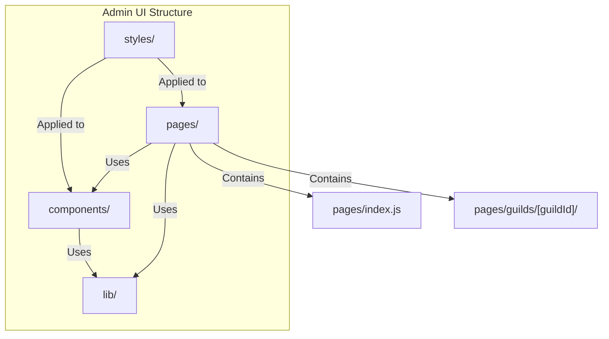
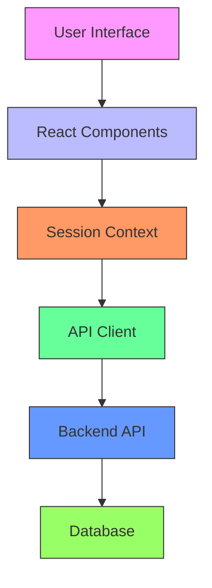
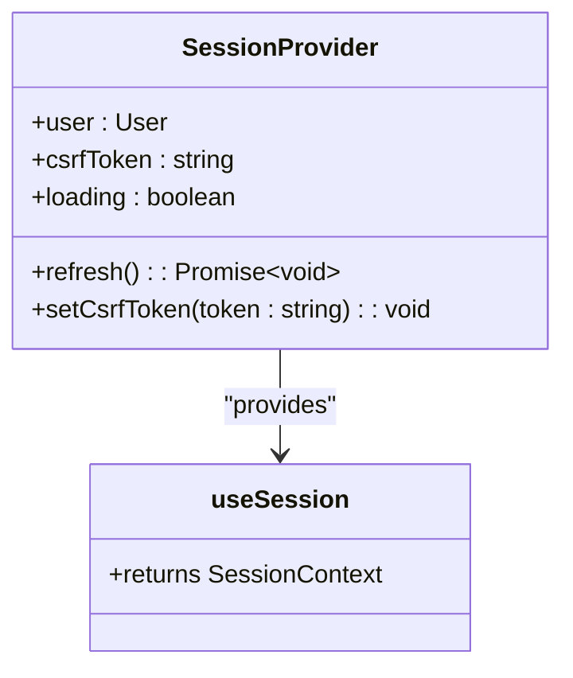
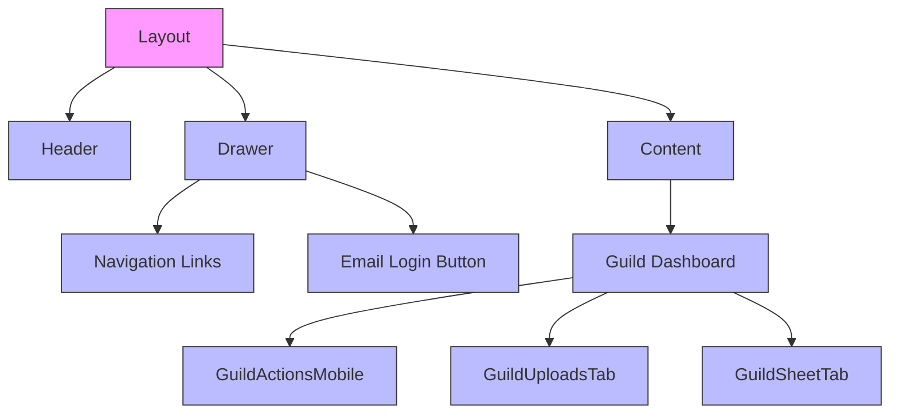
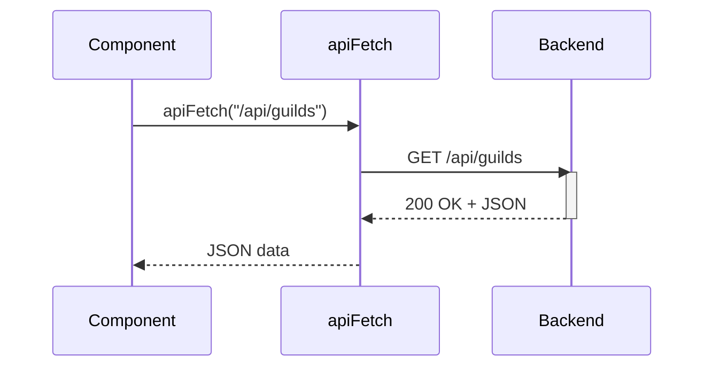
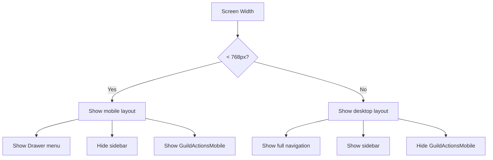
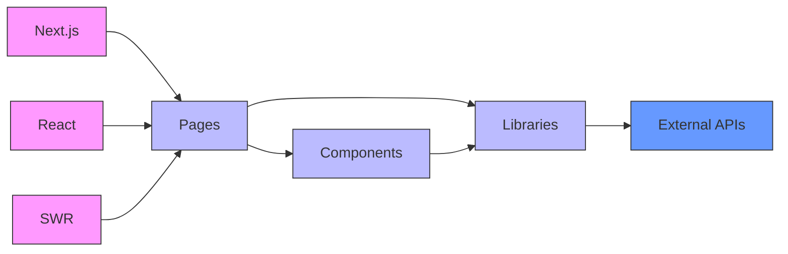

# Admin UI Architecture

<cite>
**Referenced Files in This Document**   
- [apps/admin-ui/pages/_app.js](file://apps/admin-ui/pages/_app.js)
- [apps/admin-ui/lib/session.js](file://apps/admin-ui/lib/session.js)
- [apps/admin-ui/lib/api.js](file://apps/admin-ui/lib/api.js)
- [apps/admin-ui/pages/index.js](file://apps/admin-ui/pages/index.js)
- [apps/admin-ui/components/Drawer.js](file://apps/admin-ui/components/Drawer.js)
- [apps/admin-ui/pages/guilds/index.js](file://apps/admin-ui/pages/guilds/index.js)
- [apps/admin-ui/pages/guilds/[guildId]/index.js](file://apps/admin-ui/pages/guilds/[guildId]/index.js)
- [apps/admin-ui/components/GuildActionsMobile.jsx](file://apps/admin-ui/components/GuildActionsMobile.jsx)
- [apps/admin-ui/styles/responsive.css](file://apps/admin-ui/styles/responsive.css)
- [apps/admin-ui/components/Layout.js](file://apps/admin-ui/components/Layout.js)
- [apps/admin-ui/lib/discord.js](file://apps/admin-ui/lib/discord.js)
- [apps/admin-ui/pages/login.js](file://apps/admin-ui/pages/login.js)
- [apps/admin-ui/pages/email-login.js](file://apps/admin-ui/pages/email-login.js)
- [apps/admin-ui/next.config.js](file://apps/admin-ui/next.config.js)
</cite>

## Table of Contents
1. [Introduction](#introduction)
2. [Project Structure](#project-structure)
3. [Core Components](#core-components)
4. [Architecture Overview](#architecture-overview)
5. [Detailed Component Analysis](#detailed-component-analysis)
6. [Dependency Analysis](#dependency-analysis)
7. [Performance Considerations](#performance-considerations)
8. [Troubleshooting Guide](#troubleshooting-guide)
9. [Conclusion](#conclusion)

## Introduction
This document provides comprehensive architectural documentation for the Admin UI application within the slimy-monorepo. The Admin UI is a Next.js application built using the Pages Router architecture, which differs significantly from the App Router used in the main web application. This documentation details the component structure, routing system, session management, and integration patterns that define the Admin UI's implementation.

## Project Structure

The Admin UI application follows a standard Next.js Pages Router structure with clear separation of concerns between components, pages, and utility libraries. The application is located in the `apps/admin-ui` directory and contains the following key subdirectories:

- `components/`: Reusable UI components including layout components like Drawer and mobile-specific components
- `lib/`: Shared utility functions for API communication, session management, and Discord integration
- `pages/`: Page components organized by feature, with dynamic routing for guild-specific views
- `styles/`: CSS files for global styling and responsive design



**Diagram sources**
- [apps/admin-ui/pages/_app.js](file://apps/admin-ui/pages/_app.js)
- [apps/admin-ui/components/Drawer.js](file://apps/admin-ui/components/Drawer.js)

**Section sources**
- [apps/admin-ui/pages/_app.js](file://apps/admin-ui/pages/_app.js)
- [apps/admin-ui/components/Drawer.js](file://apps/admin-ui/components/Drawer.js)

## Core Components

The Admin UI application is built around several core components that provide the foundation for its functionality. The `_app.js` file serves as the entry point and wraps all pages with the SessionProvider component, which manages authentication state across the application. The session management system is implemented in `lib/session.js` and provides a React context for accessing user information and CSRF tokens.

The routing system is based on Next.js Pages Router conventions, with pages organized in the `pages` directory. The application uses dynamic routing to handle guild-specific views, with routes like `pages/guilds/[guildId]/index.js` that capture the guild ID from the URL path. The Layout component provides a consistent structure across pages, while the Drawer component implements a mobile-friendly navigation menu.

**Section sources**
- [apps/admin-ui/pages/_app.js](file://apps/admin-ui/pages/_app.js)
- [apps/admin-ui/lib/session.js](file://apps/admin-ui/lib/session.js)
- [apps/admin-ui/components/Layout.js](file://apps/admin-ui/components/Layout.js)
- [apps/admin-ui/components/Drawer.js](file://apps/admin-ui/components/Drawer.js)

## Architecture Overview

The Admin UI application follows a client-side rendering architecture with server-side API integration. The application is built on Next.js 14 using the Pages Router, which differs from the App Router used in the main web application. This architectural choice has implications for data fetching, routing, and component organization.

The application's architecture can be understood as a three-layer system:

1. **Presentation Layer**: Composed of React components that render the UI
2. **State Management Layer**: Implemented using React Context for session state
3. **Data Access Layer**: Provided by API utility functions that communicate with the backend



**Diagram sources**
- [apps/admin-ui/pages/_app.js](file://apps/admin-ui/pages/_app.js)
- [apps/admin-ui/lib/session.js](file://apps/admin-ui/lib/session.js)
- [apps/admin-ui/lib/api.js](file://apps/admin-ui/lib/api.js)

## Detailed Component Analysis

### Session Management Implementation

The session management system is implemented using React Context in `lib/session.js`. The SessionProvider component initializes the session state and fetches user information from the backend API. The session context provides access to the current user, CSRF token, and loading state, as well as functions to refresh the session and update the CSRF token.

The session provider uses the `useEffect` hook to automatically refresh the session when the component mounts, ensuring that the user's authentication state is always up to date. The CSRF token is stored in sessionStorage and can be passed in the URL hash during authentication flows.



**Diagram sources**
- [apps/admin-ui/lib/session.js](file://apps/admin-ui/lib/session.js)

**Section sources**
- [apps/admin-ui/lib/session.js](file://apps/admin-ui/lib/session.js)

### Page-Based Routing System

The Admin UI uses Next.js Pages Router for routing, with a clear directory structure that maps directly to URL paths. The application has several top-level pages including the home page, login page, and guilds index page. The guilds section uses dynamic routing with the `[guildId]` parameter to handle guild-specific views.

The routing system is complemented by the Layout component, which provides a consistent structure across pages, and the Drawer component, which provides navigation on mobile devices. The application also implements client-side navigation using Next.js's Link component and router hooks.

```mermaid
graph TD
A[/] --> B[/login]
A --> C[/email-login]
A --> D[/guilds]
D --> E[/guilds/[guildId]]
E --> F[/guilds/[guildId]/channels]
E --> G[/guilds/[guildId]/corrections]
E --> H[/guilds/[guildId]/personality]
E --> I[/guilds/[guildId]/rescan]
E --> J[/guilds/[guildId]/settings]
E --> K[/guilds/[guildId]/usage]
style A fill:#f9f,stroke:#333
style B fill:#bbf,stroke:#333
style C fill:#bbf,stroke:#333
style D fill:#bbf,stroke:#333
style E fill:#bbf,stroke:#333
style F fill:#bbf,stroke:#333
style G fill:#bbf,stroke:#333
style H fill:#bbf,stroke:#333
style I fill:#bbf,stroke:#333
style J fill:#bbf,stroke:#333
style K fill:#bbf,stroke:#333
```

**Diagram sources**
- [apps/admin-ui/pages/index.js](file://apps/admin-ui/pages/index.js)
- [apps/admin-ui/pages/guilds/index.js](file://apps/admin-ui/pages/guilds/index.js)
- [apps/admin-ui/pages/guilds/[guildId]/index.js](file://apps/admin-ui/pages/guilds/[guildId]/index.js)

**Section sources**
- [apps/admin-ui/pages/index.js](file://apps/admin-ui/pages/index.js)
- [apps/admin-ui/pages/guilds/index.js](file://apps/admin-ui/pages/guilds/index.js)
- [apps/admin-ui/pages/guilds/[guildId]/index.js](file://apps/admin-ui/pages/guilds/[guildId]/index.js)

### UI Component Hierarchy

The UI component hierarchy in the Admin UI application is designed to promote reusability and maintainability. At the top level, the Layout component provides a consistent structure for all pages, including the header, navigation, and content area. The Drawer component implements a mobile-friendly navigation menu that slides in from the left side of the screen.

Page-specific components like GuildActionsMobile provide tailored interfaces for specific views, with responsive design considerations for mobile devices. The application uses CSS modules for component-specific styling and global CSS files for shared styles.



**Diagram sources**
- [apps/admin-ui/components/Layout.js](file://apps/admin-ui/components/Layout.js)
- [apps/admin-ui/components/Drawer.js](file://apps/admin-ui/components/Drawer.js)
- [apps/admin-ui/components/GuildActionsMobile.jsx](file://apps/admin-ui/components/GuildActionsMobile.jsx)

**Section sources**
- [apps/admin-ui/components/Layout.js](file://apps/admin-ui/components/Layout.js)
- [apps/admin-ui/components/Drawer.js](file://apps/admin-ui/components/Drawer.js)
- [apps/admin-ui/components/GuildActionsMobile.jsx](file://apps/admin-ui/components/GuildActionsMobile.jsx)

### Frontend-Backend Integration

The integration between frontend components and backend API calls is facilitated by the `lib/api.js` module, which provides a wrapper around the fetch API. The apiFetch function handles authentication headers, CSRF tokens, and error handling, making it easier for components to communicate with the backend.

The useApi hook provides a convenient way for components to access the API client with the current CSRF token, ensuring that authenticated requests include the necessary security tokens. The application uses environment variables to configure the API base URL, allowing for different configurations in development and production environments.



**Diagram sources**
- [apps/admin-ui/lib/api.js](file://apps/admin-ui/lib/api.js)
- [apps/admin-ui/pages/guilds/index.js](file://apps/admin-ui/pages/guilds/index.js)

**Section sources**
- [apps/admin-ui/lib/api.js](file://apps/admin-ui/lib/api.js)

### Responsive Design Patterns

The Admin UI application implements responsive design patterns to ensure usability across different device sizes. The application uses CSS media queries to adjust the layout and visibility of components based on screen width. The `responsive.css` file defines classes like `mobile-only` and `desktop-only` that control the visibility of elements on different devices.

The GuildActionsMobile component is specifically designed for mobile devices, providing a compact interface for common actions. The Drawer component implements a hamburger menu pattern that conserves screen space on smaller devices. The application also uses responsive units and flexible layouts to adapt to different screen sizes.



**Diagram sources**
- [apps/admin-ui/styles/responsive.css](file://apps/admin-ui/styles/responsive.css)
- [apps/admin-ui/components/GuildActionsMobile.jsx](file://apps/admin-ui/components/GuildActionsMobile.jsx)
- [apps/admin-ui/components/Drawer.js](file://apps/admin-ui/components/Drawer.js)

**Section sources**
- [apps/admin-ui/styles/responsive.css](file://apps/admin-ui/styles/responsive.css)
- [apps/admin-ui/components/GuildActionsMobile.jsx](file://apps/admin-ui/components/GuildActionsMobile.jsx)

## Dependency Analysis

The Admin UI application has a relatively simple dependency structure, with most dependencies managed through npm packages and internal module imports. The application depends on Next.js for routing and rendering, React for component management, and SWR for data fetching.

The internal dependency graph shows a clear hierarchy with pages depending on components and utility libraries, but not vice versa. This unidirectional dependency flow helps maintain code organization and prevents circular dependencies.



**Diagram sources**
- [apps/admin-ui/next.config.js](file://apps/admin-ui/next.config.js)
- [apps/admin-ui/pages/_app.js](file://apps/admin-ui/pages/_app.js)

**Section sources**
- [apps/admin-ui/next.config.js](file://apps/admin-ui/next.config.js)

## Performance Considerations

The Admin UI application implements several performance optimizations to ensure a responsive user experience. The use of SWR for data fetching enables automatic caching and revalidation, reducing the number of API calls and improving perceived performance. The application also uses code splitting and dynamic imports to reduce initial bundle size.

The session management system is optimized to minimize unnecessary API calls by caching the session state and only refreshing when necessary. The routing system leverages Next.js's built-in optimizations for client-side navigation, allowing for fast transitions between pages without full page reloads.

For mobile devices, the application uses responsive design to reduce the amount of content and functionality displayed, improving performance on lower-powered devices. The use of CSS modules and scoped styles also helps reduce the size of CSS bundles.

## Troubleshooting Guide

When troubleshooting issues with the Admin UI application, consider the following common problems and solutions:

1. **Authentication failures**: Check that the CSRF token is being properly passed in requests and that the session is being refreshed correctly. Verify that the API base URL is correctly configured in environment variables.

2. **Routing issues**: Ensure that dynamic routes are correctly implemented with the `[guildId]` parameter and that the router is properly initialized. Check for any conflicts between static and dynamic routes.

3. **API communication errors**: Verify that the API proxy is correctly configured in next.config.js and that the backend service is running. Check the network tab in browser developer tools to inspect request and response details.

4. **Responsive design problems**: Test the application on different screen sizes and verify that the appropriate CSS classes are being applied. Check that media queries are correctly defined in responsive.css.

5. **Session state inconsistencies**: Ensure that the SessionProvider is wrapping all pages in _app.js and that useSession is being called correctly in components that need access to session data.

**Section sources**
- [apps/admin-ui/lib/session.js](file://apps/admin-ui/lib/session.js)
- [apps/admin-ui/lib/api.js](file://apps/admin-ui/lib/api.js)
- [apps/admin-ui/next.config.js](file://apps/admin-ui/next.config.js)

## Conclusion

The Admin UI application in the slimy-monorepo demonstrates a well-structured implementation of the Next.js Pages Router architecture. The application effectively manages authentication state through the SessionProvider context, implements a clear routing system for guild-specific views, and provides a responsive user interface through carefully designed components.

The use of the Pages Router, while older than the App Router used in the main web application, provides a stable and predictable architecture for this administrative interface. The clear separation of concerns between components, pages, and utility libraries makes the codebase maintainable and extensible.

Potential migration paths to the App Router should be evaluated based on the benefits of improved data fetching, layout management, and server components. However, such a migration would require significant refactoring and should be carefully planned to avoid disrupting the existing functionality of this critical administrative interface.