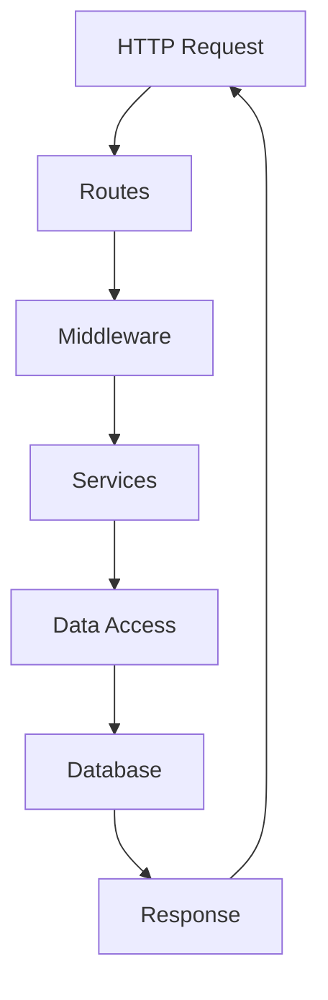
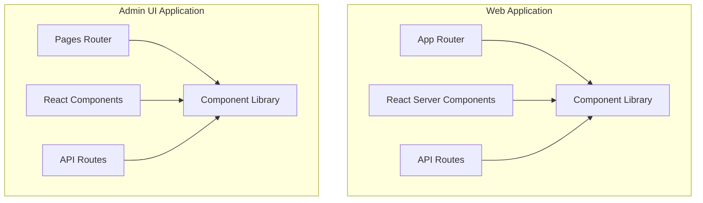
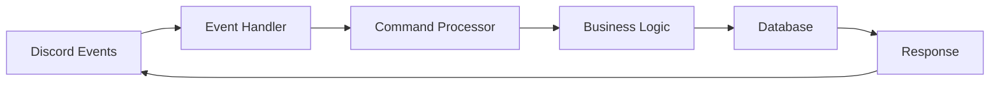
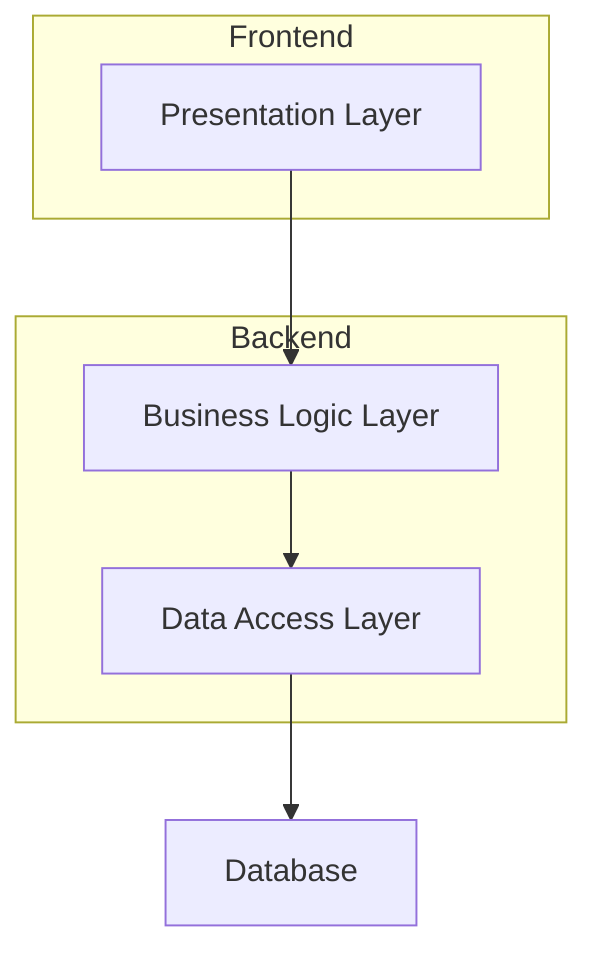
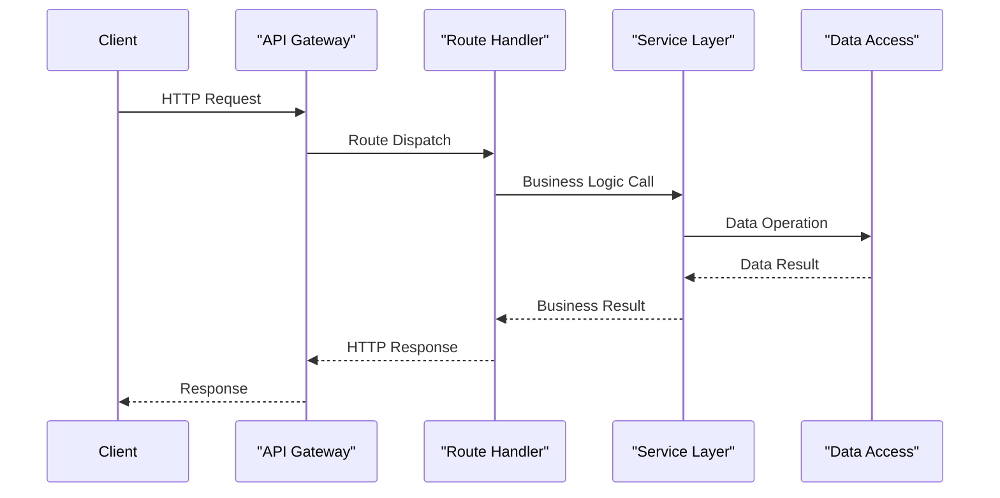
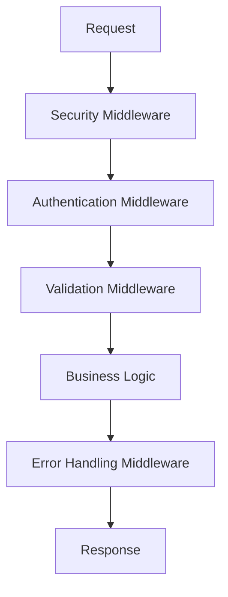
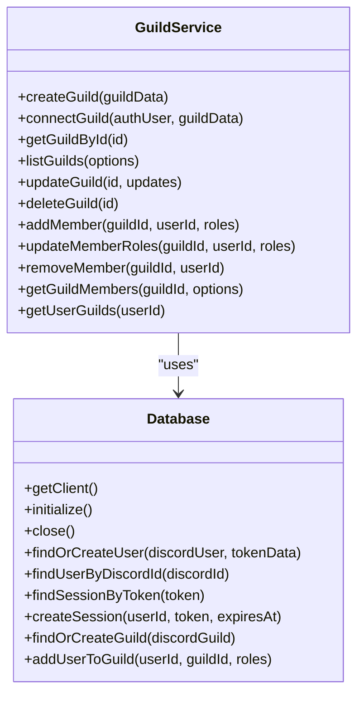

# Application Architecture

<cite>
**Referenced Files in This Document**   
- [app.js](file://apps/admin-api/src/app.js)
- [auth.js](file://apps/admin-api/src/middleware/auth.js)
- [error-handler.js](file://apps/admin-api/src/middleware/error-handler.js)
- [guild.service.js](file://apps/admin-api/src/services/guild.service.js)
- [database.js](file://apps/admin-api/src/lib/database.js)
- [admin-client.ts](file://apps/web/lib/api/admin-client.ts)
- [context.tsx](file://apps/web/lib/auth/context.tsx)
- [route.ts](file://apps/web/app/api/auth/me/route.ts)
- [index.ts](file://apps/bot/src/index.ts)
- [middleware.ts](file://apps/web/middleware.ts)
</cite>

## Table of Contents
1. [Introduction](#introduction)
2. [Backend Layered Architecture](#backend-layered-architecture)
3. [Frontend Component-Based Architecture](#frontend-component-based-architecture)
4. [Event-Driven Design Pattern](#event-driven-design-pattern)
5. [Separation of Concerns](#separation-of-concerns)
6. [API Design and Route Handling](#api-design-and-route-handling)
7. [Middleware Composition](#middleware-composition)
8. [Service Layer Implementation](#service-layer-implementation)
9. [Framework Version Differences](#framework-version-differences)
10. [Architecture Extension Guidelines](#architecture-extension-guidelines)

## Introduction
This document details the application architecture patterns in the slimy-monorepo, focusing on the layered backend architecture in admin-api, component-based frontend architectures in web and admin-ui, and the event-driven design pattern intended for the bot application. The architecture follows established patterns for separation of concerns, with clear boundaries between presentation, business logic, and data access layers. The admin-api uses Express.js for REST API design, while the web application leverages Next.js API routes. The documentation also addresses the differences between Next.js versions used in different applications and provides guidance for extending the architecture consistently.

## Backend Layered Architecture
The admin-api application implements a layered backend architecture with a clear flow from routes → middleware → services → data access. This pattern ensures separation of concerns and maintainability across the codebase. The Express.js application is structured with routes handling HTTP requests, middleware managing cross-cutting concerns like authentication and error handling, services encapsulating business logic, and data access components interacting with the database through Prisma ORM.

**Diagram sources**
- [app.js](file://apps/admin-api/src/app.js#L1-L64)
- [auth.js](file://apps/admin-api/src/middleware/auth.js#L1-L314)
- [guild.service.js](file://apps/admin-api/src/services/guild.service.js#L1-L717)
- [database.js](file://apps/admin-api/src/lib/database.js#L1-L680)

**Section sources**
- [app.js](file://apps/admin-api/src/app.js#L1-L64)
- [auth.js](file://apps/admin-api/src/middleware/auth.js#L1-L314)

## Frontend Component-Based Architecture
The frontend architecture utilizes component-based design patterns with Next.js, employing different routing approaches in the web and admin-ui applications. The web application uses the App Router with React Server Components, while admin-ui implements the Pages Router. Both applications follow component-based architecture principles, organizing UI elements into reusable components with clear responsibilities and separation of concerns.

**Diagram sources**
- [middleware.ts](file://apps/web/middleware.ts#L1-L29)
- [context.tsx](file://apps/web/lib/auth/context.tsx#L1-L155)

**Section sources**
- [middleware.ts](file://apps/web/middleware.ts#L1-L29)
- [context.tsx](file://apps/web/lib/auth/context.tsx#L1-L155)

## Event-Driven Design Pattern
The bot application is designed with an event-driven architecture pattern, intended to handle Discord events and interactions asynchronously. The current implementation provides a scaffold for the bot entry point, with planned integration of Discord.js for event handling, command processing, and interaction with the database. The event-driven design allows for scalable handling of real-time interactions and background processing tasks.

**Diagram sources**
- [index.ts](file://apps/bot/src/index.ts#L1-L64)

**Section sources**
- [index.ts](file://apps/bot/src/index.ts#L1-L64)

## Separation of Concerns
The architecture enforces strict separation of concerns between presentation, business logic, and data access layers. In the admin-api, routes handle HTTP concerns, middleware manages authentication and validation, services encapsulate business rules, and data access components interact with the database. In the frontend applications, components handle presentation, hooks manage state and data fetching, and API clients abstract backend interactions. This separation enables independent development, testing, and maintenance of each layer.

**Diagram sources**
- [app.js](file://apps/admin-api/src/app.js#L1-L64)
- [admin-client.ts](file://apps/web/lib/api/admin-client.ts#L1-L398)
- [context.tsx](file://apps/web/lib/auth/context.tsx#L1-L155)

**Section sources**
- [app.js](file://apps/admin-api/src/app.js#L1-L64)
- [admin-client.ts](file://apps/web/lib/api/admin-client.ts#L1-L398)

## API Design and Route Handling
The admin-api uses Express.js for REST API design, with routes defined in the src/routes directory. The web application implements Next.js API routes using the App Router. Both approaches follow RESTful principles with clear endpoint structures. The admin-api routes are mounted on the Express application, while Next.js API routes are automatically mapped to HTTP endpoints based on file structure. The architecture supports both traditional REST endpoints and API routes with server-side logic.

**Diagram sources**
- [app.js](file://apps/admin-api/src/app.js#L1-L64)
- [route.ts](file://apps/web/app/api/auth/me/route.ts#L1-L73)

**Section sources**
- [app.js](file://apps/admin-api/src/app.js#L1-L64)
- [route.ts](file://apps/web/app/api/auth/me/route.ts#L1-L73)

## Middleware Composition
The architecture implements comprehensive middleware composition for handling cross-cutting concerns such as authentication, validation, and error handling. In admin-api, Express middleware functions are composed in a specific order to process requests and responses. The middleware stack includes authentication resolution, request logging, security headers, CORS configuration, and error handling. This composition pattern ensures consistent handling of common concerns across all routes.

**Diagram sources**
- [app.js](file://apps/admin-api/src/app.js#L1-L64)
- [auth.js](file://apps/admin-api/src/middleware/auth.js#L1-L314)
- [error-handler.js](file://apps/admin-api/src/middleware/error-handler.js#L1-L82)

**Section sources**
- [app.js](file://apps/admin-api/src/app.js#L1-L64)
- [auth.js](file://apps/admin-api/src/middleware/auth.js#L1-L314)

## Service Layer Implementation
The service layer in admin-api encapsulates business logic and orchestrates operations between the route handlers and data access components. Services like GuildService provide a clean API for business operations, abstracting the complexity of database interactions and business rules. The service layer ensures that business logic is centralized and reusable across different routes and use cases, promoting consistency and maintainability.

**Diagram sources**
- [guild.service.js](file://apps/admin-api/src/services/guild.service.js#L1-L717)
- [database.js](file://apps/admin-api/src/lib/database.js#L1-L680)

**Section sources**
- [guild.service.js](file://apps/admin-api/src/services/guild.service.js#L1-L717)
- [database.js](file://apps/admin-api/src/lib/database.js#L1-L680)

## Framework Version Differences
The architecture utilizes different versions of Next.js across applications, with web using Next.js 16 and admin-ui using Next.js 14. These version differences impact available features, performance characteristics, and development workflows. The web application benefits from newer React Server Components and improved server-side rendering capabilities in Next.js 16, while admin-ui maintains compatibility with the older Pages Router pattern from Next.js 14. This creates different development experiences and feature sets between the applications.

**Section sources**
- [package.json](file://apps/web/package.json#L1-L86)
- [package.json](file://apps/admin-ui/package.json#L1-L20)

## Architecture Extension Guidelines
To extend the architecture with new endpoints or components while maintaining consistency, follow these guidelines: For backend extensions, create new route files in the src/routes directory, implement business logic in appropriate service classes, and use the existing data access patterns. For frontend extensions, follow the component structure and naming conventions of the specific application, using App Router for web and Pages Router for admin-ui. Always maintain separation of concerns and use existing middleware and utility functions to ensure consistency across the codebase.

**Section sources**
- [app.js](file://apps/admin-api/src/app.js#L1-L64)
- [admin-client.ts](file://apps/web/lib/api/admin-client.ts#L1-L398)
- [context.tsx](file://apps/web/lib/auth/context.tsx#L1-L155)