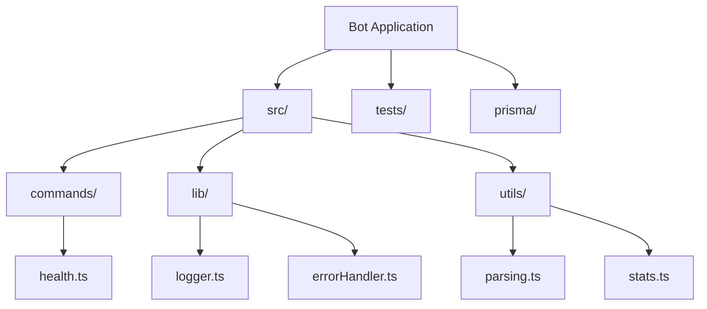
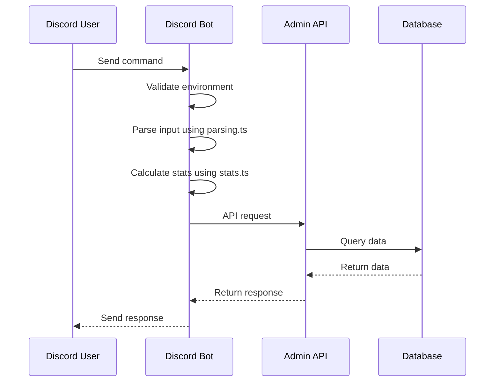
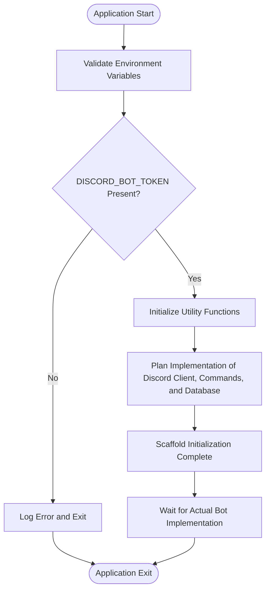
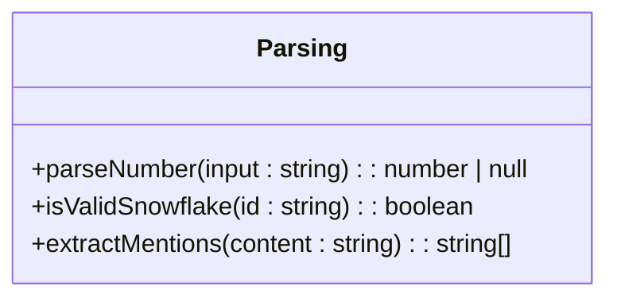
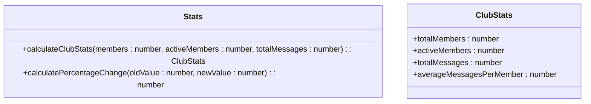
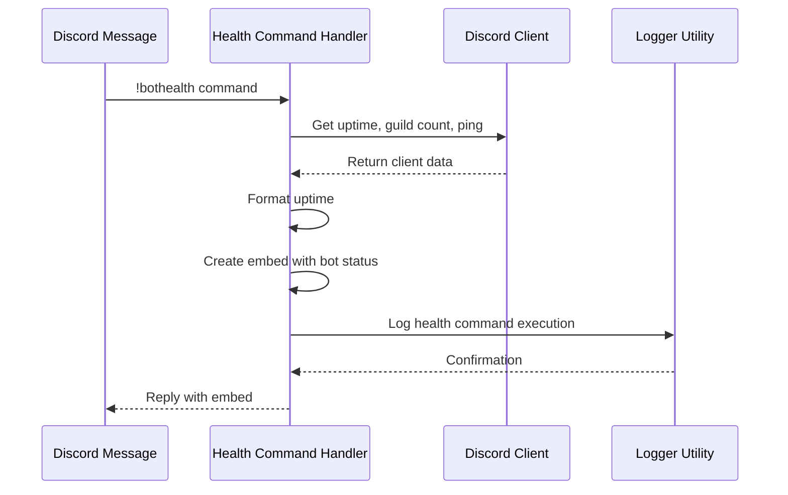
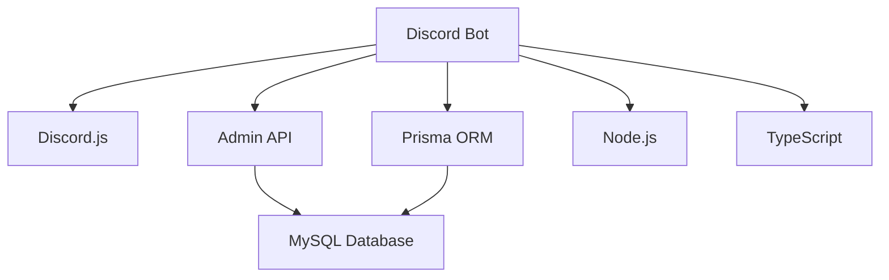

# Bot Application Architecture

<cite>
**Referenced Files in This Document**   
- [index.ts](file://apps/bot/src/index.ts)
- [parsing.ts](file://apps/bot/src/utils/parsing.ts)
- [stats.ts](file://apps/bot/src/utils/stats.ts)
- [health.ts](file://apps/bot/src/commands/health.ts)
- [logger.ts](file://apps/bot/src/lib/logger.ts)
- [errorHandler.ts](file://apps/bot/src/lib/errorHandler.ts)
- [database.js](file://apps/admin-api/src/lib/database.js)
- [schema.prisma](file://apps/admin-api/prisma/schema.prisma)
- [oauth.js](file://apps/admin-api/src/services/oauth.js)
- [vitest.config.ts](file://apps/bot/vitest.config.ts)
- [tsconfig.json](file://apps/bot/tsconfig.json)
- [package.json](file://apps/bot/package.json)
</cite>

## Table of Contents
1. [Introduction](#introduction)
2. [Project Structure](#project-structure)
3. [Core Components](#core-components)
4. [Architecture Overview](#architecture-overview)
5. [Detailed Component Analysis](#detailed-component-analysis)
6. [Dependency Analysis](#dependency-analysis)
7. [Performance Considerations](#performance-considerations)
8. [Troubleshooting Guide](#troubleshooting-guide)
9. [Conclusion](#conclusion)

## Introduction
This document provides comprehensive architectural documentation for the Discord Bot application within the slimy-monorepo. The bot is currently in a scaffold state, serving as a foundation for migrating existing bot functionality into a structured, maintainable codebase. The architecture emphasizes type safety through TypeScript, modular design, and integration with external services including Discord.js, Prisma ORM, and the admin-api backend. This documentation covers the current execution flow, environment validation, graceful shutdown handlers, utility modules, and the planned event-driven architecture for handling Discord events and commands.

## Project Structure
The Discord Bot application follows a modular structure with clear separation of concerns. The main components are organized into distinct directories:
- `src/commands/`: Contains command handler implementations
- `src/lib/`: Houses core utilities like logging and error handling
- `src/utils/`: Includes reusable utility functions for parsing and statistics
- `tests/`: Contains unit tests for utility functions and components
- `prisma/`: Manages database schema and migrations for the admin-api service

The application uses TypeScript for type safety and includes configuration files for build tools, testing, and deployment.

**Diagram sources**
- [index.ts](file://apps/bot/src/index.ts)
- [health.ts](file://apps/bot/src/commands/health.ts)

**Section sources**
- [index.ts](file://apps/bot/src/index.ts)
- [package.json](file://apps/bot/package.json)

## Core Components
The core components of the Discord Bot application include the main execution flow in `index.ts`, utility modules for number parsing and club statistics calculation, and command handlers for Discord interactions. The application is designed to be extended with additional command handlers and integrated with external services such as the admin-api backend and database via Prisma.

**Section sources**
- [index.ts](file://apps/bot/src/index.ts)
- [parsing.ts](file://apps/bot/src/utils/parsing.ts)
- [stats.ts](file://apps/bot/src/utils/stats.ts)

## Architecture Overview
The Discord Bot application follows a modular, event-driven architecture. The main execution flow begins in `index.ts`, where environment validation is performed and the application is initialized. The bot is designed to handle Discord events and commands through a planned event-driven system, with graceful shutdown handlers for SIGINT and SIGTERM signals. Utility modules provide reusable functionality for parsing user input and calculating club statistics, which will be integrated into future command handlers.

**Diagram sources**
- [index.ts](file://apps/bot/src/index.ts)
- [parsing.ts](file://apps/bot/src/utils/parsing.ts)
- [stats.ts](file://apps/bot/src/utils/stats.ts)
- [database.js](file://apps/admin-api/src/lib/database.js)

## Detailed Component Analysis

### Main Execution Flow Analysis
The main execution flow is defined in `index.ts`, which serves as the entry point for the Discord Bot application. The flow begins with environment validation, specifically checking for the presence of the `DISCORD_BOT_TOKEN` environment variable. If the token is not present, the application logs an error and exits. Upon successful validation, the application initializes utility functions and prepares for the implementation of Discord client setup, command handlers, and database connectivity.

**Diagram sources**
- [index.ts](file://apps/bot/src/index.ts)

**Section sources**
- [index.ts](file://apps/bot/src/index.ts)

### Utility Modules Analysis
The utility modules `parsing.ts` and `stats.ts` provide essential functionality for the Discord Bot application. `parsing.ts` includes functions for parsing numeric strings with common Discord formatting (commas, k/m suffix) and validating Discord snowflake IDs. `stats.ts` contains functions for calculating basic club statistics from raw data, including total members, active members, total messages, and average messages per member.

#### Parsing Utility

**Diagram sources**
- [parsing.ts](file://apps/bot/src/utils/parsing.ts)

#### Statistics Utility

**Diagram sources**
- [stats.ts](file://apps/bot/src/utils/stats.ts)

**Section sources**
- [parsing.ts](file://apps/bot/src/utils/parsing.ts)
- [stats.ts](file://apps/bot/src/utils/stats.ts)

### Command Handler Analysis
The `health.ts` file contains a command handler for bot diagnostics, providing uptime, environment info, and version details. This handler demonstrates the pattern for future command implementations, including interaction with the Discord.js client, message handling, and logging.

**Diagram sources**
- [health.ts](file://apps/bot/src/commands/health.ts)

**Section sources**
- [health.ts](file://apps/bot/src/commands/health.ts)

## Dependency Analysis
The Discord Bot application has dependencies on external services including Discord.js for client interactions, Prisma for database connectivity, and the admin-api backend for additional functionality. The application also relies on Node.js built-in modules and TypeScript for type safety.

**Diagram sources**
- [package.json](file://apps/bot/package.json)
- [schema.prisma](file://apps/admin-api/prisma/schema.prisma)

**Section sources**
- [package.json](file://apps/bot/package.json)
- [schema.prisma](file://apps/admin-api/prisma/schema.prisma)

## Performance Considerations
The application is designed with performance in mind, using efficient algorithms for parsing and statistics calculation. The use of TypeScript and strict compilation options ensures type safety and helps catch potential performance issues at compile time. The planned integration with the admin-api backend and database via Prisma will allow for efficient data retrieval and manipulation.

## Troubleshooting Guide
The Discord Bot application includes comprehensive logging and error handling mechanisms to aid in troubleshooting. The `logger.ts` utility provides structured logging with context, while the `errorHandler.ts` module offers crash safety for event handlers and other async operations.

**Section sources**
- [logger.ts](file://apps/bot/src/lib/logger.ts)
- [errorHandler.ts](file://apps/bot/src/lib/errorHandler.ts)

## Conclusion
The Discord Bot application in the slimy-monorepo is currently in a scaffold state, providing a solid foundation for migrating existing bot functionality into a structured, maintainable codebase. The architecture emphasizes type safety, modularity, and integration with external services. The planned event-driven architecture for handling Discord events and commands, along with the utility modules for number parsing and club statistics calculation, will enable the development of robust and scalable bot features. The application's design considerations for long-running processes, error resilience, and monitoring ensure its readiness for production deployment.