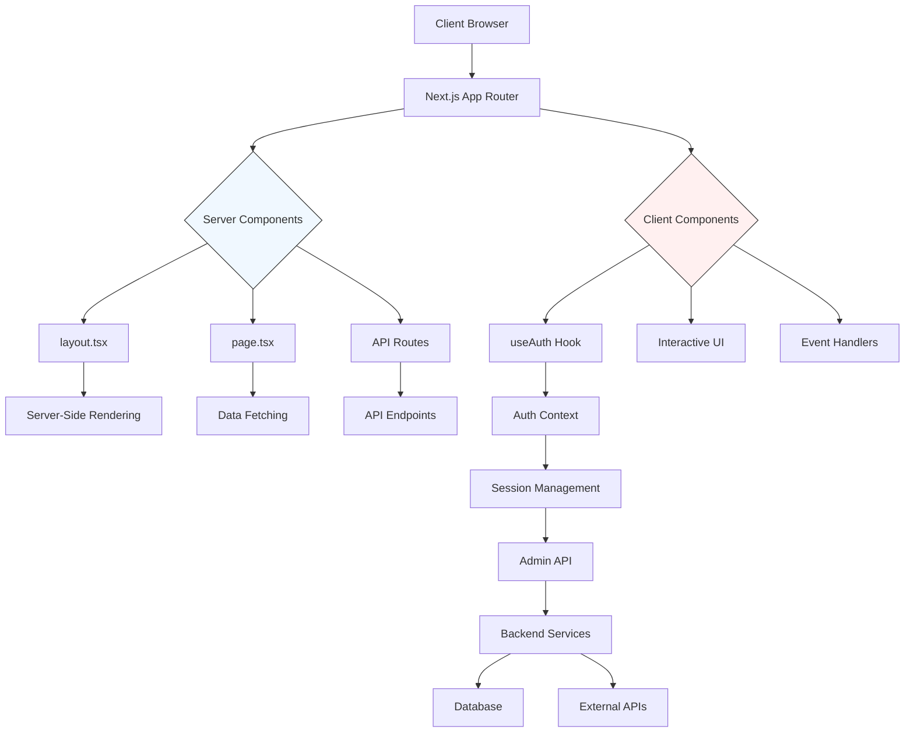
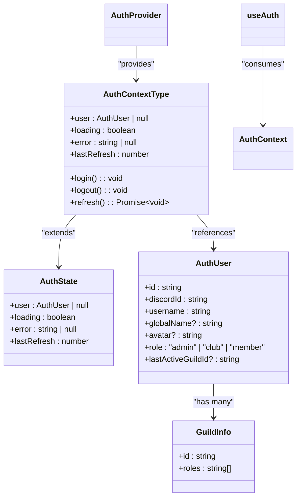
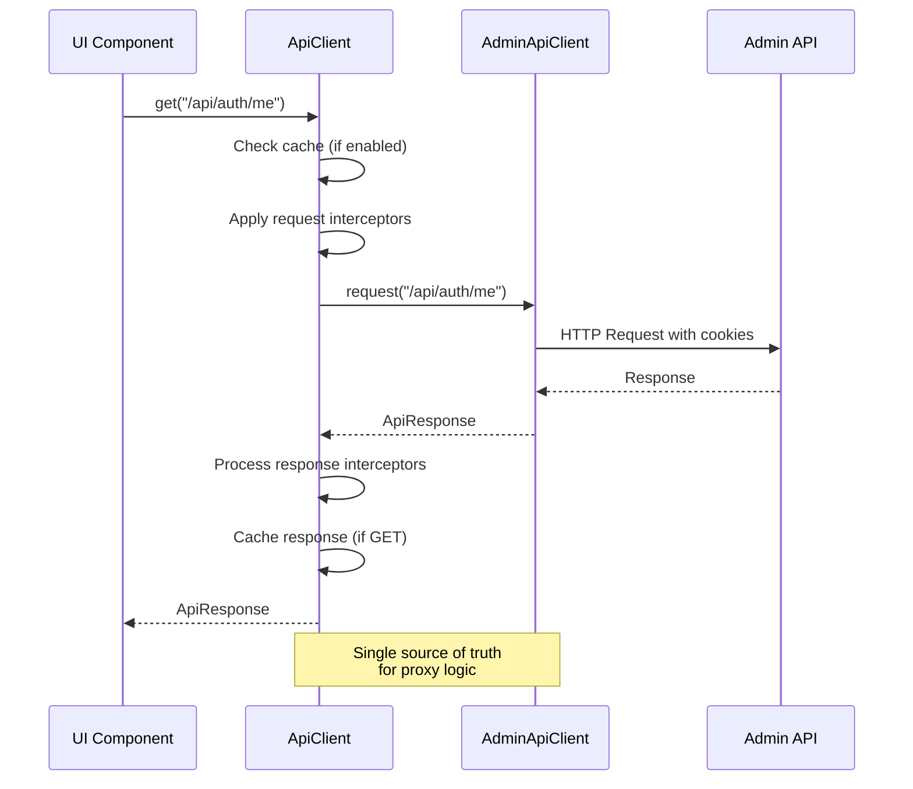
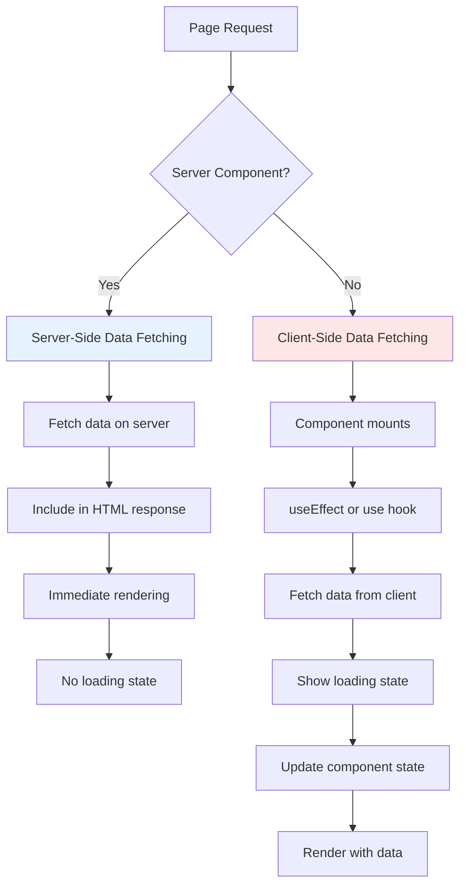
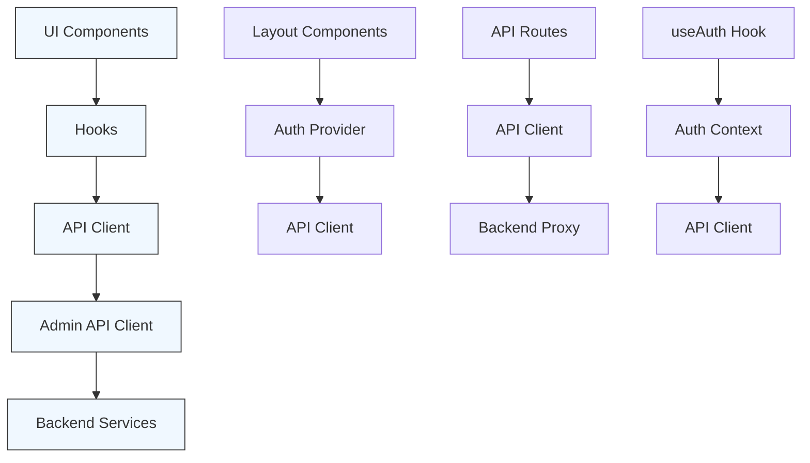
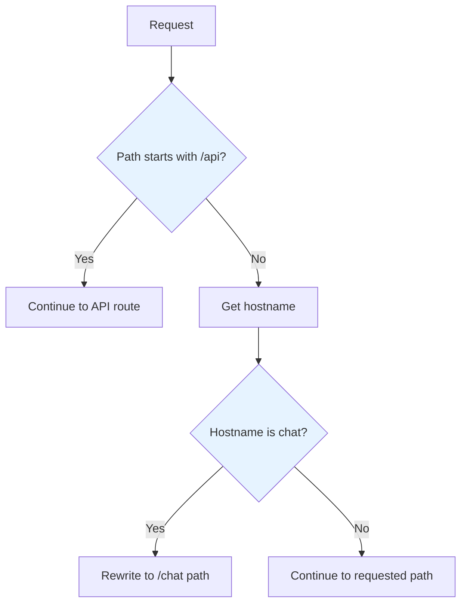

# Web Application Architecture

<cite>
**Referenced Files in This Document**   
- [app/layout.tsx](file://apps/web/app/layout.tsx)
- [app/page.tsx](file://apps/web/app/page.tsx)
- [app/(marketing)/page.tsx](file://apps/web/app/(marketing)/page.tsx)
- [app/chat/page.tsx](file://apps/web/app/chat/page.tsx)
- [hooks/useAuth.ts](file://apps/web/hooks/useAuth.ts)
- [lib/auth/context.tsx](file://apps/web/lib/auth/context.tsx)
- [lib/auth/types.ts](file://apps/web/lib/auth/types.ts)
- [lib/api-client.ts](file://apps/web/lib/api-client.ts)
- [components/layout/app-shell.tsx](file://apps/web/components/layout/app-shell.tsx)
- [components/ui/button.tsx](file://apps/web/components/ui/button.tsx)
- [components/ui/card.tsx](file://apps/web/components/ui/card.tsx)
- [app/api/auth/me/route.ts](file://apps/web/app/api/auth/me/route.ts)
- [app/api/auth/logout/route.ts](file://apps/web/app/api/auth/logout/route.ts)
- [middleware.ts](file://apps/web/middleware.ts)
</cite>

## Table of Contents
1. [Introduction](#introduction)
2. [Project Structure](#project-structure)
3. [Core Components](#core-components)
4. [Architecture Overview](#architecture-overview)
5. [Detailed Component Analysis](#detailed-component-analysis)
6. [Dependency Analysis](#dependency-analysis)
7. [Performance Considerations](#performance-considerations)
8. [Troubleshooting Guide](#troubleshooting-guide)
9. [Conclusion](#conclusion)

## Introduction
This document provides comprehensive architectural documentation for the Web Application frontend in the slimy-monorepo. The application is built using Next.js with the App Router architecture, leveraging React Server Components for optimal performance and user experience. The system implements a sophisticated authentication flow using context providers and custom hooks, with a clear separation between server and client components. The architecture supports both marketing content and authenticated user features, with careful attention to performance optimization and type safety.

## Project Structure

The Web Application follows a standard Next.js App Router structure with several key organizational patterns:

```mermaid
graph TB
A[apps/web] --> B[app/]
A --> C[components/]
A --> D[lib/]
A --> E[hooks/]
A --> F[public/]
B --> G[(marketing)/]
B --> H[api/]
B --> I[chat/]
B --> J[club/]
B --> K[dashboard/]
B --> L[snail/]
B --> M[layout.tsx]
B --> N[page.tsx]
C --> O[layout/]
C --> P[ui/]
C --> Q[providers/]
D --> R[auth/]
D --> S[api/]
D --> T[types/]
```

**Diagram sources**
- [app/layout.tsx](file://apps/web/app/layout.tsx)
- [app/page.tsx](file://apps/web/app/page.tsx)

**Section sources**
- [app/layout.tsx](file://apps/web/app/layout.tsx)
- [app/page.tsx](file://apps/web/app/page.tsx)

## Core Components

The application's core components include the authentication system, API client, layout structure, and UI component library. These components work together to provide a seamless user experience while maintaining separation of concerns and reusability.

**Section sources**
- [lib/auth/context.tsx](file://apps/web/lib/auth/context.tsx)
- [lib/api-client.ts](file://apps/web/lib/api-client.ts)
- [components/layout/app-shell.tsx](file://apps/web/components/layout/app-shell.tsx)

## Architecture Overview

The Web Application architecture is built around the Next.js App Router with a clear distinction between server and client components. The system uses React Server Components for initial rendering and data fetching, while client components handle user interactions and dynamic behavior.



**Diagram sources**
- [app/layout.tsx](file://apps/web/app/layout.tsx)
- [app/page.tsx](file://apps/web/app/page.tsx)
- [hooks/useAuth.ts](file://apps/web/hooks/useAuth.ts)

## Detailed Component Analysis

### Authentication System Analysis

The authentication system is implemented using the context provider pattern with a custom useAuth hook. This approach provides global access to authentication state while maintaining reactivity and proper error handling.



**Diagram sources**
- [lib/auth/context.tsx](file://apps/web/lib/auth/context.tsx)
- [lib/auth/types.ts](file://apps/web/lib/auth/types.ts)
- [hooks/useAuth.ts](file://apps/web/hooks/useAuth.ts)

### API Client Architecture

The API client architecture implements a robust communication layer between the frontend and backend services, with features for retry logic, caching, and error handling.



**Diagram sources**
- [lib/api-client.ts](file://apps/web/lib/api-client.ts)
- [app/api/auth/me/route.ts](file://apps/web/app/api/auth/me/route.ts)

### Data Fetching Patterns

The application implements different data fetching patterns for server and client components, optimizing for performance and user experience.



**Diagram sources**
- [app/page.tsx](file://apps/web/app/page.tsx)
- [hooks/useAuth.ts](file://apps/web/hooks/useAuth.ts)

## Dependency Analysis

The application's dependency structure shows a clear separation between presentation, business logic, and data access layers.



**Diagram sources**
- [package.json](file://apps/web/package.json)
- [lib/api-client.ts](file://apps/web/lib/api-client.ts)

**Section sources**
- [lib/api-client.ts](file://apps/web/lib/api-client.ts)
- [hooks/useAuth.ts](file://apps/web/hooks/useAuth.ts)
- [lib/auth/context.tsx](file://apps/web/lib/auth/context.tsx)

## Performance Considerations

The application implements several performance optimizations to ensure fast loading times and responsive interactions.

### Code Splitting and Bundling
The Next.js App Router automatically handles code splitting, ensuring that only necessary code is loaded for each page. The application also uses dynamic imports for heavy components.

### Image Optimization
Images are optimized through Next.js Image component with appropriate sizing and lazy loading. The homepage logo is served in multiple sizes based on device capabilities.

### Middleware-Based Routing
The middleware implementation optimizes routing by handling subdomain routing efficiently:



**Diagram sources**
- [middleware.ts](file://apps/web/middleware.ts)

**Section sources**
- [middleware.ts](file://apps/web/middleware.ts)
- [app/page.tsx](file://apps/web/app/page.tsx)

## Troubleshooting Guide

### Authentication Issues
When authentication issues occur, check the following:
- Verify that the NEXT_PUBLIC_ADMIN_API_BASE environment variable is correctly configured
- Ensure that the session cookie (slimy_admin) is being sent with requests
- Check the network tab for failed /api/auth/me requests

### API Client Errors
For API client errors, consider:
- Verify the Admin API is reachable from the frontend
- Check for CORS issues in development
- Review the retry logic and timeout settings in api-client.ts

### Layout Rendering Problems
If layout components are not rendering correctly:
- Verify that AppShell is properly wrapping the application
- Check the SHELL_ROUTES configuration in app-shell.tsx
- Ensure that the AuthProvider is correctly set up in the component tree

**Section sources**
- [lib/auth/context.tsx](file://apps/web/lib/auth/context.tsx)
- [lib/api-client.ts](file://apps/web/lib/api-client.ts)
- [components/layout/app-shell.tsx](file://apps/web/components/layout/app-shell.tsx)

## Conclusion

The Web Application frontend in the slimy-monorepo demonstrates a well-architected Next.js application using modern patterns and best practices. The App Router architecture enables efficient server-side rendering while maintaining interactive client-side capabilities. The authentication system using context providers and custom hooks provides a robust and reusable solution for managing user sessions. The API client implementation with retry logic, caching, and error handling ensures reliable communication with backend services. The clear separation between server and client components, combined with performance optimizations like code splitting and image optimization, results in a fast and responsive user experience. This architecture provides a solid foundation for extending the application with new features while maintaining type safety and consistency.