# Architecture

<cite>
**Referenced Files in This Document**   
- [app.js](file://apps/admin-api/src/app.js)
- [server.js](file://apps/admin-api/server.js)
- [auth.js](file://apps/admin-api/src/middleware/auth.js)
- [rbac.js](file://apps/admin-api/src/middleware/rbac.js)
- [guild.service.js](file://apps/admin-api/src/services/guild.service.js)
- [index.js](file://apps/admin-api/src/routes/index.js)
- [config.js](file://apps/admin-api/src/config.js)
- [middleware.ts](file://apps/web/middleware.ts)
- [config.ts](file://apps/web/lib/config.ts)
- [context.tsx](file://apps/web/lib/auth/context.tsx)
- [package.json](file://apps/admin-api/package.json)
- [package.json](file://apps/web/package.json)
- [package.json](file://apps/admin-ui/package.json)
- [package.json](file://apps/bot/package.json)
</cite>

## Table of Contents
1. [Introduction](#introduction)
2. [Monorepo Structure](#monorepo-structure)
3. [Application Architecture](#application-architecture)
4. [Data Flow and Communication](#data-flow-and-communication)
5. [Security Model](#security-model)
6. [Infrastructure and Deployment](#infrastructure-and-deployment)
7. [Cross-Cutting Concerns](#cross-cutting-concerns)
8. [Technology Integration](#technology-integration)
9. [Conclusion](#conclusion)

## Introduction
The slimy-monorepo platform is a comprehensive system designed to manage Discord guilds, provide analytics, and deliver AI-powered chat capabilities. The architecture follows a monorepo pattern with multiple applications and shared packages, enabling code reuse while maintaining separation of concerns. This document provides a detailed architectural overview of the platform, covering its structure, components, data flows, security model, and infrastructure requirements.

## Monorepo Structure
The slimy-monorepo platform follows a well-defined directory structure that separates concerns and enables scalable development. The repository is organized into four main directories: apps/, packages/, lib/, and infra/.

The **apps/** directory contains all the application services in the platform:
- **admin-api**: Backend API service built with Express.js that handles authentication, guild management, and data access
- **web**: Next.js frontend application providing the main user interface with marketing pages and dashboard functionality
- **admin-ui**: Admin interface built with Next.js for managing platform settings and configurations
- **bot**: Discord bot service built with Discord.js that interacts with Discord servers and processes commands

The **packages/** directory contains shared libraries that can be consumed across multiple applications:
- **shared-auth**: Authentication utilities and middleware shared across services
- **shared-config**: Configuration management and environment variable handling
- **shared-db**: Database access patterns and Prisma client configurations
- **shared-snail**: Snail-related utilities and business logic
- **shared-codes**: Code management and processing utilities

The **lib/** directory contains platform-wide utility libraries:
- **openai/**: OpenAI client integration and queue management for AI processing
- Various utility scripts and shared functionality accessible to all applications

The **infra/** directory contains infrastructure-as-code configurations:
- Docker Compose files for different deployment environments
- Caddy configuration for reverse proxy and SSL termination
- Environment-specific deployment configurations

This structure enables independent development of each application while promoting code reuse through shared packages and libraries. The monorepo approach simplifies dependency management and ensures version compatibility across the platform.

**Section sources**
- [package.json](file://apps/admin-api/package.json)
- [package.json](file://apps/web/package.json)
- [package.json](file://apps/admin-ui/package.json)
- [package.json](file://apps/bot/package.json)

## Application Architecture
The slimy-monorepo platform follows a layered architecture pattern with clear separation of concerns. Each application has a specific role and follows established design patterns for maintainability and scalability.

### Backend Layered Design (admin-api)
The admin-api application implements a layered backend architecture with the following components:

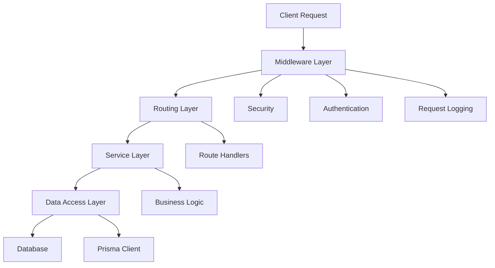

**Diagram sources**
- [app.js](file://apps/admin-api/src/app.js)
- [server.js](file://apps/admin-api/server.js)

The request flow begins with the middleware layer, which handles cross-cutting concerns such as security, authentication, and logging. The routing layer directs requests to appropriate handlers based on the URL path. The service layer contains the business logic and orchestrates operations across multiple data access components. Finally, the data access layer interacts with the database using Prisma ORM.

The admin-api follows a modular structure with distinct directories for different concerns:
- **middleware/**: Contains authentication, authorization, error handling, and security middleware
- **routes/**: Defines API endpoints and their handlers
- **services/**: Implements business logic and service orchestration
- **lib/**: Contains utility functions, database connections, and shared components

**Section sources**
- [app.js](file://apps/admin-api/src/app.js)
- [server.js](file://apps/admin-api/server.js)
- [index.js](file://apps/admin-api/src/routes/index.js)

### Frontend Component Architecture (web and admin-ui)
The web and admin-ui applications follow a component-based architecture using React and Next.js. The frontend is organized into reusable components that can be composed to create complex user interfaces.

The web application uses Next.js App Router with server components for data fetching and client components for interactive elements. It implements middleware for request routing and rewriting, enabling clean URL structures and subdomain handling.

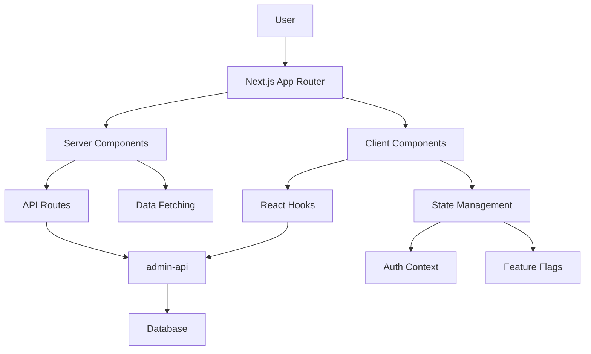

**Diagram sources**
- [middleware.ts](file://apps/web/middleware.ts)
- [context.tsx](file://apps/web/lib/auth/context.tsx)

The component structure follows a pattern of atomic design, with small, reusable components composed into larger, more complex ones. The application uses React Context for global state management, particularly for authentication state and user preferences.

**Section sources**
- [middleware.ts](file://apps/web/middleware.ts)
- [context.tsx](file://apps/web/lib/auth/context.tsx)

### Event-Driven Bot Architecture
The bot application follows an event-driven architecture, responding to Discord events and commands. Built with Discord.js, it establishes a WebSocket connection with Discord's gateway to receive real-time events.

The bot architecture is designed to be lightweight and responsive, with minimal dependencies. It focuses on handling specific Discord interactions and delegating complex processing to other services via API calls.

## Data Flow and Communication
The slimy-monorepo platform implements multiple communication patterns to handle different types of data flow between components.

### API Request Handling
API requests follow a well-defined flow through the admin-api service:

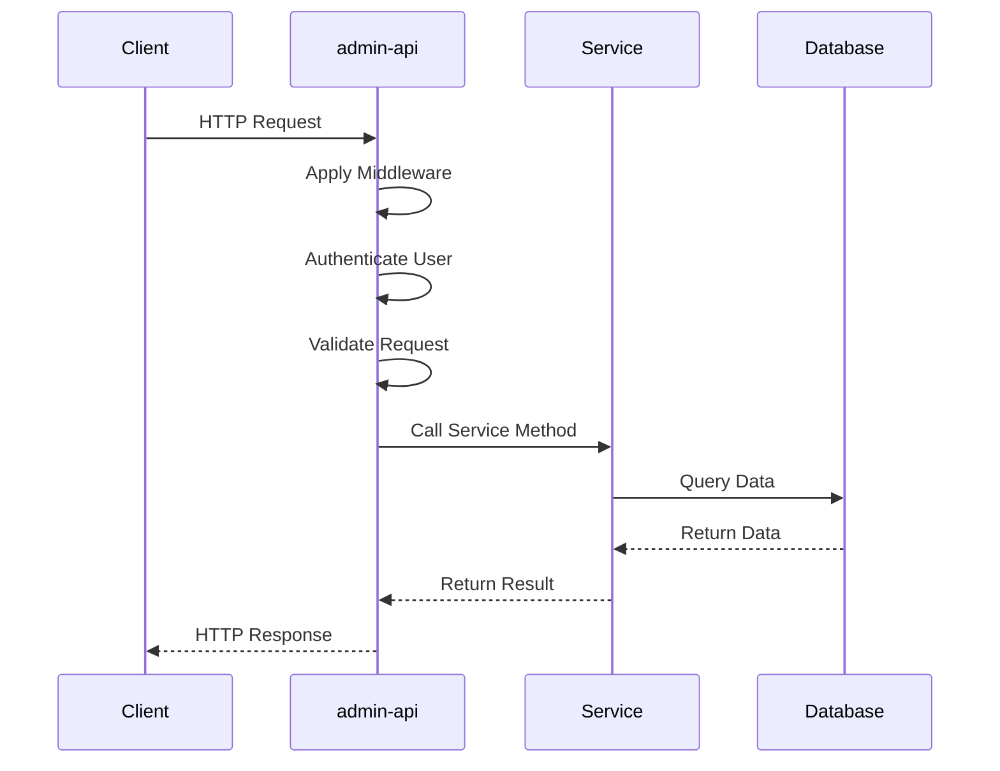

**Diagram sources**
- [app.js](file://apps/admin-api/src/app.js)
- [auth.js](file://apps/admin-api/src/middleware/auth.js)

The request flow begins with middleware that applies security headers, parses the request body, and handles CORS. Authentication middleware verifies the user's JWT token and attaches user information to the request object. Request validation ensures that input data meets expected formats and constraints. The request is then routed to the appropriate service method, which orchestrates the business logic and data access operations.

### Queue Processing with BullMQ
The platform uses BullMQ for asynchronous task processing, enabling background job execution and decoupling of services:

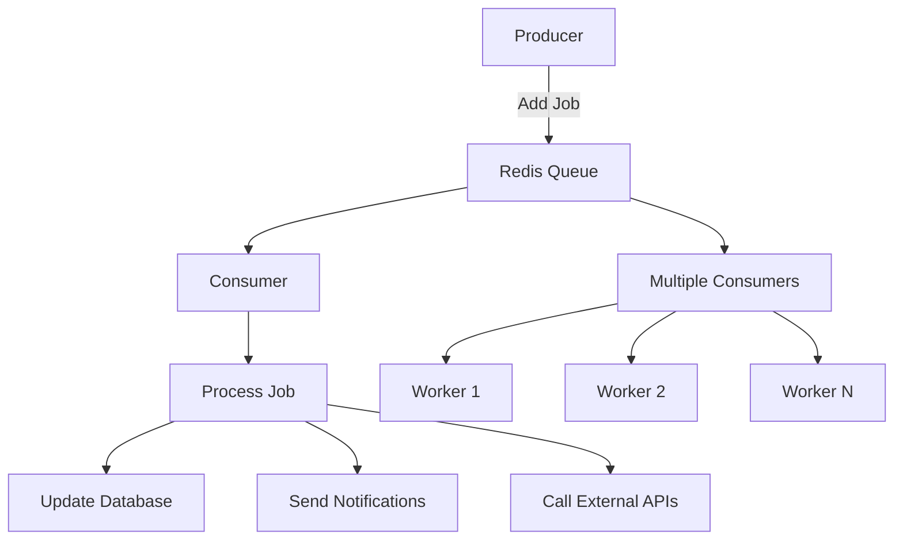

**Diagram sources**
- [package.json](file://apps/admin-api/package.json)

BullMQ queues are used for various background tasks such as data processing, report generation, and external API integrations. Jobs are added to queues by producers (typically API endpoints) and processed by consumers (worker processes). This pattern enables the platform to handle long-running operations without blocking the main request-response cycle.

### Real-Time Communication via WebSockets
The platform supports real-time communication through WebSockets, primarily used by the admin-ui application to receive live updates:

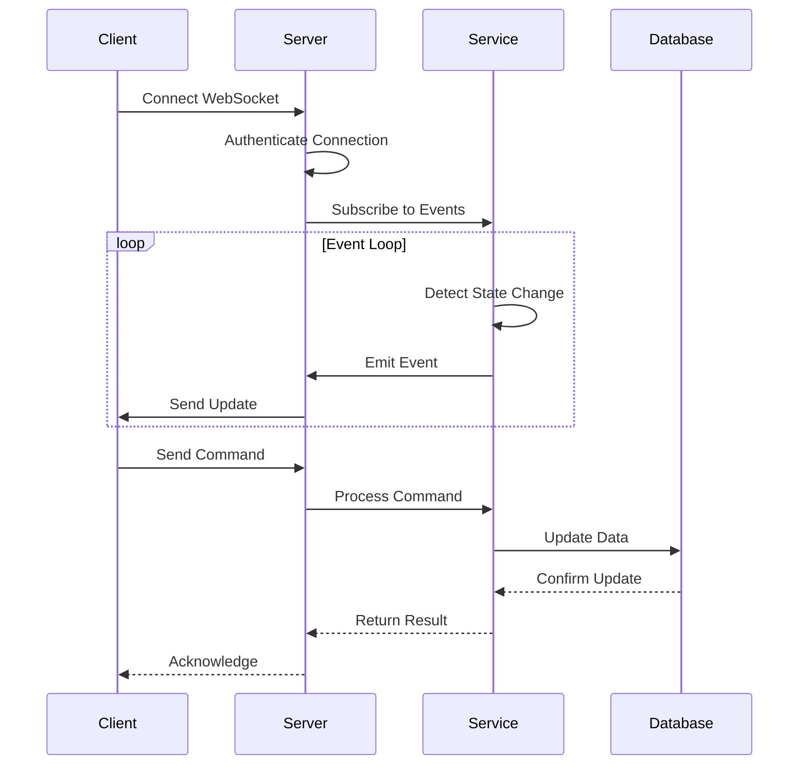

**Diagram sources**
- [app.js](file://apps/admin-api/src/app.js)

WebSocket connections are established between the client and server, with authentication performed during the connection handshake. Once connected, clients can receive real-time updates about system events and state changes. The connection also allows clients to send commands to the server, which are processed like regular API requests.

## Security Model
The slimy-monorepo platform implements a comprehensive security model with multiple layers of protection.

### JWT Authentication
The platform uses JWT (JSON Web Token) for authentication across services. When a user logs in, they receive a signed JWT token that contains their user information and permissions. This token is included in subsequent requests to authenticate the user.

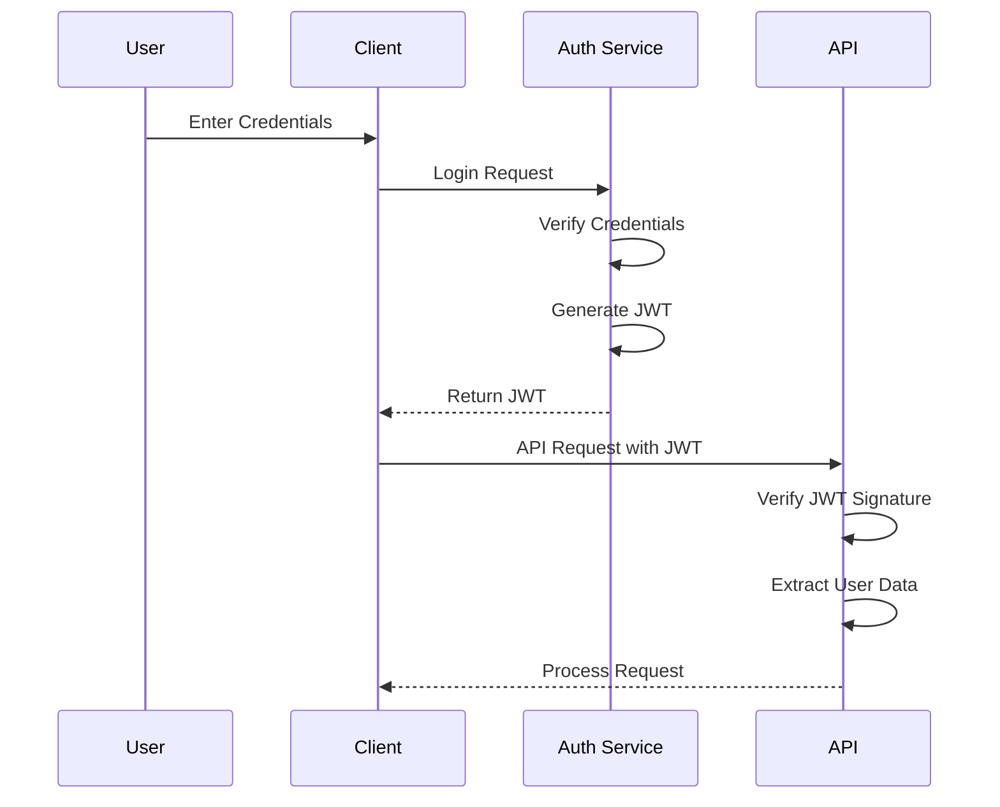

**Diagram sources**
- [auth.js](file://apps/admin-api/src/middleware/auth.js)
- [config.js](file://apps/admin-api/src/config.js)

The JWT token is stored in an HTTP-only cookie for web applications, preventing XSS attacks. The token contains claims about the user's identity, roles, and permissions, which are used for authorization decisions.

### RBAC Implementation
The platform implements Role-Based Access Control (RBAC) to manage user permissions:

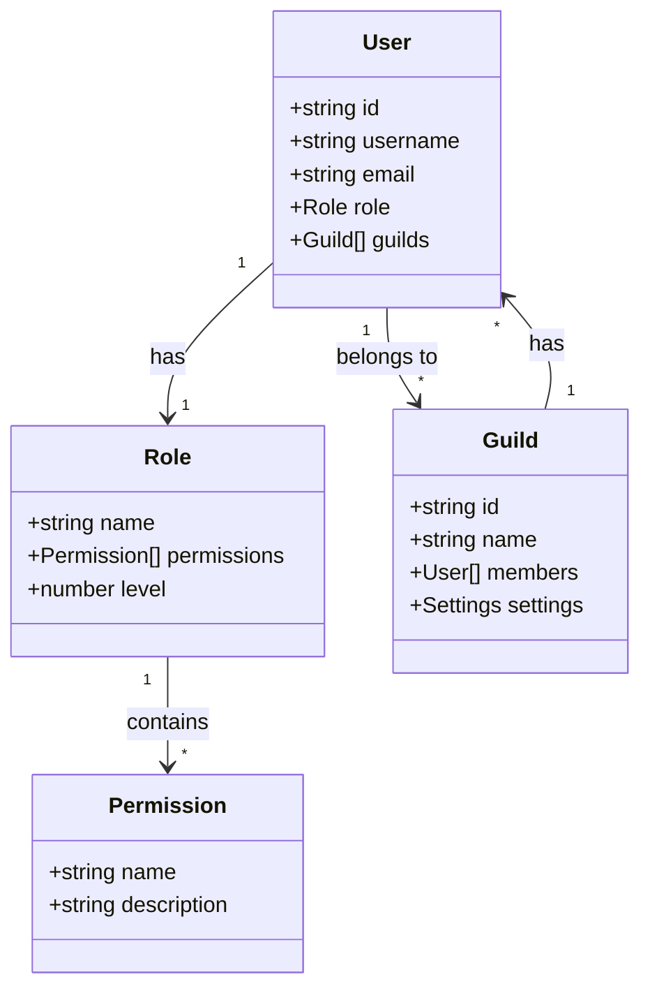

**Diagram sources**
- [rbac.js](file://apps/admin-api/src/middleware/rbac.js)
- [guild.service.js](file://apps/admin-api/src/services/guild.service.js)

Users are assigned roles that determine their permissions within the system. The role hierarchy includes viewer, editor, admin, and owner, with each level having increasing privileges. Permissions are checked at the middleware level before allowing access to protected routes.

The RBAC system is implemented in the auth middleware, which verifies that a user has the required role for a given operation. The middleware extracts the user's role from the JWT token and compares it against the minimum required role for the requested endpoint.

### Request Validation
All incoming requests are validated to prevent common security vulnerabilities:

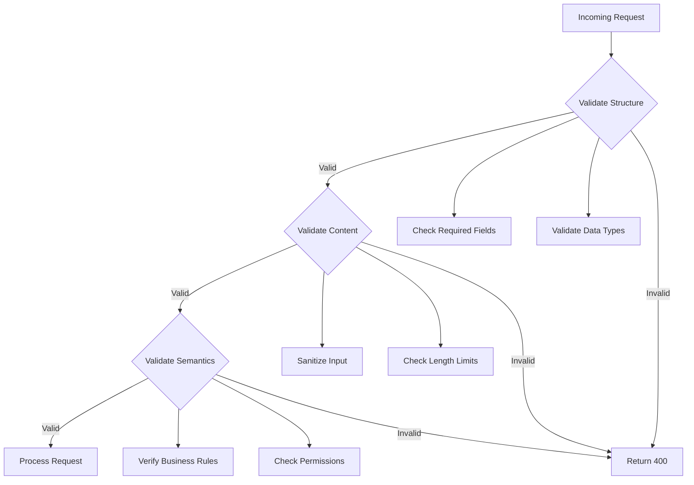

**Diagram sources**
- [auth.js](file://apps/admin-api/src/middleware/auth.js)

Request validation occurs at multiple levels:
- Structure validation ensures that required fields are present and have the correct data types
- Content validation sanitizes input to prevent injection attacks and checks length limits
- Semantic validation verifies that the request makes sense in the current context and that the user has appropriate permissions

The validation process uses Zod for schema validation, providing type-safe validation with clear error messages. Validation errors result in 400 Bad Request responses with detailed error information.

**Section sources**
- [auth.js](file://apps/admin-api/src/middleware/auth.js)
- [rbac.js](file://apps/admin-api/src/middleware/rbac.js)
- [config.js](file://apps/admin-api/src/config.js)

## Infrastructure and Deployment
The slimy-monorepo platform is designed for scalability and reliability, with infrastructure requirements that support its operational needs.

### Infrastructure Requirements
The platform requires the following infrastructure components:
- **Database**: PostgreSQL with Prisma ORM for data persistence
- **Cache**: Redis for session storage, rate limiting, and temporary data
- **Message Queue**: Redis with BullMQ for background job processing
- **Object Storage**: Local file system or cloud storage for uploaded files
- **Reverse Proxy**: Caddy for SSL termination and request routing
- **Monitoring**: Prometheus and Grafana for metrics and dashboards

The infrastructure is configured through Docker Compose files, with different configurations for development, testing, and production environments. The platform uses environment variables for configuration, allowing easy adaptation to different deployment scenarios.

### Scalability Considerations
The platform is designed with scalability in mind, following several key principles:

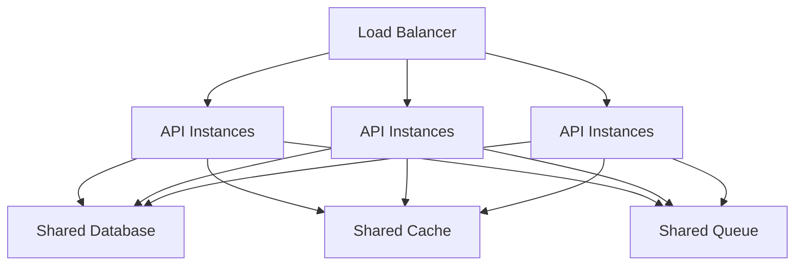

**Diagram sources**
- [docker-compose.yml](file://docker-compose.yml)

The architecture supports horizontal scaling of API instances behind a load balancer. All instances share the same database, cache, and message queue, ensuring consistency across the system. Stateless API instances can be added or removed based on demand, with the load balancer distributing traffic evenly.

Database scalability is achieved through connection pooling and query optimization. The platform uses Prisma's built-in connection pooling to manage database connections efficiently. Read-heavy operations are optimized with appropriate indexing and caching strategies.

### Deployment Topology
The platform follows a microservices-inspired deployment topology, with each application deployed independently:

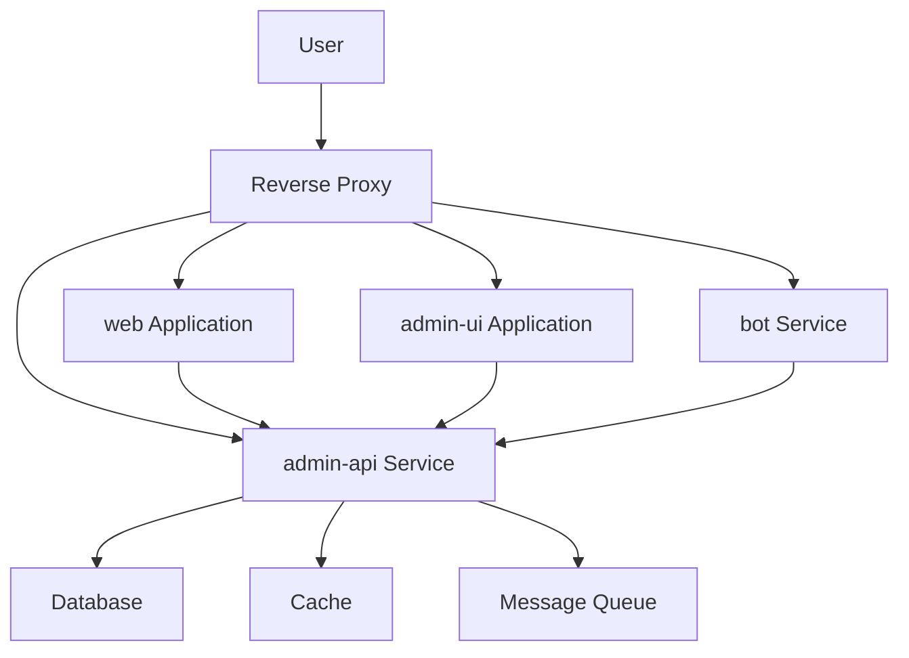

**Diagram sources**
- [docker-compose.yml](file://docker-compose.yml)

The reverse proxy (Caddy) routes requests to the appropriate service based on the hostname or path. The web and admin-ui applications are static sites served by Next.js, while the admin-api and bot services are Node.js applications. All services communicate through well-defined APIs, with the admin-api serving as the central data access point.

## Cross-Cutting Concerns
The platform addresses several cross-cutting concerns to ensure reliability, observability, and maintainability.

### Logging and Monitoring
The platform implements comprehensive logging and monitoring to provide visibility into system operations:

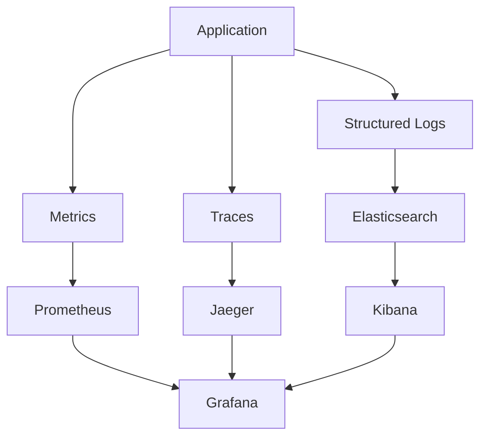

**Diagram sources**
- [server.js](file://apps/admin-api/server.js)

Structured logging is implemented using Pino, with logs formatted as JSON for easy parsing and analysis. Key metrics are exposed for monitoring system health, including request rates, error rates, and response times. Distributed tracing provides visibility into request flows across services.

The platform includes health check endpoints that return system status information, enabling automated monitoring and alerting. These endpoints verify connectivity to critical dependencies like the database and cache.

### Error Handling
The platform implements a robust error handling strategy to ensure graceful degradation and meaningful error reporting:

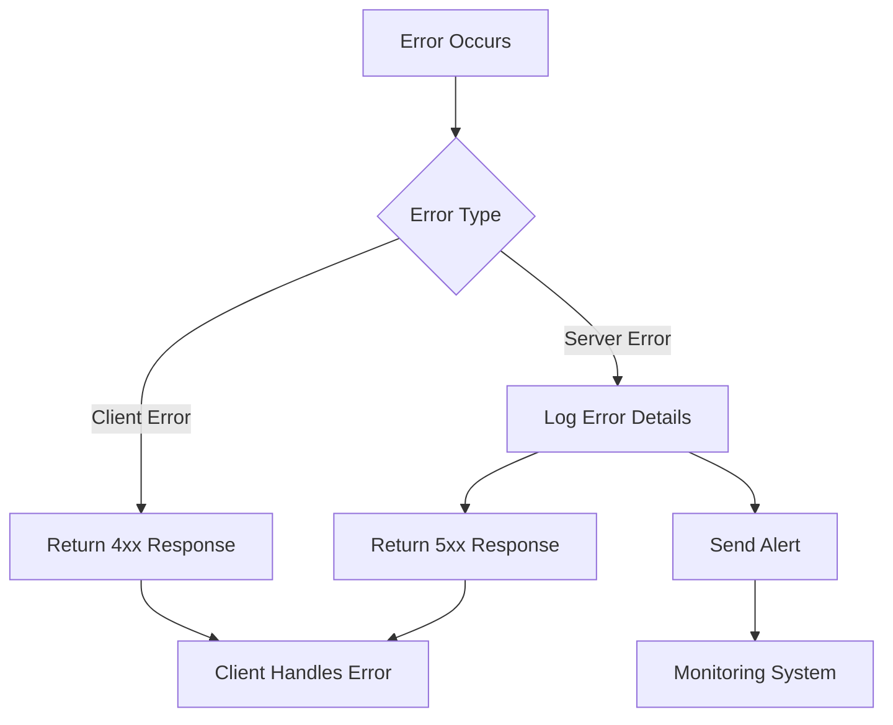

**Diagram sources**
- [app.js](file://apps/admin-api/src/app.js)

Errors are categorized as client errors (4xx) or server errors (5xx), with appropriate responses returned to clients. Server errors are logged with full context for debugging, while client errors are logged at a lower level to avoid log spam. Critical errors trigger alerts to the operations team.

The error handling middleware ensures that all errors are caught and processed consistently, preventing unhandled exceptions from crashing the application. Error responses include machine-readable codes and human-readable messages to aid debugging.

### Disaster Recovery
The platform implements several disaster recovery measures to ensure data integrity and service availability:

- Regular database backups with retention policies
- Replicated data storage across multiple availability zones
- Automated failover mechanisms for critical services
- Comprehensive monitoring with alerting for early detection of issues
- Documented recovery procedures for various failure scenarios

Backup strategies include both full and incremental backups, with regular testing of restore procedures. The platform is designed to degrade gracefully during partial outages, maintaining core functionality even when non-essential services are unavailable.

**Section sources**
- [server.js](file://apps/admin-api/server.js)
- [app.js](file://apps/admin-api/src/app.js)

## Technology Integration
The slimy-monorepo platform integrates various technologies to deliver its functionality, with careful consideration for version compatibility and dependency management.

### Version Compatibility Strategies
The platform uses pnpm workspaces to manage dependencies across the monorepo:

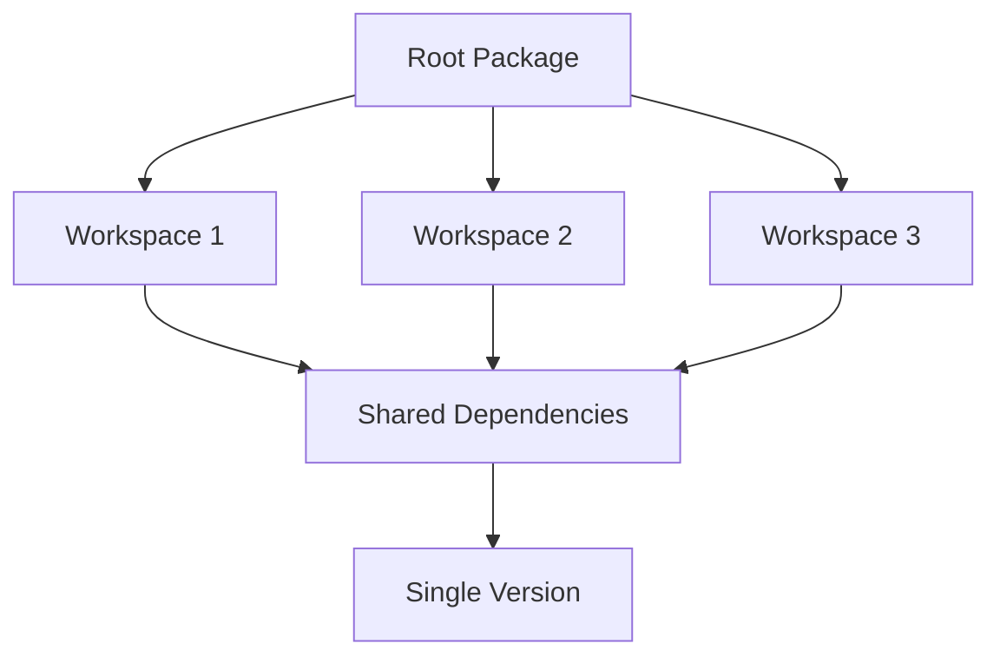

**Diagram sources**
- [package.json](file://package.json)

This approach ensures that all applications use compatible versions of shared dependencies, reducing the risk of version conflicts. The monorepo structure allows for coordinated updates of dependencies across all applications, ensuring that changes are tested in the context of the entire system.

The platform follows semantic versioning for its shared packages, with clear guidelines for breaking changes, new features, and bug fixes. This enables applications to upgrade dependencies with confidence, knowing that version numbers reflect the nature of changes.

### Integration Patterns
The platform uses several integration patterns to connect its components:

- **API Gateway Pattern**: The admin-api service acts as a central API gateway, providing a unified interface to the underlying data and services
- **Backend for Frontend (BFF) Pattern**: The web application serves as a BFF for the frontend, aggregating data from multiple backend services
- **Event Sourcing**: The bot service uses event sourcing to respond to Discord events in real-time
- **CQRS**: The platform implements Command Query Responsibility Segregation, with separate read and write models for optimal performance

These patterns enable the platform to scale effectively while maintaining separation of concerns and loose coupling between components.

**Section sources**
- [package.json](file://apps/admin-api/package.json)
- [package.json](file://apps/web/package.json)

## Conclusion
The slimy-monorepo platform is a well-architected system that combines modern development practices with robust infrastructure to deliver a reliable and scalable service. The monorepo structure enables efficient code sharing and coordinated development, while the layered architecture ensures separation of concerns and maintainability.

Key architectural strengths include:
- Clear separation of concerns through well-defined layers and components
- Comprehensive security model with JWT authentication and RBAC
- Scalable infrastructure designed for high availability
- Robust error handling and monitoring for operational reliability
- Thoughtful integration of technologies with attention to version compatibility

The platform is positioned for continued growth and evolution, with architectural patterns that support the addition of new features and services. By following established best practices and leveraging modern tools and frameworks, the slimy-monorepo platform provides a solid foundation for delivering value to its users.