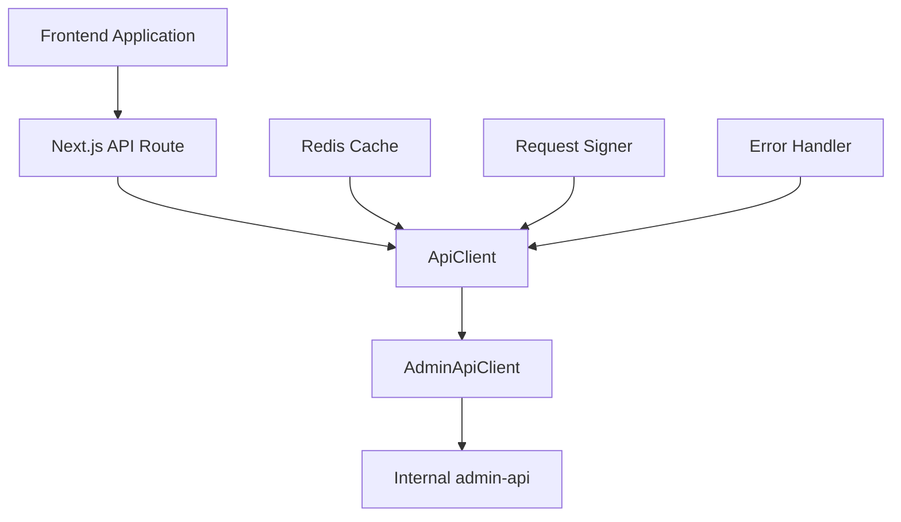
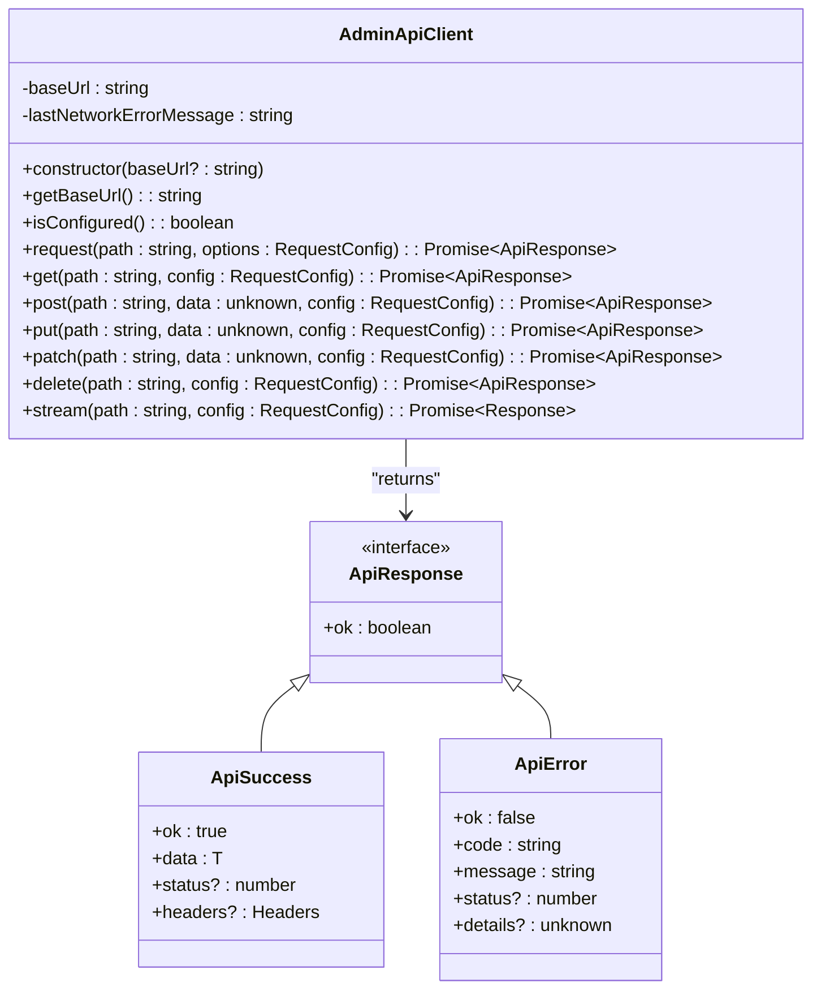
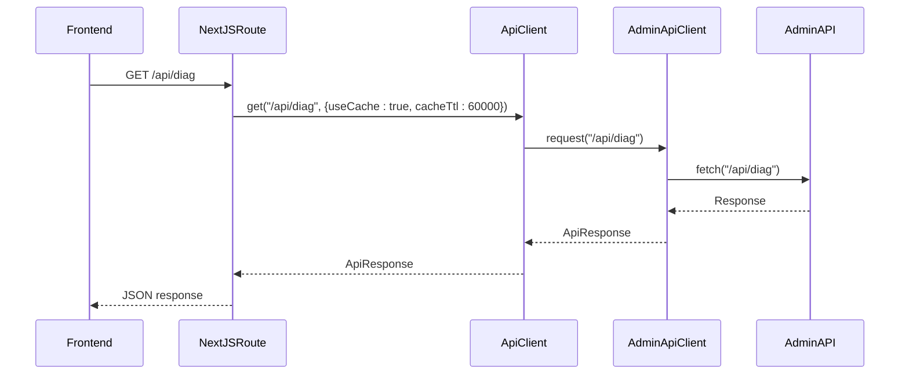
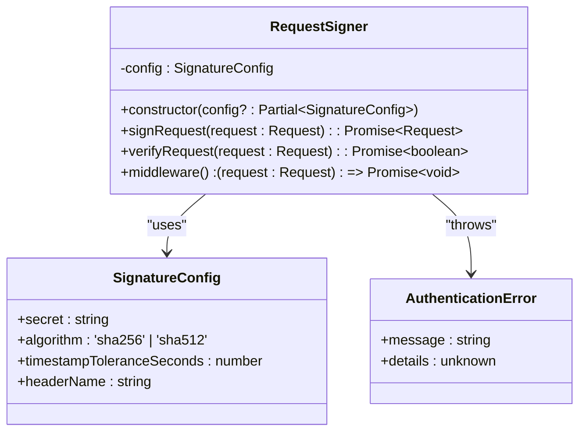
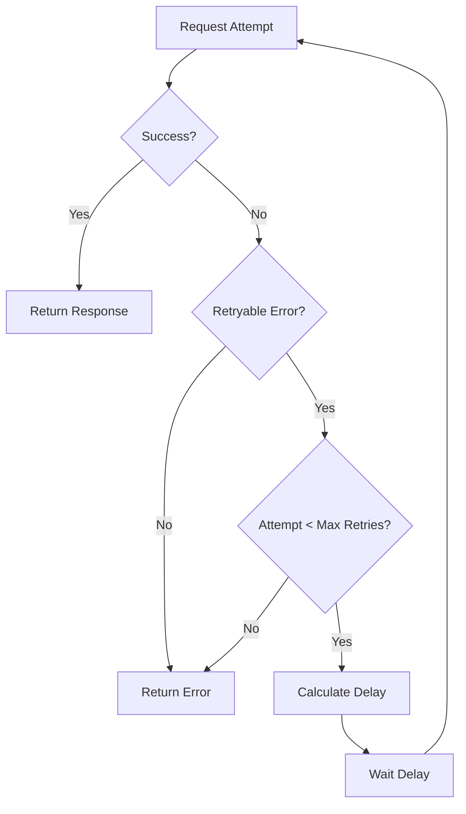
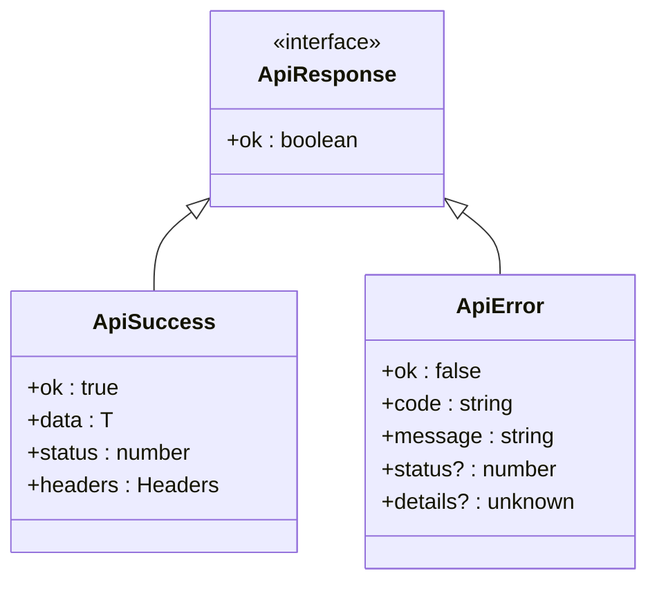
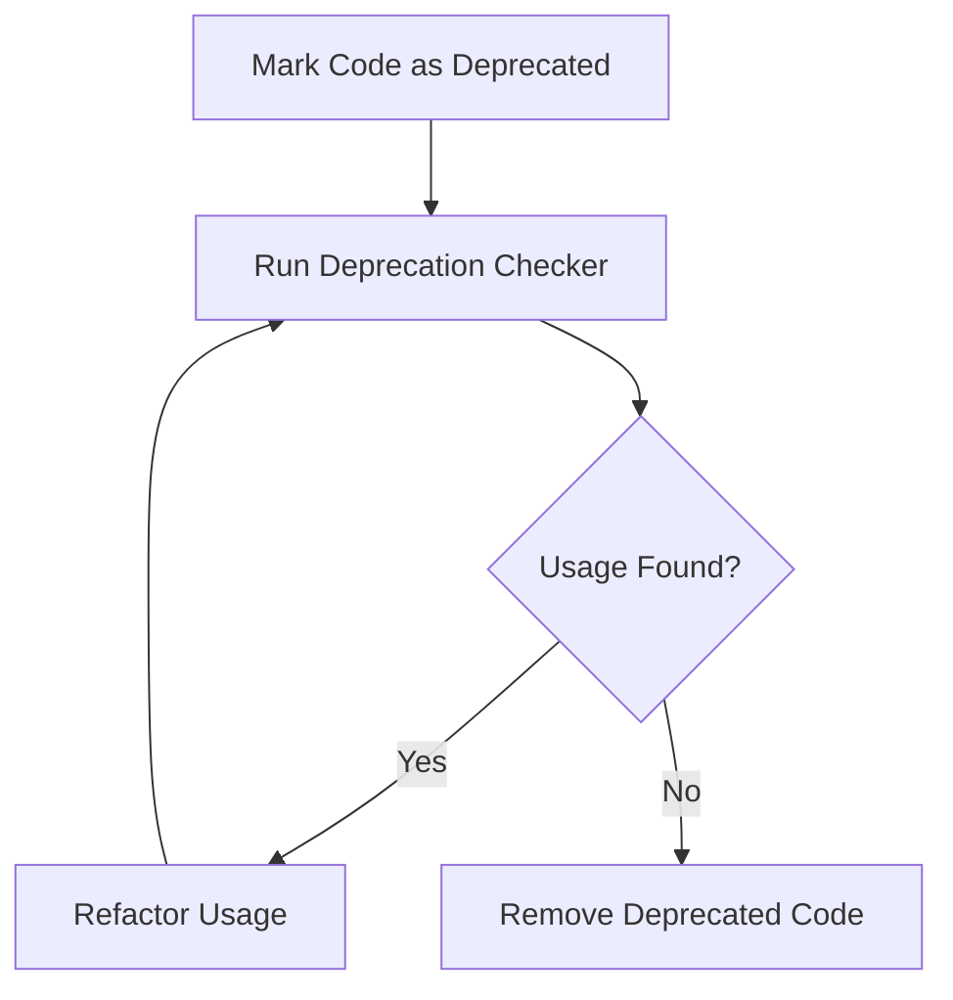
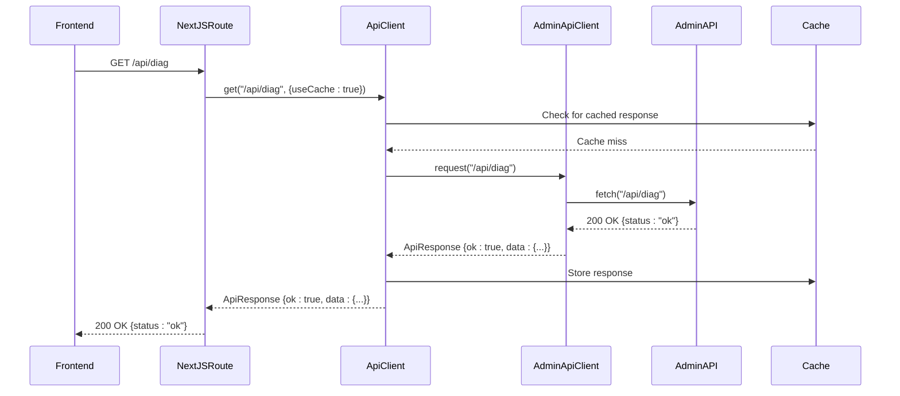
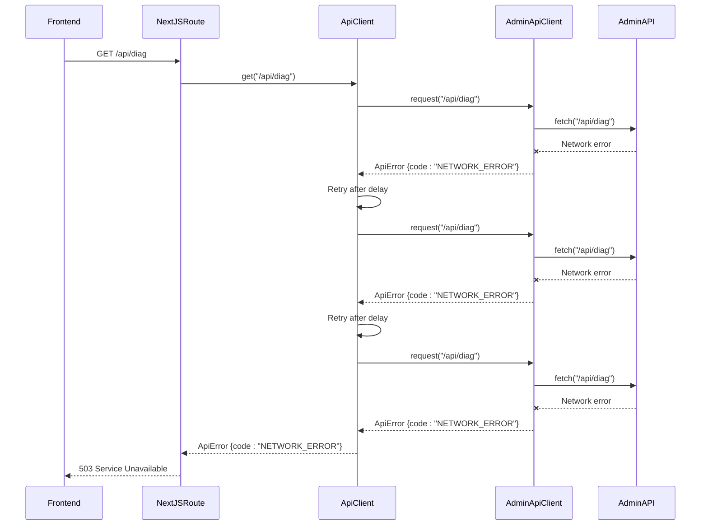

# API Proxy Pattern

<cite>
**Referenced Files in This Document**   
- [api-client.ts](file://apps/web/lib/api-client.ts)
- [admin-client.ts](file://apps/web/lib/api/admin-client.ts)
- [api-proxy.ts](file://apps/web/lib/api-proxy.ts)
- [request-signing.ts](file://apps/web/lib/security/request-signing.ts)
- [redis.ts](file://apps/web/lib/cache/redis.ts)
- [route.ts](file://apps/web/app/api/diag/route.ts)
- [diag.js](file://apps/admin-api/src/routes/diag.js)
- [deprecation-workflow.md](file://docs/deprecation-workflow.md)
- [api-error-handler.ts](file://apps/web/lib/api-error-handler.ts)
- [diag.test.ts](file://apps/web/tests/api/diag.test.ts)
</cite>

## Table of Contents
1. [Introduction](#introduction)
2. [Architecture Overview](#architecture-overview)
3. [Core Components](#core-components)
4. [Detailed Component Analysis](#detailed-component-analysis)
5. [Request Signing Implementation](#request-signing-implementation)
6. [Retry Configuration and Timeout Handling](#retry-configuration-and-timeout-handling)
7. [Caching Strategy](#caching-strategy)
8. [Error Handling and Response Transformation](#error-handling-and-response-transformation)
9. [Deprecation Strategy and Migration](#deprecation-strategy-and-migration)
10. [Example Request Flows](#example-request-flows)
11. [Conclusion](#conclusion)

## Introduction

The API proxy pattern implemented in the web application provides a secure and reliable communication layer between the frontend Next.js application and the internal admin-api backend. This pattern centralizes proxy logic through the AdminApiClient, which serves as the single source of truth for all API communication. The architecture ensures secure request forwarding, implements robust authentication handling, and provides comprehensive error management. This document details the implementation of this pattern, focusing on the key components that enable secure and efficient communication between the frontend and backend services.

**Section sources**
- [api-client.ts](file://apps/web/lib/api-client.ts#L1-L515)
- [admin-client.ts](file://apps/web/lib/api/admin-client.ts#L1-L398)

## Architecture Overview

The API proxy architecture follows a layered approach with clear separation of concerns. At the core is the AdminApiClient, which handles all communication with the admin-api backend. This client is wrapped by the ApiClient, which adds additional features like caching and retry logic. Next.js API routes act as reverse proxies, forwarding requests from the frontend to the internal admin-api while preserving authentication context. The architecture ensures that all requests to the admin-api are properly authenticated, signed, and handled with appropriate retry and caching strategies.



**Diagram sources **
- [api-client.ts](file://apps/web/lib/api-client.ts#L54-L63)
- [admin-client.ts](file://apps/web/lib/api/admin-client.ts#L37-L52)
- [route.ts](file://apps/web/app/api/diag/route.ts#L2)

## Core Components

The API proxy pattern is built around several core components that work together to provide a robust and secure communication layer. The AdminApiClient serves as the foundation, handling the actual HTTP communication with the admin-api backend. The ApiClient wraps this with additional functionality like caching and retry logic. The request signing implementation ensures that all requests are properly authenticated and tamper-proof. Together, these components provide a comprehensive solution for secure API communication.

**Section sources**
- [api-client.ts](file://apps/web/lib/api-client.ts#L54-L63)
- [admin-client.ts](file://apps/web/lib/api/admin-client.ts#L37-L52)
- [request-signing.ts](file://apps/web/lib/security/request-signing.ts#L34-L43)

## Detailed Component Analysis

### AdminApiClient Analysis

The AdminApiClient is the single source of truth for all proxy logic in the application. It handles the core functionality of making HTTP requests to the admin-api backend, with special handling for different execution environments. On the server side, it uses the internal URL to communicate directly with the admin-api, while on the client side, it uses relative URLs to route through Next.js rewrites, avoiding CORS issues.



**Diagram sources **
- [admin-client.ts](file://apps/web/lib/api/admin-client.ts#L37-L398)

**Section sources**
- [admin-client.ts](file://apps/web/lib/api/admin-client.ts#L37-L398)

### ApiClient Analysis

The ApiClient wraps the AdminApiClient with additional functionality, providing a higher-level interface with features like caching, retry logic, and request interceptors. It serves as the primary interface for most application code, abstracting away the complexity of direct API communication. The client implements a comprehensive retry mechanism with exponential backoff and provides a flexible caching system with TTL-based invalidation.

```mermaid
classDiagram
class ApiClient {
-baseUrl : string
-defaultTimeout : number
-retryConfig : RetryConfig
-cache : Map~string, CacheEntry~
-requestInterceptors : (config : RequestInit) => RequestInit[]
-responseInterceptors : (response : Response) => Response | Promise[]Response~~
-errorInterceptors : (error : ApiError) => ApiError | Promise[]ApiError~~
-adminClient : AdminApiClient
+constructor(baseUrl? : string)
+addRequestInterceptor(interceptor : (config : RequestInit) => RequestInit) : void
+addResponseInterceptor(interceptor : (response : Response) => Response | Promise~Response~) : void
+addErrorInterceptor(interceptor : (error : ApiError) => ApiError | Promise~ApiError~) : void
+get<T>(path : string, config : RequestConfig) : Promise~ApiResponse~
+post<T>(path : string, data : unknown, config : RequestConfig) : Promise~ApiResponse~
+put<T>(path : string, data : unknown, config : RequestConfig) : Promise~ApiResponse~
+patch<T>(path : string, data : unknown, config : RequestConfig) : Promise~ApiResponse~
+delete<T>(path : string, config : RequestConfig) : Promise~ApiResponse~
+request<T>(method : string, path : string, data : unknown, config : RequestConfig) : Promise~ApiResponse~
+clearCache() : void
+cleanExpiredCache() : void
+getCacheStats() : { size : number; keys : string[] }
}
class AdminApiClient {
+request<T>(path : string, options : RequestConfig) : Promise~ApiResponse~
}
class CacheEntry {
+data : T
+timestamp : number
+ttl : number
}
class RequestConfig {
+timeout? : number
+retries? : number
+useCache? : boolean
+cacheTtl? : number
+headers? : Record~string, string~
}
class RetryConfig {
+maxRetries : number
+baseDelay : number
+maxDelay : number
+backoffMultiplier : number
}
ApiClient --> AdminApiClient : "delegates to"
ApiClient --> CacheEntry : "uses"
ApiClient --> RequestConfig : "uses"
ApiClient --> RetryConfig : "uses"
```

**Diagram sources **
- [api-client.ts](file://apps/web/lib/api-client.ts#L54-L63)

**Section sources**
- [api-client.ts](file://apps/web/lib/api-client.ts#L54-L515)

### Next.js API Route Analysis

Next.js API routes serve as reverse proxies, forwarding requests from the frontend to the internal admin-api backend. These routes use the ApiClient to make requests to the admin-api, handling the response transformation and error handling. The routes preserve authentication context by forwarding cookies and headers, ensuring that the admin-api receives the same authentication information as the original request.



**Diagram sources **
- [route.ts](file://apps/web/app/api/diag/route.ts#L6-L17)
- [admin-client.ts](file://apps/web/lib/api/admin-client.ts#L137-L398)

**Section sources**
- [route.ts](file://apps/web/app/api/diag/route.ts#L6-L17)

## Request Signing Implementation

The request signing implementation uses HMAC-SHA256 to ensure the authenticity and integrity of requests between services. This prevents tampering and ensures that requests are coming from trusted sources. The RequestSigner class handles both signing outgoing requests and verifying incoming requests, with configurable parameters for the secret, algorithm, and timestamp tolerance.



**Diagram sources **
- [request-signing.ts](file://apps/web/lib/security/request-signing.ts#L34-L203)

**Section sources**
- [request-signing.ts](file://apps/web/lib/security/request-signing.ts#L34-L261)

## Retry Configuration and Timeout Handling

The API proxy implements a robust retry mechanism with exponential backoff to handle transient failures. The retry configuration is customizable, with default values of 3 maximum retries, 1 second base delay, 30 seconds maximum delay, and a backoff multiplier of 2. This ensures that temporary network issues or server overloads are handled gracefully, improving the overall reliability of the application.



**Diagram sources **
- [api-client.ts](file://apps/web/lib/api-client.ts#L69-L84)
- [api-client.ts](file://apps/web/lib/api-client.ts#L322-L371)

**Section sources**
- [api-client.ts](file://apps/web/lib/api-client.ts#L69-L84)
- [api-client.ts](file://apps/web/lib/api-client.ts#L322-L371)

## Caching Strategy

The caching strategy uses an in-memory Map for storing responses with TTL-based invalidation. The cache is configurable, with options to enable or disable caching and set the TTL for individual requests. The default TTL is 5 minutes, but this can be overridden for specific requests. The cache is automatically cleaned of expired entries, and there are methods to manually clear the cache or get cache statistics.

```mermaid
classDiagram
class ApiClient {
-cache : Map~string, CacheEntry~
+getCachedResponse<T>(key : string) : ApiSuccess~T~ | null
+setCachedResponse<T>(key : string, data : T, ttl : number) : void
+cleanCache() : void
+clearCache() : void
+getCacheStats() : { size : number; keys : string[] }
}
class CacheEntry {
+data : T
+timestamp : number
+ttl : number
}
ApiClient --> CacheEntry : "uses"
```

**Diagram sources **
- [api-client.ts](file://apps/web/lib/api-client.ts#L59-L60)
- [api-client.ts](file://apps/web/lib/api-client.ts#L120-L178)

**Section sources**
- [api-client.ts](file://apps/web/lib/api-client.ts#L120-L178)

## Error Handling and Response Transformation

The error handling system provides consistent error responses across the application. Errors are standardized into a common format with a code, message, and optional details. The system handles different types of errors, including network errors, timeout errors, and upstream errors from the admin-api. Response transformation ensures that all API responses follow a consistent format, making it easier for the frontend to handle responses.



**Diagram sources **
- [api-client.ts](file://apps/web/lib/api-client.ts#L17-L32)
- [admin-client.ts](file://apps/web/lib/api/admin-client.ts#L15-L30)

**Section sources**
- [api-client.ts](file://apps/web/lib/api-client.ts#L17-L32)
- [admin-client.ts](file://apps/web/lib/api/admin-client.ts#L15-L30)

## Deprecation Strategy and Migration

The deprecation strategy follows a systematic workflow to safely remove obsolete code. The process begins by marking code as deprecated with a JSDoc tag, including a reason and suggested alternative. A custom script (`lint:deprecations`) checks for usage of deprecated code and fails the build if any is found. Once all usages are removed, the deprecated code can be safely deleted. This ensures a clean and maintainable codebase.



**Diagram sources **
- [deprecation-workflow.md](file://docs/deprecation-workflow.md#L64-L95)
- [api-proxy.ts](file://apps/web/lib/api-proxy.ts#L26-L27)

**Section sources**
- [deprecation-workflow.md](file://docs/deprecation-workflow.md#L64-L95)
- [api-proxy.ts](file://apps/web/lib/api-proxy.ts#L26-L69)

## Example Request Flows

### Successful Proxy Request

A successful proxy request follows the complete flow from the frontend through the Next.js API route, ApiClient, and AdminApiClient to the admin-api backend. The request is properly authenticated, signed, and cached if applicable. The response is transformed into a standardized format and returned to the frontend.



**Diagram sources **
- [route.ts](file://apps/web/app/api/diag/route.ts#L6-L17)
- [api-client.ts](file://apps/web/lib/api-client.ts#L308-L315)
- [admin-client.ts](file://apps/web/lib/api/admin-client.ts#L166-L220)

### Failed Proxy Request

A failed proxy request demonstrates the error handling and retry mechanism. When the admin-api is unavailable, the request fails with a network error. The ApiClient retries the request according to the retry configuration before ultimately returning a structured error response to the frontend.



**Diagram sources **
- [route.ts](file://apps/web/app/api/diag/route.ts#L12-L14)
- [api-client.ts](file://apps/web/lib/api-client.ts#L333-L344)
- [admin-client.ts](file://apps/web/lib/api/admin-client.ts#L221-L240)

## Conclusion

The API proxy pattern implemented in the web application provides a robust and secure communication layer between the frontend and backend services. By centralizing proxy logic in the AdminApiClient and enhancing it with the ApiClient, the architecture ensures consistent handling of authentication, caching, retries, and error management. The request signing implementation prevents tampering, while the comprehensive error handling system provides reliable feedback to the frontend. The deprecation strategy ensures a clean and maintainable codebase, allowing for safe migration from legacy components to modern implementations. This pattern effectively addresses the challenges of secure communication in a distributed system, providing a reliable foundation for the application's functionality.