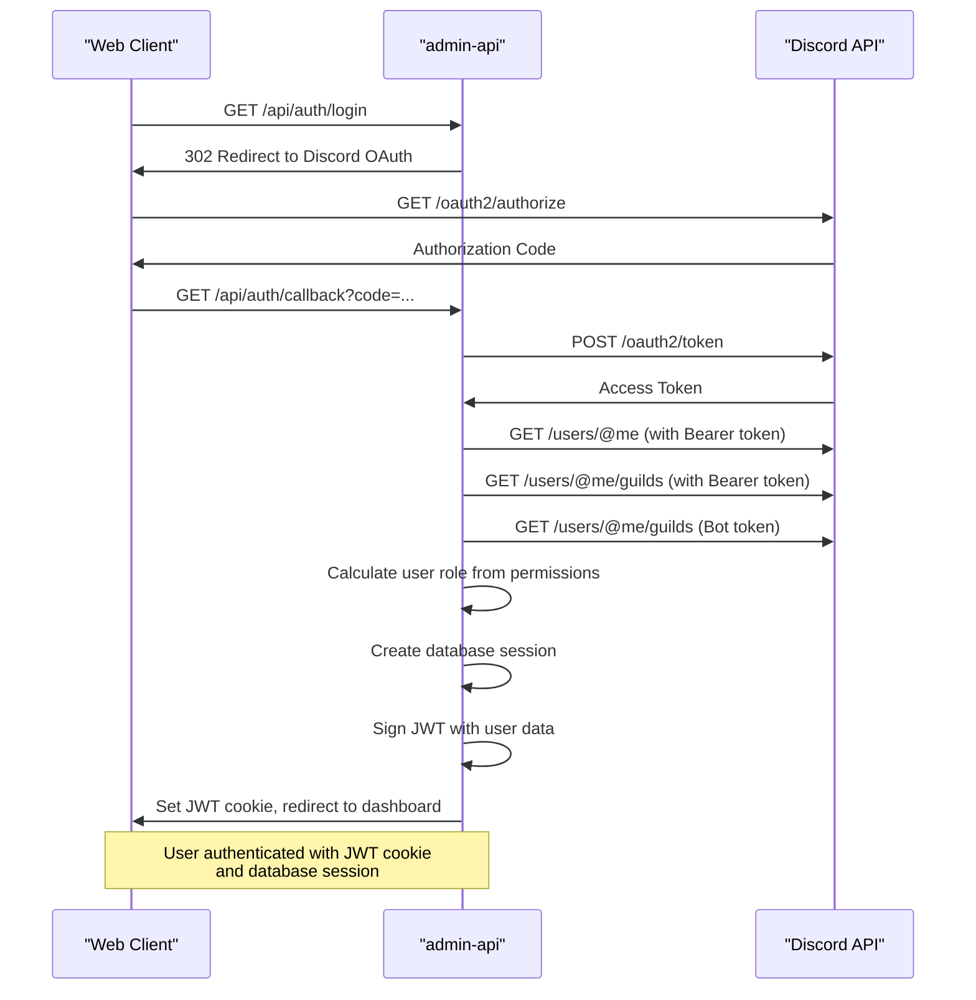
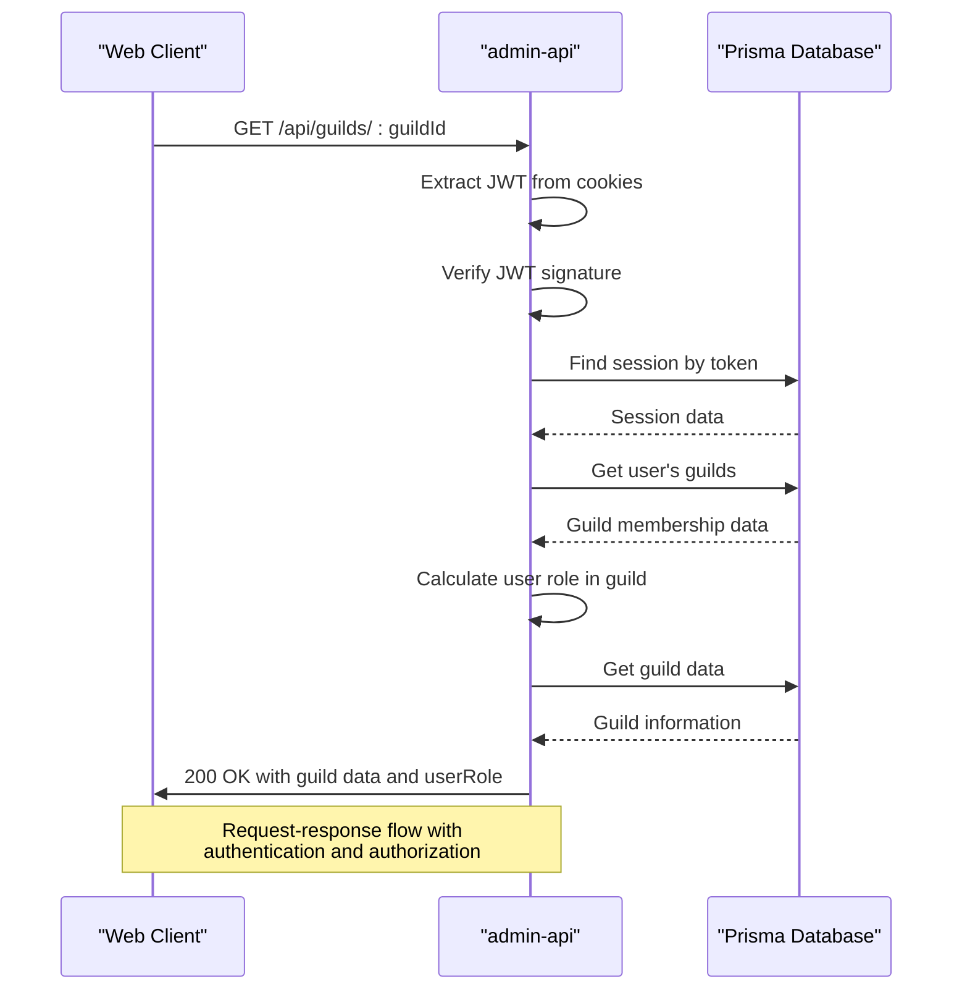
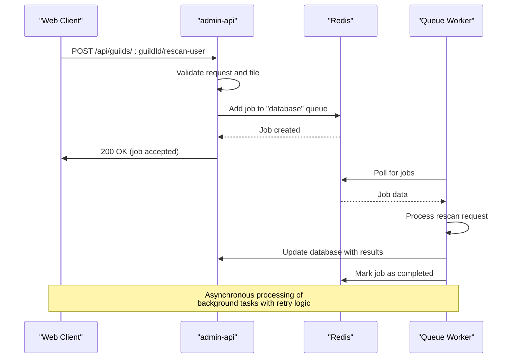
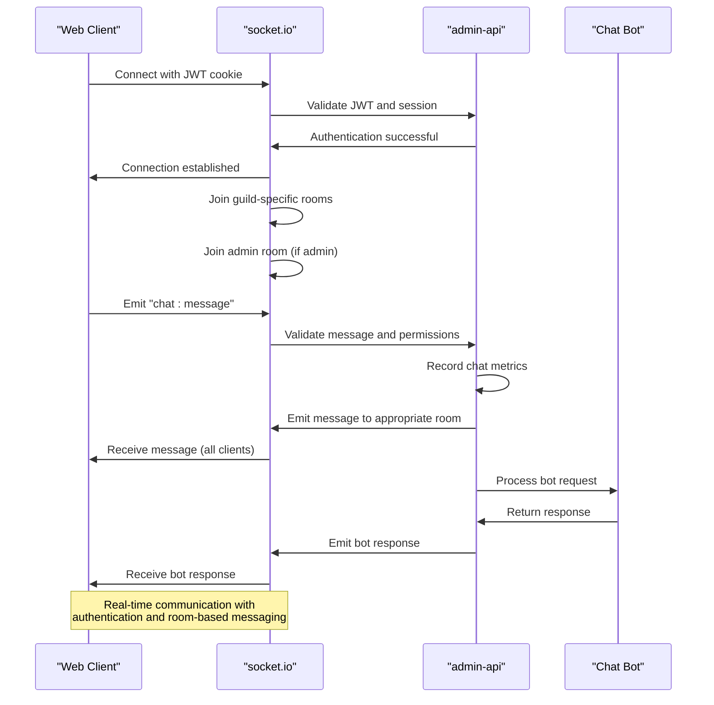
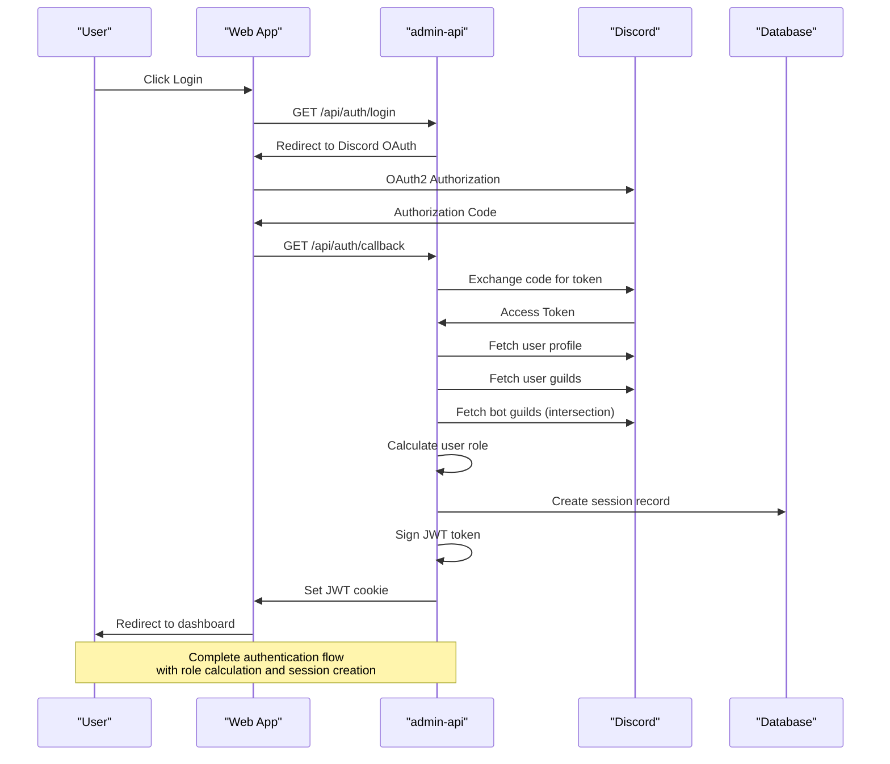
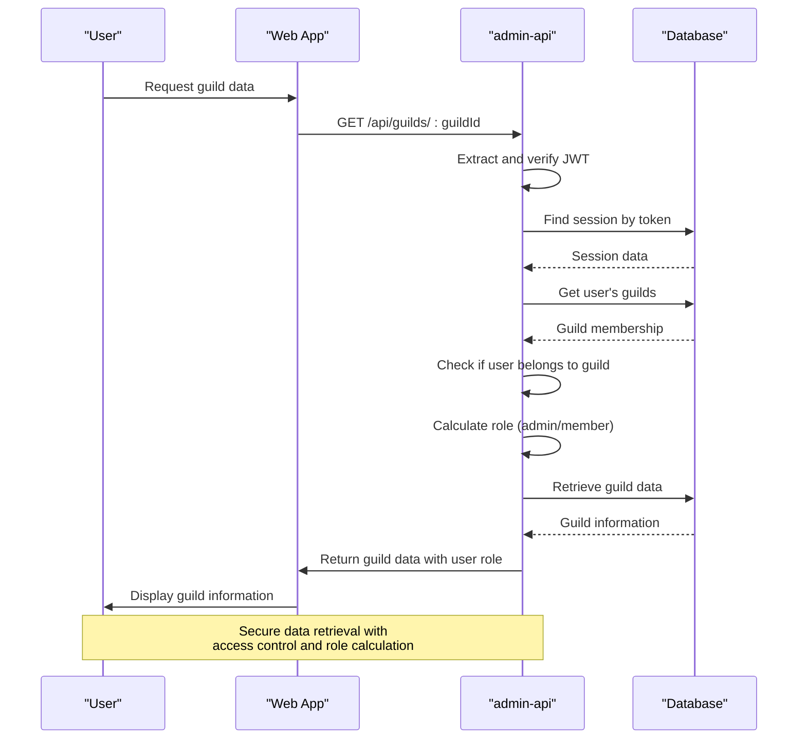
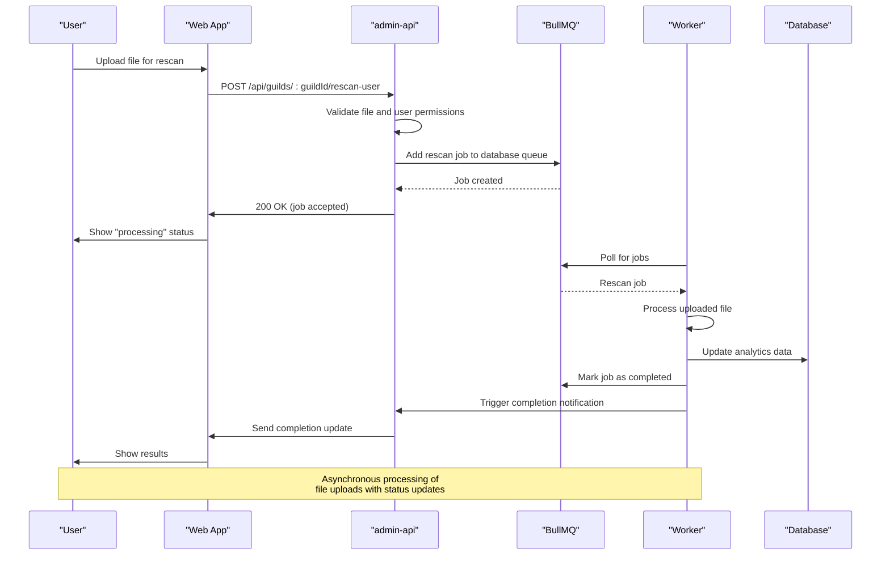
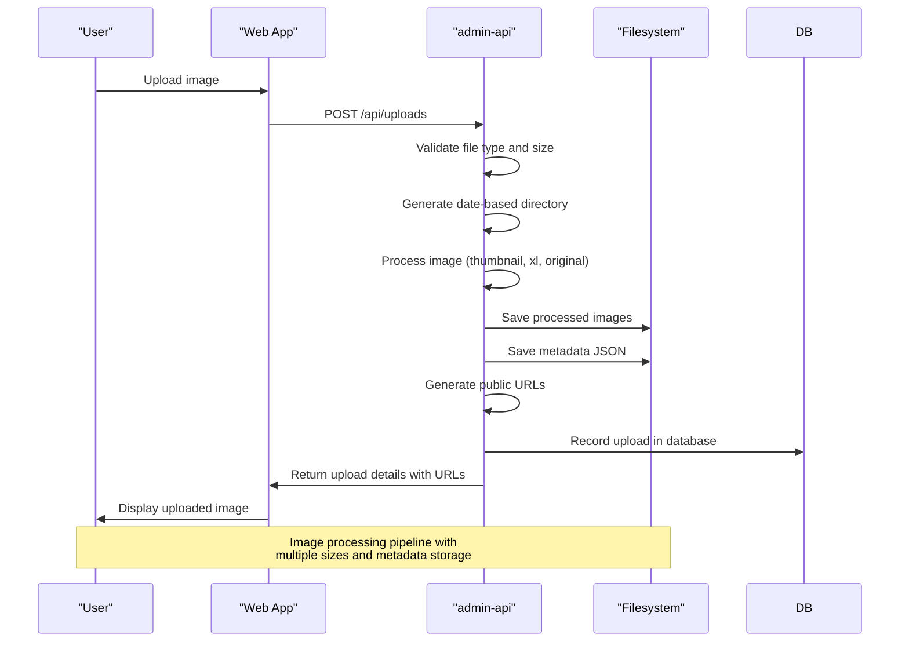

# Data Flow

<cite>
**Referenced Files in This Document**   
- [server.js](file://apps/admin-api/server.js)
- [auth.js](file://apps/admin-api/src/routes/auth.js)
- [middleware/auth.js](file://apps/admin-api/src/middleware/auth.js)
- [socket.js](file://apps/admin-api/src/socket.js)
- [queue-manager.js](file://apps/admin-api/lib/queue-manager.js)
- [index.js](file://apps/admin-api/src/lib/queues/index.js)
- [audit-processor.js](file://apps/admin-api/src/lib/queues/audit-processor.js)
- [database-processor.js](file://apps/admin-api/src/lib/queues/database-processor.js)
- [guilds.js](file://apps/admin-api/src/routes/guilds.js)
- [uploads.js](file://apps/admin-api/src/services/uploads.js)
- [admin-client.ts](file://apps/web/lib/api/admin-client.ts)
- [api-proxy.ts](file://apps/web/lib/api-proxy.ts)
- [redis.js](file://apps/admin-api/lib/cache/redis.js)
- [session-store.js](file://apps/admin-api/lib/session-store.js)
</cite>

## Table of Contents
1. [Introduction](#introduction)
2. [Authentication Flow](#authentication-flow)
3. [Request-Response Flow](#request-response-flow)
4. [Event-Driven Data Processing](#event-driven-data-processing)
5. [Real-Time Communication](#real-time-communication)
6. [API Proxy Pattern](#api-proxy-pattern)
7. [Key Data Flow Scenarios](#key-data-flow-scenarios)
8. [Error Handling and Retry Mechanisms](#error-handling-and-retry-mechanisms)
9. [Conclusion](#conclusion)

## Introduction

The slimy-monorepo platform implements a sophisticated data flow architecture that handles user interactions, background processing, and real-time communication across multiple services. This document details the data flow patterns from client applications (web, admin-ui) to the admin-api backend, focusing on authentication, data retrieval, event-driven processing, and real-time communication.

The system architecture is built around several key components:
- **Authentication**: JWT-based authentication with Redis session storage
- **Data Flow**: Request-response patterns for guild data, club analytics, and uploads
- **Event Processing**: Queue-based background task processing using BullMQ
- **Real-Time Communication**: WebSocket-based live diagnostics and log streaming via socket.io
- **API Gateway**: Proxy pattern for forwarding requests from web applications to admin-api

This documentation provides comprehensive sequence diagrams and detailed explanations of the critical data pathways within the system.

**Section sources**
- [server.js](file://apps/admin-api/server.js#L1-L100)

## Authentication Flow

The authentication system in the slimy-monorepo platform uses Discord OAuth2 for user authentication, with JWT tokens and Redis-based session management for maintaining user sessions. The flow begins when a user initiates login through the web interface, which redirects to Discord's authorization endpoint.

The authentication process follows these steps:
1. User requests login at `/api/auth/login`
2. Server redirects to Discord OAuth2 authorization URL with appropriate scopes
3. After user consent, Discord redirects back to `/api/auth/callback` with an authorization code
4. The backend exchanges the authorization code for access and refresh tokens
5. User profile and guild information are retrieved from Discord API
6. User role is determined based on guild permissions (member, club, or admin)
7. A session is created in the database with a session token
8. JWT token containing user information is signed and set as an HTTP-only cookie
9. User is redirected to the dashboard with authenticated session

The system implements role-based access control (RBAC) with three levels: member, club, and admin. Role determination occurs during the authentication callback by analyzing the user's permissions in guilds where the bot is also present. The session information, including user's guilds, is stored in the database rather than in the JWT token to prevent token size issues.



**Diagram sources **
- [auth.js](file://apps/admin-api/src/routes/auth.js#L1-L482)
- [session-store.js](file://apps/admin-api/lib/session-store.js#L1-L103)

**Section sources**
- [auth.js](file://apps/admin-api/src/routes/auth.js#L1-L482)
- [middleware/auth.js](file://apps/admin-api/src/middleware/auth.js#L1-L314)
- [session-store.js](file://apps/admin-api/lib/session-store.js#L1-L103)

## Request-Response Flow

The request-response flow in the slimy-monorepo platform follows a standard RESTful pattern with middleware-based authentication and authorization. Client applications (web, admin-ui) communicate with the admin-api backend through well-defined endpoints for data retrieval and manipulation.

The flow begins when a client makes a request to an admin-api endpoint. The request passes through several middleware layers before reaching the route handler:

1. Authentication middleware extracts and validates the JWT token from cookies
2. User session is resolved from the database using the session token
3. Role-based access control (RBAC) middleware verifies the user's permissions
4. Request-specific validation middleware validates input parameters
5. Route handler processes the request and returns a response

For guild data retrieval, the system implements a two-step process where the user's role in a specific guild is calculated based on their Discord permissions. The system checks if the user has administrator privileges (MANAGE_GUILD or ADMINISTRATOR permissions) to determine their access level.

Club analytics data is retrieved through dedicated endpoints that validate the user's access to the requested guild before returning analytics information. The system ensures data isolation between different guilds and enforces proper access controls.



**Diagram sources **
- [guilds.js](file://apps/admin-api/src/routes/guilds.js#L1-L522)
- [middleware/auth.js](file://apps/admin-api/src/middleware/auth.js#L1-L314)

**Section sources**
- [guilds.js](file://apps/admin-api/src/routes/guilds.js#L1-L522)
- [middleware/auth.js](file://apps/admin-api/src/middleware/auth.js#L1-L314)

## Event-Driven Data Processing

The slimy-monorepo platform implements an event-driven architecture for background task processing using BullMQ with Redis as the message broker. This system handles data ingestion, processing, and other asynchronous operations that would otherwise block the main request-response cycle.

The queue infrastructure consists of three primary queues:
- **chat**: Handles chat bot interactions and message processing
- **database**: Manages database operations and data processing tasks
- **audit**: Processes event sourcing and audit trail logging

Each queue has configurable concurrency limits and retry policies. Failed jobs are automatically retried up to three times with exponential backoff (starting at 2 seconds). Completed and failed jobs are retained for debugging purposes (last 50 completed, 100 failed).

The system implements a robust error handling strategy where transient failures are retried, while permanent failures are logged and monitored. Each job processor includes comprehensive logging and metrics collection to track processing duration, success rates, and failure patterns.



**Diagram sources **
- [index.js](file://apps/admin-api/src/lib/queues/index.js#L1-L396)
- [database-processor.js](file://apps/admin-api/src/lib/queues/database-processor.js#L1-L324)

**Section sources**
- [index.js](file://apps/admin-api/src/lib/queues/index.js#L1-L396)
- [queue-manager.js](file://apps/admin-api/lib/queue-manager.js#L1-L31)
- [database-processor.js](file://apps/admin-api/src/lib/queues/database-processor.js#L1-L324)

## Real-Time Communication

The platform implements real-time communication using WebSockets via socket.io for live diagnostics and log streaming. This enables instant updates for chat messages, system diagnostics, and other time-sensitive information.

The WebSocket connection is established after successful authentication, with the socket middleware validating the JWT token from cookies. Once connected, clients are automatically joined to rooms based on their guild membership, enabling targeted message delivery.

The system implements a publish-subscribe pattern where:
- Clients emit "chat:message" events with message content
- The server validates the message and user permissions
- Valid messages are published to appropriate channels (all users or admin-only)
- The chat bot can be triggered by messages containing "@slimy" or explicit bot requests
- Bot responses are published back through the same WebSocket connection

This real-time communication layer is used for both user-facing features (chat) and operational purposes (diagnostics, log streaming), providing immediate feedback and monitoring capabilities.



**Diagram sources **
- [socket.js](file://apps/admin-api/src/socket.js#L1-L204)

**Section sources**
- [socket.js](file://apps/admin-api/src/socket.js#L1-L204)

## API Proxy Pattern

The web application implements an API proxy pattern to forward authentication and diagnostic requests to the admin-api backend. This pattern provides several benefits including CORS avoidance, request/response normalization, and centralized error handling.

The proxy implementation is located in `admin-client.ts` and `api-proxy.ts`, with the former being the primary implementation and the latter maintaining backward compatibility. The proxy client determines the appropriate base URL based on the execution environment:

- Server-side: Uses internal Docker network URL (`http://slimy-admin-api:3080`)
- Client-side: Uses relative paths (`/api`) to leverage Next.js rewrite rules

The proxy handles various aspects of HTTP communication:
- Automatic header management (Content-Type, authentication)
- Request timeout with configurable duration (default 30 seconds)
- Unified error handling with specific error codes (TIMEOUT_ERROR, NETWORK_ERROR, etc.)
- Support for streaming responses (Server-Sent Events)
- Request/response interceptors for consistent processing

This pattern allows the web application to maintain a consistent API interface regardless of deployment environment, while abstracting away the complexities of cross-origin requests and network reliability issues.

```mermaid
flowchart TD
Client["Web Client"]
Proxy["AdminApiClient"]
Rewrite["Next.js Rewrite"]
Backend["admin-api"]
Client --> |Direct API call| Proxy
Proxy --> |Server-side| Backend
Proxy --> |Client-side| Rewrite
Rewrite --> Backend
subgraph "Server-side Execution"
Proxy --> Backend
end
subgraph "Client-side Execution"
Proxy --> Rewrite
Rewrite --> Backend
end
style Proxy fill:#f9f,stroke:#333
style Backend fill:#bbf,stroke:#333
Note: API Proxy routes requests appropriately<br/>based on execution environment
```

**Diagram sources **
- [admin-client.ts](file://apps/web/lib/api/admin-client.ts#L1-L398)
- [api-proxy.ts](file://apps/web/lib/api-proxy.ts#L1-L69)

**Section sources**
- [admin-client.ts](file://apps/web/lib/api/admin-client.ts#L1-L398)
- [api-proxy.ts](file://apps/web/lib/api-proxy.ts#L1-L69)

## Key Data Flow Scenarios

This section details the data flow for key scenarios in the slimy-monorepo platform, illustrating the complete pathway from user action to system response.

### User Authentication

The user authentication flow begins with a login request from the client, which initiates the OAuth2 flow with Discord. After successful authentication, the system creates a session in the database and sets a JWT cookie for subsequent requests.



**Diagram sources **
- [auth.js](file://apps/admin-api/src/routes/auth.js#L1-L482)

### Guild Data Retrieval

When retrieving guild data, the system validates the user's access to the requested guild and calculates their role based on Discord permissions. This ensures that users can only access data for guilds they belong to, with appropriate permission levels.



**Diagram sources **
- [guilds.js](file://apps/admin-api/src/routes/guilds.js#L1-L522)

### Club Analytics Rescan

The club analytics rescan process handles file uploads for data reprocessing. This is implemented as an asynchronous operation using the queue system to avoid blocking the main request thread.



**Diagram sources **
- [guilds.js](file://apps/admin-api/src/routes/guilds.js#L1-L522)
- [index.js](file://apps/admin-api/src/lib/queues/index.js#L1-L396)

### File Uploads with Image Processing

The file upload system handles image processing and storage for guild uploads. Uploaded files are processed to create thumbnails and different sizes, with metadata stored in the filesystem.



**Diagram sources **
- [uploads.js](file://apps/admin-api/src/services/uploads.js#L1-L169)

## Error Handling and Retry Mechanisms

The slimy-monorepo platform implements comprehensive error handling and retry mechanisms across its asynchronous data flows. These mechanisms ensure system reliability and graceful degradation in the face of transient failures.

For queue-based processing, the system implements:
- Automatic retries for failed jobs (up to 3 attempts)
- Exponential backoff strategy (starting at 2 seconds)
- Detailed error logging with stack traces
- Metrics collection for monitoring job success rates
- Dead letter queue pattern for irrecoverable failures

The audit logging system includes specific error handling to ensure that audit failures do not compromise the main operation. If audit logging fails, the system continues processing while recording the failure in monitoring metrics.

Network requests through the API proxy include timeout handling (30 seconds by default) and specific error categorization:
- TIMEOUT_ERROR: Request exceeded timeout threshold
- NETWORK_ERROR: Network connectivity issues
- UPSTREAM_ERROR: Errors returned by the backend service
- CONFIG_ERROR: Configuration issues (e.g., missing base URL)

These mechanisms work together to create a resilient system that can recover from transient failures while providing visibility into persistent issues.

```mermaid
flowchart TD
Job["Queue Job"]
Success["Success"]
Failure["Failure"]
Retry["Retry?"]
MaxRetries["Max retries reached?"]
DeadLetter["Move to Dead Letter Queue"]
Alert["Send Alert"]
Complete["Job Complete"]
Job --> Process["Process Job"]
Process --> |Success| Success
Process --> |Failure| Retry
Retry --> |Yes| Delay["Wait (exponential backoff)"]
Delay --> Job
Retry --> |No| MaxRetries
MaxRetries --> |Yes| DeadLetter
MaxRetries --> |No| Alert
DeadLetter --> Complete
Alert --> Complete
style Success fill:#d4edda,stroke:#c3e6cb
style Failure fill:#f8d7da,stroke:#f5c6cb
style DeadLetter fill:#fff3cd,stroke:#ffeaa7
style Alert fill:#d1ecf1,stroke:#bee5eb
Note: Queue job retry mechanism with<br/>exponential backoff and dead letter handling
```

**Diagram sources **
- [index.js](file://apps/admin-api/src/lib/queues/index.js#L1-L396)
- [audit-processor.js](file://apps/admin-api/src/lib/queues/audit-processor.js#L1-L401)

**Section sources**
- [index.js](file://apps/admin-api/src/lib/queues/index.js#L1-L396)
- [audit-processor.js](file://apps/admin-api/src/lib/queues/audit-processor.js#L1-L401)

## Conclusion

The slimy-monorepo platform implements a robust and scalable data flow architecture that effectively handles both synchronous request-response patterns and asynchronous event-driven processing. The system's design prioritizes security, reliability, and real-time capabilities through several key patterns:

1. **Secure Authentication**: JWT-based authentication with Redis session storage ensures secure user sessions while maintaining scalability.

2. **Efficient Request Handling**: The middleware-based approach to authentication and authorization provides a clean separation of concerns and reusable components.

3. **Resilient Background Processing**: The BullMQ queue system with retry mechanisms ensures reliable processing of background tasks even in the face of transient failures.

4. **Real-Time Capabilities**: WebSocket-based communication enables instant updates for chat, diagnostics, and monitoring.

5. **Consistent API Access**: The API proxy pattern abstracts away deployment complexities and provides a uniform interface across environments.

6. **Comprehensive Error Handling**: Systematic error handling and retry mechanisms ensure reliability and provide visibility into system health.

The architecture effectively balances immediate user interactions with background processing needs, while maintaining strict access controls and data isolation between different guilds. The use of Redis for both session storage and as a message broker demonstrates efficient resource utilization, while the separation of concerns between different queue types (chat, database, audit) enables targeted optimization and monitoring.

This data flow architecture provides a solid foundation for the platform's current functionality and can be extended to support additional features and scaling requirements in the future.