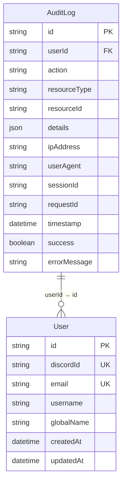
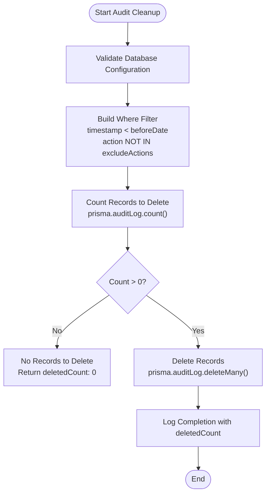
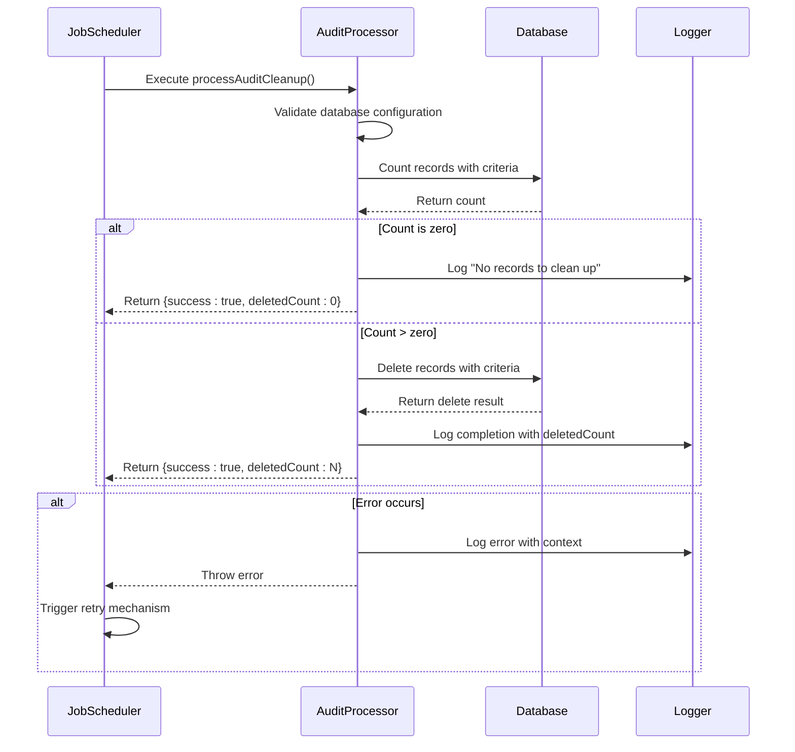

# Audit Cleanup

<cite>
**Referenced Files in This Document**   
- [audit-processor.js](file://apps/admin-api/src/lib/queues/audit-processor.js)
- [schema.prisma](file://apps/admin-api/prisma/schema.prisma)
- [database.js](file://apps/admin-api/src/lib/database.js)
- [index.js](file://apps/admin-api/src/lib/queues/index.js)
- [audit-log.ts](file://apps/web/lib/audit-log.ts)
</cite>

## Table of Contents
1. [Introduction](#introduction)
2. [Core Functionality](#core-functionality)
3. [Database Schema](#database-schema)
4. [Query Construction and Data Filtering](#query-construction-and-data-filtering)
5. [Two-Phase Deletion Process](#two-phase-deletion-process)
6. [Return Value Structure](#return-value-structure)
7. [Error Handling and Logging Strategy](#error-handling-and-logging-strategy)
8. [Job Scheduling and Execution](#job-scheduling-and-execution)
9. [Performance Considerations](#performance-considerations)
10. [Compliance Requirements and Best Practices](#compliance-requirements-and-best-practices)

## Introduction
The audit cleanup functionality provides a systematic approach to managing audit log retention in compliance with regulatory requirements. This system enables automated deletion of audit logs older than a specified date while supporting flexible exclusion rules for critical actions. Built on Prisma ORM with MySQL backend, the implementation follows a two-phase process of counting eligible records before deletion, ensuring predictable behavior and operational transparency. The functionality is integrated into a robust queue-based processing system that supports retry mechanisms and comprehensive monitoring.

## Core Functionality
The `processAuditCleanup` function implements data retention policies for audit logs by removing records older than a specified `beforeDate` parameter. This function supports an optional `excludeActions` parameter that allows specific action types to be preserved regardless of age, enabling compliance with requirements to retain certain critical operations. The cleanup operation is designed to be idempotent and safe for repeated execution, making it suitable for scheduled jobs. The function is part of a larger audit processing system that also includes audit logging and report generation capabilities.

**Section sources**
- [audit-processor.js](file://apps/admin-api/src/lib/queues/audit-processor.js#L197-L256)

## Database Schema
The audit log system is built around the `AuditLog` model defined in the Prisma schema, which captures comprehensive information about system events. The schema includes fields for user context, action type, resource identification, and temporal information, enabling detailed audit trails. Key fields relevant to the cleanup functionality include:

- `timestamp`: DateTime field with default value of current time, used as the primary criterion for retention policies
- `action`: String field categorizing the type of operation performed
- `userId`: Optional String field identifying the user responsible for the action
- `success`: Boolean flag indicating whether the action was successful

The schema includes comprehensive indexing on timestamp, action, and user ID fields to optimize query performance for both retrieval and deletion operations, particularly important for the cleanup process that evaluates large datasets.

**Diagram sources **
- [schema.prisma](file://apps/admin-api/prisma/schema.prisma#L429-L463)

## Query Construction and Data Filtering
The audit cleanup functionality constructs database queries using Prisma ORM's type-safe query builder. The filtering logic combines timestamp-based retention rules with action exclusion policies through a structured `where` clause. The primary filter targets records with timestamps earlier than the specified `beforeDate` using the `lt` (less than) operator. When the `excludeActions` array contains values, an additional filter is applied to exclude records whose `action` field matches any value in the exclusion list, implemented using Prisma's `notIn` operator.

This approach allows for precise control over data retention, enabling organizations to maintain logs for standard operations according to standard retention periods while preserving critical actions like security events or administrative changes for longer durations. The query construction is defensive, with empty `excludeActions` arrays resulting in no exclusion filter being applied, ensuring that the default behavior is comprehensive cleanup.

**Section sources**
- [audit-processor.js](file://apps/admin-api/src/lib/queues/audit-processor.js#L209-L221)

## Two-Phase Deletion Process
The cleanup operation follows a two-phase approach to ensure reliability and provide operational visibility:

1. **Count Phase**: Before any deletion occurs, the system executes a `count` query to determine the number of records that match the cleanup criteria. This provides immediate feedback on the scope of the operation without modifying data.

2. **Deletion Phase**: If the count exceeds zero, the system proceeds with the `deleteMany` operation using the same criteria. This separation allows the system to gracefully handle the common case of no eligible records without performing unnecessary database operations.

This two-phase pattern enhances system stability by preventing expensive delete operations when unnecessary, reduces database load, and provides clear logging at each stage of the process. The count operation also serves as a validation step, confirming that the filtering logic correctly identifies the intended records before modification occurs.

**Diagram sources **
- [audit-processor.js](file://apps/admin-api/src/lib/queues/audit-processor.js#L223-L234)

## Return Value Structure
The `processAuditCleanup` function returns a standardized result object that provides clear feedback on the operation's outcome. The return value includes:

- `success`: Boolean indicating overall operation success
- `deletedCount`: Number representing the count of records removed from the database

When no records match the cleanup criteria, the function returns a success status with `deletedCount: 0`, providing consistent behavior that simplifies caller logic. This approach treats the absence of eligible records as a successful completion rather than an exceptional condition. The return structure enables downstream systems to monitor cleanup effectiveness over time and verify that retention policies are being applied as expected.

**Section sources**
- [audit-processor.js](file://apps/admin-api/src/lib/queues/audit-processor.js#L227-L230)

## Error Handling and Logging Strategy
The cleanup function implements comprehensive error handling with appropriate propagation semantics. All operations are wrapped in a try-catch block that captures exceptions and logs detailed error information including the `beforeDate`, `excludeActions`, error message, and stack trace. Critical preconditions, such as database configuration, are explicitly validated at the start of execution.

Errors are re-thrown after logging, enabling higher-level job processing systems to implement retry policies. This design follows the principle that transient failures (such as database connectivity issues) should be handled through retry mechanisms rather than silent suppression. The logging strategy provides sufficient context for troubleshooting while respecting data privacy considerations by avoiding logging sensitive information from audit records themselves.

The system integrates with the application's monitoring infrastructure, recording job completion metrics that can be used to detect patterns of failure and performance degradation over time.

**Diagram sources **
- [audit-processor.js](file://apps/admin-api/src/lib/queues/audit-processor.js#L247-L255)
- [index.js](file://apps/admin-api/src/lib/queues/index.js#L154-L172)

## Job Scheduling and Execution
The audit cleanup functionality is integrated into a queue-based processing system that enables reliable, asynchronous execution. The operation is implemented as a job type within the "audit" queue, processed by dedicated workers with configured concurrency limits. The system uses BullMQ with Redis as the backing store, providing durability and retry capabilities.

Job scheduling is facilitated by queue schedulers that ensure reliable delivery even in the event of worker failures. The configuration includes exponential backoff for retries (starting at 2 seconds) and a maximum of 3 attempts, balancing resilience with system load considerations. While the exact scheduling mechanism for periodic cleanup jobs is not fully visible in the provided code, the presence of `cron-parser` in dependencies suggests that cron-style scheduling is likely used to trigger cleanup operations on a regular basis.

The queue infrastructure provides operational metrics including job duration, success rates, and throughput, enabling monitoring of cleanup performance over time.

**Section sources**
- [index.js](file://apps/admin-api/src/lib/queues/index.js#L81-L104)
- [package-lock.json](file://apps/admin-api/package-lock.json#L1017-L1020)

## Performance Considerations
The audit cleanup operation is designed with performance implications in mind, particularly for large datasets. The implementation leverages database indexing on the `timestamp` field to optimize the initial count query, which is critical for determining whether deletion should proceed. The separation of counting and deletion into distinct phases prevents unnecessary write operations when no records qualify for cleanup.

For very large datasets, the operation could potentially impact database performance due to lock contention during the delete operation. The system does not implement batched deletion, which means that extremely large cleanup operations could result in long-running transactions. Monitoring of job duration and database query performance is essential to detect when retention periods need adjustment or when the cleanup strategy should be modified to use smaller, more frequent batches.

The use of Prisma's `deleteMany` operation is efficient as it translates to a single SQL DELETE statement, minimizing network round trips and transaction overhead compared to row-by-row deletion.

## Compliance Requirements and Best Practices
The audit cleanup functionality supports compliance with data retention regulations by providing configurable retention periods and selective preservation of critical actions. Organizations should establish retention policies based on regulatory requirements, typically ranging from 90 days to several years depending on jurisdiction and industry.

Best practices for implementing this functionality include:

- **Regular Scheduling**: Configure cleanup jobs to run on a consistent schedule (e.g., daily) to prevent unbounded log growth
- **Monitoring**: Track `deletedCount` over time to verify that retention policies are working as expected
- **Critical Action Preservation**: Use the `excludeActions` parameter to protect security-relevant operations such as `ADMIN_ACCESS`, `USER_LOGIN`, and `SYSTEM_CONFIG_UPDATE`
- **Gradual Rollout**: Test retention periods in staging environments before applying to production
- **Backup Considerations**: Ensure that log retention policies align with backup strategies and disaster recovery requirements

The system's logging of cleanup operations themselves creates an audit trail of data management activities, which may be required for compliance with certain regulations.