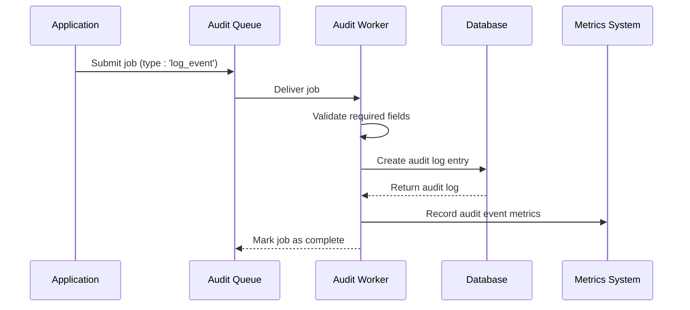
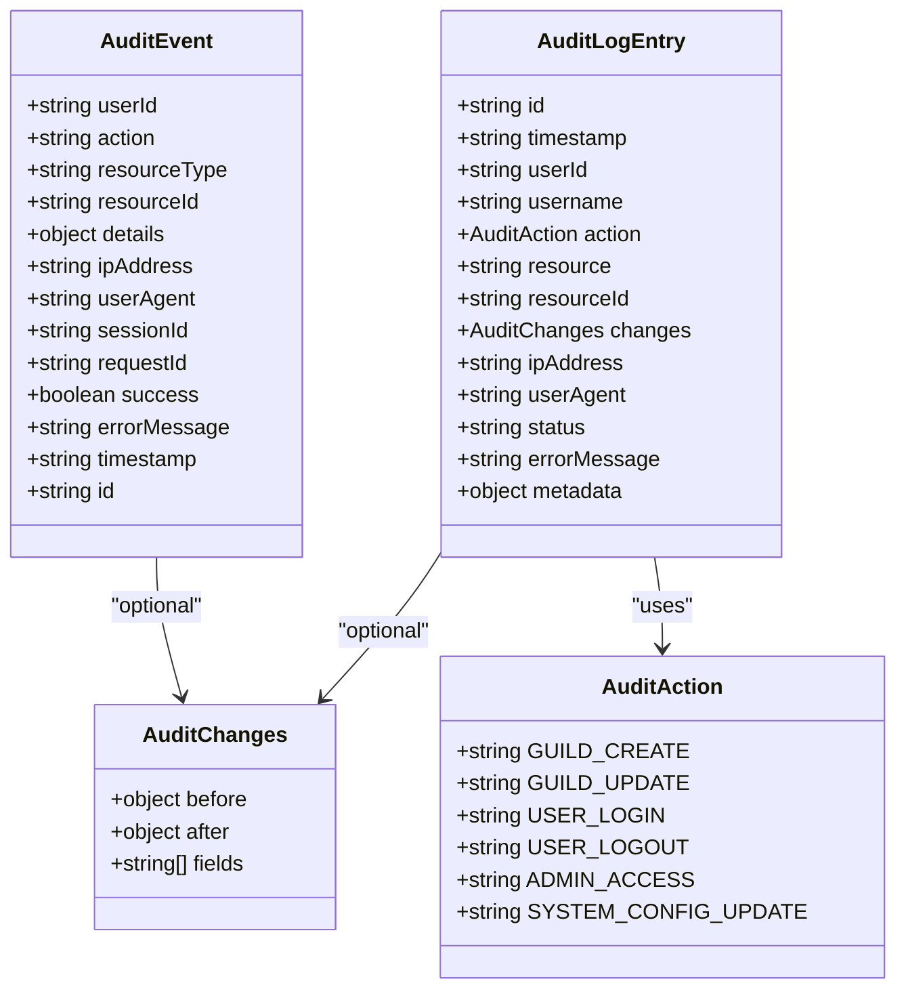
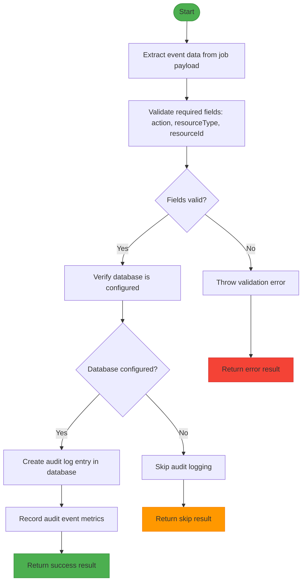
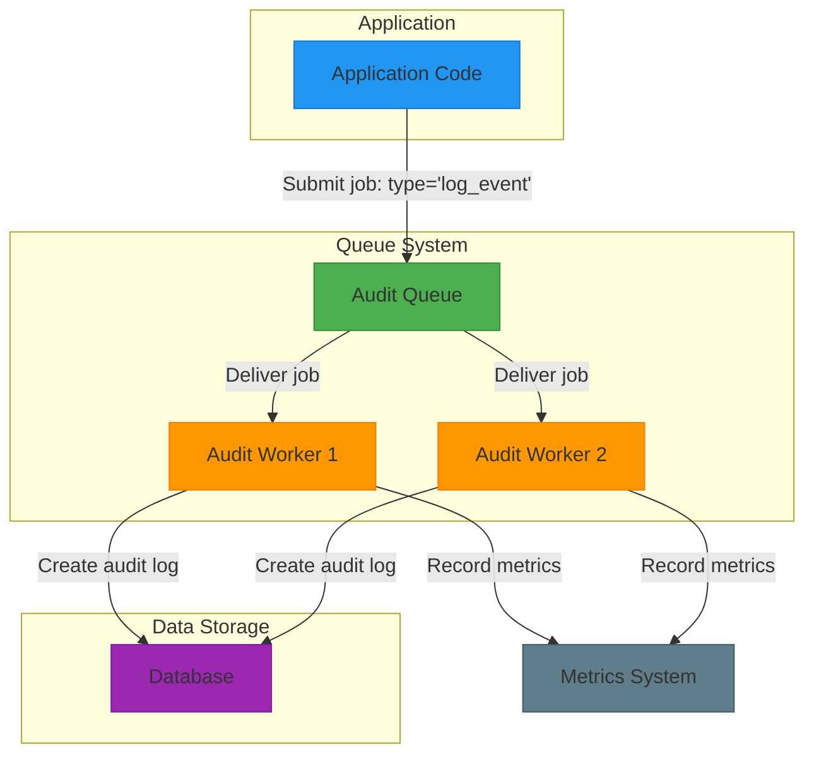
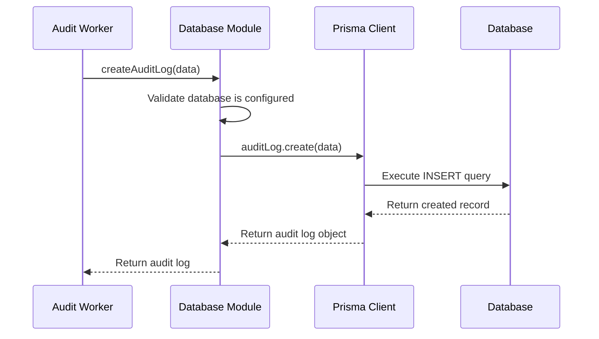
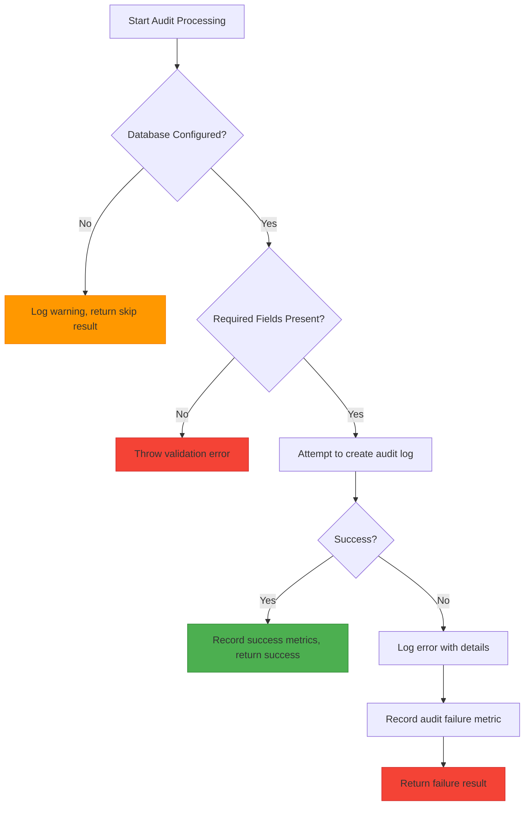

# Audit Event Logging

<cite>
**Referenced Files in This Document**   
- [audit-processor.js](file://apps/admin-api/src/lib/queues/audit-processor.js)
- [index.js](file://apps/admin-api/src/lib/queues/index.js)
- [database.js](file://apps/admin-api/src/lib/database.js)
- [metrics.js](file://apps/admin-api/src/lib/monitoring/metrics.js)
- [audit-log.ts](file://apps/web/lib/audit-log.ts)
</cite>

## Table of Contents
1. [Introduction](#introduction)
2. [Core Functionality](#core-functionality)
3. [Data Structure](#data-structure)
4. [Validation and Processing](#validation-and-processing)
5. [Queue Integration](#queue-integration)
6. [Database Interaction](#database-interaction)
7. [Error Handling Strategy](#error-handling-strategy)
8. [Metrics Recording](#metrics-recording)
9. [Common Audit Events](#common-audit-events)
10. [Performance and Reliability](#performance-and-reliability)
11. [Security Implications](#security-implications)

## Introduction
The audit event logging system in the slimy-monorepo platform provides comprehensive tracking of user actions and system events for security, compliance, and operational visibility. This documentation details the implementation of the `processLogEvent` function, which captures critical information about user activities and system operations. The system is designed to be reliable, non-blocking, and comprehensive, ensuring that all significant events are recorded while maintaining system performance and availability.

**Section sources**
- [audit-processor.js](file://apps/admin-api/src/lib/queues/audit-processor.js#L1-L400)

## Core Functionality
The audit event logging functionality centers around the `processLogEvent` function, which handles the asynchronous processing of audit events. This function captures user actions and system events, storing them in a structured format for compliance, security monitoring, and operational analysis. The system implements event sourcing principles, creating an immutable record of all significant activities within the platform.

The audit processor operates as a background job worker, processing events from a dedicated queue to ensure that logging operations do not impact the performance of primary application functions. This decoupled architecture allows for reliable event recording even during periods of high system load or temporary database connectivity issues.



**Diagram sources **
- [audit-processor.js](file://apps/admin-api/src/lib/queues/audit-processor.js#L33-L126)
- [index.js](file://apps/admin-api/src/lib/queues/index.js#L154-L172)

**Section sources**
- [audit-processor.js](file://apps/admin-api/src/lib/queues/audit-processor.js#L1-L400)

## Data Structure
The audit event logging system captures a comprehensive set of fields for each recorded event, providing detailed context for security analysis and operational troubleshooting. The core data structure includes the following fields:

- **userId**: Identifier of the user who performed the action
- **action**: Specific action performed (e.g., 'user.login', 'guild.update')
- **resourceType**: Type of resource affected by the action
- **resourceId**: Identifier of the specific resource affected
- **details**: Additional structured data about the action
- **ipAddress**: IP address from which the action originated
- **userAgent**: User agent string identifying the client application
- **sessionId**: Session identifier for tracking user sessions
- **requestId**: Request identifier for correlation across systems
- **success**: Boolean indicating whether the action was successful
- **errorMessage**: Error message if the action failed

The system also supports additional metadata fields for specific use cases, such as change tracking (before/after values) and custom metadata.



**Diagram sources **
- [audit-processor.js](file://apps/admin-api/src/lib/queues/audit-processor.js#L19-L31)
- [audit-log.ts](file://apps/web/lib/audit-log.ts#L13-L81)

**Section sources**
- [audit-processor.js](file://apps/admin-api/src/lib/queues/audit-processor.js#L19-L31)
- [audit-log.ts](file://apps/web/lib/audit-log.ts#L13-L81)

## Validation and Processing
The audit event processing system implements strict validation to ensure data integrity and completeness. The `processLogEvent` function validates that required fields (action, resourceType, resourceId) are present before attempting to store the audit log. This validation occurs early in the processing pipeline to prevent incomplete records from being created.

The processing workflow follows these steps:
1. Extract event data from the job payload
2. Validate required fields are present
3. Create audit log entry in the database
4. Record audit metrics
5. Return processing result

If any required field is missing, the function throws an error with a descriptive message, ensuring that incomplete audit events are not processed.



**Diagram sources **
- [audit-processor.js](file://apps/admin-api/src/lib/queues/audit-processor.js#L62-L65)
- [audit-processor.js](file://apps/admin-api/src/lib/queues/audit-processor.js#L57-L60)

**Section sources**
- [audit-processor.js](file://apps/admin-api/src/lib/queues/audit-processor.js#L62-L65)

## Queue Integration
The audit event logging system integrates with the platform's queue infrastructure to ensure reliable and non-blocking event processing. Audit events are submitted to the audit queue with a job type of 'log_event', which is processed by dedicated audit workers.

The queue configuration includes reliability features such as:
- Retry policies (3 attempts with exponential backoff starting at 2 seconds)
- Job completion tracking with metrics
- Concurrency control (2 concurrent workers)
- Job duration monitoring
- Error handling with detailed logging

When an audit event is submitted, it is added to the queue with default job options that ensure reliability and proper cleanup of completed jobs.



**Diagram sources **
- [index.js](file://apps/admin-api/src/lib/queues/index.js#L83-L85)
- [index.js](file://apps/admin-api/src/lib/queues/index.js#L154-L172)
- [audit-processor.js](file://apps/admin-api/src/lib/queues/audit-processor.js#L266-L267)

**Section sources**
- [index.js](file://apps/admin-api/src/lib/queues/index.js#L83-L85)
- [index.js](file://apps/admin-api/src/lib/queues/index.js#L154-L172)

## Database Interaction
The audit event logging system interacts with the database layer through the `database.createAuditLog` method, which creates a new audit log entry in the database. This interaction is wrapped in error handling to ensure that database failures do not disrupt the primary application flow.

The database module provides the following audit-related methods:
- `createAuditLog`: Creates a new audit log entry
- `getAuditLogs`: Retrieves audit logs with filtering options
- `getAuditLogStats`: Gets statistics about audit logs

The system checks whether the database is configured before attempting to create audit logs, allowing the system to operate in environments where audit logging is not required or temporarily unavailable.



**Diagram sources **
- [audit-processor.js](file://apps/admin-api/src/lib/queues/audit-processor.js#L68-L80)
- [database.js](file://apps/admin-api/src/lib/database.js#L75-L105)

**Section sources**
- [audit-processor.js](file://apps/admin-api/src/lib/queues/audit-processor.js#L68-L80)
- [database.js](file://apps/admin-api/src/lib/database.js#L75-L105)

## Error Handling Strategy
The audit event logging system implements a robust error handling strategy designed to ensure that audit logging failures do not disrupt primary application operations. When an error occurs during audit log creation, the system:

1. Logs the error with detailed context (including stack trace)
2. Records a failed audit event metric
3. Returns a failure result without throwing an exception

This approach ensures that even if the audit logging system fails, the primary operation that triggered the audit event can continue uninterrupted. The system also records metrics about audit logging failures, allowing for monitoring and alerting on audit system health.

The error handling specifically addresses database configuration issues, missing required fields, and database operation failures, providing appropriate responses for each scenario.



**Diagram sources **
- [audit-processor.js](file://apps/admin-api/src/lib/queues/audit-processor.js#L57-L60)
- [audit-processor.js](file://apps/admin-api/src/lib/queues/audit-processor.js#L102-L125)

**Section sources**
- [audit-processor.js](file://apps/admin-api/src/lib/queues/audit-processor.js#L102-L125)

## Metrics Recording
The audit event logging system integrates with the platform's metrics system to provide visibility into audit operations. Two key metrics are recorded:

1. **Successful audit events**: Recorded when an audit log is successfully created, with details about the action, resource type, and success status.

2. **Audit logging failures**: Recorded when the audit logging process fails, using a special action type 'audit_log_failure' and resource type 'system' to distinguish these from application-level audit events.

These metrics enable monitoring of the audit system's health and reliability, allowing administrators to detect and respond to issues with the audit logging infrastructure.

```mermaid
graph TD
A[Process Audit Event] --> B{Success?}
B --> |Yes| C[metrics.recordAuditEvent<br/>(action, resourceType, success: true)]
B --> |No| D[metrics.recordAuditEvent<br/>(action: 'audit_log_failure',<br/>resourceType: 'system',<br/>success: false)]
C --> E[Increment auditEventsLogged]
D --> F[Increment auditEventsFailed]
E --> G[Update audit success rate]
F --> G
G --> H[Expose in metrics snapshot]
style C fill:#4CAF50,stroke:#388E3C
style D fill:#F44336,stroke:#D32F2F
```

**Diagram sources **
- [audit-processor.js](file://apps/admin-api/src/lib/queues/audit-processor.js#L82-L87)
- [audit-processor.js](file://apps/admin-api/src/lib/queues/audit-processor.js#L114-L118)
- [metrics.js](file://apps/admin-api/src/lib/monitoring/metrics.js#L145-L151)

**Section sources**
- [audit-processor.js](file://apps/admin-api/src/lib/queues/audit-processor.js#L82-L87)
- [audit-processor.js](file://apps/admin-api/src/lib/queues/audit-processor.js#L114-L118)

## Common Audit Events
The system defines a comprehensive set of audit action types that cover various categories of user and system activities. These include:

### Guild Actions
- GUILD_CREATE: When a guild is created
- GUILD_UPDATE: When a guild is updated
- GUILD_DELETE: When a guild is deleted
- GUILD_SETTINGS_UPDATE: When guild settings are modified
- GUILD_FLAGS_UPDATE: When guild flags are updated

### Member Actions
- MEMBER_ADD: When a member is added to a guild
- MEMBER_REMOVE: When a member is removed from a guild
- MEMBER_UPDATE: When member information is updated
- MEMBER_ROLE_UPDATE: When member roles are modified

### User Actions
- USER_LOGIN: When a user logs in
- USER_LOGOUT: When a user logs out
- USER_PREFERENCES_UPDATE: When user preferences are updated

### Administrative Actions
- ADMIN_ACCESS: When an admin accesses the system
- ADMIN_CONFIG_UPDATE: When admin configuration is updated

### System Actions
- SYSTEM_CONFIG_UPDATE: When system configuration is modified
- SYSTEM_MAINTENANCE: When system maintenance operations occur

Each audit event includes contextual data such as IP address, user agent, session ID, and request ID, providing comprehensive information for security analysis and troubleshooting.

**Section sources**
- [audit-log.ts](file://apps/web/lib/audit-log.ts#L32-L71)

## Performance and Reliability
The audit event logging system is designed with performance and reliability as key considerations. The system implements several features to ensure high availability and minimal impact on application performance:

- **Asynchronous processing**: Audit events are processed in the background, preventing blocking of primary application operations
- **Queue-based architecture**: Events are queued for reliable delivery even during system load or temporary failures
- **Retry policies**: Failed jobs are automatically retried with exponential backoff
- **Concurrency control**: Limited worker concurrency prevents database overload
- **Error isolation**: Audit logging failures do not affect primary operations

The system is configured with a concurrency of 2 workers for the audit queue, balancing processing throughput with database resource usage. Jobs are configured to retry up to 3 times with exponential backoff starting at 2 seconds, providing resilience against temporary failures.

**Section sources**
- [index.js](file://apps/admin-api/src/lib/queues/index.js#L85-L99)
- [index.js](file://apps/admin-api/src/lib/queues/index.js#L170-L172)

## Security Implications
The comprehensive event tracking provided by the audit logging system has significant security implications for the platform:

- **Accountability**: All user actions are recorded, creating a clear audit trail for accountability
- **Incident response**: Detailed logs enable effective investigation of security incidents
- **Compliance**: The system supports regulatory compliance requirements for activity logging
- **Anomaly detection**: Complete event records allow for detection of unusual patterns or behaviors
- **Forensic analysis**: Rich contextual data (IP address, user agent, timestamps) supports forensic investigations

The system captures sensitive information such as IP addresses and user agents, which must be protected according to privacy regulations. Access to audit logs is restricted to authorized personnel, and the logs themselves are protected with the same security controls as other sensitive data in the system.

The non-blocking nature of the audit system ensures that security logging does not create a denial-of-service vulnerability, as logging failures do not impact primary application functionality.

**Section sources**
- [audit-processor.js](file://apps/admin-api/src/lib/queues/audit-processor.js#L25-L26)
- [audit-log.ts](file://apps/web/lib/audit-log.ts#L206-L209)