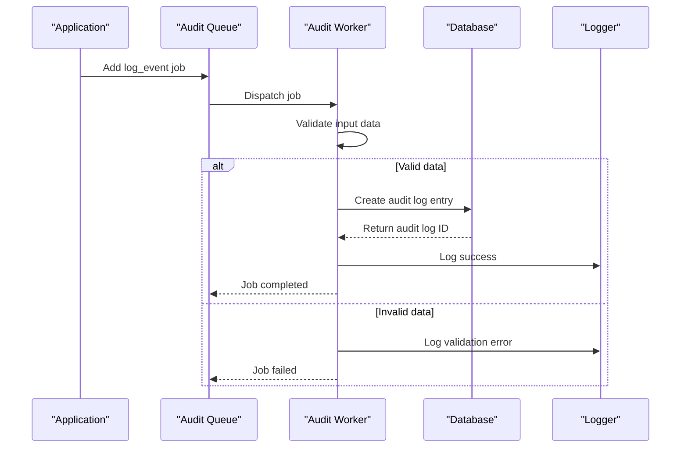
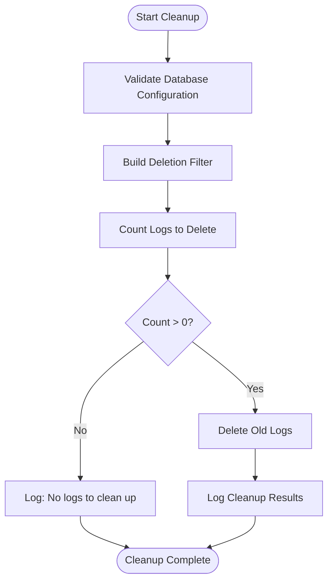
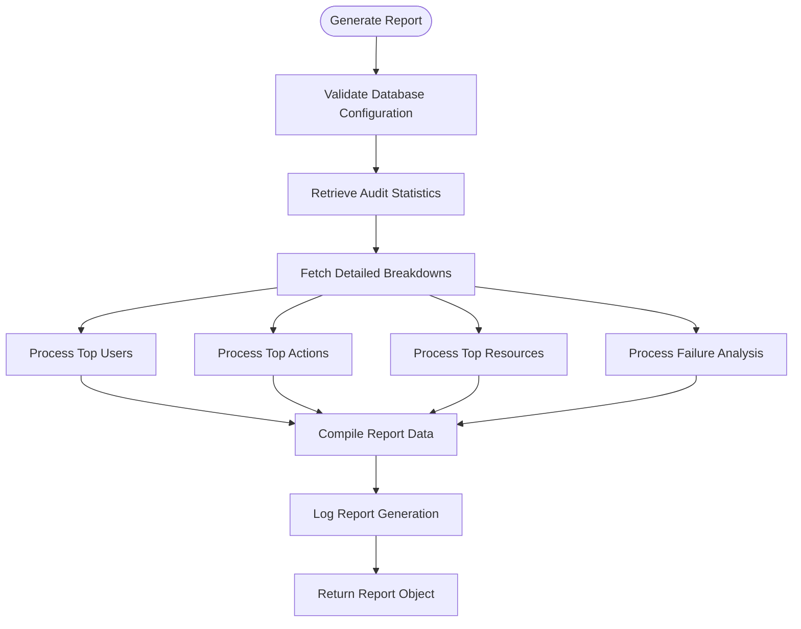
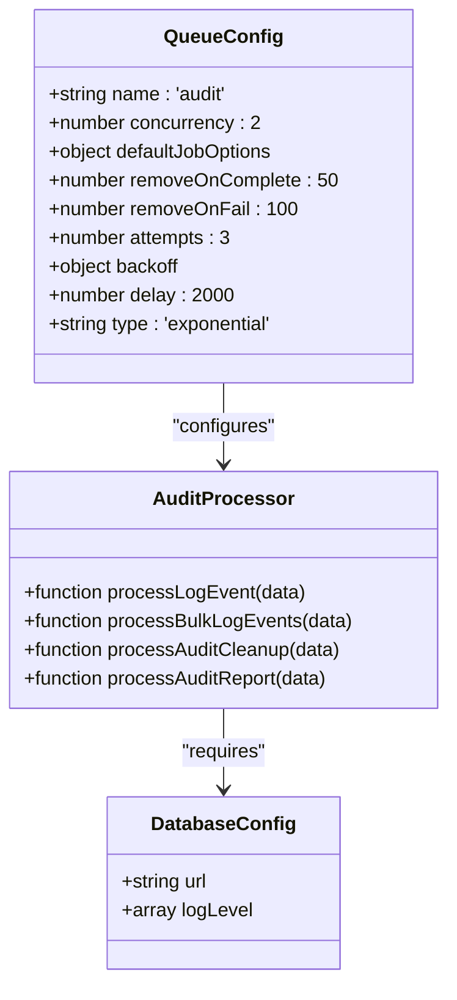
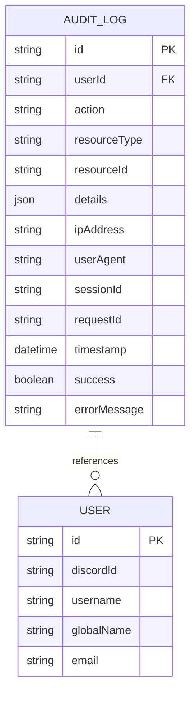

# Audit Queue Processing

<cite>
**Referenced Files in This Document**   
- [audit-processor.js](file://apps/admin-api/src/lib/queues/audit-processor.js)
- [index.js](file://apps/admin-api/src/lib/queues/index.js)
- [database.js](file://apps/admin-api/src/lib/database.js)
- [config/index.js](file://apps/admin-api/src/lib/config/index.js)
- [schema.prisma](file://apps/admin-api/prisma/schema.prisma)
- [audit-log.ts](file://apps/web/lib/audit-log.ts)
</cite>

## Table of Contents
1. [Introduction](#introduction)
2. [Architecture Overview](#architecture-overview)
3. [Core Components](#core-components)
4. [Event Logging Process](#event-logging-process)
5. [Bulk Logging Capability](#bulk-logging-capability)
6. [Audit Cleanup Functionality](#audit-cleanup-functionality)
7. [Audit Report Generation](#audit-report-generation)
8. [Configuration Details](#configuration-details)
9. [Integration with Database Layer](#integration-with-database-layer)
10. [Security and Compliance Support](#security-and-compliance-support)

## Introduction
The audit queue processing system in the slimy-monorepo platform is responsible for event sourcing and compliance logging. It handles asynchronous logging of user actions and system events through a robust queuing mechanism. The system ensures comprehensive tracking of critical operations for security, compliance, and troubleshooting purposes. This documentation details the architecture, functionality, and configuration of the audit queue system, focusing on its key components: event logging, bulk processing, cleanup operations, and reporting capabilities.

## Architecture Overview
The audit queue processing system follows an event-driven architecture using BullMQ for job queuing and Redis as the message broker. Jobs are processed asynchronously to ensure non-blocking operations while maintaining data integrity. The system integrates with the Prisma ORM for database interactions and leverages structured logging for monitoring and debugging.

```mermaid
graph TB
subgraph "Application Layer"
A[API Endpoints] --> B[Queue Manager]
C[Admin UI] --> B
D[Background Tasks] --> B
end
subgraph "Queue Infrastructure"
B --> E[Audit Queue]
E --> F[Audit Worker]
end
subgraph "Processing Layer"
F --> G[processLogEvent]
F --> H[processBulkLogEvents]
F --> I[processAuditCleanup]
F --> J[processAuditReport]
end
subgraph "Data Layer"
G --> K[PostgreSQL Database]
H --> K
I --> K
J --> K
K --> L[AuditLog Table]
end
M[Redis] < --> E
N[Metrics] < --> F
O[Logger] < --> F
```

**Diagram sources**
- [audit-processor.js](file://apps/admin-api/src/lib/queues/audit-processor.js)
- [index.js](file://apps/admin-api/src/lib/queues/index.js)
- [database.js](file://apps/admin-api/src/lib/database.js)

**Section sources**
- [audit-processor.js](file://apps/admin-api/src/lib/queues/audit-processor.js#L1-L400)
- [index.js](file://apps/admin-api/src/lib/queues/index.js#L1-L396)

## Core Components
The audit queue system consists of four primary processing functions that handle different aspects of audit management:
- `processLogEvent`: Handles individual audit event logging
- `processBulkLogEvents`: Processes multiple audit events in bulk for improved performance
- `processAuditCleanup`: Enforces data retention policies by removing old logs
- `processAuditReport`: Generates compliance reports with detailed statistics

These components work together to provide a comprehensive audit trail system that supports both real-time logging and periodic maintenance operations.

**Section sources**
- [audit-processor.js](file://apps/admin-api/src/lib/queues/audit-processor.js#L33-L398)

## Event Logging Process
The `processLogEvent` function handles the asynchronous logging of individual audit events. Each event captures comprehensive information about user actions and system events, including:

- **userId**: Identifier of the user who performed the action
- **action**: Type of action performed (e.g., 'login', 'config.update')
- **resourceType**: Type of resource affected (e.g., 'user', 'guild', 'settings')
- **resourceId**: Identifier of the specific resource affected
- **ipAddress**: IP address from which the action originated
- **userAgent**: User agent string identifying the client application
- **success**: Boolean indicating whether the action was successful
- **details**: Additional contextual information about the action
- **sessionId**: Session identifier for tracking user sessions
- **requestId**: Request identifier for correlation across systems

The function validates required fields, creates an audit log entry in the database, and records metrics for monitoring purposes. Error handling is designed to prevent audit logging failures from affecting the main operation flow.



**Diagram sources**
- [audit-processor.js](file://apps/admin-api/src/lib/queues/audit-processor.js#L33-L125)
- [database.js](file://apps/admin-api/src/lib/database.js#L75-L105)

**Section sources**
- [audit-processor.js](file://apps/admin-api/src/lib/queues/audit-processor.js#L33-L125)
- [database.js](file://apps/admin-api/src/lib/database.js#L75-L105)

## Bulk Logging Capability
The `processBulkLogEvents` function provides optimized performance for logging multiple audit events simultaneously. This capability is essential for scenarios where numerous events need to be recorded efficiently, such as batch operations or system migrations.

The bulk processing workflow:
1. Receives an array of audit event objects
2. Processes each event sequentially using the `processLogEvent` function
3. Collects results and error information for all events
4. Returns a comprehensive summary of processing outcomes

This approach maintains the reliability of individual event logging while providing the efficiency benefits of batch processing. The function returns detailed results for each event, including success status, audit log ID (when successful), and error messages (when applicable).

**Section sources**
- [audit-processor.js](file://apps/admin-api/src/lib/queues/audit-processor.js#L135-L186)

## Audit Cleanup Functionality
The `processAuditCleanup` function enforces data retention policies by removing audit logs older than a specified date. This functionality is crucial for compliance with data protection regulations and for managing storage requirements.

Key features of the cleanup process:
- **Date-based filtering**: Removes logs created before a specified cutoff date
- **Action exclusion**: Supports preserving specific critical actions (e.g., security-related events) regardless of age
- **Count verification**: Determines the number of logs to be deleted before execution
- **Comprehensive logging**: Records cleanup operations with details of deleted count and excluded actions

The cleanup operation uses database-level deletion for efficiency and includes proper error handling to ensure data integrity during the process.



**Diagram sources**
- [audit-processor.js](file://apps/admin-api/src/lib/queues/audit-processor.js#L197-L246)

**Section sources**
- [audit-processor.js](file://apps/admin-api/src/lib/queues/audit-processor.js#L197-L246)

## Audit Report Generation
The `processAuditReport` function generates compliance reports for daily, weekly, and monthly periods. These reports provide detailed statistics and analysis of system activity for security and compliance purposes.

Report generation includes:
- **Summary statistics**: Total logs, success/failure rates, and success percentage
- **Top activity breakdowns**: 
  - Most active users
  - Most frequently performed actions
  - Most accessed resource types
- **Failure analysis**: Detailed breakdown of failed actions by type
- **Time period specification**: Configurable start and end dates for the reporting window

The system supports three standard report types (daily, weekly, monthly) but can generate reports for any custom time period. Reports include timestamps for generation time and the covered period, ensuring traceability and auditability.



**Diagram sources**
- [audit-processor.js](file://apps/admin-api/src/lib/queues/audit-processor.js#L267-L381)

**Section sources**
- [audit-processor.js](file://apps/admin-api/src/lib/queues/audit-processor.js#L267-L381)

## Configuration Details
The audit queue system is configured with specific parameters optimized for logging operations:

- **Concurrency**: 2 workers for the audit queue, suitable for logging operations that don't require high throughput
- **Retry policy**: 3 attempts with exponential backoff starting at 2 seconds
- **Job retention**: 
  - 50 completed jobs retained for debugging
  - 100 failed jobs retained for troubleshooting
- **Queue configuration**: Part of the BullMQ queue infrastructure with Redis as the backend

The system's configuration is managed through environment variables and validated at startup to ensure proper operation. The low concurrency setting reflects the nature of audit logging as a secondary operation that should not consume excessive system resources.



**Diagram sources**
- [index.js](file://apps/admin-api/src/lib/queues/index.js#L83-L85)
- [config/index.js](file://apps/admin-api/src/lib/config/index.js#L219-L222)

**Section sources**
- [index.js](file://apps/admin-api/src/lib/queues/index.js#L83-L85)
- [config/index.js](file://apps/admin-api/src/lib/config/index.js#L219-L222)

## Integration with Database Layer
The audit queue system integrates with the database layer through the Prisma ORM, using a dedicated `AuditLog` model that maps to the `audit_logs` table in PostgreSQL. The database schema includes comprehensive indexing to support efficient querying of audit data.

Key database schema fields:
- **id**: Unique identifier for the audit log entry
- **userId**: Foreign key referencing the user who performed the action
- **action**: Type of action performed
- **resourceType**: Type of resource affected
- **resourceId**: Identifier of the affected resource
- **details**: JSON field for additional contextual information
- **ipAddress**: IP address of the user
- **userAgent**: User agent string
- **sessionId**: Session identifier
- **requestId**: Request identifier for correlation
- **timestamp**: When the action occurred
- **success**: Whether the action succeeded
- **errorMessage**: Error message if the action failed

The system includes multiple database indexes on commonly queried fields (userId, action, resourceType, timestamp) to ensure optimal performance for audit trail queries and report generation.



**Diagram sources**
- [schema.prisma](file://apps/admin-api/prisma/schema.prisma#L430-L462)
- [database.js](file://apps/admin-api/src/lib/database.js#L75-L105)

**Section sources**
- [schema.prisma](file://apps/admin-api/prisma/schema.prisma#L430-L462)
- [database.js](file://apps/admin-api/src/lib/database.js#L75-L105)

## Security and Compliance Support
The audit queue system provides comprehensive support for security and compliance requirements through its event tracking capabilities. The system enables thorough monitoring of user actions and system events, creating an immutable audit trail that supports:

- **Security monitoring**: Detection of suspicious activities and potential security breaches
- **Compliance reporting**: Generation of detailed reports for regulatory requirements
- **Troubleshooting**: Investigation of issues through complete event history
- **Accountability**: Attribution of actions to specific users and sessions

The system captures sufficient context (IP address, user agent, session ID) to support forensic analysis while maintaining performance through asynchronous processing. The data retention policies and cleanup functionality ensure compliance with data protection regulations regarding the storage duration of personal information.

**Section sources**
- [audit-processor.js](file://apps/admin-api/src/lib/queues/audit-processor.js)
- [audit-log.ts](file://apps/web/lib/audit-log.ts)