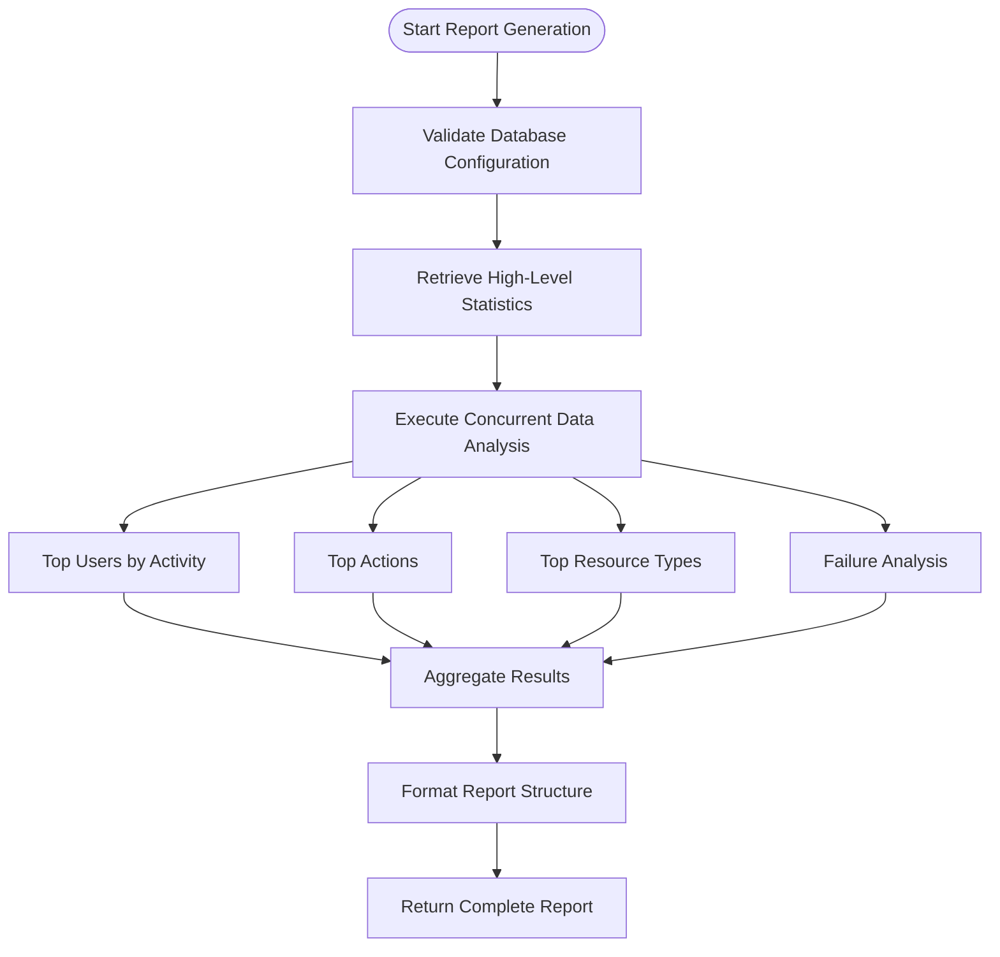
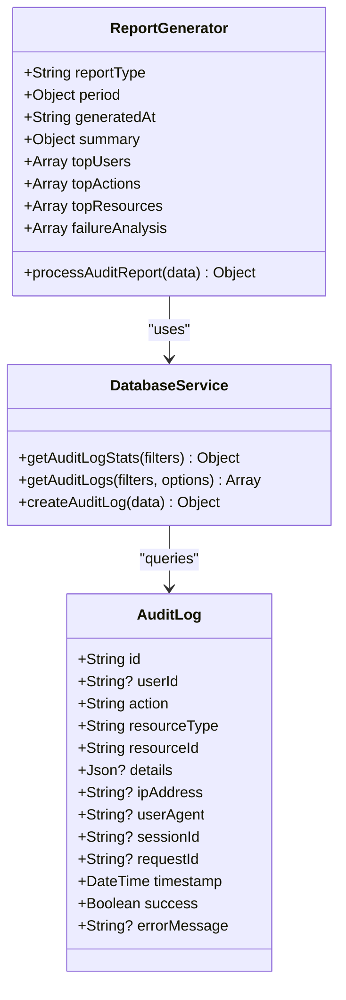
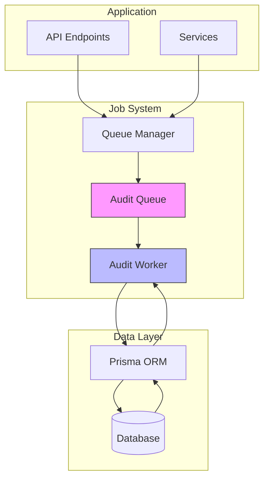

# Audit Reporting

<cite>
**Referenced Files in This Document**   
- [audit-processor.js](file://apps/admin-api/src/lib/queues/audit-processor.js)
- [database.js](file://apps/admin-api/src/lib/database.js)
- [schema.prisma](file://apps/admin-api/prisma/schema.prisma)
- [index.js](file://apps/admin-api/src/lib/queues/index.js)
</cite>

## Table of Contents
1. [Introduction](#introduction)
2. [Core Functionality](#core-functionality)
3. [Report Generation Process](#report-generation-process)
4. [Data Aggregation and Analysis](#data-aggregation-and-analysis)
5. [Report Structure](#report-structure)
6. [Performance Considerations](#performance-considerations)
7. [Use Cases](#use-cases)
8. [Architecture Overview](#architecture-overview)

## Introduction
The audit reporting system provides comprehensive compliance reporting functionality for daily, weekly, and monthly periods. This system enables security audits, compliance verification, and operational analysis through detailed statistical reports generated from audit log data. The core functionality is implemented as a job processor within the application's queue system, allowing asynchronous generation of reports without impacting main application performance.

**Section sources**
- [audit-processor.js](file://apps/admin-api/src/lib/queues/audit-processor.js#L258-L400)

## Core Functionality
The audit reporting functionality is centered around the `processAuditReport` function, which generates compliance reports based on specified time periods. This function accepts three primary parameters to define the reporting window:

- **reportType**: Specifies the reporting period (daily, weekly, or monthly)
- **startDate**: Defines the beginning of the reporting window
- **endDate**: Defines the end of the reporting window

The system leverages Prisma ORM to perform database operations, with all audit log data stored in a dedicated table with comprehensive indexing for optimal query performance. The reporting system is designed to handle large datasets efficiently through concurrent data retrieval and optimized database queries.

**Section sources**
- [audit-processor.js](file://apps/admin-api/src/lib/queues/audit-processor.js#L267-L268)
- [schema.prisma](file://apps/admin-api/prisma/schema.prisma#L429-L463)

## Report Generation Process
The report generation process follows a structured workflow that begins with job initialization and proceeds through data collection and aggregation:

**Diagram sources**
- [audit-processor.js](file://apps/admin-api/src/lib/queues/audit-processor.js#L275-L347)

**Section sources**
- [audit-processor.js](file://apps/admin-api/src/lib/queues/audit-processor.js#L275-L347)

## Data Aggregation and Analysis
The system performs comprehensive statistical analysis using Prisma ORM's groupBy operations with date range filters. The analysis includes multiple dimensions of audit data:

### Statistical Analysis Components
- **Activity Summaries**: High-level metrics including total logs, successful and failed actions, and success rate percentages
- **Top Users by Activity**: Identification of the most active users based on the number of audit events
- **Top Actions**: Most frequently performed actions across the system
- **Top Resource Types**: Most commonly accessed resource types
- **Failure Analysis**: Detailed breakdown of failed actions by action type and success status

The system utilizes `Promise.all` to optimize data retrieval, executing multiple database queries concurrently rather than sequentially. This approach significantly improves performance, especially when dealing with large datasets.

**Diagram sources**
- [audit-processor.js](file://apps/admin-api/src/lib/queues/audit-processor.js#L290-L346)
- [database.js](file://apps/admin-api/src/lib/database.js#L155-L205)

**Section sources**
- [audit-processor.js](file://apps/admin-api/src/lib/queues/audit-processor.js#L285-L346)
- [database.js](file://apps/admin-api/src/lib/database.js#L155-L205)

## Report Structure
The generated audit report follows a structured format that includes metadata, summary statistics, and detailed breakdowns:

### Report Metadata
- **reportType**: The type of report (daily, weekly, monthly)
- **period**: The reporting window with startDate and endDate
- **generatedAt**: Timestamp when the report was generated

### Summary Statistics
The summary section includes high-level metrics retrieved from the `getAuditLogStats` function:
- Total number of audit logs in the period
- Number of successful actions
- Number of failed actions
- Success rate percentage
- Action breakdown by type

### Detailed Breakdowns
The report includes several detailed sections:
- **Top Users**: Users ranked by activity level (limited to top 10)
- **Top Actions**: Actions ranked by frequency (limited to top 10)
- **Top Resource Types**: Resource types ranked by access frequency (limited to top 10)
- **Failure Analysis**: Comprehensive analysis of failed actions by action type and success status

**Section sources**
- [audit-processor.js](file://apps/admin-api/src/lib/queues/audit-processor.js#L349-L374)

## Performance Considerations
The audit reporting system incorporates several performance optimizations to handle large datasets efficiently:

### Concurrent Data Retrieval
The system uses `Promise.all` to execute multiple database queries simultaneously, reducing overall processing time. The four main analysis queries (top users, top actions, top resource types, and failure analysis) are executed in parallel rather than sequentially.

### Database Optimization
The audit log table includes comprehensive indexing to support efficient querying:
- Indexes on userId, action, resourceType, and timestamp fields
- Composite indexes for common query patterns
- Indexes on success status and request correlation fields

### Pagination and Limits
The system implements pagination strategies for top N results, limiting detailed breakdowns to the top 10 entries for user activity, actions, and resource types. This prevents performance degradation when dealing with large result sets.

### Queue-Based Processing
The report generation runs as a job in the audit queue, allowing it to be processed asynchronously without blocking the main application. The queue system provides reliability features including retry mechanisms and error handling.

**Section sources**
- [audit-processor.js](file://apps/admin-api/src/lib/queues/audit-processor.js#L290-L346)
- [schema.prisma](file://apps/admin-api/prisma/schema.prisma#L448-L461)
- [index.js](file://apps/admin-api/src/lib/queues/index.js#L83-L85)

## Use Cases
The audit reporting functionality supports several critical use cases:

### Security Audits
The detailed breakdowns help security teams identify unusual activity patterns, detect potential security incidents, and verify that security policies are being followed. The failure analysis component is particularly valuable for identifying repeated failed access attempts or other suspicious patterns.

### Compliance Verification
Organizations can use these reports to demonstrate compliance with regulatory requirements by providing verifiable records of system activity. The structured format and comprehensive coverage make it suitable for various compliance frameworks.

### Operational Analysis
System administrators and operations teams can use the reports to understand usage patterns, identify performance bottlenecks, and plan capacity. The top users and top actions data helps identify power users and popular features.

**Section sources**
- [audit-processor.js](file://apps/admin-api/src/lib/queues/audit-processor.js#L267-L400)

## Architecture Overview
The audit reporting system is integrated into the application's queue infrastructure, which provides reliable, asynchronous processing of background tasks.

**Diagram sources**
- [index.js](file://apps/admin-api/src/lib/queues/index.js#L153-L172)
- [audit-processor.js](file://apps/admin-api/src/lib/queues/audit-processor.js#L267-L400)

**Section sources**
- [index.js](file://apps/admin-api/src/lib/queues/index.js#L153-L172)
- [audit-processor.js](file://apps/admin-api/src/lib/queues/audit-processor.js#L267-L400)