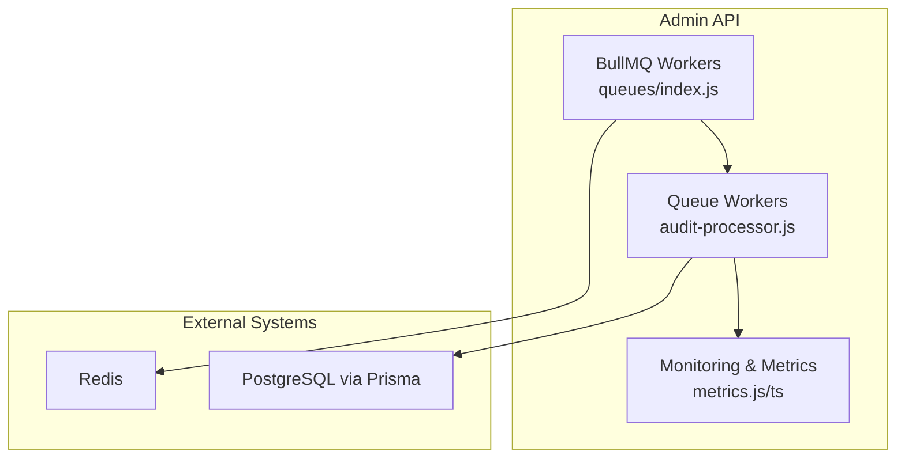
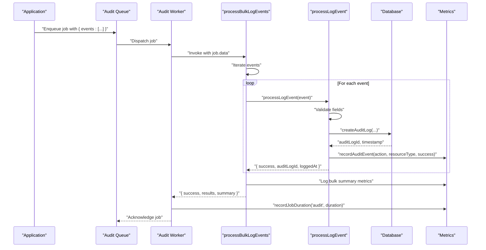
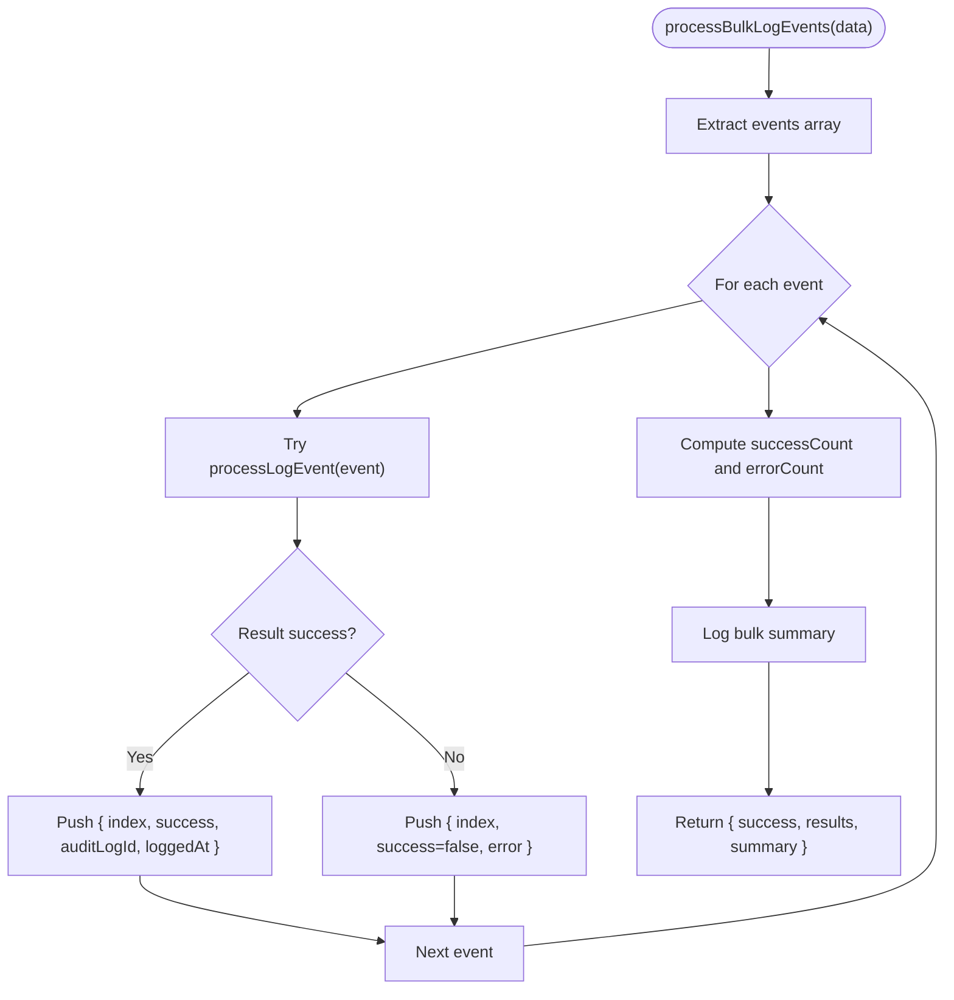
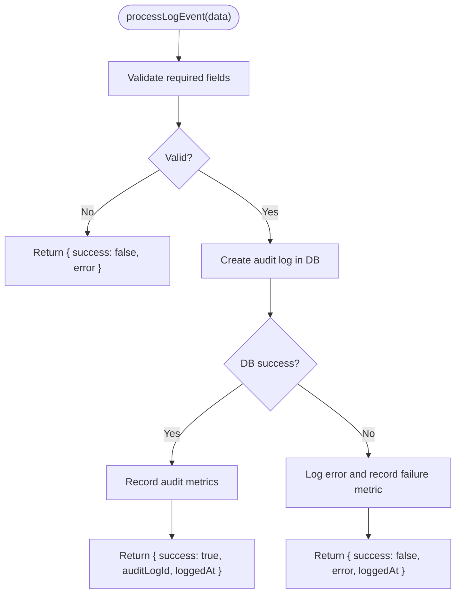
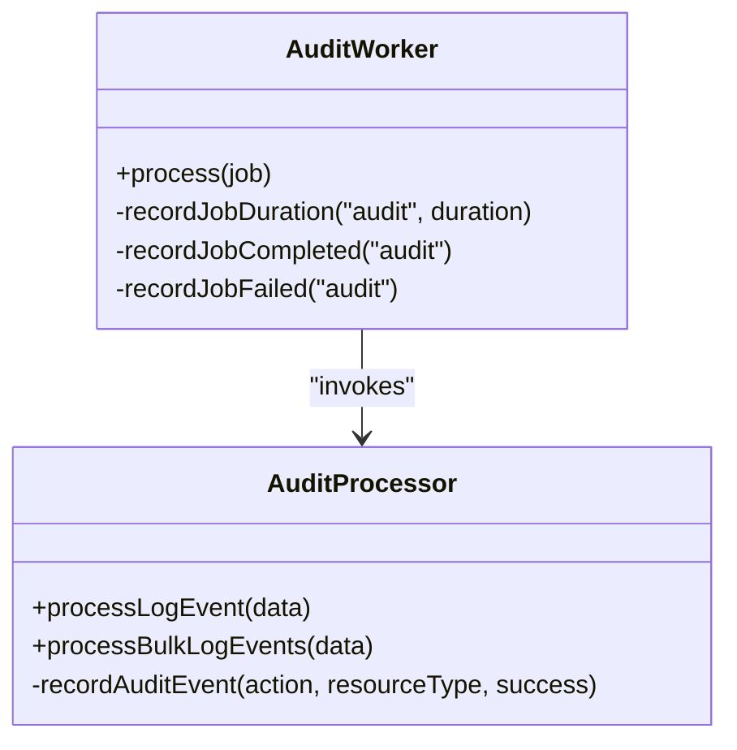
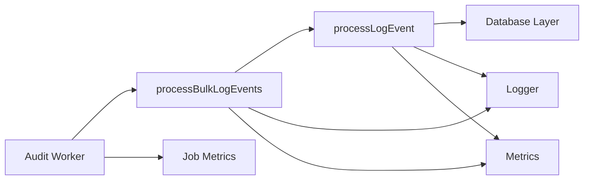

# Bulk Audit Logging

<cite>
**Referenced Files in This Document**
- [audit-processor.js](file://apps/admin-api/src/lib/queues/audit-processor.js)
- [index.js](file://apps/admin-api/src/lib/queues/index.js)
- [Audit Processor.md](file://snailwiki/content/Job Queue System/Audit Processor.md)
- [Metrics Collection with Prometheus.md](file://snailwiki/content/Monitoring and Observability/Metrics Collection with Prometheus.md)
- [audit-log.ts](file://apps/web/lib/audit-log.ts)
</cite>

## Table of Contents
1. [Introduction](#introduction)
2. [Project Structure](#project-structure)
3. [Core Components](#core-components)
4. [Architecture Overview](#architecture-overview)
5. [Detailed Component Analysis](#detailed-component-analysis)
6. [Dependency Analysis](#dependency-analysis)
7. [Performance Considerations](#performance-considerations)
8. [Troubleshooting Guide](#troubleshooting-guide)
9. [Conclusion](#conclusion)
10. [Appendices](#appendices)

## Introduction
This document explains the bulk audit logging capability centered on the processBulkLogEvents function. It describes how the function iterates through an array of audit events, processes each using processLogEvent, aggregates per-event results and error tracking, and returns a consolidated result with success/failure status, per-event identifiers, and summary statistics. It also covers the input event structure, output result format, high-throughput use cases, error isolation guarantees, logging and metrics collection, and practical guidance for batch sizing and resource considerations.

## Project Structure
The bulk audit logging capability lives in the Admin API’s queue-based audit processor. It integrates with the queue worker system and emits metrics for observability.

**Diagram sources**
- [audit-processor.js](file://apps/admin-api/src/lib/queues/audit-processor.js#L135-L187)
- [index.js](file://apps/admin-api/src/lib/queues/index.js#L132-L172)

**Section sources**
- [audit-processor.js](file://apps/admin-api/src/lib/queues/audit-processor.js#L135-L187)
- [index.js](file://apps/admin-api/src/lib/queues/index.js#L132-L172)

## Core Components
- processBulkLogEvents: Orchestrates bulk processing of audit events, iterating over the events array, invoking processLogEvent for each, aggregating per-event results and errors, and returning a consolidated summary.
- processLogEvent: Validates input, persists audit logs to the database, records metrics, and returns per-event outcome with auditLogId and timestamps.
- Queue workers: The BullMQ worker for the audit queue invokes the processor functions and records job-level metrics.
- Metrics: The processor records audit event metrics and job durations; the queue workers record job completion/failure and duration.

**Section sources**
- [audit-processor.js](file://apps/admin-api/src/lib/queues/audit-processor.js#L33-L126)
- [audit-processor.js](file://apps/admin-api/src/lib/queues/audit-processor.js#L135-L187)
- [index.js](file://apps/admin-api/src/lib/queues/index.js#L132-L172)
- [Metrics Collection with Prometheus.md](file://snailwiki/content/Monitoring and Observability/Metrics Collection with Prometheus.md#L96-L133)

## Architecture Overview
The bulk logging flow is part of the audit queue processing pipeline. Jobs are enqueued by application code and processed asynchronously by the audit worker, which calls processBulkLogEvents when the job payload contains an events array.

**Diagram sources**
- [audit-processor.js](file://apps/admin-api/src/lib/queues/audit-processor.js#L33-L126)
- [audit-processor.js](file://apps/admin-api/src/lib/queues/audit-processor.js#L135-L187)
- [index.js](file://apps/admin-api/src/lib/queues/index.js#L132-L172)
- [Metrics Collection with Prometheus.md](file://snailwiki/content/Monitoring and Observability/Metrics Collection with Prometheus.md#L96-L133)

## Detailed Component Analysis

### processBulkLogEvents
- Purpose: Efficiently process multiple audit events in a single job operation.
- Input: An object containing an events array where each element conforms to the audit event shape.
- Processing:
  - Iterates over events sequentially.
  - Calls processLogEvent for each event.
  - Aggregates per-event results and error entries.
  - Computes success and error counts.
- Output: An object with:
  - success: boolean indicating whether all events succeeded.
  - results: array of per-event outcomes including index, success, auditLogId, and loggedAt.
  - summary: object with total, success, and errors counts.

**Diagram sources**
- [audit-processor.js](file://apps/admin-api/src/lib/queues/audit-processor.js#L135-L187)

**Section sources**
- [audit-processor.js](file://apps/admin-api/src/lib/queues/audit-processor.js#L135-L187)

### processLogEvent
- Purpose: Validate and persist a single audit event.
- Input: Audit event object with fields such as userId, action, resourceType, resourceId, details, ipAddress, userAgent, sessionId, requestId, success, errorMessage.
- Processing:
  - Validates presence of required fields.
  - Persists the audit log via database.createAuditLog.
  - Records audit metrics.
- Output: Per-event result with success, auditLogId, and loggedAt timestamp.

**Diagram sources**
- [audit-processor.js](file://apps/admin-api/src/lib/queues/audit-processor.js#L33-L126)

**Section sources**
- [audit-processor.js](file://apps/admin-api/src/lib/queues/audit-processor.js#L33-L126)

### Queue Integration and Metrics
- Queue workers: The audit worker runs with limited concurrency to balance throughput and database load.
- Job-level metrics: The worker records job duration, completion, and failure for the audit queue.
- Audit-level metrics: The processor records per-event metrics for actions, resource types, and success status.

**Diagram sources**
- [index.js](file://apps/admin-api/src/lib/queues/index.js#L132-L172)
- [audit-processor.js](file://apps/admin-api/src/lib/queues/audit-processor.js#L33-L126)
- [Metrics Collection with Prometheus.md](file://snailwiki/content/Monitoring and Observability/Metrics Collection with Prometheus.md#L96-L133)

**Section sources**
- [index.js](file://apps/admin-api/src/lib/queues/index.js#L132-L172)
- [Metrics Collection with Prometheus.md](file://snailwiki/content/Monitoring and Observability/Metrics Collection with Prometheus.md#L96-L133)

## Dependency Analysis
- processBulkLogEvents depends on:
  - processLogEvent for per-event processing.
  - Logger for informational and error logs.
  - Metrics for audit event and job-level telemetry.
  - Database abstraction for audit log persistence.
- The queue worker depends on BullMQ and Redis; it invokes the processor and records job metrics.

**Diagram sources**
- [audit-processor.js](file://apps/admin-api/src/lib/queues/audit-processor.js#L33-L187)
- [index.js](file://apps/admin-api/src/lib/queues/index.js#L132-L172)

**Section sources**
- [audit-processor.js](file://apps/admin-api/src/lib/queues/audit-processor.js#L33-L187)
- [index.js](file://apps/admin-api/src/lib/queues/index.js#L132-L172)

## Performance Considerations
- Throughput vs. latency: Bulk operations reduce per-event overhead by batching database writes and metrics emissions. However, the current implementation iterates sequentially; parallelization would increase throughput but risks database contention and increased memory usage.
- Concurrency: The audit worker runs with limited concurrency to avoid saturating the database. Increasing concurrency may improve throughput but can raise error rates and contention.
- Batch sizing:
  - Small batches: Lower memory footprint, minimal per-batch overhead, but higher total overhead due to more jobs.
  - Large batches: Reduced job overhead and improved throughput, but higher peak memory usage and longer processing time per job.
  - Practical guidance: Start with moderate batch sizes (e.g., tens to hundreds) and adjust based on observed job duration, memory usage, and database performance metrics.
- Memory usage: processBulkLogEvents holds all per-event results and errors in arrays until completion. Very large batches can increase memory pressure; consider streaming or chunking if needed.
- Database load: Each event triggers a database write. Ensure database connection pooling and indexes are tuned for audit write patterns.

[No sources needed since this section provides general guidance]

## Troubleshooting Guide
- Error isolation:
  - processBulkLogEvents catches exceptions per event and continues processing remaining events. Each failing event is recorded with an error entry and a success=false result.
  - The overall success flag is true only if no errors were recorded.
- Logging:
  - processBulkLogEvents logs a summary with total, success, and errors counts upon completion.
  - processLogEvent logs detailed debug and error entries for individual failures.
- Metrics:
  - processLogEvent records audit metrics for each event.
  - The worker records job-level metrics for duration and completion/failure.
- Web audit logging:
  - The web app provides a separate audit logging facility that writes JSONL files locally for development and testing. This is distinct from the Admin API’s bulk audit logging and database persistence.

**Section sources**
- [audit-processor.js](file://apps/admin-api/src/lib/queues/audit-processor.js#L135-L187)
- [audit-processor.js](file://apps/admin-api/src/lib/queues/audit-processor.js#L33-L126)
- [audit-log.ts](file://apps/web/lib/audit-log.ts#L118-L146)

## Conclusion
The processBulkLogEvents function provides an efficient mechanism to log multiple audit events in a single job, aggregating per-event outcomes and error tracking while preserving error isolation. It integrates with the queue worker system and metrics infrastructure to offer observability and reliability. For high-throughput scenarios, careful tuning of batch sizes and worker concurrency, combined with database and connection pool tuning, yields optimal performance.

[No sources needed since this section summarizes without analyzing specific files]

## Appendices

### Input Event Structure
- Each event in the events array is an object with the following fields:
  - userId: Identifier of the user who performed the action.
  - action: Type of action performed.
  - resourceType: Category of the affected resource.
  - resourceId: Unique identifier of the specific resource.
  - details: Additional structured data about the operation.
  - ipAddress: Client IP address from which the request originated.
  - userAgent: Browser or client software information.
  - sessionId: Active session identifier for correlation.
  - requestId: Correlation ID for tracing across services.
  - success: Boolean indicating whether the action succeeded.
  - errorMessage: Description of any error that occurred.

**Section sources**
- [Audit Processor.md](file://snailwiki/content/Job Queue System/Audit Processor.md#L63-L99)

### Output Result Format
- Top-level fields:
  - success: boolean indicating whether all events succeeded.
  - results: array of per-event outcomes:
    - index: original position in the events array.
    - success: boolean per event.
    - auditLogId: identifier of the persisted audit log entry (when successful).
    - loggedAt: ISO timestamp of when the event was logged (when successful).
  - summary: object with:
    - total: number of events processed.
    - success: number of successful events.
    - errors: number of failed events.

**Section sources**
- [audit-processor.js](file://apps/admin-api/src/lib/queues/audit-processor.js#L135-L187)

### Use Cases and Benefits
- High-throughput scenarios:
  - Batch multiple audit events (e.g., during bulk operations, imports, or scheduled tasks) to reduce job overhead and improve throughput.
  - Maintain error isolation so a single invalid event does not block the rest of the batch.
- Performance benefits:
  - Fewer job dispatches and reduced per-event processing overhead.
  - Consolidated logging and metrics emission.
- Error isolation:
  - Individual failures are captured and reported without aborting the entire batch.

**Section sources**
- [Audit Processor.md](file://snailwiki/content/Job Queue System/Audit Processor.md#L217-L244)
- [audit-processor.js](file://apps/admin-api/src/lib/queues/audit-processor.js#L135-L187)

### Logging and Metrics Collection
- Logging:
  - processBulkLogEvents logs a summary with total, success, and errors counts.
  - processLogEvent logs detailed debug and error entries for individual failures.
- Metrics:
  - processLogEvent records audit metrics for each event.
  - The worker records job-level metrics for duration and completion/failure.
  - The metrics system exposes a /api/metrics endpoint for Prometheus scraping.

**Section sources**
- [audit-processor.js](file://apps/admin-api/src/lib/queues/audit-processor.js#L33-L126)
- [audit-processor.js](file://apps/admin-api/src/lib/queues/audit-processor.js#L135-L187)
- [Metrics Collection with Prometheus.md](file://snailwiki/content/Monitoring and Observability/Metrics Collection with Prometheus.md#L96-L133)

### Guidance on Batch Sizes and Resource Considerations
- Start with moderate batch sizes and measure job duration and memory usage.
- Increase batch size gradually while monitoring database performance and worker queue depth.
- Consider database connection limits and Prisma client behavior; tune connection pooling accordingly.
- Monitor job duration and error rates; larger batches may increase latency and memory usage.

[No sources needed since this section provides general guidance]