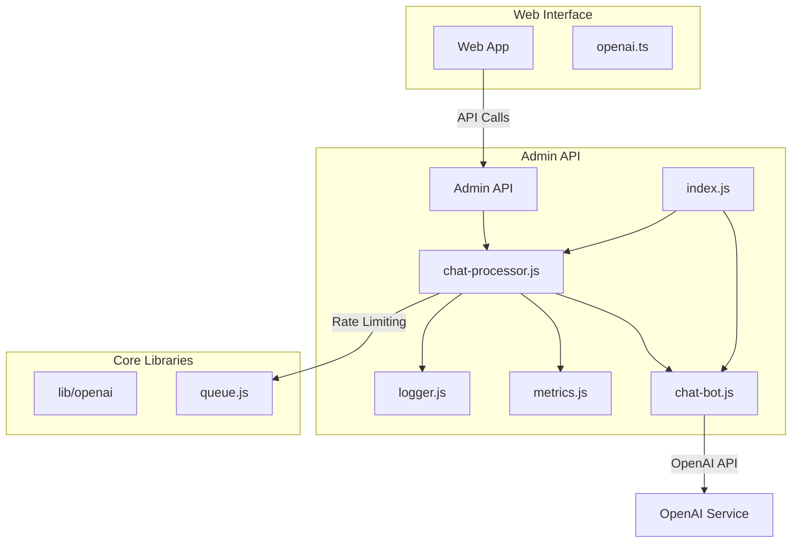
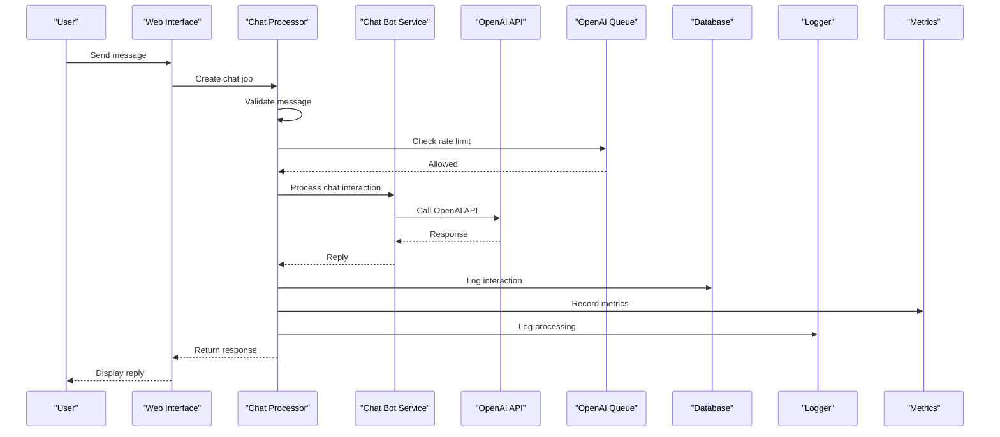
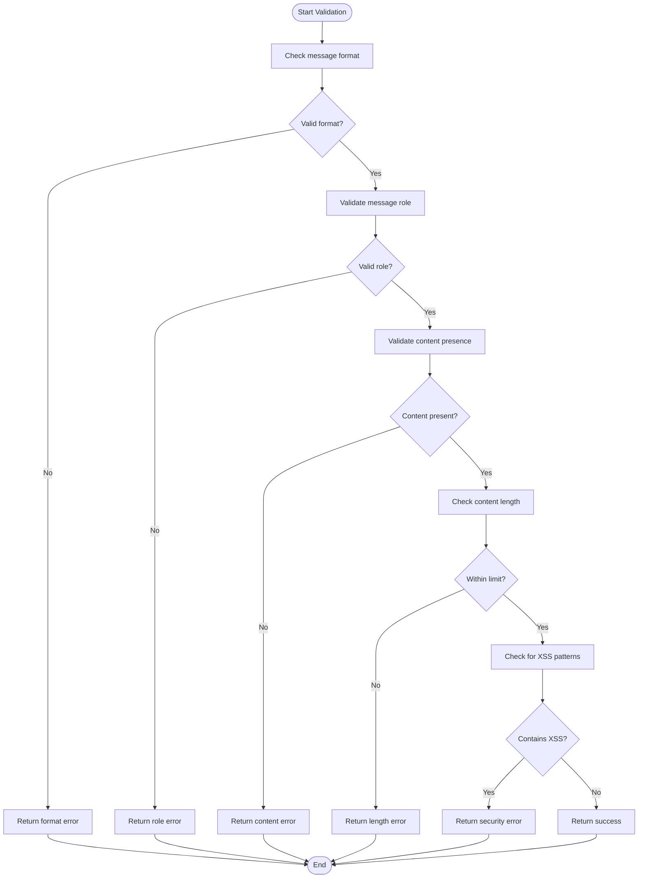
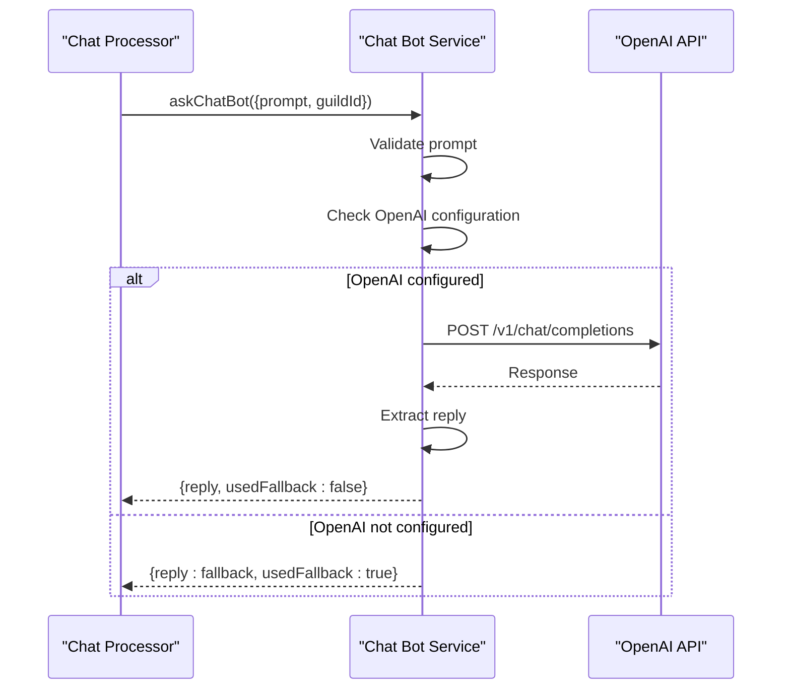
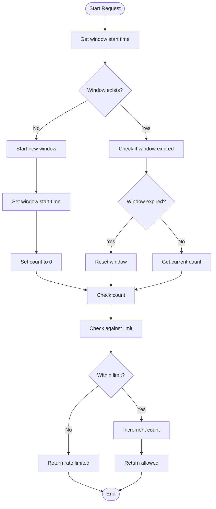
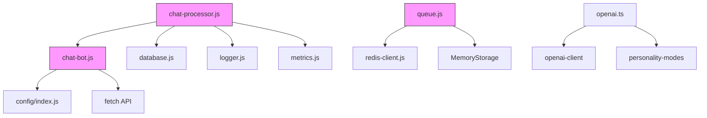

# Chat Queue Processing

<cite>
**Referenced Files in This Document**   
- [chat-processor.js](file://apps/admin-api/src/lib/queues/chat-processor.js)
- [chat-bot.js](file://apps/admin-api/src/services/chat-bot.js)
- [openai.ts](file://apps/web/lib/chat/openai.ts)
- [queue.js](file://lib/openai/queue.js)
- [index.js](file://apps/admin-api/src/lib/config/index.js)
- [metrics.js](file://apps/admin-api/src/lib/monitoring/metrics.js)
- [logger.js](file://apps/admin-api/src/lib/logger.js)
</cite>

## Table of Contents
1. [Introduction](#introduction)
2. [Project Structure](#project-structure)
3. [Core Components](#core-components)
4. [Architecture Overview](#architecture-overview)
5. [Detailed Component Analysis](#detailed-component-analysis)
6. [Dependency Analysis](#dependency-analysis)
7. [Performance Considerations](#performance-considerations)
8. [Troubleshooting Guide](#troubleshooting-guide)
9. [Conclusion](#conclusion)

## Introduction
The Chat Queue Processing system in the slimy-monorepo platform handles asynchronous chat bot interactions with OpenAI, message validation, and response caching. This document details the architecture and functionality of the system, focusing on the processChatBotInteraction function, message validation logic, integration between chat-processor and chat-bot services, configuration settings, and job lifecycle management.

## Project Structure
The chat queue processing system is distributed across multiple directories in the slimy-monorepo platform:
- `apps/admin-api/src/lib/queues/` - Contains the chat-processor.js that handles job processing
- `apps/admin-api/src/services/` - Contains the chat-bot.js service that interfaces with OpenAI
- `apps/web/lib/chat/` - Contains openai.ts with client-side chat functionality
- `lib/openai/` - Contains queue.js with rate limiting and queue management
- `apps/admin-api/src/lib/config/` - Contains configuration settings
- `apps/admin-api/src/lib/monitoring/` - Contains metrics and logging utilities

**Diagram sources**
- [chat-processor.js](file://apps/admin-api/src/lib/queues/chat-processor.js)
- [chat-bot.js](file://apps/admin-api/src/services/chat-bot.js)
- [openai.ts](file://apps/web/lib/chat/openai.ts)
- [queue.js](file://lib/openai/queue.js)

**Section sources**
- [chat-processor.js](file://apps/admin-api/src/lib/queues/chat-processor.js)
- [chat-bot.js](file://apps/admin-api/src/services/chat-bot.js)
- [openai.ts](file://apps/web/lib/chat/openai.ts)
- [queue.js](file://lib/openai/queue.js)

## Core Components
The chat queue processing system consists of several core components that work together to handle asynchronous chat bot interactions. The main components include the chat-processor, chat-bot service, OpenAI queue with rate limiting, and supporting utilities for configuration, logging, and metrics.

The system is designed to process chat bot interactions asynchronously, validate messages for security and content requirements, and handle responses with appropriate caching and fallback mechanisms. It integrates with OpenAI for generating responses while implementing robust error handling and monitoring.

**Section sources**
- [chat-processor.js](file://apps/admin-api/src/lib/queues/chat-processor.js)
- [chat-bot.js](file://apps/admin-api/src/services/chat-bot.js)
- [queue.js](file://lib/openai/queue.js)

## Architecture Overview
The chat queue processing system follows a layered architecture with clear separation of concerns. The system receives chat requests through the web interface, which are then processed asynchronously by the chat-processor service. The processor validates messages, interacts with the chat-bot service to generate responses from OpenAI, and handles logging and metrics.

The architecture includes several key components:
- **Web Interface**: Initiates chat requests and handles user interactions
- **Chat Processor**: Manages the asynchronous processing of chat jobs
- **Chat Bot Service**: Interfaces with OpenAI to generate responses
- **OpenAI Queue**: Implements rate limiting and request queuing
- **Configuration System**: Centralized configuration management
- **Monitoring System**: Metrics collection and logging

**Diagram sources**
- [chat-processor.js](file://apps/admin-api/src/lib/queues/chat-processor.js)
- [chat-bot.js](file://apps/admin-api/src/services/chat-bot.js)
- [queue.js](file://lib/openai/queue.js)

## Detailed Component Analysis

### Chat Processor Analysis
The chat-processor component is responsible for handling asynchronous chat bot interactions. It processes jobs from a queue, validates messages, calls the chat-bot service, and handles logging and metrics.

The processor implements three main functions:
- `processChatBotInteraction`: Handles individual chat bot interactions
- `processMessageValidation`: Validates messages for content and security
- `processBulkMessages`: Processes multiple messages in bulk

The processor includes comprehensive error handling and logging to ensure reliability and traceability.

#### Message Validation Logic

**Diagram sources**
- [chat-processor.js](file://apps/admin-api/src/lib/queues/chat-processor.js#L150-L206)

**Section sources**
- [chat-processor.js](file://apps/admin-api/src/lib/queues/chat-processor.js#L150-L206)

### Chat Bot Service Analysis
The chat-bot service acts as an interface between the chat processor and the OpenAI API. It handles the actual communication with OpenAI and implements fallback mechanisms when OpenAI is not available.

The service includes:
- Configuration for OpenAI API key and model
- System prompt generation based on guild context
- Error handling for OpenAI API failures
- Fallback responses when OpenAI is not configured

#### Chat Bot Interaction Flow

**Diagram sources**
- [chat-bot.js](file://apps/admin-api/src/services/chat-bot.js#L13-L58)

**Section sources**
- [chat-bot.js](file://apps/admin-api/src/services/chat-bot.js#L13-L58)

### OpenAI Queue Analysis
The OpenAI queue implements rate limiting for OpenAI requests to prevent abuse and ensure fair usage. It uses Redis for distributed rate limiting in production, with an in-memory fallback for development.

The queue provides:
- Per-user rate limiting (10 requests per minute by default)
- Redis storage for production environments
- In-memory storage for development
- Automatic fallback when Redis is not available

#### Rate Limiting Algorithm

**Diagram sources**
- [queue.js](file://lib/openai/queue.js#L156-L201)

**Section sources**
- [queue.js](file://lib/openai/queue.js#L156-L201)

## Dependency Analysis
The chat queue processing system has several key dependencies that enable its functionality:

The system depends on:
- **chat-bot.js**: For OpenAI integration and response generation
- **database.js**: For logging chat interactions
- **logger.js**: For structured logging
- **metrics.js**: For performance monitoring
- **config/index.js**: For configuration settings
- **redis-client.js**: For distributed rate limiting
- **openai-client**: For OpenAI API communication

**Diagram sources**
- [chat-processor.js](file://apps/admin-api/src/lib/queues/chat-processor.js)
- [chat-bot.js](file://apps/admin-api/src/services/chat-bot.js)
- [queue.js](file://lib/openai/queue.js)

**Section sources**
- [chat-processor.js](file://apps/admin-api/src/lib/queues/chat-processor.js)
- [chat-bot.js](file://apps/admin-api/src/services/chat-bot.js)
- [queue.js](file://lib/openai/queue.js)

## Performance Considerations
The chat queue processing system includes several performance optimizations:

- **Rate Limiting**: The OpenAI queue prevents abuse with per-user rate limiting (10 requests per minute by default)
- **Caching**: Responses are not explicitly cached, but the system is designed to integrate with caching layers
- **Asynchronous Processing**: Chat interactions are processed asynchronously to avoid blocking the main application
- **Bulk Processing**: The system supports bulk message processing for efficiency
- **Error Resilience**: Comprehensive error handling ensures the system remains available even when external services fail

The system is configured with the following settings:
- 5 workers for processing chat jobs
- Job retry policies with exponential backoff (3 attempts, 2s initial delay)
- Job cleanup settings (removeOnComplete: 50, removeOnFail: 100)

**Section sources**
- [queue.js](file://lib/openai/queue.js)
- [chat-processor.js](file://apps/admin-api/src/lib/queues/chat-processor.js)

## Troubleshooting Guide
When troubleshooting issues with the chat queue processing system, consider the following:

1. **Check Configuration**: Ensure OPENAI_API_KEY is set in the environment variables
2. **Verify Redis Connection**: Confirm Redis is available for rate limiting
3. **Review Logs**: Check the structured logs for error messages
4. **Monitor Metrics**: Use the metrics endpoint to monitor system performance
5. **Test Rate Limiting**: Verify rate limiting is working correctly

Common issues and solutions:
- **OpenAI Integration Not Configured**: Set OPENAI_API_KEY in environment variables
- **Rate Limiting Issues**: Check Redis connectivity and configuration
- **Message Validation Failures**: Ensure messages meet length and content requirements
- **Database Logging Failures**: Verify database configuration and connectivity

**Section sources**
- [chat-processor.js](file://apps/admin-api/src/lib/queues/chat-processor.js)
- [chat-bot.js](file://apps/admin-api/src/services/chat-bot.js)
- [logger.js](file://apps/admin-api/src/lib/logger.js)
- [metrics.js](file://apps/admin-api/src/lib/monitoring/metrics.js)

## Conclusion
The chat queue processing system in the slimy-monorepo platform provides a robust solution for handling asynchronous chat bot interactions with OpenAI. The system implements comprehensive message validation, response caching, and error handling to ensure reliability and security.

Key features include:
- Asynchronous processing of chat bot interactions
- Comprehensive message validation with XSS protection
- Integration with OpenAI with fallback mechanisms
- Rate limiting to prevent abuse
- Comprehensive logging and metrics for monitoring

The system is designed to be scalable and maintainable, with clear separation of concerns and well-defined interfaces between components.