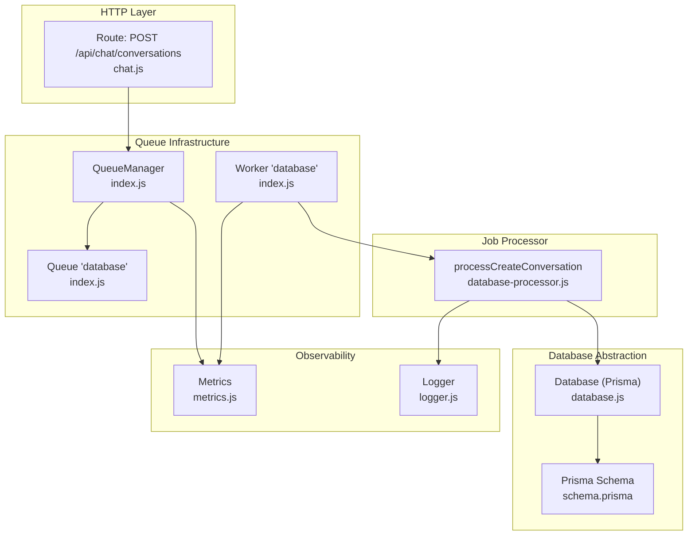
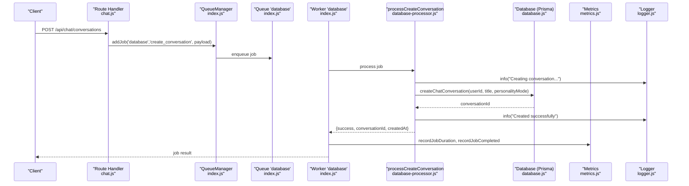
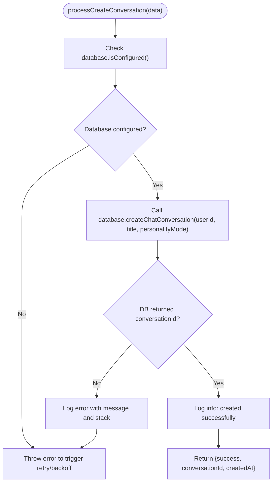
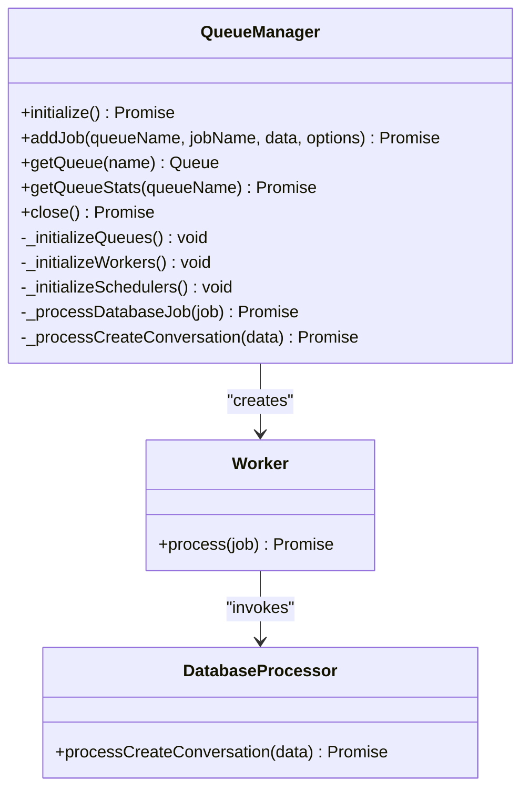
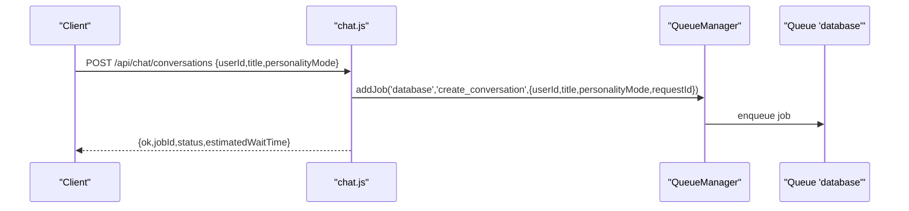
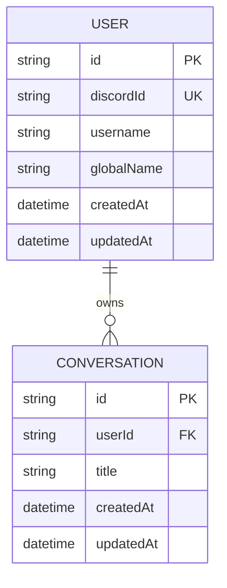
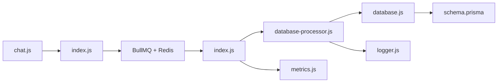

# Create Conversation Processing

<cite>
**Referenced Files in This Document**
- [database-processor.js](file://apps/admin-api/src/lib/queues/database-processor.js)
- [index.js](file://apps/admin-api/src/lib/queues/index.js)
- [chat.js](file://apps/admin-api/src/routes/chat.js)
- [database.js](file://apps/admin-api/src/lib/database.js)
- [metrics.js](file://apps/admin-api/src/lib/monitoring/metrics.js)
- [logger.js](file://apps/admin-api/src/lib/logger.js)
- [schema.prisma](file://apps/admin-api/prisma/schema.prisma)
</cite>

## Table of Contents
1. [Introduction](#introduction)
2. [Project Structure](#project-structure)
3. [Core Components](#core-components)
4. [Architecture Overview](#architecture-overview)
5. [Detailed Component Analysis](#detailed-component-analysis)
6. [Dependency Analysis](#dependency-analysis)
7. [Performance Considerations](#performance-considerations)
8. [Troubleshooting Guide](#troubleshooting-guide)
9. [Conclusion](#conclusion)

## Introduction
This document explains the create conversation processing pipeline within the database queue system. It focuses on how the processCreateConversation function validates inputs, interacts with the database abstraction layer, and integrates with the BullMQ-based queue infrastructure. It also covers logging, error handling, retry/backoff behavior, and metrics collection for job duration and completion. Finally, it demonstrates how the job is enqueued via the QueueManager with the 'create_conversation' type.

## Project Structure
The create conversation flow spans several modules:
- Route handler enqueues the job into the 'database' queue
- Queue infrastructure initializes BullMQ queues and workers
- Database processor executes the conversation creation job
- Database abstraction layer persists data to the schema-backed model
- Metrics and logging capture job performance and outcomes

**Diagram sources**
- [chat.js](file://apps/admin-api/src/routes/chat.js#L368-L394)
- [index.js](file://apps/admin-api/src/lib/queues/index.js#L81-L105)
- [index.js](file://apps/admin-api/src/lib/queues/index.js#L132-L151)
- [database-processor.js](file://apps/admin-api/src/lib/queues/database-processor.js#L25-L53)
- [database.js](file://apps/admin-api/src/lib/database.js#L569-L578)
- [schema.prisma](file://apps/admin-api/prisma/schema.prisma#L118-L130)
- [metrics.js](file://apps/admin-api/src/lib/monitoring/metrics.js#L100-L129)
- [logger.js](file://apps/admin-api/src/lib/logger.js#L1-L169)

**Section sources**
- [chat.js](file://apps/admin-api/src/routes/chat.js#L368-L394)
- [index.js](file://apps/admin-api/src/lib/queues/index.js#L81-L105)
- [database-processor.js](file://apps/admin-api/src/lib/queues/database-processor.js#L25-L53)
- [database.js](file://apps/admin-api/src/lib/database.js#L569-L578)
- [schema.prisma](file://apps/admin-api/prisma/schema.prisma#L118-L130)
- [metrics.js](file://apps/admin-api/src/lib/monitoring/metrics.js#L100-L129)
- [logger.js](file://apps/admin-api/src/lib/logger.js#L1-L169)

## Core Components
- Route handler enqueues a 'create_conversation' job with userId, title, personalityMode, and requestId.
- QueueManager initializes BullMQ queues and workers, records job metrics, and applies exponential backoff retries.
- Database processor validates database readiness, calls the database abstraction, and logs outcomes.
- Database abstraction uses Prisma to persist a Conversation entity.
- Metrics and logger provide observability for job duration, success/failure, and operational context.

**Section sources**
- [chat.js](file://apps/admin-api/src/routes/chat.js#L368-L394)
- [index.js](file://apps/admin-api/src/lib/queues/index.js#L81-L105)
- [index.js](file://apps/admin-api/src/lib/queues/index.js#L132-L151)
- [database-processor.js](file://apps/admin-api/src/lib/queues/database-processor.js#L25-L53)
- [database.js](file://apps/admin-api/src/lib/database.js#L569-L578)
- [metrics.js](file://apps/admin-api/src/lib/monitoring/metrics.js#L100-L129)
- [logger.js](file://apps/admin-api/src/lib/logger.js#L1-L169)

## Architecture Overview
The create conversation flow is asynchronous and resilient:
- The HTTP route enqueues a job to the 'database' queue.
- The 'database' worker invokes processCreateConversation.
- The processor validates database readiness, calls database.createChatConversation, and returns a structured result.
- The worker records job duration and success/failure metrics and logs outcomes.

**Diagram sources**
- [chat.js](file://apps/admin-api/src/routes/chat.js#L368-L394)
- [index.js](file://apps/admin-api/src/lib/queues/index.js#L207-L223)
- [index.js](file://apps/admin-api/src/lib/queues/index.js#L132-L151)
- [database-processor.js](file://apps/admin-api/src/lib/queues/database-processor.js#L25-L53)
- [database.js](file://apps/admin-api/src/lib/database.js#L569-L578)
- [metrics.js](file://apps/admin-api/src/lib/monitoring/metrics.js#L100-L129)
- [logger.js](file://apps/admin-api/src/lib/logger.js#L1-L169)

## Detailed Component Analysis

### processCreateConversation
- Purpose: Asynchronously create a chat conversation for a user with optional title and personality mode.
- Parameters:
  - userId: string (required)
  - title: string | null (optional)
  - personalityMode: string (defaults to 'helpful' if not provided)
- Validation logic:
  - Checks database readiness via database.isConfigured().
  - If not configured, throws an error to trigger retry/backoff.
- Interaction with database abstraction:
  - Calls database.createChatConversation(userId, title || null, personalityMode || 'helpful').
  - Returns a structured result containing success, conversationId, and createdAt.
- Logging:
  - Logs info on job start and success with contextual fields.
  - On failure, logs error with error message, stack, and user context.
- Error handling:
  - Propagates thrown errors so BullMQ can retry according to configured attempts and backoff.

**Diagram sources**
- [database-processor.js](file://apps/admin-api/src/lib/queues/database-processor.js#L25-L53)
- [database.js](file://apps/admin-api/src/lib/database.js#L569-L578)
- [logger.js](file://apps/admin-api/src/lib/logger.js#L1-L169)

**Section sources**
- [database-processor.js](file://apps/admin-api/src/lib/queues/database-processor.js#L25-L53)
- [database.js](file://apps/admin-api/src/lib/database.js#L569-L578)
- [logger.js](file://apps/admin-api/src/lib/logger.js#L1-L169)

### QueueManager and Workers
- Queue initialization:
  - Creates queues 'chat', 'database', and 'audit' with default job options.
  - Default job options include removeOnComplete/removeOnFail limits, attempts, and exponential backoff.
- Worker initialization:
  - Workers for 'database' queue run processCreateConversation and related processors.
  - Each worker measures job duration, records job metrics, and logs failures.
- Enqueueing:
  - addJob(queueName, jobName, data, options) returns the job and records queued metric.

**Diagram sources**
- [index.js](file://apps/admin-api/src/lib/queues/index.js#L81-L105)
- [index.js](file://apps/admin-api/src/lib/queues/index.js#L132-L151)
- [index.js](file://apps/admin-api/src/lib/queues/index.js#L240-L257)
- [database-processor.js](file://apps/admin-api/src/lib/queues/database-processor.js#L25-L53)

**Section sources**
- [index.js](file://apps/admin-api/src/lib/queues/index.js#L81-L105)
- [index.js](file://apps/admin-api/src/lib/queues/index.js#L132-L151)
- [index.js](file://apps/admin-api/src/lib/queues/index.js#L240-L257)

### Route Enqueue Example
- The route handler enqueues a 'create_conversation' job into the 'database' queue with:
  - userId, title, personalityMode, and requestId.
- Returns immediately with job metadata and an estimated wait time.

**Diagram sources**
- [chat.js](file://apps/admin-api/src/routes/chat.js#L368-L394)
- [index.js](file://apps/admin-api/src/lib/queues/index.js#L207-L223)

**Section sources**
- [chat.js](file://apps/admin-api/src/routes/chat.js#L368-L394)
- [index.js](file://apps/admin-api/src/lib/queues/index.js#L207-L223)

### Database Abstraction and Schema
- The database abstraction exposes createChatConversation which maps to the Prisma Conversation model.
- The Conversation model defines id, userId, title, createdAt, updatedAt, and relations.

**Diagram sources**
- [schema.prisma](file://apps/admin-api/prisma/schema.prisma#L118-L130)
- [database.js](file://apps/admin-api/src/lib/database.js#L569-L578)

**Section sources**
- [schema.prisma](file://apps/admin-api/prisma/schema.prisma#L118-L130)
- [database.js](file://apps/admin-api/src/lib/database.js#L569-L578)

## Dependency Analysis
- Route handler depends on QueueManager to enqueue jobs.
- QueueManager depends on BullMQ (Queue, Worker, QueueScheduler) and Redis.
- Database processor depends on Database abstraction and logger.
- Database abstraction depends on Prisma client and schema.
- Metrics are recorded by workers and the database layer.

**Diagram sources**
- [chat.js](file://apps/admin-api/src/routes/chat.js#L368-L394)
- [index.js](file://apps/admin-api/src/lib/queues/index.js#L81-L105)
- [database-processor.js](file://apps/admin-api/src/lib/queues/database-processor.js#L25-L53)
- [database.js](file://apps/admin-api/src/lib/database.js#L569-L578)
- [schema.prisma](file://apps/admin-api/prisma/schema.prisma#L118-L130)
- [metrics.js](file://apps/admin-api/src/lib/monitoring/metrics.js#L100-L129)
- [logger.js](file://apps/admin-api/src/lib/logger.js#L1-L169)

**Section sources**
- [chat.js](file://apps/admin-api/src/routes/chat.js#L368-L394)
- [index.js](file://apps/admin-api/src/lib/queues/index.js#L81-L105)
- [database-processor.js](file://apps/admin-api/src/lib/queues/database-processor.js#L25-L53)
- [database.js](file://apps/admin-api/src/lib/database.js#L569-L578)
- [schema.prisma](file://apps/admin-api/prisma/schema.prisma#L118-L130)
- [metrics.js](file://apps/admin-api/src/lib/monitoring/metrics.js#L100-L129)
- [logger.js](file://apps/admin-api/src/lib/logger.js#L1-L169)

## Performance Considerations
- Asynchronous processing offloads database writes from the main request thread, improving responsiveness.
- BullMQ workers for the 'database' queue run with higher concurrency, enabling parallel processing of conversation creation and other database jobs.
- Metrics capture job duration and success rates, enabling capacity planning and alerting.
- Database query instrumentation via Prisma middleware contributes to overall latency visibility.

[No sources needed since this section provides general guidance]

## Troubleshooting Guide
Common issues and resolutions:
- Database connectivity problems:
  - Symptoms: processCreateConversation throws 'Database not configured' or connection failures.
  - Causes: DATABASE_URL misconfiguration, Redis unavailability, or Prisma client initialization errors.
  - Resolution: Verify environment variables, ensure Redis is reachable, and confirm Prisma client connects successfully.
- Validation failures:
  - Symptoms: Missing userId or invalid data types.
  - Resolution: Ensure the route handler passes required fields and defaults are applied for optional fields.
- Retry/backoff behavior:
  - BullMQ is configured with attempts and exponential backoff. Failures are retried automatically; monitor job metrics to detect persistent failures.
- Logging and observability:
  - Use info logs for successful creation and error logs for failures. Correlate with requestId for end-to-end tracing.

**Section sources**
- [database-processor.js](file://apps/admin-api/src/lib/queues/database-processor.js#L25-L53)
- [index.js](file://apps/admin-api/src/lib/queues/index.js#L81-L105)
- [metrics.js](file://apps/admin-api/src/lib/monitoring/metrics.js#L100-L129)
- [logger.js](file://apps/admin-api/src/lib/logger.js#L1-L169)

## Conclusion
The create conversation processing pipeline leverages asynchronous job queues to reliably persist conversations while keeping the HTTP request thread responsive. The processCreateConversation function validates inputs, interacts with the database abstraction, and logs outcomes. BullMQ provides robust retry/backoff, and metrics capture job duration and completion, enabling operational insights and performance tuning.