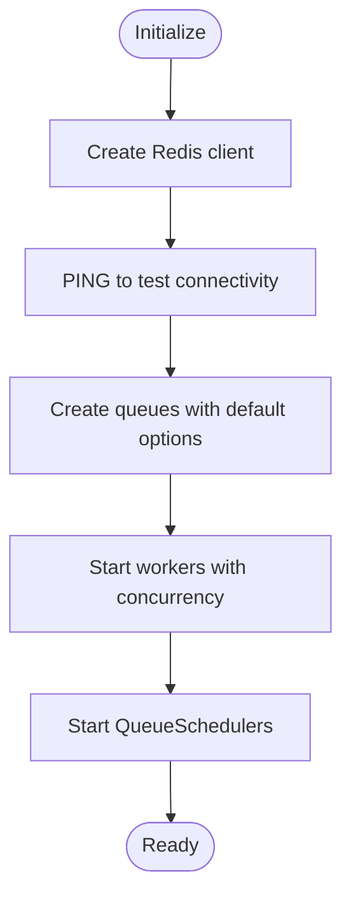

# Database Queue Processing

<cite>
**Referenced Files in This Document**
- [index.js](file://apps/admin-api/src/lib/queues/index.js)
- [database-processor.js](file://apps/admin-api/src/lib/queues/database-processor.js)
- [chat-processor.js](file://apps/admin-api/src/lib/queues/chat-processor.js)
- [audit-processor.js](file://apps/admin-api/src/lib/queues/audit-processor.js)
- [database.js](file://apps/admin-api/src/lib/database.js)
- [chat.js](file://apps/admin-api/src/routes/chat.js)
- [schemas.js](file://apps/admin-api/src/lib/validation/schemas.js)
- [config/index.js](file://apps/admin-api/src/lib/config/index.js)
- [schema.prisma](file://apps/admin-api/prisma/schema.prisma)
</cite>

## Table of Contents
1. [Introduction](#introduction)
2. [Project Structure](#project-structure)
3. [Core Components](#core-components)
4. [Architecture Overview](#architecture-overview)
5. [Detailed Component Analysis](#detailed-component-analysis)
6. [Dependency Analysis](#dependency-analysis)
7. [Performance Considerations](#performance-considerations)
8. [Troubleshooting Guide](#troubleshooting-guide)
9. [Conclusion](#conclusion)

## Introduction
This document explains the database queue processing system used for asynchronous data operations in the slimy-monorepo platform. It focuses on how the system manages chat conversation lifecycle operations (creation, message saving, updates, deletions) and bulk retrieval, and how it integrates with the Prisma ORM through a database abstraction layer. It also covers Redis-backed job queues, concurrency configuration, retry policies with exponential backoff, and job cleanup settings. Finally, it describes the end-to-end data flow from API requests to queue jobs to database persistence and how this design keeps the user interface responsive.

## Project Structure
The queue system is implemented in the admin API service and consists of:
- A queue manager that initializes Redis, queues, workers, and schedulers
- Queue processors for chat, database, and audit operations
- A database abstraction layer wrapping Prisma
- API routes that enqueue jobs for chat and database operations
- Validation schemas for request payloads

**Diagram sources**
- [index.js](file://apps/admin-api/src/lib/queues/index.js#L1-L120)
- [chat-processor.js](file://apps/admin-api/src/lib/queues/chat-processor.js#L1-L120)
- [database-processor.js](file://apps/admin-api/src/lib/queues/database-processor.js#L1-L120)
- [audit-processor.js](file://apps/admin-api/src/lib/queues/audit-processor.js#L1-L120)
- [database.js](file://apps/admin-api/src/lib/database.js#L1-L120)
- [chat.js](file://apps/admin-api/src/routes/chat.js#L1-L120)
- [schemas.js](file://apps/admin-api/src/lib/validation/schemas.js#L388-L476)
- [schema.prisma](file://apps/admin-api/prisma/schema.prisma#L1-L160)

**Section sources**
- [index.js](file://apps/admin-api/src/lib/queues/index.js#L1-L120)
- [chat.js](file://apps/admin-api/src/routes/chat.js#L1-L120)

## Core Components
- QueueManager: Initializes Redis, creates queues with default job options, starts workers with concurrency, and exposes helpers to add jobs and query stats.
- Chat Processor: Handles chat bot interactions and related validations.
- Database Processor: Implements conversation lifecycle and retrieval operations.
- Audit Processor: Handles audit logging, bulk logging, cleanup, and reporting.
- Database Abstraction: Wraps Prisma, provides initialization, connection metrics, and convenience methods for chat and audit operations.
- Routes: Enqueue jobs for chat and database operations and expose job status endpoints.

**Section sources**
- [index.js](file://apps/admin-api/src/lib/queues/index.js#L1-L220)
- [database-processor.js](file://apps/admin-api/src/lib/queues/database-processor.js#L1-L120)
- [chat-processor.js](file://apps/admin-api/src/lib/queues/chat-processor.js#L1-L120)
- [audit-processor.js](file://apps/admin-api/src/lib/queues/audit-processor.js#L1-L120)
- [database.js](file://apps/admin-api/src/lib/database.js#L1-L120)
- [chat.js](file://apps/admin-api/src/routes/chat.js#L1-L120)

## Architecture Overview
The system uses BullMQ with Redis to decouple API responses from heavy database operations. Workers consume jobs from queues and execute processors that interact with the database abstraction layer. The database abstraction layer uses Prisma to connect to the MySQL database and records metrics for instrumentation.

**Diagram sources**
- [chat.js](file://apps/admin-api/src/routes/chat.js#L344-L394)
- [index.js](file://apps/admin-api/src/lib/queues/index.js#L204-L223)
- [database-processor.js](file://apps/admin-api/src/lib/queues/database-processor.js#L1-L62)
- [database.js](file://apps/admin-api/src/lib/database.js#L569-L595)

## Detailed Component Analysis

### QueueManager and Concurrency
- Initializes Redis with retry and connection options.
- Creates queues with default job options: removeOnComplete/removeOnFail limits, attempts, and exponential backoff.
- Starts workers with concurrency:
  - chat: 5
  - database: 10
  - audit: 2
- Provides addJob, getQueue, and getQueueStats helpers.
- Uses QueueScheduler for reliability.

**Diagram sources**
- [index.js](file://apps/admin-api/src/lib/queues/index.js#L42-L120)

**Section sources**
- [index.js](file://apps/admin-api/src/lib/queues/index.js#L42-L120)
- [index.js](file://apps/admin-api/src/lib/queues/index.js#L107-L179)
- [index.js](file://apps/admin-api/src/lib/queues/index.js#L181-L195)

### Database Queue Processors
The database queue implements six processor functions for chat conversation lifecycle and retrieval:

- processCreateConversation
  - Input parameters: userId, title, personalityMode
  - Validation: checks database configuration; otherwise throws
  - Database interaction: creates a new conversation via database abstraction
  - Error handling: logs and rethrows
  - Returns: success flag and conversationId

- processSaveMessage
  - Input parameters: conversationId, userId, role, content, personalityMode
  - Validation: checks database configuration; otherwise throws
  - Database interaction: saves a message to the specified conversation
  - Error handling: logs and rethrows
  - Returns: success flag

- processUpdateConversation
  - Input parameters: conversationId, userId, title
  - Validation: checks database configuration; otherwise throws
  - Database interaction: updates conversation title
  - Error handling: logs and rethrows
  - Returns: success flag

- processDeleteConversation
  - Input parameters: conversationId, userId
  - Validation: checks database configuration; otherwise throws
  - Database interaction: deletes the conversation
  - Error handling: logs and rethrows
  - Returns: success flag

- processGetConversations
  - Input parameters: userId, limit
  - Validation: if database not configured, returns empty list
  - Database interaction: retrieves conversations and enriches with message counts
  - Error handling: logs and rethrows
  - Returns: success flag and conversations array

- processGetMessages
  - Input parameters: conversationId, limit
  - Validation: if database not configured, returns empty list
  - Database interaction: retrieves messages for a conversation
  - Error handling: logs and rethrows
  - Returns: success flag and messages array

**Diagram sources**
- [database-processor.js](file://apps/admin-api/src/lib/queues/database-processor.js#L1-L62)

**Section sources**
- [database-processor.js](file://apps/admin-api/src/lib/queues/database-processor.js#L1-L62)
- [database-processor.js](file://apps/admin-api/src/lib/queues/database-processor.js#L64-L114)
- [database-processor.js](file://apps/admin-api/src/lib/queues/database-processor.js#L116-L155)
- [database-processor.js](file://apps/admin-api/src/lib/queues/database-processor.js#L157-L194)
- [database-processor.js](file://apps/admin-api/src/lib/queues/database-processor.js#L196-L265)
- [database-processor.js](file://apps/admin-api/src/lib/queues/database-processor.js#L267-L314)

### Chat Processor (context for queue integration)
While the database queue focuses on database operations, the chat processor demonstrates how jobs are structured and validated:
- processChatBotInteraction: orchestrates OpenAI calls, metrics recording, and audit logging
- processMessageValidation: validates message shape and content length
- processBulkMessages: validates multiple messages and aggregates results

These show the pattern of job data payloads and validation that mirror database queue jobs.

**Section sources**
- [chat-processor.js](file://apps/admin-api/src/lib/queues/chat-processor.js#L1-L120)
- [chat-processor.js](file://apps/admin-api/src/lib/queues/chat-processor.js#L141-L206)
- [chat-processor.js](file://apps/admin-api/src/lib/queues/chat-processor.js#L208-L272)

### Audit Processor (context for queue integration)
- processLogEvent: validates required fields, creates audit log, records metrics
- processBulkLogEvents: processes multiple events
- processAuditCleanup: deletes old audit logs with exclusions
- processAuditReport: generates reports using grouped queries

**Section sources**
- [audit-processor.js](file://apps/admin-api/src/lib/queues/audit-processor.js#L1-L126)
- [audit-processor.js](file://apps/admin-api/src/lib/queues/audit-processor.js#L128-L187)
- [audit-processor.js](file://apps/admin-api/src/lib/queues/audit-processor.js#L190-L256)
- [audit-processor.js](file://apps/admin-api/src/lib/queues/audit-processor.js#L258-L393)

### Database Abstraction Layer (Prisma)
- Initializes Prisma client with configurable log level
- Adds middleware to record query durations and errors
- Tests connection on initialize and tracks connection count
- Exposes methods for:
  - Audit logging (createAuditLog, getAuditLogs, getAuditLogStats)
  - Chat operations (createChatMessage, getChatMessages)
  - Conversation operations (createConversation, getUserConversations)
  - General helpers (getClient, isConfigured, close)

**Diagram sources**
- [database.js](file://apps/admin-api/src/lib/database.js#L1-L120)
- [database.js](file://apps/admin-api/src/lib/database.js#L569-L677)
- [schema.prisma](file://apps/admin-api/prisma/schema.prisma#L117-L158)

**Section sources**
- [database.js](file://apps/admin-api/src/lib/database.js#L1-L120)
- [database.js](file://apps/admin-api/src/lib/database.js#L569-L677)
- [schema.prisma](file://apps/admin-api/prisma/schema.prisma#L117-L158)

### API Integration and Job Status
- Routes enqueue jobs to the database queue for conversation and message operations.
- Routes expose endpoints to check job status for both chat and database queues.
- Validation schemas define request shapes for chat endpoints.

**Diagram sources**
- [chat.js](file://apps/admin-api/src/routes/chat.js#L584-L637)
- [chat.js](file://apps/admin-api/src/routes/chat.js#L183-L254)
- [index.js](file://apps/admin-api/src/lib/queues/index.js#L204-L223)
- [database-processor.js](file://apps/admin-api/src/lib/queues/database-processor.js#L64-L114)

**Section sources**
- [chat.js](file://apps/admin-api/src/routes/chat.js#L584-L637)
- [chat.js](file://apps/admin-api/src/routes/chat.js#L183-L254)
- [schemas.js](file://apps/admin-api/src/lib/validation/schemas.js#L388-L476)

## Dependency Analysis
- QueueManager depends on BullMQ, ioredis, and configuration for Redis URL.
- Queue processors depend on the database abstraction layer and logging/metrics.
- Routes depend on QueueManager and validation schemas.
- Database abstraction depends on Prisma client and schema.

**Diagram sources**
- [config/index.js](file://apps/admin-api/src/lib/config/index.js#L184-L223)
- [index.js](file://apps/admin-api/src/lib/queues/index.js#L1-L120)
- [database.js](file://apps/admin-api/src/lib/database.js#L1-L120)
- [schema.prisma](file://apps/admin-api/prisma/schema.prisma#L1-L160)

**Section sources**
- [config/index.js](file://apps/admin-api/src/lib/config/index.js#L184-L223)
- [index.js](file://apps/admin-api/src/lib/queues/index.js#L1-L120)
- [database.js](file://apps/admin-api/src/lib/database.js#L1-L120)
- [schema.prisma](file://apps/admin-api/prisma/schema.prisma#L1-L160)

## Performance Considerations
- Concurrency tuning:
  - Database queue worker concurrency is set to 10, suitable for data-intensive operations.
  - Chat queue worker concurrency is 5, balancing latency-sensitive bot interactions.
- Backoff and retries:
  - Default attempts: 3
  - Backoff type: exponential with initial delay of 2 seconds
  - Job cleanup: removeOnComplete 50, removeOnFail 100
- Redis connection options:
  - maxRetriesPerRequest: 3
  - retryDelayOnFailover: 100
  - enableReadyCheck: false
  - lazyConnect: true
- Database instrumentation:
  - Prisma middleware records query durations and errors
  - Connection count tracked on connect/disconnect

**Section sources**
- [index.js](file://apps/admin-api/src/lib/queues/index.js#L81-L105)
- [index.js](file://apps/admin-api/src/lib/queues/index.js#L107-L179)
- [database.js](file://apps/admin-api/src/lib/database.js#L12-L40)

## Troubleshooting Guide
- Redis connectivity:
  - The manager pings Redis on initialization; failures are logged and initialization returns false.
- Database connectivity:
  - The database abstraction connects Prisma on initialize and records connection metrics; errors are surfaced to callers.
- Job failures:
  - Workers record job duration and failure metrics; errors are logged with job context.
- Ownership checks:
  - Job status endpoints verify job ownership by checking stored user ID in job data.
- Validation errors:
  - Routes use Zod schemas to validate inputs; validation failures return 400 with details.

**Section sources**
- [index.js](file://apps/admin-api/src/lib/queues/index.js#L42-L76)
- [database.js](file://apps/admin-api/src/lib/database.js#L12-L40)
- [chat.js](file://apps/admin-api/src/routes/chat.js#L104-L181)
- [chat.js](file://apps/admin-api/src/routes/chat.js#L183-L254)
- [schemas.js](file://apps/admin-api/src/lib/validation/schemas.js#L352-L386)

## Conclusion
The database queue processing system provides a robust, scalable mechanism for asynchronous chat conversation lifecycle operations and bulk retrievals. By offloading database writes and reads to workers with configurable concurrency and exponential backoff, the API remains responsive while ensuring reliable persistence through Prisma. The design cleanly separates concerns across queue infrastructure, processors, database abstraction, and API routes, with strong validation and observability.