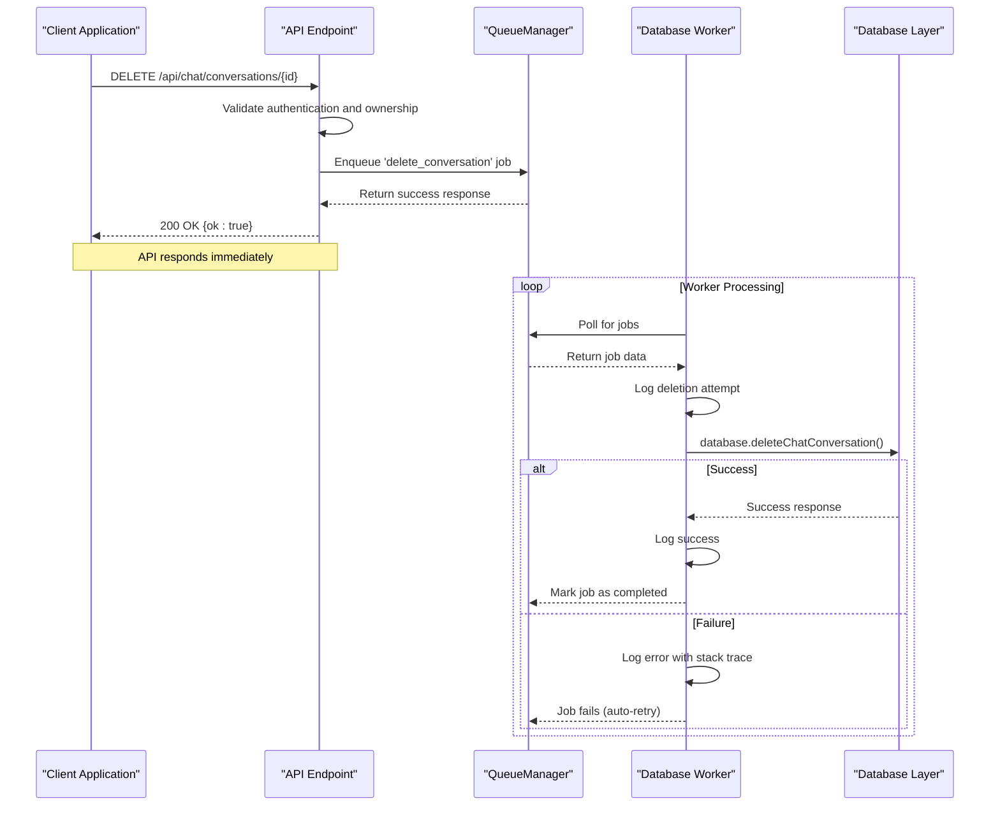
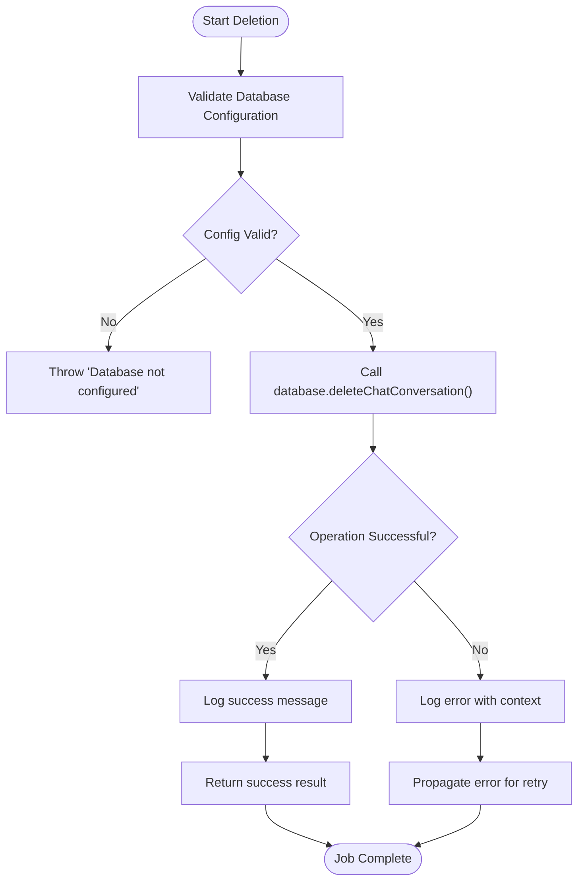
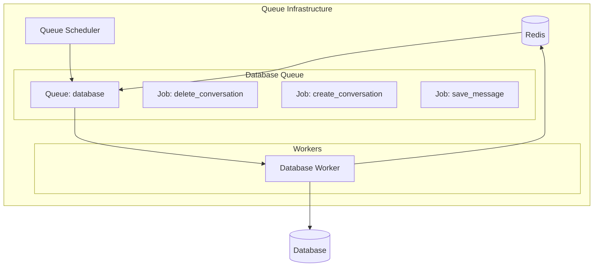
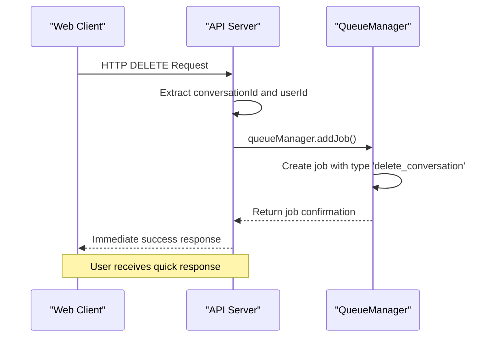

# Delete Conversation Processing

<cite>
**Referenced Files in This Document**   
- [database-processor.js](file://apps/admin-api/src/lib/queues/database-processor.js)
- [index.js](file://apps/admin-api/src/lib/queues/index.js)
- [chat.js](file://apps/admin-api/src/routes/chat.js)
- [database.js](file://apps/admin-api/src/lib/database.js)
- [metrics.js](file://apps/admin-api/src/lib/monitoring/metrics.js)
</cite>

## Table of Contents
1. [Introduction](#introduction)
2. [Core Functionality](#core-functionality)
3. [Process Flow](#process-flow)
4. [Error Handling](#error-handling)
5. [Queue Configuration](#queue-configuration)
6. [Metrics Collection](#metrics-collection)
7. [Practical Example](#practical-example)
8. [Common Issues](#common-issues)
9. [Conclusion](#conclusion)

## Introduction
The delete conversation processing functionality in the Slimy monorepo implements an asynchronous job queue system for handling conversation deletion operations. This system ensures data consistency while maintaining API responsiveness by offloading database operations to a background processing queue. The implementation leverages BullMQ for job queuing with Redis as the message broker, providing reliable processing with retry mechanisms and comprehensive monitoring.

## Core Functionality

The delete conversation processing functionality centers around the `processDeleteConversation` function, which handles the deletion of chat conversations through an asynchronous job queue system. This function receives job data containing the conversationId and userId parameters, validates the database configuration, and delegates the actual deletion to the database abstraction layer.

The process begins with an API endpoint that accepts deletion requests and enqueues them as jobs rather than processing them synchronously. This approach prevents blocking API responses during potentially time-consuming database operations. The function implements comprehensive logging at both info and error levels, providing visibility into successful operations and failure conditions.

Authorization is enforced through the requirement that users can only delete conversations they own, with appropriate error handling for unauthorized access attempts. The database abstraction layer handles the actual deletion logic, including any necessary cascade operations or data integrity checks.

**Section sources**
- [database-processor.js](file://apps/admin-api/src/lib/queues/database-processor.js#L157-L194)
- [chat.js](file://apps/admin-api/src/routes/chat.js#L515-L537)

## Process Flow

The conversation deletion process follows a well-defined flow from API request to job completion:



**Diagram sources **
- [database-processor.js](file://apps/admin-api/src/lib/queues/database-processor.js#L157-L194)
- [index.js](file://apps/admin-api/src/lib/queues/index.js#L207-L223)
- [chat.js](file://apps/admin-api/src/routes/chat.js#L515-L537)

**Section sources**
- [database-processor.js](file://apps/admin-api/src/lib/queues/database-processor.js#L157-L194)
- [index.js](file://apps/admin-api/src/lib/queues/index.js#L207-L223)
- [chat.js](file://apps/admin-api/src/routes/chat.js#L515-L537)

## Error Handling

The system implements comprehensive error handling for conversation deletion operations. When a deletion job fails, the error is caught and logged with detailed context including the conversation ID, user ID, error message, and stack trace. This information is crucial for debugging and monitoring.

The error handling strategy follows a structured approach:
- Database connectivity issues are detected through the `isConfigured()` check
- Authorization failures result in appropriate error responses
- Any exceptions during the deletion process are propagated to trigger job retries
- Detailed error logging provides visibility into failure conditions

The system distinguishes between different error types, allowing for appropriate responses. For example, authorization failures result in 404 responses to prevent information disclosure about conversation existence, while database connectivity issues may trigger different handling patterns.



**Diagram sources **
- [database-processor.js](file://apps/admin-api/src/lib/queues/database-processor.js#L172-L193)
- [database.js](file://apps/admin-api/src/lib/database.js)

**Section sources**
- [database-processor.js](file://apps/admin-api/src/lib/queues/database-processor.js#L172-L193)
- [chat.js](file://apps/admin-api/src/routes/chat.js#L528-L536)

## Queue Configuration

The job queue system is configured with specific parameters to ensure reliable processing of conversation deletion operations. The database queue has a concurrency of 10, allowing up to 10 deletion jobs to be processed simultaneously. This balance between throughput and resource utilization prevents database overload while maintaining good performance.

Each job is configured with retry logic, attempting failed jobs up to 3 times with exponential backoff starting at 2 seconds. This retry mechanism handles transient failures such as temporary database connectivity issues or resource contention. Completed jobs are retained for 50 executions, while failed jobs are kept for 100 executions, providing adequate history for monitoring and debugging.

The queue infrastructure includes schedulers for each queue type, ensuring reliable job processing even in the event of worker failures. Redis serves as the message broker, providing durable storage for job data and enabling horizontal scaling of workers.



**Diagram sources **
- [index.js](file://apps/admin-api/src/lib/queues/index.js#L81-L104)
- [index.js](file://apps/admin-api/src/lib/queues/index.js#L132-L152)

**Section sources**
- [index.js](file://apps/admin-api/src/lib/queues/index.js#L81-L104)

## Metrics Collection

The system collects comprehensive metrics for monitoring the performance and reliability of conversation deletion operations. These metrics include job duration, completion rates, failure counts, and throughput measurements. The metrics are organized by queue type, allowing for granular monitoring of the database queue specifically.

Key metrics collected for deletion operations include:
- Job queuing rate
- Job completion and failure counts
- Average job processing duration
- Job success rate percentage
- Job throughput (jobs per minute)

These metrics are integrated with the application's monitoring system, enabling real-time visibility into queue health and performance. The metrics collection occurs at multiple points in the job lifecycle - when a job is queued, when it completes successfully, and when it fails. This comprehensive tracking allows for detailed analysis of system behavior and performance trends over time.

**Section sources**
- [metrics.js](file://apps/admin-api/src/lib/monitoring/metrics.js#L106-L134)
- [index.js](file://apps/admin-api/src/lib/queues/index.js#L135-L144)

## Practical Example

The following example demonstrates how to enqueue a conversation deletion job using the QueueManager:



In code, this process is implemented as:

```javascript
// Enqueue deletion job
await queueManager.addJob('database', 'delete_conversation', {
  conversationId: 'conv_123',
  userId: 'user_456',
  requestId: 'req_789'
});
```

This approach allows the API to respond immediately to the client while the actual deletion occurs asynchronously in the background. The client receives confirmation that the deletion request was accepted, without having to wait for the database operation to complete.

**Diagram sources **
- [index.js](file://apps/admin-api/src/lib/queues/index.js#L207-L223)
- [chat.js](file://apps/admin-api/src/routes/chat.js#L515-L537)

**Section sources**
- [index.js](file://apps/admin-api/src/lib/queues/index.js#L207-L223)
- [chat.js](file://apps/admin-api/src/routes/chat.js#L515-L537)

## Common Issues

Several common issues may arise during conversation deletion processing:

**Authorization Failures**: Users attempting to delete conversations they don't own will trigger authorization checks. The system handles this by returning a 404 error to prevent information disclosure about conversation existence, maintaining security through consistent error responses regardless of whether the conversation exists or the user lacks permission.

**Database Connectivity Problems**: Transient database connectivity issues are handled through the retry mechanism configured in the queue system. Jobs automatically retry up to 3 times with exponential backoff, allowing the system to recover from temporary outages. Persistent connectivity issues are logged for alerting and require administrative intervention.

**Race Conditions**: In high-concurrency scenarios, multiple deletion requests for the same conversation could create race conditions. The database layer should implement appropriate locking mechanisms to prevent these conditions, ensuring data consistency.

**Orphaned Data**: If the deletion process fails after partially completing, there's a risk of orphaned data. The database abstraction layer should implement transactional operations to ensure atomicity, rolling back partial deletions if any step fails.

Monitoring these issues through the collected metrics allows for proactive identification and resolution, maintaining system reliability and data integrity.

**Section sources**
- [database-processor.js](file://apps/admin-api/src/lib/queues/database-processor.js#L172-L193)
- [chat.js](file://apps/admin-api/src/routes/chat.js#L528-L536)

## Conclusion

The delete conversation processing functionality in the Slimy monorepo demonstrates a robust implementation of asynchronous job processing for database operations. By leveraging BullMQ and Redis, the system achieves high responsiveness while ensuring data consistency and reliability. The separation of API handling from database operations allows for immediate client responses, improving user experience.

The comprehensive error handling, retry mechanisms, and metrics collection provide visibility into system behavior and enable proactive monitoring. The authorization checks ensure that users can only delete their own conversations, maintaining data security. This architecture pattern effectively balances performance, reliability, and maintainability, serving as a model for handling similar operations in the application.