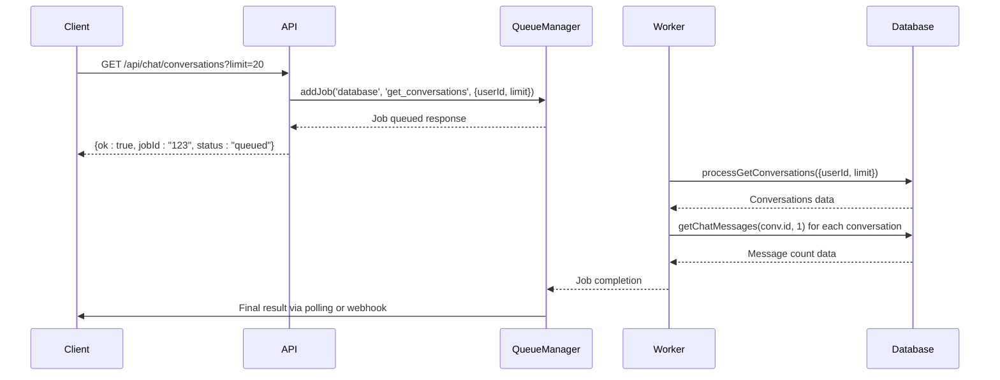
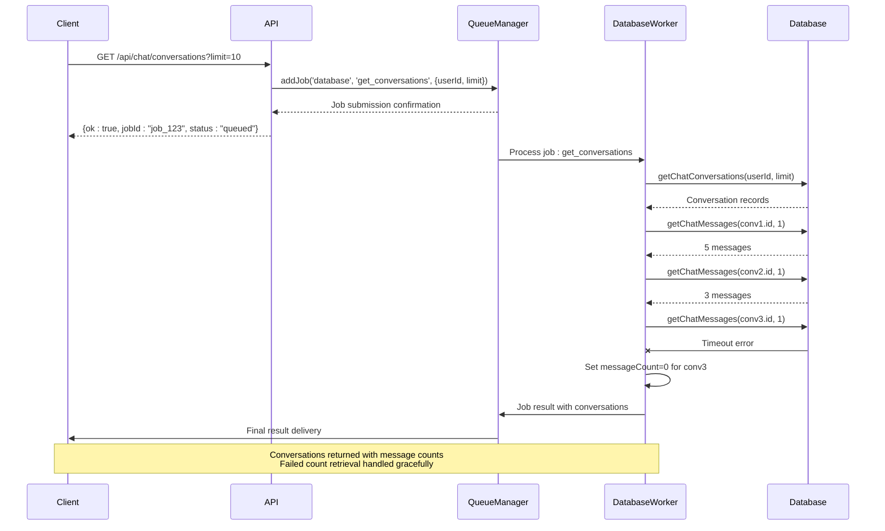

# Get Conversations Processing

<cite>
**Referenced Files in This Document**   
- [database-processor.js](file://apps/admin-api/src/lib/queues/database-processor.js)
- [queue-manager.js](file://apps/admin-api/lib/queue-manager.js)
- [database.js](file://apps/admin-api/src/lib/database.js)
- [chat.js](file://apps/admin-api/src/routes/chat.js)
</cite>

## Table of Contents
1. [Introduction](#introduction)
2. [Function Implementation](#function-implementation)
3. [Job Enqueuing Process](#job-enqueuing-process)
4. [Database Interaction](#database-interaction)
5. [Error Handling and Edge Cases](#error-handling-and-edge-cases)
6. [Performance Considerations](#performance-considerations)
7. [Metrics Collection](#metrics-collection)
8. [Sequence Diagram](#sequence-diagram)

## Introduction
The get conversations processing functionality is a critical component of the database queue system that handles asynchronous retrieval of user conversation data. This system enables efficient bulk data retrieval without blocking the main request thread, providing a responsive user experience while managing potentially large conversation sets. The processGetConversations function serves as the core implementation for retrieving user conversations, incorporating validation logic, database interaction, and comprehensive error handling.

## Function Implementation

The processGetConversations function implements the retrieval of user conversations through an asynchronous job processing system. The function accepts two parameters: userId (string) and limit (number), which specify the target user and maximum number of conversations to retrieve, respectively.

The implementation begins with debug-level logging to capture the retrieval operation, including the user ID and limit parameters. It first validates database configuration through the isConfigured() method, returning an empty conversations array if the database is unavailable rather than failing the entire operation. This graceful degradation ensures system resilience during database connectivity issues.

Upon successful validation, the function retrieves conversations via the database.getChatConversations method, then enhances each conversation with message counts through individual database.getChatMessages calls with a limit of 1 (to minimize query cost while obtaining count information). The function handles message count retrieval failures gracefully by logging warnings and assigning a messageCount of 0, ensuring that primary conversation data remains available even when count enhancement fails.

**Section sources**
- [database-processor.js](file://apps/admin-api/src/lib/queues/database-processor.js#L204-L265)

## Job Enqueuing Process

The get conversations job is enqueued through the QueueManager system, which provides a robust infrastructure for asynchronous processing. When a client requests conversation data, the system submits a job to the database queue with the appropriate job type identifier.

The enqueuing process involves calling the addJob method on the queueManager instance, specifying 'database' as the queue name and 'get_conversations' as the job type (implied by the processGetConversations handler). The job data payload includes the userId and limit parameters, along with a requestId for tracing purposes.

This asynchronous approach allows the main request thread to respond immediately with job status information while the potentially time-consuming conversation retrieval occurs in the background. The QueueManager handles job persistence, retry logic (with exponential backoff), and worker distribution, ensuring reliable processing even during temporary system failures.

**Diagram sources **
- [queue-manager.js](file://apps/admin-api/lib/queue-manager.js#L207-L223)
- [database-processor.js](file://apps/admin-api/src/lib/queues/database-processor.js#L204-L265)

**Section sources**
- [queue-manager.js](file://apps/admin-api/lib/queue-manager.js#L207-L223)
- [chat.js](file://apps/admin-api/src/routes/chat.js#L376-L388)

## Database Interaction

The processGetConversations function interacts with the database abstraction layer through two primary methods: getChatConversations and getChatMessages. The getChatConversations method retrieves the core conversation metadata including ID, title, personality mode, and timestamps, ordered by updated date in descending order to prioritize recent conversations.

The database abstraction layer uses Prisma as the ORM, providing type-safe database operations and connection pooling. The getUserConversations method (called internally by getChatConversations) leverages Prisma's include feature with _count to potentially optimize message counting, though the current implementation uses separate queries for better error isolation.

For message count enhancement, the function calls getChatMessages with a limit of 1 for each conversation, which is a performance optimization to avoid retrieving full message content while still obtaining the count. This approach trades multiple lightweight queries for a single heavy query, which can be more efficient in distributed database environments and allows for independent error handling of the count retrieval operation.

**Section sources**
- [database.js](file://apps/admin-api/src/lib/database.js#L580-L595)
- [database-processor.js](file://apps/admin-api/src/lib/queues/database-processor.js#L219-L249)

## Error Handling and Edge Cases

The get conversations processing functionality implements comprehensive error handling to ensure system reliability and data integrity. The function addresses several key edge cases:

Database connectivity issues are handled gracefully by checking the isConfigured() status before processing. If the database is unavailable, the function returns a successful response with an empty conversations array rather than propagating the error, allowing the application to continue functioning in a degraded mode.

Message count retrieval failures are isolated to individual conversations through the Promise.all() with per-conversation try-catch blocks. When a message count query fails, the system logs a warning and assigns a messageCount of 0 to that conversation, ensuring that the failure of one count retrieval doesn't affect other conversations or the primary data retrieval.

Validation is performed implicitly through the type system and explicitly through the database layer, which verifies user ownership of conversations. The function assumes authenticated context (userId) from the calling system, with ownership verification occurring at the API route level before job submission.

**Section sources**
- [database-processor.js](file://apps/admin-api/src/lib/queues/database-processor.js#L212-L217)
- [database-processor.js](file://apps/admin-api/src/lib/queues/database-processor.js#L234-L248)

## Performance Considerations

The get conversations processing system incorporates several performance optimizations to handle large conversation sets efficiently. The asynchronous job processing model prevents blocking of the main request thread, allowing the API to respond quickly with a job status while processing occurs in the background.

For large conversation sets, the system uses a two-phase retrieval approach: first fetching conversation metadata in a single query, then enhancing with message counts through parallelized individual queries. This approach can be more efficient than a single complex query with joins, particularly when message counts are not always required or when conversations have highly variable message volumes.

The database layer implements connection pooling and query instrumentation, with metrics collection for query duration and execution patterns. The QueueManager configures appropriate concurrency levels (10 for the database queue) to balance resource utilization and system stability.

Potential performance bottlenecks include the N+1 query pattern for message counts, which could be optimized through batch operations or caching strategies for frequently accessed conversation counts. The current implementation prioritizes simplicity and error isolation over maximum efficiency, accepting the trade-off of multiple lightweight queries.

**Section sources**
- [database-processor.js](file://apps/admin-api/src/lib/queues/database-processor.js#L222-L249)
- [queue-manager.js](file://apps/admin-api/lib/queue-manager.js#L84-L86)

## Metrics Collection

The system implements comprehensive metrics collection to monitor job processing performance and reliability. For each get conversations job, the system records:

- Job queuing metrics: Count of jobs entering the queue
- Job duration: Time from job processing start to completion
- Job completion status: Success and failure counts

These metrics are collected through the QueueManager's worker instrumentation, which wraps each job processing operation with timing and error tracking. The metrics.recordJobDuration, recordJobCompleted, and recordJobFailed functions are called appropriately based on job outcome, providing visibility into processing performance and reliability.

Additional metrics are collected at the database level, including query execution times and connection pool statistics, which help identify database performance bottlenecks. The combination of job-level and database-level metrics provides a comprehensive view of system performance, enabling proactive optimization and capacity planning.

The metrics system supports monitoring and alerting on key performance indicators, such as job processing latency and failure rates, ensuring that performance degradation or systemic issues can be detected and addressed promptly.

**Section sources**
- [queue-manager.js](file://apps/admin-api/lib/queue-manager.js#L116-L124)
- [database.js](file://apps/admin-api/src/lib/database.js#L27-L35)

## Sequence Diagram

**Diagram sources **
- [database-processor.js](file://apps/admin-api/src/lib/queues/database-processor.js#L204-L265)
- [queue-manager.js](file://apps/admin-api/lib/queue-manager.js#L133-L152)