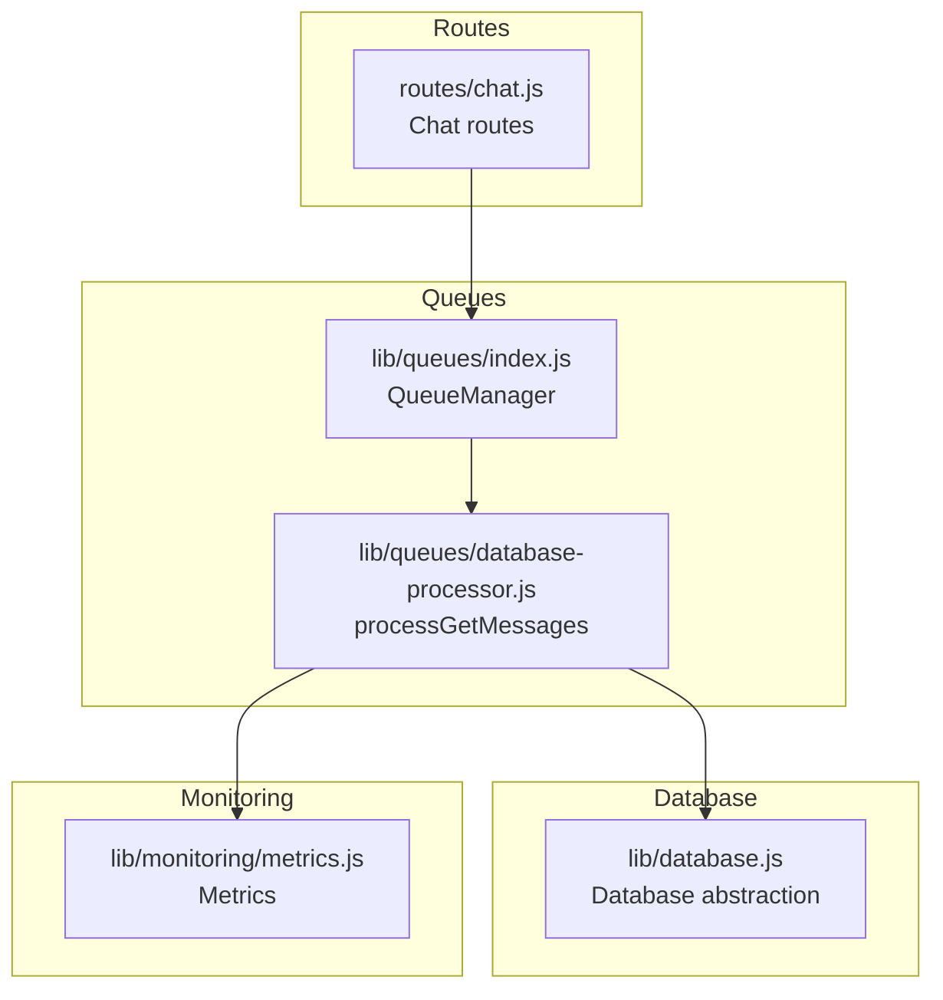
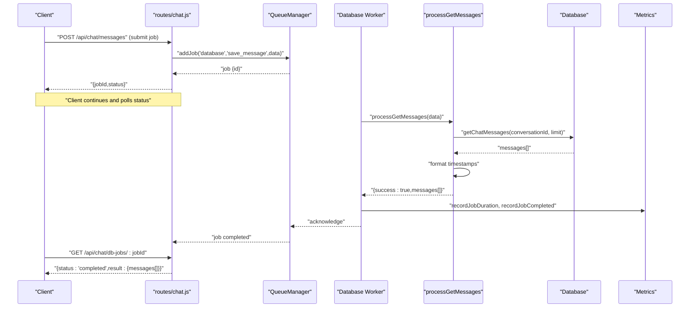
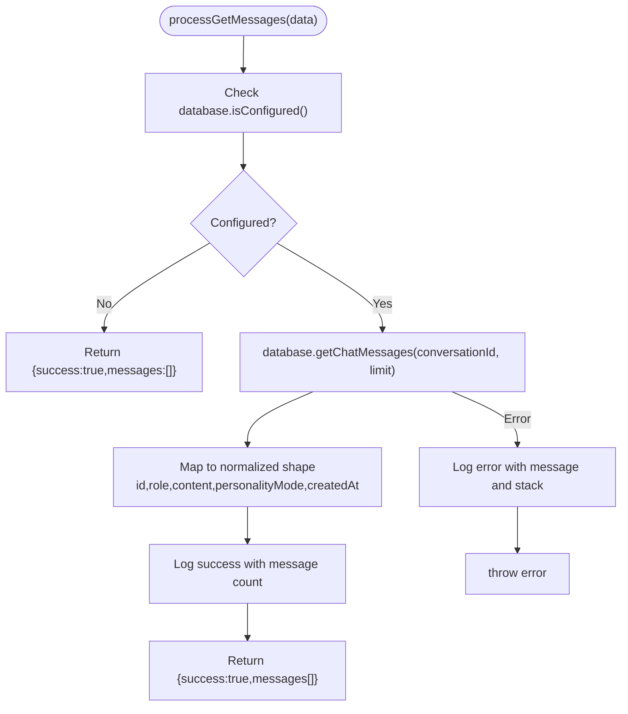
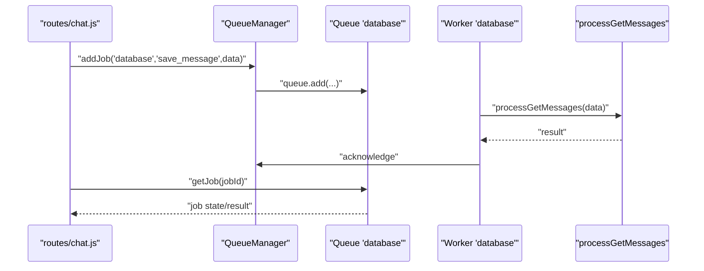
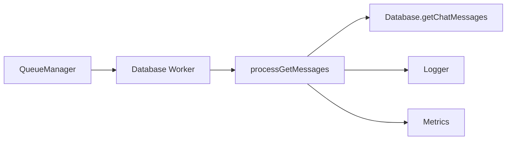

# Get Messages Processing

<cite>
**Referenced Files in This Document**
- [database-processor.js](file://apps/admin-api/src/lib/queues/database-processor.js)
- [index.js](file://apps/admin-api/src/lib/queues/index.js)
- [database.js](file://apps/admin-api/src/lib/database.js)
- [chat.js](file://apps/admin-api/src/routes/chat.js)
- [metrics.js](file://apps/admin-api/src/lib/monitoring/metrics.js)
</cite>

## Table of Contents
1. [Introduction](#introduction)
2. [Project Structure](#project-structure)
3. [Core Components](#core-components)
4. [Architecture Overview](#architecture-overview)
5. [Detailed Component Analysis](#detailed-component-analysis)
6. [Dependency Analysis](#dependency-analysis)
7. [Performance Considerations](#performance-considerations)
8. [Troubleshooting Guide](#troubleshooting-guide)
9. [Conclusion](#conclusion)

## Introduction
This document explains the get messages processing functionality within the database queue system. It focuses on the processGetMessages function, detailing its parameters, validation logic, database abstraction layer interaction, response formatting, logging behavior, and asynchronous job orchestration. It also covers how to enqueue this job via the QueueManager, common issues such as database connectivity and large message sets, error handling strategies, and metrics collection for job duration and completion.

## Project Structure
The get messages processing spans several modules:
- Route handler for chat operations that orchestrates job submission and status polling
- Queue infrastructure that manages job queues, workers, and scheduling
- Database abstraction layer that executes database queries
- Database processor that implements job-specific logic and formatting
- Metrics subsystem that records job durations and completions

**Diagram sources**
- [chat.js](file://apps/admin-api/src/routes/chat.js#L1-L657)
- [index.js](file://apps/admin-api/src/lib/queues/index.js#L1-L396)
- [database-processor.js](file://apps/admin-api/src/lib/queues/database-processor.js#L1-L324)
- [database.js](file://apps/admin-api/src/lib/database.js#L1-L680)
- [metrics.js](file://apps/admin-api/src/lib/monitoring/metrics.js#L1-L357)

**Section sources**
- [chat.js](file://apps/admin-api/src/routes/chat.js#L1-L657)
- [index.js](file://apps/admin-api/src/lib/queues/index.js#L1-L396)
- [database-processor.js](file://apps/admin-api/src/lib/queues/database-processor.js#L1-L324)
- [database.js](file://apps/admin-api/src/lib/database.js#L1-L680)
- [metrics.js](file://apps/admin-api/src/lib/monitoring/metrics.js#L1-L357)

## Core Components
- processGetMessages: Implements the database job to retrieve messages for a given conversation, validates configuration, formats timestamps, and logs at appropriate levels.
- QueueManager: Initializes Redis-backed queues, workers, and schedulers; exposes addJob and getQueue APIs; records job metrics.
- Database abstraction: Provides getChatMessages and related methods; enforces limits and includes user metadata.
- Chat routes: Enqueue database jobs and poll for results; handle access control and error mapping.
- Metrics: Tracks job queued/completed/failed counts and durations.

**Section sources**
- [database-processor.js](file://apps/admin-api/src/lib/queues/database-processor.js#L267-L314)
- [index.js](file://apps/admin-api/src/lib/queues/index.js#L107-L179)
- [database.js](file://apps/admin-api/src/lib/database.js#L544-L566)
- [chat.js](file://apps/admin-api/src/routes/chat.js#L183-L254)
- [metrics.js](file://apps/admin-api/src/lib/monitoring/metrics.js#L105-L129)

## Architecture Overview
The get messages job follows an asynchronous pipeline:
- An HTTP route enqueues a job to the database queue with parameters conversationId and limit.
- A worker picks up the job and invokes processGetMessages.
- processGetMessages checks database configuration, retrieves messages via database.getChatMessages, formats them, and returns a structured result.
- QueueManager records job duration and completion/failure metrics.
- The client polls the database job status endpoint until completion.

**Diagram sources**
- [chat.js](file://apps/admin-api/src/routes/chat.js#L584-L637)
- [index.js](file://apps/admin-api/src/lib/queues/index.js#L132-L151)
- [database-processor.js](file://apps/admin-api/src/lib/queues/database-processor.js#L267-L314)
- [database.js](file://apps/admin-api/src/lib/database.js#L544-L566)
- [metrics.js](file://apps/admin-api/src/lib/monitoring/metrics.js#L105-L129)

## Detailed Component Analysis

### processGetMessages Implementation
- Parameters:
  - conversationId: identifies the conversation whose messages to retrieve
  - limit: maximum number of messages to fetch
- Validation logic:
  - Checks database configuration; if not configured, returns success with empty messages to avoid blocking the caller.
- Database interaction:
  - Calls database.getChatMessages(conversationId, limit) to fetch messages.
- Response formatting:
  - Maps raw rows to a normalized shape with id, role, content, personalityMode, and ISO-formatted createdAt.
- Logging:
  - Logs at debug level on success with message count.
  - Logs at error level on failure with error message and stack.
- Error handling:
  - Catches exceptions and rethrows them; upstream workers will record failure metrics.

**Diagram sources**
- [database-processor.js](file://apps/admin-api/src/lib/queues/database-processor.js#L275-L314)

**Section sources**
- [database-processor.js](file://apps/admin-api/src/lib/queues/database-processor.js#L275-L314)

### Database Abstraction Layer Interaction
- Method signature: getChatMessages(conversationId, limit)
- Behavior:
  - Executes a database query to fetch messages for the specified conversation.
  - Orders by creation time descending.
  - Applies a reasonable limit to protect performance.
- Timestamp handling:
  - Returns native date objects; processGetMessages converts to ISO strings for JSON serialization.

**Section sources**
- [database.js](file://apps/admin-api/src/lib/database.js#L544-L566)
- [database-processor.js](file://apps/admin-api/src/lib/queues/database-processor.js#L289-L300)

### QueueManager Integration and Job Enqueueing
- Enqueueing:
  - The chat routes demonstrate how to enqueue database jobs using queueManager.addJob('database', '<jobType>', data).
  - The database queue worker is configured with concurrency 10 and exponential backoff.
- Status polling:
  - Clients poll GET /api/chat/db-jobs/:jobId to check job status and retrieve results upon completion.

**Diagram sources**
- [chat.js](file://apps/admin-api/src/routes/chat.js#L584-L637)
- [index.js](file://apps/admin-api/src/lib/queues/index.js#L132-L151)
- [database-processor.js](file://apps/admin-api/src/lib/queues/database-processor.js#L267-L314)

**Section sources**
- [chat.js](file://apps/admin-api/src/routes/chat.js#L584-L637)
- [index.js](file://apps/admin-api/src/lib/queues/index.js#L81-L105)
- [index.js](file://apps/admin-api/src/lib/queues/index.js#L132-L151)

### Practical Example: Enqueueing a Get Messages Job
- Typical flow:
  - Client submits a request to enqueue a database job (e.g., for conversation retrieval).
  - The route calls queueManager.addJob('database', '<jobType>', data).
  - The client stores the returned jobId and polls GET /api/chat/db-jobs/:jobId until status is completed.
- Notes:
  - The job type for message retrieval is defined in the database processor; the route demonstrates the enqueue pattern used elsewhere in the codebase.

**Section sources**
- [chat.js](file://apps/admin-api/src/routes/chat.js#L584-L637)
- [index.js](file://apps/admin-api/src/lib/queues/index.js#L204-L223)

### Error Handling Strategy
- Partial failures:
  - processGetMessages throws on error; upstream workers record failure metrics and may retry according to queue configuration.
- Graceful degradation:
  - If the database is not configured, processGetMessages returns success with empty messages to avoid blocking callers.
- Ownership and availability checks:
  - Routes enforce queue availability and job ownership before returning results.

**Section sources**
- [database-processor.js](file://apps/admin-api/src/lib/queues/database-processor.js#L282-L314)
- [chat.js](file://apps/admin-api/src/routes/chat.js#L183-L254)
- [index.js](file://apps/admin-api/src/lib/queues/index.js#L132-L151)

### Metrics Collection for Job Duration and Completion
- Recording:
  - Workers measure job duration and call metrics.recordJobDuration(queueName, durationMs) and metrics.recordJobCompleted(queueName) or metrics.recordJobFailed(queueName).
- Snapshot:
  - Metrics module exposes helpers to compute success rates, average duration, and throughput for each queue.

**Section sources**
- [index.js](file://apps/admin-api/src/lib/queues/index.js#L132-L151)
- [metrics.js](file://apps/admin-api/src/lib/monitoring/metrics.js#L105-L129)
- [metrics.js](file://apps/admin-api/src/lib/monitoring/metrics.js#L177-L204)

## Dependency Analysis
- processGetMessages depends on:
  - database abstraction for data access
  - logger for structured logs
  - metrics for job duration and completion tracking
- QueueManager coordinates:
  - Queue creation with default job options (attempts, backoff)
  - Worker initialization for the database queue
  - Metrics recording during job execution

**Diagram sources**
- [database-processor.js](file://apps/admin-api/src/lib/queues/database-processor.js#L267-L314)
- [index.js](file://apps/admin-api/src/lib/queues/index.js#L132-L151)
- [database.js](file://apps/admin-api/src/lib/database.js#L544-L566)
- [metrics.js](file://apps/admin-api/src/lib/monitoring/metrics.js#L105-L129)

**Section sources**
- [database-processor.js](file://apps/admin-api/src/lib/queues/database-processor.js#L267-L314)
- [index.js](file://apps/admin-api/src/lib/queues/index.js#L132-L151)
- [database.js](file://apps/admin-api/src/lib/database.js#L544-L566)
- [metrics.js](file://apps/admin-api/src/lib/monitoring/metrics.js#L105-L129)

## Performance Considerations
- Large message sets:
  - The database abstraction applies a maximum limit to protect query performance.
  - processGetMessages formats timestamps; consider pagination or streaming if very large histories are expected.
- Concurrency:
  - The database queue worker runs with higher concurrency to process multiple jobs efficiently.
- Retries and backoff:
  - Jobs are retried with exponential backoff to mitigate transient failures.

**Section sources**
- [database.js](file://apps/admin-api/src/lib/database.js#L544-L566)
- [index.js](file://apps/admin-api/src/lib/queues/index.js#L81-L105)
- [index.js](file://apps/admin-api/src/lib/queues/index.js#L132-L151)

## Troubleshooting Guide
- Database connectivity problems:
  - Symptoms: Jobs fail immediately or routes return empty results when database is not configured.
  - Actions: Verify database initialization and connection; check QueueManager Redis connectivity; review logs for initialization errors.
- Long-running jobs:
  - Symptoms: High latency for message retrieval; clients may need to wait.
  - Actions: Monitor job metrics; consider increasing database queue concurrency; optimize queries; paginate results.
- Ownership and availability errors:
  - Symptoms: 403 or 503 responses when checking job status.
  - Actions: Ensure queueManager.isInitialized is true; verify job ownership; confirm job exists.

**Section sources**
- [database-processor.js](file://apps/admin-api/src/lib/queues/database-processor.js#L282-L314)
- [chat.js](file://apps/admin-api/src/routes/chat.js#L183-L254)
- [index.js](file://apps/admin-api/src/lib/queues/index.js#L42-L76)

## Conclusion
The get messages processing pipeline leverages a robust queue system to asynchronously retrieve and format conversation messages. processGetMessages encapsulates validation, database access, response shaping, and logging, while QueueManager and metrics ensure reliability and observability. By following the enqueue and status polling patterns demonstrated in the routes, applications can efficiently handle large message histories without compromising system responsiveness.