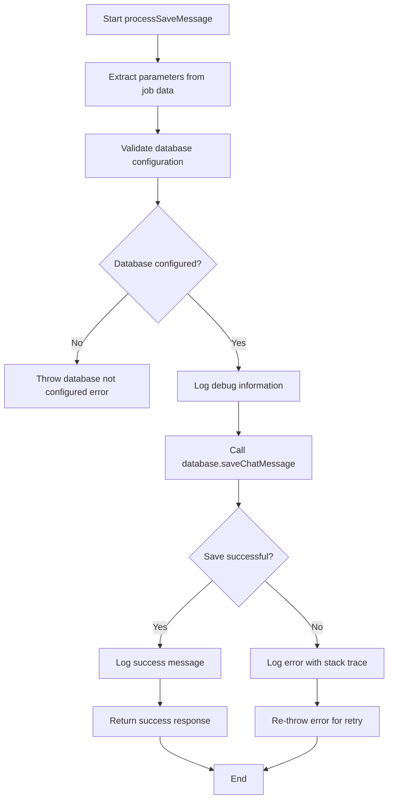
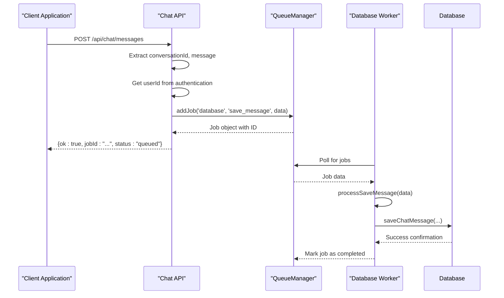
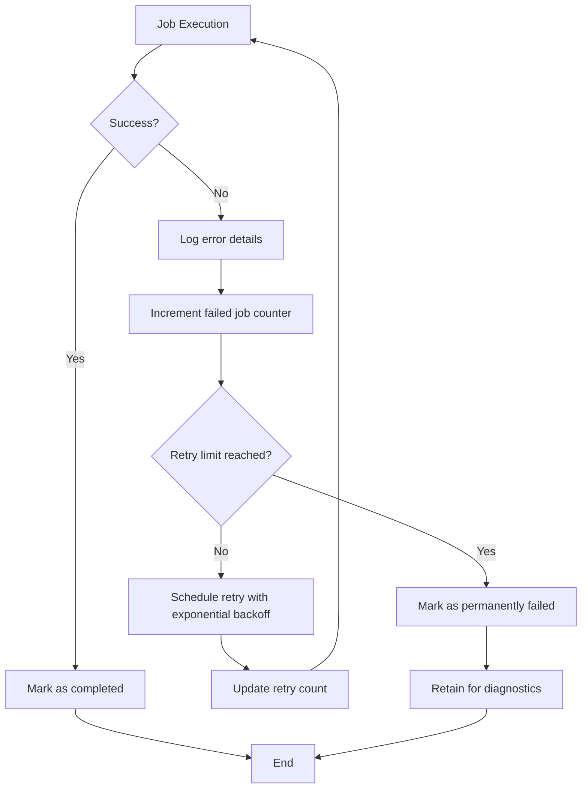
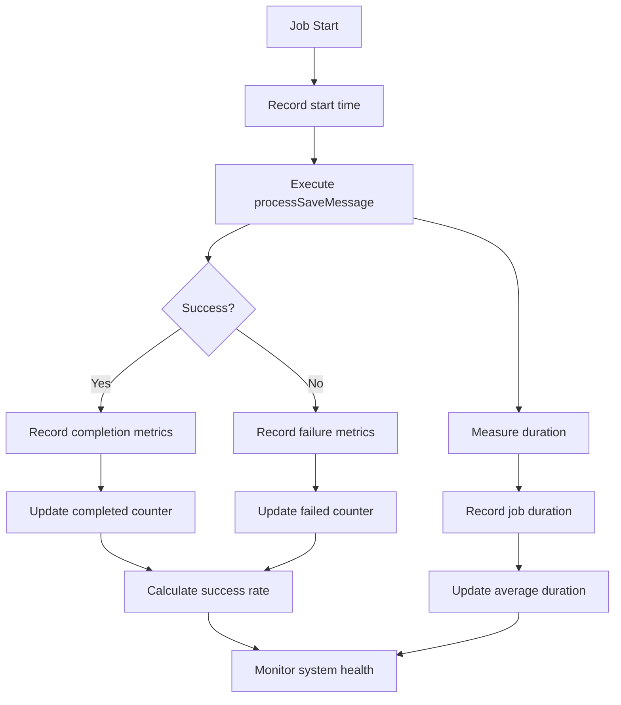
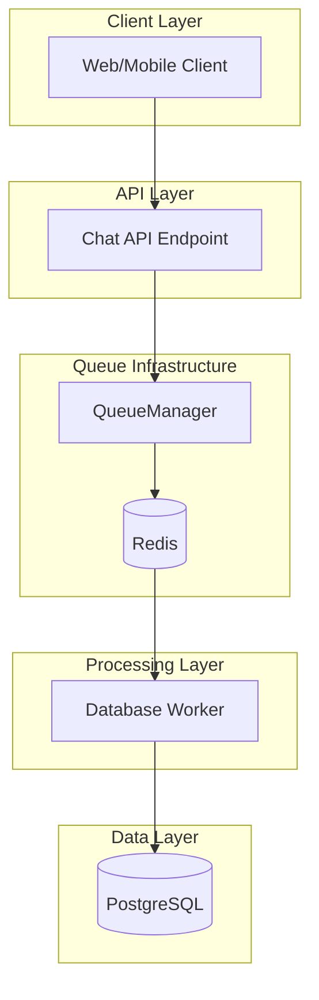

# Save Message Processing

<cite>
**Referenced Files in This Document**   
- [database-processor.js](file://apps/admin-api/src/lib/queues/database-processor.js)
- [index.js](file://apps/admin-api/src/lib/queues/index.js)
- [database.js](file://apps/admin-api/src/lib/database.js)
- [chat.js](file://apps/admin-api/src/routes/chat.js)
</cite>

## Table of Contents
1. [Introduction](#introduction)
2. [Core Functionality](#core-functionality)
3. [Function Implementation](#function-implementation)
4. [Job Enqueuing Process](#job-enqueuing-process)
5. [Error Handling and Retry Mechanism](#error-handling-and-retry-mechanism)
6. [Metrics Collection](#metrics-collection)
7. [Database Abstraction Layer](#database-abstraction-layer)
8. [System Architecture](#system-architecture)
9. [Common Issues and Troubleshooting](#common-issues-and-troubleshooting)
10. [Conclusion](#conclusion)

## Introduction

The save message processing functionality within the database queue system provides asynchronous message persistence for chat conversations. This system enables high-throughput message handling while maintaining system responsiveness by decoupling message saving operations from the main request-response cycle. The implementation leverages a job queue architecture with Redis as the message broker and BullMQ for job management, ensuring reliable message persistence even under heavy load or temporary database connectivity issues.

**Section sources**
- [database-processor.js](file://apps/admin-api/src/lib/queues/database-processor.js#L75-L113)
- [index.js](file://apps/admin-api/src/lib/queues/index.js#L184-L194)

## Core Functionality

The save message processing system handles the persistence of chat messages to the database through an asynchronous job queue. When a user sends a message, it is not saved directly to the database within the HTTP request cycle. Instead, a job is created and added to the database queue, which is processed independently by a worker. This approach ensures that the user receives a quick response while the message is reliably stored in the background.

The system processes messages with the following parameters:
- conversationId: Unique identifier for the conversation
- userId: Identifier of the user sending the message
- role: Message role (user or assistant)
- content: The actual message content
- personalityMode: Optional personality mode used for the message

This asynchronous processing enables the system to handle high volumes of messages without blocking the main application flow, improving overall responsiveness and user experience.

**Section sources**
- [database-processor.js](file://apps/admin-api/src/lib/queues/database-processor.js#L75-L113)
- [chat.js](file://apps/admin-api/src/routes/chat.js#L617-L624)

## Function Implementation

The processSaveMessage function implements the core logic for saving messages to the database. The function begins with parameter destructuring to extract conversationId, userId, role, content, and personalityMode from the job data. It then performs validation to ensure the database is properly configured before attempting to save the message.

The function uses structured logging to record debug information at the start of the operation, including the conversation ID, user ID, role, content length, and personality mode. This logging provides visibility into message processing for monitoring and debugging purposes.

Upon successful validation, the function calls the database.saveChatMessage method with the extracted parameters. After successful persistence, it logs a debug message confirming the operation and returns a success response with a timestamp. If any error occurs during the process, it is caught, logged with error level severity, and re-thrown to allow the queue system to handle retries.

**Diagram sources **
- [database-processor.js](file://apps/admin-api/src/lib/queues/database-processor.js#L75-L113)

**Section sources**
- [database-processor.js](file://apps/admin-api/src/lib/queues/database-processor.js#L75-L113)

## Job Enqueuing Process

The save message job is enqueued through the QueueManager when a client submits a new message via the chat API endpoint. The enqueuing process begins with an HTTP POST request to the /api/chat/messages endpoint, which includes the conversation ID and message details in the request body.

Before creating the job, the system checks if the queue infrastructure is initialized. If queues are unavailable, the system returns a 503 status code with a queues_unavailable error. Otherwise, it creates a new job with the 'save_message' type and adds it to the 'database' queue.

The job data includes all necessary message information: conversationId, userId, role, content, and personalityMode. Additionally, a requestId is included for tracing purposes, allowing requests to be tracked across the system for debugging and monitoring. The client receives an immediate response indicating the job has been queued, with the job ID included for potential status tracking.

**Diagram sources **
- [chat.js](file://apps/admin-api/src/routes/chat.js#L605-L636)
- [index.js](file://apps/admin-api/src/lib/queues/index.js#L207-L223)

**Section sources**
- [chat.js](file://apps/admin-api/src/routes/chat.js#L605-L636)

## Error Handling and Retry Mechanism

The system implements comprehensive error handling at multiple levels to ensure message persistence reliability. When the processSaveMessage function encounters an error, it logs detailed error information including the error message and stack trace, then re-throws the error to allow the queue system to handle it.

The BullMQ queue is configured with a retry mechanism that automatically attempts failed jobs up to three times. The retry strategy uses exponential backoff, starting with a 2-second delay between attempts. This approach allows transient issues like temporary database connectivity problems to resolve themselves without losing messages.

The queue configuration also includes error retention policies, keeping the last 100 failed jobs for diagnostic purposes. This enables developers to inspect failed jobs and understand the root cause of persistent issues. The combination of automatic retries and detailed error logging ensures that messages are not lost due to temporary system issues while providing visibility into problems that require attention.

**Diagram sources **
- [index.js](file://apps/admin-api/src/lib/queues/index.js#L92-L98)
- [database-processor.js](file://apps/admin-api/src/lib/queues/database-processor.js#L106-L112)

**Section sources**
- [index.js](file://apps/admin-api/src/lib/queues/index.js#L92-L98)
- [database-processor.js](file://apps/admin-api/src/lib/queues/database-processor.js#L106-L112)

## Metrics Collection

The system collects comprehensive metrics to monitor the performance and reliability of message processing. For each job, the system records the duration from start to completion, allowing analysis of processing times and identification of performance bottlenecks.

The metrics system tracks job completion status, differentiating between successfully completed jobs and failed ones. This enables calculation of success rates and error rates for the message processing system. The metrics are categorized by queue type, allowing separate analysis of database operations, chat processing, and audit logging.

These metrics are integrated with the system's monitoring infrastructure, enabling real-time dashboards and alerting. The data can be used to identify trends, such as increasing processing times or decreasing success rates, which may indicate underlying system issues that require attention.

**Diagram sources **
- [index.js](file://apps/admin-api/src/lib/queues/index.js#L117-L123)
- [metrics.js](file://apps/admin-api/src/lib/monitoring/metrics.js#L178-L193)

**Section sources**
- [index.js](file://apps/admin-api/src/lib/queues/index.js#L117-L123)
- [metrics.js](file://apps/admin-api/src/lib/monitoring/metrics.js#L178-L193)

## Database Abstraction Layer

The database abstraction layer provides a clean interface between the application logic and the underlying database. The saveChatMessage operation is implemented through the Prisma ORM, which generates type-safe database queries and handles connection management.

The database layer includes connection pooling and query instrumentation, with all database operations being monitored for performance. The system uses middleware to record query execution times, which are then reported to the metrics system for analysis.

The abstraction layer also handles database initialization and connection lifecycle management, ensuring that connections are properly established and closed. This prevents connection leaks and ensures efficient use of database resources, even under high load conditions.

**Section sources**
- [database.js](file://apps/admin-api/src/lib/database.js#L18-L39)
- [database.js](file://apps/admin-api/src/lib/database.js#L527-L543)

## System Architecture

The save message processing system follows a distributed architecture with clear separation of concerns. The system is divided into three main components: the API layer, the queue infrastructure, and the database layer.

The API layer receives incoming requests and immediately responds with a queued status, ensuring fast response times. The queue infrastructure, built on Redis and BullMQ, acts as a buffer between the API and database layers, providing reliable message storage and processing guarantees. The database layer handles the actual data persistence using Prisma ORM with PostgreSQL.

This architecture enables horizontal scaling of each component independently. Multiple API instances can handle incoming requests, multiple queue workers can process jobs in parallel, and the database can be scaled according to load requirements. The decoupled design also improves fault tolerance, as failures in one component do not immediately impact others.

**Diagram sources **
- [index.js](file://apps/admin-api/src/lib/queues/index.js#L47-L75)
- [database-processor.js](file://apps/admin-api/src/lib/queues/database-processor.js#L85-L96)

**Section sources**
- [index.js](file://apps/admin-api/src/lib/queues/index.js#L47-L75)
- [database-processor.js](file://apps/admin-api/src/lib/queues/database-processor.js#L85-L96)

## Common Issues and Troubleshooting

The most common issues with the save message processing system relate to database connectivity and configuration. Database connectivity problems can occur due to network issues, database server overload, or incorrect connection configuration. These issues are typically transient and are handled by the retry mechanism.

Content validation failures may occur if message content exceeds database constraints or contains invalid characters. These issues require client-side validation to prevent submission of invalid data.

Monitoring the job queue metrics is essential for identifying issues. A growing number of queued jobs may indicate that the worker concurrency is insufficient for the current load. High job failure rates may indicate systemic issues with the database or application logic.

The system's logging provides detailed information for troubleshooting, with debug logs for successful operations and error logs with stack traces for failures. The retained failed jobs in the queue system also provide valuable diagnostic information for persistent issues.

**Section sources**
- [database-processor.js](file://apps/admin-api/src/lib/queues/database-processor.js#L86-L88)
- [database-processor.js](file://apps/admin-api/src/lib/queues/database-processor.js#L106-L112)

## Conclusion

The save message processing functionality provides a robust and scalable solution for persisting chat messages in the database queue system. By leveraging asynchronous job processing, the system ensures high responsiveness while maintaining reliable message persistence. The implementation includes comprehensive error handling, retry mechanisms, and metrics collection to ensure system reliability and provide visibility into performance.

The architecture effectively decouples message submission from persistence, allowing the system to handle high message volumes without impacting user experience. The combination of Redis for job queuing, BullMQ for job management, and Prisma for database access creates a reliable and maintainable solution for message persistence.

Future improvements could include more sophisticated retry strategies, enhanced monitoring dashboards, and optimization of database queries for even better performance under heavy load.