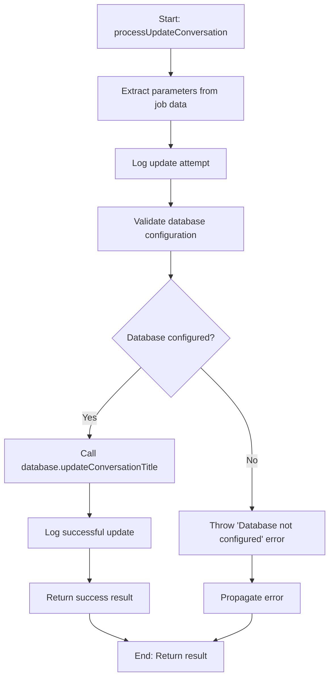
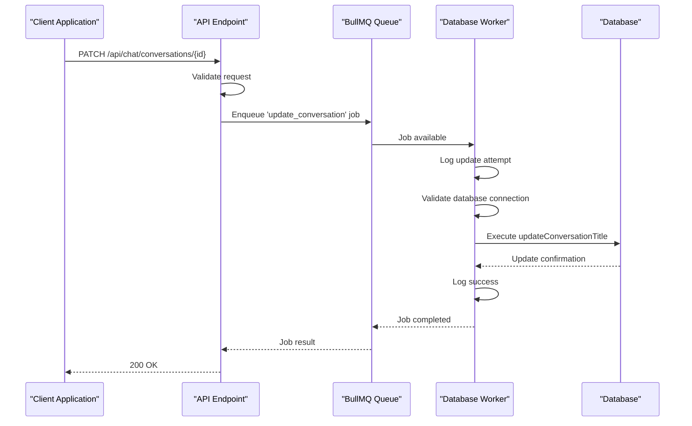
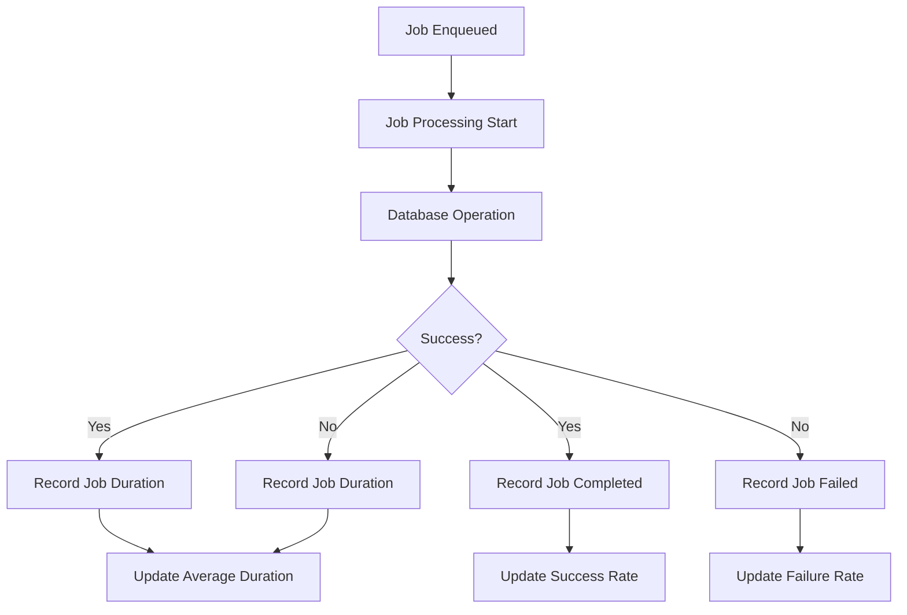

# Update Conversation Processing

<cite>
**Referenced Files in This Document**   
- [database-processor.js](file://apps/admin-api/src/lib/queues/database-processor.js)
- [index.js](file://apps/admin-api/src/lib/queues/index.js)
- [chat.js](file://apps/admin-api/src/routes/chat.js)
- [database.js](file://apps/admin-api/lib/database.js)
- [metrics.js](file://apps/admin-api/src/lib/monitoring/metrics.js)
</cite>

## Table of Contents
1. [Introduction](#introduction)
2. [Core Functionality](#core-functionality)
3. [Implementation Details](#implementation-details)
4. [Error Handling and Authorization](#error-handling-and-authorization)
5. [Queue Configuration and Retry Mechanism](#queue-configuration-and-retry-mechanism)
6. [Metrics Collection](#metrics-collection)
7. [Practical Example](#practical-example)
8. [Conclusion](#conclusion)

## Introduction

The update conversation processing functionality within the database queue system provides a reliable, asynchronous mechanism for updating conversation titles in the application. This system leverages the BullMQ queue infrastructure to ensure that conversation updates are processed reliably even under high load conditions. The implementation follows a decoupled architecture where the HTTP request to update a conversation simply enqueues a job, which is then processed asynchronously by dedicated workers.

This documentation details the implementation of the `processUpdateConversation` function, its integration with the database abstraction layer, error handling strategies, logging mechanisms, and the overall workflow from request to completion. The system is designed to provide high availability and reliability through retry mechanisms, comprehensive monitoring, and proper error propagation.

## Core Functionality

The update conversation processing functionality centers around the `processUpdateConversation` function, which handles the asynchronous updating of conversation titles. This function is part of the database job processor module and is specifically designed to handle conversation title updates in a reliable, scalable manner.

The primary purpose of this functionality is to allow users to update the title of their conversations without blocking the main application thread. By moving this operation to a background job queue, the system can maintain responsive user interfaces while ensuring data consistency and reliability. The function accepts three parameters: `conversationId`, `userId`, and `title`, which are used to identify the conversation to update, verify ownership, and specify the new title respectively.

The processing workflow begins when a user requests to update a conversation title through the API. This request is received by the route handler, which validates the request and enqueues a job with the 'update_conversation' type. The job is then picked up by a worker process that executes the `processUpdateConversation` function, which interacts with the database to perform the update operation.

**Section sources**
- [database-processor.js](file://apps/admin-api/src/lib/queues/database-processor.js#L125-L155)
- [chat.js](file://apps/admin-api/src/routes/chat.js#L558-L579)

## Implementation Details

### Function Parameters and Validation

The `processUpdateConversation` function accepts a single data object containing three essential parameters: `conversationId`, `userId`, and `title`. These parameters are destructured from the job data when the function is executed. The function begins by logging an informational message about the update operation, including the conversation ID and a truncated version of the new title for security and logging efficiency.

Before proceeding with the database operation, the function performs a critical validation check to ensure that the database is properly configured and available. This is accomplished through the `database.isConfigured()` method, which verifies that the database connection parameters are set and the connection can be established. If the database is not configured, the function throws an error with the message "Database not configured", preventing further execution and ensuring that operations are not attempted on an unavailable database.



**Diagram sources**
- [database-processor.js](file://apps/admin-api/src/lib/queues/database-processor.js#L125-L155)

### Database Interaction

The core of the conversation update functionality lies in the interaction with the database abstraction layer through the `database.updateConversationTitle` method. This method is called with the three parameters extracted from the job data: `conversationId`, `userId`, and `title`. The database layer is responsible for executing the actual SQL operation to update the conversation title in the persistent storage.

The database abstraction layer, implemented in `database.js`, provides a promise-based interface to the MySQL database using the mysql2 library. It manages a connection pool and provides methods for executing queries, retrieving single rows, and managing transactions. The `updateConversationTitle` method (though not directly visible in the provided code) would be implemented to execute an UPDATE SQL statement that modifies the title field of a conversation record, with a WHERE clause that ensures the update only affects conversations owned by the specified user.

After successfully calling the database method, the function logs a success message indicating that the conversation was updated successfully. It then returns a result object containing a `success` flag set to true and an `updatedAt` timestamp in ISO format. This response structure provides clear feedback about the operation's outcome and when it was completed.

**Section sources**
- [database-processor.js](file://apps/admin-api/src/lib/queues/database-processor.js#L138-L145)
- [database.js](file://apps/admin-api/lib/database.js)

### Logging and Monitoring

The update conversation processing functionality includes comprehensive logging at multiple levels to facilitate monitoring, debugging, and auditing. The system uses a structured logging approach with different log levels for different types of events.

When a conversation update is initiated, the function logs an informational message using `logger.info()` that includes the conversation ID and a truncated version of the new title. This provides visibility into which conversations are being updated without exposing potentially sensitive or lengthy title content in the logs. If the update operation completes successfully, another informational message is logged to confirm the successful update.

In the event of a failure, the system logs an error message using `logger.error()` that includes detailed information about the error. This includes the error message itself, the user ID attempting the update, and the stack trace. This comprehensive error logging enables developers to quickly diagnose and resolve issues when conversation updates fail.



**Diagram sources**
- [database-processor.js](file://apps/admin-api/src/lib/queues/database-processor.js#L128-L141)
- [database-processor.js](file://apps/admin-api/src/lib/queues/database-processor.js#L148-L153)

## Error Handling and Authorization

### Error Propagation

The update conversation processing system implements a robust error handling strategy that ensures errors are properly captured, logged, and propagated back to the calling system. When an error occurs during the conversation update process, it is caught by the try-catch block in the `processUpdateConversation` function and re-thrown after being logged.

The error handling follows a fail-fast principle, where any issue that prevents the successful completion of the update operation results in the error being propagated up the call stack. This includes database connectivity issues, authorization failures, and any other exceptions that might occur during the execution of the database operation. By re-throwing the error after logging it, the system ensures that the job queue infrastructure is aware of the failure and can handle it according to the configured retry policies.

The error objects include comprehensive details such as the error message, the user ID involved, and the stack trace, which are invaluable for debugging and troubleshooting. This detailed error information is captured in the application logs and can also be exposed through monitoring and alerting systems to notify developers of issues that require attention.

### Authorization Checks

Authorization is a critical aspect of the conversation update functionality, ensuring that users can only update conversations they own. The authorization mechanism is implemented at the database layer through the `updateConversationTitle` method, which accepts both the `conversationId` and `userId` parameters.

When the database layer receives these parameters, it constructs a SQL query that includes a WHERE clause to verify that the conversation being updated belongs to the user making the request. This prevents users from modifying conversations owned by other users, even if they know the conversation ID. If the database query affects zero rows (indicating no matching conversation was found for that user), the database layer throws an error with the message "Conversation not found or access denied".

This error is then propagated through the processing chain and ultimately results in a 404 response to the client, indicating that the conversation was not found or the user does not have access to it. This approach ensures that unauthorized access attempts are handled gracefully without exposing information about the existence of conversations owned by other users.

**Section sources**
- [database-processor.js](file://apps/admin-api/src/lib/queues/database-processor.js#L147-L154)
- [chat.js](file://apps/admin-api/src/routes/chat.js#L572-L579)

## Queue Configuration and Retry Mechanism

### BullMQ Queue Configuration

The update conversation processing functionality is integrated with the BullMQ queue system, which provides reliable job queuing and processing capabilities. The database queue, which handles conversation updates, is configured with specific parameters to ensure optimal performance and reliability.

According to the queue configuration in the `QueueManager` class, the database queue has a concurrency of 10, meaning that up to 10 jobs can be processed simultaneously. This allows the system to handle multiple conversation updates in parallel, improving throughput under high load conditions. The queue is also configured with retry logic, allowing failed jobs to be automatically retried.

The queue configuration includes settings for job retention, with completed jobs kept for the last 50 executions and failed jobs retained for the last 100 executions. This provides a historical record of job processing for monitoring and debugging purposes while preventing unbounded growth of job data in Redis.

### Retry Mechanism

The retry mechanism is a crucial component of the update conversation processing system, ensuring reliability in the face of transient failures. When a conversation update job fails, the BullMQ infrastructure automatically retries the job according to the configured retry policy.

The retry policy is configured with three attempts and an exponential backoff strategy, starting with a 2-second delay between retries. This means that if a conversation update fails due to a temporary database connectivity issue or other transient error, the system will automatically retry the operation after 2 seconds, then after a longer delay if it fails again, up to three total attempts.

This retry mechanism is particularly valuable for handling temporary database connectivity issues, network glitches, or brief periods of high database load. By automatically retrying failed operations, the system can recover from transient issues without requiring user intervention or resulting in permanent failures.

The retry mechanism is implemented at the queue level, meaning it applies to all jobs in the database queue, including conversation updates. Each retry attempt is logged, providing visibility into retry behavior and helping to identify persistent issues that may require investigation.

**Section sources**
- [index.js](file://apps/admin-api/src/lib/queues/index.js#L82-L99)
- [database-processor.js](file://apps/admin-api/src/lib/queues/database-processor.js)

## Metrics Collection

### Job Duration and Completion Metrics

The update conversation processing system includes comprehensive metrics collection to monitor performance and reliability. The system tracks several key metrics for job processing, including job duration, completion rates, and throughput.

For each completed job, the system records the job duration by calculating the difference between the start time and completion time. This duration is then recorded using the `metrics.recordJobDuration('database', duration)` function, which aggregates timing data for the database queue. This metric is essential for monitoring system performance and identifying potential bottlenecks in the conversation update process.

The system also tracks job completion and failure rates through the `recordJobCompleted('database')` and `recordJobFailed('database')` functions. These counters provide insight into the reliability of the conversation update functionality and can help identify trends in job failures that may indicate underlying issues.



**Diagram sources**
- [index.js](file://apps/admin-api/src/lib/queues/index.js#L138-L144)
- [metrics.js](file://apps/admin-api/src/lib/monitoring/metrics.js)

### Performance Monitoring

In addition to job-specific metrics, the system collects broader performance metrics that provide context for the conversation update functionality. These include system-level metrics such as memory usage, CPU usage, and request rates, which help to understand the overall health of the application.

The metrics system maintains counters for various operations, including the total number of requests, active connections, and database queries. It also tracks response times for HTTP requests, providing percentile-based metrics (p50, p95, p99) that help to understand the distribution of response times and identify outliers.

For the database queue specifically, the system tracks throughput in jobs per minute, success rate as a percentage, and average job duration. These metrics are exposed through a snapshot function that provides a comprehensive view of the system's performance and can be used for monitoring, alerting, and capacity planning.

The metrics collection is integrated with the job processing workflow, ensuring that metrics are recorded for every job regardless of outcome. This comprehensive monitoring enables proactive identification of performance issues and provides data to support optimization efforts.

**Section sources**
- [metrics.js](file://apps/admin-api/src/lib/monitoring/metrics.js)
- [index.js](file://apps/admin-api/src/lib/queues/index.js)

## Practical Example

### Enqueuing an Update Conversation Job

The following example demonstrates how to enqueue a conversation update job using the QueueManager. This process begins with an HTTP request to the PATCH /api/chat/conversations/{conversationId} endpoint, which is handled by the route defined in chat.js.

When the route receives a valid request, it calls the `queueManager.addJob` method to enqueue a new job in the 'database' queue with the type 'update_conversation'. The job data includes the conversationId, userId, and the new title to be applied. The queue manager assigns a unique job ID to the enqueued job, which can be used to track the job's status and retrieve the result when processing is complete.

```javascript
// Example of enqueuing an update conversation job
const job = await queueManager.addJob('database', 'update_conversation', {
  conversationId: 'conv_12345',
  userId: 'user_67890',
  title: 'Updated Conversation Title',
  requestId: 'req_98765'
});
```

The client application can then use the returned job ID to poll the /api/chat/db-jobs/{jobId} endpoint to check the status of the update operation. This asynchronous pattern allows the client to provide feedback to the user while the update is being processed in the background.

The practical implementation ensures that even if the database is temporarily unavailable or under heavy load, the job is safely stored in the Redis-backed queue and will be processed when resources become available. This decoupling between the request and processing phases provides resilience against temporary failures and ensures that conversation updates are eventually processed.

**Section sources**
- [chat.js](file://apps/admin-api/src/routes/chat.js#L558-L579)
- [index.js](file://apps/admin-api/src/lib/queues/index.js#L207-L223)

## Conclusion

The update conversation processing functionality within the database queue system provides a robust, reliable mechanism for updating conversation titles in the application. By leveraging the BullMQ queue infrastructure, the system achieves high availability and resilience, ensuring that conversation updates are processed successfully even under high load conditions or temporary failures.

The implementation follows a clean, modular architecture with clear separation of concerns between the API layer, queue system, and database abstraction. The `processUpdateConversation` function serves as the core processing unit, handling validation, database interaction, logging, and error propagation in a structured manner.

Key strengths of the system include its comprehensive error handling with proper authorization checks, detailed logging for monitoring and debugging, and automatic retry mechanisms for handling transient failures. The integration with the metrics collection system provides valuable insights into performance and reliability, enabling proactive monitoring and optimization.

The asynchronous processing pattern decouples the user interface from the database operation, providing a responsive user experience while ensuring data consistency and reliability. This architecture is well-suited for handling the variable load patterns typical of chat applications, where bursts of conversation updates may occur during periods of high user activity.

Overall, the update conversation processing system exemplifies best practices in building reliable, scalable backend services with proper error handling, monitoring, and resilience to failures.