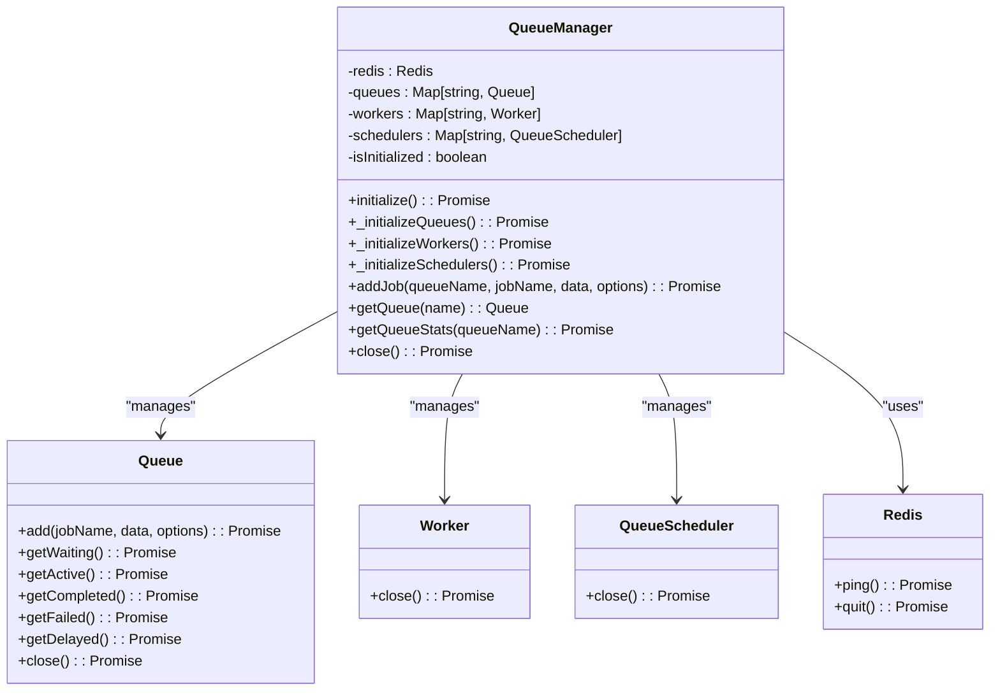
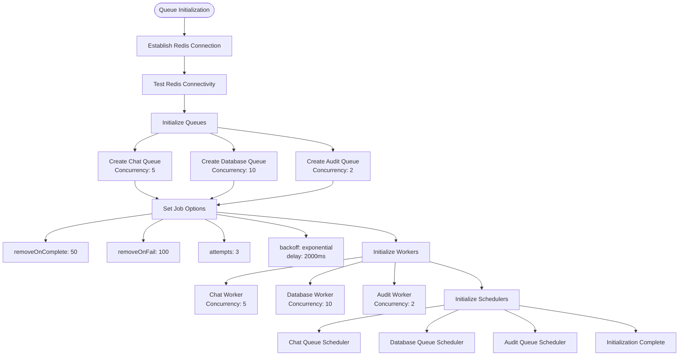
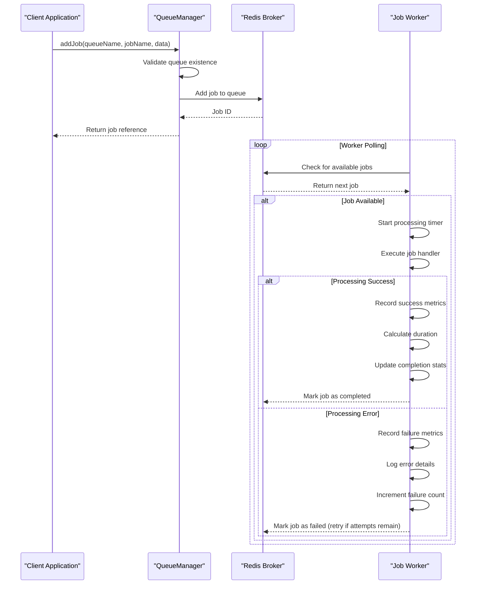
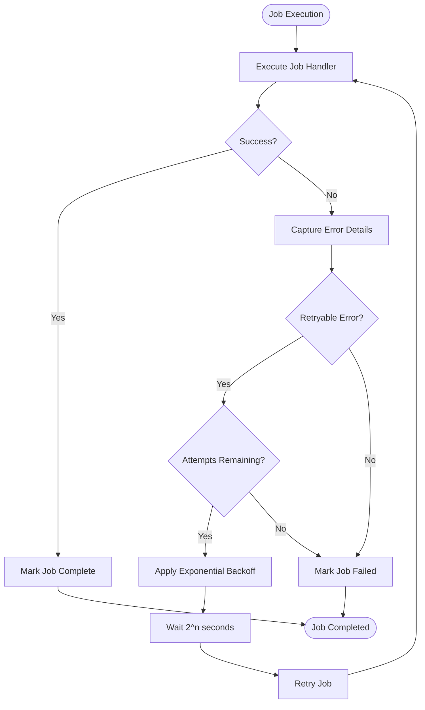
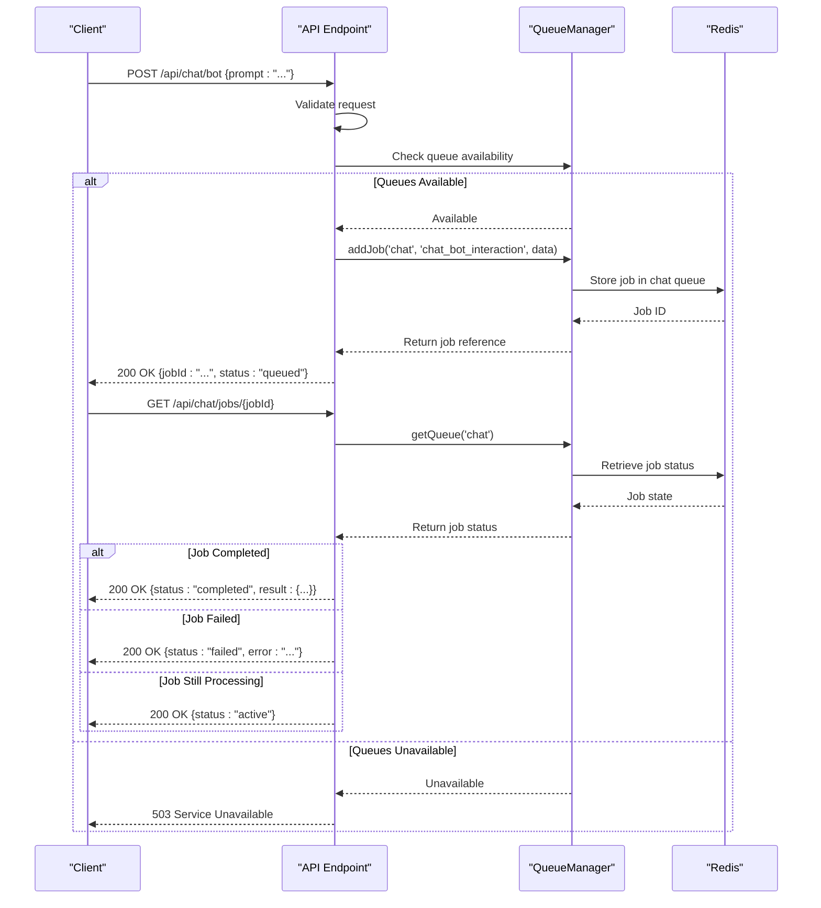
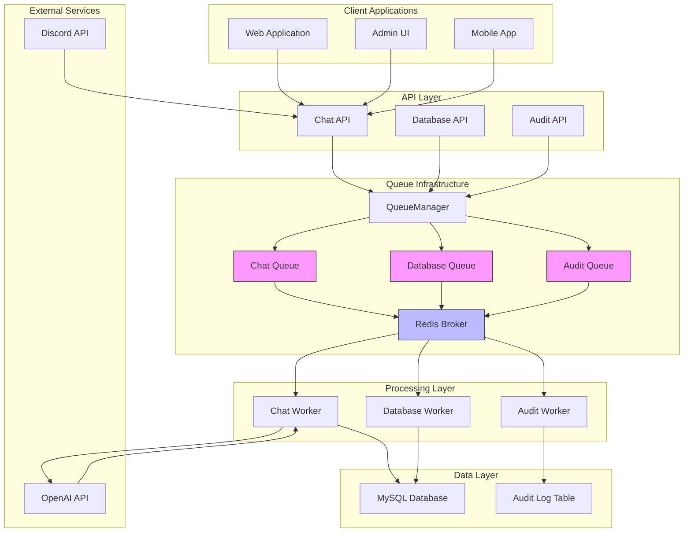
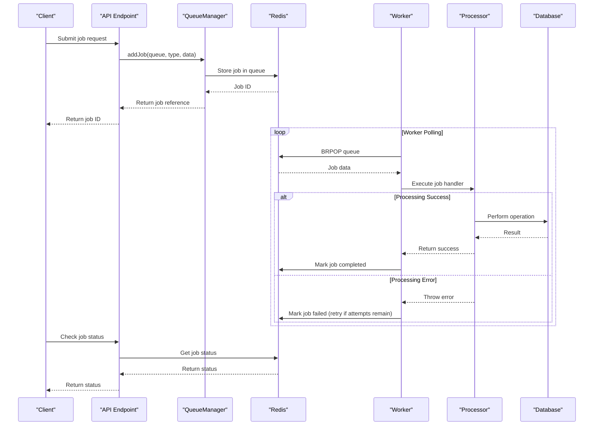
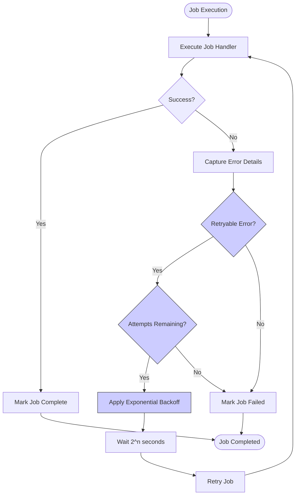

# Event-Driven Flow

<cite>
**Referenced Files in This Document**   
- [index.js](file://apps/admin-api/src/lib/queues/index.js)
- [chat-processor.js](file://apps/admin-api/src/lib/queues/chat-processor.js)
- [database-processor.js](file://apps/admin-api/src/lib/queues/database-processor.js)
- [audit-processor.js](file://apps/admin-api/src/lib/queues/audit-processor.js)
- [chat.js](file://apps/admin-api/src/routes/chat.js)
- [config/index.js](file://apps/admin-api/src/lib/config/index.js)
- [metrics.js](file://apps/admin-api/src/lib/monitoring/metrics.js)
</cite>

## Table of Contents
1. [Introduction](#introduction)
2. [Queue Manager Architecture](#queue-manager-architecture)
3. [Queue Configuration and Initialization](#queue-configuration-and-initialization)
4. [Job Processing Workflow](#job-processing-workflow)
5. [Queue-Specific Implementations](#queue-specific-implementations)
6. [Error Handling and Retry Mechanisms](#error-handling-and-retry-mechanisms)
7. [Job Lifecycle and Cleanup](#job-lifecycle-and-cleanup)
8. [Service Integration and Job Emission](#service-integration-and-job-emission)
9. [Monitoring and Metrics](#monitoring-and-metrics)
10. [System Architecture Diagram](#system-architecture-diagram)
11. [Job Processing Sequence Diagram](#job-processing-sequence-diagram)
12. [Error Recovery Flowchart](#error-recovery-flowchart)

## Introduction

The slimy-monorepo platform implements an event-driven data flow architecture using BullMQ for background job processing. This system enables asynchronous handling of computationally intensive tasks such as chat processing, database operations, and audit logging, ensuring responsive user experiences while maintaining system reliability. The architecture centers around the QueueManager class, which orchestrates three primary queues: chat, database, and audit. Each queue processes specific types of jobs with tailored concurrency, retry, and cleanup configurations. Redis serves as the message broker, providing persistent storage for job data and enabling reliable message delivery across distributed components. This documentation details the implementation, configuration, and operational characteristics of this event-driven system.

**Section sources**
- [index.js](file://apps/admin-api/src/lib/queues/index.js)

## Queue Manager Architecture

The QueueManager class serves as the central orchestrator for all background job processing in the slimy-monorepo platform. Implemented as a singleton, it manages the lifecycle of queues, workers, and schedulers through a comprehensive initialization process. The architecture follows a layered approach with clear separation between job queuing, processing, and monitoring components. The manager maintains references to Redis connections, queue instances, worker processes, and scheduler services, ensuring coordinated operation across all job types. During initialization, the manager establishes a connection to Redis, creates the required queues with standardized job options, initializes workers with appropriate concurrency settings, and sets up queue schedulers for enhanced reliability. This centralized management approach provides a unified interface for job submission, status monitoring, and system shutdown.

**Diagram sources **
- [index.js](file://apps/admin-api/src/lib/queues/index.js#L30-L387)

**Section sources**
- [index.js](file://apps/admin-api/src/lib/queues/index.js#L30-L387)

## Queue Configuration and Initialization

The queue infrastructure is initialized with three distinct queues—chat, database, and audit—each configured with specific concurrency levels and job processing options. The initialization process begins with establishing a Redis connection using configuration parameters from the environment. The chat queue is configured with a concurrency of 5, allowing up to five chat-related jobs to be processed simultaneously. The database queue, handling data persistence operations, is configured with higher concurrency of 10 to accommodate the typically faster database operations. The audit queue, responsible for logging system events, operates with lower concurrency of 2 to ensure orderly processing of audit records. All queues share common job configuration options, including automatic cleanup of completed and failed jobs, retry mechanisms with exponential backoff, and standardized error handling.

**Diagram sources **
- [index.js](file://apps/admin-api/src/lib/queues/index.js#L81-L104)
- [index.js](file://apps/admin-api/src/lib/queues/index.js#L91-L98)

**Section sources**
- [index.js](file://apps/admin-api/src/lib/queues/index.js#L81-L104)
- [config/index.js](file://apps/admin-api/src/lib/config/index.js#L219-L222)

## Job Processing Workflow

The job processing workflow follows a consistent pattern across all queue types, with specialized processing logic for each domain. When a job is submitted to a queue, it is stored in Redis and becomes available for processing by the corresponding worker. Workers continuously poll their assigned queues for new jobs, executing the appropriate processing function based on the job type. The processing workflow includes comprehensive metrics collection, error handling, and result reporting. Each worker wraps job execution in timing and error tracking code, recording duration metrics and updating job completion statistics. The workflow ensures that successful job results are returned to the caller, while failures are properly logged and propagated according to the retry configuration. This standardized processing approach provides consistent behavior across all job types while allowing for domain-specific implementation details.

**Diagram sources **
- [index.js](file://apps/admin-api/src/lib/queues/index.js#L112-L172)
- [index.js](file://apps/admin-api/src/lib/queues/index.js#L227-L313)

**Section sources**
- [index.js](file://apps/admin-api/src/lib/queues/index.js#L112-L172)
- [metrics.js](file://apps/admin-api/src/lib/monitoring/metrics.js)

## Queue-Specific Implementations

The platform implements three specialized queues, each tailored to specific operational requirements. The chat queue handles chat bot interactions, processing user messages through OpenAI integration and managing conversation state. The database queue manages all data persistence operations, including conversation creation, message saving, and conversation updates. The audit queue processes system event logging, capturing user actions and system events for compliance and monitoring purposes. Each queue has dedicated processor modules that contain the business logic for handling specific job types. The chat processor handles chat bot interactions and message validation, the database processor manages conversation lifecycle operations, and the audit processor handles event logging and compliance tasks. This specialization allows for optimized processing and error handling for each domain.

```mermaid
graph TD
subgraph "Chat Queue"
ChatJob["chat_bot_interaction"]
ValidationJob["message_validation"]
BulkJob["bulk_messages"]
end
subgraph "Database Queue"
CreateJob["create_conversation"]
SaveJob["save_message"]
UpdateJob["update_conversation"]
DeleteJob["delete_conversation"]
GetConversationsJob["get_conversations"]
GetMessagesJob["get_messages"]
end
subgraph "Audit Queue"
LogJob["log_event"]
BulkLogJob["bulk_log_events"]
CleanupJob["audit_cleanup"]
ReportJob["audit_report"]
end
ChatProcessor["chat-processor.js"] --> ChatJob
ChatProcessor --> ValidationJob
ChatProcessor --> BulkJob
DatabaseProcessor["database-processor.js"] --> CreateJob
DatabaseProcessor --> SaveJob
DatabaseProcessor --> UpdateJob
DatabaseProcessor --> DeleteJob
DatabaseProcessor --> GetConversationsJob
DatabaseProcessor --> GetMessagesJob
AuditProcessor["audit-processor.js"] --> LogJob
AuditProcessor --> BulkLogJob
AuditProcessor --> CleanupJob
AuditProcessor --> ReportJob
QueueManager["QueueManager"] --> ChatQueue
QueueManager --> DatabaseQueue
QueueManager --> AuditQueue
```

**Diagram sources **
- [chat-processor.js](file://apps/admin-api/src/lib/queues/chat-processor.js)
- [database-processor.js](file://apps/admin-api/src/lib/queues/database-processor.js)
- [audit-processor.js](file://apps/admin-api/src/lib/queues/audit-processor.js)

**Section sources**
- [chat-processor.js](file://apps/admin-api/src/lib/queues/chat-processor.js)
- [database-processor.js](file://apps/admin-api/src/lib/queues/database-processor.js)
- [audit-processor.js](file://apps/admin-api/src/lib/queues/audit-processor.js)

## Error Handling and Retry Mechanisms

The event-driven architecture implements robust error handling and retry mechanisms to ensure job reliability and system resilience. All queues are configured with three retry attempts and exponential backoff, starting with a 2-second delay between retries. This configuration allows transient failures, such as temporary network issues or service unavailability, to be automatically recovered without manual intervention. The retry mechanism follows an exponential pattern, with subsequent retry delays increasing to prevent overwhelming recovering services. Each job execution is wrapped in comprehensive error handling that captures detailed error information, logs diagnostic data, and updates monitoring metrics. For critical operations, the system distinguishes between retryable and non-retryable errors, ensuring that permanent failures are not endlessly retried. The audit queue implements special error handling that prevents audit logging failures from cascading to the primary operation, ensuring that system events are recorded even when the audit system experiences issues.

**Diagram sources **
- [index.js](file://apps/admin-api/src/lib/queues/index.js#L94-L98)
- [index.js](file://apps/admin-api/src/lib/queues/index.js#L120-L126)
- [audit-processor.js](file://apps/admin-api/src/lib/queues/audit-processor.js#L112-L125)

**Section sources**
- [index.js](file://apps/admin-api/src/lib/queues/index.js#L94-L98)
- [audit-processor.js](file://apps/admin-api/src/lib/queues/audit-processor.js#L112-L125)

## Job Lifecycle and Cleanup

The job lifecycle is managed through comprehensive configuration options that balance data retention needs with system performance. Completed jobs are automatically removed from the queue after 50 successful completions, while failed jobs are retained for up to 100 failures to facilitate debugging and analysis. This cleanup strategy prevents unbounded growth of job data in Redis while maintaining sufficient history for troubleshooting. The system provides programmatic access to job status and statistics through the getQueueStats method, which returns counts of waiting, active, completed, failed, and delayed jobs. For long-running operations, the system supports job status checking through dedicated API endpoints that allow clients to poll for job completion. The QueueManager also implements a graceful shutdown process that properly closes workers, schedulers, queues, and the Redis connection, ensuring no job data is lost during system restarts or deployments.

**Section sources**
- [index.js](file://apps/admin-api/src/lib/queues/index.js#L92-L93)
- [index.js](file://apps/admin-api/src/lib/queues/index.js#L318-L338)
- [index.js](file://apps/admin-api/src/lib/queues/index.js#L344-L385)

## Service Integration and Job Emission

Services within the platform emit jobs to queues through the QueueManager singleton, which provides a unified interface for job submission. The chat-bot service, for example, emits chat bot interaction jobs when users submit messages, passing the user's prompt, guild context, and user identification to the chat queue. Similarly, conversation management operations emit jobs to the database queue for asynchronous processing. The integration follows a consistent pattern where API endpoints validate requests and immediately return a job reference, allowing the client to poll for results asynchronously. This decoupling enables responsive user interfaces while ensuring reliable processing of background tasks. The system validates queue availability before accepting new jobs, returning appropriate error responses when the queue infrastructure is unavailable, thus maintaining system stability under load or during maintenance.

**Diagram sources **
- [chat.js](file://apps/admin-api/src/routes/chat.js#L71-L86)
- [chat.js](file://apps/admin-api/src/routes/chat.js#L137-L152)

**Section sources**
- [chat.js](file://apps/admin-api/src/routes/chat.js#L71-L86)
- [chat.js](file://apps/admin-api/src/routes/chat.js#L137-L152)

## Monitoring and Metrics

The event-driven system incorporates comprehensive monitoring and metrics collection to ensure operational visibility and performance optimization. The metrics module tracks key performance indicators for each queue, including job throughput, success rates, average processing duration, and error rates. These metrics are collected at multiple levels: request-level metrics for API endpoints, job-level metrics for queue processing, and system-level metrics for resource utilization. The monitoring system captures both successful and failed job executions, providing insights into system reliability and potential bottlenecks. Metrics are exposed through a snapshot function that provides a comprehensive overview of system health, including uptime, request volume, error rates, database performance, and memory usage. This monitoring infrastructure enables proactive issue detection, capacity planning, and performance optimization, ensuring the event-driven system operates reliably under varying loads.

**Section sources**
- [metrics.js](file://apps/admin-api/src/lib/monitoring/metrics.js)
- [index.js](file://apps/admin-api/src/lib/queues/index.js#L117-L118)

## System Architecture Diagram

**Diagram sources **
- [index.js](file://apps/admin-api/src/lib/queues/index.js)
- [chat-processor.js](file://apps/admin-api/src/lib/queues/chat-processor.js)
- [database-processor.js](file://apps/admin-api/src/lib/queues/database-processor.js)
- [audit-processor.js](file://apps/admin-api/src/lib/queues/audit-processor.js)

## Job Processing Sequence Diagram

**Diagram sources **
- [index.js](file://apps/admin-api/src/lib/queues/index.js)
- [chat-processor.js](file://apps/admin-api/src/lib/queues/chat-processor.js)

## Error Recovery Flowchart

**Diagram sources **
- [index.js](file://apps/admin-api/src/lib/queues/index.js#L94-L98)
- [index.js](file://apps/admin-api/src/lib/queues/index.js#L120-L126)