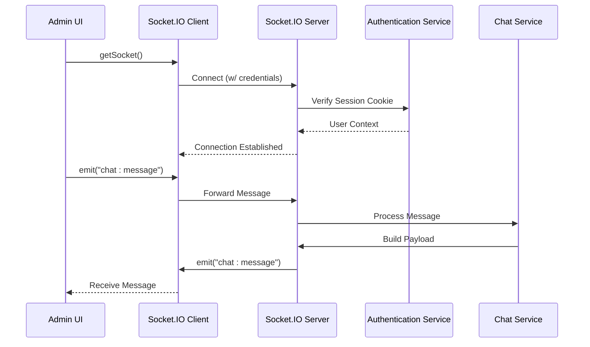
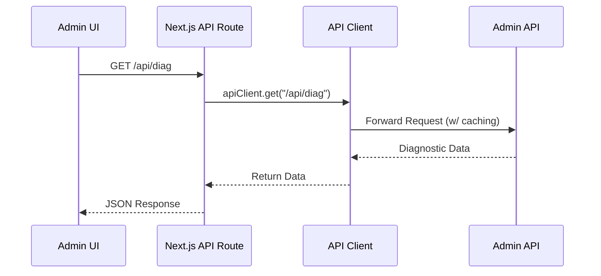
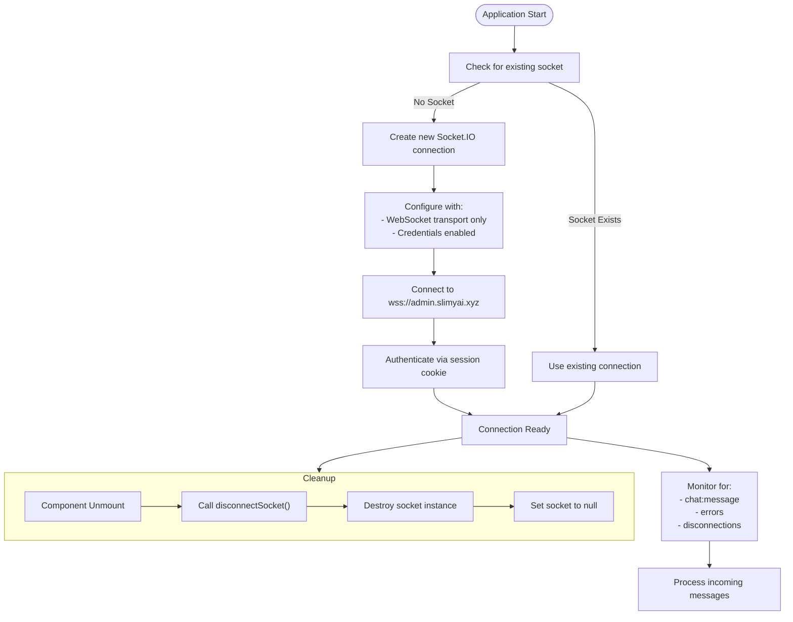
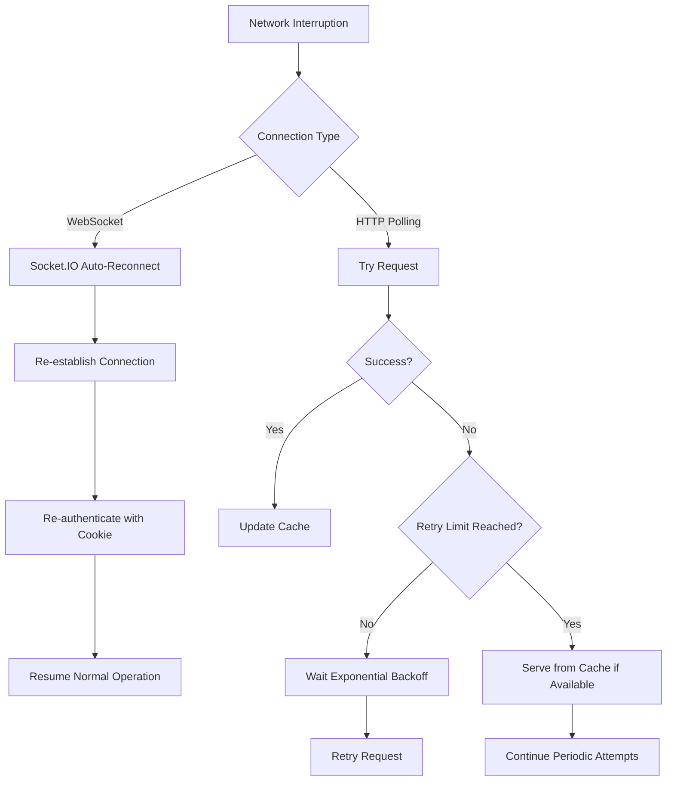
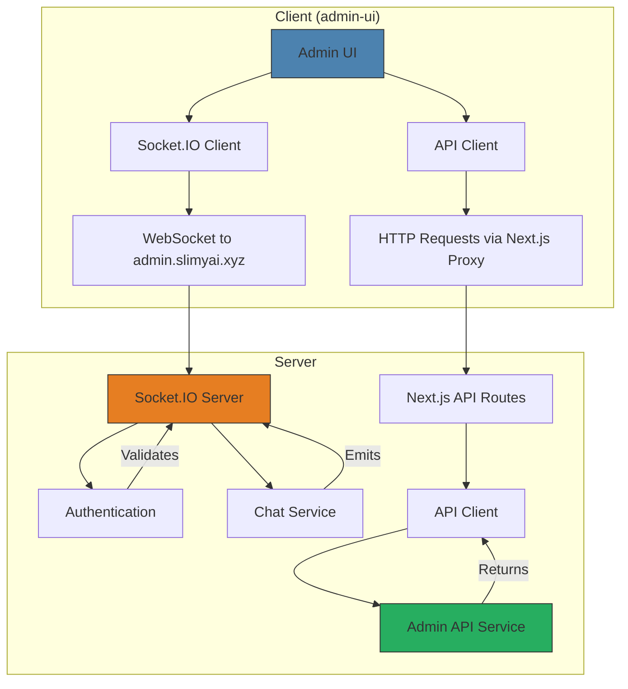

# Client-Server Communication

<cite>
**Referenced Files in This Document**   
- [socket.js](file://apps/admin-ui/lib/socket.js)
- [socket.js](file://apps/admin-api/src/socket.js)
- [route.ts](file://apps/web/app/api/diag/route.ts)
- [api-client.ts](file://apps/web/lib/api-client.ts)
- [admin-client.ts](file://apps/web/lib/api/admin-client.ts)
- [diag.js](file://apps/admin-api/src/routes/diag.js)
- [chat/index.js](file://apps/admin-ui/pages/chat/index.js)
</cite>

## Table of Contents
1. [Introduction](#introduction)
2. [WebSocket Communication](#websocket-communication)
3. [REST-Based Polling](#rest-based-polling)
4. [Communication Patterns Comparison](#communication-patterns-comparison)
5. [Connection Lifecycle Management](#connection-lifecycle-management)
6. [Error Handling and Network Resilience](#error-handling-and-network-resilience)
7. [Architecture Overview](#architecture-overview)

## Introduction
The slimy-monorepo platform implements a dual communication strategy between client and server components, combining real-time WebSocket connections for interactive features with REST-based HTTP polling for diagnostic data retrieval. This documentation details the implementation of these communication patterns, focusing on the admin-ui's real-time chat functionality using WebSockets and the periodic polling mechanism used for system diagnostics. The architecture supports both immediate, bidirectional communication for user interactions and reliable, cached data retrieval for monitoring purposes.

## WebSocket Communication

The admin-ui establishes real-time communication with the server through WebSocket connections managed by the `getSocket` and `disconnectSocket` functions in `socket.js`. This implementation enables immediate message delivery for the chat system and other interactive features requiring low-latency updates.

The client-side socket configuration specifically sets the transport to WebSocket only and enables credentials for cookie transmission, ensuring secure authentication across sessions. The server-side implementation validates JWT tokens from cookies and establishes user context before allowing message exchange.

**Diagram sources**
- [socket.js](file://apps/admin-ui/lib/socket.js#L5-L20)
- [socket.js](file://apps/admin-api/src/socket.js#L38-L203)

**Section sources**
- [socket.js](file://apps/admin-ui/lib/socket.js#L1-L21)
- [socket.js](file://apps/admin-api/src/socket.js#L1-L204)

## REST-Based Polling

The diagnostic API in `web/app/api/diag/route.ts` implements a REST-based polling mechanism for retrieving system health information. This approach uses the `apiClient` with caching configuration to periodically fetch diagnostic data from the admin-api service.

Unlike the real-time WebSocket connection, this pattern follows a request-response model where the client initiates requests at regular intervals to obtain updated diagnostic information. The implementation includes caching with a 60-second revalidation period, reducing server load while ensuring reasonably fresh data for monitoring purposes.

**Diagram sources**
- [route.ts](file://apps/web/app/api/diag/route.ts#L6-L17)
- [api-client.ts](file://apps/web/lib/api-client.ts#L384-L393)
- [diag.js](file://apps/admin-api/src/routes/diag.js#L22-L54)

**Section sources**
- [route.ts](file://apps/web/app/api/diag/route.ts#L1-L18)
- [api-client.ts](file://apps/web/lib/api-client.ts#L1-L515)

## Communication Patterns Comparison

The platform employs two distinct communication models optimized for different use cases:

### Real-Time vs. Polling Use Cases

| Feature | WebSocket Communication | REST Polling |
|-------|------------------------|-------------|
| **Latency** | Immediate (milliseconds) | Delayed (seconds/minutes) |
| **Use Case** | Interactive chat, real-time updates | System diagnostics, health checks |
| **Connection Type** | Persistent, bidirectional | Transient, request-response |
| **Authentication** | Cookie-based with credentials | Cookie-based via proxy |
| **Data Freshness** | Real-time | Cached with TTL |
| **Network Efficiency** | High for frequent updates | Efficient for infrequent checks |

### When to Use Each Pattern

**Real-time updates are preferred when:**
- User interactions require immediate feedback (chat messages)
- Multiple clients need to see updates simultaneously
- Low-latency communication is critical
- Bidirectional communication is needed

**HTTP polling is used when:**
- Data changes infrequently (system diagnostics)
- Eventual consistency is acceptable
- Simpler implementation is preferred
- Caching can significantly reduce server load

The WebSocket connection is ideal for the chat functionality where users expect immediate message delivery and presence information. In contrast, the diagnostic polling mechanism is suitable for system monitoring where data can be slightly stale and where caching improves performance without impacting user experience.

**Section sources**
- [socket.js](file://apps/admin-ui/lib/socket.js#L1-L21)
- [route.ts](file://apps/web/app/api/diag/route.ts#L1-L18)
- [chat/index.js](file://apps/admin-ui/pages/chat/index.js#L49-L72)

## Connection Lifecycle Management

The platform implements comprehensive connection lifecycle management for WebSocket connections, ensuring proper initialization, maintenance, and cleanup of real-time communication channels.

The client-side implementation uses a singleton pattern in the `getSocket` function, which creates a connection only if one doesn't already exist. This prevents multiple simultaneous connections and ensures resource efficiency. The connection is automatically cleaned up when the component unmounts through the `disconnectSocket` function called in a cleanup effect.

**Diagram sources**
- [socket.js](file://apps/admin-ui/lib/socket.js#L5-L20)
- [chat/index.js](file://apps/admin-ui/pages/chat/index.js#L72)

**Section sources**
- [socket.js](file://apps/admin-ui/lib/socket.js#L1-L21)
- [chat/index.js](file://apps/admin-ui/pages/chat/index.js#L49-L72)

## Error Handling and Network Resilience

The communication system implements robust error handling and network resilience mechanisms to maintain functionality during network interruptions and server issues.

For WebSocket connections, the Socket.IO client library provides built-in reconnection capabilities that automatically attempt to restore the connection if it is lost. The server validates authentication on each connection attempt, ensuring security is maintained during reconnection events.

The REST polling mechanism through `apiClient` includes comprehensive error handling with retry logic, timeout management, and caching fallbacks. When network issues occur, the client can serve stale cached data while continuing to attempt fresh data retrieval.

The API client implements exponential backoff with a base delay of 1 second, multiplying by 2 for each retry attempt up to a maximum of 30 seconds. This prevents overwhelming the server during outage periods while still attempting to restore connectivity.

**Diagram sources**
- [api-client.ts](file://apps/web/lib/api-client.ts#L322-L370)
- [admin-client.ts](file://apps/web/lib/api/admin-client.ts#L160-L240)

**Section sources**
- [api-client.ts](file://apps/web/lib/api-client.ts#L1-L515)
- [admin-client.ts](file://apps/web/lib/api/admin-client.ts#L1-L398)

## Architecture Overview

The client-server communication architecture in the slimy-monorepo platform is designed with clear separation of concerns between real-time and request-response communication patterns.

The architecture shows two parallel communication paths: a WebSocket path for real-time chat functionality and an HTTP path for diagnostic data retrieval. Both paths share the same authentication mechanism using session cookies but are optimized for their specific use cases. The WebSocket connection provides low-latency, bidirectional communication for interactive features, while the HTTP polling mechanism with caching provides reliable data retrieval for monitoring purposes.

**Diagram sources**
- [socket.js](file://apps/admin-ui/lib/socket.js#L1-L21)
- [socket.js](file://apps/admin-api/src/socket.js#L1-L204)
- [route.ts](file://apps/web/app/api/diag/route.ts#L1-L18)
- [api-client.ts](file://apps/web/lib/api-client.ts#L1-L515)

**Section sources**
- [socket.js](file://apps/admin-ui/lib/socket.js#L1-L21)
- [socket.js](file://apps/admin-api/src/socket.js#L1-L204)
- [route.ts](file://apps/web/app/api/diag/route.ts#L1-L18)