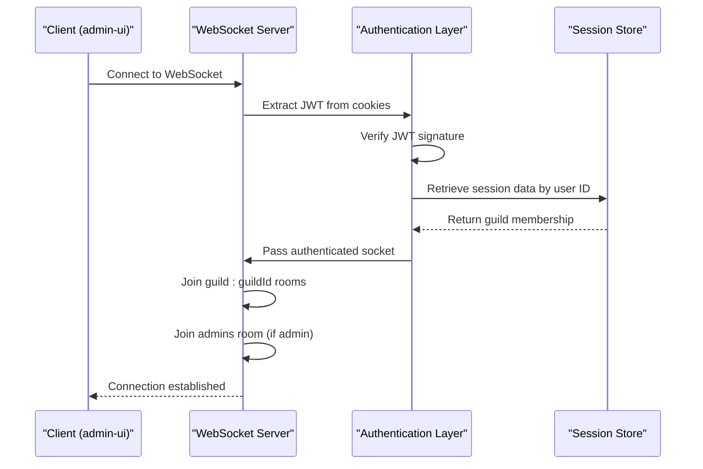
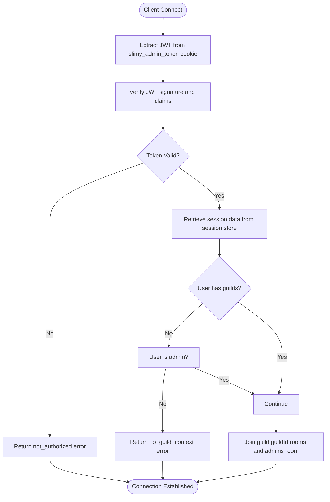
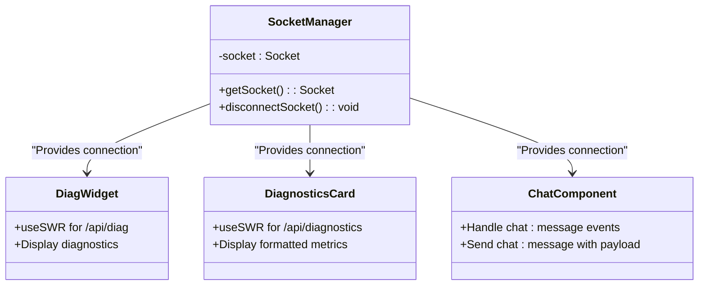
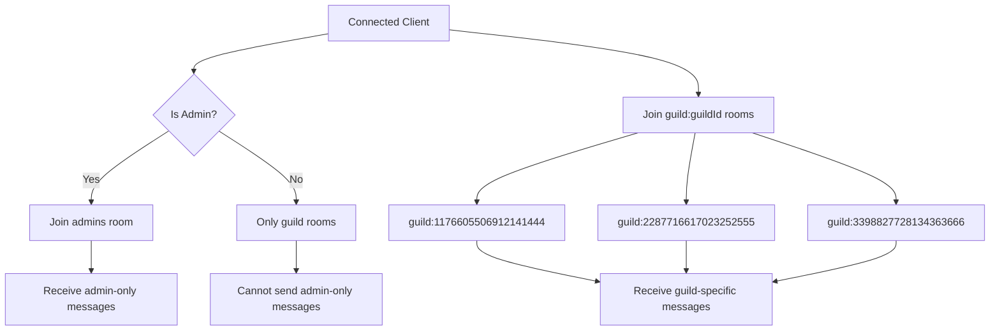
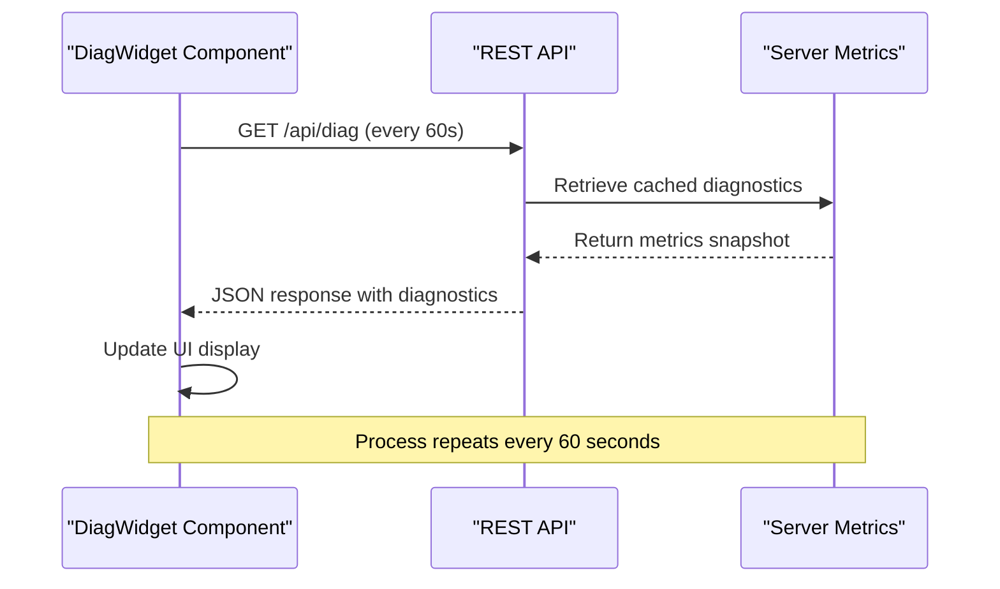
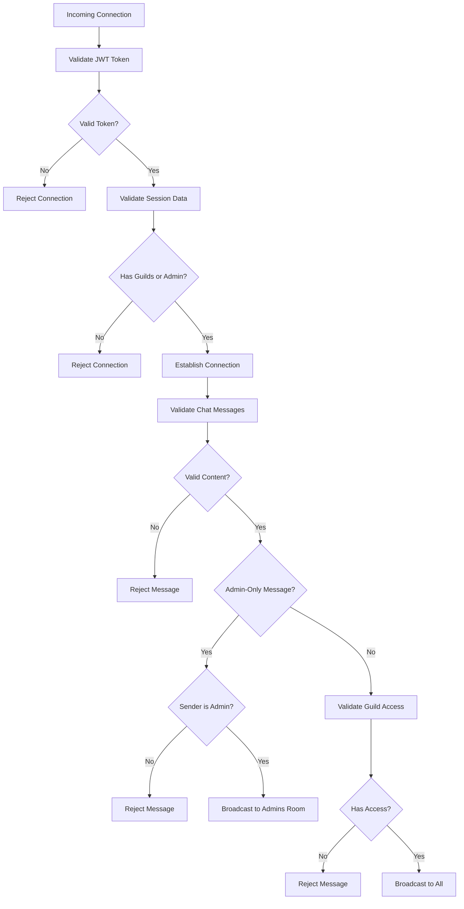
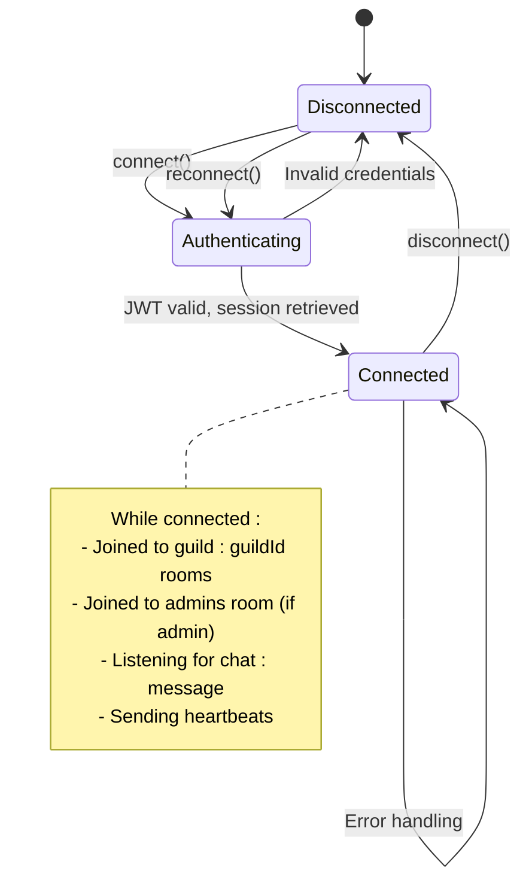

# Real-Time Communication

<cite>
**Referenced Files in This Document**   
- [socket.js](file://apps/admin-api/src/socket.js)
- [socket.js](file://apps/admin-ui/lib/socket.js)
- [jwt.js](file://apps/admin-api/lib/jwt.js)
- [session-store.js](file://apps/admin-api/lib/session-store.js)
- [metrics.js](file://apps/admin-api/src/lib/metrics.js)
- [diagnostics.js](file://apps/admin-api/src/routes/diagnostics.js)
- [DiagWidget.js](file://apps/admin-ui/components/DiagWidget.js)
- [DiagnosticsCard.jsx](file://apps/admin-ui/components/diag/DiagnosticsCard.jsx)
- [chat-bot.js](file://apps/admin-api/src/services/chat-bot.js)
- [error-handler.js](file://apps/admin-api/src/middleware/error-handler.js)
</cite>

## Table of Contents
1. [Introduction](#introduction)
2. [WebSocket Server Implementation](#websocket-server-implementation)
3. [Authentication Flow](#authentication-flow)
4. [Client-Side Connection Management](#client-side-connection-management)
5. [Message Format and Event Types](#message-format-and-event-types)
6. [Socket Rooms and Broadcasting](#socket-rooms-and-broadcasting)
7. [Real-Time Diagnostics and Log Streaming](#real-time-diagnostics-and-log-streaming)
8. [Security Considerations](#security-considerations)
9. [Connection Lifecycle Management](#connection-lifecycle-management)
10. [Error Handling](#error-handling)
11. [Conclusion](#conclusion)

## Introduction
The slimy-monorepo platform implements a real-time communication system using WebSockets via socket.io for bidirectional communication between the admin-ui and the admin-api server. This system enables real-time chat functionality, diagnostic data streaming, and log updates for administrative users. The implementation features JWT-based authentication via cookies, session validation, and namespace-based room joining for guild-specific and admin-only channels. This documentation details the architecture, implementation, and operational aspects of this real-time communication system.

## WebSocket Server Implementation

The WebSocket server is implemented in `socket.js` within the admin-api application, using socket.io to handle real-time communication. The server is initialized with CORS configuration to allow connections from the admin.slimyai.xyz domain with credentials enabled. The implementation follows a middleware-based approach for authentication and connection handling.



**Diagram sources**
- [socket.js](file://apps/admin-api/src/socket.js#L38-L204)

**Section sources**
- [socket.js](file://apps/admin-api/src/socket.js#L1-L204)

## Authentication Flow

The authentication flow begins when a client attempts to establish a WebSocket connection. The server extracts the JWT token from cookies using the `slimy_admin_token` cookie name. The token is verified using the HS256 algorithm with a secret key configured in the environment. Upon successful JWT verification, the user's session data is retrieved from the session store, which contains their guild memberships. This separation of concerns—storing authentication in JWT and authorization data in session storage—keeps the JWT size manageable while providing flexible access control.



**Diagram sources**
- [socket.js](file://apps/admin-api/src/socket.js#L46-L77)
- [jwt.js](file://apps/admin-api/lib/jwt.js#L52-L54)
- [session-store.js](file://apps/admin-api/lib/session-store.js#L41-L62)

**Section sources**
- [socket.js](file://apps/admin-api/src/socket.js#L46-L77)
- [jwt.js](file://apps/admin-api/lib/jwt.js#L52-L54)
- [session-store.js](file://apps/admin-api/lib/session-store.js#L41-L62)

## Client-Side Connection Management

The admin-ui manages WebSocket connections through a singleton pattern implemented in `socket.js`. The client uses socket.io-client with specific configuration for credentials and transports. The connection is established to the admin.slimyai.xyz domain with credentials enabled to send cookies, and restricted to WebSocket transport only. This ensures secure transmission of authentication tokens and reliable real-time communication. The singleton pattern prevents multiple simultaneous connections and provides a consistent interface for components to access the socket instance.



**Diagram sources**
- [socket.js](file://apps/admin-ui/lib/socket.js#L1-L21)
- [DiagWidget.js](file://apps/admin-ui/components/DiagWidget.js#L1-L53)
- [DiagnosticsCard.jsx](file://apps/admin-ui/components/diag/DiagnosticsCard.jsx#L1-L75)

**Section sources**
- [socket.js](file://apps/admin-ui/lib/socket.js#L1-L21)

## Message Format and Event Types

The real-time communication system uses standardized message formats for different event types. The primary event is `chat:message`, which carries chat messages with metadata including sender information, timestamp, guild context, and message ID. Diagnostic events are streamed through periodic polling of REST endpoints rather than WebSocket events. The message format includes structured sender information with role-based coloring, enabling rich client-side rendering of chat messages with appropriate styling based on user roles.

```mermaid
erDiagram
CHAT_MESSAGE {
string messageId
string guildId
boolean adminOnly
string text
string ts
USER from
}
USER {
string id
string name
string role
string color
}
CHAT_MESSAGE ||--|{ USER : "sent by"
note right of CHAT_MESSAGE
All messages include:
- messageId: Unique identifier
- guildId: Target guild context
- adminOnly: Admin-restricted flag
- text: Message content
- ts: ISO timestamp
- from: Sender metadata
end note
```

**Diagram sources**
- [socket.js](file://apps/admin-api/src/socket.js#L25-L36)
- [socket.js](file://apps/admin-api/src/socket.js#L100-L199)

**Section sources**
- [socket.js](file://apps/admin-api/src/socket.js#L25-L36)
- [socket.js](file://apps/admin-api/src/socket.js#L100-L199)

## Socket Rooms and Broadcasting

The system implements a room-based broadcasting mechanism using socket.io's room functionality. Upon successful authentication, clients are automatically joined to rooms based on their guild memberships and administrative status. Each guild has a dedicated room named `guild:guildId`, allowing targeted message broadcasting to members of specific guilds. Administrators are additionally joined to the `admins` room, enabling admin-only communication. This architecture supports both public chat across all authenticated users and private communication channels for specific guilds or administrative discussions.



**Diagram sources**
- [socket.js](file://apps/admin-api/src/socket.js#L93-L98)
- [socket.js](file://apps/admin-api/src/socket.js#L147-L152)

**Section sources**
- [socket.js](file://apps/admin-api/src/socket.js#L93-L98)
- [socket.js](file://apps/admin-api/src/socket.js#L147-L152)

## Real-Time Diagnostics and Log Streaming

Diagnostic data is streamed from the server to admin-ui components through a combination of WebSocket events and periodic REST API polling. The DiagWidget and DiagnosticsCard components in the admin-ui use SWR (stale-while-revalidate) to periodically fetch diagnostic information from the `/api/diag` and `/api/diagnostics` endpoints. The server-side diagnostics endpoint aggregates system metrics including API uptime, memory usage, upload statistics, and process information. These metrics are cached for 30 seconds to reduce database load while providing near real-time monitoring capabilities.



**Diagram sources**
- [diagnostics.js](file://apps/admin-api/src/routes/diagnostics.js#L39-L67)
- [DiagWidget.js](file://apps/admin-ui/components/DiagWidget.js#L10-L14)
- [DiagnosticsCard.jsx](file://apps/admin-ui/components/diag/DiagnosticsCard.jsx#L10-L13)

**Section sources**
- [diagnostics.js](file://apps/admin-api/src/routes/diagnostics.js#L39-L67)
- [DiagWidget.js](file://apps/admin-ui/components/DiagWidget.js#L10-L14)
- [DiagnosticsCard.jsx](file://apps/admin-ui/components/diag/DiagnosticsCard.jsx#L10-L13)

## Security Considerations

The WebSocket implementation incorporates multiple security measures to protect against unauthorized access and abuse. Authentication is enforced through JWT verification with the token transmitted via HTTP-only, secure cookies. The system validates that users have appropriate access to guilds before allowing message transmission. Rate limiting and input validation prevent abuse of the chat functionality. Message content is trimmed and validated to prevent empty messages. Administrative actions are restricted to users with the admin role, and admin-only messages can only be sent by authenticated administrators. The connection uses encrypted transport (wss://) to protect data in transit.



**Diagram sources**
- [socket.js](file://apps/admin-api/src/socket.js#L46-L77)
- [socket.js](file://apps/admin-api/src/socket.js#L109-L127)
- [socket.js](file://apps/admin-api/src/socket.js#L133-L138)

**Section sources**
- [socket.js](file://apps/admin-api/src/socket.js#L46-L77)
- [socket.js](file://apps/admin-api/src/socket.js#L109-L127)
- [socket.js](file://apps/admin-api/src/socket.js#L133-L138)

## Connection Lifecycle Management

The WebSocket connection lifecycle is carefully managed to ensure proper resource cleanup and user experience. The server handles connection establishment, message processing, and disconnection events. When a client disconnects, the socket is automatically cleaned up by socket.io. The system logs connection events for monitoring and debugging purposes. The client-side implementation includes proper disconnection handling through the `disconnectSocket` function, which terminates the connection and resets the socket reference. This prevents memory leaks and ensures that subsequent page interactions establish fresh connections as needed.



**Diagram sources**
- [socket.js](file://apps/admin-api/src/socket.js#L79-L83)
- [socket.js](file://apps/admin-ui/lib/socket.js#L15-L19)

**Section sources**
- [socket.js](file://apps/admin-api/src/socket.js#L79-L83)
- [socket.js](file://apps/admin-ui/lib/socket.js#L15-L19)

## Error Handling

The system implements comprehensive error handling for both expected and unexpected conditions. Authentication failures result in "not_authorized" errors, while users without guild context receive "no_guild_context" errors. Message validation errors include "Message cannot be empty" and "Missing guild" responses. The server handles errors in message processing by logging the error and sending appropriate error responses to clients. Network interruptions are handled gracefully on the client side through socket.io's built-in reconnection mechanisms. The error handling middleware in the admin-api ensures that all errors are properly logged and formatted for client consumption.

```mermaid
flowchart TD
A[Error Occurs] --> B{Error Type}
B --> C[Authentication Error]
B --> D[Validation Error]
B --> E[Server Error]
B --> F[Network Error]
C --> G[Send not_authorized]
D --> H[Send specific validation error]
E --> I[Log error, send server_error]
F --> J[Client auto-reconnect]
G --> K[Client disconnects]
H --> L[Client shows error message]
I --> M[Client shows generic error]
J --> N[Attempt reconnection]
note right of E
Server errors are logged with:
- Request ID
- Method and path
- Query and body
- User ID
- Full error stack (in dev)
end note
```

**Diagram sources**
- [socket.js](file://apps/admin-api/src/socket.js#L50-L51)
- [socket.js](file://apps/admin-api/src/socket.js#L110-L112)
- [socket.js](file://apps/admin-api/src/socket.js#L194-L197)
- [error-handler.js](file://apps/admin-api/src/middleware/error-handler.js#L10-L42)

**Section sources**
- [socket.js](file://apps/admin-api/src/socket.js#L50-L51)
- [socket.js](file://apps/admin-api/src/socket.js#L110-L112)
- [socket.js](file://apps/admin-api/src/socket.js#L194-L197)
- [error-handler.js](file://apps/admin-api/src/middleware/error-handler.js#L10-L42)

## Conclusion
The real-time communication system in the slimy-monorepo platform provides a robust foundation for interactive features between the admin-ui and admin-api. By leveraging socket.io with JWT-based authentication and session validation, the system enables secure, real-time communication for chat functionality and diagnostic monitoring. The implementation of guild-specific and admin-only rooms allows for targeted message broadcasting, while comprehensive error handling and connection lifecycle management ensure reliability. The integration of diagnostic data streaming through periodic polling complements the WebSocket functionality, providing administrators with real-time insights into system performance and health. This architecture balances security, scalability, and usability for the platform's administrative interface.