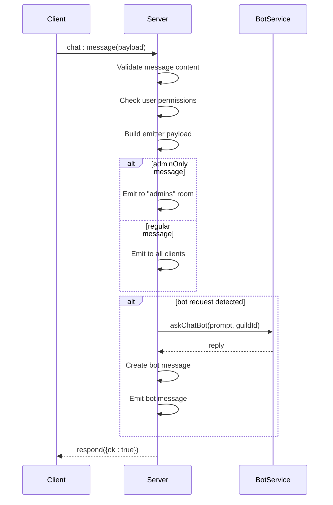
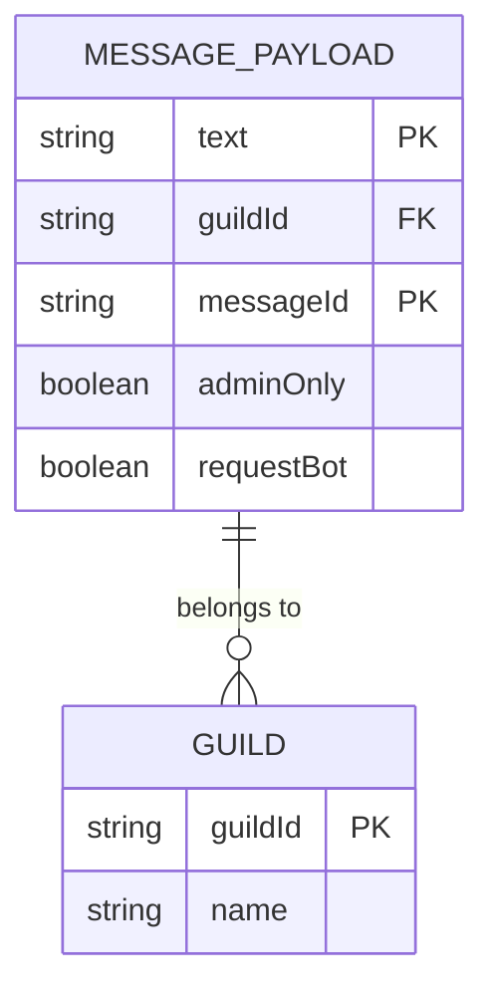
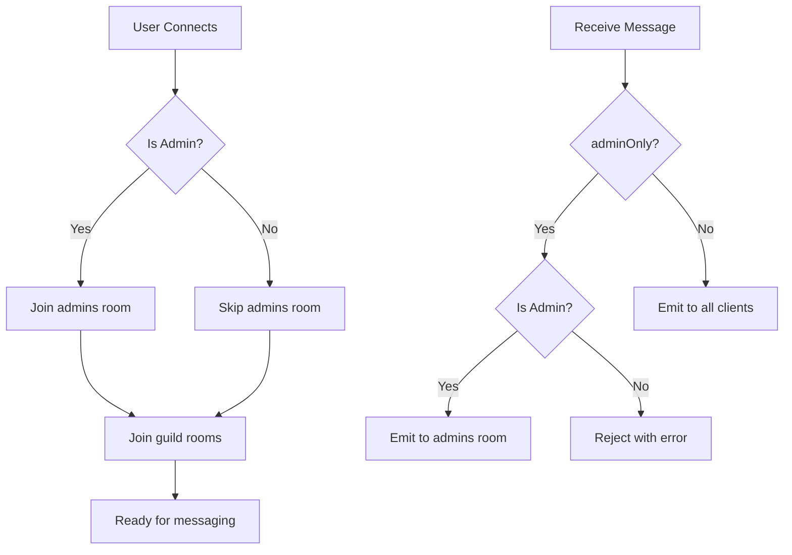
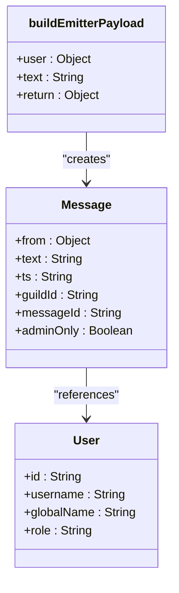
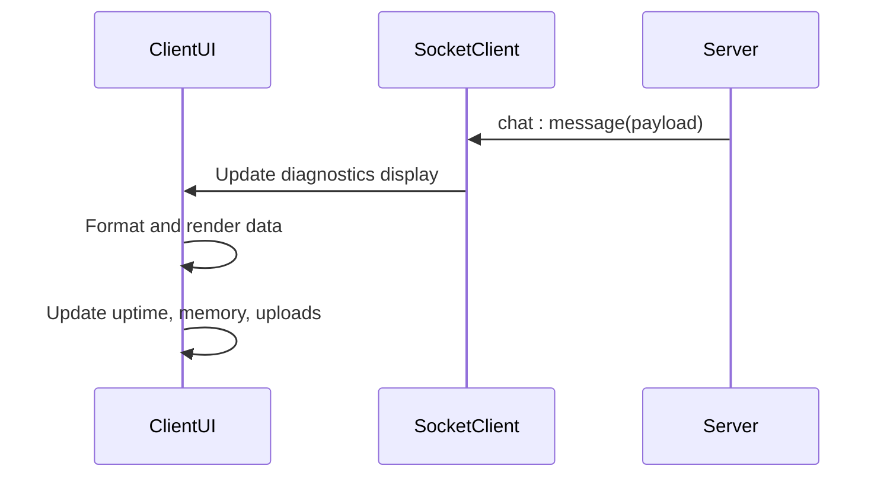
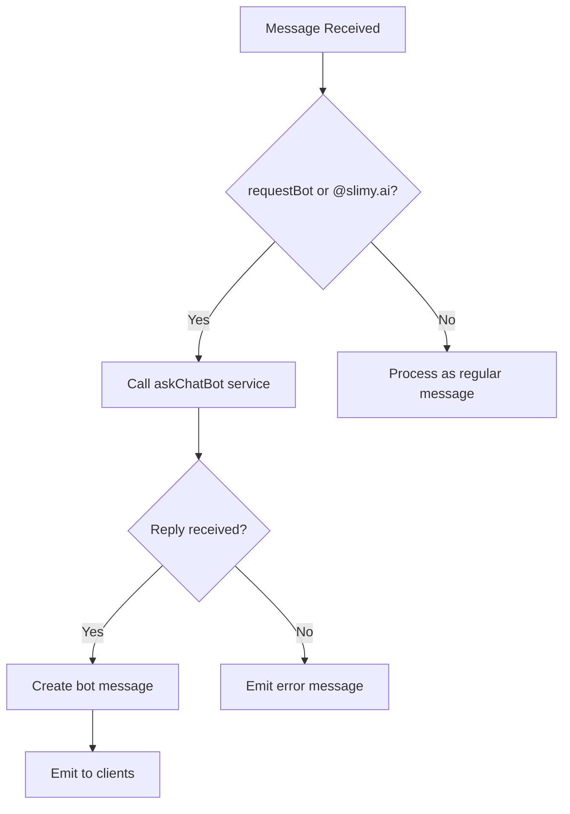

# Real-Time Messaging

<cite>
**Referenced Files in This Document**   
- [socket.js](file://apps/admin-api/src/socket.js)
- [chat-bot.js](file://apps/admin-api/src/services/chat-bot.js)
- [DiagWidget.js](file://apps/admin-ui/components/DiagWidget.js)
- [DiagnosticsCard.jsx](file://apps/admin-ui/components/diag/DiagnosticsCard.jsx)
- [socket.js](file://apps/admin-ui/lib/socket.js)
- [index.js](file://apps/admin-ui/pages/chat/index.js)
</cite>

## Table of Contents
1. [Introduction](#introduction)
2. [Core Components](#core-components)
3. [Message Processing Flow](#message-processing-flow)
4. [Message Payload Structure](#message-payload-structure)
5. [Routing and Broadcasting](#routing-and-broadcasting)
6. [Emitter Payload Construction](#emitter-payload-construction)
7. [Client-Side Message Handling](#client-side-message-handling)
8. [Bot Interaction Mechanism](#bot-interaction-mechanism)
9. [Error Handling and Acknowledgment](#error-handling-and-acknowledgment)

## Introduction
The real-time messaging system in the slimy-monorepo platform enables instant communication between users through a WebSocket-based architecture. The system centers around the chat:message event handler in the server's socket.js file, which processes incoming messages, validates content and permissions, and broadcasts messages to appropriate channels. This documentation details the complete flow from message submission to delivery, including the interaction with the chat bot service and the display of diagnostic messages in client components.

## Core Components
The real-time messaging system consists of several key components that work together to provide a seamless chat experience. The server-side socket.js handles connection management and message processing, while the chat-bot.js service provides AI-powered responses. On the client side, components like DiagWidget and DiagnosticsCard display system status information, and the chat interface handles message display and user interaction.

**Section sources**
- [socket.js](file://apps/admin-api/src/socket.js#L1-L203)
- [chat-bot.js](file://apps/admin-api/src/services/chat-bot.js#L1-L60)
- [DiagWidget.js](file://apps/admin-ui/components/DiagWidget.js#L1-L52)
- [DiagnosticsCard.jsx](file://apps/admin-ui/components/diag/DiagnosticsCard.jsx#L1-L74)

## Message Processing Flow
The message processing flow begins when a client emits a chat:message event with a payload containing the message text, guildId, and other metadata. The server's socket.js file handles this event through the chat:message listener, which performs validation on the message content and user permissions before processing it further.



**Diagram sources**
- [socket.js](file://apps/admin-api/src/socket.js#L100-L198)

**Section sources**
- [socket.js](file://apps/admin-api/src/socket.js#L100-L198)

## Message Payload Structure
The message payload structure includes several key fields that define the message content and behavior. The text field contains the actual message content, while guildId specifies the target guild for the message. The messageId provides a unique identifier for the message, and the adminOnly flag determines whether the message should only be visible to administrators.



**Diagram sources**
- [socket.js](file://apps/admin-api/src/socket.js#L102-L107)

**Section sources**
- [socket.js](file://apps/admin-api/src/socket.js#L102-L107)

## Routing and Broadcasting
Messages are routed to specific rooms based on user role and message type. When a user connects, they automatically join rooms corresponding to their guilds (guild:guildId) and, if they are an administrator, the 'admins' room. Regular messages are broadcast to all connected clients, while admin-only messages are restricted to the 'admins' room. This ensures that sensitive administrative communications remain private while allowing general chat to be visible to all users.



**Diagram sources**
- [socket.js](file://apps/admin-api/src/socket.js#L93-L98)
- [socket.js](file://apps/admin-api/src/socket.js#L148-L152)

**Section sources**
- [socket.js](file://apps/admin-api/src/socket.js#L93-L98)
- [socket.js](file://apps/admin-api/src/socket.js#L148-L152)

## Emitter Payload Construction
The buildEmitterPayload function constructs standardized message objects that include user metadata and role-based colors. This function takes a user object and message text as input and returns a formatted message object with the sender's ID, name, role, and color based on their role. The color scheme uses distinct colors for different roles: blue for members, orange for club users, red for administrators, and green for the bot.



**Diagram sources**
- [socket.js](file://apps/admin-api/src/socket.js#L25-L35)
- [socket.js](file://apps/admin-api/src/socket.js#L142-L145)

**Section sources**
- [socket.js](file://apps/admin-api/src/socket.js#L25-L35)
- [socket.js](file://apps/admin-api/src/socket.js#L142-L145)

## Client-Side Message Handling
Client components like DiagWidget and DiagnosticsCard receive and display real-time diagnostic messages through the WebSocket connection. These components subscribe to the chat:message event and update their display when new messages arrive. The DiagWidget component, for example, shows system diagnostics including API uptime, memory usage, and upload statistics, while the DiagnosticsCard provides a more detailed view of system status.



**Diagram sources**
- [DiagWidget.js](file://apps/admin-ui/components/DiagWidget.js#L10-L52)
- [DiagnosticsCard.jsx](file://apps/admin-ui/components/diag/DiagnosticsCard.jsx#L9-L74)

**Section sources**
- [DiagWidget.js](file://apps/admin-ui/components/DiagWidget.js#L10-L52)
- [DiagnosticsCard.jsx](file://apps/admin-ui/components/diag/DiagnosticsCard.jsx#L9-L74)

## Bot Interaction Mechanism
Bot responses are triggered either explicitly through the requestBot flag in the message payload or implicitly when the message text contains a reference to "slimy.ai". When a bot request is detected, the system calls the askChatBot service with the message text and guild context. If a reply is received, it is formatted as a message from the bot user and injected into the message stream. If the bot service is unavailable, an error message is sent to the client.



**Diagram sources**
- [socket.js](file://apps/admin-api/src/socket.js#L158-L175)
- [chat-bot.js](file://apps/admin-api/src/services/chat-bot.js#L13-L57)

**Section sources**
- [socket.js](file://apps/admin-api/src/socket.js#L158-L175)
- [chat-bot.js](file://apps/admin-api/src/services/chat-bot.js#L13-L57)

## Error Handling and Acknowledgment
The system uses a respond callback mechanism for error reporting and acknowledgment. When a message is received, the server validates the content and permissions, and if any issues are found, it calls the respond function with an error object. For successful processing, the respond function is called with {ok: true} to acknowledge receipt. This pattern allows clients to provide immediate feedback to users about the status of their message submission.

```mermaid
flowchart TD
A[Message Received] --> B{Valid?}
B --> |No| C[Call respond with error]
C --> D[Client shows error]
B --> |Yes| E[Process message]
E --> F[Call respond with {ok: true}]
F --> G[Client confirms send]
```

**Diagram sources**
- [socket.js](file://apps/admin-api/src/socket.js#L110-L112)
- [socket.js](file://apps/admin-api/src/socket.js#L117-L119)
- [socket.js](file://apps/admin-api/src/socket.js#L154-L156)

**Section sources**
- [socket.js](file://apps/admin-api/src/socket.js#L110-L112)
- [socket.js](file://apps/admin-api/src/socket.js#L117-L119)
- [socket.js](file://apps/admin-api/src/socket.js#L154-L156)