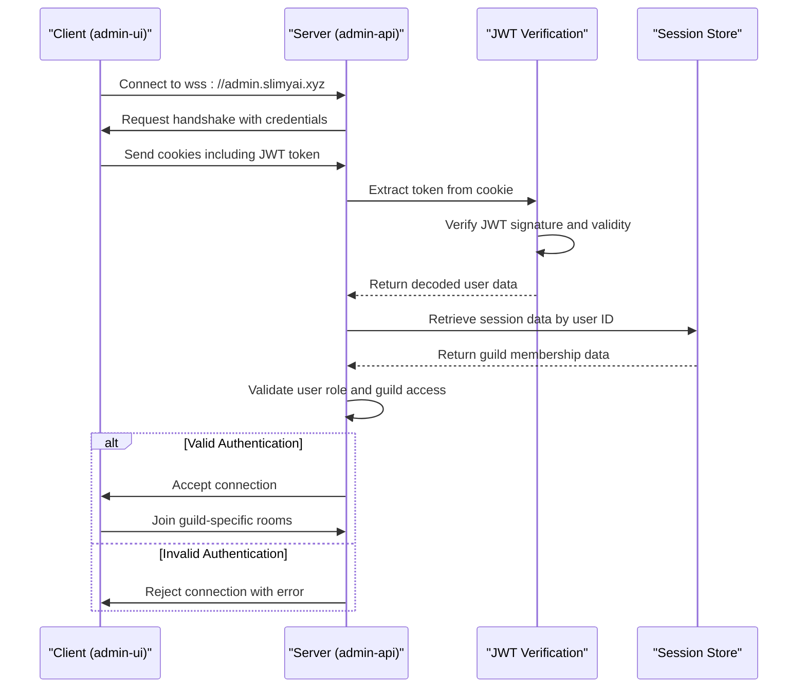
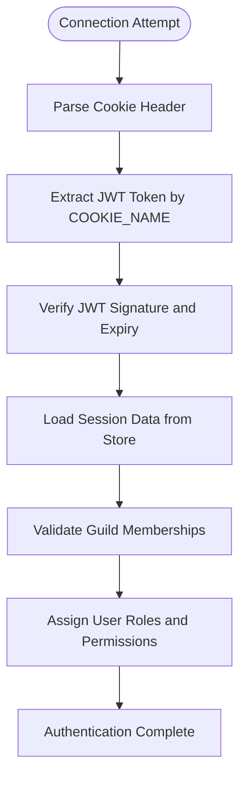
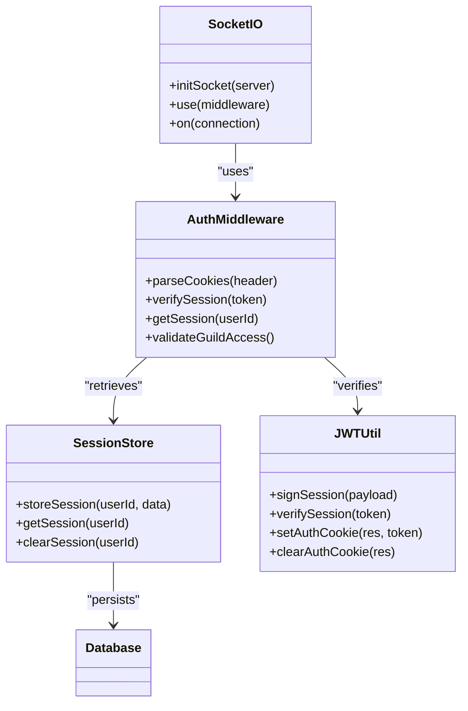

# WebSocket Authentication

<cite>
**Referenced Files in This Document**   
- [apps/admin-api/src/socket.js](file://apps/admin-api/src/socket.js)
- [apps/admin-api/lib/jwt.js](file://apps/admin-api/lib/jwt.js)
- [apps/admin-api/lib/session-store.js](file://apps/admin-api/lib/session-store.js)
- [apps/admin-api/src/middleware/auth.js](file://apps/admin-api/src/middleware/auth.js)
- [apps/admin-ui/lib/socket.js](file://apps/admin-ui/lib/socket.js)
- [apps/admin-api/src/config.js](file://apps/admin-api/src/config.js)
</cite>

## Table of Contents
1. [Introduction](#introduction)
2. [WebSocket Authentication Flow](#websocket-authentication-flow)
3. [Server-Side Authentication Mechanism](#server-side-authentication-mechanism)
4. [Client-Side Configuration](#client-side-configuration)
5. [Authentication Middleware and Session Validation](#authentication-middleware-and-session-validation)
6. [Error Handling and Connection Logging](#error-handling-and-connection-logging)
7. [Guild Access Validation](#guild-access-validation)
8. [Example Authentication Flows](#example-authentication-flows)
9. [Conclusion](#conclusion)

## Introduction
The WebSocket authentication mechanism in the slimy-monorepo platform ensures secure real-time communication between the admin-ui client and the admin-api server through Socket.IO. This document details the complete authentication flow, from client connection to server-side validation, focusing on JWT token verification, session management, and guild access control. The system uses a combination of JWT tokens stored in HTTP-only cookies and server-side session data to authenticate users and authorize their access to specific guilds.

**Section sources**
- [apps/admin-api/src/socket.js](file://apps/admin-api/src/socket.js#L1-L204)
- [apps/admin-ui/lib/socket.js](file://apps/admin-ui/lib/socket.js#L1-L21)

## WebSocket Authentication Flow
The WebSocket authentication process follows a structured flow that begins with the client connection and proceeds through multiple validation steps on the server side. The process ensures that only authenticated users with proper permissions can establish a WebSocket connection and participate in real-time communication.



**Diagram sources**
- [apps/admin-api/src/socket.js](file://apps/admin-api/src/socket.js#L38-L77)
- [apps/admin-ui/lib/socket.js](file://apps/admin-ui/lib/socket.js#L7-L10)

## Server-Side Authentication Mechanism
The server-side authentication mechanism in the slimy-monorepo platform is implemented through the Socket.IO server's middleware system, which intercepts connection attempts and validates user credentials before allowing the connection to proceed. The process begins with the `initSocket` function in the admin-api application, which sets up the Socket.IO server with proper CORS configuration to allow credential transmission.

The authentication process relies on the `verifySession` function from `lib/jwt.js` to validate JWT tokens extracted from cookies. The `parseCookies` utility function processes the cookie header from the handshake request, extracting individual cookies into a key-value object. This function splits the cookie string by semicolons, trims whitespace, and decodes URI components to handle special characters properly.

The `COOKIE_NAME` constant, defined in `lib/jwt.js`, specifies the expected cookie name for the session token. This value can be configured through environment variables, with a default value of "slimy_admin_token". The authentication middleware uses this constant to locate the JWT token within the parsed cookies, ensuring consistency across the application.



**Diagram sources**
- [apps/admin-api/src/socket.js](file://apps/admin-api/src/socket.js#L16-L23)
- [apps/admin-api/lib/jwt.js](file://apps/admin-api/lib/jwt.js#L7-L8)
- [apps/admin-api/src/socket.js](file://apps/admin-api/src/socket.js#L46-L77)

**Section sources**
- [apps/admin-api/src/socket.js](file://apps/admin-api/src/socket.js#L16-L77)
- [apps/admin-api/lib/jwt.js](file://apps/admin-api/lib/jwt.js#L7-L80)

## Client-Side Configuration
The client-side configuration for WebSocket authentication is implemented in the admin-ui application, specifically in the socket utility module. The client uses the socket.io-client library to establish a connection with the admin-api server, with specific configuration options to ensure proper authentication.

The `getSocket` function in `apps/admin-ui/lib/socket.js` initializes the Socket.IO client with two critical configuration options: `withCredentials: true` and explicit WebSocket transport. The `withCredentials` option is essential as it instructs the browser to include cookies in cross-origin requests, allowing the JWT authentication cookie to be sent automatically during the WebSocket handshake process.

The client connects to the production endpoint at "https://admin.slimyai.xyz" and specifies WebSocket as the preferred transport method, avoiding fallbacks to less efficient protocols like long-polling. This configuration ensures a persistent, low-latency connection suitable for real-time chat functionality. The singleton pattern implemented in the `getSocket` function ensures that only one socket connection is created per application instance, preventing resource leaks and connection conflicts.

**Section sources**
- [apps/admin-ui/lib/socket.js](file://apps/admin-ui/lib/socket.js#L5-L13)

## Authentication Middleware and Session Validation
The authentication middleware in the initSocket function performs comprehensive validation of user sessions and permissions. After verifying the JWT token, the middleware retrieves additional user data from the session store, which contains guild membership information not included in the JWT payload to keep token size manageable.

The `getSession` function from `lib/session-store.js` queries the database for the user's guild memberships, returning an array of guild objects with associated roles. This data is attached to the socket object as `socket.guildIds`, enabling room-based access control. The middleware also determines administrative status by checking the user's role, setting `socket.isAdmin` to true for admin users.

This separation of concerns—storing basic user identity in the JWT and detailed permissions in the session store—provides a scalable authentication model. It allows for dynamic updates to user permissions without requiring token regeneration, while maintaining the performance benefits of stateless JWT verification for the initial authentication step.



**Diagram sources**
- [apps/admin-api/src/socket.js](file://apps/admin-api/src/socket.js#L38-L77)
- [apps/admin-api/lib/session-store.js](file://apps/admin-api/lib/session-store.js#L41-L62)
- [apps/admin-api/lib/jwt.js](file://apps/admin-api/lib/jwt.js#L52-L54)

**Section sources**
- [apps/admin-api/src/socket.js](file://apps/admin-api/src/socket.js#L58-L65)
- [apps/admin-api/lib/session-store.js](file://apps/admin-api/lib/session-store.js#L41-L62)

## Error Handling and Connection Logging
The WebSocket authentication system implements comprehensive error handling and connection logging to ensure security and facilitate troubleshooting. When authentication fails at any stage, the middleware returns a standardized "not_authorized" error, which disconnects the client and prevents unauthorized access.

The system logs both successful and failed connection attempts with detailed context. Successful connections are logged with the user ID, role, and number of accessible guilds, providing visibility into active sessions. Authentication failures are logged with the specific error message, aiding in security monitoring and issue diagnosis.

The error handling is implemented within a try-catch block that wraps the entire authentication process, ensuring that any unexpected exceptions do not crash the server. Instead, they are caught, logged, and translated into appropriate client-facing errors. This defensive programming approach maintains server stability while providing clear feedback to clients about authentication failures.

**Section sources**
- [apps/admin-api/src/socket.js](file://apps/admin-api/src/socket.js#L73-L76)
- [apps/admin-api/src/socket.js](file://apps/admin-api/src/socket.js#L66-L70)

## Guild Access Validation
Guild access validation is a critical component of the WebSocket authentication system, ensuring that users can only access channels and data for guilds they are authorized to view. After successful authentication, the system checks whether non-admin users have access to at least one guild. Users without guild membership are disconnected with a "no_guild_context" error.

For users with guild access, the system automatically joins them to guild-specific rooms using the `socket.join()` method. Each guild room is named with the pattern "guild:{guildId}", enabling targeted message broadcasting. When users send chat messages, the system validates that the requested guild ID is among those the user is authorized to access, preventing unauthorized cross-guild communication.

Administrative users have special privileges, including access to an "admins" room for admin-only communications. They can also send admin-only messages that are broadcast exclusively to other administrators. This role-based access control ensures that sensitive administrative functions remain protected while enabling efficient communication among team members.

```mermaid
flowchart TD
A[User Connected] --> B{Is Admin?}
B --> |Yes| C[Join admins room]
B --> |No| D{Has Guilds?}
D --> |No| E[Disconnect: no_guild_context]
D --> |Yes| F[Join guild:{guildId} rooms]
F --> G[Process Messages]
G --> H{Valid Guild?}
H --> |Yes| I[Deliver Message]
H --> |No| J[Reject: access denied]
```

**Diagram sources**
- [apps/admin-api/src/socket.js](file://apps/admin-api/src/socket.js#L86-L98)
- [apps/admin-api/src/socket.js](file://apps/admin-api/src/socket.js#L123-L127)

**Section sources**
- [apps/admin-api/src/socket.js](file://apps/admin-api/src/socket.js#L86-L98)
- [apps/admin-api/src/socket.js](file://apps/admin-api/src/socket.js#L123-L127)

## Example Authentication Flows
The WebSocket authentication system supports multiple authentication scenarios, each following a consistent validation pattern. In a valid authentication flow, the client sends a connection request with a valid JWT cookie. The server verifies the token, retrieves the user's session data, confirms guild memberships, and establishes the connection with appropriate room memberships.

In an invalid authentication flow, such as when a user presents an expired or malformed token, the server rejects the connection during the middleware phase. The client receives an "not_authorized" error and disconnects. Similarly, if a valid user token is presented but the user has no guild memberships (and is not an admin), the server disconnects with a "no_guild_context" error.

For non-admin users, the system validates guild access on every message send operation, ensuring that users cannot access guilds beyond their permissions even if they attempt to manipulate client-side code. This server-side validation provides a robust security boundary that cannot be bypassed by malicious clients.

**Section sources**
- [apps/admin-api/src/socket.js](file://apps/admin-api/src/socket.js#L50-L57)
- [apps/admin-api/src/socket.js](file://apps/admin-api/src/socket.js#L86-L91)

## Conclusion
The WebSocket authentication mechanism in the slimy-monorepo platform provides a secure, scalable solution for real-time communication with comprehensive user validation and access control. By combining JWT-based authentication with server-side session storage, the system achieves a balance between performance and security. The client-server configuration ensures automatic credential transmission, while the middleware-based validation provides extensible authentication logic. With robust error handling, detailed logging, and granular access control, the system effectively protects against unauthorized access while enabling seamless real-time interactions for authorized users.