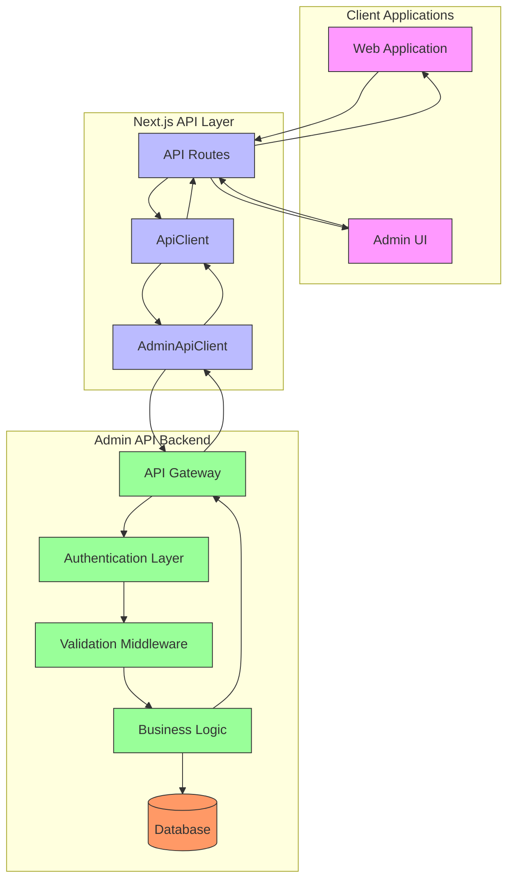
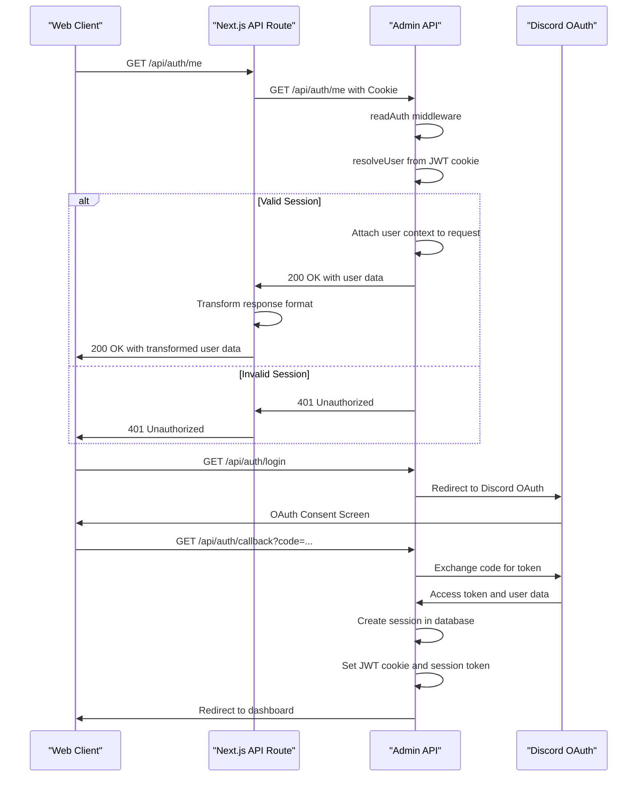
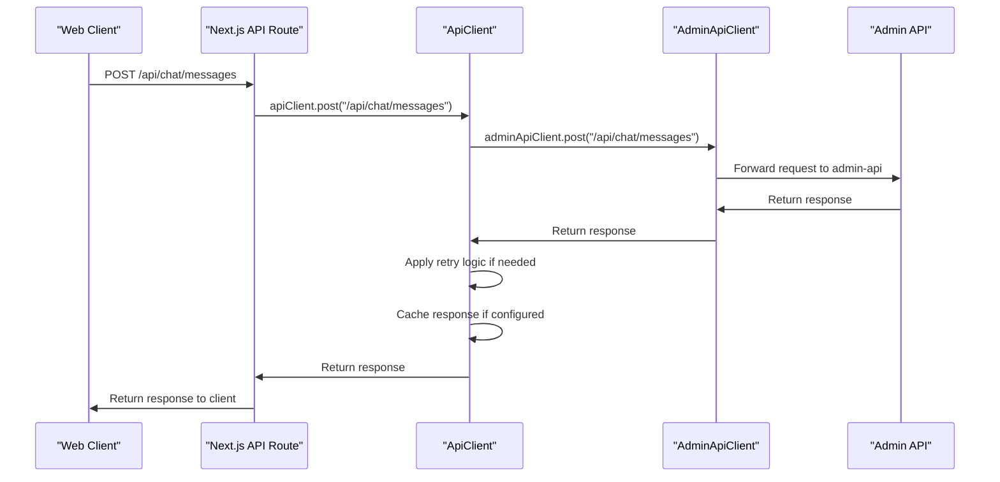
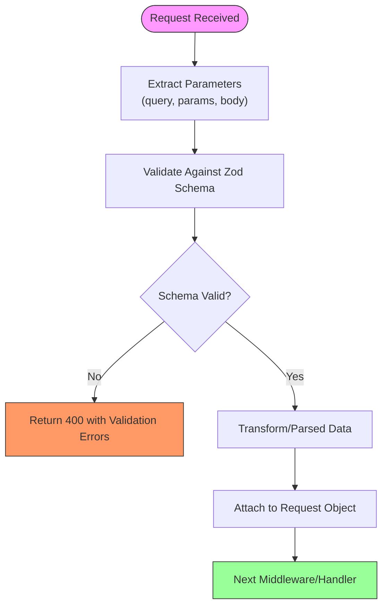
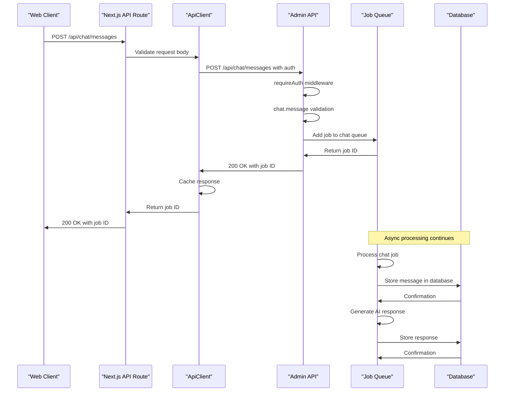
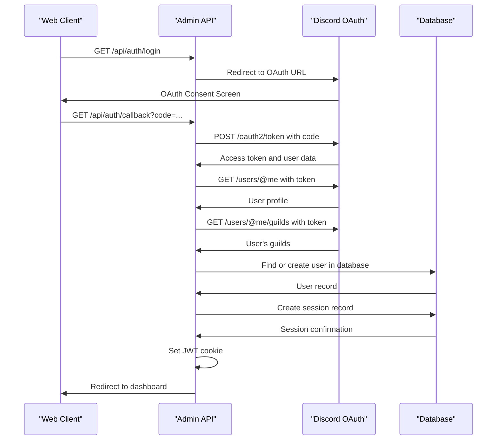
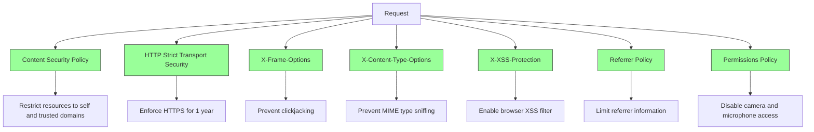
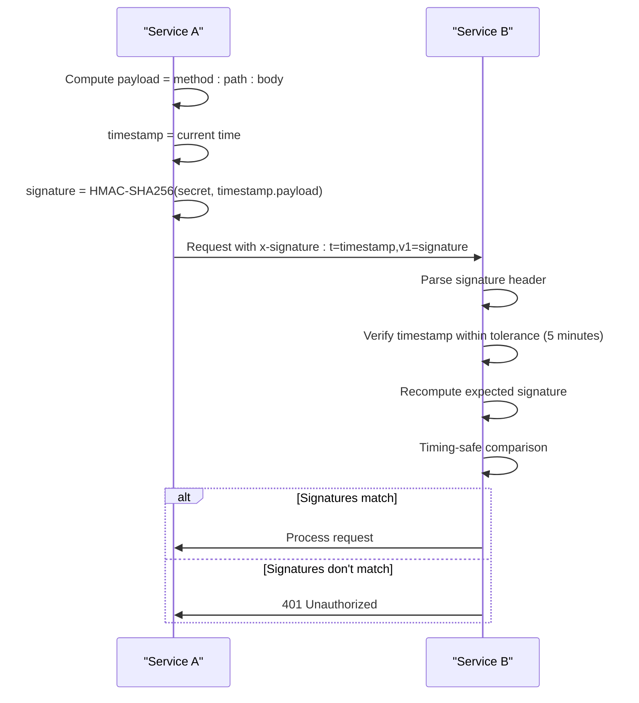
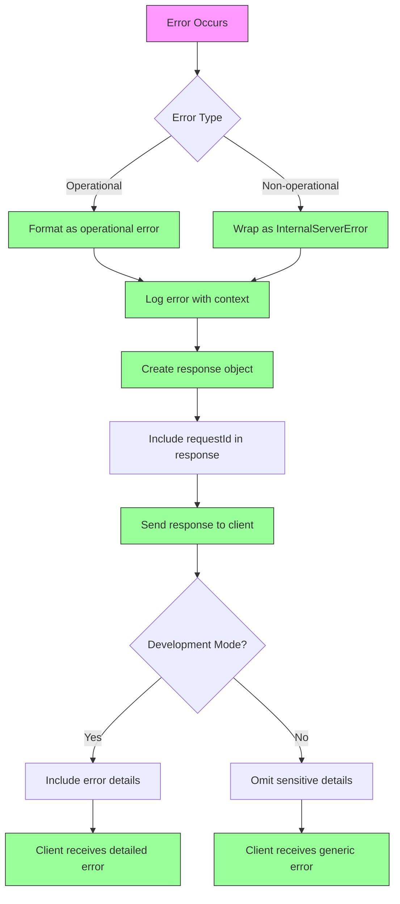

# Request-Response Flow

<cite>
**Referenced Files in This Document**   
- [api-client.ts](file://apps/web/lib/api-client.ts)
- [admin-client.ts](file://apps/web/lib/api/admin-client.ts)
- [auth.js](file://apps/admin-api/src/middleware/auth.js)
- [auth.js](file://apps/admin-api/src/routes/auth.js)
- [chat.js](file://apps/admin-api/src/routes/chat.js)
- [schemas.js](file://apps/admin-api/src/lib/validation/schemas.js)
- [security.js](file://apps/admin-api/src/middleware/security.js)
- [request-signing.ts](file://apps/web/lib/security/request-signing.ts)
- [api-proxy.ts](file://apps/web/lib/api-proxy.ts)
- [route.ts](file://apps/web/app/api/auth/me/route.ts)
- [route.ts](file://apps/web/app/api/chat/messages/route.ts)
- [middleware.ts](file://apps/web/middleware.ts)
- [error-handler.js](file://apps/admin-api/src/middleware/error-handler.js)
</cite>

## Table of Contents
1. [Introduction](#introduction)
2. [Architecture Overview](#architecture-overview)
3. [Authentication Flow](#authentication-flow)
4. [API Proxy Pattern](#api-proxy-pattern)
5. [Request Validation](#request-validation)
6. [Key Endpoint Flows](#key-endpoint-flows)
7. [Security Measures](#security-measures)
8. [Error Handling](#error-handling)
9. [Conclusion](#conclusion)

## Introduction
This document details the end-to-end request-response flow in the slimy-monorepo platform, focusing on the interaction between client applications (web, admin-ui) and the admin-api backend. The system implements a sophisticated architecture with JWT-based authentication, API proxying through Next.js, comprehensive request validation, and robust security measures. The flow begins with client requests that are routed through various middleware layers for authentication, validation, and security checks before reaching business logic, with responses following a reverse path with proper error handling and formatting.

**Section sources**
- [api-client.ts](file://apps/web/lib/api-client.ts#L1-L515)
- [admin-client.ts](file://apps/web/lib/api/admin-client.ts#L1-L398)

## Architecture Overview

The slimy-monorepo platform follows a microservices architecture with a clear separation between frontend applications and backend services. The primary components involved in the request-response flow are:

**Diagram sources**
- [api-client.ts](file://apps/web/lib/api-client.ts#L1-L515)
- [admin-client.ts](file://apps/web/lib/api/admin-client.ts#L1-L398)
- [auth.js](file://apps/admin-api/src/middleware/auth.js#L1-L314)
- [schemas.js](file://apps/admin-api/src/lib/validation/schemas.js#L1-L476)
- [security.js](file://apps/admin-api/src/middleware/security.js#L1-L285)

The architecture follows a layered approach where client applications communicate with the backend through Next.js API routes, which act as a proxy to the admin-api service. The AdminApiClient serves as the single source of truth for all API proxy logic, ensuring consistent handling of requests across the application. This design provides several benefits including centralized configuration, unified error handling, and the ability to implement cross-cutting concerns like retry logic and caching.

**Section sources**
- [api-client.ts](file://apps/web/lib/api-client.ts#L1-L515)
- [admin-client.ts](file://apps/web/lib/api/admin-client.ts#L1-L398)
- [api-gateway.md](file://apps/admin-api/src/lib/api-gateway.md#L1-L59)

## Authentication Flow

The authentication system in the slimy-monorepo platform uses JWT cookies with a multi-layered approach to session management and user context resolution. The flow involves both client-side and server-side components working together to maintain secure user sessions.

**Diagram sources**
- [auth.js](file://apps/admin-api/src/middleware/auth.js#L1-L314)
- [auth.js](file://apps/admin-api/src/routes/auth.js#L1-L482)
- [route.ts](file://apps/web/app/api/auth/me/route.ts#L1-L73)

The authentication flow begins with the `readAuth` middleware in the admin-api service, which attempts to resolve the user from JWT cookies. The system supports multiple cookie names for backward compatibility and first checks for a session token in the "slimy_admin" cookie. If present, it validates the session against the database, ensuring the session hasn't expired. For JWT tokens, it verifies the token signature and extracts the user payload, normalizing it for consistent handling throughout the application.

The `requireAuth` middleware builds upon `readAuth` by enforcing authentication requirements. If no valid user is found in the request, it returns a 401 Unauthorized response. This middleware is used to protect endpoints that require authenticated access, ensuring that only authorized users can access sensitive functionality.

On the client side, the `/api/auth/me` route in the web application acts as a proxy to the admin-api's authentication endpoint. It forwards the request with cookies and transforms the response to match the frontend's expectations. This abstraction allows the frontend to work with a consistent user object format regardless of changes in the backend authentication implementation.

**Section sources**
- [auth.js](file://apps/admin-api/src/middleware/auth.js#L1-L314)
- [auth.js](file://apps/admin-api/src/routes/auth.js#L1-L482)
- [route.ts](file://apps/web/app/api/auth/me/route.ts#L1-L73)

## API Proxy Pattern

The web application implements an API proxy pattern using Next.js API routes to forward requests to the admin-api backend. This pattern provides several advantages including CORS avoidance, centralized request handling, and the ability to implement client-specific logic.

**Diagram sources**
- [api-client.ts](file://apps/web/lib/api-client.ts#L1-L515)
- [admin-client.ts](file://apps/web/lib/api/admin-client.ts#L1-L398)
- [api-proxy.ts](file://apps/web/lib/api-proxy.ts#L1-L69)
- [route.ts](file://apps/web/app/api/chat/messages/route.ts#L1-L75)

The API proxy pattern is implemented through a layered client architecture. At the lowest level, the `AdminApiClient` serves as the single source of truth for all proxy logic. It determines the appropriate base URL based on the execution environment (client-side vs server-side) and ensures consistent header handling and error management.

The `ApiClient` class wraps the `AdminApiClient` with additional features including retry logic with exponential backoff, request caching, and interceptors for modifying requests and responses. This client implements a comprehensive retry strategy that handles network errors, timeouts, and specific HTTP status codes (408, 429, 500-504). The retry configuration is disabled in test environments to ensure fast failures during testing.

For client-side requests, the `AdminApiClient` uses relative URLs (`/api`) to route requests through Next.js rewrites, avoiding CORS issues. On the server-side, it uses the internal service URL for direct communication. This dual configuration ensures optimal performance and security in both contexts.

The `api-proxy.ts` file maintains backward compatibility with legacy code by re-exporting the proxy functionality while deprecating the old interface. This allows for a gradual migration to the new client architecture without breaking existing code.

**Section sources**
- [api-client.ts](file://apps/web/lib/api-client.ts#L1-L515)
- [admin-client.ts](file://apps/web/lib/api/admin-client.ts#L1-L398)
- [api-proxy.ts](file://apps/web/lib/api-proxy.ts#L1-L69)
- [route.ts](file://apps/web/app/api/chat/messages/route.ts#L1-L75)

## Request Validation

The platform implements comprehensive request validation using Zod schemas to ensure data integrity and prevent malformed requests from reaching business logic. Validation occurs at multiple levels, from route-specific middleware to centralized schema definitions.

**Diagram sources**
- [schemas.js](file://apps/admin-api/src/lib/validation/schemas.js#L1-L476)
- [chat.js](file://apps/admin-api/src/routes/chat.js#L1-L657)

Request validation is implemented through a middleware factory pattern that generates route-specific validation middleware from Zod schemas. The validation process checks three sources of input data: query parameters, route parameters, and request body. Each validation schema is defined as a strict object to prevent unknown properties from being accepted.

For chat-related endpoints, the validation includes:
- Message text length (max 2000 characters)
- Guild ID format (Discord snowflake pattern)
- Positive integers for numeric values
- Enumerated values for role and personality modes

File uploads receive special validation treatment with additional checks for MIME types, file signatures, and size limits (10MB maximum). The validation middleware also includes image-specific checks that verify file signatures for common image formats (JPEG, PNG, GIF, WebP) to prevent malicious file uploads.

When validation fails, the middleware returns a 400 Bad Request response with detailed error information including the field path and specific validation message. This helps clients understand and correct their requests. The error response format is consistent across all validation failures, making it easier for clients to handle validation errors programmatically.

**Section sources**
- [schemas.js](file://apps/admin-api/src/lib/validation/schemas.js#L1-L476)
- [chat.js](file://apps/admin-api/src/routes/chat.js#L1-L657)

## Key Endpoint Flows

This section details the request-response flow for key endpoints in the system, illustrating how the various components work together to handle specific use cases.

### Chat Message Submission Flow

The chat message submission endpoint demonstrates the complete request-response flow from client to backend and back, incorporating authentication, validation, and business logic.

**Diagram sources**
- [route.ts](file://apps/web/app/api/chat/messages/route.ts#L1-L75)
- [chat.js](file://apps/admin-api/src/routes/chat.js#L1-L657)

The chat message flow begins with the client submitting a message through the Next.js API route. The route validates the request body, ensuring required fields are present. It then uses the ApiClient to forward the request to the admin-api backend, including authentication cookies.

On the backend, the request passes through the `requireAuth` middleware to verify the user's session, followed by the `chat.message` validation middleware to ensure the message content meets requirements. Instead of processing the message synchronously, the system creates a job in the chat queue and returns immediately with a job ID. This asynchronous approach prevents request timeouts and allows for better resource management.

The actual message processing occurs in the background, where the job processor stores the message in the database, generates an AI response, and stores the response. Clients can poll for job status using the job ID to retrieve the final response when processing is complete.

### User Authentication Flow

The user authentication flow illustrates how users log in to the system using Discord OAuth, with the platform creating sessions and managing user data.

**Diagram sources**
- [auth.js](file://apps/admin-api/src/routes/auth.js#L1-L482)
- [auth.js](file://apps/admin-api/src/middleware/auth.js#L1-L314)

The authentication flow begins when a user initiates login, redirecting them to Discord's OAuth authorization endpoint. After the user grants permission, Discord redirects back to the application's callback endpoint with an authorization code. The backend exchanges this code for an access token, then uses the token to fetch the user's profile and guild information from Discord's API.

The system then creates or updates the user record in the database, storing their Discord information and OAuth tokens. A session record is created with a randomly generated token, and this token is stored in a secure, HTTP-only cookie named "slimy_admin". The user's guild information is also stored in the database, allowing for efficient access control decisions without requiring repeated API calls to Discord.

**Section sources**
- [route.ts](file://apps/web/app/api/chat/messages/route.ts#L1-L75)
- [chat.js](file://apps/admin-api/src/routes/chat.js#L1-L657)
- [auth.js](file://apps/admin-api/src/routes/auth.js#L1-L482)

## Security Measures

The platform implements multiple security measures to protect against common web vulnerabilities and ensure secure communication between components.

### CORS and Headers

The system uses helmet middleware to set comprehensive security headers that protect against various attacks:

**Diagram sources**
- [security.js](file://apps/admin-api/src/middleware/security.js#L1-L285)

The Content Security Policy (CSP) restricts resources to the same origin and specific trusted domains like Google Fonts. This prevents cross-site scripting (XSS) attacks by blocking unauthorized scripts and styles. The CSP also restricts connections to trusted endpoints like Discord and OpenAI APIs.

HSTS (HTTP Strict Transport Security) is configured to enforce HTTPS for one year, including subdomains and with preload support. This ensures all communication occurs over encrypted channels, preventing man-in-the-middle attacks.

### Request Signing

For inter-service communication, the platform implements request signing using HMAC-SHA256 to verify the authenticity of requests:

**Diagram sources**
- [request-signing.ts](file://apps/web/lib/security/request-signing.ts#L1-L261)

The request signing mechanism generates a signature using the HMAC-SHA256 algorithm with a shared secret. The signature is computed over a message that includes the timestamp and request payload (method, path, and body). This prevents replay attacks by including a timestamp that must be within a 5-minute tolerance window.

The signature is transmitted in a custom header (`x-signature`) using the format `t=timestamp,v1=signature`. The receiving service parses this header, verifies the timestamp, recomputes the expected signature, and performs a timing-safe comparison to prevent timing attacks. This ensures that only authorized services can communicate with each other, even if the network is compromised.

### Rate Limiting

The platform implements multiple rate limiting policies to prevent abuse and protect system resources:

- Authentication endpoints: 5 attempts per 15 minutes per IP
- API endpoints: 100 requests per 15 minutes per IP
- Chat endpoints: 10 requests per minute per IP
- Sensitive operations: 3 requests per minute per IP

These limits are enforced using the express-rate-limit middleware and are skipped for health check and metrics endpoints to avoid interfering with monitoring systems.

**Section sources**
- [security.js](file://apps/admin-api/src/middleware/security.js#L1-L285)
- [request-signing.ts](file://apps/web/lib/security/request-signing.ts#L1-L261)

## Error Handling

The platform implements a comprehensive error handling strategy that ensures consistent error responses and proper logging across the system.

**Diagram sources**
- [error-handler.js](file://apps/admin-api/src/middleware/error-handler.js#L1-L82)
- [api-client.ts](file://apps/web/lib/api-client.ts#L1-L515)

The error handling process begins with the `errorHandler` middleware, which receives errors from route handlers. It first determines whether the error is operational (expected errors like validation failures) or non-operational (unexpected errors like database connection issues). Non-operational errors are wrapped in an `InternalServerError` to prevent leaking implementation details.

All errors are logged with comprehensive context including the request ID, method, path, query parameters, request body, and user ID (if authenticated). This information is crucial for debugging and incident response. The error response includes a consistent format with an `ok: false` flag, error code, message, and request ID for tracing.

In development mode, additional error details are included in the response to aid debugging. In production, these details are omitted to prevent information disclosure. The client-side `ApiClient` further processes error responses, applying error interceptors and ensuring consistent error handling across the application.

The system also includes a 404 handler that catches requests to undefined routes and returns a consistent "Route not found" response. This handler is placed before the error handler in the middleware chain to ensure proper handling of missing routes.

**Section sources**
- [error-handler.js](file://apps/admin-api/src/middleware/error-handler.js#L1-L82)
- [api-client.ts](file://apps/web/lib/api-client.ts#L1-L515)

## Conclusion
The request-response flow in the slimy-monorepo platform demonstrates a well-architected system with clear separation of concerns, robust security measures, and comprehensive error handling. The API proxy pattern using Next.js routes effectively bridges the frontend and backend while avoiding CORS issues and providing a consistent interface. The JWT-based authentication system with database-backed sessions ensures secure user management, while the validation middleware protects against malformed requests.

The asynchronous processing model for chat interactions improves system responsiveness and scalability, while the request signing mechanism ensures secure inter-service communication. The layered error handling strategy provides consistent error responses while protecting sensitive information in production environments.

Overall, the architecture balances security, performance, and developer experience, providing a solid foundation for the platform's functionality. The use of modern patterns like API gateways, middleware pipelines, and async processing demonstrates a thoughtful approach to building a scalable and maintainable system.