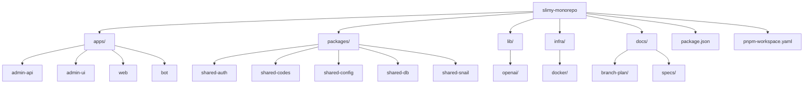
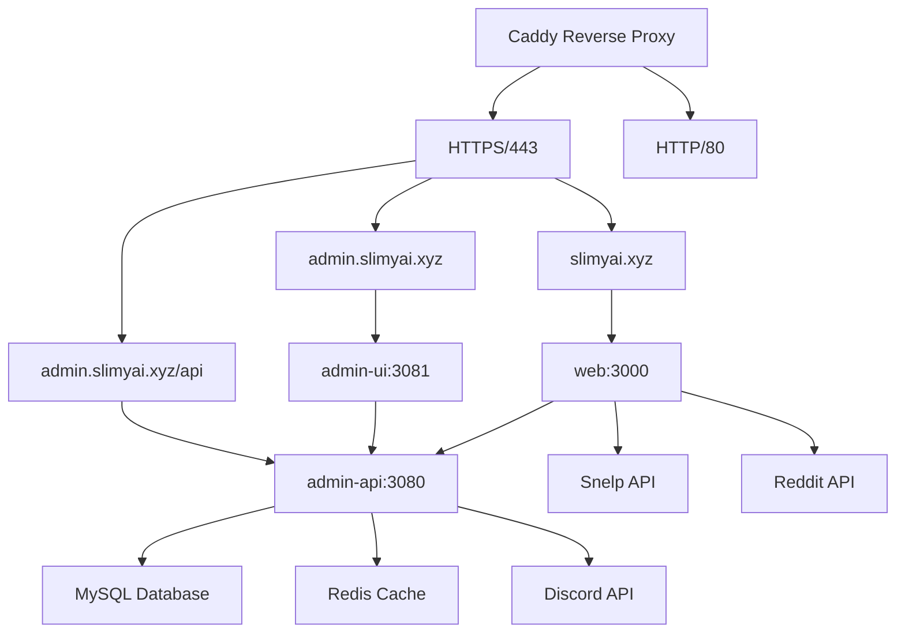
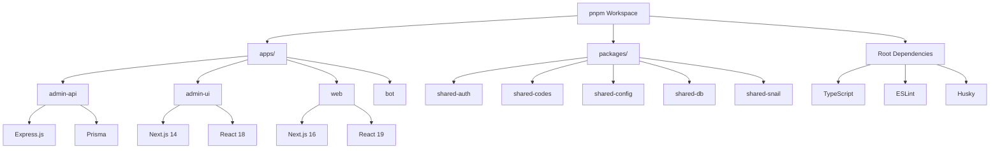

# Monorepo Structure

<cite>
**Referenced Files in This Document**   
- [package.json](file://package.json)
- [pnpm-workspace.yaml](file://pnpm-workspace.yaml)
- [ARCHITECTURAL_AUDIT.md](file://ARCHITECTURAL_AUDIT.md)
- [README.md](file://README.md)
- [docs/INFRA_OVERVIEW.md](file://docs/INFRA_OVERVIEW.md)
- [docs/SERVICES_MATRIX.md](file://docs/SERVICES_MATRIX.md)
- [apps/admin-api/package.json](file://apps/admin-api/package.json)
- [apps/admin-ui/package.json](file://apps/admin-ui/package.json)
- [apps/web/package.json](file://apps/web/package.json)
- [apps/bot/package.json](file://apps/bot/package.json)
- [packages/shared-auth/package.json](file://packages/shared-auth/package.json)
- [lib/openai/client.js](file://lib/openai/client.js)
- [scripts/check-deprecation.ts](file://scripts/check-deprecation.ts)
- [docker-compose.yml](file://docker-compose.yml)
</cite>

## Table of Contents
1. [Introduction](#introduction)
2. [Monorepo Organization](#monorepo-organization)
3. [Application Directory (apps/)](#application-directory-apps)
4. [Shared Packages Directory (packages/)](#shared-packages-directory-packages)
5. [Low-Level Utilities Directory (lib/)](#low-level-utilities-directory-lib)
6. [Infrastructure Directory (infra/)](#infrastructure-directory-infra)
7. [Documentation Directory (docs/)](#documentation-directory-docs)
8. [Dependency Management with pnpm Workspaces](#dependency-management-with-pnpm-workspaces)
9. [Workspace Scripts and Development Workflows](#workspace-scripts-and-development-workflows)
10. [Architectural Debt and Technical Challenges](#architectural-debt-and-technical-challenges)
11. [Conclusion](#conclusion)

## Introduction

The slimy-monorepo platform is a monorepo architecture designed to consolidate all Slimy.ai applications and shared packages into a single repository. This structure enables centralized dependency management, consistent development workflows, and streamlined deployment processes. The repository is organized into distinct directories that separate applications, shared libraries, infrastructure configurations, and documentation. The monorepo leverages pnpm workspaces for efficient package linking and dependency management, allowing multiple applications to coexist while sharing common tooling and configurations. This document provides a comprehensive overview of the monorepo's structure, detailing the purpose and ownership of each component, the role of shared packages, and the development workflows that support the platform.

**Section sources**
- [README.md](file://README.md#L1-L158)

## Monorepo Organization

The slimy-monorepo follows a standardized directory structure that separates concerns and promotes maintainability. The root directory contains configuration files for the monorepo, while top-level directories organize applications, shared packages, infrastructure, and documentation. The `apps/` directory houses all runnable applications, each with its own package.json and dependencies. The `packages/` directory is designated for shared libraries that can be consumed across multiple applications. The `lib/` directory contains low-level utilities used across services, while the `infra/` directory manages deployment and operations tooling. The `docs/` directory stores architectural documentation and design notes. This organization enables clear ownership boundaries and facilitates independent development of applications while maintaining a unified development experience through shared tooling and configurations.

**Diagram sources**
- [README.md](file://README.md#L150-L157)

## Application Directory (apps/)

The `apps/` directory contains all runnable applications in the slimy-monorepo platform, each serving a distinct purpose within the ecosystem. These applications are designed as independent services that can be developed, tested, and deployed separately while sharing common infrastructure and configurations. The directory follows a consistent naming convention with each application prefixed by `@slimy/` in its package.json, establishing clear ownership and namespace boundaries. Applications in this directory include the admin-api (Express.js backend), admin-ui (Next.js admin dashboard), web (Next.js public website), and bot (Discord bot placeholder). Each application maintains its own dependencies, build configurations, and testing frameworks, allowing for technology diversity while benefiting from shared tooling at the monorepo level.

**Section sources**
- [README.md](file://README.md#L150-L152)

### admin-api

The admin-api application is an Express.js backend service that provides RESTful API endpoints for Discord bot administration. It serves as the central data access layer for the platform, handling authentication, guild management, club analytics, and file uploads. The service is configured to run on port 3080 during development and communicates with external services such as Discord's API for OAuth2 authentication and bot membership checks. It uses Prisma ORM to interact with a MySQL database for persistent storage and implements JWT-based authentication with httpOnly cookies for session management. The admin-api also integrates with Redis for session caching and uses Sharp for image processing during file uploads. As a critical component of the architecture, it provides data to both the admin-ui dashboard and the public web application through API proxies.

**Section sources**
- [apps/admin-api/package.json](file://apps/admin-api/package.json#L1-L56)
- [docs/INFRA_OVERVIEW.md](file://docs/INFRA_OVERVIEW.md#L60-L90)
- [docs/SERVICES_MATRIX.md](file://docs/SERVICES_MATRIX.md#L77-L160)

### admin-ui

The admin-ui application is a Next.js 14 dashboard that provides a web-based interface for Discord bot administrators to manage guilds and monitor bot health. Hosted on port 3081 during development, this application serves as the primary administrative interface for platform operators. It features a multi-tab guild dashboard with sections for health metrics, file uploads, and Google Sheet integration for club management. The admin-ui consumes data from the admin-api through REST API calls, leveraging SWR for data fetching and React 18 for the user interface. Authentication is handled through httpOnly cookies set by the admin-api during the Discord OAuth2 flow. The application includes real-time monitoring capabilities with a live diagnostics widget that displays system uptime, memory usage, and upload statistics.

**Section sources**
- [apps/admin-ui/package.json](file://apps/admin-ui/package.json#L1-L20)
- [docs/INFRA_OVERVIEW.md](file://docs/INFRA_OVERVIEW.md#L91-L112)
- [docs/SERVICES_MATRIX.md](file://docs/SERVICES_MATRIX.md#L163-L224)

### web

The web application is a Next.js 16 public website that serves as the user-facing interface for the Slimy.ai Discord bot. Running on port 3000 during development, this application provides user tools, documentation, and a codes aggregator feature that combines codes from multiple sources. It implements role-based access control to direct authenticated users to appropriate dashboards based on their permissions. The web app uses server-side API proxies to communicate with the admin-api for authentication and data retrieval, while also integrating with external APIs such as Snelp and Reddit to aggregate game codes. Built with React 19 and Tailwind CSS, the application features an MDX documentation system that automatically imports content from GitHub repositories. It is designed for deployment on Vercel or through Docker, with comprehensive testing coverage including unit tests with Vitest and end-to-end tests with Playwright.

**Section sources**
- [apps/web/package.json](file://apps/web/package.json#L1-L86)
- [docs/INFRA_OVERVIEW.md](file://docs/INFRA_OVERVIEW.md#L41-L59)
- [docs/SERVICES_MATRIX.md](file://docs/SERVICES_MATRIX.md#L16-L74)

### bot

The bot application is a placeholder for the Discord bot service, currently containing only a minimal package.json and stub implementation. This application is intended to become the Discord bot that interacts directly with Discord's gateway and REST API to provide bot functionality within Discord servers. Currently, it exists as a scaffolding placeholder with no actual implementation, serving as a future home for the bot's codebase. The package.json indicates a dependency on discord.js version 14.14.1, suggesting the planned technology stack for the bot implementation. Development scripts are defined but currently only display TODO messages, indicating that implementation work has not yet begun. The bot is expected to communicate with the admin-api for configuration updates and receive rescan triggers, forming a bidirectional integration between the bot and the administration platform.

**Section sources**
- [apps/bot/package.json](file://apps/bot/package.json#L1-L23)
- [docs/INFRA_OVERVIEW.md](file://docs/INFRA_OVERVIEW.md#L113-L122)
- [docs/SERVICES_MATRIX.md](file://docs/SERVICES_MATRIX.md#L227-L259)

## Shared Packages Directory (packages/)

The `packages/` directory is designated for shared libraries that can be consumed across multiple applications within the monorepo. This directory follows the convention of scoped npm packages with the `@slimy/` prefix, establishing a clear namespace for shared code. The intended purpose of this directory is to promote code reuse and consistency across applications by centralizing common functionality such as authentication utilities, configuration management, database helpers, and domain-specific logic. However, as documented in the architectural audit, all packages in this directory currently exist as "zombie packages" with no implementation. Despite their presence in the workspace configuration, these packages contain no source code, exports, or meaningful dependencies, representing a significant architectural debt that needs to be addressed.

**Section sources**
- [README.md](file://README.md#L152-L153)
- [ARCHITECTURAL_AUDIT.md](file://ARCHITECTURAL_AUDIT.md#L13-L20)

### shared-auth

The shared-auth package is intended to provide authentication utilities and helpers that can be shared across multiple applications in the monorepo. As a scoped package named `@slimy/shared-auth`, it is designed to centralize authentication logic such as JWT handling, OAuth2 integration, and session management. However, the current implementation is minimal, containing only a package.json with a TODO message for the build script and no source code. The package.json indicates a private version of 0.0.0, suggesting it is in an early development state. Despite its presence in the pnpm workspace, the package does not export any functionality and cannot be consumed by other applications. This represents a missed opportunity for code reuse, as authentication logic is currently duplicated across applications like admin-api and web.

**Section sources**
- [packages/shared-auth/package.json](file://packages/shared-auth/package.json#L1-L10)
- [ARCHITECTURAL_AUDIT.md](file://ARCHITECTURAL_AUDIT.md#L13-L20)

### shared-config

The shared-config package is intended to centralize configuration management across the monorepo, providing a consistent way to handle environment variables, feature flags, and application settings. As part of the shared packages ecosystem, it would enable applications to access configuration values through a unified interface rather than implementing custom configuration logic in each service. This approach would promote consistency, reduce duplication, and simplify configuration management across the platform. However, like other packages in the directory, shared-config currently exists only as a package.json file with no implementation. Its presence in the workspace without functionality contributes to the architectural debt identified in the audit, as applications continue to manage configuration independently with potentially inconsistent patterns.

**Section sources**
- [ARCHITECTURAL_AUDIT.md](file://ARCHITECTURAL_AUDIT.md#L13-L20)

### shared-db

The shared-db package is intended to provide database utilities and helpers that can be shared across applications requiring database access. This would include Prisma client configuration, connection pooling, query helpers, and other database-related functionality. By centralizing database access patterns, the package would ensure consistency in how applications interact with the MySQL database and potentially reduce duplication of database configuration code. The shared-db package would be particularly valuable for applications like admin-api and web that both use Prisma ORM for database operations. However, the current state of the package is non-functional, existing only as a package.json file with no implementation. This forces applications to configure database access independently, leading to potential inconsistencies and duplicated effort.

**Section sources**
- [ARCHITECTURAL_AUDIT.md](file://ARCHITECTURAL_AUDIT.md#L13-L20)

### shared-snail

The shared-snail package is intended to provide domain-specific utilities and helpers related to the "snail" functionality of the Slimy.ai platform. This could include game logic, analytics calculations, or other features specific to the Super Snail game that the bot supports. As a shared package, it would enable consistent implementation of snail-related features across multiple applications, such as the web interface and the Discord bot. The package would likely contain business logic that should not be duplicated across services to ensure consistent behavior. However, like the other shared packages, shared-snail currently exists only as a package.json file with no implementation. This represents a gap in the architecture, as snail-related functionality must be implemented separately in each application that requires it.

**Section sources**
- [ARCHITECTURAL_AUDIT.md](file://ARCHITECTURAL_AUDIT.md#L13-L20)

## Low-Level Utilities Directory (lib/)

The `lib/` directory contains low-level utilities and helpers that are used across multiple services in the monorepo. Unlike the packages in the `packages/` directory, which are intended for higher-level shared functionality, the `lib/` directory focuses on foundational utilities that support core platform operations. These utilities are typically more technical in nature and provide essential functionality that multiple applications depend on. The directory structure includes subdirectories for specific utility categories, such as the openai/ directory which contains client implementations for interacting with the OpenAI API. These utilities are designed to be imported directly by applications and provide consistent implementations of common patterns across the platform.

**Section sources**
- [README.md](file://README.md#L153)

### OpenAI Client Implementation

The OpenAI client implementation in `lib/openai/client.js` provides a robust interface for interacting with the OpenAI API with support for streaming responses, exponential backoff retry logic, and function calling. This utility is designed to handle the complexities of API communication, including network errors, rate limiting, and timeouts, while providing a clean interface for applications to use. The implementation includes features such as automatic retry with exponential backoff, jitter to prevent thundering herd problems, and comprehensive error handling. It supports both streaming and non-streaming requests, allowing applications to choose the appropriate response pattern based on their needs. The client also includes a helper function to collect streaming responses into a single string, simplifying consumption of streamed content. This utility demonstrates the type of foundational functionality that belongs in the lib/ directory rather than as a shared package.

**Section sources**
- [lib/openai/client.js](file://lib/openai/client.js#L1-L215)

## Infrastructure Directory (infra/)

The `infra/` directory contains deployment and operations tooling for the slimy-monorepo platform, including Docker configurations, Caddy reverse proxy settings, systemd units, monitoring configurations, backups, and operational scripts. This directory serves as the central location for all infrastructure-as-code assets, enabling consistent deployment across different environments. The infrastructure configurations are designed to support the multi-service architecture of the platform, with Docker Compose files defining the relationships between services and their dependencies. The directory also includes environment-specific configurations, such as those for different NUC servers, allowing for tailored deployments to specific hardware. By centralizing infrastructure configurations, the platform ensures that deployment processes are reproducible and that operational knowledge is captured in version-controlled configuration files.

**Section sources**
- [README.md](file://README.md#L153)

### Docker and Caddy Configurations

The infrastructure directory includes comprehensive Docker and Caddy configurations that define the deployment architecture for the slimy-monorepo platform. The docker-compose.yml file orchestrates the deployment of multiple services including the admin-api, web frontend, admin-ui, Discord bot, and MySQL database, defining their relationships, environment variables, and health checks. Each service is configured with appropriate restart policies, network isolation, and dependency conditions to ensure reliable operation. The Caddy reverse proxy is configured to provide automatic HTTPS via Let's Encrypt, request routing by domain or path, and static file serving for uploads. This infrastructure setup enables all services to run behind a single entry point with proper security, load balancing, and domain management. The configurations also include health checks for critical services, ensuring that the system can detect and recover from failures automatically.

**Diagram sources**
- [docker-compose.yml](file://docker-compose.yml#L1-L154)
- [docs/INFRA_OVERVIEW.md](file://docs/INFRA_OVERVIEW.md#L174-L180)

## Documentation Directory (docs/)

The `docs/` directory contains architectural documentation, design notes, and operational guides for the slimy-monorepo platform. This directory serves as the central repository for knowledge about the system, ensuring that critical information is captured and accessible to all team members. The documentation covers a wide range of topics including infrastructure overviews, service matrices, development workflows, and architectural audits. The directory structure includes subdirectories for specific types of documentation, such as branch-plan/ for release planning and specs/ for technical specifications. This organization enables efficient navigation and ensures that documentation is stored in a logical, discoverable manner. The presence of comprehensive documentation supports onboarding of new team members, facilitates knowledge sharing, and provides a reference for decision-making and troubleshooting.

**Section sources**
- [README.md](file://README.md#L154)

## Dependency Management with pnpm Workspaces

The slimy-monorepo platform uses pnpm workspaces for dependency management and package linking, enabling efficient sharing of dependencies across multiple applications. The workspace configuration is defined in both package.json and pnpm-workspace.yaml files at the root of the repository, specifying that packages should be discovered in the apps/* and packages/* directories. This setup allows for shared dependencies to be installed once at the root level while maintaining independent package.json files for each application. The pnpm workspace leverages a content-addressable store to avoid duplicating dependencies, resulting in faster installations and reduced disk usage. The configuration also includes settings for lifecycle script approval, specifying which dependencies are allowed to run build scripts during installation. This dependency management approach enables the monorepo to maintain version consistency across applications while allowing for flexibility in technology choices.

**Diagram sources**
- [package.json](file://package.json#L1-L45)
- [pnpm-workspace.yaml](file://pnpm-workspace.yaml#L1-L14)

## Workspace Scripts and Development Workflows

The slimy-monorepo provides a comprehensive set of workspace scripts defined in the root package.json file to support unified development workflows across all applications. These scripts serve as convenience wrappers that abstract the complexity of working with multiple applications in a monorepo, enabling developers to perform common tasks with simple commands. The development workflow is designed to be consistent across applications, with standardized commands for starting development servers, running tests, building artifacts, and linting code. The scripts leverage pnpm's filtering capabilities to target specific applications or run commands across the entire workspace. This approach ensures that all team members follow the same development practices and reduces the cognitive load associated with remembering different commands for different applications. The workspace also includes automated quality checks through lint-staged and Husky, ensuring code quality is maintained before commits are made.

**Section sources**
- [package.json](file://package.json#L8-L28)
- [README.md](file://README.md#L27-L44)

### Development Commands

The development commands in the slimy-monorepo provide a standardized interface for common development tasks across all applications. These commands are defined in the root package.json file and use pnpm's filtering syntax to target specific applications or run operations across the entire workspace. Developers can start individual applications in development mode using commands like `pnpm dev:web`, `pnpm dev:admin-api`, and `pnpm dev:admin-ui`, which map to the respective application's dev scripts. Testing is supported through commands like `pnpm test:all` to run tests across all workspaces or `pnpm test:web` to test a specific application. The build process is unified with the `pnpm build` command, which runs the build script for all applications. These commands create a consistent development experience regardless of the underlying technology stack of each application.

**Section sources**
- [package.json](file://package.json#L8-L28)
- [README.md](file://README.md#L27-L44)

### Quality Assurance Scripts

The slimy-monorepo includes several quality assurance scripts to maintain code quality and prevent the accumulation of technical debt. The root package.json defines a `lint:deprecations` script that runs a custom deprecation checker implemented in `scripts/check-deprecation.ts`. This script scans the codebase for deprecated exports in shared packages and reports any usages in applications, helping to identify and remove obsolete code. The monorepo also includes standard linting and testing scripts that can be run across all applications or targeted to specific services. The lint-staged configuration automatically runs ESLint with the --fix flag on staged files, ensuring code style consistency before commits. These quality assurance measures are designed to be integrated into CI/CD pipelines, preventing problematic code from being merged into the main branch.

**Section sources**
- [package.json](file://package.json#L19-L21)
- [scripts/check-deprecation.ts](file://scripts/check-deprecation.ts#L1-L93)

## Architectural Debt and Technical Challenges

The slimy-monorepo platform faces several architectural debt issues and technical challenges that impact its maintainability and scalability. The most significant issue is the presence of "zombie packages" in the packages/ directory, where shared libraries exist in the workspace configuration but contain no implementation. This creates confusion for developers and undermines the intended benefits of code sharing. Additionally, there are version inconsistencies across core dependencies such as React, Next.js, and Zod, which can lead to subtle bugs and increased bundle sizes. The bot application remains unimplemented, existing only as a placeholder, which limits the platform's functionality. These challenges require strategic investment to resolve, including implementing the shared packages, harmonizing dependency versions, and developing the bot service to complete the platform's capabilities.

**Section sources**
- [ARCHITECTURAL_AUDIT.md](file://ARCHITECTURAL_AUDIT.md#L13-L32)

### Zombie Packages

The zombie packages issue refers to the five packages in the packages/ directory (shared-auth, shared-codes, shared-config, shared-db, shared-snail) that exist in the workspace but contain no source code, exports, or meaningful dependencies. These packages are essentially empty shells that add unnecessary complexity to the monorepo. They mislead developers about the existence of shared functionality and bloat the workspace configuration without providing any value. The presence of these packages contradicts the intended architecture of the monorepo, which relies on shared libraries to promote code reuse and consistency. This architectural debt must be addressed by either implementing the packages with the intended shared code or removing them entirely from the repository to reduce complexity and confusion.

**Section sources**
- [ARCHITECTURAL_AUDIT.md](file://ARCHITECTURAL_AUDIT.md#L13-L20)

### Dependency Version Inconsistencies

The slimy-monorepo suffers from significant version inconsistencies across core dependencies, which can lead to subtle bugs, inconsistent behavior, and increased bundle sizes. For example, the web application uses React 19.2.0 while the admin-ui uses React 18.2.0, creating potential compatibility issues and preventing code sharing between the applications. Similarly, the web application uses Next.js 16.0.1 while the admin-ui uses Next.js 14.2.5, limiting the ability to share components and utilities that depend on framework-specific APIs. Other dependencies like Zod and Sharp also have version mismatches between applications. These inconsistencies make it difficult to share code between applications and increase the maintenance burden, as each application may require different approaches to solve the same problems.

**Section sources**
- [ARCHITECTURAL_AUDIT.md](file://ARCHITECTURAL_AUDIT.md#L21-L32)

## Conclusion

The slimy-monorepo platform represents a comprehensive monorepo architecture designed to support multiple applications within the Slimy.ai ecosystem. The structure separates concerns through dedicated directories for applications, shared packages, infrastructure, and documentation, enabling clear ownership and maintainability. The use of pnpm workspaces facilitates efficient dependency management and package linking, while standardized development workflows ensure consistency across the codebase. However, the platform faces significant architectural debt in the form of unimplemented shared packages and version inconsistencies across applications. Addressing these challenges will be critical to realizing the full benefits of the monorepo approach, including improved code reuse, consistent user experiences, and streamlined development processes. Future work should focus on implementing the shared packages, harmonizing dependency versions, and completing the bot service implementation to deliver a cohesive and maintainable platform.