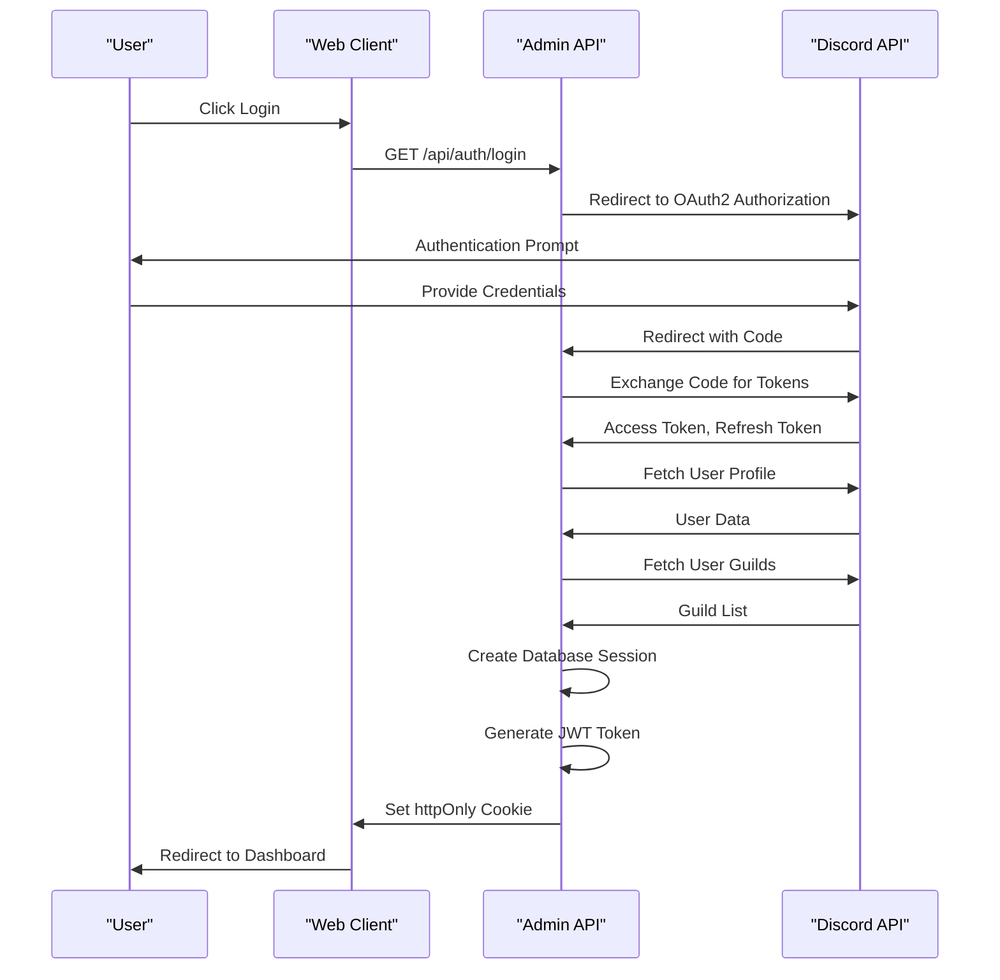
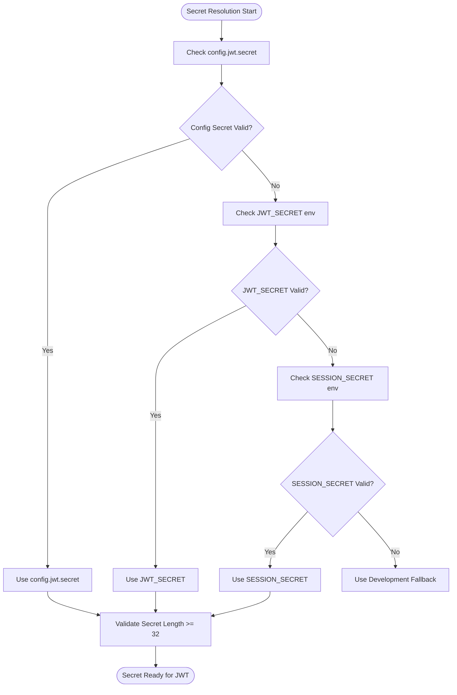
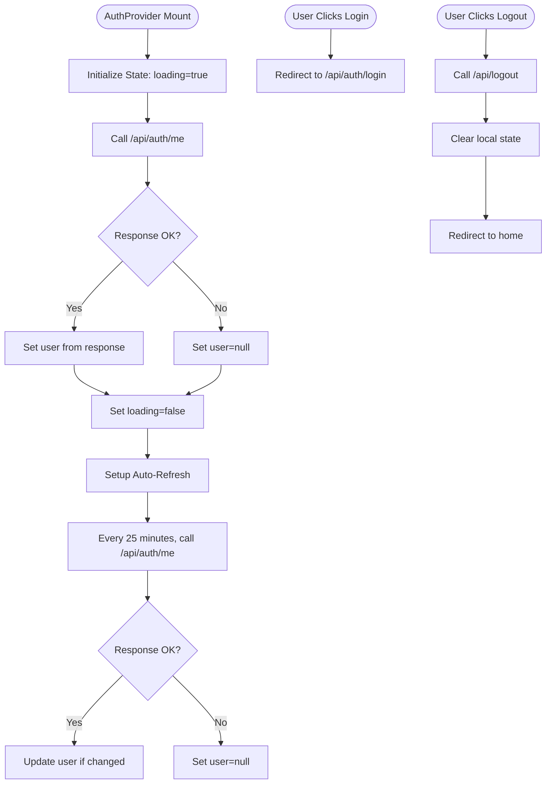

# Authentication

<cite>
**Referenced Files in This Document**   
- [jwt.js](file://apps/admin-api/lib/jwt.js)
- [auth.js](file://apps/admin-api/src/middleware/auth.js)
- [auth.js](file://apps/admin-api/src/routes/auth.js)
- [oauth.js](file://apps/admin-api/src/services/oauth.js)
- [config.js](file://apps/admin-api/src/config.js)
- [token.js](file://apps/admin-api/src/services/token.js)
- [session-store.js](file://apps/admin-api/lib/session-store.js)
- [server.ts](file://apps/web/lib/auth/server.ts)
- [constants.ts](file://apps/web/lib/auth/constants.ts)
- [types.ts](file://apps/web/lib/auth/types.ts)
- [context.tsx](file://apps/web/lib/auth/context.tsx)
- [csrf.js](file://apps/admin-api/src/middleware/csrf.js)
</cite>

## Table of Contents
1. [Introduction](#introduction)
2. [Authentication Flow Overview](#authentication-flow-overview)
3. [JWT-Based Session Management](#jwt-based-session-management)
4. [Secret Resolution and Configuration](#secret-resolution-and-configuration)
5. [Discord OAuth2 Integration](#discord-oauth2-integration)
6. [Authentication Middleware](#authentication-middleware)
7. [Cookie Configuration and Security](#cookie-configuration-and-security)
8. [CSRF Protection](#csrf-protection)
9. [Error Handling and Token Validation](#error-handling-and-token-validation)
10. [Client-Side Authentication Context](#client-side-authentication-context)
11. [Security Considerations](#security-considerations)

## Introduction
The slimy-monorepo platform implements a robust authentication system using JWT-based tokens stored in httpOnly cookies for secure session management. The system integrates with Discord OAuth2 for identity verification, using identify and guilds scopes to authenticate users and determine their server affiliations. This document details the complete authentication flow, including token generation, validation, middleware implementation, and security measures.

**Section sources**
- [jwt.js](file://apps/admin-api/lib/jwt.js)
- [auth.js](file://apps/admin-api/src/middleware/auth.js)
- [config.js](file://apps/admin-api/src/config.js)

## Authentication Flow Overview
The authentication process begins with a user initiating login through the Discord OAuth2 flow. The system redirects to Discord's authorization endpoint with appropriate scopes, and upon successful authentication, Discord redirects back with an authorization code. This code is exchanged for access and refresh tokens, which are used to fetch user profile and guild information. The system then creates a session token stored in the database and issues a JWT token via httpOnly cookie for subsequent requests.



**Diagram sources**
- [auth.js](file://apps/admin-api/src/routes/auth.js#L126-L137)
- [oauth.js](file://apps/admin-api/src/services/oauth.js#L20-L47)

## JWT-Based Session Management
The authentication system uses JSON Web Tokens (JWT) for stateless session management. The core JWT operations are implemented in the `jwt.js` module, which provides functions for token signing, verification, and cookie handling. The `signSession` function creates JWT tokens with HS256 algorithm and configurable expiration, while `verifySession` validates incoming tokens. The system uses httpOnly cookies to store tokens, preventing client-side JavaScript access and mitigating XSS attacks.

The authentication flow supports both JWT tokens and database-backed session tokens. When a request contains the `slimy_admin` cookie, the system validates the session against the database. For other authentication cookies, it verifies the JWT token and optionally hydrates session data from the session store.

**Section sources**
- [jwt.js](file://apps/admin-api/lib/jwt.js)
- [auth.js](file://apps/admin-api/src/middleware/auth.js#L44-L210)

## Secret Resolution and Configuration
The system implements a hierarchical secret resolution mechanism for JWT signing. It prioritizes environment variables in the following order: JWT_SECRET, SESSION_SECRET, with a fallback to configuration file values. The secret resolution enforces a minimum length requirement of 32 characters for security. When no valid secret is configured, the system uses a development fallback secret with a warning log entry.

Configuration options are managed through the `config.js` file, which reads environment variables and provides default values. The JWT configuration includes settings for cookie name, domain, secure flag, SameSite policy, and maximum age. In production environments, the cookie domain defaults to `.slimyai.xyz` when not explicitly configured.



**Diagram sources**
- [jwt.js](file://apps/admin-api/lib/jwt.js#L18-L43)
- [config.js](file://apps/admin-api/src/config.js#L39-L56)

## Discord OAuth2 Integration
The platform integrates with Discord OAuth2 for user authentication and identity verification. The integration uses the identify and guilds scopes to authenticate users and retrieve their server affiliations. The OAuth2 flow is initiated by redirecting users to Discord's authorization endpoint with a generated state parameter to prevent CSRF attacks.

Upon successful authentication, Discord redirects back with an authorization code, which is exchanged for access and refresh tokens. The system uses these tokens to fetch the user's profile and guild list. The guild information is used to determine the user's role based on permissions (MANAGE_GUILD or ADMINISTRATOR) and ownership status. When a bot token is available, the system optimizes the process by fetching the bot's guilds and intersecting them with the user's guilds to identify shared servers.

**Section sources**
- [oauth.js](file://apps/admin-api/src/services/oauth.js)
- [auth.js](file://apps/admin-api/src/routes/auth.js#L139-L311)

## Authentication Middleware
The authentication system provides several middleware functions to protect routes and extract user information. The `readAuth` middleware attempts to resolve the user from the authentication cookie without failing if authentication is missing, making it suitable for routes that support both authenticated and anonymous access. The `requireAuth` middleware requires valid authentication and returns a 401 error for unauthenticated requests.

Role-based access control is implemented through the `requireRole` middleware, which checks if the authenticated user has the required role or higher in the role hierarchy (member, club, admin). The `requireGuildMember` middleware ensures that users have access to a specific guild by checking their guild membership, with admins exempt from this requirement.

```mermaid
classDiagram
class AuthenticationMiddleware {
+readAuth(req, res, next)
+requireAuth(req, res, next)
+requireRole(minRole)
+requireGuildMember(paramKey)
+resolveUser(req)
+attachSession(req, res, next)
}
class RoleBasedAccess {
+hasRole(userRole, requiredRole)
+ROLE_ORDER : {"member" : 0, "club" : 1, "admin" : 2}
}
class UserResolution {
+resolveUser(req)
+hydrateUserFromToken(token)
+validateDatabaseSession(sessionToken)
}
AuthenticationMiddleware --> RoleBasedAccess : "uses"
AuthenticationMiddleware --> UserResolution : "delegates"
AuthenticationMiddleware --> "Cookie Handling" : "depends on"
class "Cookie Handling" {
+setAuthCookie(res, token)
+clearAuthCookie(res)
+getCookieOptions()
}
```

**Diagram sources**
- [auth.js](file://apps/admin-api/src/middleware/auth.js)
- [rbac.js](file://apps/admin-api/src/services/rbac.js)

## Cookie Configuration and Security
The authentication system configures cookies with security best practices. Cookies are marked as httpOnly to prevent client-side JavaScript access, reducing the risk of XSS attacks. The secure flag is set based on the environment (true in production) to ensure cookies are only transmitted over HTTPS. The SameSite policy defaults to "lax" but can be configured through environment variables.

The cookie domain is configurable through multiple environment variables (COOKIE_DOMAIN, ADMIN_COOKIE_DOMAIN) with a production default of `.slimyai.xyz` to enable cross-subdomain authentication. The cookie path is set to "/" to make it available across the entire site. The maximum age is configurable through JWT_MAX_AGE_SECONDS with a default of 12 hours.

**Section sources**
- [jwt.js](file://apps/admin-api/lib/jwt.js#L56-L72)
- [token.js](file://apps/admin-api/src/services/token.js#L8-L27)
- [config.js](file://apps/admin-api/src/config.js#L43-L56)

## CSRF Protection
The system implements CSRF protection through a combination of techniques. The OAuth2 flow uses state parameters with nonce values stored in httpOnly cookies to prevent cross-site request forgery during authentication. For API endpoints that modify state, the system can implement CSRF token validation by checking the x-csrf-token header against a token stored in the user session.

The CSRF middleware skips validation for safe HTTP methods (GET, HEAD, OPTIONS) and only requires token validation for state-changing methods (POST, PUT, DELETE). The CSRF token is included in the user session object and must be provided in the request header for validation.

**Section sources**
- [auth.js](file://apps/admin-api/src/routes/auth.js#L91-L101)
- [csrf.js](file://apps/admin-api/src/middleware/csrf.js)

## Error Handling and Token Validation
The authentication system includes comprehensive error handling for various failure scenarios. When authentication cookies are missing, the system logs the event and proceeds with a null user. Token verification failures are caught and logged, with appropriate 401 responses returned to clients. The system handles both JWT parsing errors and invalid signature errors uniformly.

For database session validation, the system checks for session expiration by comparing the current time with the stored expiration date. If a session is expired, it is treated as invalid. The system also handles database connectivity issues gracefully, allowing requests to proceed without user authentication when the database is unavailable, while logging the error for monitoring.

**Section sources**
- [auth.js](file://apps/admin-api/src/middleware/auth.js#L206-L210)
- [auth.js](file://apps/admin-api/src/routes/auth.js#L412-L416)

## Client-Side Authentication Context
The web client implements an authentication context using React's Context API to manage authentication state across the application. The AuthProvider component initializes by checking the current authentication status through the /api/auth/me endpoint. It maintains user state, loading status, and error information, providing this data to consuming components through the useAuth hook.

The context includes methods for login, logout, and session refresh. The login method redirects to the Admin API's authentication endpoint, while logout clears the local state and calls the logout endpoint to invalidate the server-side session. An automatic refresh mechanism periodically checks the authentication status to maintain an active session.



**Diagram sources**
- [context.tsx](file://apps/web/lib/auth/context.tsx)
- [server.ts](file://apps/web/lib/auth/server.ts)

## Security Considerations
The authentication system implements multiple security measures to protect user sessions and prevent common web vulnerabilities. The use of httpOnly cookies prevents XSS attacks from stealing authentication tokens. The SameSite cookie attribute (defaulting to "lax") provides protection against CSRF attacks by restricting cross-origin requests.

The system validates OAuth2 state parameters to prevent CSRF during the authentication flow. For additional security, the system could implement CSRF tokens for state-changing API endpoints. The JWT tokens are signed with HS256 algorithm using a secret that meets minimum length requirements, preventing brute force attacks.

Rate limiting is implemented for authentication endpoints to prevent brute force attacks. The system logs authentication events, including successful logins, failed attempts, and token verification failures, enabling monitoring and incident response. In production environments, the system enforces secure cookies and appropriate cookie domains to prevent session hijacking.

**Section sources**
- [jwt.js](file://apps/admin-api/lib/jwt.js)
- [auth.js](file://apps/admin-api/src/middleware/auth.js)
- [csrf.js](file://apps/admin-api/src/middleware/csrf.js)
- [security.ts](file://apps/web/lib/security/request-signing.ts)