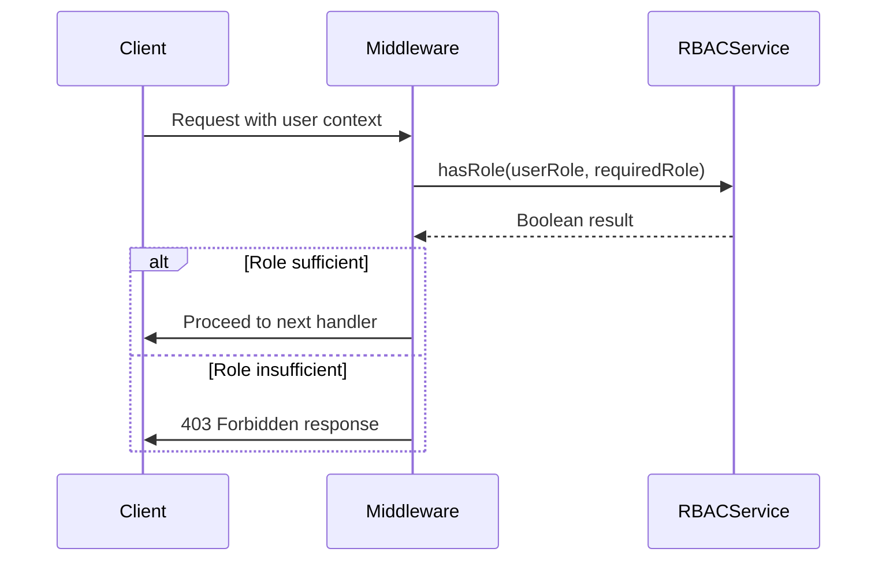
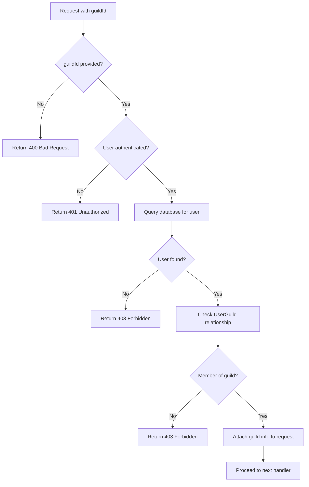
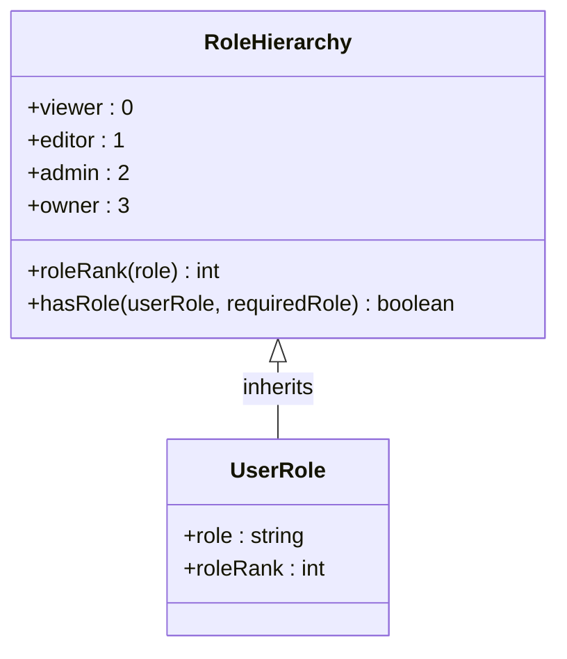
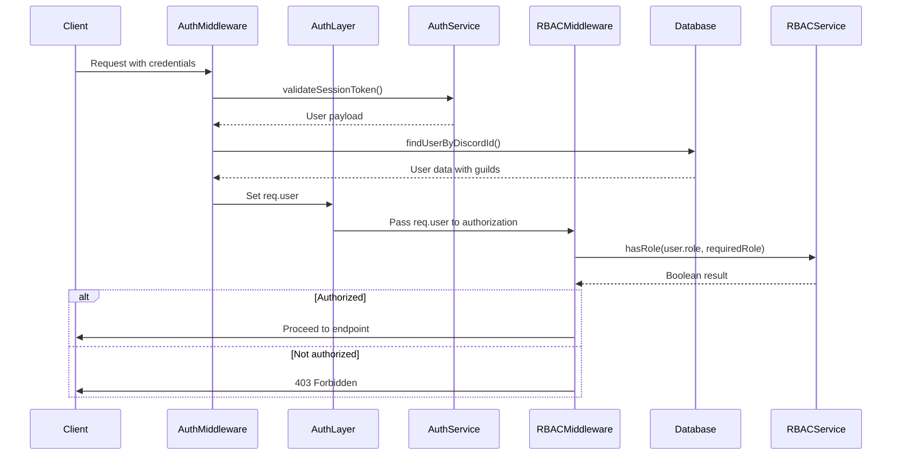
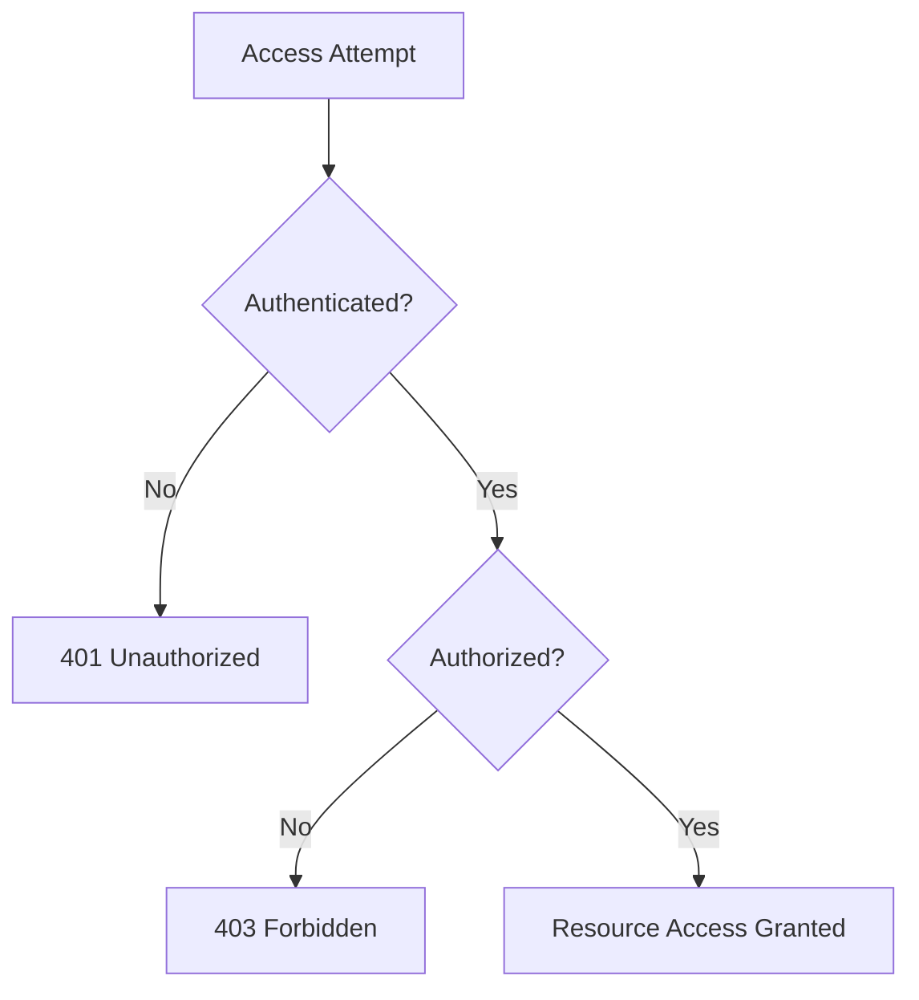

# Authorization

<cite>
**Referenced Files in This Document**   
- [rbac.js](file://apps/admin-api/src/middleware/rbac.js)
- [rbac.js](file://apps/admin-api/src/services/rbac.js)
- [auth.js](file://apps/admin-api/src/middleware/auth.js)
- [roles.js](file://apps/admin-api/src/lib/roles.js)
- [config.js](file://apps/admin-api/src/config.js)
- [guilds.js](file://apps/admin-api/src/routes/guilds.js)
- [auth.js](file://apps/admin-api/src/routes/auth.js)
- [permissions.ts](file://apps/web/lib/auth/permissions.ts)
- [types.ts](file://apps/web/lib/auth/types.ts)
</cite>

## Table of Contents
1. [Introduction](#introduction)
2. [Role-Based Access Control (RBAC) Implementation](#role-based-access-control-rbac-implementation)
3. [Middleware Components](#middleware-components)
4. [Role Hierarchy and Enforcement](#role-hierarchy-and-enforcement)
5. [Integration with Authentication Layer](#integration-with-authentication-layer)
6. [Error Handling and Response Codes](#error-handling-and-response-codes)
7. [Discord Bot Command Integration](#discord-bot-command-integration)
8. [Extending Role Definitions and Securing Endpoints](#extending-role-definitions-and-securing-endpoints)
9. [Conclusion](#conclusion)

## Introduction
The slimy-monorepo platform implements a comprehensive authorization system based on Role-Based Access Control (RBAC) principles. This system enforces permissions through user roles and guild membership verification, ensuring secure access to resources across the platform. The authorization layer works in conjunction with the authentication system to validate both user identity and their specific access rights. This document details the implementation of RBAC, focusing on the middleware components that enforce role requirements and guild access, the integration between authentication and authorization layers, and the mechanisms for handling unauthorized access attempts.

## Role-Based Access Control (RBAC) Implementation
The RBAC system in the slimy-monorepo platform is implemented through a combination of middleware functions and service components that work together to enforce access control policies. The core of this system is built around two primary middleware functions: `requireRole` and `requireGuildAccess`, which are responsible for validating user permissions and guild membership respectively.

The RBAC implementation follows a layered approach where authentication establishes user identity, and authorization determines what resources the authenticated user can access. This separation of concerns allows for flexible permission management while maintaining security boundaries. The system leverages both role-based permissions and guild-specific access controls to provide fine-grained access management across different endpoints and resources.

**Section sources**
- [rbac.js](file://apps/admin-api/src/middleware/rbac.js#L6-L75)
- [rbac.js](file://apps/admin-api/src/services/rbac.js#L51-L58)

## Middleware Components
The authorization system relies on two key middleware components that handle different aspects of access control: role verification and guild access validation.

### requireRole Middleware
The `requireRole` middleware function checks whether an authenticated user's role meets the minimum required level for accessing a specific resource. This middleware uses the `hasRole` function from the RBAC service to compare the user's current role against the required role based on a predefined role hierarchy. If the user's role does not meet or exceed the required level, the middleware returns a 403 Forbidden response.



**Diagram sources**
- [rbac.js](file://apps/admin-api/src/middleware/rbac.js#L6-L13)
- [rbac.js](file://apps/admin-api/src/services/rbac.js#L56-L58)

### requireGuildAccess Middleware
The `requireGuildAccess` middleware verifies that a user has access to a specific guild by checking their Discord ID against the database and ensuring they are associated with the requested guildId. This middleware extracts the guildId from request parameters, query, or body, then queries the database to confirm the user's membership in the specified guild. If the user is not a member of the guild, the middleware returns a 403 Forbidden response.



**Diagram sources**
- [rbac.js](file://apps/admin-api/src/middleware/rbac.js#L15-L70)
- [auth.js](file://apps/admin-api/src/routes/auth.js#L342-L370)

**Section sources**
- [rbac.js](file://apps/admin-api/src/middleware/rbac.js#L15-L70)
- [auth.js](file://apps/admin-api/src/routes/auth.js#L342-L370)

## Role Hierarchy and Enforcement
The RBAC system implements a hierarchical role structure that defines the relative privileges of different user roles. The role hierarchy is defined in the configuration and determines how permissions are enforced across various endpoints.

### Role Hierarchy Structure
The platform defines a role hierarchy with the following levels (from lowest to highest privilege):
- **viewer**: Basic read-only access
- **editor**: Ability to modify settings and content
- **admin**: Full administrative privileges
- **owner**: Highest level of control

This hierarchy is implemented through the `roleRank` function in the RBAC service, which assigns a numerical rank to each role based on its position in the hierarchy array. The `hasRole` function then compares these ranks to determine if a user's role meets or exceeds the required level.



**Diagram sources**
- [rbac.js](file://apps/admin-api/src/services/rbac.js#L51-L58)
- [config.js](file://apps/admin-api/src/config.js#L67-L69)

### Endpoint-Specific Role Enforcement
Different endpoints enforce specific role requirements based on the sensitivity of the operations they perform. For example, in the guild settings routes:

- **GET /:guildId/settings**: Requires guild access only
- **PUT /:guildId/settings**: Requires both guild access and editor role or higher
- **GET /:guildId/export/corrections.csv**: Requires guild access and admin role

This granular approach ensures that users can view information appropriate to their role while preventing unauthorized modifications or data exports.

```mermaid
flowchart LR
A[User Request] --> B{Endpoint Type?}
B --> |Read Operation| C[requireGuildAccess only]
B --> |Write Operation| D[requireGuildAccess + requireRole(editor)]
B --> |Export Operation| E[requireGuildAccess + requireRole(admin)]
```

**Diagram sources**
- [guilds.js](file://apps/admin-api/src/routes/guilds.js#L178-L194)
- [guilds.js](file://apps/admin-api/src/routes/guilds.js#L445-L446)

**Section sources**
- [config.js](file://apps/admin-api/src/config.js#L67-L69)
- [rbac.js](file://apps/admin-api/src/services/rbac.js#L51-L58)
- [guilds.js](file://apps/admin-api/src/routes/guilds.js#L178-L194)

## Integration with Authentication Layer
The authorization system integrates seamlessly with the authentication layer to provide a comprehensive security model. This integration follows a two-step process where authentication establishes user identity, and authorization validates specific resource access.

### Authentication and Authorization Flow
The integration between authentication and authorization occurs through the `req.user` object, which is populated during the authentication process and then used by authorization middleware for further validation. The authentication middleware (`requireAuth`) first verifies the user's identity by validating session tokens or JWTs, while the authorization middleware (`requireRole`, `requireGuildAccess`) subsequently checks if the authenticated user has the necessary permissions for the requested resource.



**Diagram sources**
- [auth.js](file://apps/admin-api/src/middleware/auth.js#L237-L255)
- [rbac.js](file://apps/admin-api/src/middleware/rbac.js#L6-L13)

### User Context Propagation
During the authentication process, user information is enriched with role and guild membership data that is subsequently used for authorization decisions. The authentication flow retrieves the user's Discord profile and guild memberships, determines their role based on permissions, and stores this information in the session. This enriched user context is then available to all subsequent middleware and route handlers, enabling consistent authorization checks throughout the request lifecycle.

**Section sources**
- [auth.js](file://apps/admin-api/src/middleware/auth.js#L237-L255)
- [auth.js](file://apps/admin-api/src/routes/auth.js#L139-L417)

## Error Handling and Response Codes
The authorization system implements standardized error responses for unauthorized and forbidden access attempts, providing clear feedback to clients while maintaining security.

### Unauthorized (401) Responses
The 401 Unauthorized status code is returned when a user attempts to access a protected resource without proper authentication. This occurs when:
- No valid authentication token is provided
- The authentication token has expired
- The authentication token is invalid

The response format for 401 errors includes a standardized JSON structure with error codes and messages that can be consistently handled by client applications.

### Forbidden (403) Responses
The 403 Forbidden status code is returned when an authenticated user lacks the necessary permissions to access a resource. This occurs when:
- The user's role does not meet the minimum required level
- The user is not a member of the requested guild
- The user does not have specific permissions required for the operation



**Diagram sources**
- [rbac.js](file://apps/admin-api/src/middleware/rbac.js#L8-L9)
- [rbac.js](file://apps/admin-api/src/middleware/rbac.js#L24-L25)
- [auth.js](file://apps/admin-api/src/middleware/auth.js#L221-L227)

**Section sources**
- [rbac.js](file://apps/admin-api/src/middleware/rbac.js#L8-L9)
- [rbac.js](file://apps/admin-api/src/middleware/rbac.js#L24-L25)
- [auth.js](file://apps/admin-api/src/middleware/auth.js#L221-L227)

## Discord Bot Command Integration
The authorization system is designed to integrate with Discord bot commands as referenced in the health monitoring documentation. This integration allows the bot to validate user permissions before executing commands, ensuring that only authorized users can perform administrative actions within Discord servers.

The planned integration would leverage the same RBAC service functions used by the web API, allowing for consistent permission enforcement across different interfaces. When a user issues a bot command, the bot would:
1. Extract the user's Discord ID from the command context
2. Query the database to retrieve the user's role and guild membership
3. Use the `hasRole` function to verify if the user has sufficient privileges
4. Execute the command only if authorization checks pass

This approach ensures that permission policies are centralized and consistently applied, whether users interact with the system through the web interface or Discord commands.

**Section sources**
- [health.ts](file://apps/bot/src/commands/health.ts)
- [rbac.js](file://apps/admin-api/src/services/rbac.js#L56-L58)

## Extending Role Definitions and Securing Endpoints
The RBAC system is designed to be extensible, allowing for the addition of new roles and the securing of new endpoints with appropriate middleware.

### Extending Role Definitions
To extend the role system, developers can modify the role hierarchy in the configuration file and update the role determination logic as needed. The current implementation supports role definitions through environment variables, allowing for flexible configuration without code changes. New roles can be added by extending the role order array in the configuration and implementing any necessary role-specific logic in the RBAC service.

### Securing New Endpoints
When adding new endpoints, developers should apply the appropriate middleware based on the required access level:
- Use `requireAuth` for any endpoint requiring authentication
- Use `requireGuildAccess` for endpoints that operate on guild-specific resources
- Use `requireRole('roleName')` for endpoints with specific role requirements

The middleware can be combined in sequence to enforce multiple authorization requirements, with each middleware passing control to the next only if its conditions are met.

```mermaid
flowchart LR
A[New Endpoint] --> B[requireAuth]
B --> C{Authenticated?}
C --> |Yes| D[requireGuildAccess]
C --> |No| E[401 Unauthorized]
D --> F{In Guild?}
F --> |Yes| G[requireRole(editor)]
F --> |No| H[403 Forbidden]
G --> I{Role Sufficient?}
I --> |Yes| J[Execute Endpoint Logic]
I --> |No| K[403 Forbidden]
```

**Diagram sources**
- [config.js](file://apps/admin-api/src/config.js#L67-L69)
- [rbac.js](file://apps/admin-api/src/middleware/rbac.js#L6-L13)
- [rbac.js](file://apps/admin-api/src/middleware/rbac.js#L15-L70)

**Section sources**
- [config.js](file://apps/admin-api/src/config.js#L67-L69)
- [rbac.js](file://apps/admin-api/src/middleware/rbac.js#L6-L75)

## Conclusion
The authorization system in the slimy-monorepo platform provides a robust and flexible RBAC implementation that effectively enforces permissions based on user roles and guild membership. Through the use of middleware components like `requireRole` and `requireGuildAccess`, the system ensures that only authorized users can access protected resources. The integration between authentication and authorization layers creates a comprehensive security model, while standardized error responses provide clear feedback for access violations. The system's design supports future extensions, including integration with Discord bot commands, and provides clear guidance for securing new endpoints with appropriate authorization checks.