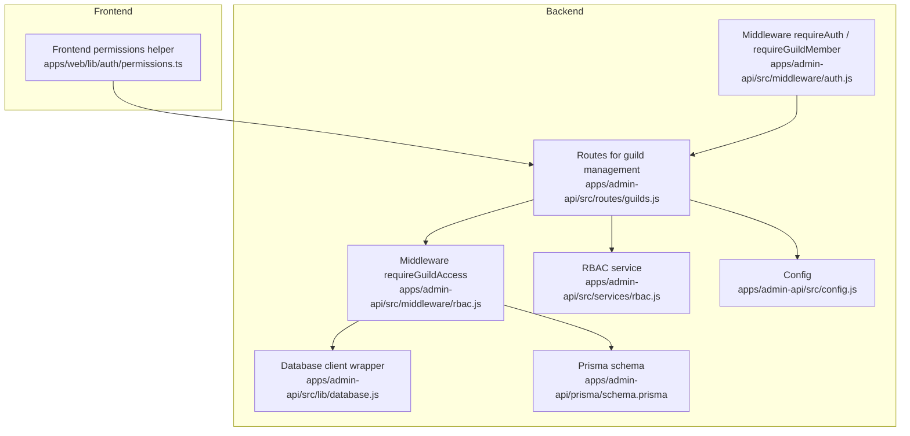
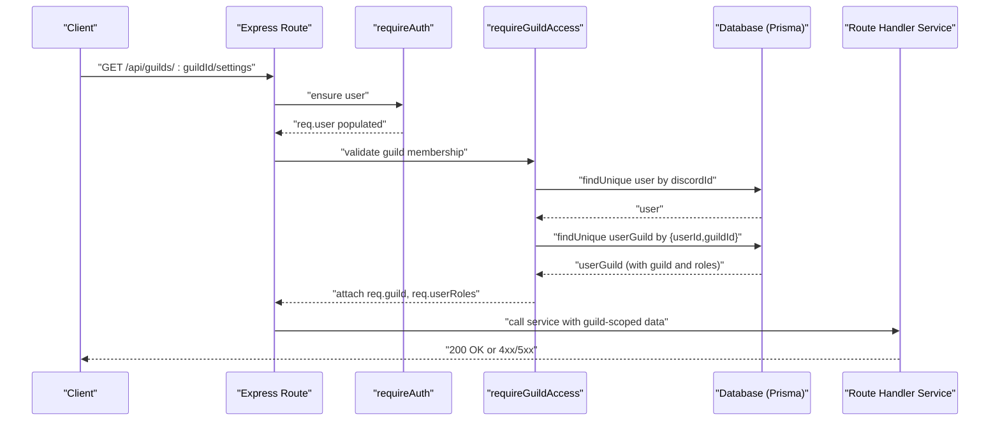
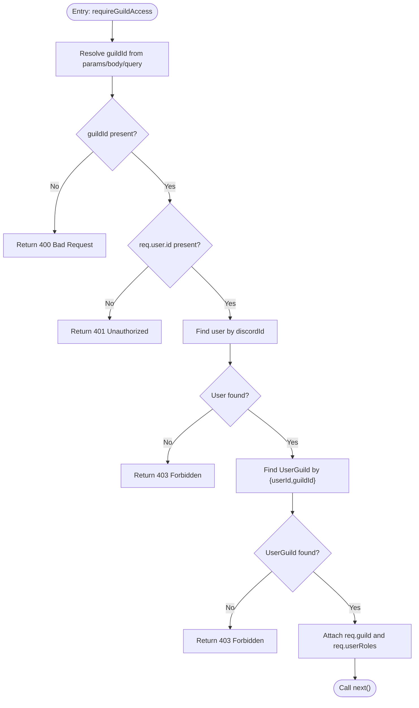
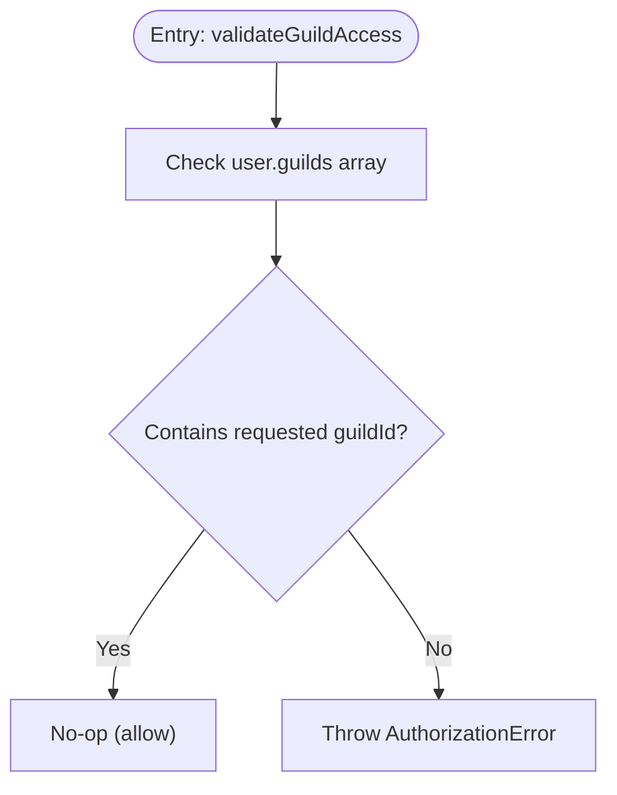
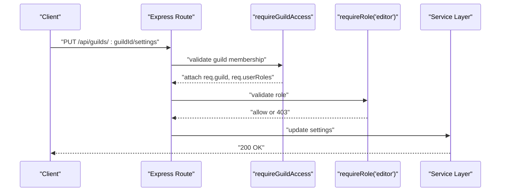
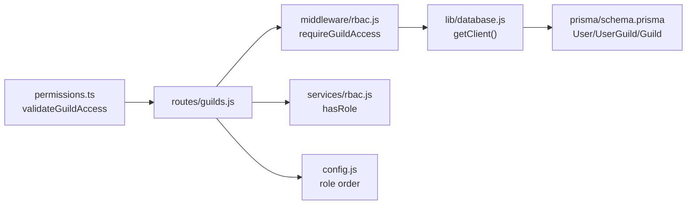

# Guild-Based Access Control

<cite>
**Referenced Files in This Document**
- [rbac.js](file://apps/admin-api/src/middleware/rbac.js)
- [auth.js](file://apps/admin-api/src/middleware/auth.js)
- [permissions.ts](file://apps/web/lib/auth/permissions.ts)
- [guilds.js](file://apps/admin-api/src/routes/guilds.js)
- [schema.prisma](file://apps/admin-api/prisma/schema.prisma)
- [database.js](file://apps/admin-api/src/lib/database.js)
- [rbac.js](file://apps/admin-api/src/services/rbac.js)
- [config.js](file://apps/admin-api/src/config.js)
- [auth-middleware.test.js](file://apps/admin-api/tests/auth/auth-middleware.test.js)
- [rbac.test.js](file://apps/admin-api/tests/middleware/rbac.test.js)
</cite>

## Table of Contents
1. [Introduction](#introduction)
2. [Project Structure](#project-structure)
3. [Core Components](#core-components)
4. [Architecture Overview](#architecture-overview)
5. [Detailed Component Analysis](#detailed-component-analysis)
6. [Dependency Analysis](#dependency-analysis)
7. [Performance Considerations](#performance-considerations)
8. [Troubleshooting Guide](#troubleshooting-guide)
9. [Conclusion](#conclusion)

## Introduction
This document explains the guild-based access control system used by the slimy-monorepo platform to enforce per-discord-guild authorization. It focuses on:
- The requireGuildAccess middleware that validates a user’s membership in a specific Discord guild by checking their Discord ID against the database User and UserGuild records.
- The validation flow: extracting guildId from params/body/query, verifying user authentication, querying the database for user-guild relationship, and attaching guild context (req.guild) and user roles (req.userRoles) to the request object upon successful validation.
- The 403 Forbidden response when access is denied and 400 Bad Request when guildId is missing.
- The frontend validation counterpart validateGuildAccess in web/lib/auth/permissions.ts that checks user.guilds array.
- How this system enables guild-scoped operations and prevents cross-guild data access.
- Examples of its usage in guild management routes and integration with role-based checks for layered authorization.

## Project Structure
The guild-based access control spans backend Express middleware and routes, database models, and frontend helpers:
- Backend middleware and routes: requireGuildAccess, requireRole, route handlers for guild management.
- Database schema: User, Guild, and UserGuild models define the relationship and roles.
- Frontend helper: validateGuildAccess ensures client-side checks align with backend authorization.



**Diagram sources**
- [rbac.js](file://apps/admin-api/src/middleware/rbac.js#L1-L76)
- [auth.js](file://apps/admin-api/src/middleware/auth.js#L258-L314)
- [guilds.js](file://apps/admin-api/src/routes/guilds.js#L1-L522)
- [database.js](file://apps/admin-api/src/lib/database.js#L58-L68)
- [schema.prisma](file://apps/admin-api/prisma/schema.prisma#L14-L115)
- [rbac.js](file://apps/admin-api/src/services/rbac.js#L1-L66)
- [config.js](file://apps/admin-api/src/config.js#L1-L125)
- [permissions.ts](file://apps/web/lib/auth/permissions.ts#L1-L63)

**Section sources**
- [rbac.js](file://apps/admin-api/src/middleware/rbac.js#L1-L76)
- [auth.js](file://apps/admin-api/src/middleware/auth.js#L258-L314)
- [guilds.js](file://apps/admin-api/src/routes/guilds.js#L1-L522)
- [schema.prisma](file://apps/admin-api/prisma/schema.prisma#L14-L115)
- [database.js](file://apps/admin-api/src/lib/database.js#L58-L68)
- [rbac.js](file://apps/admin-api/src/services/rbac.js#L1-L66)
- [config.js](file://apps/admin-api/src/config.js#L1-L125)
- [permissions.ts](file://apps/web/lib/auth/permissions.ts#L1-L63)

## Core Components
- requireGuildAccess middleware: Extracts guildId from params/body/query, verifies authentication, queries the database for a UserGuild relationship, attaches req.guild and req.userRoles, and returns 400/401/403/500 as appropriate.
- requireGuildMember middleware: Validates that a user belongs to a guild using the user object populated by requireAuth; returns 400/401/403.
- Frontend validateGuildAccess: Ensures the client-side user object contains the requested guild before interacting with guild-scoped APIs.
- Database models: User, Guild, and UserGuild define the relationship and roles used by requireGuildAccess.
- Role-based checks: requireRole integrates with RBAC service to layer role-based authorization on top of guild membership.

**Section sources**
- [rbac.js](file://apps/admin-api/src/middleware/rbac.js#L1-L76)
- [auth.js](file://apps/admin-api/src/middleware/auth.js#L258-L314)
- [permissions.ts](file://apps/web/lib/auth/permissions.ts#L1-L63)
- [schema.prisma](file://apps/admin-api/prisma/schema.prisma#L14-L115)
- [rbac.js](file://apps/admin-api/src/services/rbac.js#L1-L66)

## Architecture Overview
The system enforces guild-scoped access by:
- Requiring authentication before any guild-scoped route.
- Validating that the user belongs to the target guild via the UserGuild join table.
- Attaching req.guild and req.userRoles for downstream services and route handlers.
- Layering role-based authorization (requireRole) on top of guild membership.



**Diagram sources**
- [rbac.js](file://apps/admin-api/src/middleware/rbac.js#L15-L70)
- [auth.js](file://apps/admin-api/src/middleware/auth.js#L237-L314)
- [guilds.js](file://apps/admin-api/src/routes/guilds.js#L176-L214)
- [database.js](file://apps/admin-api/src/lib/database.js#L58-L68)
- [schema.prisma](file://apps/admin-api/prisma/schema.prisma#L97-L115)

## Detailed Component Analysis

### Backend requireGuildAccess Middleware
- Purpose: Enforce guild-scoped access for routes requiring a specific guildId.
- Input resolution: Reads guildId from req.params.guildId, req.body.guildId, or req.query.guildId.
- Authentication: Requires req.user.id to be present.
- Database checks:
  - Find user by discordId.
  - Find UserGuild record by {userId, guildId}.
- Outputs:
  - On success: attaches req.guild and req.userRoles, then calls next().
  - On missing guildId: returns 400 Bad Request.
  - On missing auth: returns 401 Unauthorized.
  - On missing user or no UserGuild: returns 403 Forbidden.
  - On DB errors: returns 500 Internal Server Error.



**Diagram sources**
- [rbac.js](file://apps/admin-api/src/middleware/rbac.js#L15-L70)

**Section sources**
- [rbac.js](file://apps/admin-api/src/middleware/rbac.js#L15-L70)
- [rbac.test.js](file://apps/admin-api/tests/middleware/rbac.test.js#L1-L81)

### Frontend validateGuildAccess Helper
- Purpose: Prevents client-side navigation or API calls to guild-scoped resources without membership.
- Behavior: Throws an AuthorizationError if user.guilds does not include the requested guildId.
- Integration: Used alongside requireGuildAccess to ensure consistent behavior across client and server.



**Diagram sources**
- [permissions.ts](file://apps/web/lib/auth/permissions.ts#L17-L27)

**Section sources**
- [permissions.ts](file://apps/web/lib/auth/permissions.ts#L1-L63)

### Database Schema and Relationships
- User: Represents Discord users with a unique discordId and related records.
- Guild: Represents Discord guilds with settings and ownership.
- UserGuild: Join table linking users to guilds with roles stored as JSON.

```mermaid
erDiagram
USER {
string id PK
string discordId UK
string? email UK
string? username
string? globalName
string? avatar
datetime createdAt
datetime updatedAt
}
GUILD {
string id PK
string name
string? icon
string ownerId FK
json? settings
datetime createdAt
datetime updatedAt
}
USER_GUILD {
string id PK
string userId FK
string guildId FK
json? roles
}
USER ||--o{ USER_GUILD : "has many"
GUILD ||--o{ USER_GUILD : "has many"
USER }o--|| GUILD : "owns"
```

**Diagram sources**
- [schema.prisma](file://apps/admin-api/prisma/schema.prisma#L14-L115)

**Section sources**
- [schema.prisma](file://apps/admin-api/prisma/schema.prisma#L14-L115)

### Route-Level Usage and Layered Authorization
- Routes commonly wrap handlers with requireGuildAccess to enforce guild membership.
- requireRole is layered on top of requireGuildAccess to enforce editor/admin privileges.
- Example handlers:
  - GET /api/guilds/:guildId/settings → requireGuildAccess
  - PUT /api/guilds/:guildId/settings → requireGuildAccess + requireRole("editor")
  - GET /api/guilds/:guildId/personality → requireGuildAccess
  - PUT /api/guilds/:guildId/personality → requireGuildAccess + requireRole("editor")



**Diagram sources**
- [guilds.js](file://apps/admin-api/src/routes/guilds.js#L176-L214)
- [rbac.js](file://apps/admin-api/src/services/rbac.js#L56-L66)

**Section sources**
- [guilds.js](file://apps/admin-api/src/routes/guilds.js#L176-L214)
- [rbac.js](file://apps/admin-api/src/services/rbac.js#L56-L66)

### Frontend Integration Pattern
- Frontend validateGuildAccess is invoked before rendering guild-specific pages or sending requests to guild-scoped endpoints.
- This mirrors backend requireGuildAccess behavior and prevents cross-guild navigation.

**Section sources**
- [permissions.ts](file://apps/web/lib/auth/permissions.ts#L1-L63)

## Dependency Analysis
- requireGuildAccess depends on:
  - database.getClient() to access Prisma client.
  - User and UserGuild models to validate membership and roles.
- requireGuildAccess is used by:
  - Multiple guild management routes in guilds.js.
- Frontend permissions.ts depends on:
  - ServerAuthUser shape containing user.guilds.



**Diagram sources**
- [permissions.ts](file://apps/web/lib/auth/permissions.ts#L1-L63)
- [guilds.js](file://apps/admin-api/src/routes/guilds.js#L1-L522)
- [rbac.js](file://apps/admin-api/src/middleware/rbac.js#L1-L76)
- [database.js](file://apps/admin-api/src/lib/database.js#L58-L68)
- [schema.prisma](file://apps/admin-api/prisma/schema.prisma#L14-L115)
- [rbac.js](file://apps/admin-api/src/services/rbac.js#L1-L66)
- [config.js](file://apps/admin-api/src/config.js#L1-L125)

**Section sources**
- [rbac.js](file://apps/admin-api/src/middleware/rbac.js#L1-L76)
- [guilds.js](file://apps/admin-api/src/routes/guilds.js#L1-L522)
- [database.js](file://apps/admin-api/src/lib/database.js#L58-L68)
- [schema.prisma](file://apps/admin-api/prisma/schema.prisma#L14-L115)
- [rbac.js](file://apps/admin-api/src/services/rbac.js#L1-L66)
- [config.js](file://apps/admin-api/src/config.js#L1-L125)
- [permissions.ts](file://apps/web/lib/auth/permissions.ts#L1-L63)

## Performance Considerations
- Database queries:
  - requireGuildAccess performs two lookups: user by discordId and userGuild by composite key {userId, guildId}. These are indexed in the schema.
- Caching:
  - Consider caching user-guild memberships for frequent access if latency becomes a concern.
- Role evaluation:
  - requireRole uses a simple ordering check; keep role rank arrays small and static for minimal overhead.
- Logging:
  - Debug logs in requireGuildAccess aid troubleshooting but should be minimized in production.

[No sources needed since this section provides general guidance]

## Troubleshooting Guide
Common issues and resolutions:
- Missing guildId parameter:
  - Symptom: 400 Bad Request from requireGuildAccess.
  - Resolution: Ensure the route parameter, body field, or query parameter named guildId is provided.
- Unauthenticated user:
  - Symptom: 401 Unauthorized from requireGuildAccess or requireGuildMember.
  - Resolution: Ensure the user is authenticated and req.user.id is present.
- User not found in DB:
  - Symptom: 403 Forbidden from requireGuildAccess.
  - Resolution: Verify the user’s discordId exists in the User table.
- User not a member of the guild:
  - Symptom: 403 Forbidden from requireGuildAccess.
  - Resolution: Confirm a UserGuild record exists for the given {userId, guildId} and that roles are set appropriately.
- Database connectivity or error:
  - Symptom: 500 Internal Server Error from requireGuildAccess.
  - Resolution: Check database availability and logs; ensure database.getClient() is initialized.

**Section sources**
- [rbac.js](file://apps/admin-api/src/middleware/rbac.js#L15-L70)
- [auth.js](file://apps/admin-api/src/middleware/auth.js#L258-L314)
- [rbac.test.js](file://apps/admin-api/tests/middleware/rbac.test.js#L1-L81)
- [auth-middleware.test.js](file://apps/admin-api/tests/auth/auth-middleware.test.js#L132-L228)

## Conclusion
The guild-based access control system enforces strict per-guild authorization by validating membership against the User and UserGuild tables, attaching guild context and roles to the request, and integrating with role-based checks for layered authorization. The frontend validateGuildAccess helper complements backend enforcement to prevent cross-guild access and ensure consistent user experience. Together, these components enable secure, guild-scoped operations across the platform.