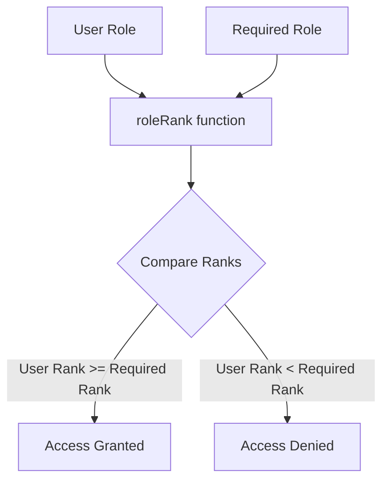
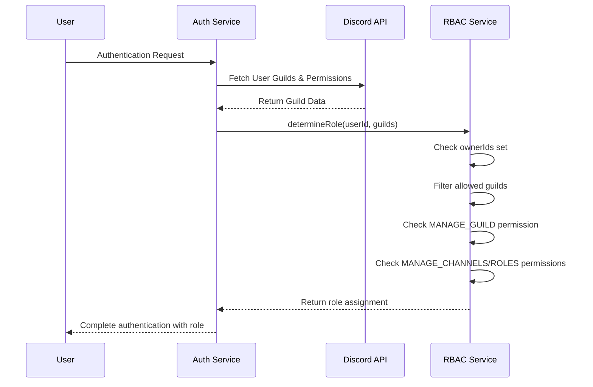
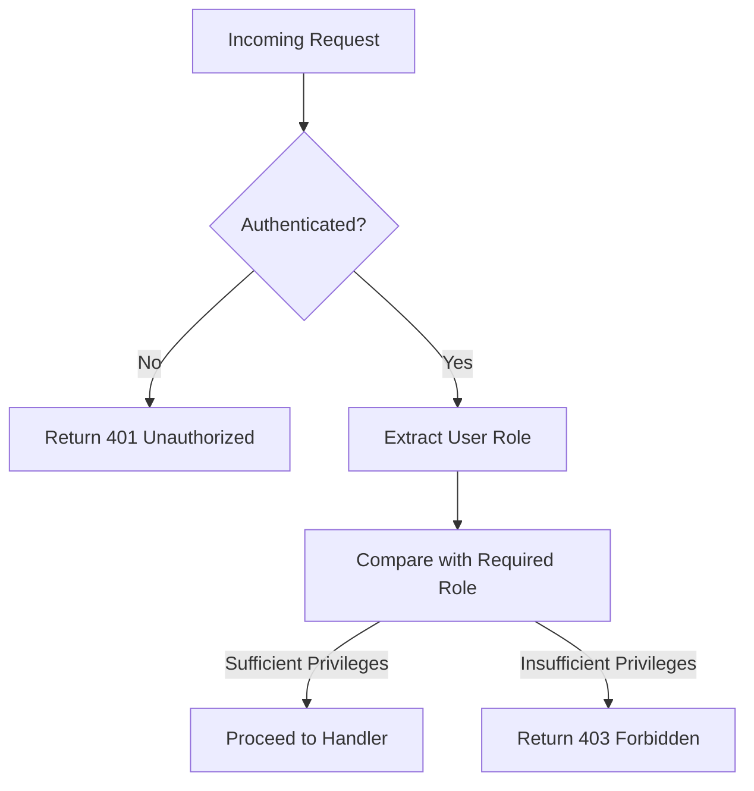

# Role-Based Access Control

<cite>
**Referenced Files in This Document**   
- [rbac.js](file://apps/admin-api/src/services/rbac.js)
- [rbac.js](file://apps/admin-api/src/middleware/rbac.js)
- [config.js](file://apps/admin-api/src/config.js)
- [auth.js](file://apps/admin-api/src/routes/auth.js)
- [errors.js](file://apps/admin-api/src/lib/errors.js)
- [roles.js](file://apps/admin-api/src/lib/roles.js)
- [guilds.js](file://apps/admin-api/src/routes/guilds.js)
- [error-handler.js](file://apps/admin-api/src/middleware/error-handler.js)
</cite>

## Table of Contents
1. [Introduction](#introduction)
2. [Role Hierarchy and Ranking System](#role-hierarchy-and-ranking-system)
3. [Role Assignment and Resolution](#role-assignment-and-resolution)
4. [Role-Based Access Enforcement](#role-based-access-enforcement)
5. [Environment-Based Role Overrides](#environment-based-role-overrides)
6. [Error Handling and Unauthorized Access](#error-handling-and-unauthorized-access)
7. [Integration with Authentication System](#integration-with-authentication-system)
8. [Extending the RBAC System](#extending-the-rbac-system)
9. [Conclusion](#conclusion)

## Introduction

The Role-Based Access Control (RBAC) system in the slimy-monorepo platform provides a comprehensive security framework for managing user permissions across the application. This system implements a hierarchical role model with four primary roles: 'viewer', 'editor', 'admin', and 'owner'. The RBAC implementation combines Discord permission evaluation, environment-based role overrides, and a ranked ordering system to determine user privileges and enforce access controls on API endpoints. The system is integrated throughout the application's middleware layer, ensuring that all sensitive operations are protected by appropriate authorization checks.

**Section sources**
- [rbac.js](file://apps/admin-api/src/services/rbac.js#L1-L65)
- [config.js](file://apps/admin-api/src/config.js#L1-L125)

## Role Hierarchy and Ranking System

The RBAC system implements a ranked ordering system that defines the hierarchy of user roles. The role hierarchy is configured in the application's configuration file with the following order: ['viewer', 'editor', 'admin', 'owner']. This ordering establishes the privilege levels where 'owner' has the highest privileges and 'viewer' has the lowest.

The core function that enables role comparison is `hasRole` from the RBAC service. This function compares a user's current role against a required role by determining their respective positions in the role hierarchy. The `roleRank` function returns the index of a role within the configured order array, with higher indices indicating greater privileges. The `hasRole` function then evaluates whether the user's role rank is greater than or equal to the required role rank, allowing users with higher privileges to access resources that require lower privilege levels.

This ranked system enables flexible access control where users with administrative privileges can perform actions that require editor or viewer permissions, implementing the principle of least privilege while allowing for role inheritance.

**Diagram sources**
- [rbac.js](file://apps/admin-api/src/services/rbac.js#L51-L58)

**Section sources**
- [rbac.js](file://apps/admin-api/src/services/rbac.js#L51-L58)
- [config.js](file://apps/admin-api/src/config.js#L66-L68)

## Role Assignment and Resolution

The RBAC system determines user roles through multiple mechanisms, with the primary method being the evaluation of Discord permissions. The `determineRole` function in the RBAC service evaluates a user's permissions across their guilds to assign appropriate roles based on their capabilities.

The role resolution logic follows a hierarchical evaluation process:
1. First, it checks if the user ID is in the `ADMIN_OWNER_IDS` environment variable, granting 'owner' status immediately
2. Next, it filters the user's guilds to only those allowed by the application configuration
3. It then evaluates Discord permissions to determine the appropriate role:
   - Users with MANAGE_GUILD permission are assigned the 'admin' role
   - Users with MANAGE_CHANNELS or MANAGE_ROLES permissions are assigned the 'editor' role
   - All other users receive the 'viewer' role

The system uses Discord's permission bit flags to evaluate user capabilities, specifically checking for MANAGE_GUILD (0x00000020), MANAGE_CHANNELS (0x00000010), and MANAGE_ROLES (0x10000000) permissions. These bit flags are compared against the user's permission value using bitwise operations to determine if the user possesses the required capabilities.

**Diagram sources**
- [rbac.js](file://apps/admin-api/src/services/rbac.js#L30-L49)
- [auth.js](file://apps/admin-api/src/routes/auth.js#L189-L311)

**Section sources**
- [rbac.js](file://apps/admin-api/src/services/rbac.js#L30-L49)
- [auth.js](file://apps/admin-api/src/routes/auth.js#L189-L311)

## Role-Based Access Enforcement

The RBAC system enforces role requirements through the `requireRole` middleware, which is applied to API routes that require specific privilege levels. This middleware function takes a minimum role parameter and validates that the authenticated user meets or exceeds this requirement.

When a request is processed, the `requireRole` middleware checks the `req.user.role` property against the required role using the `hasRole` function. If the user does not have sufficient privileges, the middleware returns a 403 Forbidden response with an error object. This enforcement mechanism is consistently applied across the application's API routes, ensuring that only authorized users can access protected resources.

The system also includes the `requireGuildAccess` middleware, which combines authentication with guild membership verification. This middleware ensures that users can only access resources related to guilds they are members of, adding an additional layer of access control beyond role-based permissions.

In practice, API routes use these middleware functions in combination with other security measures like CSRF protection to create comprehensive access control. For example, the guild settings endpoint requires both guild access and an 'editor' role minimum, ensuring that only appropriately privileged users within a guild can modify its settings.

**Diagram sources**
- [rbac.js](file://apps/admin-api/src/middleware/rbac.js#L6-L13)
- [guilds.js](file://apps/admin-api/src/routes/guilds.js#L194-L195)

**Section sources**
- [rbac.js](file://apps/admin-api/src/middleware/rbac.js#L6-L13)
- [guilds.js](file://apps/admin-api/src/routes/guilds.js#L194-L195)

## Environment-Based Role Overrides

The RBAC system supports environment-based role overrides through specific environment variables that allow administrators to grant elevated privileges to specific users. These overrides provide a mechanism for granting administrative access without relying solely on Discord permissions.

The system utilizes two primary environment variables for role overrides:
- `ROLE_ADMIN_IDS`: A comma-separated list of Discord user IDs that should be granted admin privileges regardless of their Discord permissions
- `ROLE_CLUB_IDS`: A comma-separated list of Discord user IDs that should be granted club-specific privileges

These environment variables are processed at application startup, with their values parsed into arrays and stored for quick lookup. When determining a user's role, the system checks if the user's ID exists in these override lists, granting the corresponding privileges if a match is found.

Additionally, the system supports owner-level access through the `ADMIN_OWNER_IDS` environment variable, which grants 'owner' status to specified users. This creates a three-tier override system that allows for granular control over administrative privileges at different levels of the application.

The role override system is implemented in the `resolveRoleLevel` function, which checks the user's role IDs against the admin and club ID lists before falling back to the default 'member' role. This mechanism ensures that designated administrators maintain access even if their Discord permissions change.

**Section sources**
- [roles.js](file://apps/admin-api/src/lib/roles.js#L3-L24)
- [config.js](file://apps/admin-api/src/config.js#L68-L69)

## Error Handling and Unauthorized Access

The RBAC system implements comprehensive error handling for unauthorized access attempts and invalid role conditions. When a user attempts to access a resource without sufficient privileges, the system returns a 403 Forbidden response with a standardized error object containing an error code and message.

The error handling is integrated with the application's centralized error management system, which categorizes errors by type and severity. Authorization errors are specifically handled by the `AuthorizationError` and `InsufficientRoleError` classes, which extend the base `AppError` class and provide appropriate HTTP status codes (403) for forbidden access.

When an unauthorized access attempt is detected, the system logs the event with relevant context including the request method, path, user ID, and requested role. This logging enables monitoring of access patterns and helps identify potential security issues. The error response includes a request ID for tracing purposes, facilitating debugging and incident response.

The middleware structure ensures that error handling is consistent across all protected routes. If a user is not authenticated, a 401 Unauthorized response is returned. If the user is authenticated but lacks sufficient privileges, a 403 Forbidden response is returned. This clear distinction between authentication and authorization failures helps clients understand the nature of the access problem.

**Section sources**
- [errors.js](file://apps/admin-api/src/lib/errors.js#L47-L61)
- [error-handler.js](file://apps/admin-api/src/middleware/error-handler.js#L1-L42)

## Integration with Authentication System

The RBAC system is tightly integrated with the application's authentication flow, with role assignment occurring during the user authentication process. When a user logs in via Discord OAuth, their roles are determined based on their Discord permissions and stored in their session.

During the authentication callback, the system fetches the user's guilds and permissions from the Discord API, then uses the `determineRole` function to establish their role level. This role is then included in the user object that is stored in the session and JWT token, making it available for subsequent requests.

The authentication middleware ensures that the user object is properly hydrated on each request by validating the session token and retrieving user information from the database. This process includes attaching the user's role to the `req.user` object, which is then available for role-based access control checks.

The integration also includes support for role inheritance and fallback mechanisms. If a user's role cannot be determined from their Discord permissions, the system falls back to role assignments stored in the database or environment-based overrides. This ensures that users maintain consistent access privileges across sessions.

**Section sources**
- [auth.js](file://apps/admin-api/src/routes/auth.js#L322-L333)
- [auth.js](file://apps/admin-api/src/middleware/auth.js#L27-L211)

## Extending the RBAC System

The RBAC system is designed to be extensible, allowing for the addition of custom roles and permission mappings. To extend the role hierarchy, developers can modify the `ROLE_ORDER` array in the configuration file to include additional roles between the existing levels.

Custom role mappings can be implemented by adding new environment variables similar to the existing `ROLE_ADMIN_IDS` and `ROLE_CLUB_IDS` variables. These would be processed at startup and incorporated into the role resolution logic. For example, a new `ROLE_MODERATOR_IDS` variable could be added to grant moderator privileges to specific users.

The permission evaluation system can also be extended to support additional Discord permissions or custom application-specific permissions. New permission checks can be added to the `PERMISSIONS` object in the RBAC service, and corresponding role assignment logic can be implemented in the `determineRole` function.

When extending the system, it's important to maintain the integrity of the role hierarchy and ensure that new roles are properly integrated with the existing `hasRole` comparison function. Any new middleware or route protections should use the standardized `requireRole` function to maintain consistency across the application.

**Section sources**
- [config.js](file://apps/admin-api/src/config.js#L67-L68)
- [rbac.js](file://apps/admin-api/src/services/rbac.js#L5-L9)

## Conclusion

The Role-Based Access Control system in the slimy-monorepo platform provides a robust and flexible security framework for managing user permissions. By combining Discord permission evaluation, environment-based role overrides, and a ranked role hierarchy, the system effectively protects application resources while allowing for granular access control. The integration with the authentication system ensures that role assignments are consistent across sessions, while the comprehensive error handling provides clear feedback for unauthorized access attempts. The extensible design allows for future enhancements to the role system while maintaining backward compatibility with existing functionality.