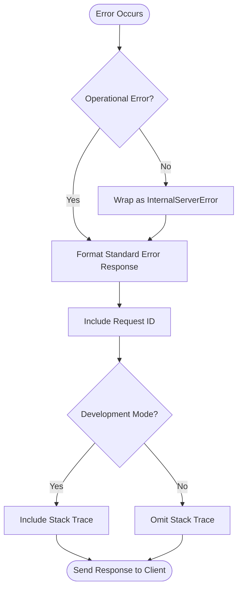
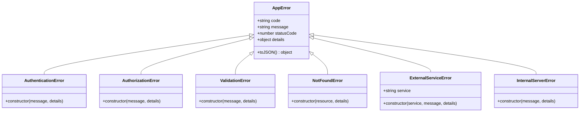
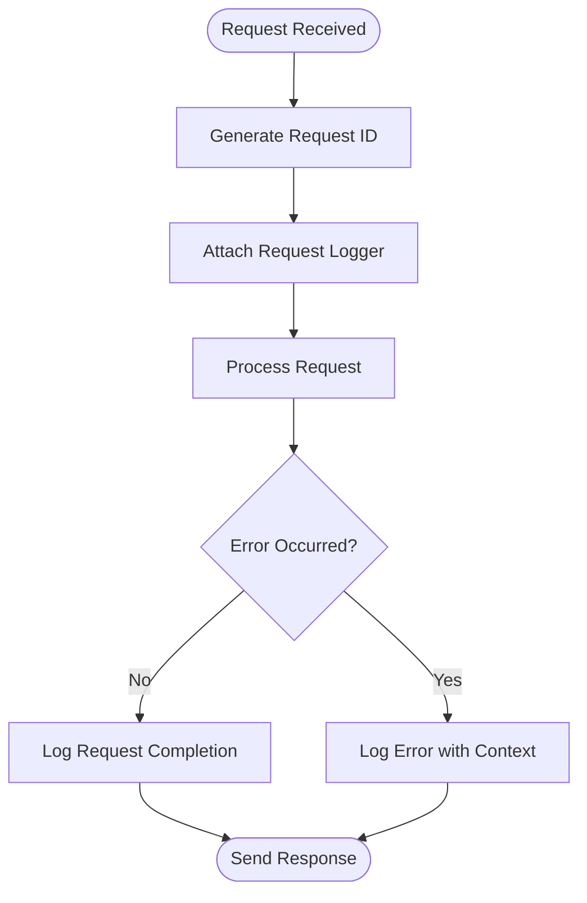

# Error Handling and Information Security

<cite>
**Referenced Files in This Document**   
- [errors.js](file://apps/admin-api/src/lib/errors.js)
- [error-handler.js](file://apps/admin-api/src/middleware/error-handler.js)
- [logger.js](file://apps/admin-api/src/lib/logger.js)
- [security.js](file://apps/admin-api/src/middleware/security.js)
- [auth.js](file://apps/admin-api/src/middleware/auth.js)
- [errors.ts](file://apps/web/lib/errors.ts)
- [api-error-handler.ts](file://apps/web/lib/api-error-handler.ts)
- [ERROR_HANDLING.md](file://apps/admin-api/ERROR_HANDLING.md)
</cite>

## Table of Contents
1. [Introduction](#introduction)
2. [Core Error Handling Strategy](#core-error-handling-strategy)
3. [Security Implementation for Error Responses](#security-implementation-for-error-responses)
4. [Centralized Error Handling Architecture](#centralized-error-handling-architecture)
5. [Custom Error Types and Middleware](#custom-error-types-and-middleware)
6. [Validation Error Sanitization](#validation-error-sanitization)
7. [Security Implications of Error Verbosity](#security-implications-of-error-verbosity)
8. [Secure vs Insecure Error Response Examples](#secure-vs-insecure-error-response-examples)
9. [Edge Case Handling](#edge-case-handling)
10. [Logging Strategy](#logging-strategy)

## Introduction

The slimy-monorepo platform implements a comprehensive error handling and information security strategy designed to prevent sensitive information leakage while maintaining effective debugging capabilities. The system employs a centralized error handling approach that ensures consistent error payloads across all endpoints, with particular attention to security-sensitive error types such as unauthorized (401) and forbidden (403) responses. This document details the implementation of custom error types, middleware handling, validation sanitization, and the balance between production security and development debugging needs.

**Section sources**
- [ERROR_HANDLING.md](file://apps/admin-api/ERROR_HANDLING.md#L1-L216)

## Core Error Handling Strategy

The platform's error handling strategy is built around a hierarchical system of custom error classes that extend a base `AppError` class. This approach ensures consistent error formatting and appropriate HTTP status codes across all services. The system distinguishes between operational errors (expected error conditions) and non-operational errors (unexpected system failures), handling each appropriately.

For unauthorized (401) and forbidden (403) errors, the system returns generic, user-friendly messages that do not reveal specific details about authentication or authorization failures. This prevents attackers from gaining insights into the system's security mechanisms through error message analysis. All error responses follow a standardized format with a consistent structure, ensuring predictable client behavior across different endpoints.

The error handling system is designed to be both developer-friendly during development and secure in production. Stack traces are included in error responses only in development mode, preventing the exposure of internal code structure in production environments. Request IDs are included in all error responses, enabling effective debugging and issue tracking without compromising security.

**Section sources**
- [errors.js](file://apps/admin-api/src/lib/errors.js#L1-L253)
- [errors.ts](file://apps/web/lib/errors.ts#L1-L282)

## Security Implementation for Error Responses

The platform implements strict security measures for error responses to prevent information leakage. Unauthorized (401) and forbidden (403) errors return generic messages that do not distinguish between authentication and authorization failures, preventing attackers from determining whether a resource exists or whether they lack permission to access it.

The system uses a centralized error formatting function that sanitizes error details before sending them to clients. Sensitive information such as database connection strings, file paths, and internal server configurations are never included in client-facing error messages. Even in development mode, the system limits the exposure of potentially sensitive information while still providing sufficient context for debugging.

Error responses are structured to include only the minimum necessary information for client applications to handle errors appropriately. The standardized error format includes an error code, user-friendly message, and request ID, but excludes implementation details that could be exploited by malicious actors. This approach balances the need for meaningful error information with the imperative to protect system security.



**Diagram sources**
- [errors.js](file://apps/admin-api/src/lib/errors.js#L157-L179)
- [error-handler.js](file://apps/admin-api/src/middleware/error-handler.js#L37-L38)

## Centralized Error Handling Architecture

The platform employs a centralized error handling architecture that ensures consistent error processing across all endpoints. The core component is the error handler middleware, which intercepts all errors and processes them through a standardized pipeline. This middleware is responsible for logging errors with appropriate context, formatting error responses, and ensuring that all errors are handled consistently.

The architecture includes an async handler wrapper that automatically catches errors from asynchronous route handlers, preventing unhandled promise rejections. This wrapper forwards errors to the centralized error handler, ensuring that all errors, regardless of origin, are processed through the same pipeline. The system also includes a 404 handler that provides consistent responses for non-existent routes.

Request ID tracking is integrated throughout the error handling pipeline, enabling end-to-end request tracing. Each request is assigned a unique ID that is included in all log entries and error responses, allowing developers to correlate logs and debug issues effectively. This tracking system is implemented through middleware that generates request IDs and attaches them to both the request and response objects.

**Section sources**
- [error-handler.js](file://apps/admin-api/src/middleware/error-handler.js#L1-L82)
- [ERROR_HANDLING.md](file://apps/admin-api/ERROR_HANDLING.md#L59-L72)

## Custom Error Types and Middleware

The platform defines a comprehensive set of custom error types that cover various error scenarios. These include authentication errors (401), authorization errors (403), validation errors (400), not found errors (404), external service errors (502), configuration errors (503), and internal server errors (500). Each error type extends the base `AppError` class and includes appropriate HTTP status codes and error codes.

The authentication middleware implements specific error handling for authentication and authorization failures. When a request lacks valid authentication, the system returns a 401 Unauthorized error with a generic message. For authorization failures, it returns a 403 Forbidden error, also with a generic message. This prevents attackers from distinguishing between non-existent resources and resources they lack permission to access.

The error handling middleware processes all errors through a consistent pipeline. It first determines whether an error is operational (expected) or non-operational (unexpected). Operational errors are formatted and returned to the client, while non-operational errors are wrapped in a generic internal server error to prevent information leakage. The middleware also ensures that all errors are logged with appropriate context, including the request method, path, and user information when available.



**Diagram sources**
- [errors.js](file://apps/admin-api/src/lib/errors.js#L6-L253)
- [errors.ts](file://apps/web/lib/errors.ts#L11-L282)

## Validation Error Sanitization

The platform implements robust validation error sanitization to prevent information leakage through validation responses. When validation errors occur, the system formats them in a standardized way that provides sufficient information for clients to correct input errors without exposing internal validation logic or data structure details.

Validation errors are processed through dedicated middleware that sanitizes error details before inclusion in the response. The system uses Zod for schema validation, and validation errors are transformed into a consistent format that includes only the path, message, and code of each validation issue. This prevents the exposure of internal schema details or validation implementation specifics.

The sanitization process ensures that error messages are user-friendly and do not reveal sensitive information about the validation process. For example, instead of revealing specific validation rules or database constraints, the system returns generic messages that guide users toward correct input without disclosing implementation details. This approach maintains usability while protecting against information disclosure vulnerabilities.

**Section sources**
- [api-error-handler.ts](file://apps/web/lib/api-error-handler.ts#L32-L43)
- [schemas.ts](file://apps/web/lib/validation/schemas.ts#L1-L188)

## Security Implications of Error Verbosity

The platform carefully balances the need for detailed error information during development with the security requirements of production environments. In development mode, error responses include stack traces and more detailed information to facilitate debugging. However, in production, this information is suppressed to prevent the exposure of internal system details.

The system recognizes that verbose error messages can provide attackers with valuable information about the application's structure, technology stack, and potential vulnerabilities. By limiting error verbosity in production, the platform reduces the attack surface and makes it more difficult for attackers to exploit system weaknesses.

The implementation includes a configuration option to control log levels, allowing administrators to adjust the verbosity of server-side logging without affecting client-facing error messages. This enables detailed logging for monitoring and debugging while maintaining secure client responses. The system also includes rate limiting and other security measures to prevent abuse of error responses for reconnaissance purposes.

**Section sources**
- [errors.js](file://apps/admin-api/src/lib/errors.js#L158-L177)
- [logger.js](file://apps/admin-api/src/lib/logger.js#L5-L6)

## Secure vs Insecure Error Response Examples

The platform demonstrates clear differences between secure and insecure error response patterns. Secure error responses provide generic, user-friendly messages that do not reveal implementation details, while insecure patterns would expose sensitive information.

**Secure Error Response (401 Unauthorized):**
```json
{
  "ok": false,
  "error": {
    "code": "AUTH_REQUIRED",
    "message": "Authentication required",
    "requestId": "aa672e1f-4665-4f80-b3ee-15abe6bb1d89"
  }
}
```

**Insecure Error Response (Example to Avoid):**
```json
{
  "ok": false,
  "error": {
    "code": "AUTH_FAILED",
    "message": "JWT token validation failed: invalid signature",
    "details": {
      "token": "eyJhbGciOiJIUzI1NiIsInR5cCI6IkpXVCJ9.xxxxx",
      "algorithm": "HS256",
      "issuer": "slimy-admin-api"
    },
    "stack": "Error: Invalid token signature\n    at validateToken..."
  }
}
```

**Secure Error Response (403 Forbidden):**
```json
{
  "ok": false,
  "error": {
    "code": "FORBIDDEN",
    "message": "Insufficient permissions",
    "requestId": "aa672e1f-4665-4f80-b3ee-15abe6bb1d89"
  }
}
```

**Insecure Error Response (Example to Avoid):**
```json
{
  "ok": false,
  "error": {
    "code": "ACCESS_DENIED",
    "message": "User role 'member' does not have permission to access this resource",
    "details": {
      "requiredRole": "admin",
      "userRoles": ["member"],
      "resourcePath": "/api/admin/users"
    }
  }
}
```

The secure patterns prevent attackers from determining whether a resource exists, what authentication mechanisms are in use, or what permissions are required to access resources. This reduces the effectiveness of reconnaissance attacks and helps protect the system against unauthorized access.

**Section sources**
- [ERROR_HANDLING.md](file://apps/admin-api/ERROR_HANDLING.md#L77-L101)
- [errors.js](file://apps/admin-api/src/lib/errors.js#L29-L60)

## Edge Case Handling

The platform implements specific handling for various edge cases to ensure robust error management and security. For malformed JWT tokens, the system returns a generic authentication error without revealing details about the token structure or validation failure. This prevents attackers from using error responses to probe the JWT implementation.

Database connection failures are handled by returning a generic internal server error (500) rather than exposing database-specific error messages. This prevents the disclosure of database configuration details, connection strings, or schema information. The system logs detailed database error information server-side for monitoring and debugging, but this information is never exposed to clients.

The platform also handles rate limiting edge cases, returning consistent rate limit responses that do not reveal specific rate limit parameters or client-specific limits. This prevents attackers from determining the exact rate limits in place or testing the system's rate limiting behavior.

For external service failures, the system returns generic service unavailable errors (502) without exposing details about the external service or the nature of the failure. This maintains the abstraction layer between the platform and its dependencies, preventing the exposure of integration details that could be exploited.

**Section sources**
- [errors.js](file://apps/admin-api/src/lib/errors.js#L95-L106)
- [auth.js](file://apps/admin-api/src/middleware/auth.js#L206-L210)
- [database.js](file://apps/admin-api/src/lib/database.js#L30-L35)

## Logging Strategy

The platform employs a comprehensive logging strategy that captures detailed error information server-side while exposing minimal details to clients. The system uses Pino for high-performance structured logging, with JSON-formatted logs in production and pretty-printed logs in development.

Error logs include extensive context such as request ID, method, path, query parameters, request body, and user information when available. This enables effective debugging and issue diagnosis while maintaining a complete audit trail. Client errors (4xx) are logged at the warning level, while server errors (5xx) are logged at the error level, facilitating monitoring and alerting.

The logging system includes request duration tracking, enabling performance monitoring and identification of slow endpoints. Request logs capture the start and completion of each request, including the response status code and duration. This provides valuable insights into system performance and user behavior.

The platform integrates request IDs into the logging system, enabling end-to-end request tracing across services. This allows developers to correlate logs from different components and diagnose issues more effectively. The logging configuration can be adjusted via environment variables, allowing administrators to control log verbosity based on the environment and operational needs.



**Diagram sources**
- [logger.js](file://apps/admin-api/src/lib/logger.js#L100-L136)
- [ERROR_HANDLING.md](file://apps/admin-api/ERROR_HANDLING.md#L107-L141)