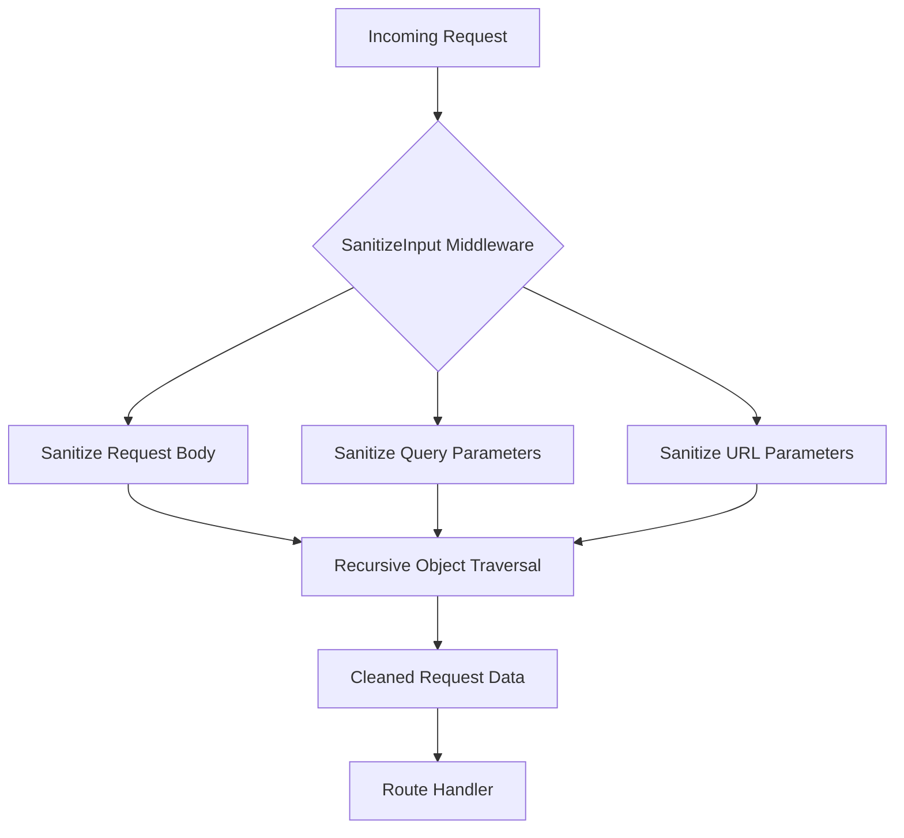
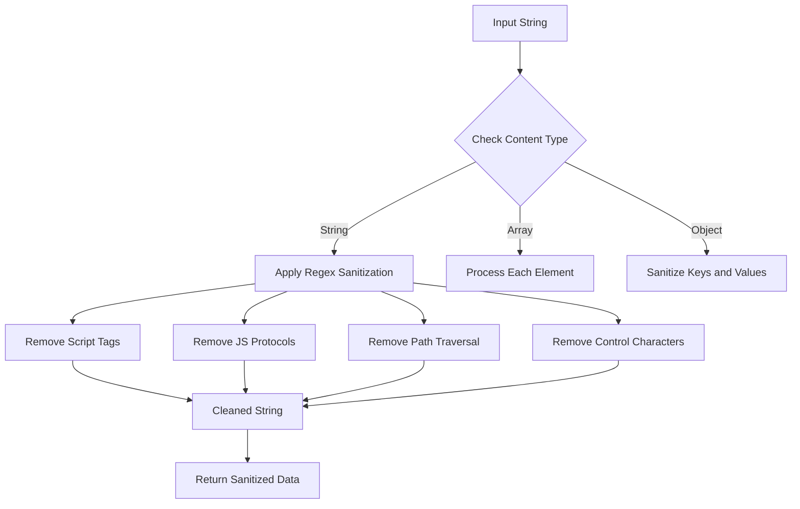
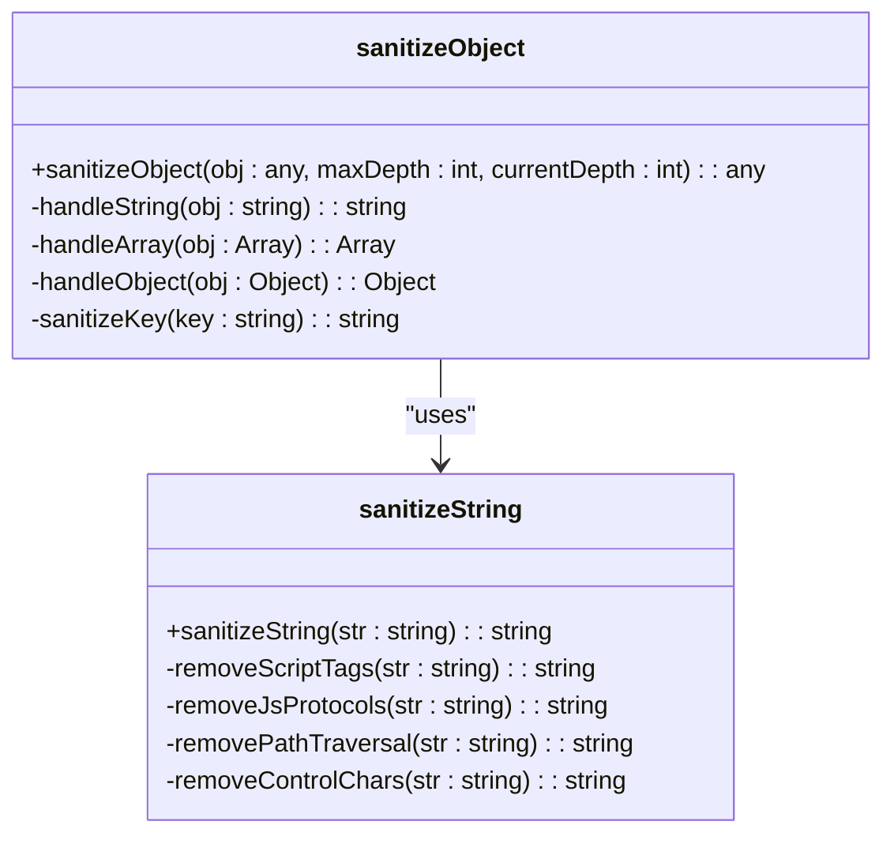
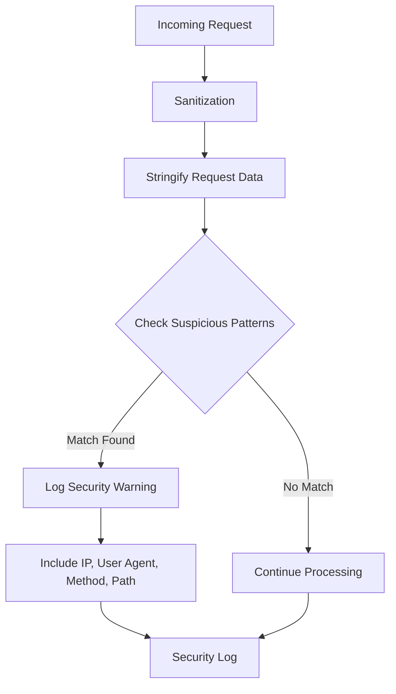
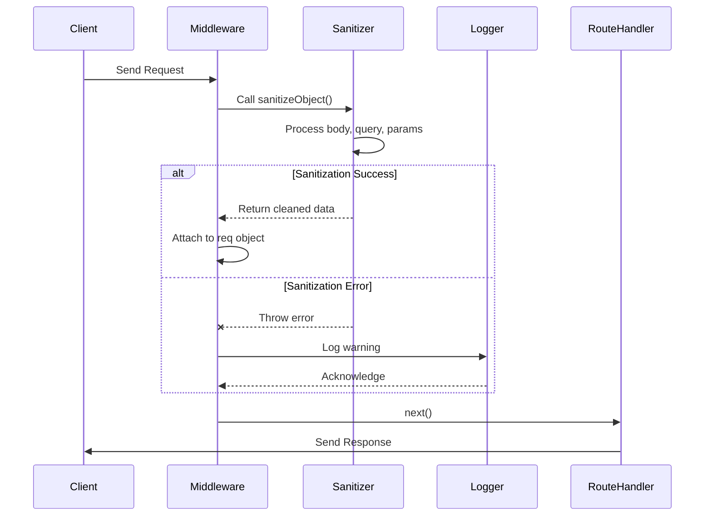
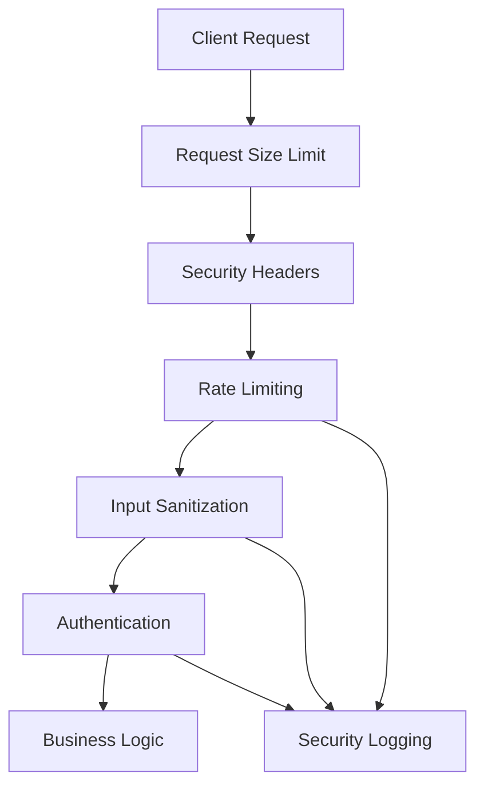

# Input Validation and Sanitization

<cite>
**Referenced Files in This Document**   
- [security.js](file://apps/admin-api/src/middleware/security.js)
- [index.ts](file://packages/shared-auth/src/index.ts)
- [index.test.ts](file://packages/shared-auth/src/index.test.ts)
</cite>

## Table of Contents
1. [Introduction](#introduction)
2. [SanitizeInput Middleware Overview](#sanitizeinput-middleware-overview)
3. [Sanitization Rules and Patterns](#sanitization-rules-and-patterns)
4. [String and Object Sanitization Functions](#string-and-object-sanitization-functions)
5. [Suspicious Pattern Detection](#suspicious-pattern-detection)
6. [Data Reattachment and Error Handling](#data-reattachment-and-error-handling)
7. [Attack Payload Examples](#attack-payload-examples)
8. [Security and Data Integrity Balance](#security-and-data-integrity-balance)
9. [Integration with Security Layers](#integration-with-security-layers)

## Introduction
The slimy-monorepo platform implements a comprehensive input validation and sanitization system to protect against various web-based attacks. This document details the sanitizeInput middleware and related security mechanisms that process incoming requests to remove malicious content while maintaining application functionality.

**Section sources**
- [security.js](file://apps/admin-api/src/middleware/security.js#L97-L284)

## SanitizeInput Middleware Overview
The sanitizeInput middleware recursively processes request body, query parameters, and URL parameters to remove potentially malicious content. It operates as an Express.js middleware function that intercepts requests before they reach route handlers, ensuring all input data is cleaned before processing.

The middleware systematically examines all request components:
- Request body (req.body)
- Query parameters (req.query)
- URL parameters (req.params)

Each component is processed through recursive sanitization functions that handle nested objects and arrays, ensuring comprehensive protection against injection attacks.

**Diagram sources**
- [security.js](file://apps/admin-api/src/middleware/security.js#L190-L205)

**Section sources**
- [security.js](file://apps/admin-api/src/middleware/security.js#L98-L207)

## Sanitization Rules and Patterns
The sanitization system implements multiple rules to remove various types of malicious content:

### Malicious Content Removal
- **Script tags**: Complete removal of `` → `alert('xss')` (script tag removed)
- `` → `` (event handler removed)
- `javascript:alert('xss')` → `alert('xss')` (javascript protocol removed)

### Path Traversal Attempts
- `../../../etc/passwd` → `etc/passwd` (path traversal sequences removed)
- `..\\..\\windows\\system32` → `windows\\system32` (Windows path traversal removed)

### SQL Injection Attempts
- `admin' OR '1'='1` → `admin OR 1=1` (quotes and operators partially neutralized)
- `'; DROP TABLE users; --` → ` DROP TABLE users  ` (comment and statement terminators removed)

### iframe Injection
- `<iframe src="malicious.com"></iframe>` → `` (entire iframe tag removed)

### Template Injection
- `{{7*7}}` → `` (template expression removed)
- `malicious` → ` if True  malicious  endif ` (template tags removed)

These examples demonstrate the system's effectiveness in removing malicious content while preserving legitimate data.

**Section sources**
- [index.test.ts](file://packages/shared-auth/src/index.test.ts#L163-L190)
- [security.js](file://apps/admin-api/src/middleware/security.js#L112-L115)

## Security and Data Integrity Balance
The system strikes a careful balance between security and data integrity:

- **Continued processing**: The system continues processing requests even if sanitization fails, preventing denial-of-service conditions
- **Non-destructive cleaning**: Sanitization removes malicious patterns but preserves legitimate content
- **Graceful degradation**: Security features fail open rather than fail closed, maintaining availability
- **Comprehensive coverage**: All input vectors (body, query, params) are sanitized to prevent bypass attempts
- **Performance considerations**: Limits on recursion depth, array size, and object keys prevent resource exhaustion attacks

This approach recognizes that perfect security can sometimes conflict with usability and availability, opting for a pragmatic defense-in-depth strategy that reduces risk without compromising core functionality.

**Section sources**
- [security.js](file://apps/admin-api/src/middleware/security.js#L201-L204)

## Integration with Security Layers
The input sanitization system integrates with other security layers to provide comprehensive protection:

- **Rate limiting**: Works with authRateLimit, apiRateLimit, and chatRateLimit to prevent brute force and DoS attacks
- **Security headers**: Complements helmet-based security headers (CSP, HSTS, frameguard)
- **Request size limiting**: Collaborates with requestSizeLimit middleware to prevent large payload attacks
- **Security logging**: Provides data to securityLogger for monitoring and incident response
- **Authentication**: Works alongside auth middleware to protect authenticated endpoints

The layered approach follows security best practices, ensuring that even if one layer is bypassed, others provide additional protection. This defense-in-depth strategy enhances overall system resilience against various attack vectors.

**Diagram sources**
- [security.js](file://apps/admin-api/src/middleware/security.js#L11-L284)

**Section sources**
- [security.js](file://apps/admin-api/src/middleware/security.js#L11-L284)