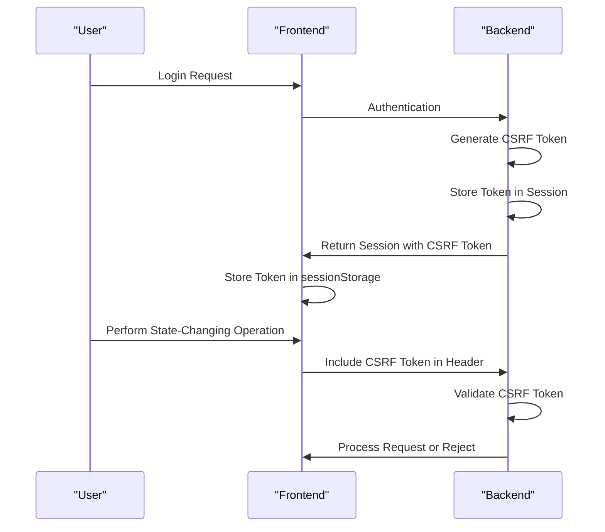
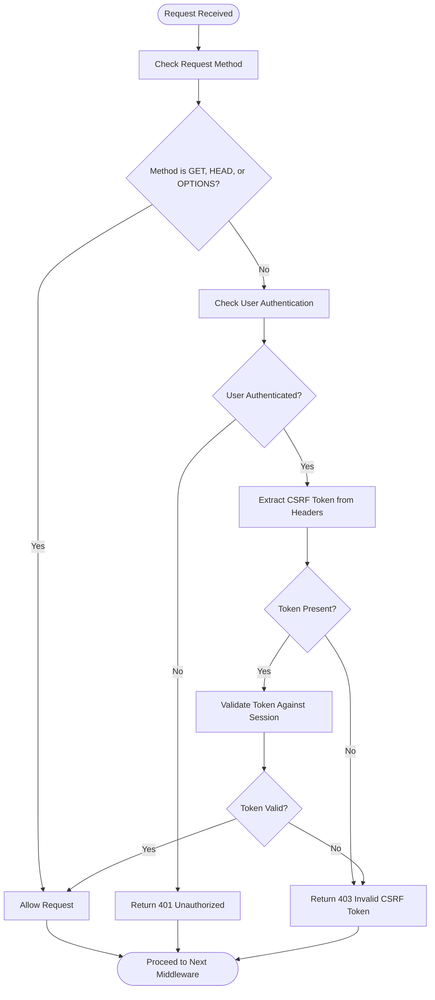
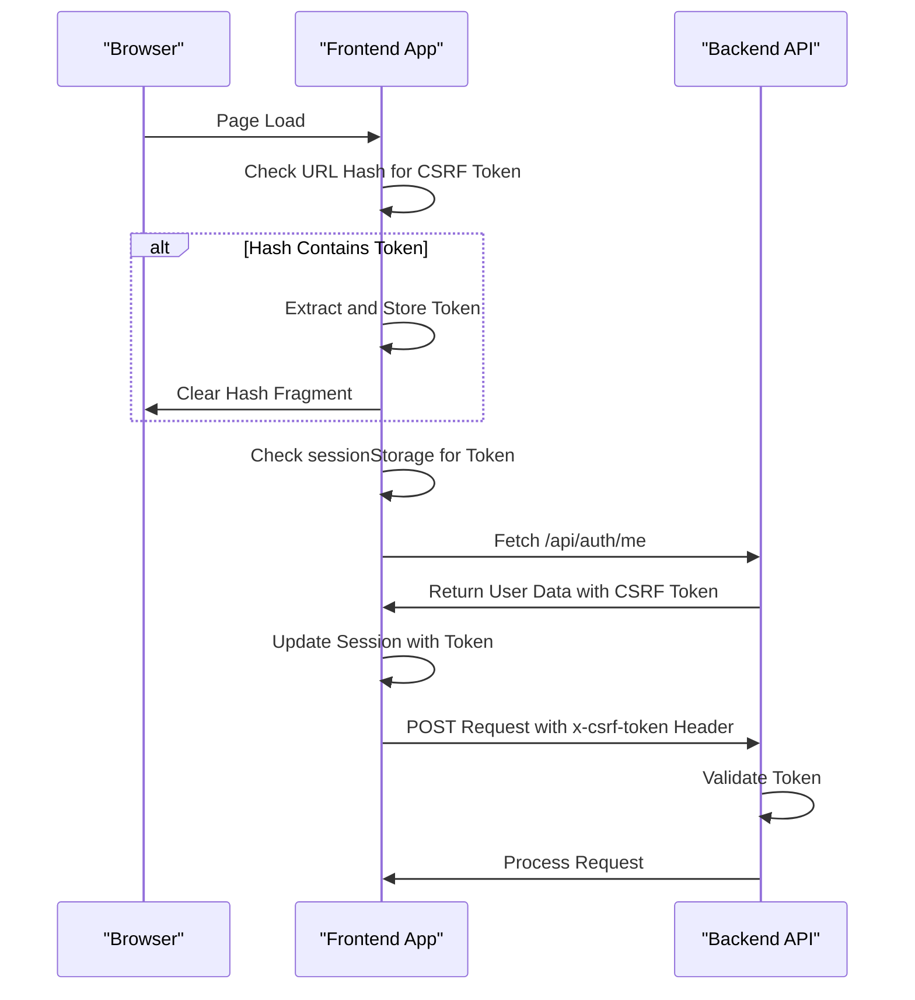

# CSRF Protection

<cite>
**Referenced Files in This Document**   
- [csrf.js](file://apps/admin-api/src/middleware/csrf.js)
- [config.js](file://apps/admin-api/src/config.js)
- [token.js](file://apps/admin-api/src/services/token.js)
- [auth.js](file://apps/admin-api/src/middleware/auth.js)
- [auth.js](file://apps/admin-api/src/routes/auth.js)
- [session.js](file://apps/admin-ui/lib/session.js)
- [api.js](file://apps/admin-ui/lib/api.js)
</cite>

## Table of Contents
1. [Introduction](#introduction)
2. [CSRF Token Generation and Lifecycle](#csrf-token-generation-and-lifecycle)
3. [requireCsrf Middleware Implementation](#requirecsrf-middleware-implementation)
4. [Token Validation Process](#token-validation-process)
5. [Frontend Token Management](#frontend-token-management)
6. [Integration with Authentication and Session Management](#integration-with-authentication-and-session-management)
7. [Security Implications and Best Practices](#security-implications-and-best-practices)
8. [Attack Vectors and Mitigation Strategies](#attack-vectors-and-mitigation-strategies)
9. [Exemptions for Safe Methods](#exemptions-for-safe-methods)
10. [Integration with RBAC System](#integration-with-rbac-system)

## Introduction
The CSRF protection mechanism in the slimy-monorepo platform is designed to prevent Cross-Site Request Forgery attacks by validating CSRF tokens for state-changing operations such as POST, PUT, DELETE, and PATCH. This document details the implementation of the `requireCsrf` middleware, the generation and attachment of CSRF tokens, validation processes, integration with authentication flows, and security implications.

**Section sources**
- [csrf.js](file://apps/admin-api/src/middleware/csrf.js)
- [config.js](file://apps/admin-api/src/config.js)

## CSRF Token Generation and Lifecycle
CSRF tokens are generated during the user session creation process and are stored within the user's session object. The token is created using the `nanoid` library with a 32-character length, ensuring high entropy and unpredictability. The token is embedded in the JWT session payload and made available to the frontend through the `/api/auth/me` endpoint.

The lifecycle of a CSRF token begins at user authentication, where it is generated and attached to the session. It remains valid for the duration of the user's session and is regenerated upon each new login. The token is securely stored in the backend session and transmitted to the frontend over secure channels.

**Diagram sources**
- [token.js](file://apps/admin-api/src/services/token.js#L35-L48)
- [session.js](file://apps/admin-ui/lib/session.js#L48-L68)

**Section sources**
- [token.js](file://apps/admin-api/src/services/token.js#L35-L48)
- [session.js](file://apps/admin-ui/lib/session.js#L48-L68)

## requireCsrf Middleware Implementation
The `requireCsrf` middleware is responsible for enforcing CSRF protection on state-changing HTTP methods. It operates by checking if the incoming request method is one of the safe methods (GET, HEAD, OPTIONS), in which case it allows the request to proceed without CSRF validation. For unsafe methods (POST, PUT, DELETE, PATCH), it performs strict CSRF token validation.

The middleware retrieves the expected CSRF token from the authenticated user's session (`req.user.csrfToken`) and compares it against the token provided in the request headers. The header name is configurable via the `config.csrf.headerName` setting, which defaults to `x-csrf-token`. The middleware checks both the exact header name and its lowercase variant to ensure compatibility across different client implementations.

**Diagram sources**
- [csrf.js](file://apps/admin-api/src/middleware/csrf.js#L7-L25)
- [config.js](file://apps/admin-api/src/config.js#L57-L59)

**Section sources**
- [csrf.js](file://apps/admin-api/src/middleware/csrf.js#L7-L25)

## Token Validation Process
The token validation process involves several steps to ensure the integrity and authenticity of the CSRF token. When a request is received, the middleware first checks if the request method is exempt from CSRF protection (safe methods). If not, it proceeds to validate the token by retrieving it from the request headers using the configured header name (`x-csrf-token` by default).

The validation compares the provided token with the one stored in the user's session (`req.user.csrfToken`). A strict equality check is performed, and if the tokens do not match or if the token is missing, the request is rejected with a 403 Forbidden response. This process prevents attackers from forging requests on behalf of authenticated users, as they would not have access to the user-specific CSRF token.

**Section sources**
- [csrf.js](file://apps/admin-api/src/middleware/csrf.js#L16-L22)

## Frontend Token Management
The frontend manages CSRF tokens through the `SessionProvider` component, which handles token storage and retrieval. Tokens are stored in `sessionStorage` using the key `slimy_admin_csrf`, providing isolation between browser tabs and sessions. The frontend also supports token delivery via URL hash fragments (`#csrf=token`), which are automatically extracted and stored upon page load.

The `apiFetch` function in the frontend library automatically includes the CSRF token in the `x-csrf-token` header for all non-GET requests, ensuring that state-changing operations are properly protected. This integration is seamless, as the token is automatically retrieved from the session context and attached to outgoing requests.

**Diagram sources**
- [session.js](file://apps/admin-ui/lib/session.js#L13-L46)
- [api.js](file://apps/admin-ui/lib/api.js#L24-L32)

**Section sources**
- [session.js](file://apps/admin-ui/lib/session.js#L13-L46)
- [api.js](file://apps/admin-ui/lib/api.js#L24-L32)

## Integration with Authentication and Session Management
The CSRF protection mechanism is tightly integrated with the authentication and session management system. During the authentication flow, when a user successfully logs in via Discord OAuth, a new session is created that includes a freshly generated CSRF token. This token is embedded in the JWT session token and stored in the database for persistence.

The session management system ensures that CSRF tokens are rotated with each new session, preventing token reuse across different login sessions. The integration with the RBAC system ensures that only authenticated users with appropriate roles can perform state-changing operations, with CSRF protection acting as an additional layer of security.

**Section sources**
- [auth.js](file://apps/admin-api/src/routes/auth.js#L399-L402)
- [token.js](file://apps/admin-api/src/services/token.js#L35-L48)

## Security Implications and Best Practices
The CSRF protection implementation follows security best practices by using cryptographically secure tokens, validating them on every state-changing request, and storing them securely. The use of `sessionStorage` for token storage prevents accidental leakage through referer headers or JavaScript injection attacks.

Best practices include using unpredictable token values, ensuring token uniqueness per session, and transmitting tokens over secure channels. The system also implements proper error handling, returning appropriate HTTP status codes without exposing sensitive information.

**Section sources**
- [csrf.js](file://apps/admin-api/src/middleware/csrf.js)
- [session.js](file://apps/admin-ui/lib/session.js)

## Attack Vectors and Mitigation Strategies
Potential attack vectors include missing header checks, token leakage, and session fixation. The current implementation mitigates these risks by enforcing strict header validation, using secure storage mechanisms, and rotating tokens with each session.

Mitigation strategies include:
- Validating both exact and lowercase header names to prevent bypass via case manipulation
- Using `sessionStorage` instead of cookies to store tokens, reducing exposure to XSS attacks
- Implementing proper token expiration and rotation
- Ensuring all state-changing operations require CSRF validation

The system prevents CSRF bypass via missing header checks by explicitly validating the presence and correctness of the CSRF token in the request headers.

**Section sources**
- [csrf.js](file://apps/admin-api/src/middleware/csrf.js#L16-L22)
- [api.js](file://apps/admin-ui/lib/api.js#L30-L32)

## Exemptions for Safe Methods
The CSRF protection mechanism exempts safe HTTP methods (GET, HEAD, OPTIONS) from token validation, as these methods are not intended to cause state changes. This exemption follows the principle of least privilege, applying protection only where necessary.

The `SAFE_METHODS` set in the middleware explicitly defines these exempt methods, ensuring that read-only operations can proceed without requiring CSRF tokens. This improves usability while maintaining security for state-changing operations.

**Section sources**
- [csrf.js](file://apps/admin-api/src/middleware/csrf.js#L5-L6)

## Integration with RBAC System
The CSRF protection mechanism integrates with the Role-Based Access Control (RBAC) system by operating at the middleware layer, where both authentication and authorization are enforced. The `requireCsrf` middleware is typically used in conjunction with `requireAuth` and `requireRole` middlewares, creating a layered security approach.

This integration ensures that users must first be authenticated and have the appropriate role before their CSRF token is even validated, providing defense in depth. The RBAC system handles role-based permissions, while CSRF protection prevents unauthorized state changes, even for authenticated users.

**Section sources**
- [auth.js](file://apps/admin-api/src/middleware/auth.js#L245-L256)
- [csrf.js](file://apps/admin-api/src/middleware/csrf.js)