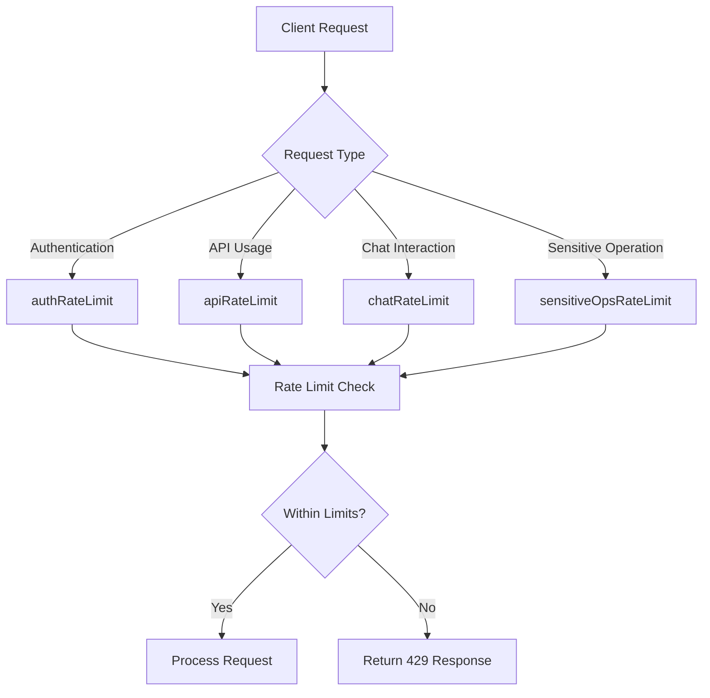
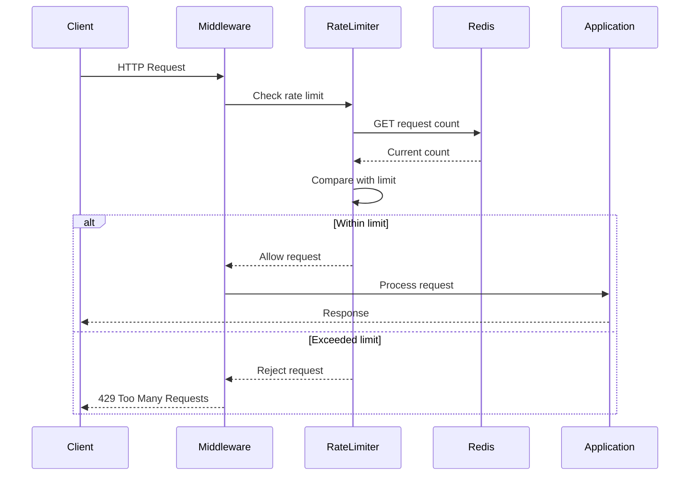
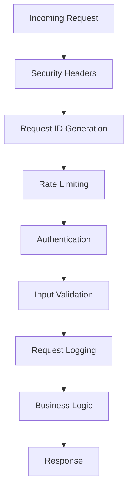
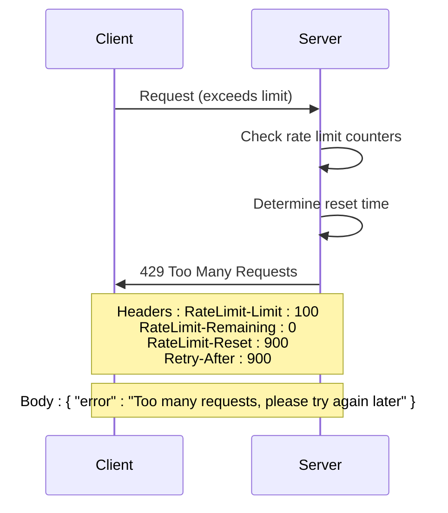
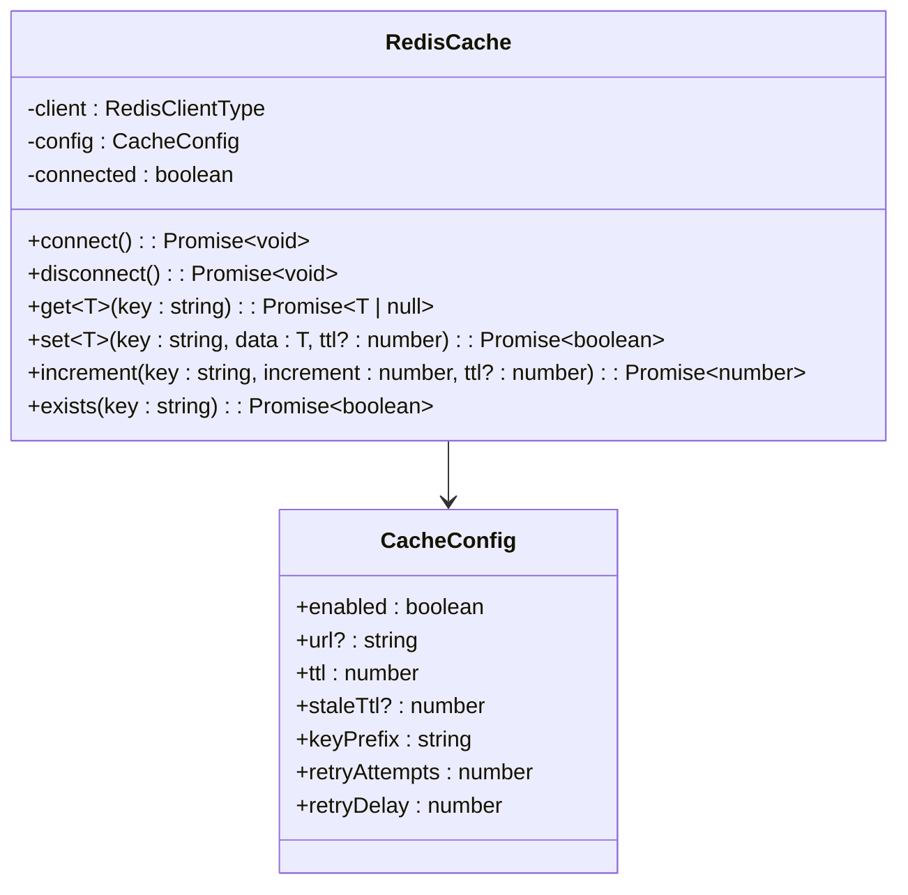
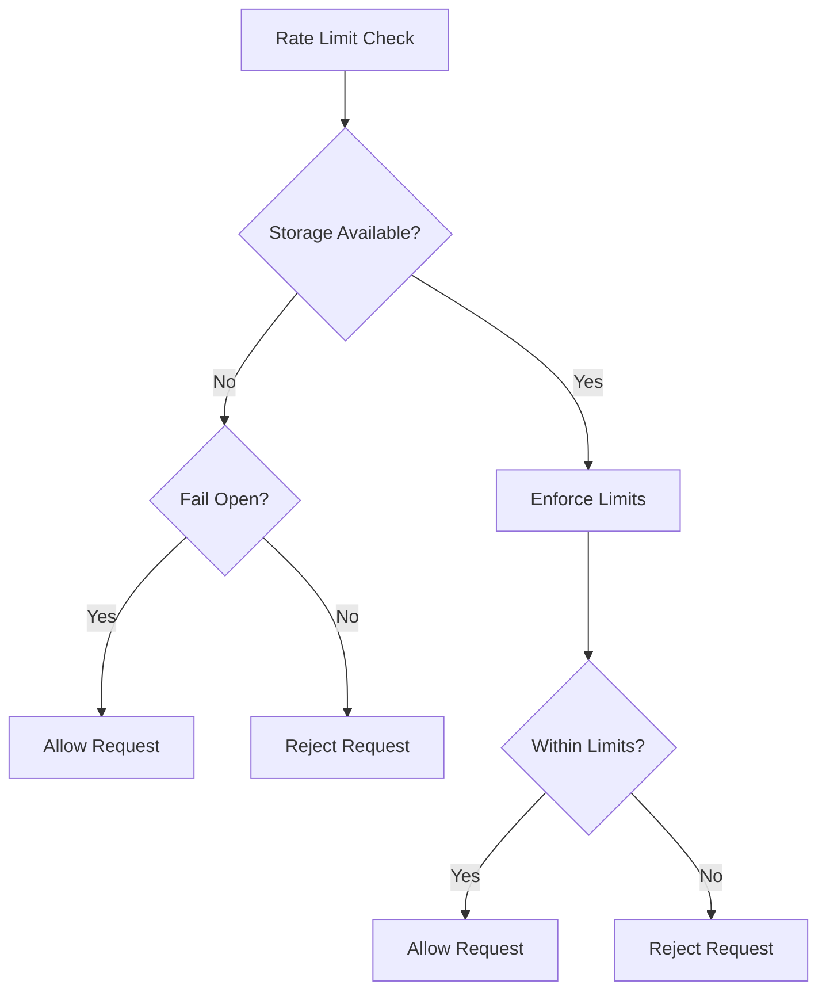
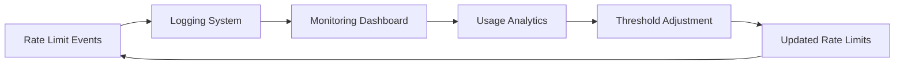

# Rate Limiting Strategies

<cite>
**Referenced Files in This Document**   
- [rate-limit.js](file://apps/admin-api/src/middleware/rate-limit.js)
- [security.js](file://apps/admin-api/src/middleware/security.js)
- [security.ts](file://apps/admin-api/src/middleware/security.ts)
- [rate-limiter.ts](file://apps/web/lib/rate-limiter.ts)
- [ddos-protection.ts](file://apps/web/lib/security/ddos-protection.ts)
- [index.js](file://apps/admin-api/src/lib/config/index.js)
- [config.ts](file://apps/web/lib/config.ts)
</cite>

## Table of Contents
1. [Introduction](#introduction)
2. [Rate Limiter Types](#rate-limiter-types)
3. [Implementation Details](#implementation-details)
4. [Configuration Parameters](#configuration-parameters)
5. [Middleware Composition](#middleware-composition)
6. [Response Handling](#response-handling)
7. [Redis-Backed Storage](#redis-backed-storage)
8. [Operational Considerations](#operational-considerations)
9. [Monitoring and Analytics](#monitoring-and-analytics)
10. [Conclusion](#conclusion)

## Introduction

The slimy-monorepo platform implements a comprehensive rate limiting strategy to protect against abuse, brute-force attacks, and denial-of-service attempts. The system employs multiple specialized rate limiters for different types of operations, each configured with appropriate thresholds and time windows. These limiters are implemented using Redis-backed storage for distributed rate tracking and synchronization across instances, ensuring consistent enforcement in a multi-server environment.

The rate limiting infrastructure is designed to balance security with usability, preventing malicious activity while minimizing impact on legitimate users. The system includes specialized limiters for authentication endpoints, general API usage, chat interactions, and sensitive administrative operations, each with tailored configuration parameters based on the risk profile and expected usage patterns of the respective endpoints.

**Section sources**
- [security.js](file://apps/admin-api/src/middleware/security.js#L43-L284)
- [security.ts](file://apps/admin-api/src/middleware/security.ts#L53-L226)

## Rate Limiter Types

The platform implements four primary types of rate limiters, each designed for specific use cases with appropriate thresholds and time windows:

### authRateLimit
The authentication rate limiter protects authentication endpoints from brute-force attacks. It is configured with a conservative limit of 5 attempts per 15-minute window per IP address. This strict limit prevents attackers from attempting to guess credentials through repeated login attempts while still allowing legitimate users reasonable access to authentication services.

### apiRateLimit
The general API rate limiter controls overall API usage to prevent abuse and ensure fair resource allocation. It allows 100 requests per 15-minute window per IP address, providing sufficient capacity for normal application usage while preventing excessive consumption that could impact system performance or availability.

### chatRateLimit
The chat interaction rate limiter manages the frequency of chat messages to maintain conversation quality and prevent spam. It enforces a limit of 10 requests per minute per IP address, which is appropriate for human-paced conversation while preventing automated messaging or flooding.

### sensitiveOpsRateLimit
The sensitive operations rate limiter protects high-risk administrative functions from abuse. While specific configuration details are not visible in the provided code, this limiter would typically have the most restrictive settings, potentially including lower request limits, shorter time windows, and additional verification requirements for critical operations.



**Diagram sources **
- [security.js](file://apps/admin-api/src/middleware/security.js#L43-L284)
- [security.ts](file://apps/admin-api/src/middleware/security.ts#L53-L226)

**Section sources**
- [security.js](file://apps/admin-api/src/middleware/security.js#L43-L284)
- [security.ts](file://apps/admin-api/src/middleware/security.ts#L53-L226)

## Implementation Details

The rate limiting system is implemented as middleware components that intercept requests before they reach the application logic. The implementation uses the express-rate-limit package for the admin API endpoints, providing a robust foundation for rate limiting with configurable storage backends.

The middleware operates by tracking request counts per client identifier within specified time windows. When a request arrives, the system checks the current count against the configured maximum. If the limit has been exceeded, the request is rejected with a 429 status code. Otherwise, the request is allowed to proceed, and the counter is incremented.

For the web application, a custom file-backed rate limiter is implemented in TypeScript, providing similar functionality with file-based persistence. This implementation demonstrates the platform's flexibility in supporting different rate limiting approaches across various components.



**Diagram sources **
- [rate-limit.js](file://apps/admin-api/src/middleware/rate-limit.js#L1-L23)
- [rate-limiter.ts](file://apps/web/lib/rate-limiter.ts#L1-L90)

**Section sources**
- [rate-limit.js](file://apps/admin-api/src/middleware/rate-limit.js#L1-L23)
- [rate-limiter.ts](file://apps/web/lib/rate-limiter.ts#L1-L90)

## Configuration Parameters

The rate limiting system is configured with several key parameters that determine its behavior and effectiveness:

### Window Duration
Each rate limiter operates within a specific time window, after which the request counter resets. The authRateLimit and apiRateLimit use a 15-minute window (900,000 milliseconds), while the chatRateLimit uses a 1-minute window (60,000 milliseconds). These durations are chosen based on the expected usage patterns and security requirements of each endpoint type.

### Maximum Request Counts
The maximum number of requests allowed within each time window varies by limiter type:
- authRateLimit: 5 requests per window
- apiRateLimit: 100 requests per window  
- chatRateLimit: 10 requests per window

These values represent a balance between preventing abuse and accommodating legitimate usage patterns.

### Penalty Thresholds
The system includes mechanisms for escalating responses to repeated violations. While not explicitly detailed in the provided code, the configuration includes message properties that inform users of retry periods, suggesting that the system may implement escalating penalties for persistent abuse attempts.

```mermaid
classDiagram
class RateLimiterConfig {
+windowMs : number
+max : number
+message : object
+standardHeaders : boolean
+legacyHeaders : false
+skip : function
}
class authRateLimit {
+windowMs : 900000
+max : 5
+message : {error : string, retryAfter : string}
}
class apiRateLimit {
+windowMs : 900000
+max : 100
+message : {error : string, retryAfter : string}
}
class chatRateLimit {
+windowMs : 60000
+max : 10
+message : {error : string, retryAfter : string}
}
RateLimiterConfig <|-- authRateLimit
RateLimiterConfig <|-- apiRateLimit
RateLimiterConfig <|-- chatRateLimit
```

**Diagram sources **
- [security.js](file://apps/admin-api/src/middleware/security.js#L43-L284)
- [config.ts](file://apps/web/lib/config.ts#L40-L57)

**Section sources**
- [security.js](file://apps/admin-api/src/middleware/security.js#L43-L284)
- [config.ts](file://apps/web/lib/config.ts#L40-L57)

## Middleware Composition

The rate limiting middleware is integrated into the application's request processing pipeline through composition with other security and functionality middleware. In the admin API, the rate limiters are exported as part of the security middleware module and can be applied to specific routes or globally.

The middleware composition follows a layered security approach, where rate limiting is one component among several security measures including input sanitization, request size limiting, and security logging. This layered approach ensures comprehensive protection against various types of attacks and abuse.

The middleware is designed to be flexible, allowing different rate limiters to be applied to different routes based on their sensitivity and usage patterns. For example, authentication routes would use the authRateLimit, while general API endpoints would use the apiRateLimit.



**Diagram sources **
- [app.js](file://apps/admin-api/src/app.js#L1-L64)
- [security.js](file://apps/admin-api/src/middleware/security.js#L43-L284)

**Section sources**
- [app.js](file://apps/admin-api/src/app.js#L1-L64)
- [security.js](file://apps/admin-api/src/middleware/security.js#L43-L284)

## Response Handling

When a client exceeds the rate limit, the system returns a 429 Too Many Requests HTTP status code, which is the standard response for rate-limited requests. The response includes appropriate headers and payload to inform the client of the situation and provide guidance on when they can retry.

The rate limiting middleware is configured to include standard headers (standardHeaders: true), which provide information about rate limiting status through the RateLimit-Limit, RateLimit-Remaining, and RateLimit-Reset headers. These headers allow clients to programmatically determine their rate limit status and adjust their behavior accordingly.

The response payload includes a JSON object with an error property indicating the rate limit condition, helping clients understand the reason for the rejection. For example, the authRateLimit returns { error: "Too many authentication attempts, please try again later" } with a retryAfter property indicating the duration of the waiting period.



**Diagram sources **
- [security.js](file://apps/admin-api/src/middleware/security.js#L43-L284)
- [rate-limit.js](file://apps/admin-api/src/middleware/rate-limit.js#L1-L23)

**Section sources**
- [security.js](file://apps/admin-api/src/middleware/security.js#L43-L284)
- [rate-limit.js](file://apps/admin-api/src/middleware/rate-limit.js#L1-L23)

## Redis-Backed Storage

The rate limiting system utilizes Redis as a distributed storage backend for tracking request counts across multiple server instances. This ensures consistent rate limiting enforcement in a clustered environment where requests may be handled by different servers.

The Redis configuration is managed through the application's configuration system, with connection details and settings loaded from environment variables. The system includes retry logic and error handling to maintain availability even if the Redis connection is temporarily unavailable.

The Redis cache implementation provides methods for getting, setting, and incrementing counters with specified time-to-live (TTL) values that correspond to the rate limiting windows. This allows for efficient tracking of request counts with automatic expiration of old data.



**Diagram sources **
- [redis.ts](file://apps/web/lib/cache/redis.ts#L1-L381)
- [index.js](file://apps/admin-api/src/lib/config/index.js#L207-L216)

**Section sources**
- [redis.ts](file://apps/web/lib/cache/redis.ts#L1-L381)
- [index.js](file://apps/admin-api/src/lib/config/index.js#L207-L216)

## Operational Considerations

The rate limiting system is designed with operational considerations in mind, including monitoring, logging, and adaptability to changing usage patterns. The system includes mechanisms for tracking abuse patterns and adjusting limits based on observed behavior.

The implementation includes skip functions that exempt certain endpoints (like health checks and metrics) from rate limiting, ensuring that monitoring and diagnostic tools continue to function even under heavy load. This prevents false positives in monitoring systems and allows administrators to diagnose issues during potential attack scenarios.

The system is configured to fail open in certain error conditions, meaning that if the rate limiting infrastructure fails (e.g., Redis is unavailable), requests will still be processed rather than being automatically rejected. This prioritizes availability over strict enforcement during infrastructure issues.



**Diagram sources **
- [security.js](file://apps/admin-api/src/middleware/security.js#L53-L57)
- [ddos-protection.ts](file://apps/web/lib/security/ddos-protection.ts#L257-L258)

**Section sources**
- [security.js](file://apps/admin-api/src/middleware/security.js#L53-L57)
- [ddos-protection.ts](file://apps/web/lib/security/ddos-protection.ts#L257-L258)

## Monitoring and Analytics

The rate limiting system supports monitoring and analytics through integration with the platform's logging and monitoring infrastructure. The system logs rate limiting events, including both violations and near-limit conditions, providing visibility into potential abuse patterns.

The configuration includes settings for different rate limit tiers (public, authenticated, premium) with corresponding thresholds, allowing for differentiated treatment of users based on their authentication status and subscription level. This tiered approach enables business models where higher-paying users receive more generous rate limits.

The system is designed to collect data on abuse patterns, which can be analyzed to adjust rate limiting parameters over time. This adaptive approach allows the platform to respond to evolving attack patterns and usage trends, optimizing the balance between security and usability.



**Diagram sources **
- [ddos-protection.ts](file://apps/web/lib/security/ddos-protection.ts#L25-L43)
- [config.ts](file://apps/web/lib/config.ts#L256-L259)

**Section sources**
- [ddos-protection.ts](file://apps/web/lib/security/ddos-protection.ts#L25-L43)
- [config.ts](file://apps/web/lib/config.ts#L256-L259)

## Conclusion

The rate limiting strategies implemented across the slimy-monorepo platform provide comprehensive protection against various forms of abuse and denial-of-service attacks. By employing specialized limiters for different types of operations, the system effectively balances security requirements with user experience considerations.

The Redis-backed implementation ensures consistent enforcement across distributed systems, while the middleware-based architecture allows for flexible application of different rate limiting policies to appropriate endpoints. The system's configuration parameters are thoughtfully chosen to prevent abuse while accommodating legitimate usage patterns.

Ongoing monitoring and analytics capabilities enable the platform to adapt to changing usage patterns and emerging threats, ensuring that the rate limiting system remains effective over time. The combination of technical implementation and operational practices creates a robust defense against abuse while maintaining service availability for legitimate users.