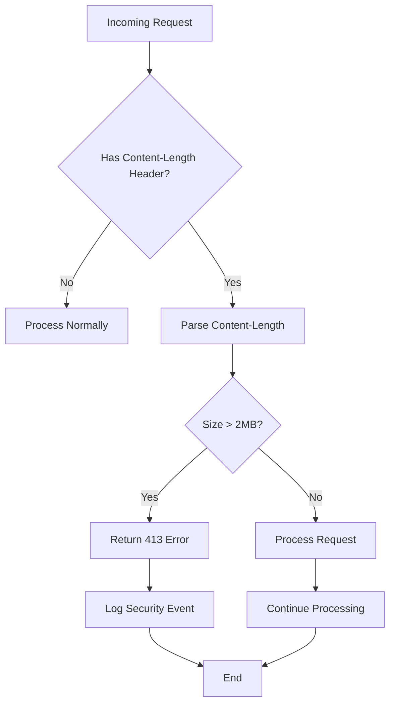
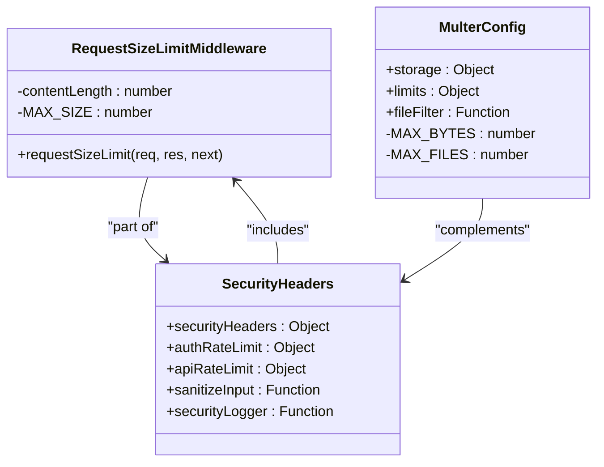
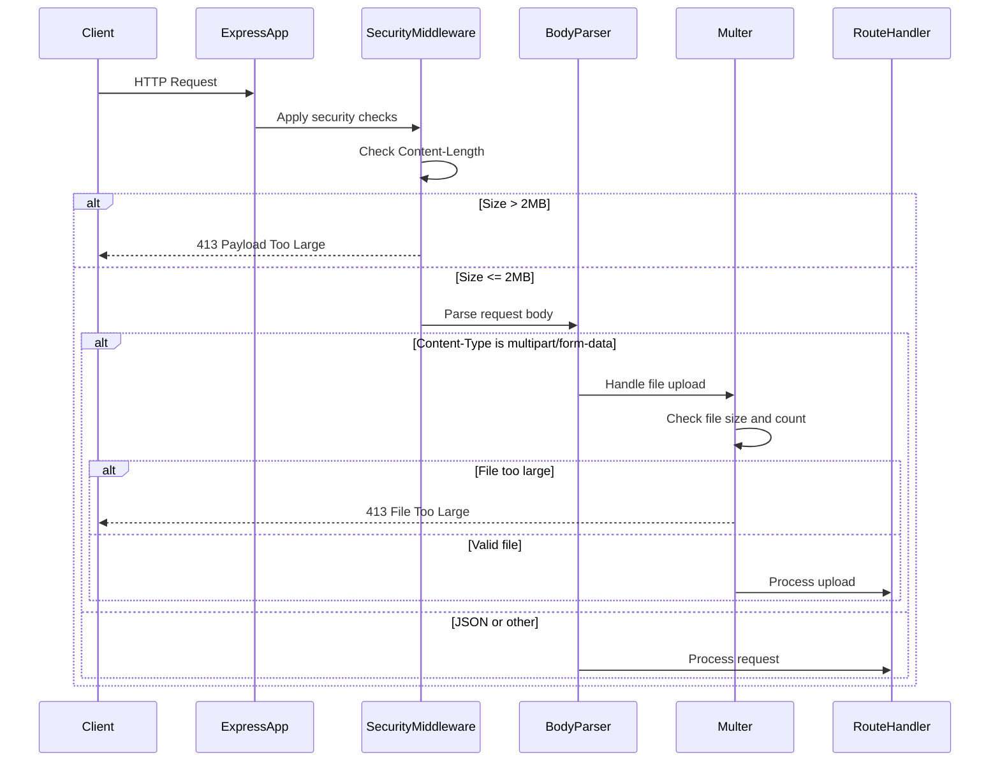
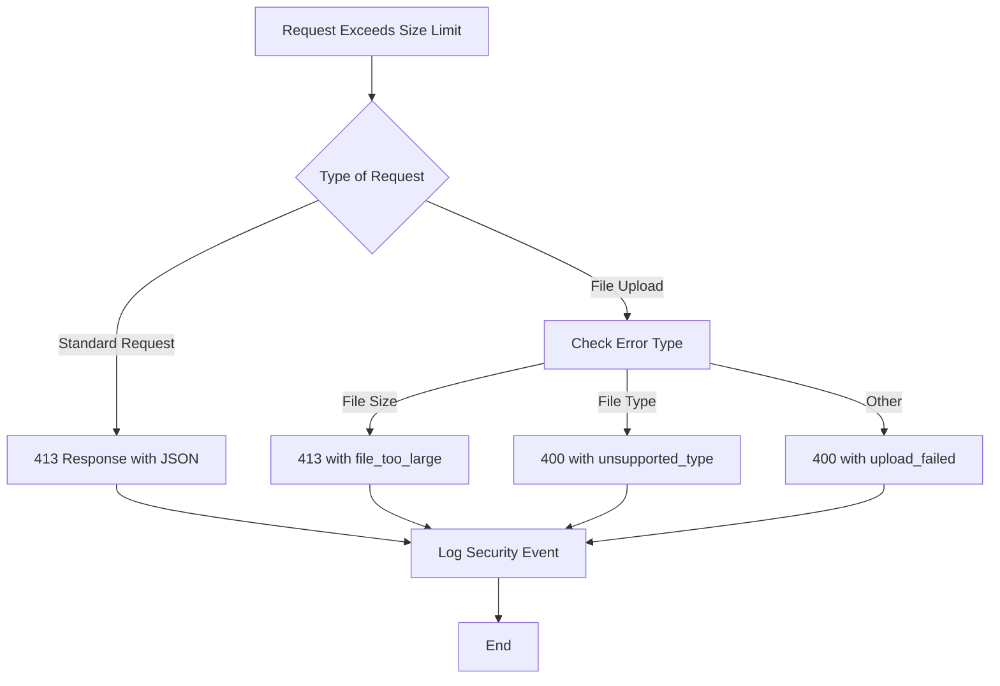

# Request Size Limit

<cite>
**Referenced Files in This Document**   
- [security.js](file://apps/admin-api/src/middleware/security.js)
- [security.ts](file://apps/admin-api/src/middleware/security.ts)
- [app.js](file://apps/admin-api/src/app.js)
- [uploads.js](file://apps/admin-api/src/routes/uploads.js)
- [config.js](file://apps/admin-api/src/config.js)
</cite>

## Table of Contents
1. [Introduction](#introduction)
2. [Request Size Limiting Mechanism](#request-size-limiting-mechanism)
3. [Implementation Details](#implementation-details)
4. [Configuration and Integration](#configuration-and-integration)
5. [Security Rationale](#security-rationale)
6. [Error Handling](#error-handling)
7. [Trade-offs and Adjustments](#trade-offs-and-adjustments)
8. [Conclusion](#conclusion)

## Introduction
The slimy-monorepo platform implements a request size limiting mechanism to protect against denial-of-service attacks that could be caused by excessively large request payloads. This document details the implementation of the requestSizeLimit middleware, which enforces a 2MB maximum on incoming request bodies. The mechanism is designed to prevent memory exhaustion and mitigate slowloris attacks by rejecting requests that exceed the defined size threshold before they can consume significant server resources.

**Section sources**
- [security.js](file://apps/admin-api/src/middleware/security.js#L209-L222)
- [security.ts](file://apps/admin-api/src/middleware/security.ts#L151-L164)

## Request Size Limiting Mechanism
The request size limiting mechanism in the slimy-monorepo platform is implemented as a custom middleware function that checks the Content-Length header of incoming HTTP requests. The middleware is designed to quickly reject requests with payloads exceeding 2MB, preventing them from consuming server memory or processing resources. This approach provides an efficient first line of defense against denial-of-service attacks that attempt to overwhelm the server with large payloads.

The mechanism operates by inspecting the Content-Length header, which indicates the size of the request body in bytes. If this value exceeds 2MB (2,097,152 bytes), the middleware immediately returns a 413 Payload Too Large response without processing the request body further. This early rejection prevents the server from allocating memory for large payloads and reduces the attack surface for memory exhaustion attacks.

For JSON and other text-based payloads, the limit is enforced through the Express.js body-parser middleware with a 1MB limit, providing an additional layer of protection. For multipart/form-data requests, such as file uploads, the limit is handled separately by the multer middleware with a configurable maximum file size (default 25MB) and file count limit.

**Diagram sources **
- [security.js](file://apps/admin-api/src/middleware/security.js#L210-L222)
- [security.ts](file://apps/admin-api/src/middleware/security.ts#L152-L164)

**Section sources**
- [security.js](file://apps/admin-api/src/middleware/security.js#L209-L222)
- [security.ts](file://apps/admin-api/src/middleware/security.ts#L151-L164)

## Implementation Details
The request size limiting functionality is implemented in the security middleware files (security.js and security.ts) as the requestSizeLimit function. This middleware function extracts the Content-Length header from the incoming request and compares it against the 2MB threshold. The implementation is straightforward and efficient, focusing on early detection and rejection of oversized requests.

The core logic checks if the Content-Length header exists and is greater than 2 * 1024 * 1024 bytes. If this condition is met, the middleware immediately terminates the request by sending a 413 status code with a JSON response containing an error message and the maximum allowed size. This approach ensures that oversized requests are rejected before they can consume significant server resources.

For file uploads and multipart/form-data requests, the platform uses the multer middleware, which provides more sophisticated size limiting capabilities. In the uploads.js route, multer is configured with file size limits (fileSize) and maximum file count (files) constraints. The maximum file size is configurable via the MAX_UPLOAD_MB environment variable, with a default of 25MB. This allows larger file uploads while still maintaining control over resource consumption.

The implementation also includes input sanitization and security logging middleware that work in conjunction with the size limiting mechanism to provide comprehensive protection against various attack vectors.

**Diagram sources **
- [security.js](file://apps/admin-api/src/middleware/security.js#L209-L222)
- [uploads.js](file://apps/admin-api/src/routes/uploads.js#L65-L78)
- [security.ts](file://apps/admin-api/src/middleware/security.ts#L151-L164)

**Section sources**
- [security.js](file://apps/admin-api/src/middleware/security.js#L209-L222)
- [uploads.js](file://apps/admin-api/src/routes/uploads.js#L29-L31)
- [security.ts](file://apps/admin-api/src/middleware/security.ts#L151-L164)

## Configuration and Integration
The request size limiting mechanism is integrated into the application through the security middleware module, which is imported and used in the main application configuration. In the app.js file, various middleware functions are applied to handle different aspects of request processing, including security, logging, and parsing.

The requestSizeLimit middleware is defined in both security.js and security.ts files and exported for use throughout the application. These files contain comprehensive security configurations, including rate limiting, input sanitization, and security headers, with the request size limit being one component of a multi-layered security approach.

For standard JSON requests, the Express.js json middleware is configured with a 1MB limit (app.use(express.json({ limit: "1mb" }))), providing an additional layer of protection. This complements the 2MB Content-Length check by limiting the amount of data that the body parser will attempt to process.

File upload endpoints, handled by the uploads.js route, use multer with specific size constraints. The maximum file size is determined by the MAX_UPLOAD_MB environment variable, allowing administrators to adjust the limit based on their specific requirements. The multer configuration also limits the number of files that can be uploaded in a single request to prevent resource exhaustion.

The integration follows Express.js middleware patterns, where security checks are applied early in the request processing pipeline, before authentication and route handling. This ensures that potentially malicious requests are rejected as early as possible in the processing chain.

**Diagram sources **
- [app.js](file://apps/admin-api/src/app.js#L26)
- [security.js](file://apps/admin-api/src/middleware/security.js#L210-L222)
- [uploads.js](file://apps/admin-api/src/routes/uploads.js#L65-L78)

**Section sources**
- [app.js](file://apps/admin-api/src/app.js#L26)
- [security.js](file://apps/admin-api/src/middleware/security.js#L275-L283)
- [uploads.js](file://apps/admin-api/src/routes/uploads.js#L65-L78)

## Security Rationale
The request size limiting mechanism serves several important security purposes in the slimy-monorepo platform. The primary rationale is to prevent denial-of-service attacks that could be achieved by sending excessively large request bodies to consume server memory and processing resources. By enforcing a 2MB limit on request payloads, the system protects itself against memory exhaustion attacks that could destabilize the server or make it unavailable to legitimate users.

The 2MB limit represents a balance between usability and security. It is sufficiently large to accommodate typical API requests, including those with substantial JSON payloads, while being small enough to prevent most denial-of-service attacks. This limit helps mitigate slowloris attacks, where an attacker opens multiple connections and sends data very slowly to keep connections open and consume server resources.

For file uploads, the separate 25MB limit (configurable via environment variables) acknowledges that legitimate use cases may require larger file transfers, such as image or document uploads. However, even this higher limit is controlled and monitored to prevent abuse. The combination of request size limits and rate limiting provides layered protection against various attack vectors.

The security approach follows the principle of defense in depth, where multiple security controls work together to protect the system. The request size limit is complemented by other security measures such as input sanitization, rate limiting, and security headers, creating a comprehensive security posture that addresses multiple potential vulnerabilities.

**Section sources**
- [security.js](file://apps/admin-api/src/middleware/security.js#L209-L222)
- [security.ts](file://apps/admin-api/src/middleware/security.ts#L151-L164)
- [uploads.js](file://apps/admin-api/src/routes/uploads.js#L30-L31)

## Error Handling
When a request exceeds the size limit, the system returns a standardized error response with HTTP status code 413 (Payload Too Large). This response includes a JSON body with an error message and the maximum allowed size, providing clear feedback to the client about why the request was rejected.

In the requestSizeLimit middleware, the error handling is straightforward: when a request exceeds 2MB, the middleware immediately sends a 413 response with a JSON payload containing the error details. This early termination prevents further processing of the request and conserves server resources.

For file uploads handled by multer, the error handling is more nuanced. The multer middleware catches size limit violations and passes appropriate error objects to the callback function in the upload route. These errors are then translated into appropriate HTTP responses, with specific error codes for different types of failures (e.g., "file_too_large" for size violations).

The error responses are designed to be informative without revealing sensitive implementation details that could be exploited by attackers. The system logs security-relevant information, including suspicious requests, but does not expose these details in the client-facing error responses.

**Diagram sources **
- [security.js](file://apps/admin-api/src/middleware/security.js#L215-L219)
- [uploads.js](file://apps/admin-api/src/routes/uploads.js#L138-L145)

**Section sources**
- [security.js](file://apps/admin-api/src/middleware/security.js#L215-L219)
- [uploads.js](file://apps/admin-api/src/routes/uploads.js#L138-L145)

## Trade-offs and Adjustments
The request size limiting mechanism involves several trade-offs between security and usability. The 2MB limit for standard requests strikes a balance between protecting the server from denial-of-service attacks and allowing sufficient payload size for legitimate API operations. However, this limit may be restrictive for certain use cases that require transferring large amounts of data in a single request.

For file uploads, the platform provides more flexibility through the configurable MAX_UPLOAD_MB environment variable. This allows administrators to adjust the maximum file size based on their specific requirements and risk tolerance. The default 25MB limit accommodates most legitimate file upload scenarios while still providing protection against abuse.

The system could be enhanced to allow different size limits for different endpoints or user roles. For example, administrative endpoints might have higher limits than public-facing APIs, or trusted users might be allowed larger payloads than anonymous users. However, such adjustments would need to be carefully considered to avoid introducing new security vulnerabilities.

When adjusting limits, administrators should consider the server's available memory, expected usage patterns, and the potential impact on performance. Increasing limits too much could make the system vulnerable to resource exhaustion attacks, while setting them too low could disrupt legitimate functionality.

**Section sources**
- [uploads.js](file://apps/admin-api/src/routes/uploads.js#L30-L31)
- [config.js](file://apps/admin-api/src/config.js#L80-L85)

## Conclusion
The request size limiting mechanism in the slimy-monorepo platform provides an essential layer of protection against denial-of-service attacks by enforcing a 2MB maximum on incoming request bodies. Implemented as middleware that checks the Content-Length header, this mechanism efficiently rejects oversized requests before they can consume significant server resources.

The system combines this general request size limit with more specialized handling for file uploads through the multer middleware, allowing for different limits based on the type of request. This multi-layered approach to size limiting, combined with other security measures like rate limiting and input sanitization, creates a robust defense against various attack vectors.

While the current implementation provides effective protection, administrators have the flexibility to adjust certain limits, particularly for file uploads, to balance security needs with usability requirements. The clear error responses and comprehensive logging help diagnose issues while maintaining security by not exposing sensitive information to clients.