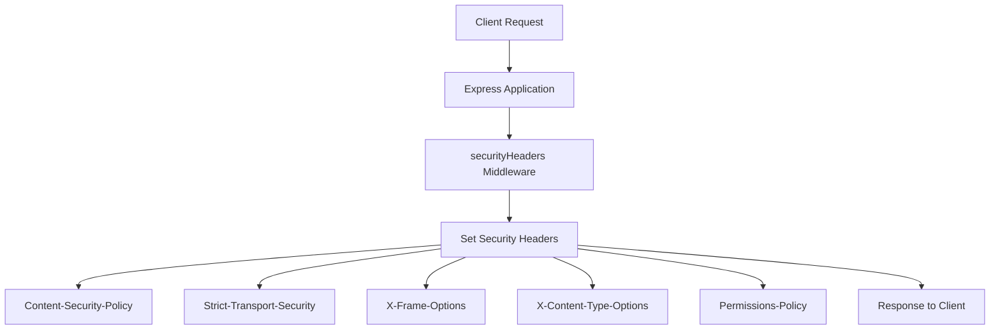
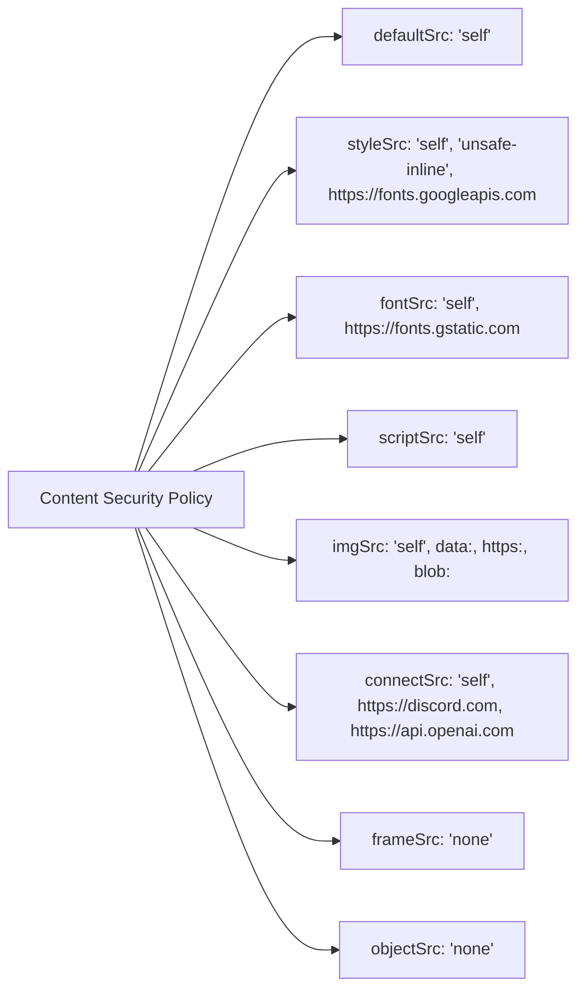
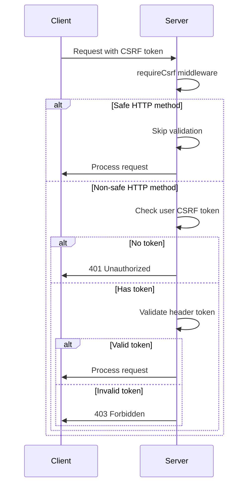
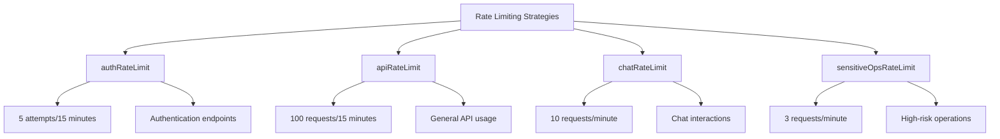
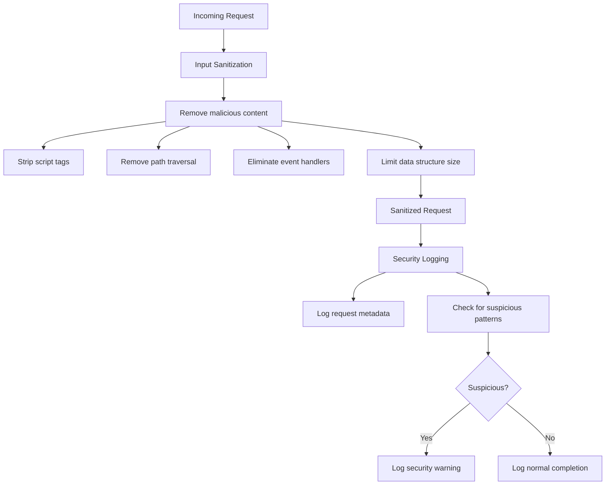

# Security Hardening

<cite>
**Referenced Files in This Document**   
- [security.js](file://apps/admin-api/src/middleware/security.js)
- [security.ts](file://apps/admin-api/src/middleware/security.ts)
- [csrf.js](file://apps/admin-api/src/middleware/csrf.js)
- [rate-limit.js](file://apps/admin-api/src/middleware/rate-limit.js)
- [config.js](file://apps/admin-api/src/config.js)
- [app.js](file://apps/admin-api/src/app.js)
</cite>

## Table of Contents
1. [Introduction](#introduction)
2. [Security Headers with Helmet.js](#security-headers-with-helmetjs)
3. [Content Security Policy Configuration](#content-security-policy-configuration)
4. [CSRF Protection Mechanism](#csrf-protection-mechanism)
5. [Rate Limiting Strategies](#rate-limiting-strategies)
6. [Request Size Limiting](#request-size-limiting)
7. [Input Sanitization and Security Logging](#input-sanitization-and-security-logging)
8. [Configuration and Security Implications](#configuration-and-security-implications)

## Introduction
The slimy-monorepo platform implements comprehensive security hardening measures to protect against common web vulnerabilities and ensure the integrity and confidentiality of user data. This document details the security middleware and mechanisms implemented across the platform, focusing on the securityHeaders middleware powered by Helmet.js, CSRF protection, rate limiting strategies, and request size limiting. These measures work together to create a robust security posture that protects against cross-site scripting (XSS), clickjacking, cross-site request forgery (CSRF), denial-of-service (DoS) attacks, and other security threats.

**Section sources**
- [security.js](file://apps/admin-api/src/middleware/security.js#L1-L285)

## Security Headers with Helmet.js
The platform utilizes Helmet.js to set critical security headers that enhance the security of HTTP responses. The securityHeaders middleware configures multiple security-related HTTP headers to protect against various attacks. These headers include Content-Security-Policy (CSP), Strict-Transport-Security (HSTS), X-Frame-Options (frameguard), X-Content-Type-Options (nosniff), and Permissions-Policy.

The Content-Security-Policy header helps prevent cross-site scripting (XSS) attacks by specifying the domains that the browser should consider valid sources of executable scripts. The Strict-Transport-Security header enforces secure (HTTPS) connections to the server, preventing man-in-the-middle attacks. The X-Frame-Options header (implemented via frameguard) prevents clickjacking attacks by indicating whether a browser should be allowed to render a page in a frame, iframe, embed, or object. The X-Content-Type-Options header (nosniff) prevents MIME type sniffing, which could lead to security vulnerabilities. The Permissions-Policy header (formerly Feature-Policy) allows control over which web platform features can be used in the document.

**Diagram sources**
- [security.js](file://apps/admin-api/src/middleware/security.js#L12-L41)
- [app.js](file://apps/admin-api/src/app.js#L23)

**Section sources**
- [security.js](file://apps/admin-api/src/middleware/security.js#L12-L41)

## Content Security Policy Configuration
The Content Security Policy (CSP) directives are carefully configured to restrict the sources from which content can be loaded, balancing security with functionality. The defaultSrc directive is set to "'self'", meaning that content can only be loaded from the same origin as the document. This prevents unauthorized external resources from being loaded.

The styleSrc directive allows styles to be loaded from the same origin ('self'), includes 'unsafe-inline' to support inline styles (necessary for certain UI components), and permits loading from Google Fonts (https://fonts.googleapis.com). The fontSrc directive allows fonts to be loaded from the same origin and Google Fonts (https://fonts.gstatic.com). The scriptSrc directive is restricted to 'self', preventing execution of scripts from external sources and mitigating XSS attacks.

The imgSrc directive allows images from the same origin, data URIs, HTTPS sources, and blob URLs, providing flexibility for image loading while maintaining security. The connectSrc directive restricts AJAX, WebSocket, and EventSource connections to the same origin, Discord API (https://discord.com), and OpenAI API (https://api.openai.com), ensuring that data transmission only occurs with trusted endpoints. The frameSrc and objectSrc directives are set to 'none', preventing embedding of frames and objects from any source, which helps prevent clickjacking and other injection attacks.

**Diagram sources**
- [security.js](file://apps/admin-api/src/middleware/security.js#L13-L24)

**Section sources**
- [security.js](file://apps/admin-api/src/middleware/security.js#L13-L24)

## CSRF Protection Mechanism
The platform implements CSRF (Cross-Site Request Forgery) protection through the requireCsrf middleware, which validates a user's CSRF token against request headers for non-safe HTTP methods. This mechanism prevents unauthorized commands from being transmitted from a user that the website trusts.

The CSRF protection works by checking for the presence of a valid CSRF token in requests that use non-safe HTTP methods (POST, PUT, DELETE, PATCH, etc.). Safe methods (GET, HEAD, OPTIONS) are exempt from CSRF validation as they should not cause state changes. When a non-safe method is used, the middleware first checks if the user has a CSRF token. If not, the request is rejected with a 401 Unauthorized status.

If the user has a CSRF token, the middleware retrieves the token from the request headers using the header name specified in the configuration (default: 'x-csrf-token'). The header is checked in both its original case and lowercase to ensure compatibility. If the header value matches the user's CSRF token, the request is allowed to proceed. Otherwise, the request is rejected with a 403 Forbidden status and an "invalid-csrf-token" error.

This CSRF protection mechanism ensures that only requests originating from the same site (or authorized sites) can perform state-changing operations, preventing attackers from tricking authenticated users into performing unwanted actions.

**Diagram sources**
- [csrf.js](file://apps/admin-api/src/middleware/csrf.js#L7-L27)

**Section sources**
- [csrf.js](file://apps/admin-api/src/middleware/csrf.js#L7-L27)

## Rate Limiting Strategies
The platform implements multiple rate limiting strategies to prevent abuse and protect against denial-of-service attacks. These strategies are implemented using the express-rate-limit package and are tailored to different types of endpoints based on their sensitivity and usage patterns.

The authRateLimit strategy is applied to authentication endpoints, limiting each IP address to 5 authentication attempts within a 15-minute window. This prevents brute force attacks on login endpoints while allowing legitimate users to retry after a reasonable cooldown period. The apiRateLimit strategy applies to general API usage, allowing up to 100 requests per IP address within a 15-minute window, providing generous limits for normal API consumption while preventing excessive usage.

The chatRateLimit strategy is specifically designed for chat interactions, allowing 10 requests per minute per IP address. This limit is appropriate for chat interfaces where users might send messages at a moderate pace but prevents automated spamming. The sensitiveOpsRateLimit strategy is the most restrictive, limiting high-risk operations to 3 requests per minute per IP address. This strict limit protects sensitive operations from abuse and potential data exfiltration.

All rate limiting configurations include standard HTTP headers to communicate rate limit information to clients and skip rate limiting for health checks and metrics endpoints to ensure monitoring systems function properly.

**Diagram sources**
- [security.js](file://apps/admin-api/src/middleware/security.js#L44-L95)

**Section sources**
- [security.js](file://apps/admin-api/src/middleware/security.js#L44-L95)

## Request Size Limiting
The platform enforces a 2MB limit on request bodies through the requestSizeLimit middleware to prevent denial-of-service attacks that could occur from uploading excessively large payloads. This limit is implemented by checking the Content-Length header of incoming requests and rejecting those that exceed the threshold.

The middleware parses the Content-Length header and compares it to the maximum allowed size of 2MB (2,097,152 bytes). If a request exceeds this limit, it is immediately rejected with a 413 Request Entity Too Large status code and a JSON response indicating the error and the maximum allowed size. This early rejection prevents the server from processing large payloads that could consume excessive memory or processing resources.

The 2MB limit strikes a balance between allowing reasonable file uploads and form submissions while preventing abuse. This limit is particularly important for endpoints that accept file uploads or large JSON payloads, as it prevents attackers from overwhelming the server with large requests that could degrade performance or exhaust system resources.

**Section sources**
- [security.js](file://apps/admin-api/src/middleware/security.js#L210-L222)

## Input Sanitization and Security Logging
The platform implements comprehensive input sanitization and security logging to detect and prevent various types of attacks. The sanitizeInput middleware recursively processes request data (body, query parameters, and URL parameters) to remove potentially malicious content.

The input sanitization process includes removing null bytes and control characters, eliminating path traversal attempts (../), stripping script, iframe, object, embed, and form tags, removing javascript: and vbscript: protocols, eliminating event handlers (on* attributes), and removing style tags with JavaScript. The middleware also applies basic protection against SQL injection patterns and template injection attempts. To prevent denial-of-service attacks via excessively large data structures, the middleware limits array sizes to 1,000 elements and object keys to 100 properties.

The securityLogger middleware provides comprehensive security logging by recording security-relevant information for each request, including IP address, user agent, HTTP method, path, and timestamp. It actively monitors for suspicious patterns such as directory traversal (../), script injection (<script), SQL injection (union.*select), code injection (eval(), and potential encoded attacks (base64). When suspicious patterns are detected, the middleware logs a warning with relevant details, enabling security monitoring and incident response.

**Diagram sources**
- [security.js](file://apps/admin-api/src/middleware/security.js#L98-L207)
- [security.js](file://apps/admin-api/src/middleware/security.js#L224-L273)

**Section sources**
- [security.js](file://apps/admin-api/src/middleware/security.js#L98-L273)

## Configuration and Security Implications
The security measures in the slimy-monorepo platform are configured through environment variables and configuration files, allowing for flexible deployment across different environments while maintaining strong security defaults. The configuration options have significant security implications that must be carefully considered.

The HSTS (HTTP Strict Transport Security) configuration sets a maxAge of 31,536,000 seconds (1 year), includes subdomains, and enables preload, providing strong protection against protocol downgrade attacks. The referrerPolicy is set to "origin-when-cross-origin", balancing privacy with functionality by limiting referrer information sent to external sites.

The Permissions-Policy configuration restricts access to sensitive browser features such as geolocation, microphone, camera, payment, and USB devices, preventing unauthorized access to user hardware. The rate limiting configurations are designed to prevent abuse while allowing legitimate usage, with different thresholds for different endpoint types based on their sensitivity.

The CSRF protection relies on proper configuration of the header name (x-csrf-token by default) and integration with the authentication system to ensure that CSRF tokens are properly generated and validated. The request size limit of 2MB prevents denial-of-service attacks while accommodating reasonable file uploads and form submissions.

These security configurations work together to create a defense-in-depth approach, where multiple layers of protection mitigate various attack vectors. The platform's security posture can be further enhanced by monitoring security logs, regularly reviewing and updating configurations, and conducting security assessments to identify and address potential vulnerabilities.

**Section sources**
- [security.js](file://apps/admin-api/src/middleware/security.js#L1-L285)
- [config.js](file://apps/admin-api/src/config.js#L96-L98)