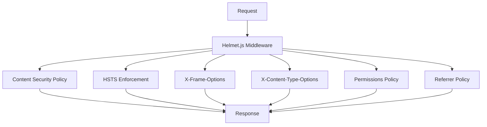
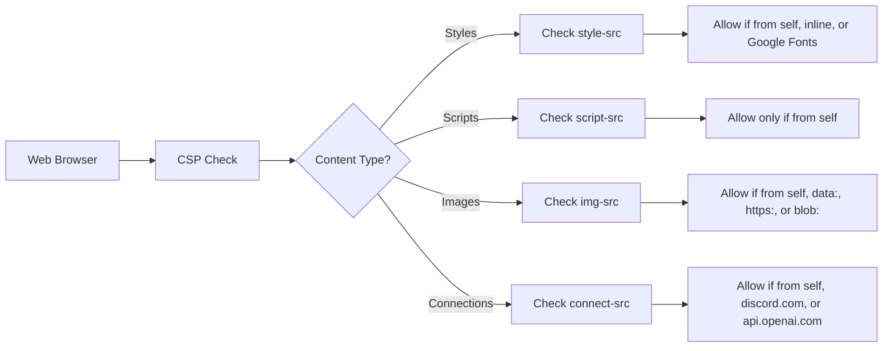
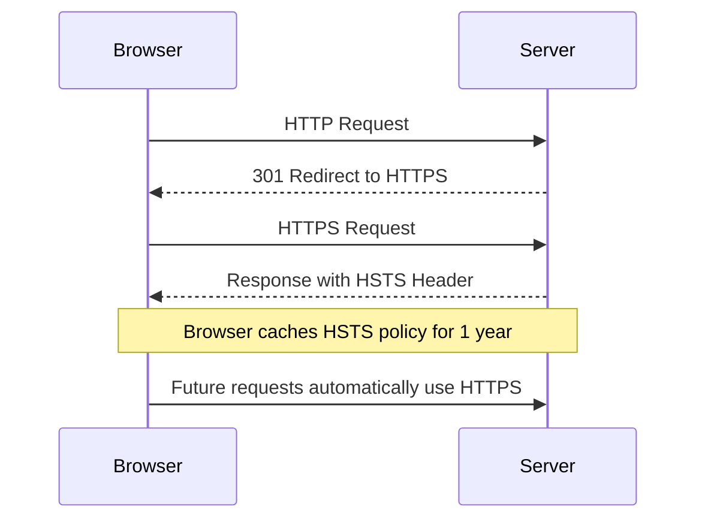

# Security Headers

<cite>
**Referenced Files in This Document**   
- [security.js](file://apps/admin-api/src/middleware/security.js)
- [security.ts](file://apps/admin-api/src/middleware/security.ts)
- [app.js](file://apps/admin-api/src/app.js)
- [config.js](file://apps/admin-api/src/config.js)
- [Caddyfile.template](file://apps/web/Caddyfile.template)
</cite>

## Table of Contents
1. [Introduction](#introduction)
2. [Security Headers Implementation](#security-headers-implementation)
3. [Content Security Policy](#content-security-policy)
4. [HTTP Strict Transport Security](#http-strict-transport-security)
5. [Clickjacking Protection](#clickjacking-protection)
6. [MIME Type Sniffing Protection](#mime-type-sniffing-protection)
7. [Permissions Policy](#permissions-policy)
8. [Referrer Policy](#referrer-policy)
9. [Environment-Specific Configuration](#environment-specific-configuration)
10. [Security Middleware Integration](#security-middleware-integration)
11. [Common Misconfigurations and Remediation](#common-misconfigurations-and-remediation)

## Introduction
The slimy-monorepo platform implements comprehensive security headers using Helmet.js to protect against common web vulnerabilities. This document details the configuration and implementation of security headers across the platform, focusing on the admin-api application. The security implementation includes Content Security Policy (CSP), HTTP Strict Transport Security (HSTS), clickjacking protection, MIME type sniffing prevention, and browser feature control through Permissions Policy. The configuration is designed to balance security requirements with the functional needs of the application, particularly its integration with Discord and OpenAI services.

## Security Headers Implementation
The security headers are implemented through Helmet.js middleware in both JavaScript and TypeScript configurations. The implementation provides a layered security approach that protects against cross-site scripting (XSS), clickjacking, MIME type sniffing, and other common web vulnerabilities. The security configuration is defined in two files: `security.js` and `security.ts`, which are functionally equivalent but serve different parts of the application.

**Diagram sources**
- [security.js](file://apps/admin-api/src/middleware/security.js#L12-L41)
- [security.ts](file://apps/admin-api/src/middleware/security.ts#L12-L51)

**Section sources**
- [security.js](file://apps/admin-api/src/middleware/security.js#L1-L41)
- [security.ts](file://apps/admin-api/src/middleware/security.ts#L1-L51)

## Content Security Policy
The Content Security Policy (CSP) is configured to mitigate cross-site scripting (XSS) risks while allowing necessary functionality for the application. The CSP directives are carefully crafted to permit only trusted sources for various content types.

### CSP Directives
The following table outlines the CSP directives and their configurations:

| Directive | Configuration | Purpose |
|---------|-------------|--------|
| default-src | "'self'" | Sets default policy for loading content to same origin only |
| style-src | "'self'", "'unsafe-inline'", "https://fonts.googleapis.com" | Allows styles from same origin, inline styles, and Google Fonts |
| font-src | "'self'", "https://fonts.gstatic.com" | Permits fonts from same origin and Google Fonts service |
| script-src | "'self'" | Restricts JavaScript execution to same origin only |
| img-src | "'self'", "data:", "https:", "blob:" | Allows images from same origin, data URIs, HTTPS sources, and blob URLs |
| connect-src | "'self'", "https://discord.com", "https://api.openai.com" | Restricts AJAX, WebSockets, and EventSource connections to trusted endpoints |
| frame-src | "'none'" | Prevents embedding the application in frames |
| object-src | "'none'" | Blocks plugins like Flash and Java applets |

The CSP configuration strikes a balance between security and functionality. While `'unsafe-inline'` is permitted for styles to accommodate the application's UI requirements, JavaScript execution is strictly limited to same-origin sources to prevent XSS attacks. The connect-src directive explicitly allows connections to Discord and OpenAI APIs, which are essential for the application's core functionality.

**Diagram sources**
- [security.js](file://apps/admin-api/src/middleware/security.js#L13-L24)
- [security.ts](file://apps/admin-api/src/middleware/security.ts#L13-L24)

**Section sources**
- [security.js](file://apps/admin-api/src/middleware/security.js#L13-L24)
- [security.ts](file://apps/admin-api/src/middleware/security.ts#L13-L24)

## HTTP Strict Transport Security
The HTTP Strict Transport Security (HSTS) header is implemented to enforce secure transport over HTTPS. This prevents man-in-the-middle attacks and ensures that all communications with the server are encrypted.

### HSTS Configuration
The HSTS policy is configured with the following parameters:
- **maxAge**: 31536000 seconds (1 year) - Instructs browsers to use HTTPS for one year
- **includeSubDomains**: true - Applies the policy to all subdomains
- **preload**: true - Enables HSTS preloading in browsers

The HSTS configuration is consistent across both the application-level implementation and the Caddy web server configuration. This ensures that even if the application server is bypassed, the HSTS policy is still enforced at the network level.

The HSTS max-age value can be overridden through environment variables, allowing for different configurations in development and production environments. This flexibility enables stricter security policies in production while maintaining development convenience.

**Diagram sources**
- [security.js](file://apps/admin-api/src/middleware/security.js#L26-L30)
- [security.ts](file://apps/admin-api/src/middleware/security.ts#L26-L30)
- [Caddyfile.template](file://apps/web/Caddyfile.template#L38)

**Section sources**
- [security.js](file://apps/admin-api/src/middleware/security.js#L26-L30)
- [security.ts](file://apps/admin-api/src/middleware/security.ts#L26-L30)
- [config.js](file://apps/admin-api/src/config.js#L97)

## Clickjacking Protection
Clickjacking protection is implemented through the X-Frame-Options header to prevent the application from being embedded in iframes, which could be used for malicious purposes.

### Frameguard Configuration
The application uses two different configurations for clickjacking protection:

1. In `security.js`: `frameguard: { action: 'deny' }` - This setting completely prevents the page from being displayed in a frame.
2. In `security.ts`: The frame-src directive in CSP is set to "'none'", which achieves the same effect.

Both configurations effectively prevent clickjacking attacks by ensuring that the application cannot be embedded in frames from any origin. This is particularly important for the admin interface, which handles sensitive operations and user data.

The Caddy web server configuration also includes X-Frame-Options: DENY, providing an additional layer of protection at the network level. This defense-in-depth approach ensures that even if the application server fails to send the header, the proxy server will still enforce the protection.

**Section sources**
- [security.js](file://apps/admin-api/src/middleware/security.js#L31)
- [security.ts](file://apps/admin-api/src/middleware/security.ts#L21)
- [Caddyfile.template](file://apps/web/Caddyfile.template#L44)

## MIME Type Sniffing Protection
MIME type sniffing protection is implemented to prevent browsers from guessing the content type of responses, which could lead to security vulnerabilities.

### No-Sniff Configuration
The X-Content-Type-Options header is set to "nosniff" in both security configurations:
- In `security.js`: `noSniff: true`
- In `security.ts`: `noSniff: true`

This configuration prevents browsers from interpreting files as a different MIME type than what is specified in the Content-Type header. For example, it prevents a text file from being interpreted as HTML, which could lead to cross-site scripting attacks.

The .cdn-config.json file also includes contentTypeSniffing: false, which reinforces this protection for CDN-served content. This ensures that all static assets served through the CDN are protected against MIME type sniffing attacks.

**Section sources**
- [security.js](file://apps/admin-api/src/middleware/security.js#L32)
- [security.ts](file://apps/admin-api/src/middleware/security.ts#L31)
- [Caddyfile.template](file://apps/web/Caddyfile.template#L41)
- [.cdn-config.json](file://apps/admin-api/public/.cdn-config.json#L33)

## Permissions Policy
The Permissions Policy header controls which browser features and APIs can be used by the application.

### Permissions Policy Configuration
The two security configurations have slightly different approaches:

1. In `security.js`: Only camera and microphone permissions are explicitly restricted.
2. In `security.ts`: A comprehensive list of browser features is restricted, including:
   - geolocation
   - microphone
   - camera
   - payment
   - usb
   - magnetometer
   - accelerometer
   - gyroscope
   - ambientLightSensor
   - autoplay
   - encryptedMedia
   - fullscreen
   - pictureInPicture

The more comprehensive configuration in `security.ts` follows the principle of least privilege, disabling browser features that are not required by the application. This reduces the attack surface and prevents potential abuse of these features.

The empty arrays in the directives indicate that the features are disabled for all origins, including the same origin. This ensures that even if the application code attempts to access these features, the browser will block the requests.

**Section sources**
- [security.js](file://apps/admin-api/src/middleware/security.js#L35-L40)
- [security.ts](file://apps/admin-api/src/middleware/security.ts#L34-L50)

## Referrer Policy
The Referrer Policy header controls how much referrer information is included in requests.

### Referrer Policy Configuration
The two security configurations use different referrer policies:
- In `security.js`: `referrerPolicy: { policy: "origin-when-cross-origin" }`
- In `security.ts`: `referrerPolicy: { policy: "strict-origin-when-cross-origin" }`

The difference between these policies is significant:
- "origin-when-cross-origin" sends the full URL when navigating within the same origin, but only the origin (scheme, host, and port) when navigating to a different origin.
- "strict-origin-when-cross-origin" is more restrictive, sending the full URL only when navigating to a more secure destination (HTTPS to HTTPS), but only the origin otherwise.

The Caddy web server configuration uses "strict-origin-when-cross-origin", which aligns with the more secure configuration in `security.ts`. This policy helps protect user privacy by limiting the amount of information shared with third-party sites while still allowing necessary functionality.

**Section sources**
- [security.js](file://apps/admin-api/src/middleware/security.js#L34)
- [security.ts](file://apps/admin-api/src/middleware/security.ts#L33)
- [Caddyfile.template](file://apps/web/Caddyfile.template#L50)

## Environment-Specific Configuration
The security configuration supports environment-specific overrides through environment variables, allowing different security policies for development, staging, and production environments.

### Configuration Overrides
The config.js file defines environment-specific security settings:
- HSTS max-age can be overridden with HSTS_MAX_AGE environment variable
- CORS settings can be controlled with CORS_ENABLED environment variable
- Allowed origins can be specified with ADMIN_ALLOWED_ORIGINS environment variable

This flexibility allows for less restrictive security policies during development while maintaining strict security in production. For example, HSTS can be disabled or set to a shorter duration in development environments to avoid complications with HTTP testing.

The presence of both .env and .env.production files indicates that different environment variables are used for different deployment environments. This separation ensures that sensitive production configuration values are not accidentally used in development.

**Section sources**
- [config.js](file://apps/admin-api/src/config.js#L95-L98)
- [.env](file://apps/admin-api/.env)
- [.env.production](file://apps/admin-api/.env.production)

## Security Middleware Integration
The security middleware is integrated into the application through the app.js file, which sets up the Express application.

### Middleware Integration
In app.js, the security middleware is applied as follows:
1. helmet() is applied globally to all routes
2. Other middleware such as CORS, cookie parsing, and request logging are applied
3. The security middleware is applied before route handling

The middleware composition order is critical for security. The security headers are applied early in the request processing pipeline to ensure that all responses include the appropriate security headers, regardless of how the request is handled.

The application also includes additional security measures such as CSRF protection, rate limiting, and input sanitization, which work in conjunction with the security headers to provide comprehensive protection.

**Section sources**
- [app.js](file://apps/admin-api/src/app.js#L22)
- [security.js](file://apps/admin-api/src/middleware/security.js)
- [security.ts](file://apps/admin-api/src/middleware/security.ts)

## Common Misconfigurations and Remediation
Several potential misconfigurations exist in the current implementation that should be addressed to improve security.

### Identified Issues and Remediations
1. **Inconsistent Security Configurations**
   - Issue: The security.js and security.ts files have different configurations for referrer policy and permissions policy.
   - Remediation: Standardize on the more secure configuration from security.ts across all files.

2. **Unsafe Inline Styles**
   - Issue: The CSP allows 'unsafe-inline' for styles, which could be exploited through CSS injection attacks.
   - Remediation: Implement nonces or hashes for inline styles instead of using 'unsafe-inline'.

3. **Missing Feature Policy**
   - Issue: Some modern security headers like Feature-Policy are not implemented.
   - Remediation: Add Feature-Policy header for older browsers that don't support Permissions-Policy.

4. **Inconsistent Clickjacking Protection**
   - Issue: Different mechanisms are used in different files (frameguard vs CSP frame-src).
   - Remediation: Standardize on CSP frame-src directive as it provides more granular control.

5. **Development Environment Risks**
   - Issue: Default environment variables in .env files may be used in production.
   - Remediation: Ensure that production environment variables are properly set and that default values are not used in production.

6. **Missing Subresource Integrity**
   - Issue: External resources from Google Fonts are not protected with subresource integrity.
   - Remediation: Add SRI hashes to font imports or host fonts locally.

7. **Insecure Direct Object References**
   - Issue: The application may be vulnerable to IDOR attacks despite security headers.
   - Remediation: Implement proper authorization checks in addition to security headers.

Addressing these issues will strengthen the overall security posture of the application and provide more consistent protection across all environments.

**Section sources**
- [security.js](file://apps/admin-api/src/middleware/security.js)
- [security.ts](file://apps/admin-api/src/middleware/security.ts)
- [app.js](file://apps/admin-api/src/app.js)
- [config.js](file://apps/admin-api/src/config.js)
- [Caddyfile.template](file://apps/web/Caddyfile.template)