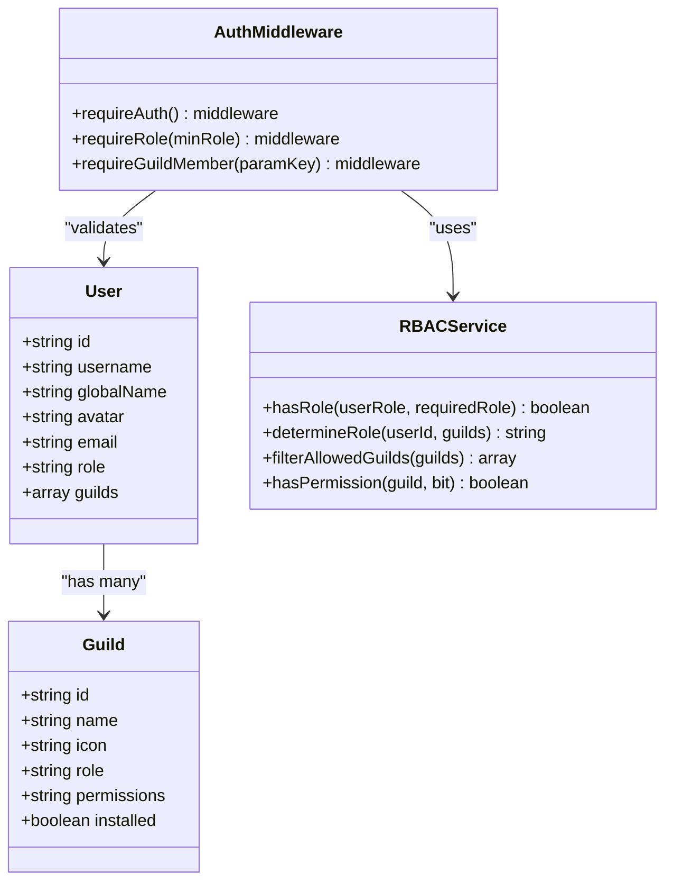
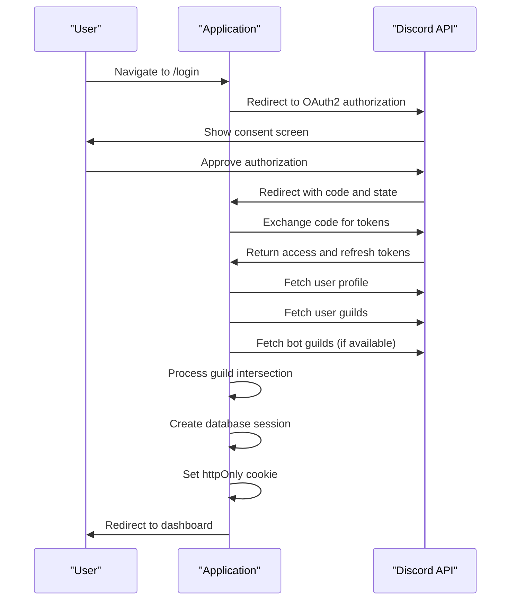
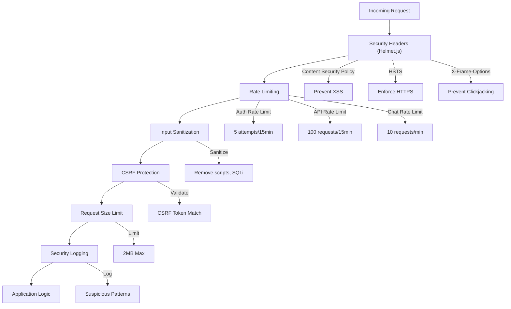
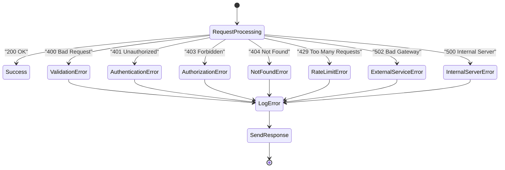

# Security Model

<cite>
**Referenced Files in This Document**   
- [auth.js](file://apps/admin-api/src/middleware/auth.js)
- [auth.js](file://apps/admin-api/src/routes/auth.js)
- [oauth.js](file://apps/admin-api/src/services/oauth.js)
- [rbac.js](file://apps/admin-api/src/middleware/rbac.js)
- [security.js](file://apps/admin-api/src/middleware/security.js)
- [csrf.js](file://apps/admin-api/src/middleware/csrf.js)
- [rate-limit.js](file://apps/admin-api/src/middleware/rate-limit.js)
- [jwt.js](file://apps/admin-api/lib/jwt.js)
- [token.js](file://apps/admin-api/src/services/token.js)
- [rbac.js](file://apps/admin-api/src/services/rbac.js)
- [roles.js](file://apps/admin-api/src/lib/roles.js)
- [config.js](file://apps/admin-api/src/config.js)
- [redis.js](file://apps/admin-api/lib/cache/redis.js)
- [error-handler.js](file://apps/admin-api/src/middleware/error-handler.js)
- [errors.js](file://apps/admin-api/src/lib/errors.js)
- [env-validation.js](file://apps/admin-api/src/lib/env-validation.js)
- [session-store.js](file://apps/admin-api/lib/session-store.js)
</cite>

## Table of Contents
1. [Introduction](#introduction)
2. [JWT-Based Authentication System](#jwt-based-authentication-system)
3. [Role-Based Access Control (RBAC)](#role-based-access-control-rbac)
4. [Discord OAuth2 Integration](#discord-oauth2-integration)
5. [Security Hardening Measures](#security-hardening-measures)
6. [Environment Variables and Secrets Management](#environment-variables-and-secrets-management)
7. [Error Handling Strategy](#error-handling-strategy)
8. [Planned Migration to Redis](#planned-migration-to-redis)
9. [Threat Models and Mitigations](#threat-models-and-mitigations)
10. [Conclusion](#conclusion)

## Introduction
The slimy-monorepo platform implements a comprehensive security model designed to protect user data, prevent unauthorized access, and ensure system integrity. This document details the platform's security architecture, focusing on authentication, authorization, and protection against common web vulnerabilities. The system uses JWT-based authentication with httpOnly cookies for session management, role-based access control, and Discord OAuth2 for identity verification. Multiple security layers including Helmet.js, CSRF protection, rate limiting, and input validation are implemented to harden the application against attacks. The architecture also includes secure handling of environment variables, comprehensive error handling to prevent information leakage, and a planned migration from in-memory to Redis-based session storage for improved scalability and security.

## JWT-Based Authentication System
The platform implements a JWT-based authentication system using httpOnly cookies for secure session management. The authentication flow begins with Discord OAuth2, where users are redirected to Discord's authorization endpoint with appropriate scopes. Upon successful authentication, the system receives an authorization code which is exchanged for access and refresh tokens. The system then creates a JWT containing user information including ID, username, role, and guild membership. This JWT is stored in an httpOnly cookie named "slimy_admin_token" with secure flags set according to the environment (secure in production, lax sameSite policy). The cookie configuration ensures protection against XSS attacks while maintaining usability. Token validation occurs on each request by verifying the JWT signature using a secret key configured through environment variables. The system supports token refresh mechanisms through Discord's refresh tokens, allowing seamless user experience without frequent re-authentication. The JWT expiration is configurable through environment variables, with a default of 12 hours.

**Section sources**
- [auth.js](file://apps/admin-api/src/routes/auth.js#L1-L482)
- [jwt.js](file://apps/admin-api/lib/jwt.js#L1-L81)
- [token.js](file://apps/admin-api/src/services/token.js#L1-L60)
- [config.js](file://apps/admin-api/src/config.js#L1-L125)

## Role-Based Access Control (RBAC)
The platform implements a robust role-based access control system that enforces permissions based on user roles and guild membership. The RBAC system defines multiple roles including member, club, and admin, with hierarchical permissions where higher roles inherit the permissions of lower roles. Role determination occurs during the authentication process by analyzing the user's Discord permissions and role IDs. The system checks for specific Discord permission bits such as MANAGE_GUILD and ADMINISTRATOR to determine administrative privileges. For guild-specific operations, the system verifies both the user's role and their membership in the target guild. Middleware functions enforce these access controls by intercepting requests and validating permissions before allowing access to protected resources. The RBAC implementation includes both route-level and operation-level checks, ensuring that users can only perform actions appropriate to their role. The system also supports owner-level privileges for specific user IDs configured through environment variables, providing an additional layer of administrative control.

**Diagram sources**
- [rbac.js](file://apps/admin-api/src/services/rbac.js#L1-L66)
- [auth.js](file://apps/admin-api/src/middleware/auth.js#L1-L314)
- [rbac.js](file://apps/admin-api/src/middleware/rbac.js#L1-L76)
- [roles.js](file://apps/admin-api/src/lib/roles.js#L1-L25)

## Discord OAuth2 Integration
The platform uses Discord OAuth2 for identity verification with identify and guilds scopes. The integration follows the authorization code flow, providing secure authentication without exposing user credentials. During the login process, users are redirected to Discord's authorization endpoint with a randomly generated state parameter stored in a secure cookie to prevent CSRF attacks. The state parameter includes a nonce and timestamp, ensuring that authorization responses are valid and timely. Upon successful authentication, Discord redirects back to the application with an authorization code, which is then exchanged for access and refresh tokens on the server side. The system uses these tokens to fetch user profile information and guild membership details from Discord's API. To optimize performance and reduce API rate limits, the system implements a guild intersection check using the bot's token to identify servers where both the user and bot are members. User information including Discord ID, username, avatar, and email are stored in the database, while guild membership and permissions are used to determine user roles and access levels.

**Diagram sources**
- [auth.js](file://apps/admin-api/src/routes/auth.js#L1-L482)
- [oauth.js](file://apps/admin-api/src/services/oauth.js#L1-L104)
- [config.js](file://apps/admin-api/src/config.js#L1-L125)

## Security Hardening Measures
The platform implements multiple security hardening measures to protect against common web vulnerabilities. Helmet.js is used to set comprehensive security headers including Content Security Policy, HSTS, X-Frame-Options, and X-Content-Type-Options. The Content Security Policy restricts resource loading to trusted sources, preventing XSS attacks by disallowing inline scripts and unauthorized domains. Rate limiting is implemented at multiple levels: authentication endpoints are limited to 5 attempts per 15 minutes per IP, API endpoints to 100 requests per 15 minutes, and chat endpoints to 10 requests per minute. Sensitive operations have stricter limits of 3 requests per minute. CSRF protection is implemented using a custom header (x-csrf-token) that must match a token stored in the user session, preventing cross-site request forgery attacks. Input validation and sanitization middleware cleans request data by removing potentially dangerous content such as script tags, event handlers, and SQL injection patterns. Request size is limited to 2MB to prevent denial-of-service attacks through large payloads. Security logging captures suspicious patterns and request metadata for monitoring and incident response.

**Diagram sources**
- [security.js](file://apps/admin-api/src/middleware/security.js#L1-L285)
- [csrf.js](file://apps/admin-api/src/middleware/csrf.js#L1-L28)
- [rate-limit.js](file://apps/admin-api/src/middleware/rate-limit.js#L1-L23)
- [config.js](file://apps/admin-api/src/config.js#L1-L125)

## Environment Variables and Secrets Management
The platform implements secure handling of environment variables and secrets across different environments. Critical secrets such as JWT_SECRET, SESSION_SECRET, DISCORD_CLIENT_ID, and DISCORD_CLIENT_SECRET are loaded from environment variables rather than being hardcoded in the source code. The system validates the presence and format of required environment variables at startup, preventing the application from running with incomplete or insecure configuration. Environment validation checks include ensuring secrets are at least 32 characters long, Discord client IDs are numeric, and database URLs use valid PostgreSQL connection strings. The system provides different default values and security settings based on the environment (development vs production), such as cookie security flags and allowed origins. Sensitive values are masked in logs and error messages to prevent accidental exposure. The configuration system supports multiple environment-specific files (.env, .env.production, etc.) allowing different settings for development, testing, and production environments. This approach ensures that secrets remain isolated from the codebase and can be securely managed through deployment pipelines and secret management systems.

**Section sources**
- [config.js](file://apps/admin-api/src/config.js#L1-L125)
- [env-validation.js](file://apps/admin-api/src/lib/env-validation.js#L1-L177)
- [jwt.js](file://apps/admin-api/lib/jwt.js#L1-L81)

## Error Handling Strategy
The platform implements a comprehensive error handling strategy designed to prevent information leakage while providing meaningful feedback. A centralized error handling middleware catches all unhandled exceptions and formats them into standardized responses that do not expose sensitive system information. The system distinguishes between operational errors (expected application errors) and programming errors (unexpected exceptions), handling them appropriately. Operational errors such as authentication failures, validation errors, and not found responses are returned with appropriate HTTP status codes and generic messages. Programming errors are logged with full details for debugging but returned to clients as generic "Internal Server Error" messages, preventing exposure of stack traces or system details. The error handling system includes specific error classes for different scenarios such as AuthenticationError, AuthorizationError, ValidationError, and ExternalServiceError, allowing for consistent error responses across the application. In development mode, additional error details including stack traces are included in responses to aid debugging, but this is disabled in production. Error logs include request context such as request ID, method, path, and user ID (when available) for troubleshooting while avoiding logging sensitive data.

**Diagram sources**
- [error-handler.js](file://apps/admin-api/src/middleware/error-handler.js#L1-L82)
- [errors.js](file://apps/admin-api/src/lib/errors.js#L1-L255)

## Planned Migration to Redis
The platform currently uses in-memory session storage but has a planned migration to Redis for improved security and scalability. The current implementation stores session data in memory, which limits horizontal scaling and poses risks of session loss during server restarts. The migration to Redis will provide several security and operational benefits. Redis will serve as a centralized, persistent session store that can be shared across multiple application instances, enabling true horizontal scaling. The Redis implementation will include proper authentication and encryption for the Redis connection, ensuring that session data remains protected in transit and at rest. Session data will be encrypted before storage in Redis, adding an additional layer of protection against potential database breaches. The migration will also enable session expiration and cleanup mechanisms, reducing the risk of stale sessions accumulating over time. The Redis client implementation already exists in the codebase as a mock cache, indicating that the architecture is prepared for this transition. Once implemented, Redis will provide better performance for session lookups, improved reliability, and enhanced security through centralized management of session data.

**Section sources**
- [redis.js](file://apps/admin-api/lib/cache/redis.js#L1-L16)
- [session-store.js](file://apps/admin-api/lib/session-store.js)
- [auth.js](file://apps/admin-api/src/middleware/auth.js#L1-L314)

## Threat Models and Mitigations
The platform's architecture addresses several common web vulnerabilities through targeted mitigation strategies. For XSS (Cross-Site Scripting) attacks, the system implements multiple defenses: httpOnly cookies prevent JavaScript access to session tokens, Content Security Policy restricts script execution to trusted sources, and input sanitization removes potentially dangerous content from user inputs. CSRF (Cross-Site Request Forgery) protection is implemented through anti-CSRF tokens that must be included in the x-csrf-token header for state-changing requests, with tokens validated against the user session. For injection attacks, including SQL injection, the system uses Prisma ORM which parameterizes queries and prevents direct SQL manipulation, while input sanitization removes common injection patterns. Rate limiting protects against brute force attacks and denial-of-service attempts by limiting request frequency at multiple levels. The use of secure cookie attributes (HttpOnly, Secure, SameSite) protects against session hijacking and cookie theft. The RBAC system prevents privilege escalation by enforcing strict role-based access controls and guild membership verification. Error handling prevents information leakage by standardizing error responses and suppressing sensitive details in production environments. The planned migration to Redis will further enhance security by centralizing session management and enabling better session expiration controls.

**Section sources**
- [security.js](file://apps/admin-api/src/middleware/security.js#L1-L285)
- [csrf.js](file://apps/admin-api/src/middleware/csrf.js#L1-L28)
- [rbac.js](file://apps/admin-api/src/middleware/rbac.js#L1-L76)
- [error-handler.js](file://apps/admin-api/src/middleware/error-handler.js#L1-L82)
- [errors.js](file://apps/admin-api/src/lib/errors.js#L1-L255)

## Conclusion
The slimy-monorepo platform implements a comprehensive security model that addresses authentication, authorization, and protection against common web vulnerabilities. The JWT-based authentication system with httpOnly cookies provides secure session management, while the role-based access control ensures appropriate permissions based on user roles and guild membership. Discord OAuth2 integration enables secure identity verification with proper state management to prevent CSRF attacks. Multiple security hardening measures including Helmet.js, CSRF protection, rate limiting, and input validation create defense-in-depth against various attack vectors. The secure handling of environment variables and secrets, combined with a robust error handling strategy that prevents information leakage, further strengthens the platform's security posture. The planned migration from in-memory to Redis-based session storage will enhance both security and scalability. This multi-layered security approach demonstrates a commitment to protecting user data and maintaining system integrity in a production environment.