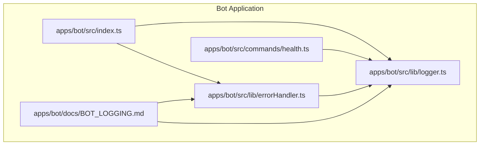
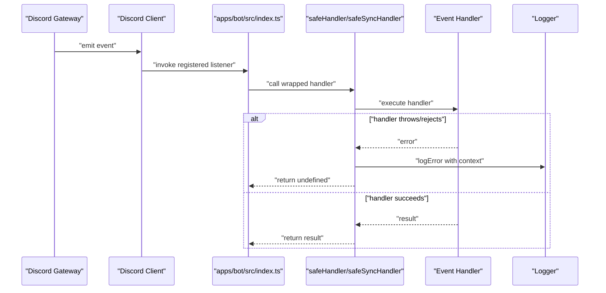
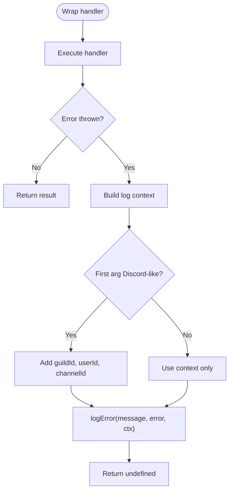
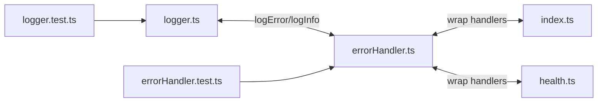

# Event Handling

<cite>
**Referenced Files in This Document**
- [errorHandler.ts](file://apps/bot/src/lib/errorHandler.ts)
- [logger.ts](file://apps/bot/src/lib/logger.ts)
- [index.ts](file://apps/bot/src/index.ts)
- [health.ts](file://apps/bot/src/commands/health.ts)
- [BOT_LOGGING.md](file://apps/bot/docs/BOT_LOGGING.md)
- [errorHandler.test.ts](file://apps/bot/tests/errorHandler.test.ts)
- [logger.test.ts](file://apps/bot/tests/logger.test.ts)
</cite>

## Table of Contents
1. [Introduction](#introduction)
2. [Project Structure](#project-structure)
3. [Core Components](#core-components)
4. [Architecture Overview](#architecture-overview)
5. [Detailed Component Analysis](#detailed-component-analysis)
6. [Dependency Analysis](#dependency-analysis)
7. [Performance Considerations](#performance-considerations)
8. [Troubleshooting Guide](#troubleshooting-guide)
9. [Conclusion](#conclusion)

## Introduction
This document explains the event handling sub-component used to safely process asynchronous Discord gateway events. It covers:
- Safe handler wrappers for async and sync event processing
- Automatic context extraction from Discord.js objects (guildId, userId, channelId)
- Differences between async and sync wrappers and when to use each
- How events are routed from the Discord gateway to handlers via client.on() listeners
- Error propagation, logging integration, and how unhandled exceptions are prevented from crashing the bot
- Performance implications and memory leak prevention strategies

## Project Structure
The event handling system lives in the bot application and is composed of:
- A centralized logger with structured context
- Safe handler wrappers for async and sync functions
- Example usage in the bot’s entry point and a health command

**Diagram sources**
- [index.ts](file://apps/bot/src/index.ts#L1-L64)
- [health.ts](file://apps/bot/src/commands/health.ts#L1-L97)
- [errorHandler.ts](file://apps/bot/src/lib/errorHandler.ts#L1-L76)
- [logger.ts](file://apps/bot/src/lib/logger.ts#L1-L93)
- [BOT_LOGGING.md](file://apps/bot/docs/BOT_LOGGING.md#L1-L313)

**Section sources**
- [index.ts](file://apps/bot/src/index.ts#L1-L64)
- [errorHandler.ts](file://apps/bot/src/lib/errorHandler.ts#L1-L76)
- [logger.ts](file://apps/bot/src/lib/logger.ts#L1-L93)
- [health.ts](file://apps/bot/src/commands/health.ts#L1-L97)
- [BOT_LOGGING.md](file://apps/bot/docs/BOT_LOGGING.md#L1-L313)

## Core Components
- Logger: Provides structured logging with timestamps, levels, and optional context. Supports child loggers with default context.
- Safe async handler: Wraps async event handlers to catch errors, log them with context, and return undefined to prevent crashes.
- Safe sync handler: Wraps synchronous event handlers to catch thrown errors, log them with context, and return undefined to prevent crashes.

Key behaviors:
- Context extraction: When the first argument to a wrapped handler looks like a Discord object (interaction, message, or guild), the wrapper extracts guildId, userId, and channelId for logging.
- Logging integration: Errors are logged with stack traces and optional error metadata.
- Unhandled exception safety: Async rejections and sync exceptions are caught and logged; the process continues.

**Section sources**
- [logger.ts](file://apps/bot/src/lib/logger.ts#L1-L93)
- [errorHandler.ts](file://apps/bot/src/lib/errorHandler.ts#L1-L76)
- [BOT_LOGGING.md](file://apps/bot/docs/BOT_LOGGING.md#L69-L190)

## Architecture Overview
The event pipeline from Discord gateway to handlers follows this flow:
- The Discord client emits events (e.g., ClientReady, MessageCreate).
- Handlers are registered via client.on() with safe wrappers.
- The safe wrappers execute the handler inside a try/catch, extracting context from the event payload when available.
- Errors are logged and swallowed to keep the bot running.

**Diagram sources**
- [index.ts](file://apps/bot/src/index.ts#L1-L64)
- [errorHandler.ts](file://apps/bot/src/lib/errorHandler.ts#L1-L76)
- [logger.ts](file://apps/bot/src/lib/logger.ts#L1-L93)

## Detailed Component Analysis

### Safe Handler Wrappers
- Purpose: Provide crash safety for event handlers by catching errors and logging them.
- Async wrapper: safeHandler<T extends (...args: any[]) => Promise<any>>(handler, context)
  - Executes handler and returns its result.
  - On error, extracts Discord context from the first argument if present and logs with context.
- Sync wrapper: safeSyncHandler<T extends (...args: any[]) => any>(handler, context)
  - Executes handler synchronously and returns its result.
  - On thrown error, logs with context.

Context extraction rules:
- Interaction-like object: guildId (DM if null), userId, channelId
- Message-like object: guildId (DM if null), userId, channelId
- Generic client event with guild-like object: guildId

**Diagram sources**
- [errorHandler.ts](file://apps/bot/src/lib/errorHandler.ts#L1-L76)
- [logger.ts](file://apps/bot/src/lib/logger.ts#L1-L93)

**Section sources**
- [errorHandler.ts](file://apps/bot/src/lib/errorHandler.ts#L1-L76)
- [logger.ts](file://apps/bot/src/lib/logger.ts#L1-L93)
- [errorHandler.test.ts](file://apps/bot/tests/errorHandler.test.ts#L1-L165)
- [logger.test.ts](file://apps/bot/tests/logger.test.ts#L1-L38)

### Logger and Context
- Logger provides logInfo, logWarn, logError, logDebug, and createLogger for child loggers.
- Log context is a structured object with keys like context, guildId, userId, channelId, and arbitrary key/value pairs.
- logError augments context with error message and stack line 1, then prints the full stack.

Best practices:
- Always include context for easier debugging.
- Use child loggers to attach consistent context (e.g., command or event name).
- DEBUG logs are only emitted in non-production environments.

**Section sources**
- [logger.ts](file://apps/bot/src/lib/logger.ts#L1-L93)
- [logger.test.ts](file://apps/bot/tests/logger.test.ts#L1-L38)

### Event Routing via client.on()
- The bot’s entry point demonstrates how to register event listeners using safe handlers.
- Example patterns shown:
  - Ready event handler wrapped with safeHandler
  - MessageCreate event handler wrapped with safeHandler
- These patterns ensure that unhandled errors in event handlers do not crash the process.

Note: The current scaffold does not initialize a Discord client; the examples show how to wire handlers when the client is available.

**Section sources**
- [index.ts](file://apps/bot/src/index.ts#L1-L64)
- [BOT_LOGGING.md](file://apps/bot/docs/BOT_LOGGING.md#L144-L162)

### Example: Health Command
- The health command is implemented as a pair of functions: a checker and a handler.
- The handler uses the logger to record execution with context (guildId, userId, channelId).
- The command is gated by a simple string match and replies with an embed.

This illustrates:
- Using safe handlers for message processing
- Logging with context
- Returning early after handling a command

**Section sources**
- [health.ts](file://apps/bot/src/commands/health.ts#L1-L97)
- [BOT_LOGGING.md](file://apps/bot/docs/BOT_LOGGING.md#L193-L207)

## Dependency Analysis
The event handling system has clear, low-coupling dependencies:
- errorHandler.ts depends on logger.ts for logging.
- index.ts and health.ts depend on errorHandler.ts and logger.ts for safe execution and logging.
- Tests validate both logger formatting and error handler behavior.

**Diagram sources**
- [errorHandler.ts](file://apps/bot/src/lib/errorHandler.ts#L1-L76)
- [logger.ts](file://apps/bot/src/lib/logger.ts#L1-L93)
- [index.ts](file://apps/bot/src/index.ts#L1-L64)
- [health.ts](file://apps/bot/src/commands/health.ts#L1-L97)
- [errorHandler.test.ts](file://apps/bot/tests/errorHandler.test.ts#L1-L165)
- [logger.test.ts](file://apps/bot/tests/logger.test.ts#L1-L38)

**Section sources**
- [errorHandler.ts](file://apps/bot/src/lib/errorHandler.ts#L1-L76)
- [logger.ts](file://apps/bot/src/lib/logger.ts#L1-L93)
- [index.ts](file://apps/bot/src/index.ts#L1-L64)
- [health.ts](file://apps/bot/src/commands/health.ts#L1-L97)
- [errorHandler.test.ts](file://apps/bot/tests/errorHandler.test.ts#L1-L165)
- [logger.test.ts](file://apps/bot/tests/logger.test.ts#L1-L38)

## Performance Considerations
- Async vs sync wrappers:
  - Use safeHandler for async event handlers to avoid blocking and to benefit from automatic error containment.
  - Use safeSyncHandler for lightweight synchronous operations that still need error containment.
- Context extraction overhead:
  - The wrappers perform a shallow check on the first argument to detect Discord objects. This is negligible compared to network I/O and command processing.
- Logging cost:
  - Structured logging is lightweight; avoid excessive logging in hot paths.
- Memory leaks:
  - Ensure listeners are removed when no longer needed (e.g., during shutdown or when switching contexts).
  - Avoid capturing large closures in event handlers; pass only necessary data.
  - Prefer child loggers with default context to reduce repeated context construction.
- Graceful shutdown:
  - The bot registers signal handlers for SIGINT/SIGTERM to exit cleanly. Combine this with removing listeners to prevent lingering resources.

[No sources needed since this section provides general guidance]

## Troubleshooting Guide
Common issues and resolutions:
- Handler crashes the bot:
  - Wrap all event handlers with safeHandler or safeSyncHandler.
  - Verify that errors are logged with context and stack traces.
- Missing context in logs:
  - Ensure the first argument to the handler is a Discord object (interaction, message, or guild).
  - For custom events, pass a context object explicitly to logger functions.
- Excessive logging:
  - Use child loggers with default context to avoid repeating fields.
  - Use DEBUG logs only in development; they are suppressed in production.
- Tests failing:
  - Confirm that error handler tests cover both async and sync paths, including non-Error thrown values.

**Section sources**
- [errorHandler.test.ts](file://apps/bot/tests/errorHandler.test.ts#L1-L165)
- [logger.test.ts](file://apps/bot/tests/logger.test.ts#L1-L38)
- [errorHandler.ts](file://apps/bot/src/lib/errorHandler.ts#L1-L76)
- [logger.ts](file://apps/bot/src/lib/logger.ts#L1-L93)

## Conclusion
The event handling sub-component provides robust, crash-safe processing for Discord events:
- Safe async and sync wrappers encapsulate error handling and logging
- Automatic context extraction improves observability
- Clear separation of concerns keeps the system maintainable
- Tests validate core behaviors, and documentation outlines best practices

Adopt these patterns consistently across all event handlers to ensure reliability and observability.