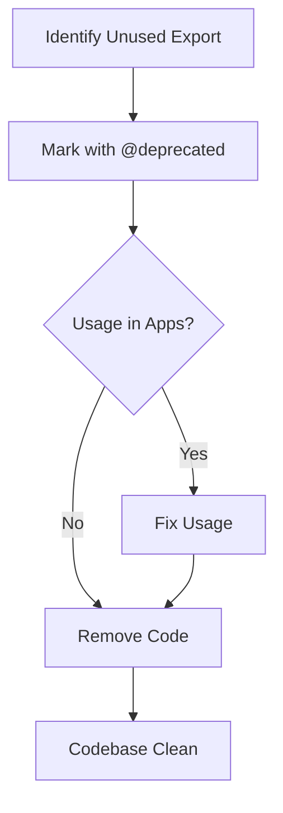
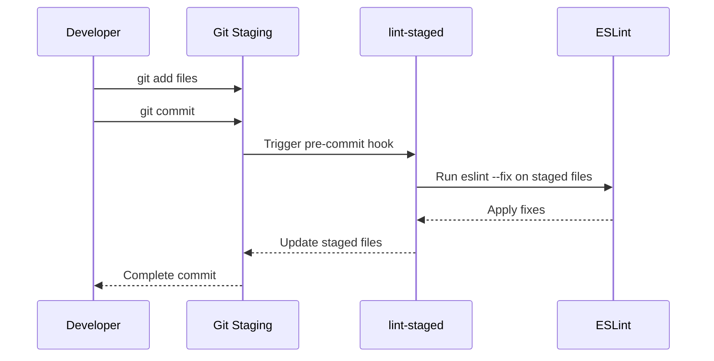
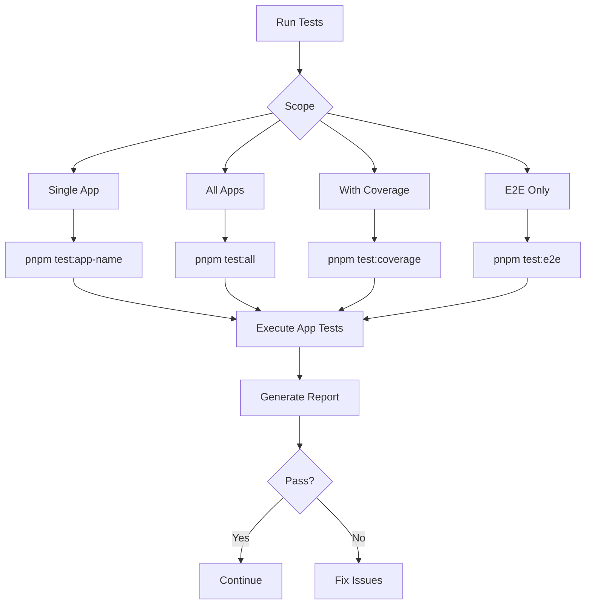

# Contribution Guide

<cite>
**Referenced Files in This Document**   
- [CONTRIBUTING.md](file://CONTRIBUTING.md)
- [eslint.config.mjs](file://eslint.config.mjs)
- [package.json](file://package.json)
- [pnpm-workspace.yaml](file://pnpm-workspace.yaml)
- [DEV_WORKFLOW.md](file://docs/DEV_WORKFLOW.md)
- [jest.config.js](file://apps/admin-api/jest.config.js)
- [vitest.config.ts](file://apps/web/vitest.config.ts)
- [tsconfig.node.json](file://tsconfig.node.json)
- [check-deprecation.ts](file://scripts/check-deprecation.ts)
</cite>

## Table of Contents
1. [Introduction](#introduction)
2. [Code Style Guidelines](#code-style-guidelines)
3. [Pull Request Process](#pull-request-process)
4. [Issue Tracking Methodology](#issue-tracking-methodology)
5. [Documentation Standards](#documentation-standards)
6. [Development Setup and Pre-commit Hooks](#development-setup-and-pre-commit-hooks)
7. [Testing Guidelines](#testing-guidelines)
8. [Monorepo-Specific Considerations](#monorepo-specific-considerations)

## Introduction
This Contribution Guide provides comprehensive instructions for developers collaborating on the slimy-monorepo platform. The guide covers essential aspects of the development workflow, including code quality enforcement, pull request procedures, issue tracking, documentation practices, and testing standards. Designed to onboard new contributors while maintaining high code quality, this document ensures consistency across the monorepo's multiple applications and shared packages.

**Section sources**
- [CONTRIBUTING.md](file://CONTRIBUTING.md#L1-L25)
- [DEV_WORKFLOW.md](file://docs/DEV_WORKFLOW.md#L1-L387)

## Code Style Guidelines
The slimy-monorepo enforces consistent code style through ESLint and TypeScript configurations. All code must adhere to these standards to ensure maintainability and prevent technical debt accumulation.

### ESLint Configuration
The repository uses a centralized ESLint configuration defined in `eslint.config.mjs`. This configuration extends the recommended rules from both JavaScript and TypeScript ESLint plugins. Key rules include:
- `@typescript-eslint/no-unused-vars`: Errors on unused variables to prevent dead code
- `@typescript-eslint/no-explicit-any`: Warns against explicit use of `any` type to maintain type safety

The linter ignores common build and dependency directories such as `node_modules`, `dist`, `build`, and `.next`.

### TypeScript Configuration
TypeScript is configured with a base `tsconfig.node.json` file that sets compiler options for Node.js environments, including:
- Targeting ES2020 for modern JavaScript features
- Enabling `esModuleInterop` for better module compatibility
- Setting `strict` mode to false (individual apps may override this)

Each application maintains its own `tsconfig.json` file that extends from the root configuration, allowing for app-specific TypeScript settings while maintaining consistency across the monorepo.

### Zero-Zombie Policy
The project enforces a strict "Zero-Zombie Policy" to eliminate dead code:
1. Unused exports in `packages/` are identified through dependency analysis
2. Identified exports are marked with `/** @deprecated [Manus Audit] Unused */` JSDoc comment
3. Deprecated code must be removed within one sprint cycle

This policy is enforced by the `lint:deprecations` script which scans for usage of deprecated exports and fails the build if any are found.



**Diagram sources**
- [CONTRIBUTING.md](file://CONTRIBUTING.md#L5-L25)
- [eslint.config.mjs](file://eslint.config.mjs#L1-L23)
- [check-deprecation.ts](file://scripts/check-deprecation.ts#L1-L93)

**Section sources**
- [CONTRIBUTING.md](file://CONTRIBUTING.md#L5-L25)
- [eslint.config.mjs](file://eslint.config.mjs#L1-L23)
- [tsconfig.node.json](file://tsconfig.node.json#L1-L16)

## Pull Request Process
The pull request process follows standardized practices to ensure code quality and maintainability across the monorepo.

### Branch Naming Conventions
While specific branch naming conventions are not explicitly documented, the project structure and workflow suggest using descriptive, lowercase branch names with hyphens separating words. Examples include:
- `feature/user-authentication`
- `bugfix/login-error`
- `refactor/database-connection`

Branches should be created from the main branch and kept focused on a single feature or fix.

### Commit Message Standards
Commit messages should follow conventional commit format:
- Use imperative mood ("fix" not "fixed" or "fixes")
- Limit the first line to 72 characters
- Include a body that explains what and why when necessary
- Reference relevant issues using #issue-number

Example: `fix: resolve null reference in user profile loading`

### Code Review Requirements
All pull requests require review before merging. The review process focuses on:
- Adherence to code style guidelines
- Proper TypeScript typing
- Test coverage for new functionality
- Documentation updates
- Compliance with the Zero-Zombie Policy
- Performance implications

The CI/CD pipeline automatically runs linting, type checking, and tests on all pull requests, preventing merges that fail these checks.

**Section sources**
- [package.json](file://package.json#L1-L45)
- [DEV_WORKFLOW.md](file://docs/DEV_WORKFLOW.md#L1-L387)

## Issue Tracking Methodology
The project uses GitHub Issues for tracking bugs, features, and technical debt. While specific labeling conventions are not documented in the provided files, the project structure suggests a systematic approach to issue management.

### Issue Categorization
Issues should be categorized using appropriate labels:
- `bug`: For defects in existing functionality
- `feature`: For new functionality requests
- `refactor`: For code improvements without feature changes
- `documentation`: For doc updates
- `dependencies`: For dependency updates

### Assignment and Workflow
Issues are assigned to developers based on expertise and availability. The typical workflow includes:
1. Issue creation with detailed description and reproduction steps
2. Triage and prioritization by maintainers
3. Assignment to a developer
4. Implementation in a feature branch
5. Pull request with reference to the original issue
6. Code review and testing
7. Merge and issue closure

The project's documentation in `docs/branch-plan/` suggests careful planning of work through markdown files, indicating a preference for documenting implementation plans before coding.

**Section sources**
- [DEV_WORKFLOW.md](file://docs/DEV_WORKFLOW.md#L1-L387)
- [docs/branch-plan/](file://docs/branch-plan/)

## Documentation Standards
The project maintains high standards for documentation to ensure code maintainability and contributor onboarding.

### Code Comments
Code should include JSDoc comments for:
- Functions and methods (description, parameters, return values)
- Classes and interfaces (purpose and usage)
- Complex algorithms or non-obvious logic
- Deprecated functions with removal rationale

The deprecation process specifically requires JSDoc `@deprecated` tags with a reason, following the format `/** @deprecated [Manus Audit] Unused */`.

### API Documentation
API endpoints should be documented in the respective application's README file. The admin-api application includes route-specific documentation in its source files, with endpoints defined in the `routes/` directory and corresponding middleware in the `middleware/` directory.

### Architectural Decision Records
Architectural decisions are documented in the `docs/` directory using markdown files. Examples include:
- `ARCHITECTURAL_AUDIT.md`: Records major architectural reviews
- `INFRA_OVERVIEW.md`: Documents infrastructure decisions
- `SERVICES_MATRIX.md`: Tracks service-level agreements and capabilities

These documents serve as permanent records of significant technical decisions, explaining the context, options considered, and rationale for the chosen solution.

**Section sources**
- [CONTRIBUTING.md](file://CONTRIBUTING.md#L5-L25)
- [DEV_WORKFLOW.md](file://docs/DEV_WORKFLOW.md#L1-L387)
- [docs/](file://docs/)

## Development Setup and Pre-commit Hooks
The development environment is configured to enforce code quality through automated tooling.

### Initial Setup
To set up the development environment:
1. Install Node.js v20+ and pnpm
2. Clone the repository and navigate to the root directory
3. Run `pnpm install` to install all dependencies
4. Copy `.env.example` files to `.env` in relevant apps
5. Run `pnpm prisma:generate` to generate Prisma clients

### Tool Configuration
The monorepo uses pnpm workspaces defined in `pnpm-workspace.yaml`, which includes all apps and packages in the workspace. This enables efficient dependency management and cross-package linking.

### Pre-commit Hooks
The repository uses Husky for Git hooks, configured through the `lint-staged` property in `package.json`. Before each commit:
1. Staged files are checked by ESLint
2. `eslint --fix` is automatically run on `.ts`, `.tsx`, `.js`, and `.jsx` files
3. If fixes are applied, they must be staged again before committing

This ensures that all committed code meets the project's style guidelines. The `prepare` script in `package.json` automatically installs Husky, ensuring consistent hook setup across all developer environments.



**Diagram sources**
- [package.json](file://package.json#L27-L43)
- [DEV_WORKFLOW.md](file://docs/DEV_WORKFLOW.md#L1-L387)

**Section sources**
- [package.json](file://package.json#L27-L43)
- [pnpm-workspace.yaml](file://pnpm-workspace.yaml#L1-L14)
- [DEV_WORKFLOW.md](file://docs/DEV_WORKFLOW.md#L1-L387)

## Testing Guidelines
The project maintains a comprehensive testing strategy with different frameworks for different applications.

### Test Frameworks
Different applications use appropriate testing frameworks:
- **admin-api**: Uses Jest for unit and integration testing
- **web**: Uses Vitest for unit testing and Playwright for end-to-end testing
- **admin-ui**: Testing framework to be determined
- **bot**: Testing framework to be determined

### Test Structure
Tests are organized in `tests/` directories within each application:
- Unit tests for individual functions and components
- Integration tests for module interactions
- End-to-end tests for critical user flows

The admin-api Jest configuration sets up a node test environment with setup files and collects coverage from source files while excluding test files.

### Test Coverage
The project enforces minimum test coverage thresholds:
- **admin-api**: 50% coverage for branches, functions, lines, and statements
- **web**: 60% coverage for branches, functions, lines, and statements

Coverage reports are generated in multiple formats (text, json, html, lcov) to support different analysis tools.

### Running Tests
Tests can be run at different levels:
- Individual app: `pnpm test:admin-api`, `pnpm test:web`
- All apps: `pnpm test:all` or `pnpm test`
- With coverage: `pnpm test:coverage` (web app)
- End-to-end tests: `pnpm test:e2e` (web app)



**Diagram sources**
- [jest.config.js](file://apps/admin-api/jest.config.js#L1-L56)
- [vitest.config.ts](file://apps/web/vitest.config.ts#L1-L50)
- [DEV_WORKFLOW.md](file://docs/DEV_WORKFLOW.md#L1-L387)

**Section sources**
- [jest.config.js](file://apps/admin-api/jest.config.js#L1-L56)
- [vitest.config.ts](file://apps/web/vitest.config.ts#L1-L50)
- [DEV_WORKFLOW.md](file://docs/DEV_WORKFLOW.md#L1-L387)

## Monorepo-Specific Considerations
The slimy-monorepo architecture requires special attention to cross-package dependencies and versioning.

### Package Structure
The monorepo contains two main directories:
- `apps/`: Contains independent applications (admin-api, admin-ui, web, bot)
- `packages/`: Contains shared libraries consumed by multiple apps

Shared packages include:
- `shared-auth`: Authentication utilities
- `shared-config`: Configuration management
- `shared-db`: Database access patterns
- `shared-snail`: Snail-related functionality

### Cross-Package Dependencies
Applications can depend on shared packages using the `@slimy/` scope. The pnpm workspace automatically links these packages during development, enabling seamless imports:
```typescript
import { auth } from "@slimy/shared-auth";
import { db } from "@slimy/shared-db";
```

When making changes to a shared package, developers must:
1. Verify all dependent apps continue to function
2. Run tests across all affected applications
3. Consider backward compatibility
4. Update documentation as needed

### Versioning Strategy
The monorepo uses independent versioning for each package and application. Version bumps are managed through conventional commits and automated release tools. Breaking changes in shared packages require major version increments and careful coordination with all consuming applications.

### Build and Dependency Management
The monorepo leverages pnpm's workspace features for efficient dependency management:
- Dependencies are hoisted to the root `node_modules` when possible
- Workspace packages are linked rather than copied
- Build scripts can target specific apps using the `--filter` flag

The `onlyBuiltDependencies` configuration in `pnpm-workspace.yaml` specifies which dependencies require build scripts to run, optimizing installation performance.

**Section sources**
- [package.json](file://package.json#L4-L7)
- [pnpm-workspace.yaml](file://pnpm-workspace.yaml#L1-L14)
- [package.json](file://package.json#L9-L28)