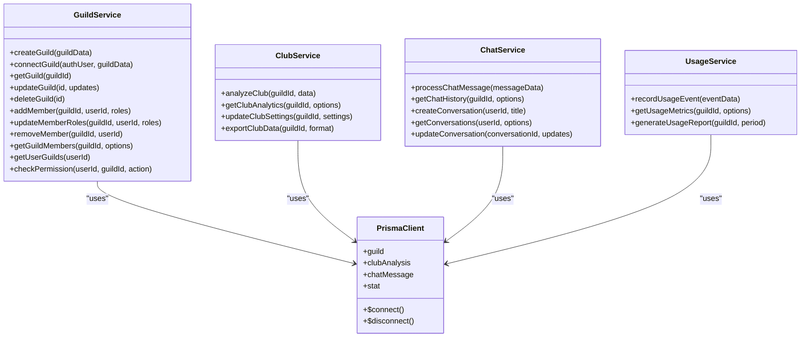

# Admin API

<cite>
**Referenced Files in This Document**   
- [README.md](file://apps/admin-api/README.md)
- [server.js](file://apps/admin-api/server.js)
- [src/app.js](file://apps/admin-api/src/app.js)
- [src/config.js](file://apps/admin-api/src/config.js)
- [src/middleware/auth.js](file://apps/admin-api/src/middleware/auth.js)
- [src/routes/index.js](file://apps/admin-api/src/routes/index.js)
- [src/routes/auth.js](file://apps/admin-api/src/routes/auth.js)
- [src/routes/guilds.js](file://apps/admin-api/src/routes/guilds.js)
- [src/services/guild.service.js](file://apps/admin-api/src/services/guild.service.js)
- [src/lib/database.js](file://apps/admin-api/src/lib/database.js)
- [prisma/schema.prisma](file://apps/admin-api/prisma/schema.prisma)
- [src/lib/queues/index.js](file://apps/admin-api/src/lib/queues/index.js)
- [src/middleware/rate-limit.js](file://apps/admin-api/src/middleware/rate-limit.js)
- [src/middleware/security.js](file://apps/admin-api/src/middleware/security.js)
- [ERROR_HANDLING.md](file://apps/admin-api/ERROR_HANDLING.md)
</cite>

## Table of Contents
1. [Introduction](#introduction)
2. [Project Structure](#project-structure)
3. [Core Components](#core-components)
4. [Architecture Overview](#architecture-overview)
5. [Detailed Component Analysis](#detailed-component-analysis)
6. [Dependency Analysis](#dependency-analysis)
7. [Performance Considerations](#performance-considerations)
8. [Troubleshooting Guide](#troubleshooting-guide)
9. [Conclusion](#conclusion)

## Introduction
The Admin API serves as the central RESTful backend service for the slimy-monorepo platform, providing a comprehensive interface for managing authentication, guild operations, club analytics, chat processing, and usage monitoring. Built on Express.js, this API acts as the backbone for the admin panel, enabling secure and efficient interaction with Discord guilds and associated data. The system implements a robust JWT-based authentication flow integrated with Discord OAuth2, ensuring secure access control through role-based permissions. Leveraging Prisma ORM for database operations, Redis for caching, and BullMQ for background job processing, the Admin API delivers a scalable and maintainable architecture. This documentation provides a comprehensive overview of the system's architecture, route structure, middleware pipeline, service layer organization, and integration patterns, along with practical guidance on configuration, error handling, and security considerations.

## Project Structure
The Admin API follows a well-organized directory structure that separates concerns and promotes maintainability. The core application resides in the `apps/admin-api/` directory, with a clear separation between configuration, source code, and supporting libraries. The `src/` directory contains the main application components, including middleware, routes, services, and configuration files, while the `prisma/` directory manages database schema and migrations. Supporting libraries and utilities are organized in dedicated directories, with the `lib/` folder housing shared functionality such as JWT handling, session management, and database utilities. The structure emphasizes modularity, with routes and services organized by functionality, making it easy to locate and extend specific features. Configuration is centralized in environment files and the `src/config.js` module, ensuring consistent settings across the application.

**Diagram sources**
- [README.md](file://apps/admin-api/README.md#L54-L70)

**Section sources**
- [README.md](file://apps/admin-api/README.md#L54-L70)

## Core Components
The Admin API consists of several core components that work together to provide a robust backend service. The authentication system implements a JWT-based flow with Discord OAuth2 integration, using httpOnly cookies for secure session management. The middleware pipeline includes comprehensive security measures such as rate limiting, input sanitization, and security headers through Helmet.js. The service layer is organized around specific domains like guild management, club analytics, and chat processing, with each service encapsulating business logic and database interactions. The routing system follows a modular approach, with routes organized by functionality and mounted through the main router. The error handling system provides standardized responses and structured logging, making it easier to diagnose and resolve issues. These components work in concert to deliver a secure, scalable, and maintainable API that serves as the foundation for the admin panel.

**Section sources**
- [README.md](file://apps/admin-api/README.md#L7-L11)
- [ERROR_HANDLING.md](file://apps/admin-api/ERROR_HANDLING.md#L1-L216)

## Architecture Overview
The Admin API follows a layered architecture built on Express.js, with clear separation between the presentation, business logic, and data access layers. At the presentation layer, Express.js handles HTTP requests and responses, with routes organized by functionality and mounted through a central router. The middleware pipeline sits between the presentation and business logic layers, providing cross-cutting concerns such as authentication, rate limiting, and security. The business logic layer is implemented through a collection of services, each responsible for a specific domain such as guild management, club analytics, or chat processing. These services interact with the data access layer through Prisma ORM, which provides a type-safe interface to the MySQL database. The architecture also incorporates background job processing through BullMQ and Redis, allowing for asynchronous execution of resource-intensive operations. This layered approach promotes maintainability, testability, and scalability, making it easier to extend and modify the system as requirements evolve.

**Diagram sources**
- [src/app.js](file://apps/admin-api/src/app.js#L1-L64)
- [src/lib/database.js](file://apps/admin-api/src/lib/database.js#L1-L680)
- [src/lib/queues/index.js](file://apps/admin-api/src/lib/queues/index.js#L1-L396)

## Detailed Component Analysis

### Authentication System
The authentication system implements a secure JWT-based flow integrated with Discord OAuth2, providing a seamless login experience while maintaining high security standards. The flow begins with a login request that generates a state token and redirects the user to Discord's authorization endpoint. Upon successful authorization, Discord redirects back to the callback endpoint, where the code is exchanged for an access token. The system then fetches the user's profile and guild information from Discord's API, creating a JWT with minimal user data to avoid exceeding cookie size limits. The full guild data is stored in a server-side session store, referenced by the JWT, ensuring efficient session management. The authentication middleware provides both blocking and non-blocking authentication, allowing routes to check for authentication as needed. This approach balances security with performance, ensuring that sensitive operations require authentication while allowing public routes to function without it.

**Diagram sources**
- [src/routes/auth.js](file://apps/admin-api/src/routes/auth.js#L1-L482)
- [src/middleware/auth.js](file://apps/admin-api/src/middleware/auth.js#L1-L314)

### Middleware Pipeline
The middleware pipeline implements a comprehensive security and functionality layer that processes requests before they reach the route handlers. The pipeline begins with security headers through Helmet.js, which sets various HTTP headers to protect against common web vulnerabilities. This is followed by request ID generation, which enables tracking of requests across the system for debugging and monitoring purposes. The authentication middleware resolves the user session by verifying the JWT and hydrating the user object, making it available to subsequent middleware and route handlers. Rate limiting is applied to prevent abuse, with different limits for various types of operations. Input validation and sanitization ensure that all incoming data is clean and safe, protecting against injection attacks and other security threats. Finally, request logging captures detailed information about each request, including timing and user context, providing valuable insights for monitoring and troubleshooting.

**Diagram sources**
- [src/app.js](file://apps/admin-api/src/app.js#L1-L64)
- [src/middleware/security.js](file://apps/admin-api/src/middleware/security.js#L1-L285)
- [src/middleware/rate-limit.js](file://apps/admin-api/src/middleware/rate-limit.js#L1-L23)

### Service Layer Organization
The service layer is organized around specific business domains, with each service encapsulating the logic for a particular feature area. The Guild Service handles all operations related to Discord guilds, including creation, updating, and membership management. The Club Service manages club analytics, including data ingestion, processing, and retrieval. The Chat Service handles chat message processing, conversation management, and AI interactions. The Usage Service tracks and reports on system usage, providing insights into user activity and resource consumption. Each service follows a consistent pattern, with methods for CRUD operations and business logic, making it easy to understand and extend. The services interact with the data access layer through Prisma ORM, which provides a type-safe interface to the database. This organization promotes separation of concerns, making the codebase more maintainable and testable.

**Diagram sources**
- [src/services/guild.service.js](file://apps/admin-api/src/services/guild.service.js#L1-L717)
- [prisma/schema.prisma](file://apps/admin-api/prisma/schema.prisma#L1-L464)

## Dependency Analysis
The Admin API has a well-defined dependency structure that promotes modularity and maintainability. The core dependencies include Express.js for the web framework, Prisma ORM for database access, and BullMQ for background job processing. The application relies on Redis for caching and session storage, with a fallback to in-memory storage for development environments. The authentication system depends on Discord's OAuth2 API for user authentication and authorization, while the club analytics features integrate with external services for data processing. The monitoring and observability stack includes Pino for structured logging, Prometheus for metrics collection, and Grafana for visualization. These dependencies are managed through npm and documented in the package.json file, with version ranges specified to ensure compatibility while allowing for updates. The dependency structure is designed to be flexible, allowing components to be replaced or upgraded with minimal impact on the rest of the system.

**Diagram sources**
- [package.json](file://apps/admin-api/package.json)
- [src/lib/queues/index.js](file://apps/admin-api/src/lib/queues/index.js#L1-L396)
- [src/lib/database.js](file://apps/admin-api/src/lib/database.js#L1-L680)

## Performance Considerations
The Admin API incorporates several performance optimization techniques to ensure responsive and scalable operation. Request caching is implemented through Redis, with frequently accessed data such as guild configurations and user profiles stored in memory for rapid retrieval. Database queries are optimized through careful indexing, with indexes created on commonly queried fields to minimize query execution time. The system uses connection pooling to manage database connections efficiently, reducing the overhead of establishing new connections for each request. Background job processing through BullMQ allows resource-intensive operations like data analysis and report generation to be performed asynchronously, preventing them from blocking the main request-response cycle. Rate limiting is applied strategically to prevent abuse and ensure fair resource allocation among users. The API also implements efficient data serialization and compression to minimize network transfer times, particularly for large responses. These optimizations work together to deliver a responsive user experience even under heavy load.

**Section sources**
- [src/lib/queues/index.js](file://apps/admin-api/src/lib/queues/index.js#L1-L396)
- [prisma/schema.prisma](file://apps/admin-api/prisma/schema.prisma#L1-L464)
- [src/middleware/rate-limit.js](file://apps/admin-api/src/middleware/rate-limit.js#L1-L23)

## Troubleshooting Guide
When troubleshooting issues with the Admin API, start by checking the system logs for error messages and stack traces. Common issues include authentication failures, rate limit errors, and database connection problems. For authentication issues, verify that the Discord OAuth2 credentials are correctly configured in the environment variables and that the redirect URI matches the application's configuration. Rate limit errors can be resolved by implementing exponential backoff in client applications or adjusting the rate limit configuration for specific use cases. Database connection problems may indicate issues with the MySQL server or incorrect database URL configuration. The health check endpoint (`GET /api/health`) can be used to verify the basic functionality of the service, while the status endpoint (`GET /api/status`) provides more detailed information about subsystem health. When debugging complex issues, enable debug logging and use the request ID to trace the flow of specific requests through the system.

**Section sources**
- [ERROR_HANDLING.md](file://apps/admin-api/ERROR_HANDLING.md#L1-L216)
- [server.js](file://apps/admin-api/server.js#L1-L100)
- [src/app.js](file://apps/admin-api/src/app.js#L1-L64)

## Conclusion
The Admin API provides a robust and scalable backend service for the slimy-monorepo platform, offering comprehensive functionality for managing authentication, guild operations, club analytics, chat processing, and usage monitoring. Its well-structured architecture, based on Express.js and Prisma ORM, promotes maintainability and extensibility, while its comprehensive security measures ensure the protection of user data and system resources. The integration of Redis for caching and BullMQ for background job processing enables efficient handling of resource-intensive operations, delivering a responsive user experience. The standardized error handling and structured logging system makes it easier to diagnose and resolve issues, while the modular design allows for incremental improvements and feature additions. As the platform continues to evolve, the Admin API provides a solid foundation for future growth and innovation.