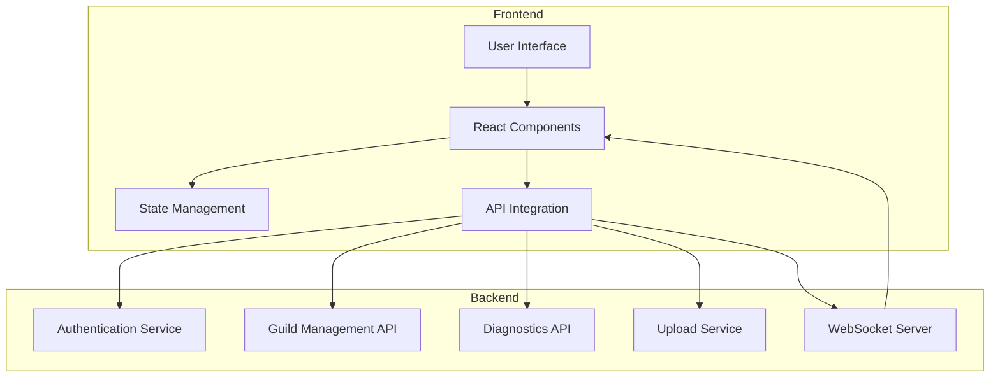
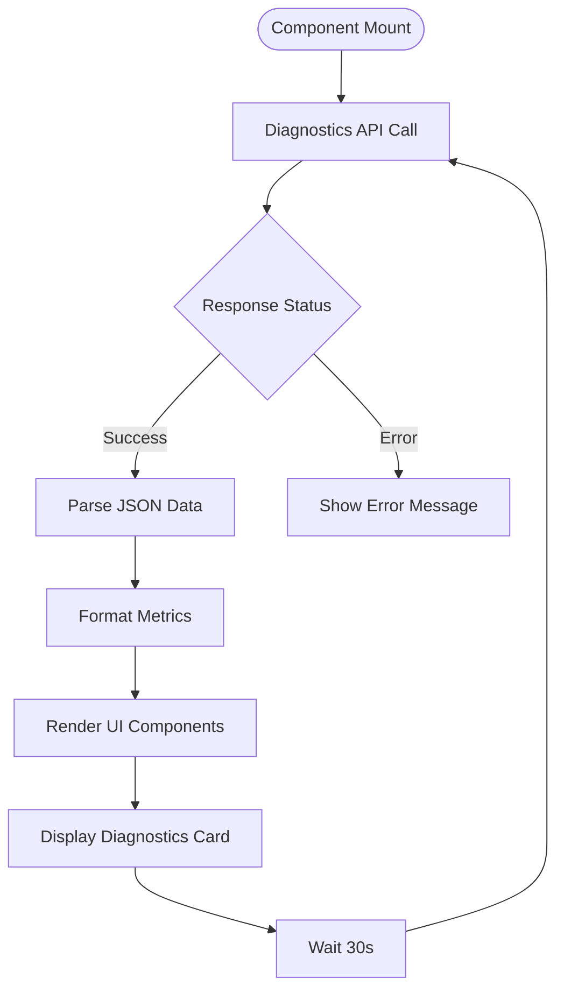
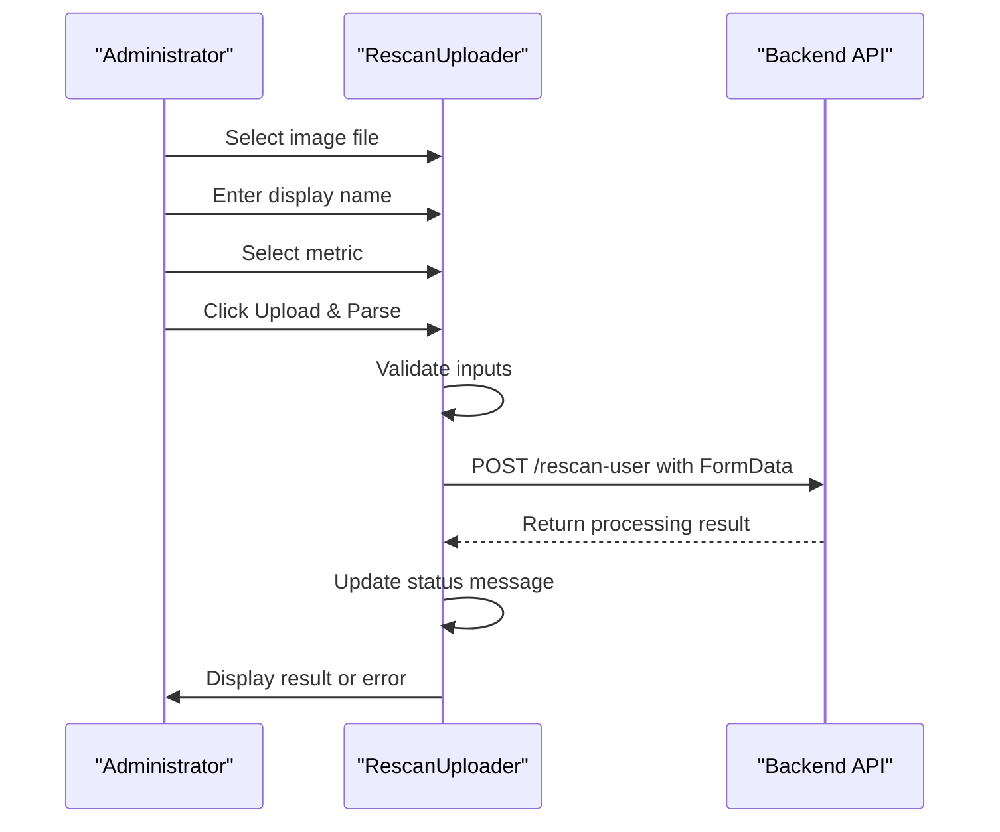
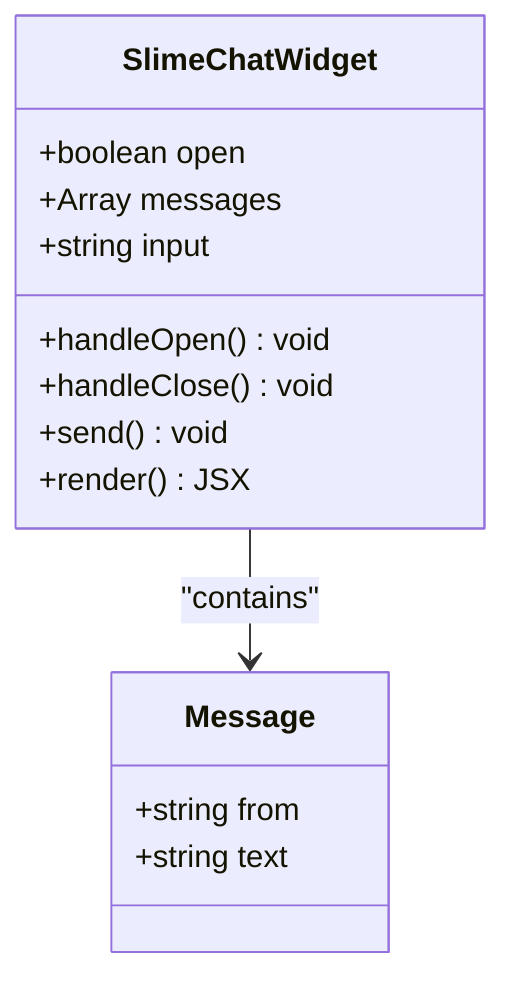
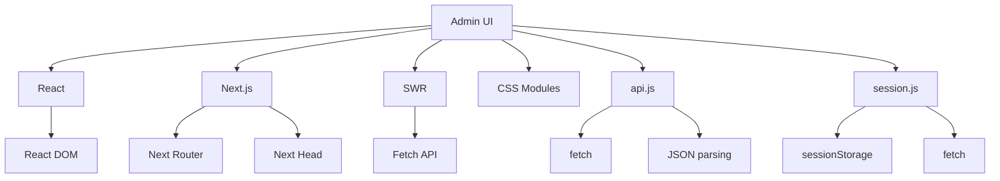

# Admin UI

<cite>
**Referenced Files in This Document**   
- [pages/guilds/index.js](file://apps/admin-ui/pages/guilds/index.js)
- [pages/guilds/[guildId]/index.js](file://apps/admin-ui/pages/guilds/[guildId]/index.js)
- [pages/guilds/[guildId]/settings.js](file://apps/admin-ui/pages/guilds/[guildId]/settings.js)
- [pages/guilds/[guildId]/corrections.js](file://apps/admin-ui/pages/guilds/[guildId]/corrections.js)
- [pages/guilds/[guildId]/personality.js](file://apps/admin-ui/pages/guilds/[guildId]/personality.js)
- [pages/guilds/[guildId]/usage.js](file://apps/admin-ui/pages/guilds/[guildId]/usage.js)
- [pages/guilds/[guildId]/rescan.js](file://apps/admin-ui/pages/guilds/[guildId]/rescan.js)
- [components/diag/DiagnosticsCard.jsx](file://apps/admin-ui/components/diag/DiagnosticsCard.jsx)
- [components/RescanUploader.js](file://apps/admin-ui/components/RescanUploader.js)
- [components/SlimeChatWidget.tsx](file://apps/admin-ui/components/SlimeChatWidget.tsx)
- [lib/api.js](file://apps/admin-ui/lib/api.js)
- [lib/session.js](file://apps/admin-ui/lib/session.js)
- [pages/login.js](file://apps/admin-ui/pages/login.js)
</cite>

## Table of Contents
1. [Introduction](#introduction)
2. [Project Structure](#project-structure)
3. [Core Components](#core-components)
4. [Architecture Overview](#architecture-overview)
5. [Detailed Component Analysis](#detailed-component-analysis)
6. [Dependency Analysis](#dependency-analysis)
7. [Performance Considerations](#performance-considerations)
8. [Troubleshooting Guide](#troubleshooting-guide)
9. [Conclusion](#conclusion)

## Introduction
The Admin UI is a React and Next.js application designed to provide system administrators with comprehensive tools for managing guilds, performing diagnostics, and configuring system settings. The interface serves as the central control panel for administrators to monitor system health, manage guild-specific configurations, and perform administrative actions. Built with a modern tech stack, the Admin UI offers an intuitive interface for managing complex operations including screenshot rescanning, member corrections, personality configuration, and usage monitoring. The application features responsive design elements and accessibility considerations to ensure usability across different devices and user needs.

## Project Structure
The Admin UI application follows a standard Next.js project structure with clear separation of concerns between pages, components, and utility libraries. The core functionality is organized under the `pages/` directory, with a dedicated `guilds/[guildId]` subdirectory for guild-specific views. This structure enables dynamic routing based on guild identifiers, allowing administrators to access specific guild configurations and data. The component library is organized in the `components/` directory, with specialized subdirectories for different component types. Utility functions and API integrations are centralized in the `lib/` directory, promoting code reuse and maintainability.

```mermaid
graph TB
subgraph "Admin UI Structure"
Pages[pages/] --> Guilds[guilds/]
Pages --> Components[components/]
Pages --> Lib[lib/]
Pages --> Styles[styles/]
Guilds --> GuildId[[guildId]/]
GuildId --> Settings[settings.js]
GuildId --> Corrections[corrections.js]
GuildId --> Personality[personality.js]
GuildId --> Usage[usage.js]
GuildId --> Rescan[rescan.js]
GuildId --> Channels[channels.js]
Components --> Diag[diag/]
Components --> Slimechat[slimechat/]
Components --> Other[Other Components]
Diag --> DiagnosticsCard[DiagnosticsCard.jsx]
Slimechat --> SlimeChatBar[SlimeChatBar.jsx]
Slimechat --> CompactBar[compactbar.css]
Other --> RescanUploader[RescanUploader.js]
Other --> SlimeChatWidget[SlimeChatWidget.tsx]
Other --> CorrectionsManager[CorrectionsManager.js]
Other --> GuildUploadsTab[GuildUploadsTab.js]
Other --> GuildSheetTab[GuildSheetTab.js]
Lib --> Api[api.js]
Lib --> Session[session.js]
Lib --> Discord[discord.js]
Lib --> Sheets[sheets.js]
Lib --> Socket[socket.js]
Lib --> Tasks[tasks.js]
end
```

**Diagram sources**
- [pages/guilds/index.js](file://apps/admin-ui/pages/guilds/index.js)
- [components/diag/DiagnosticsCard.jsx](file://apps/admin-ui/components/diag/DiagnosticsCard.jsx)
- [components/RescanUploader.js](file://apps/admin-ui/components/RescanUploader.js)
- [components/SlimeChatWidget.tsx](file://apps/admin-ui/components/SlimeChatWidget.tsx)
- [lib/api.js](file://apps/admin-ui/lib/api.js)

**Section sources**
- [pages/guilds/index.js](file://apps/admin-ui/pages/guilds/index.js)
- [components/diag/DiagnosticsCard.jsx](file://apps/admin-ui/components/diag/DiagnosticsCard.jsx)

## Core Components
The Admin UI features several key components that provide essential functionality for system administration. The DiagnosticsCard component displays real-time system metrics including API uptime, memory usage, and upload statistics. The RescanUploader component enables administrators to upload and parse user screenshots for data correction purposes. The SlimeChatWidget provides an interactive chat interface for communication with the system bot. These components are integrated with backend APIs through the centralized api.js library, which handles authentication, request formatting, and error handling. The component library follows React best practices with proper state management and reusable UI patterns.

**Section sources**
- [components/diag/DiagnosticsCard.jsx](file://apps/admin-ui/components/diag/DiagnosticsCard.jsx)
- [components/RescanUploader.js](file://apps/admin-ui/components/RescanUploader.js)
- [components/SlimeChatWidget.tsx](file://apps/admin-ui/components/SlimeChatWidget.tsx)
- [lib/api.js](file://apps/admin-ui/lib/api.js)

## Architecture Overview
The Admin UI architecture follows a client-server model with React components on the frontend communicating with backend APIs through HTTP requests and WebSocket connections. The application uses Next.js for server-side rendering and routing, with dynamic routes for guild-specific views. Authentication is managed through a session provider that handles JWT tokens and CSRF protection. The architecture includes a centralized API library that abstracts HTTP requests and response handling, ensuring consistent communication patterns across the application. Real-time updates are facilitated through WebSocket connections for live data streaming and task monitoring.



**Diagram sources**
- [lib/api.js](file://apps/admin-ui/lib/api.js)
- [lib/session.js](file://apps/admin-ui/lib/session.js)
- [pages/guilds/index.js](file://apps/admin-ui/pages/guilds/index.js)

## Detailed Component Analysis

### DiagnosticsCard Component
The DiagnosticsCard component provides a visual summary of system health metrics, fetching data from the /api/diagnostics endpoint at regular intervals. It displays key performance indicators such as API uptime, memory usage, and upload statistics in a compact card format. The component uses SWR for data fetching with automatic revalidation, ensuring that administrators always have access to current system information. Error handling is implemented to gracefully handle failed requests and display appropriate messages to users.



**Diagram sources**
- [components/diag/DiagnosticsCard.jsx](file://apps/admin-ui/components/diag/DiagnosticsCard.jsx)
- [lib/api.js](file://apps/admin-ui/lib/api.js)

**Section sources**
- [components/diag/DiagnosticsCard.jsx](file://apps/admin-ui/components/diag/DiagnosticsCard.jsx)

### RescanUploader Component
The RescanUploader component enables administrators to upload user screenshots for data correction and reprocessing. It provides a form interface for selecting image files, entering user information, and specifying processing metrics. The component handles file uploads through multipart form data, sending requests to the /api/guilds/{guildId}/rescan-user endpoint. It includes validation to ensure required fields are completed and provides real-time feedback on upload status and processing results.



**Diagram sources**
- [components/RescanUploader.js](file://apps/admin-ui/components/RescanUploader.js)
- [lib/api.js](file://apps/admin-ui/lib/api.js)

**Section sources**
- [components/RescanUploader.js](file://apps/admin-ui/components/RescanUploader.js)

### SlimeChatWidget Component
The SlimeChatWidget component provides an interactive chat interface for communication with the system bot. It features a toggle button to open and close the chat window, with a message history display and input field for sending new messages. The component maintains local state for messages and input, allowing users to send messages that are displayed in the chat history. While the current implementation simulates bot responses, the architecture supports integration with real-time messaging systems.



**Diagram sources**
- [components/SlimeChatWidget.tsx](file://apps/admin-ui/components/SlimeChatWidget.tsx)

**Section sources**
- [components/SlimeChatWidget.tsx](file://apps/admin-ui/components/SlimeChatWidget.tsx)

## Dependency Analysis
The Admin UI has a well-defined dependency structure with clear separation between UI components, utility libraries, and API integrations. The application relies on React and Next.js as its core framework, with SWR for data fetching and state management. The component library has minimal external dependencies, promoting maintainability and reducing bundle size. The API integration layer depends on the fetch API for HTTP requests, with proper error handling and response parsing. The authentication system depends on session management through cookies and CSRF tokens, ensuring secure communication with the backend.



**Diagram sources**
- [lib/api.js](file://apps/admin-ui/lib/api.js)
- [lib/session.js](file://apps/admin-ui/lib/session.js)
- [package.json](file://apps/admin-ui/package.json)

**Section sources**
- [lib/api.js](file://apps/admin-ui/lib/api.js)
- [lib/session.js](file://apps/admin-ui/lib/session.js)

## Performance Considerations
The Admin UI implements several performance optimizations to ensure responsive user experience. Data fetching is optimized through SWR's built-in caching and revalidation mechanisms, reducing unnecessary network requests. The application uses code splitting and dynamic imports to minimize initial bundle size. Image uploads are handled efficiently through direct FormData transmission, avoiding client-side processing overhead. The UI components are optimized for rendering performance with proper React memoization and state management. Real-time updates are implemented with efficient WebSocket connections that minimize bandwidth usage.

## Troubleshooting Guide
Common issues in the Admin UI typically relate to authentication, API connectivity, and data synchronization. For failed API calls, administrators should verify their authentication status and check network connectivity. Stale data issues can often be resolved by refreshing the page or clearing the browser's sessionStorage. Permission errors may occur when users lack appropriate roles for specific guilds, requiring administrator intervention to adjust access levels. When encountering upload failures, users should verify file formats and sizes against the accepted specifications. For persistent issues, checking browser developer tools for console errors and network request details can provide valuable diagnostic information.

**Section sources**
- [lib/api.js](file://apps/admin-ui/lib/api.js)
- [lib/session.js](file://apps/admin-ui/lib/session.js)
- [pages/login.js](file://apps/admin-ui/pages/login.js)

## Conclusion
The Admin UI provides a comprehensive interface for system administrators to manage guilds, monitor system health, and perform administrative tasks. With its well-structured component library and robust API integration, the application offers an intuitive and efficient workflow for managing complex operations. The responsive design and accessibility features ensure usability across different devices and user needs. By following React and Next.js best practices, the codebase maintains high quality and extensibility, making it easy to add new features and functionality as requirements evolve.