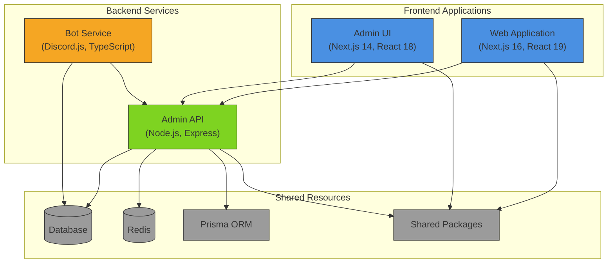
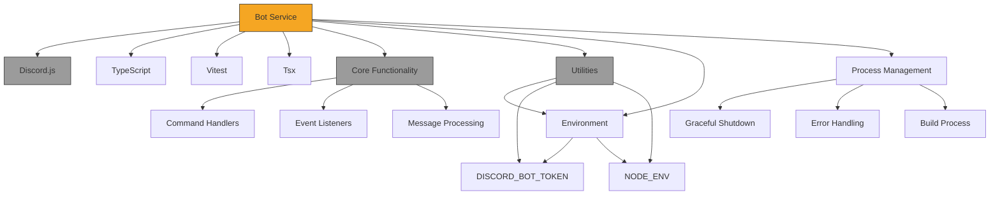
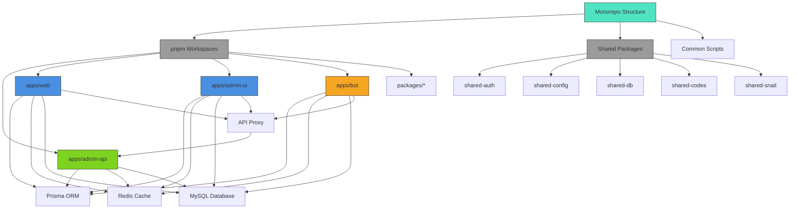
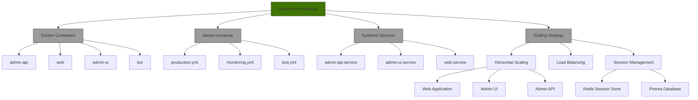

# Core Applications

<cite>
**Referenced Files in This Document**   
- [server.js](file://apps/admin-api/server.js)
- [package.json](file://apps/admin-api/package.json)
- [package.json](file://apps/web/package.json)
- [package.json](file://apps/admin-ui/package.json)
- [package.json](file://apps/bot/package.json)
- [next.config.js](file://apps/web/next.config.js)
- [next.config.js](file://apps/admin-ui/next.config.js)
- [index.ts](file://apps/bot/src/index.ts)
- [.env.admin.example](file://apps/admin-api/.env.admin.example)
- [.env.example](file://apps/web/.env.example)
- [.env.example](file://apps/bot/.env.example)
- [README.md](file://apps/admin-ui/README.md)
- [package.json](file://package.json)
- [pnpm-workspace.yaml](file://pnpm-workspace.yaml)
</cite>

## Table of Contents
1. [Introduction](#introduction)
2. [Application Overview](#application-overview)
3. [Admin API](#admin-api)
4. [Web Application](#web-application)
5. [Admin UI](#admin-ui)
6. [Bot Service](#bot-service)
7. [Shared Resources and Integration](#shared-resources-and-integration)
8. [Deployment and Scaling](#deployment-and-scaling)
9. [Conclusion](#conclusion)

## Introduction
The slimy-monorepo platform consists of four core applications that work together to provide a comprehensive Discord bot management and analytics system. This document provides an overview of each application's purpose, technology stack, architectural patterns, and operational characteristics. The applications include admin-api (backend services), web (user-facing Next.js application), admin-ui (administrative interface), and bot (Discord integration). These applications share resources through APIs, shared packages, and data stores, forming a cohesive platform for managing Discord communities and their analytics.

## Application Overview
The slimy-monorepo platform is structured as a monorepo containing four main applications, each serving a distinct purpose in the overall system. The applications are organized under the `apps/` directory and managed using pnpm workspaces. The platform follows a microservices architecture where each application has its own technology stack and deployment characteristics while sharing common resources and communicating through well-defined APIs.



**Diagram sources**
- [package.json](file://package.json)
- [pnpm-workspace.yaml](file://pnpm-workspace.yaml)

**Section sources**
- [package.json](file://package.json)
- [pnpm-workspace.yaml](file://pnpm-workspace.yaml)

## Admin API
The admin-api application serves as the central backend service for the slimy-monorepo platform, providing RESTful APIs for authentication, guild management, settings, and analytics. Built with Node.js and Express, it follows a modular architecture with routes, middleware, and services organized in a clean structure. The application uses Prisma ORM for database operations and implements comprehensive error handling and monitoring.

The admin-api runs on port 3080 by default and is configured through environment variables defined in `.env.admin` files. It requires a JWT_SECRET for authentication and supports both MySQL and Prisma-based database configurations. The application implements rate limiting, CORS protection, and various security headers through middleware. It also provides health monitoring endpoints and diagnostic tools for system observability.

```mermaid
graph TD
A[Admin API] --> B[Authentication]
A --> C[Authorization]
A --> D[Rate Limiting]
A --> E[Error Handling]
A --> F[Logging]
B --> G[JWT Authentication]
B --> H[Session Management]
C --> I[RBAC Middleware]
D --> J[Express Rate Limit]
E --> K[Global Error Handler]
F --> L[Pino Logger]
A --> M[Database]
A --> N[Redis Cache]
A --> O[Google Sheets]
A --> P[OpenAI API]
M --> Q[Prisma ORM]
M --> R[MySQL2 Driver]
N --> S[IORedis Client]
O --> T[Google APIs]
P --> U[OpenAI Client]
A --> V[API Routes]
V --> W[/api/auth]
V --> X[/api/guilds]
V --> Y[/api/club]
V --> Z[/api/chat]
V --> AA[/api/diag]
style A fill:#7ED321,stroke:#333
style M fill:#9B9B9B,stroke:#333
style N fill:#9B9B9B,stroke:#333
style O fill:#9B9B9B,stroke:#333
style P fill:#9B9B9B,stroke:#333
```

**Diagram sources**
- [server.js](file://apps/admin-api/server.js)
- [package.json](file://apps/admin-api/package.json)

**Section sources**
- [server.js](file://apps/admin-api/server.js)
- [package.json](file://apps/admin-api/package.json)
- [.env.admin.example](file://apps/admin-api/.env.admin.example)

## Web Application
The web application is a user-facing Next.js 16 application that serves as the primary interface for end users. Built with React 19, it follows the App Router pattern and uses TypeScript for type safety. The application is configured to output as a standalone server, making it suitable for production deployment. It implements API rewrites to proxy requests to the admin-api backend, enabling seamless integration between frontend and backend services.

The web application is configured to proxy various API routes to the admin-api running on port 3080, including authentication, club analytics, and usage statistics. It supports remote image patterns from Discord CDN domains, allowing it to display user avatars and other media. The application uses environment variables to configure the API base URL, enabling flexible deployment across different environments.

```mermaid
graph TD
A[Web Application] --> B[Next.js 16]
A --> C[React 19]
A --> D[TypeScript]
A --> E[Tailwind CSS]
B --> F[App Router]
B --> G[Server Components]
B --> H[Client Components]
A --> I[API Proxy]
I --> J[/api/auth → admin-api]
I --> K[/api/club → admin-api]
I --> L[/api/stats → admin-api]
I --> M[/api/usage → admin-api]
A --> N[Image Optimization]
N --> O[Discord CDN]
N --> P[Media Discord]
A --> Q[State Management]
Q --> R[React Context]
Q --> S[SWR]
Q --> T[Zod Validation]
style A fill:#4A90E2,stroke:#333
style B fill:#9B9B9B,stroke:#333
style I fill:#9B9B9B,stroke:#333
style N fill:#9B9B9B,stroke:#333
style Q fill:#9B9B9B,stroke:#333
```

**Diagram sources**
- [next.config.js](file://apps/web/next.config.js)
- [package.json](file://apps/web/package.json)

**Section sources**
- [next.config.js](file://apps/web/next.config.js)
- [package.json](file://apps/web/package.json)
- [.env.example](file://apps/web/.env.example)

## Admin UI
The admin-ui application is a Next.js 14 administrative interface designed for managing the Slimy.ai Discord bot. It runs on port 3081 and is typically deployed behind a Caddy reverse proxy. The interface provides comprehensive tools for guild management, including dashboard views, uploads management, and Google Sheet integration for data correction and rescan operations.

The admin UI implements session-based authentication using httpOnly cookies from the admin-api. It uses environment variables to configure the API base URL, with empty string values in production for relative URLs and localhost references in development. The application includes a diagnostics widget in the sidebar that pulls data from the `/api/diag` endpoint, providing real-time system metrics.

```mermaid
graph TD
A[Admin UI] --> B[Next.js 14]
A --> C[React 18]
A --> D[Chart.js]
A --> E[Socket.IO]
A --> F[Authentication]
F --> G[Session Cookies]
F --> H[httpOnly Security]
A --> I[API Integration]
I --> J[/api/auth/me]
I --> K[/api/guilds]
I --> L[/api/guilds/:id/settings]
I --> M[/api/guilds/:id/personality]
I --> N[/api/guilds/:id/corrections]
I --> O[/api/uploads]
I --> P[/api/diag]
A --> Q[Dashboard Features]
Q --> R[Guild Dashboard]
Q --> S[Uploads Tab]
Q --> T[Current Sheet]
Q --> U[Diagnostics Widget]
style A fill:#4A90E2,stroke:#333
style B fill:#9B9B9B,stroke:#333
style I fill:#9B9B9B,stroke:#333
style Q fill:#9B9B9B,stroke:#333
```

**Diagram sources**
- [next.config.js](file://apps/admin-ui/next.config.js)
- [README.md](file://apps/admin-ui/README.md)

**Section sources**
- [next.config.js](file://apps/admin-ui/next.config.js)
- [package.json](file://apps/admin-ui/package.json)
- [README.md](file://apps/admin-ui/README.md)

## Bot Service
The bot service is a Discord integration application built with Discord.js and TypeScript. It serves as the bridge between the Discord platform and the slimy-monorepo ecosystem, handling bot commands, events, and interactions. The application is structured as a scaffold with placeholder functionality that will be expanded with actual Discord bot logic.

The bot service requires a DISCORD_BOT_TOKEN environment variable for authentication with the Discord API. It includes utility functions for parsing numbers, validating snowflakes (Discord ID format), and calculating club statistics. The application implements graceful shutdown handling for SIGINT and SIGTERM signals, ensuring proper cleanup during deployment or restart operations.



**Diagram sources**
- [index.ts](file://apps/bot/src/index.ts)
- [package.json](file://apps/bot/package.json)

**Section sources**
- [index.ts](file://apps/bot/src/index.ts)
- [package.json](file://apps/bot/package.json)
- [.env.example](file://apps/bot/.env.example)

## Shared Resources and Integration
The slimy-monorepo platform leverages shared resources and packages to maintain consistency across applications and reduce code duplication. The monorepo structure, managed by pnpm workspaces, enables seamless sharing of code, configurations, and dependencies between the different applications.

The platform includes several shared packages under the `packages/` directory, including shared-auth, shared-config, shared-db, and others. These packages provide common functionality that can be imported by any application in the monorepo. The shared-auth package likely contains authentication utilities, while shared-db may include database connection helpers and Prisma configurations.

Applications communicate primarily through RESTful APIs exposed by the admin-api service. The web application and admin-ui both proxy their API requests to the admin-api backend, creating a unified interface to the platform's data and functionality. The bot service also interacts with the admin-api to access guild configurations and store analytics data.



**Diagram sources**
- [package.json](file://package.json)
- [pnpm-workspace.yaml](file://pnpm-workspace.yaml)

**Section sources**
- [package.json](file://package.json)
- [pnpm-workspace.yaml](file://pnpm-workspace.yaml)

## Deployment and Scaling
The slimy-monorepo platform applications are designed for containerized deployment using Docker, with configuration files provided for each application. The platform can be deployed using docker-compose configurations, including production, monitoring, and test environments.

Each application has its own Dockerfile and follows best practices for Node.js application deployment. The admin-api, web, and admin-ui applications are configured with standalone output for optimal performance in production. The applications use environment variables for configuration, enabling flexible deployment across different environments without code changes.

For scaling, the stateless nature of the frontend applications (web and admin-ui) allows for horizontal scaling by deploying multiple instances behind a load balancer. The admin-api service can also be scaled horizontally, with Redis providing shared session storage to maintain user sessions across instances. The bot service may require special consideration for scaling, as Discord bots typically run as single instances to avoid duplicate event processing.



**Diagram sources**
- [Dockerfile](file://apps/admin-api/Dockerfile)
- [Dockerfile](file://apps/web/Dockerfile)
- [Dockerfile](file://apps/admin-ui/Dockerfile)
- [docker-compose.yml](file://docker-compose.yml)

**Section sources**
- [package.json](file://package.json)
- [docker-compose.yml](file://docker-compose.yml)

## Conclusion
The slimy-monorepo platform consists of four core applications that work together to provide a comprehensive Discord bot management and analytics system. The admin-api serves as the central backend service, providing RESTful APIs for authentication, guild management, and analytics. The web application offers a user-facing interface built with Next.js 16 and React 19, while the admin-ui provides an administrative interface for managing bot configurations and data. The bot service integrates with Discord to handle commands and events.

These applications share resources through a monorepo structure managed by pnpm workspaces, enabling code reuse and consistent development practices. They communicate primarily through APIs exposed by the admin-api service, creating a unified interface to the platform's data and functionality. The platform is designed for containerized deployment using Docker and can be scaled horizontally to meet increasing demand.

This foundation provides a solid basis for more detailed documentation of individual applications, their specific features, and implementation details. The modular architecture allows for independent development and deployment of each application while maintaining a cohesive user experience across the platform.