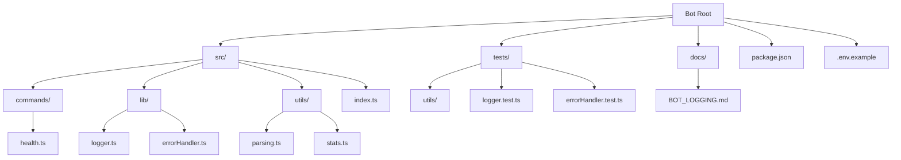
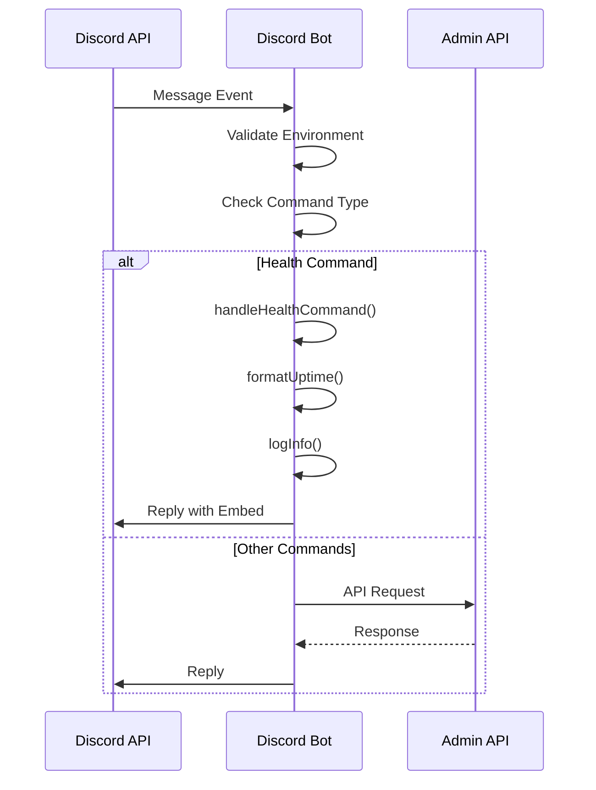
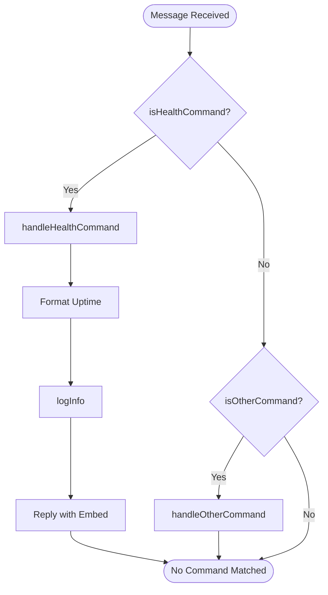
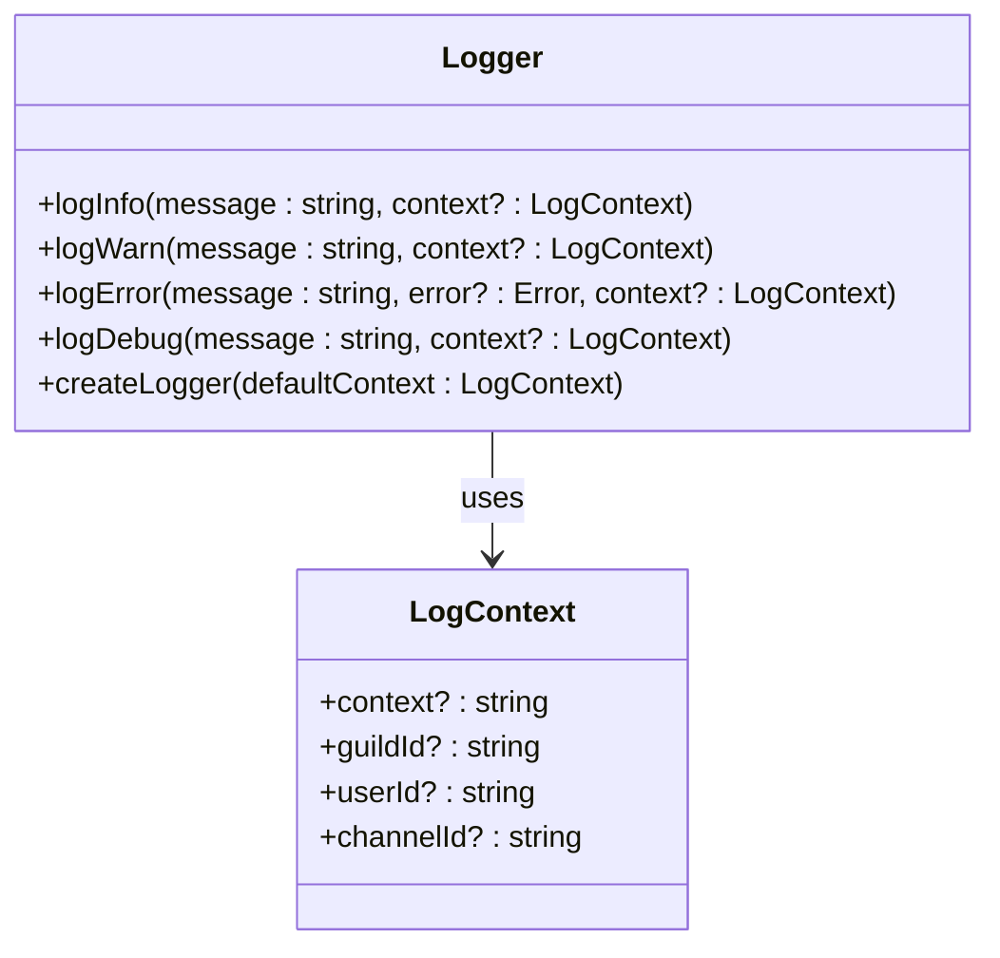
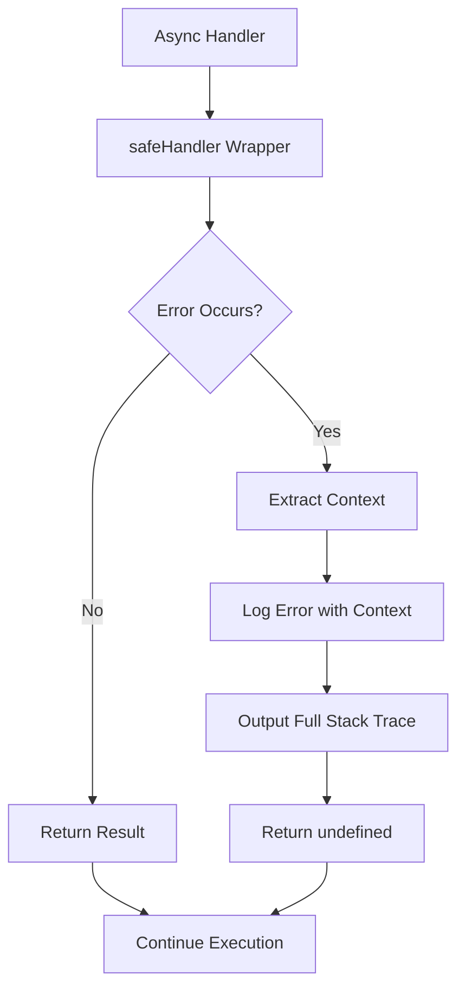

# Discord Bot

<cite>
**Referenced Files in This Document**   
- [index.ts](file://apps/bot/src/index.ts)
- [health.ts](file://apps/bot/src/commands/health.ts)
- [logger.ts](file://apps/bot/src/lib/logger.ts)
- [errorHandler.ts](file://apps/bot/src/lib/errorHandler.ts)
- [.env.example](file://apps/bot/.env.example)
- [BOT_LOGGING.md](file://apps/bot/docs/BOT_LOGGING.md)
- [parsing.ts](file://apps/bot/src/utils/parsing.ts)
- [stats.ts](file://apps/bot/src/utils/stats.ts)
- [package.json](file://apps/bot/package.json)
</cite>

## Table of Contents
1. [Introduction](#introduction)
2. [Project Structure](#project-structure)
3. [Core Components](#core-components)
4. [Architecture Overview](#architecture-overview)
5. [Detailed Component Analysis](#detailed-component-analysis)
6. [Dependency Analysis](#dependency-analysis)
7. [Performance Considerations](#performance-considerations)
8. [Troubleshooting Guide](#troubleshooting-guide)
9. [Conclusion](#conclusion)

## Introduction
The Discord Bot is an automated community management agent built with discord.js and TypeScript. It serves as a scaffold for migrating existing bot functionality from other services into a dedicated, standalone application. The bot is designed to handle message events, slash commands, presence updates, and provide health monitoring capabilities. It integrates with the admin-api for data access and state management while implementing robust logging, error handling, and operational guidelines as documented in BOT_LOGGING.md.

## Project Structure
The bot application follows a modular structure with clear separation of concerns. The core functionality resides in the `src` directory, which contains commands, utilities, and library modules. Configuration is managed through environment variables, with a template provided in `.env.example`. The bot includes comprehensive testing through Vitest, with test files colocated in a `tests` directory.



**Diagram sources**
- [index.ts](file://apps/bot/src/index.ts)
- [.env.example](file://apps/bot/.env.example)
- [BOT_LOGGING.md](file://apps/bot/docs/BOT_LOGGING.md)

**Section sources**
- [index.ts](file://apps/bot/src/index.ts)
- [.env.example](file://apps/bot/.env.example)
- [BOT_LOGGING.md](file://apps/bot/docs/BOT_LOGGING.md)

## Core Components
The Discord Bot's core components include the entry point in `index.ts`, command handlers in the `commands` directory, utility functions in `utils`, and shared libraries for logging and error handling. The bot is designed to be event-driven, responding to Discord events such as message creation and client readiness. The current implementation includes a health command for diagnostics, parsing utilities for handling Discord-formatted numbers, and statistical functions for club analytics.

**Section sources**
- [index.ts](file://apps/bot/src/index.ts)
- [health.ts](file://apps/bot/src/commands/health.ts)
- [parsing.ts](file://apps/bot/src/utils/parsing.ts)
- [stats.ts](file://apps/bot/src/utils/stats.ts)

## Architecture Overview
The bot follows an event-driven architecture where the main application in `index.ts` initializes the bot and registers event handlers. These handlers are wrapped with safe error handling to prevent crashes from unhandled exceptions. The architecture emphasizes modularity, with commands separated into their own files and shared utilities available across the codebase. The bot is designed to eventually integrate with external systems like the admin-api for data persistence and retrieval.



**Diagram sources**
- [index.ts](file://apps/bot/src/index.ts)
- [health.ts](file://apps/bot/src/commands/health.ts)

## Detailed Component Analysis

### Command Structure and Pattern
The bot implements a command pattern where each command is defined in its own module within the `commands` directory. Commands export two functions: a handler function that performs the command logic and a checker function that determines if a message matches the command. This pattern allows for easy addition of new commands by creating a new file and importing it into the main message handler.

#### Command Implementation Pattern:


**Diagram sources**
- [health.ts](file://apps/bot/src/commands/health.ts)

**Section sources**
- [health.ts](file://apps/bot/src/commands/health.ts)

### Logging System
The logging system in `src/lib/logger.ts` provides structured logging with context support. It implements four log levels (INFO, WARN, ERROR, DEBUG) with different output behaviors based on the environment. The system supports context objects that can include guild IDs, user IDs, and channel IDs for better debugging. A factory function `createLogger` allows for creating child loggers with default context.

#### Logging Implementation:


**Diagram sources**
- [logger.ts](file://apps/bot/src/lib/logger.ts)

**Section sources**
- [logger.ts](file://apps/bot/src/lib/logger.ts)
- [BOT_LOGGING.md](file://apps/bot/docs/BOT_LOGGING.md)

### Error Handling
The error handling system uses wrapper functions to provide crash safety for async operations. The `safeHandler` function wraps async handlers to catch and log errors without crashing the bot. It automatically extracts context from Discord.js objects like interactions and messages. The system also includes `safeSyncHandler` for synchronous functions and implements process-level error handling for unhandled rejections and exceptions.

#### Error Handling Flow:


**Diagram sources**
- [errorHandler.ts](file://apps/bot/src/lib/errorHandler.ts)

**Section sources**
- [errorHandler.ts](file://apps/bot/src/lib/errorHandler.ts)
- [BOT_LOGGING.md](file://apps/bot/docs/BOT_LOGGING.md)

## Dependency Analysis
The bot has minimal external dependencies, relying primarily on discord.js for Discord API interactions. It uses TypeScript for type safety and Vitest for testing. The package.json defines these dependencies along with development tools like tsx for running TypeScript files directly. The bot is designed to eventually integrate with the admin-api service for data access, though this integration is not yet implemented in the current scaffold.

```mermaid
graph LR
A[Discord Bot] --> B[discord.js]
A --> C[TypeScript]
A --> D[tsx]
A --> E[Vitest]
A --> F[@types/node]
style A fill:#f9f,stroke:#333
style B fill:#bbf,stroke:#333
style C fill:#f96,stroke:#333
style D fill:#6f9,stroke:#333
style E fill:#69f,stroke:#333
style F fill:#96f,stroke:#333
```

**Diagram sources**
- [package.json](file://apps/bot/package.json)

**Section sources**
- [package.json](file://apps/bot/package.json)
- [tsconfig.json](file://apps/bot/tsconfig.json)

## Performance Considerations
The bot is designed with performance in mind, using efficient string parsing and number formatting utilities. The logging system is optimized to avoid unnecessary operations, particularly in production where debug logs are disabled. The error handling system prevents crashes that would require bot restarts, maintaining uptime. Memory usage is monitored through the health command, which reports heap usage in megabytes. The bot should be monitored for gateway connection stability and rate limiting by Discord, particularly as more commands and integrations are added.

## Troubleshooting Guide
Common issues with the Discord Bot include gateway connection failures, rate limiting by Discord, and command registration delays. The health command provides diagnostic information including uptime, memory usage, ping, and guild count. When troubleshooting, check that the DISCORD_BOT_TOKEN environment variable is correctly set and that the bot has the necessary permissions in Discord. For connection issues, verify network connectivity and Discord API status. Rate limiting can be mitigated by implementing proper delay between API calls and using Discord's recommended retry-after headers.

**Section sources**
- [index.ts](file://apps/bot/src/index.ts)
- [health.ts](file://apps/bot/src/commands/health.ts)
- [BOT_LOGGING.md](file://apps/bot/docs/BOT_LOGGING.md)

## Conclusion
The Discord Bot provides a solid foundation for an automated community management agent with a well-structured codebase, robust logging and error handling, and a clear pattern for adding new commands. While currently in scaffold mode, it is designed to be extended with full Discord bot functionality, including integration with the admin-api for data access and state management. The bot follows best practices for TypeScript development and includes comprehensive documentation and testing to support ongoing development and maintenance.