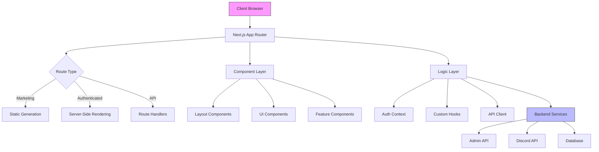
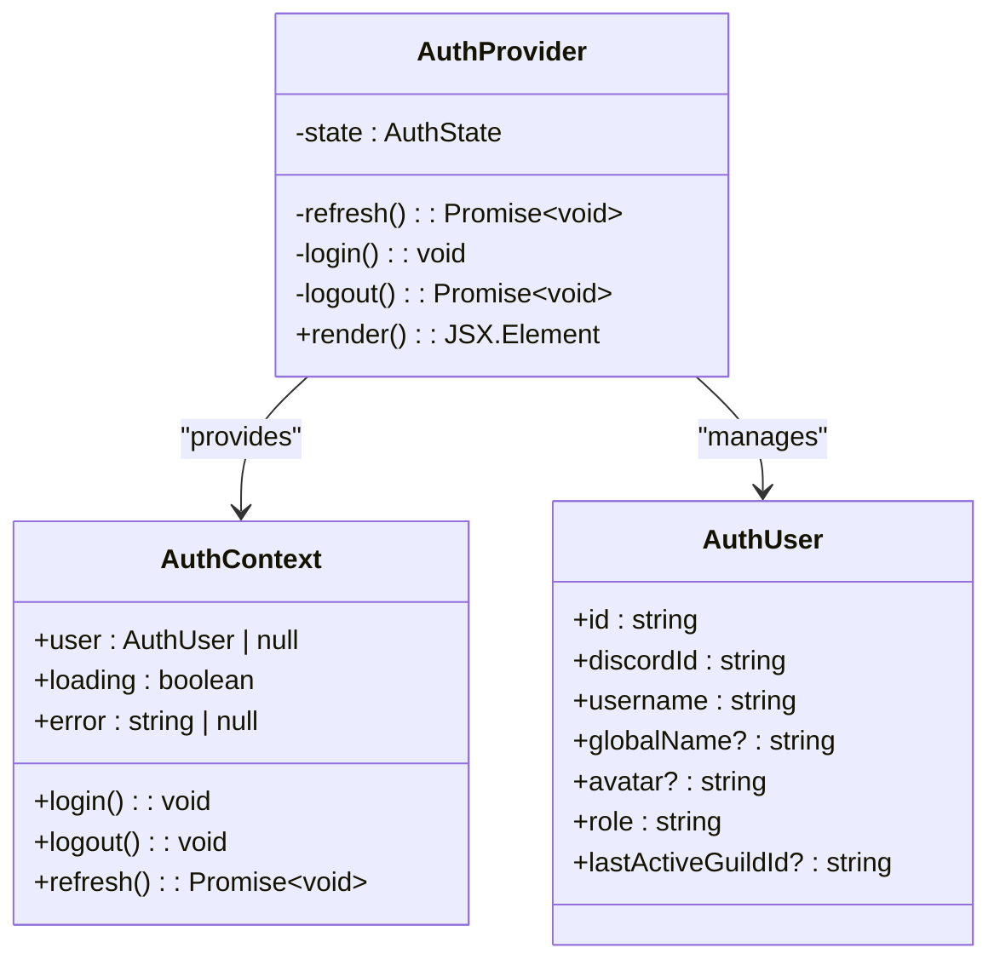
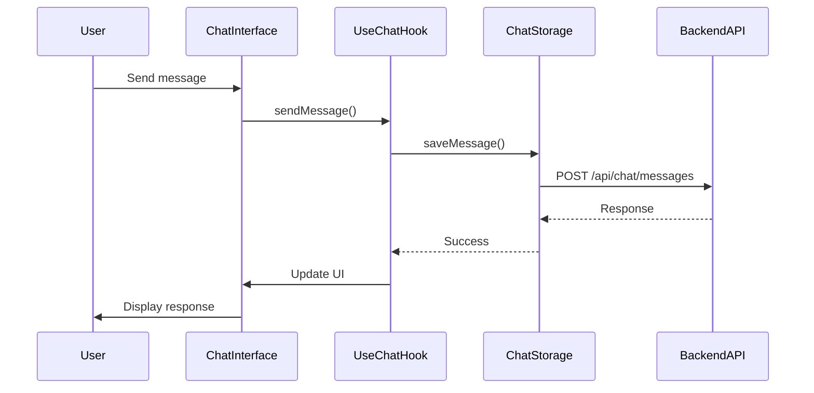
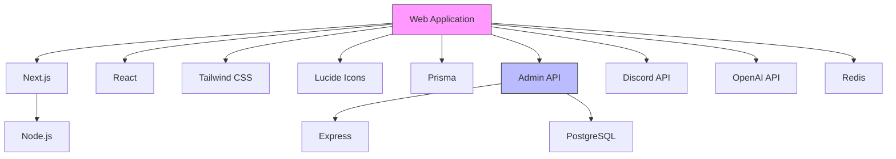

# Web Application

<cite>
**Referenced Files in This Document**   
- [app/layout.tsx](file://apps/web/app/layout.tsx)
- [app/page.tsx](file://apps/web/app/page.tsx)
- [app/(marketing)/page.tsx](file://apps/web/app/(marketing)/page.tsx)
- [app/dashboard/page.tsx](file://apps/web/app/dashboard/page.tsx)
- [app/chat/page.tsx](file://apps/web/app/chat/page.tsx)
- [app/api/auth/me/route.ts](file://apps/web/app/api/auth/me/route.ts)
- [app/auth/discord/callback/route.ts](file://apps/web/app/auth/discord/callback/route.ts)
- [lib/auth/context.tsx](file://apps/web/lib/auth/context.tsx)
- [lib/auth/server.ts](file://apps/web/lib/auth/server.ts)
- [middleware.ts](file://apps/web/middleware.ts)
- [components/layout/app-shell.tsx](file://apps/web/components/layout/app-shell.tsx)
- [components/chat/chat-interface.tsx](file://apps/web/components/chat/chat-interface.tsx)
- [components/retro-chat/RetroChat.tsx](file://apps/web/components/retro-chat/RetroChat.tsx)
- [lib/chat/storage.ts](file://apps/web/lib/chat/storage.ts)
- [next.config.js](file://apps/web/next.config.js)
- [tailwind.config.ts](file://apps/web/tailwind.config.ts)
- [Dockerfile](file://apps/web/Dockerfile)
- [Caddyfile.template](file://apps/web/Caddyfile.template)
</cite>

## Table of Contents
1. [Introduction](#introduction)
2. [Project Structure](#project-structure)
3. [Core Components](#core-components)
4. [Architecture Overview](#architecture-overview)
5. [Detailed Component Analysis](#detailed-component-analysis)
6. [Dependency Analysis](#dependency-analysis)
7. [Performance Considerations](#performance-considerations)
8. [Troubleshooting Guide](#troubleshooting-guide)
9. [Conclusion](#conclusion)

## Introduction
The Web Application is a Next.js frontend that serves as the user interface for an AI-powered Discord bot platform. It features a hybrid rendering architecture using the App Router, combining static site generation for marketing pages with server-side rendering for authenticated user interfaces. The application provides access to key features including club analytics, snail tools, and AI chat functionality, with integration to backend services through API routes. The frontend is built with React, TypeScript, and Tailwind CSS, following modern web development practices for responsive design and optimal performance.

## Project Structure
The application follows a feature-based organization within the Next.js App Router structure. Key directories include:
- `app/`: Contains all route handlers and page components using the App Router
- `components/`: Reusable UI components organized by feature
- `lib/`: Shared utilities, API clients, and business logic
- `hooks/`: Custom React hooks for state management
- `public/`: Static assets
- Configuration files for build, deployment, and styling

```mermaid
graph TB
subgraph "App Router Structure"
A[app/]
A --> B[(marketing)/]
A --> C[dashboard/]
A --> D[chat/]
A --> E[club/]
A --> F[snail/]
A --> G[api/]
A --> H[layout.tsx]
A --> I[page.tsx]
end
subgraph "Component Architecture"
J[components/]
J --> K[layout/]
J --> L[chat/]
J --> M[retro-chat/]
J --> N[ui/]
end
subgraph "Logic Layer"
O[lib/]
O --> P[auth/]
O --> Q[chat/]
O --> R[api/]
end
A --> J
A --> O
```

**Diagram sources**
- [app/page.tsx](file://apps/web/app/page.tsx)
- [components/](file://apps/web/components/)
- [lib/](file://apps/web/lib/)

**Section sources**
- [app/page.tsx](file://apps/web/app/page.tsx)
- [app/layout.tsx](file://apps/web/app/layout.tsx)

## Core Components
The application's core components include the marketing site, dashboard, chat interface, and various feature pages. The authentication system is built around Discord OAuth, with state management handled through React Context. The UI is styled with Tailwind CSS and features a retro-themed chat interface with personality modes. Key pages include the marketing site (app/(marketing)/page.tsx), dashboard (app/dashboard/page.tsx), and specialized interfaces for club analytics and snail tools.

**Section sources**
- [app/page.tsx](file://apps/web/app/page.tsx)
- [app/dashboard/page.tsx](file://apps/web/app/dashboard/page.tsx)
- [app/chat/page.tsx](file://apps/web/app/chat/page.tsx)

## Architecture Overview
The application uses a hybrid rendering approach with the Next.js App Router, allowing for both static generation and server-side rendering as needed. Marketing pages are statically generated for optimal performance, while authenticated routes use server-side rendering to ensure up-to-date user data. The architecture follows a layered pattern with clear separation between presentation, logic, and data access layers.



**Diagram sources**
- [app/layout.tsx](file://apps/web/app/layout.tsx)
- [lib/auth/context.tsx](file://apps/web/lib/auth/context.tsx)
- [lib/api-client.ts](file://apps/web/lib/api-client.ts)

## Detailed Component Analysis

### Authentication System
The authentication system is implemented using Discord OAuth with a custom context provider for state management. User sessions are maintained through cookies and automatically refreshed to prevent expiration.



**Diagram sources**
- [lib/auth/context.tsx](file://apps/web/lib/auth/context.tsx)
- [lib/auth/types.ts](file://apps/web/lib/auth/types.ts)

### Chat Interface
The chat interface features a retro-themed design with personality modes and persistent conversation history. It uses a custom hook for state management and integrates with backend services for message storage.



**Diagram sources**
- [components/chat/chat-interface.tsx](file://apps/web/components/chat/chat-interface.tsx)
- [hooks/use-chat.ts](file://apps/web/hooks/use-chat.ts)
- [lib/chat/storage.ts](file://apps/web/lib/chat/storage.ts)

### API Integration
The application integrates with backend services through API routes, with a focus on authentication and user data management.

```mermaid
flowchart TD
A[Frontend] --> B[/api/auth/me]
B --> C{Has Session Cookie?}
C --> |Yes| D[Call Admin API /api/auth/me]
C --> |No| E[Return 401]
D --> F{Valid Response?}
F --> |Yes| G[Transform User Data]
F --> |No| H[Return Error]
G --> I[Return User Object]
H --> I
I --> A
style A fill:#f9f,stroke:#333
style D fill:#bbf,stroke:#333
```

**Diagram sources**
- [app/api/auth/me/route.ts](file://apps/web/app/api/auth/me/route.ts)
- [lib/api-client.ts](file://apps/web/lib/api-client.ts)

## Dependency Analysis
The application has a well-defined dependency structure with clear boundaries between components. The core dependencies include Next.js for routing and rendering, React for UI components, and Tailwind CSS for styling. The application also depends on several external services including Discord API for authentication and OpenAI for chat functionality.



**Diagram sources**
- [package.json](file://apps/web/package.json)
- [lib/api-client.ts](file://apps/web/lib/api-client.ts)
- [prisma/schema.prisma](file://apps/web/prisma/schema.prisma)

**Section sources**
- [package.json](file://apps/web/package.json)
- [next.config.js](file://apps/web/next.config.js)

## Performance Considerations
The application implements several performance optimizations including code splitting, image optimization, and efficient state management. The hybrid rendering approach ensures fast loading times for marketing pages while maintaining dynamic functionality for authenticated routes. Web vitals are monitored through the web-vitals route, and the build process includes bundle size optimization.

**Section sources**
- [next.config.js](file://apps/web/next.config.js)
- [lighthouserc.json](file://apps/web/lighthouserc.json)
- [app/api/web-vitals/route.ts](file://apps/web/app/api/web-vitals/route.ts)

## Troubleshooting Guide
Common issues and their solutions:

1. **Authentication failures**: Ensure the NEXT_PUBLIC_ADMIN_API_BASE environment variable is correctly configured.
2. **Chat message persistence issues**: Verify the chat storage API endpoints are accessible and the database connection is working.
3. **Styling issues**: Check that Tailwind CSS is properly configured and the classes are correctly applied.
4. **Deployment problems**: Ensure the Docker and Caddy configurations are correctly set up and all environment variables are provided.

**Section sources**
- [.env.example](file://apps/web/.env.example)
- [Dockerfile](file://apps/web/Dockerfile)
- [Caddyfile.template](file://apps/web/Caddyfile.template)

## Conclusion
The Web Application provides a comprehensive frontend for an AI-powered Discord bot platform, featuring a modern Next.js architecture with hybrid rendering, robust authentication, and rich user interfaces. The application is well-structured with clear separation of concerns and follows best practices for performance and maintainability. The integration with backend services is seamless, providing users with access to powerful features including club analytics, snail tools, and AI chat functionality.