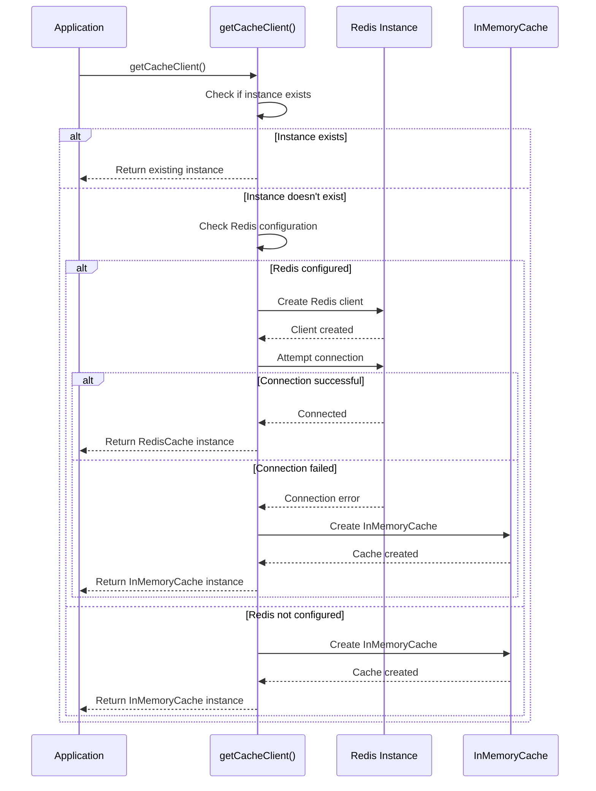
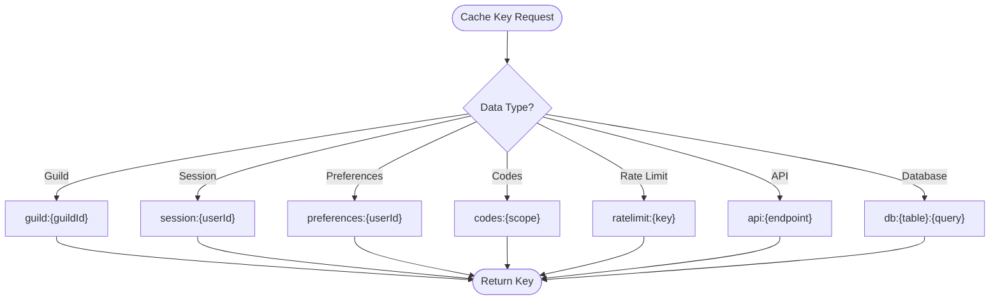
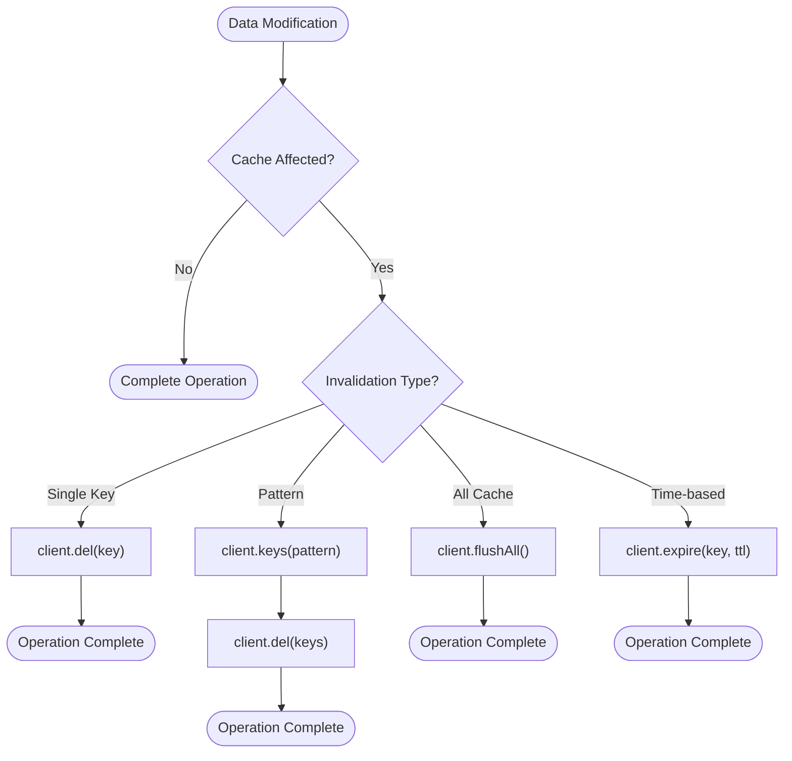
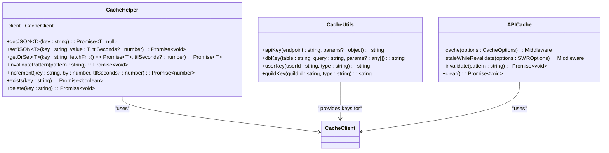
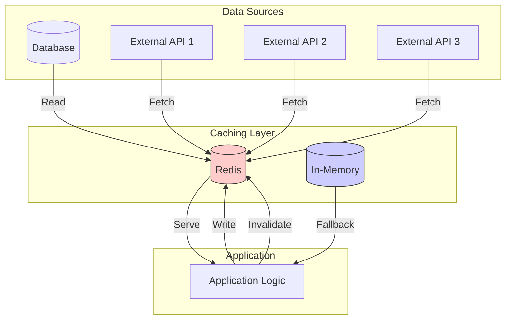

# Caching Strategy

<cite>
**Referenced Files in This Document**   
- [redis.js](file://apps/admin-api/lib/cache/redis.js)
- [redis-client.js](file://apps/web/lib/cache/redis-client.js)
- [redis-client.ts](file://apps/web/lib/cache/redis-client.ts)
- [redis.ts](file://apps/web/lib/cache/redis.ts)
- [cache.ts](file://apps/web/lib/codes/cache.ts)
- [cache.js](file://apps/admin-api/src/middleware/cache.js)
- [env.js](file://apps/web/lib/env.js)
- [codes-aggregator.ts](file://apps/web/lib/codes-aggregator.ts)
- [guild-settings.js](file://apps/admin-api/lib/guild-settings.js)
- [session-store.js](file://apps/admin-api/lib/session-store.js)
</cite>

## Table of Contents
1. [Introduction](#introduction)
2. [Cache Client Implementation](#cache-client-implementation)
3. [Connection Management and Error Handling](#connection-management-and-error-handling)
4. [Cache Key Naming Conventions](#cache-key-naming-conventions)
5. [TTL Policies and Invalidation Mechanisms](#ttl-policies-and-invalidation-mechanisms)
6. [Cache Helpers and Utility Functions](#cache-helpers-and-utility-functions)
7. [Usage in Data Optimization](#usage-in-data-optimization)
8. [Configuration Options](#configuration-options)
9. [Troubleshooting and Monitoring](#troubleshooting-and-monitoring)
10. [Conclusion](#conclusion)

## Introduction

The slimy-monorepo platform employs a comprehensive Redis-based caching strategy to optimize performance and reduce latency for frequently accessed data. This documentation details the implementation of cache clients in both TypeScript and JavaScript environments, covering connection management, error handling, reconnection logic, cache key naming conventions, TTL (time-to-live) policies, invalidation mechanisms, and utility functions for JSON serialization and get-or-set patterns. The caching system is used to enhance performance for critical data such as guild configurations, user sessions, and code aggregations. Configuration options allow for enabling/disabling cache and connecting to Redis instances, with robust troubleshooting guidance for common issues and monitoring cache health.

**Section sources**
- [redis-client.ts](file://apps/web/lib/cache/redis-client.ts#L1-L375)
- [redis.ts](file://apps/web/lib/cache/redis.ts#L1-L381)

## Cache Client Implementation

The caching strategy is implemented through multiple client implementations across the platform, with distinct approaches for different applications. The web application uses a sophisticated Redis client with fallback to in-memory caching, while the admin API utilizes a simpler Redis client with mocking capabilities for testing environments.

The primary Redis client implementation in the web application is defined in `redis-client.ts` and `redis-client.js`, providing a unified interface for both TypeScript and JavaScript environments. This client implements the `CacheClient` interface with methods for get, set, delete, exists, expire, ttl, keys, flushAll, and disconnect operations. The implementation includes a singleton pattern to ensure a single connection instance across the application.

For the admin API, a mock cache implementation is provided in `redis.js` to support testing and development environments without requiring a Redis instance. This mock implementation provides the same interface as the Redis client but stores data in memory, making it suitable for isolated testing scenarios.

```mermaid
classDiagram
class CacheClient {
<<interface>>
+get(key : string) : Promise~string | null~
+set(key : string, value : string, ttlSeconds? : number) : Promise~void~
+del(key : string) : Promise~void~
+exists(key : string) : Promise~boolean~
+expire(key : string, ttlSeconds : number) : Promise~void~
+ttl(key : string) : Promise~number~
+keys(pattern : string) : Promise~string[]~
+flushAll() : Promise~void~
+disconnect() : Promise~void~
}
class RedisCache {
-client : RedisClientType
-connected : boolean
+connect() : Promise~void~
+get(key : string) : Promise~string | null~
+set(key : string, value : string, ttlSeconds? : number) : Promise~void~
+del(key : string) : Promise~void~
+exists(key : string) : Promise~boolean~
+expire(key : string, ttlSeconds : number) : Promise~void~
+ttl(key : string) : Promise~number~
+keys(pattern : string) : Promise~string[]~
+flushAll() : Promise~void~
+disconnect() : Promise~void~
}
class InMemoryCache {
-cache : Map~string, { value : string; expiresAt? : number }~
-cleanupInterval : NodeJS.Timeout
+get(key : string) : Promise~string | null~
+set(key : string, value : string, ttlSeconds? : number) : Promise~void~
+del(key : string) : Promise~void~
+exists(key : string) : Promise~boolean~
+expire(key : string, ttlSeconds : number) : Promise~void~
+ttl(key : string) : Promise~number~
+keys(pattern : string) : Promise~string[]~
+flushAll() : Promise~void~
+disconnect() : Promise~void~
}
CacheClient <|-- RedisCache
CacheClient <|-- InMemoryCache
```

**Diagram sources**
- [redis-client.ts](file://apps/web/lib/cache/redis-client.ts#L14-L24)
- [redis-client.ts](file://apps/web/lib/cache/redis-client.ts#L113-L213)
- [redis-client.ts](file://apps/web/lib/cache/redis-client.ts#L29-L108)

**Section sources**
- [redis-client.ts](file://apps/web/lib/cache/redis-client.ts#L1-L375)
- [redis-client.js](file://apps/web/lib/cache/redis-client.js#L1-L324)
- [redis.js](file://apps/admin-api/lib/cache/redis.js#L1-L16)

## Connection Management and Error Handling

The caching system implements robust connection management with automatic reconnection logic and comprehensive error handling. The Redis client establishes connections using configuration from environment variables, with support for both Redis URL and individual host/port/password configuration.

Connection initialization is handled through the `getCacheClient()` function, which implements a singleton pattern to ensure only one connection instance exists. The connection process includes automatic fallback to in-memory caching if Redis is unavailable, providing graceful degradation in development or testing environments.



**Diagram sources**
- [redis-client.ts](file://apps/web/lib/cache/redis-client.ts#L241-L264)
- [redis-client.js](file://apps/web/lib/cache/redis-client.js#L207-L229)

**Section sources**
- [redis-client.ts](file://apps/web/lib/cache/redis-client.ts#L238-L264)
- [redis-client.js](file://apps/web/lib/cache/redis-client.js#L207-L229)
- [env.js](file://apps/web/lib/env.js#L178-L181)

## Cache Key Naming Conventions

The platform follows a consistent and hierarchical cache key naming convention to ensure clarity, prevent collisions, and enable efficient pattern-based invalidation. The naming convention uses a colon-separated format with descriptive prefixes that indicate the data type and scope.

The primary key naming patterns include:
- `guild:{guildId}` - Guild configuration data
- `session:{userId}` - User session data
- `preferences:{userId}` - User preferences
- `codes:{scope}` - Code aggregations by scope
- `ratelimit:{key}` - Rate limiting counters
- `api:{endpoint}` - API response caching
- `db:{table}:{query}` - Database query results

These naming conventions are implemented through utility functions and constants in the `CacheKeys` object, which provides type-safe key generation functions. The consistent structure enables efficient pattern matching for bulk operations and makes it easy to understand the purpose of any cache key.



**Diagram sources**
- [redis-client.ts](file://apps/web/lib/cache/redis-client.ts#L363-L374)
- [redis.ts](file://apps/web/lib/cache/redis.ts#L350-L380)

**Section sources**
- [redis-client.ts](file://apps/web/lib/cache/redis-client.ts#L313-L323)
- [redis.ts](file://apps/web/lib/cache/redis.ts#L350-L381)
- [cache.js](file://apps/admin-api/src/middleware/cache.js#L173-L199)

## TTL Policies and Invalidation Mechanisms

The caching system implements flexible TTL (time-to-live) policies with support for both standard expiration and stale-while-revalidate patterns. Default TTL values are configured based on data volatility and access patterns, with shorter durations for frequently changing data and longer durations for relatively static content.

The platform supports multiple invalidation mechanisms:
- **Direct invalidation**: Deleting specific keys by name
- **Pattern-based invalidation**: Using wildcard patterns to invalidate multiple keys
- **Time-based expiration**: Automatic expiration based on TTL settings
- **Event-driven invalidation**: Triggered by data mutations

Pattern-based invalidation is particularly important for maintaining cache consistency across related data. The system allows for invalidating all keys matching a pattern (e.g., `guild:12345:*` to invalidate all data for a specific guild) which is essential when data relationships require coordinated cache updates.



**Diagram sources**
- [redis-client.ts](file://apps/web/lib/cache/redis-client.ts#L322-L329)
- [redis.ts](file://apps/web/lib/cache/redis.ts#L306-L321)
- [cache.js](file://apps/admin-api/src/middleware/cache.js#L151-L157)

**Section sources**
- [redis-client.ts](file://apps/web/lib/cache/redis-client.ts#L322-L329)
- [redis.ts](file://apps/web/lib/cache/redis.ts#L154-L183)
- [cache.js](file://apps/admin-api/src/middleware/cache.js#L151-L157)

## Cache Helpers and Utility Functions

The platform provides a rich set of cache helpers and utility functions to simplify common caching patterns and ensure consistent implementation across the codebase. These helpers abstract away the complexity of JSON serialization, error handling, and common caching patterns.

The `CacheHelper` class provides methods for:
- `getJSON()` and `setJSON()` - Automatic JSON serialization/deserialization
- `getOrSet()` - Get-or-compute pattern with automatic caching
- `invalidatePattern()` - Bulk invalidation by pattern
- `increment()` - Atomic counter operations
- `exists()` and `delete()` - Convenience methods for common operations

Additionally, the system includes specialized helpers for API response caching, database query caching, and user-specific data caching. These utilities ensure that developers can implement caching consistently without needing to understand the underlying Redis implementation details.



**Diagram sources**
- [redis-client.ts](file://apps/web/lib/cache/redis-client.ts#L269-L350)
- [redis.ts](file://apps/web/lib/cache/redis.ts#L350-L380)
- [cache.js](file://apps/admin-api/src/middleware/cache.js#L8-L200)

**Section sources**
- [redis-client.ts](file://apps/web/lib/cache/redis-client.ts#L233-L350)
- [redis.ts](file://apps/web/lib/cache/redis.ts#L350-L380)
- [cache.js](file://apps/admin-api/src/middleware/cache.js#L8-L200)

## Usage in Data Optimization

The caching strategy is extensively used to optimize performance for frequently accessed data across the platform. Key use cases include guild configurations, user sessions, and code aggregations, each with tailored caching policies based on access patterns and data volatility.

For guild configurations, the system caches settings retrieved from the database, reducing database load and improving response times for guild-related operations. The `guild-settings.js` file implements a caching layer around database queries, ensuring that frequently accessed guild settings are served from cache when possible.

User sessions are stored in Redis with appropriate TTL settings, enabling distributed session management across multiple application instances. This is particularly important for the platform's scalability and reliability.

Code aggregations represent one of the most sophisticated caching use cases, where the system combines data from multiple sources (Snelp, Reddit, etc.) and caches the aggregated results. The `codes-aggregator.ts` file implements a comprehensive caching strategy with stale-while-revalidate patterns, ensuring that users receive timely data while background processes refresh the cache.



**Diagram sources**
- [guild-settings.js](file://apps/admin-api/lib/guild-settings.js#L22-L31)
- [session-store.js](file://apps/admin-api/lib/session-store.js)
- [codes-aggregator.ts](file://apps/web/lib/codes-aggregator.ts#L144-L159)

**Section sources**
- [guild-settings.js](file://apps/admin-api/lib/guild-settings.js#L22-L67)
- [session-store.js](file://apps/admin-api/lib/session-store.js)
- [codes-aggregator.ts](file://apps/web/lib/codes-aggregator.ts#L95-L159)

## Configuration Options

The caching system provides flexible configuration options through environment variables, allowing for easy adaptation to different deployment environments and operational requirements. Configuration is managed through the `env.js` file, which validates and provides type-safe access to environment variables.

Key configuration options include:
- `REDIS_URL`: Connection URL for Redis (e.g., redis://:password@host:port)
- `REDIS_HOST`: Redis host address (alternative to REDIS_URL)
- `REDIS_PORT`: Redis port number (alternative to REDIS_URL)
- `REDIS_PASSWORD`: Redis password for authentication

The system automatically detects Redis configuration through the `hasRedis()` helper function, which checks for the presence of either `REDIS_URL` or the combination of `REDIS_HOST` and `REDIS_PORT`. This enables conditional activation of Redis caching based on environment configuration.

Default TTL values and other cache parameters can be overridden through configuration objects passed to cache instances, allowing for fine-grained control over caching behavior for different data types and use cases.

**Section sources**
- [env.js](file://apps/web/lib/env.js#L29-L32)
- [redis-client.ts](file://apps/web/lib/cache/redis-client.ts#L212-L213)
- [redis.ts](file://apps/web/lib/cache/redis.ts#L19-L27)

## Troubleshooting and Monitoring

The caching system includes comprehensive troubleshooting and monitoring capabilities to ensure reliability and facilitate issue resolution. The implementation includes detailed logging for connection status, errors, and performance metrics.

Key monitoring features include:
- Connection status logging (connected, disconnected, error)
- Error logging with stack traces for debugging
- Cache statistics through the `getStats()` method
- Health checks for cache availability and performance

Common issues and their solutions include:
- **Connection failures**: Verify Redis URL, host, port, and password configuration; check network connectivity
- **Authentication errors**: Validate Redis password and user permissions
- **Performance degradation**: Monitor Redis memory usage and connection limits
- **Cache misses**: Verify key naming conventions and TTL settings

The system implements automatic fallback to in-memory caching when Redis is unavailable, ensuring application continuity during Redis outages. This graceful degradation is particularly valuable in development and testing environments.

**Section sources**
- [redis-client.ts](file://apps/web/lib/cache/redis-client.ts#L124-L131)
- [redis-client.ts](file://apps/web/lib/cache/redis-client.ts#L247-L257)
- [redis.ts](file://apps/web/lib/cache/redis.ts#L227-L249)

## Conclusion

The Redis-based caching strategy in the slimy-monorepo platform provides a robust, flexible, and performant solution for optimizing data access across the application. By implementing a comprehensive caching layer with support for both Redis and in-memory storage, the platform achieves high performance while maintaining reliability and graceful degradation.

The system's modular design, with clear separation between cache clients, helpers, and utility functions, enables consistent caching patterns across different parts of the application. The use of TypeScript interfaces and type-safe configuration ensures reliability and reduces the potential for errors.

Key strengths of the caching implementation include:
- Automatic fallback to in-memory caching when Redis is unavailable
- Comprehensive error handling and connection management
- Flexible TTL policies and invalidation mechanisms
- Consistent key naming conventions enabling efficient pattern operations
- Rich set of helpers for common caching patterns
- Detailed monitoring and troubleshooting capabilities

This caching strategy effectively addresses the performance requirements of the platform while providing the flexibility needed to adapt to different deployment scenarios and operational needs.