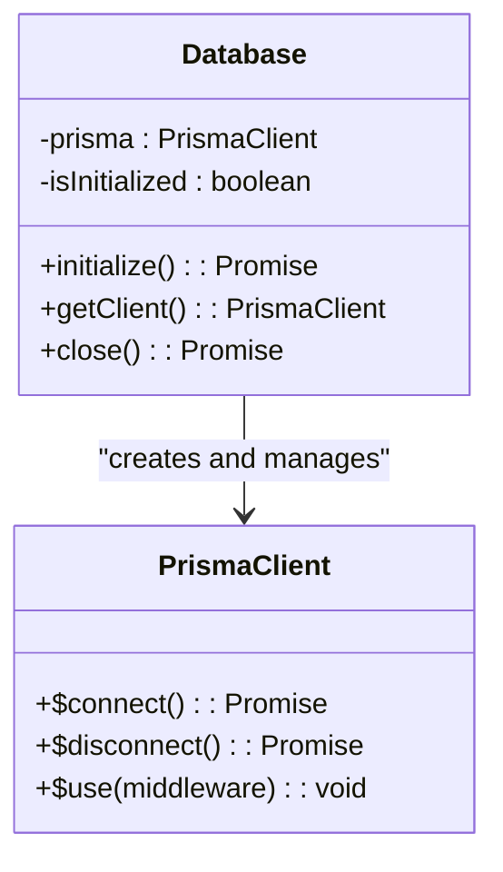
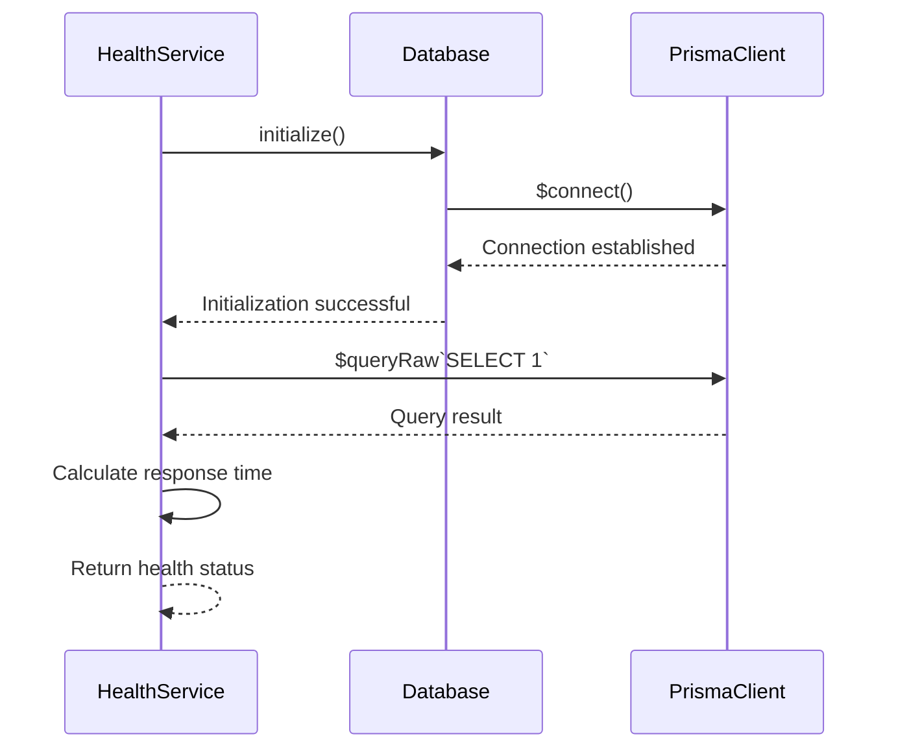
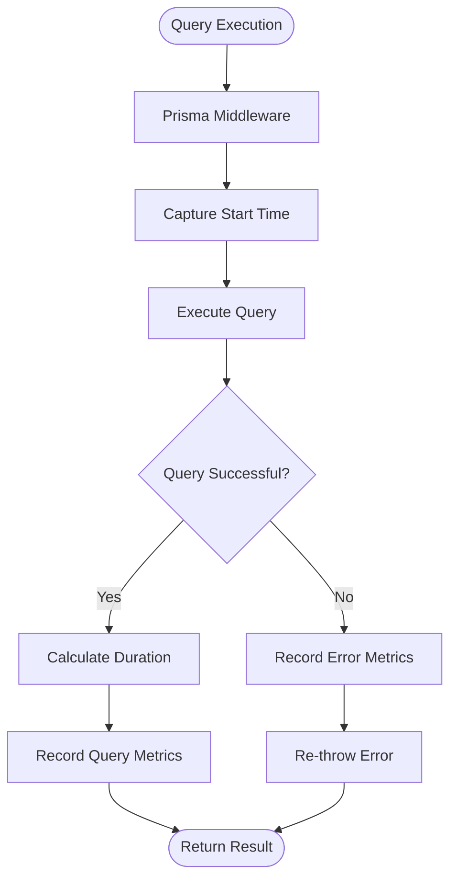
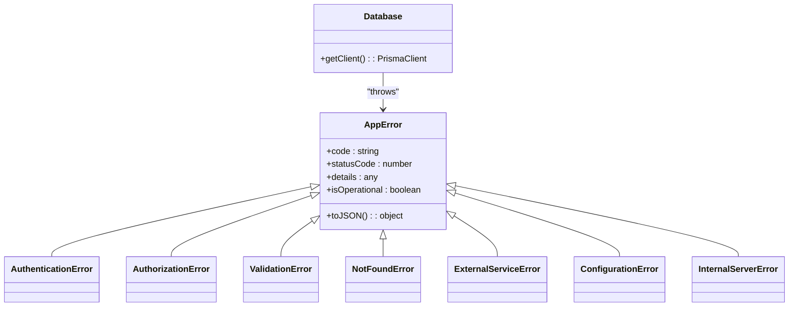

# Data Access Patterns

<cite>
**Referenced Files in This Document**   
- [database.js](file://apps/admin-api/src/lib/database.js)
- [db.ts](file://apps/web/lib/db.ts)
- [schema.prisma](file://apps/admin-api/prisma/schema.prisma)
- [schema.prisma](file://apps/web/prisma/schema.prisma)
- [metrics.js](file://apps/admin-api/src/lib/monitoring/metrics.js)
- [health.js](file://apps/admin-api/src/services/health.js)
- [config.js](file://apps/admin-api/src/config.js)
</cite>

## Table of Contents
1. [Introduction](#introduction)
2. [Prisma Client Initialization and Singleton Management](#prisma-client-initialization-and-singleton-management)
3. [Database Health Checks and Connection Testing](#database-health-checks-and-connection-testing)
4. [Graceful Shutdown Procedures](#graceful-shutdown-procedures)
5. [Prisma Middleware for Query Instrumentation](#prisma-middleware-for-query-instrumentation)
6. [CRUD Operations and Transaction Usage](#crud-operations-and-transaction-usage)
7. [Relation Loading Strategies](#relation-loading-strategies)
8. [Error Handling and Retry Mechanisms](#error-handling-and-retry-mechanisms)
9. [Performance Considerations](#performance-considerations)
10. [Differences in Data Access Between Backend Services and Frontend API Routes](#differences-in-data-access-between-backend-services-and-frontend-api-routes)

## Introduction
The slimy-monorepo platform employs Prisma as its primary ORM for database interactions across multiple applications. This document details the data access patterns used throughout the platform, focusing on how Prisma Client is initialized and managed, database health monitoring, query instrumentation, and performance optimization strategies. The platform uses MySQL as its primary database with Prisma Client providing type-safe database access across both backend services and frontend API routes.

## Prisma Client Initialization and Singleton Management
The slimy-monorepo platform implements a singleton pattern for Prisma Client initialization to ensure efficient connection pooling and lifecycle management. In the admin-api application, the Database class encapsulates the Prisma Client instance and provides a controlled interface for database operations.

The initialization process begins with the Database class constructor, which maintains a null reference to the Prisma client until explicit initialization. The `initialize()` method creates a new PrismaClient instance with configurable logging levels from the application configuration. Connection pooling is managed automatically by Prisma Client, with connection limits and other pool settings controlled through the underlying database driver.

**Diagram sources**
- [database.js](file://apps/admin-api/src/lib/database.js#L6-L72)

**Section sources**
- [database.js](file://apps/admin-api/src/lib/database.js#L6-L72)

## Database Health Checks and Connection Testing
The platform implements comprehensive database health monitoring through multiple mechanisms. The admin-api service includes a health service that performs database connectivity tests as part of its health checks. The Database class provides an initialization process that tests the database connection by attempting to establish a connection during startup.

In the web application, explicit health check functions are implemented to monitor database status. The `testDbConnection()` function executes a simple SQL query (`SELECT 1`) to verify connectivity, while the `getDbHealth()` function measures response time and returns detailed health information including success status, response time, and error details if applicable.

**Diagram sources**
- [db.ts](file://apps/web/lib/db.ts#L47-L80)
- [health.js](file://apps/admin-api/src/services/health.js)

**Section sources**
- [db.ts](file://apps/web/lib/db.ts#L47-L80)
- [health.js](file://apps/admin-api/src/services/health.js)

## Graceful Shutdown Procedures
The platform implements graceful shutdown procedures to ensure proper cleanup of database connections during application termination. The Database class in admin-api provides a `close()` method that disconnects the Prisma client and updates connection metrics. This method is designed to be called during application shutdown to ensure all pending operations complete and connections are properly released.

In the web application, the `disconnectDb()` function provides a clean way to disconnect from the database, which should be called during application shutdown. The singleton pattern used in both applications ensures that there is a single point of control for database connection lifecycle management, making it easier to implement consistent shutdown procedures across the platform.

**Section sources**
- [database.js](file://apps/admin-api/src/lib/database.js#L65-L72)
- [db.ts](file://apps/web/lib/db.ts#L40-L42)

## Prisma Middleware for Query Instrumentation
The platform leverages Prisma middleware for query instrumentation and metrics collection. In the admin-api application, middleware is registered during database initialization to track query performance. The middleware captures the start time of each query, calculates the duration, and records metrics using the platform's monitoring system.

When a query is executed, the middleware intercepts it, records the start time, passes it to the next handler, and then captures the result or error. Upon completion, it calculates the query duration and calls `metrics.recordDatabaseQuery()` to update performance metrics. If an error occurs, it also increments the error counter while preserving the original error.

**Diagram sources**
- [database.js](file://apps/admin-api/src/lib/database.js#L23-L36)
- [metrics.js](file://apps/admin-api/src/lib/monitoring/metrics.js)

**Section sources**
- [database.js](file://apps/admin-api/src/lib/database.js#L23-L36)

## CRUD Operations and Transaction Usage
The platform implements comprehensive CRUD operations through the Database class in admin-api, which provides dedicated methods for common operations across various entities including users, guilds, sessions, and audit logs. Each entity type has corresponding create, read, update, and delete methods that encapsulate the Prisma Client operations.

For transactional operations, the platform uses Prisma's built-in transaction support. The Database class exposes direct access to the Prisma client, allowing services to use `$transaction()` for multi-operation transactions. The schema includes appropriate constraints and cascading behaviors to maintain data integrity, with foreign key relationships configured with Cascade or SetNull onDelete behaviors.

**Section sources**
- [database.js](file://apps/admin-api/src/lib/database.js#L209-L677)

## Relation Loading Strategies
The platform employs strategic relation loading patterns to optimize performance and avoid N+1 query problems. The Prisma schema defines relationships between models using the `@relation` attribute, and the application code uses Prisma's include and select options to control relation loading.

For example, when retrieving a user's session, the code uses `include: { user: true }` to eagerly load the related user data in a single query. Similarly, audit log queries include user data with specific field selection to minimize data transfer. The platform balances eager loading for frequently accessed relations with selective field inclusion to optimize query performance.

**Section sources**
- [database.js](file://apps/admin-api/src/lib/database.js#L275-L278)

## Error Handling and Retry Mechanisms
The platform implements robust error handling patterns for database operations. Custom error classes extend a base AppError class, providing standardized error codes, HTTP status mappings, and operational error flags. Database-specific errors are caught and wrapped in appropriate error types with meaningful messages and details.

The error handling system distinguishes between operational errors (expected issues like validation failures) and programming errors (unexpected issues). Operational errors are handled gracefully and returned to clients with appropriate status codes, while programming errors trigger detailed logging and monitoring alerts. The platform does not implement automatic retry mechanisms for database operations, instead relying on higher-level application logic to handle transient failures.

**Diagram sources**
- [errors.js](file://apps/admin-api/src/lib/errors.js)
- [database.js](file://apps/admin-api/src/lib/database.js)

**Section sources**
- [errors.js](file://apps/admin-api/src/lib/errors.js)
- [database.js](file://apps/admin-api/src/lib/database.js)

## Performance Considerations
The platform incorporates several performance optimization strategies for database access. The Prisma schema includes numerous indexes on frequently queried fields such as createdAt, updatedAt, userId, guildId, and various composite indexes to support common query patterns. These indexes are defined using the `@@index` attribute in the schema.

Query optimization is achieved through selective field loading using Prisma's select option, which reduces data transfer overhead. The platform also implements connection pooling through Prisma Client's built-in pooling mechanism, with connection limits configured based on the environment. Batch operations are supported through Prisma's createMany, updateMany, and deleteMany methods, though specific usage patterns are not evident in the analyzed code.

**Section sources**
- [schema.prisma](file://apps/admin-api/prisma/schema.prisma)
- [schema.prisma](file://apps/web/prisma/schema.prisma)

## Differences in Data Access Between Backend Services and Frontend API Routes
The platform exhibits distinct data access patterns between backend services and frontend API routes. The admin-api backend service uses a dedicated Database class that encapsulates the Prisma client and provides a service layer with typed methods for common operations. This approach provides type safety, centralized error handling, and consistent query patterns.

In contrast, the web application uses a simpler singleton pattern where the Prisma client is exported directly as a `db` instance. This approach is suitable for Next.js API routes where direct Prisma access is common. The web application also includes a deprecated mock database implementation in the club feature, indicating a transition toward using the standard Prisma client.

The backend services implement more sophisticated patterns including middleware for metrics collection and comprehensive error handling, while the frontend API routes rely more on direct Prisma operations with simpler error handling. Both approaches use environment-specific configuration for logging levels, with more verbose logging in development environments.

**Section sources**
- [database.js](file://apps/admin-api/src/lib/database.js)
- [db.ts](file://apps/web/lib/db.ts)
- [database.ts](file://apps/web/lib/club/database.ts)