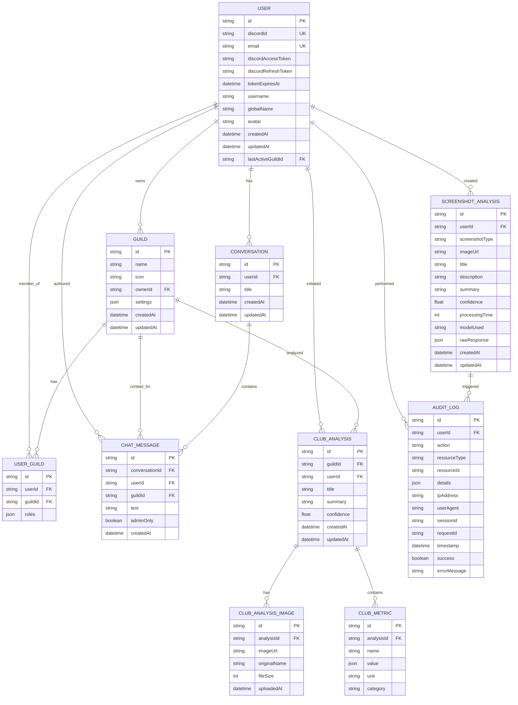
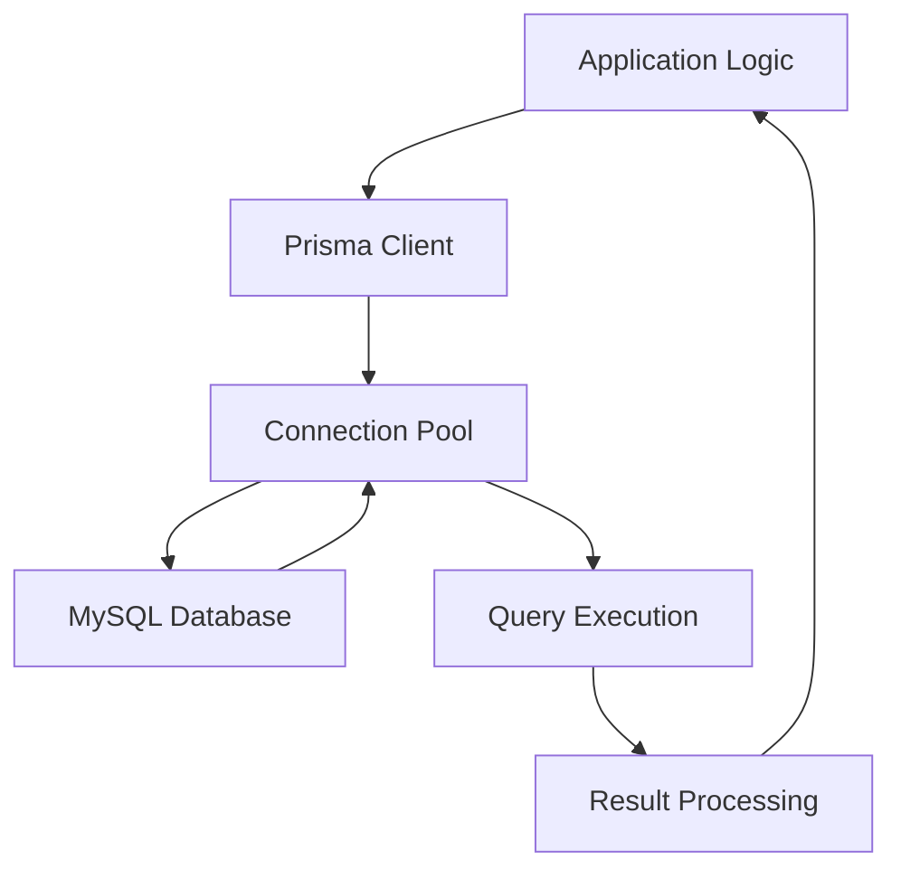
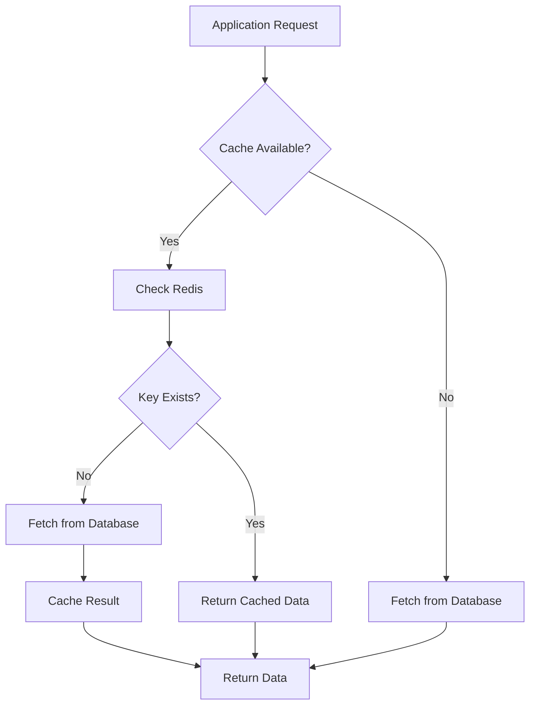
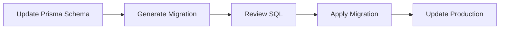

# Data Management

<cite>
**Referenced Files in This Document**   
- [schema.prisma](file://apps/admin-api/prisma/schema.prisma)
- [database.js](file://apps/admin-api/lib/database.js)
- [redis.js](file://apps/admin-api/lib/cache/redis.js)
- [redis.ts](file://apps/web/lib/cache/redis.ts)
- [db.ts](file://apps/web/lib/db.ts)
- [guild.service.js](file://apps/admin-api/src/services/guild.service.js)
- [migration.sql](file://apps/admin-api/prisma/migrations/20241106000000_init/migration.sql)
- [club-schema.sql](file://apps/admin-api/lib/club-schema.sql)
- [guild-settings.sql](file://apps/admin-api/lib/guild-settings.sql)
</cite>

## Table of Contents
1. [Introduction](#introduction)
2. [Core Data Models](#core-data-models)
3. [Database Schema and Relationships](#database-schema-and-relationships)
4. [Data Access Patterns](#data-access-patterns)
5. [Caching Strategy](#caching-strategy)
6. [Database Migration Process](#database-migration-process)
7. [Data Lifecycle Management](#data-lifecycle-management)
8. [Data Security and Access Control](#data-security-and-access-control)
9. [Performance Considerations](#performance-considerations)
10. [Sample Queries](#sample-queries)
11. [Conclusion](#conclusion)

## Introduction

The slimy-monorepo platform utilizes a comprehensive data management system built on MySQL with Prisma ORM for database abstraction. The system supports core entities including User, Guild, Club, Chat, Usage, and Audit logs, with a focus on performance, scalability, and data integrity. This documentation provides a detailed overview of the data model, access patterns, caching strategy, migration process, and security considerations.

**Section sources**
- [schema.prisma](file://apps/admin-api/prisma/schema.prisma)

## Core Data Models

The platform's data model is centered around several key entities that represent the core functionality of the system.

### User Model

The User model represents Discord users with comprehensive profile information and authentication data.

**Key Fields:**
- `id`: Primary identifier (cuid)
- `discordId`: Unique Discord user ID
- `email`: Optional unique email address
- `discordAccessToken` and `discordRefreshToken`: OAuth tokens for Discord API access
- `tokenExpiresAt`: Expiration timestamp for access token
- `username`, `globalName`, `avatar`: User profile information
- `lastActiveGuildId`: Reference to user's last active guild

**Section sources**
- [schema.prisma](file://apps/admin-api/prisma/schema.prisma#L15-L49)

### Guild Model

The Guild model represents Discord servers with ownership and settings.

**Key Fields:**
- `id`: Discord Guild ID (primary key)
- `name`: Guild name
- `icon`: Guild icon URL
- `ownerId`: Reference to owning User
- `settings`: JSON field for guild-specific configuration

**Section sources**
- [schema.prisma](file://apps/admin-api/prisma/schema.prisma#L72-L95)

### Club Model

The Club model encompasses analytics and metrics for club data.

**Key Components:**
- `ClubAnalysis`: Stores AI-generated summaries of club data
- `ClubAnalysisImage`: Images associated with club analyses
- `ClubMetric`: Individual metrics extracted from analyses

**Key Fields:**
- `guildId`: Reference to associated Guild
- `userId`: User who initiated the analysis
- `summary`: AI-generated analysis summary
- `confidence`: Confidence score (0-1)
- `metrics`: Related ClubMetric records with name, value, unit, and category

**Section sources**
- [schema.prisma](file://apps/admin-api/prisma/schema.prisma#L188-L216)

### Chat Model

The Chat model manages conversation history and messages.

**Key Components:**
- `Conversation`: Chat sessions with title and timestamps
- `ChatMessage`: Individual messages within conversations

**Key Fields:**
- `conversationId`: Reference to parent Conversation
- `userId`: Message author
- `guildId`: Optional guild context
- `text`: Message content
- `adminOnly`: Flag for admin-only messages

**Section sources**
- [schema.prisma](file://apps/admin-api/prisma/schema.prisma#L118-L158)

### Usage Model

The Usage model tracks system utilization through statistics.

**Key Fields:**
- `userId` and `guildId`: Context for the statistic
- `type`: Statistic type (e.g., 'message_count', 'command_usage')
- `value`: JSON value (number, string, object, etc.)
- `timestamp`: When the statistic was recorded

**Section sources**
- [schema.prisma](file://apps/admin-api/prisma/schema.prisma#L161-L185)

### Audit Model

The Audit model provides event sourcing and compliance logging.

**Key Fields:**
- `userId`: User who performed the action (nullable for system actions)
- `action`: Action performed (e.g., 'login', 'chat_message')
- `resourceType` and `resourceId`: Type and ID of affected resource
- `details`: Additional action details (JSON)
- `ipAddress` and `userAgent`: Client information
- `success`: Whether the action succeeded
- `errorMessage`: Error message if action failed

**Section sources**
- [schema.prisma](file://apps/admin-api/prisma/schema.prisma#L429-L463)

## Database Schema and Relationships



**Diagram sources**
- [schema.prisma](file://apps/admin-api/prisma/schema.prisma)

## Data Access Patterns

The platform employs Prisma ORM as the primary data access layer, with additional direct database utilities for specific use cases.

### Prisma ORM Usage

The web application uses Prisma Client for type-safe database operations with connection pooling and logging configuration.



**Section sources**
- [db.ts](file://apps/web/lib/db.ts)

### Direct Database Utilities

The admin API provides direct MySQL access through a custom database utility with connection pooling and transaction support.

**Key Features:**
- Connection pooling with mysql2/promise
- Transaction handling with automatic rollback on error
- Query and single result helpers
- Database initialization and health checks

**Section sources**
- [database.js](file://apps/admin-api/lib/database.js)

### Service Layer Patterns

Business logic is encapsulated in service classes that abstract data access details.

**Example: GuildService**
- Provides CRUD operations for Guild entities
- Handles upsert operations for guild connections
- Manages user-guild relationships
- Implements permission checking
- Formats responses for API consumption

**Section sources**
- [guild.service.js](file://apps/admin-api/src/services/guild.service.js)

## Caching Strategy

The platform implements a Redis-based caching strategy to optimize performance and reduce database load.

### Cache Implementation

The web application uses a comprehensive RedisCache class with the following features:

**Key Features:**
- Connection management with error handling
- Data serialization with metadata (timestamp, TTL, source)
- Retry logic for transient failures
- Pattern-based invalidation
- Statistics collection
- Stale-while-revalidate pattern support

**Configuration:**
- Default TTL: 300 seconds (5 minutes)
- Stale TTL: 600 seconds (10 minutes)
- Key prefix: "slimy:"
- Retry attempts: 3
- Retry delay: 1 second



**Section sources**
- [redis.ts](file://apps/web/lib/cache/redis.ts)

### Cache Key Patterns

The system uses consistent key naming conventions:

- `api:endpoint:params`: API response caching
- `db:table:query:params`: Database query caching
- `user:userId:type`: User-specific data
- `guild:guildId:type`: Guild-specific data

**Section sources**
- [redis.ts](file://apps/web/lib/cache/redis.ts#L350-L380)

### Cache Invalidation

The system implements multiple invalidation mechanisms:

- Direct deletion by key
- Pattern-based invalidation (e.g., `guild:123:*`)
- Automatic expiration based on TTL
- Manual clearing of all cache entries

**Section sources**
- [redis.ts](file://apps/web/lib/cache/redis.ts#L189-L203)

## Database Migration Process

The platform uses Prisma Migrate for database schema evolution with additional custom migration scripts for complex operations.

### Prisma Migrate

The primary migration tool is Prisma Migrate, which generates and applies SQL migrations based on the Prisma schema.

**Migration Structure:**
- Timestamp-based migration directories (e.g., 20241106000000_init)
- SQL migration files
- migration_lock.toml for coordination

**Example Migrations:**
- Initial schema creation
- Adding email field to User model
- Adding Discord tokens to User model



**Section sources**
- [schema.prisma](file://apps/admin-api/prisma/schema.prisma)
- [migration.sql](file://apps/admin-api/prisma/migrations/20241106000000_init/migration.sql)

### Custom Migration Scripts

For complex data migrations or operations outside Prisma's capabilities, custom SQL scripts are used.

**Key Scripts:**
- `club-schema.sql`: DDL for club analytics tables with historical metrics
- `guild-settings.sql`: Schema for guild settings storage
- `guild-personality.sql`: Schema for guild personality configurations

These scripts use `IF NOT EXISTS` clauses and `ADD COLUMN IF NOT EXISTS` statements for idempotent execution.

**Section sources**
- [club-schema.sql](file://apps/admin-api/lib/club-schema.sql)
- [guild-settings.sql](file://apps/admin-api/lib/guild-settings.sql)

## Data Lifecycle Management

The platform implements comprehensive data lifecycle management with retention policies and archival rules.

### Data Retention

**User Data:**
- Profile information retained indefinitely while account active
- Authentication tokens retained until expiration or revocation
- Last active guild tracking for session continuity

**Guild Data:**
- Guild metadata retained while guild is connected
- User-guild relationships retained while user is member
- Settings retained while guild is active

**Analytical Data:**
- Club analyses and metrics retained indefinitely
- Screenshot analyses and comparisons retained indefinitely
- Statistical data retained for analytical purposes

**Chat Data:**
- Conversations and messages retained indefinitely
- Admin-only messages subject to stricter access controls

**Audit Data:**
- Audit logs retained for compliance and debugging
- Comprehensive event sourcing for critical operations

### Archival Rules

The current implementation does not include automated archival processes. All data is maintained in the primary database with appropriate indexing for performance.

**Section sources**
- [schema.prisma](file://apps/admin-api/prisma/schema.prisma)

## Data Security and Access Control

The platform implements multiple layers of data security and access control.

### Data Security

**At-Rest Encryption:**
- Database-level encryption handled by MySQL configuration
- Sensitive fields (tokens) stored in database with standard protections

**In-Transit Encryption:**
- TLS/SSL for database connections
- HTTPS for all API communications

**Field-Level Security:**
- Discord tokens stored in database with appropriate access controls
- Email addresses stored with unique constraints
- IP addresses and user agents logged for audit purposes

### Access Control

**Role-Based Access Control (RBAC):**
- User roles stored as JSON arrays in user_guilds table
- Role hierarchy defined in service layer (owner, admin, moderator, member)
- Permission checking implemented in service methods

**Data Access Patterns:**
- Service layer enforces business logic and access rules
- Direct database access abstracted through service interfaces
- API endpoints validate permissions before data access

**Section sources**
- [guild.service.js](file://apps/admin-api/src/services/guild.service.js#L628-L663)

## Performance Considerations

The platform implements several performance optimization strategies.

### Indexing Strategy

Comprehensive indexing is implemented on all core models to support efficient querying.

**Key Indexes:**
- Primary keys on all tables
- Unique constraints on discordId, email, token
- Timestamp indexes for createdAt, updatedAt, timestamp
- Foreign key indexes on all relation fields
- Composite indexes for common query patterns (e.g., userId + createdAt)

**Section sources**
- [schema.prisma](file://apps/admin-api/prisma/schema.prisma)

### Query Optimization

**Best Practices:**
- Use of Prisma's include/select for field-level control
- Pagination for large result sets
- Batch operations for bulk updates
- Connection pooling to reduce connection overhead
- Prepared statements for repeated queries

### Caching Benefits

The Redis caching layer provides significant performance benefits:

- Reduced database load for frequently accessed data
- Lower latency for API responses
- Protection against thundering herd problems
- Improved resilience during database maintenance

## Sample Queries

### User Queries

**Get User with Guilds:**
```prisma
prisma.user.findUnique({
  where: { id: userId },
  include: {
    userGuilds: {
      include: {
        guild: true
      }
    }
  }
})
```

**Find User by Discord ID:**
```prisma
prisma.user.findUnique({
  where: { discordId: discordId }
})
```

### Guild Queries

**Get Guild with Members:**
```prisma
prisma.guild.findUnique({
  where: { id: guildId },
  include: {
    userGuilds: {
      include: {
        user: {
          select: {
            id: true,
            discordId: true,
            username: true,
            globalName: true,
            avatar: true
          }
        }
      }
    },
    _count: {
      select: {
        userGuilds: true,
        chatMessages: true
      }
    }
  }
})
```

**List Guilds with Pagination:**
```prisma
prisma.guild.findMany({
  take: limit,
  skip: offset,
  orderBy: { createdAt: 'desc' },
  include: {
    _count: {
      select: {
        userGuilds: true,
        chatMessages: true
      }
    }
  }
})
```

### Club Analytics Queries

**Get Club Analysis with Metrics:**
```prisma
prisma.clubAnalysis.findUnique({
  where: { id: analysisId },
  include: {
    metrics: true,
    images: true
  }
})
```

**Find Club Metrics by Category:**
```prisma
prisma.clubMetric.findMany({
  where: {
    analysisId: analysisId,
    category: category
  }
})
```

### Audit Queries

**Get Recent Audit Logs:**
```prisma
prisma.auditLog.findMany({
  take: 100,
  orderBy: { timestamp: 'desc' },
  where: {
    userId: userId
  }
})
```

**Find Failed Actions:**
```prisma
prisma.auditLog.findMany({
  where: {
    success: false,
    action: action
  },
  orderBy: { timestamp: 'desc' }
})
```

**Section sources**
- [schema.prisma](file://apps/admin-api/prisma/schema.prisma)

## Conclusion

The slimy-monorepo platform features a robust data management system with a well-defined schema, comprehensive relationships, and optimized access patterns. The combination of Prisma ORM, direct database utilities, and Redis caching provides a flexible and performant foundation for the application's data needs. The migration strategy ensures safe schema evolution, while the security and access control measures protect sensitive information. With proper indexing and caching, the system is well-equipped to handle current and future data requirements.